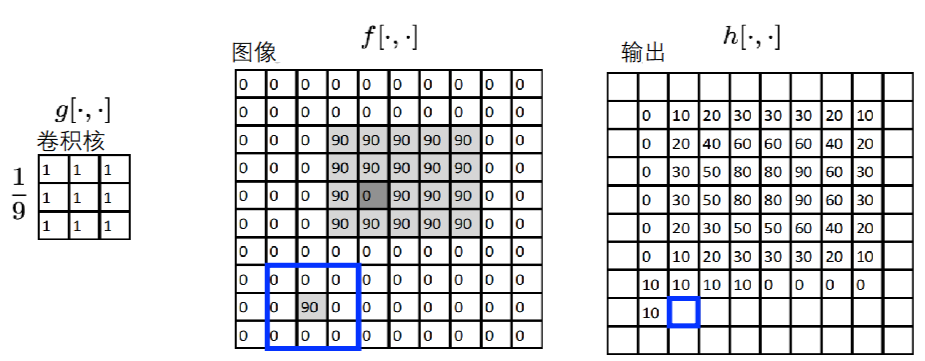
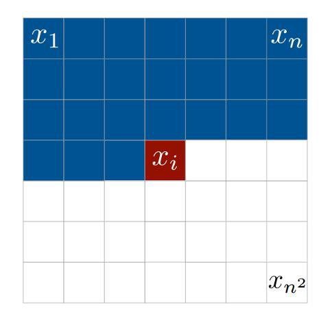

### 绪论

### 前置知识

### CH - 01 滤波器与卷积核

#### 图像直方图

##### 图像的本质：像素矩阵

一张数字图像，尤其是我们这里讨论的**灰度图**，可以被理解为一个二维矩阵。 矩阵中的每一个元素都代表一个像素，其数值被称为像素值或灰度值，表示该点的亮度。 通常，这个值用一个字节（8位）来表示，范围从0到255，其中0代表最暗的黑色，255代表最亮的白色。

##### 什么是图像直方图

图像直方图是一种图形化的表示方法，它显示了一张图像中亮度（灰度）值的分布频率，即统计从0到255的每一个灰度级在这张图像中总共出现了多少次。

<span style="background:rgba(252, 163, 180, 0.55)">将二维的像素空间变换为一维的统计分布</span>。  这让我们能从一个宏观的、统计学的角度来理解图像的整体色调分布。

##### 应用实例

###### 辅助目标检测，减少误报

在目标检测任务中，算法可能会将一些背景区域误判为目标（例如，将一块纹理复杂的背景识别为人脸）。 此时，直方图可以提供一个有效的<span style="background:rgba(252, 163, 180, 0.55)">判别依据</span>。

###### 辅助医疗诊断

#### 图像变换函数

我们将研究如何主动地**修改**这些像素值，从而创造出一张新的图像。

> [!note] 函数定义
> 一个图像可以被定义为一个函数 $f$。这个函数的作用是将一个二维的像素坐标 $(x, y)$ 映射到一个灰度值。

> [!note] 数学表达
> 对于一个矩形图像，这个函数关系可以写成  
> $$
> f:[a,b]\times[c,d]\to[0,255]
> $$
> 其中 $[a,b]\times[c,d]$ 表示图像的坐标范围（宽度和高度），$[0,255]$ 是函数输出的范围，代表可能的灰度值。

**彩色图像**：这个概念同样适用，只是函数的输出不再是一个单一的数值，而是一个包含红 (R)、绿 (G)、蓝 (B) 三个通道值的向量：
$$
f(x, y) =
\begin{bmatrix}
r(x, y) \\
g(x, y) \\
b(x, y)
\end{bmatrix}
$$

**直方图本身就是图像变换函数的一种**。它将整个二维坐标空间 $(x,y)$ 的信息变换（或说聚合）成了一个一维的统计分布。

##### 变换操作：对函数进行运算

###### 对像素值进行运算

例如：

$$g(x,y)=f(x,y)+20$$  

这个操作会遍历每一个坐标 $(x,y)$，读取原始像素值 $f(x,y)$，然后将其增加20，得到新图像的像素值。这种操作会使整张图片变亮。这类只依赖当前点像素值的变换，我们称之为**点操作**。更多点操作的例子，如通过 $255-x$ 实现颜色翻转，或通过 $x\cdot2$ 来增强对比度。

###### 对坐标进行运算

例如：  
$$g(x,y)=f(-x,y)$$  
这个操作在计算新图像 $(x,y)$ 位置的像素值时，会去采样原始图像 $(-x,y)$ 位置的像素值。其最终效果是将图像**水平翻转**。

如果我们想让新像素值不仅与当前点有关，**还受到其周围邻近像素的影响**，应该怎么做呢？

#### 图像滤波

##### 什么是图像滤波，为何需要它

> [!note] 图像滤波定义
> 图像滤波是生成新图像的过程，其中每个新像素的值由原始图像对应位置及其局部邻域的像素值共同决定。也就是说，计算新图像某一点时，需要参考该点及其周围的一小块区域的像素信息。

> [!note] 目的
> 我们进行滤波是为了从图像中提取有用信息或增强图像，包括：
> - **增强与美化**：去除噪声、平滑或锐化图像，使其更清晰。
> - **特征提取**：提取物体的边缘或轮廓，为后续形状识别提供基础。

**核心机制：卷积核 (Kernel) 与卷积 (Convolution)**

##### 盒式滤波器



> [!note] 特征图大小计算
> 在卷积神经网络中，输出特征图的大小由以下公式计算：
> 
> $$ O = \frac{(I - K + 2P)}{S} + 1 $$
> 
> 其中：
> 
> - \( O \) 是输出特征图的尺寸。
> 
> - \( I \) 是输入图像的尺寸。
> 
> - \( K \) 是卷积核的尺寸。
> 
> - \( P \) 是填充（Padding）的大小。
> 
> - \( S \) 是步长（Stride）。

##### 高斯滤波器

从二维高斯函数推导而来，滤波器的数学表达式为：  

$$ f(i,j) = \frac{1}{2\pi\sigma^2} e^{-\frac{i^2 + j^2}{2\sigma^2}} $$  

- \( i,j \)：相对于滤波器中心像素的坐标偏移（横向、纵向距离）  
- \( \sigma \)：高斯分布的标准差，控制“权重衰减速度”（\(\sigma\) 越大，权重随距离下降越慢，滤波后图像越模糊 ）  
- 本质是**加权平均**：中心像素权重最高，距离越远权重越小，实现“<span style="background:rgba(252, 163, 180, 0.55)">平滑图像、抑制噪声</span>”的效果。  

高斯滤波器用 “中心权重高、边缘权重低” 的高斯分布给像素加权，实践中靠 **3σ 原则** 截断计算范围，既能高效实现 “平滑降噪”，又贴合数学规律

> [!tip] 可分离滤波器
> 
> 若一个 2D 滤波器可分解为 “1D 行滤波器 + 1D 列滤波器” 的连续卷积（即 \( \text{2D 卷积} = \text{行卷积} * \text{列卷积} \) ），则称为 **可分离滤波器**。  

###### 高斯滤波器的可分离性  

二维高斯函数可拆解为 **“一维高斯函数的乘积”**：  

$$
f(i,j) = \underbrace{\left( \frac{1}{\sqrt{2\pi}\sigma} e^{-\frac{i^2}{2\sigma^2}} \right)}_{\text{行方向 1D 高斯}} \times \underbrace{\left( \frac{1}{\sqrt{2\pi}\sigma} e^{-\frac{j^2}{2\sigma^2}} \right)}_{\text{列方向 1D 高斯}}
$$  

**对应卷积操作**：  

- 先对图像每行做 **1D 高斯卷积**（用行方向 1D 核）  
- 再对结果每列做 **1D 高斯卷积**（用列方向 1D 核）  
- 效果与直接 2D 高斯卷积 **完全等价**，但计算量从 \( O(N^2) \) 降到 \( O(2N) \)（\( N \) 为滤波器尺寸 ）。  

图片里的 \(3 \times 3\) 核，可分解为：  

- 行方向 1D 核：\(\frac{1}{4}[1, 2, 1]\)（对应一维高斯权重，归一化后和为 1 ）  
- 列方向 1D 核：\(\frac{1}{4}[1, 2, 1]\)  

两次 1D 卷积（先每行、再每列）的结果，与直接 2D 卷积 \( \frac{1}{16}\begin{bmatrix}1&2&1\\2&4&2\\1&2&1\end{bmatrix} \) 完全一致 → **证明高斯滤波器是可分离滤波器**。  

##### 通用滤波器

$$ S[f](m,n) = \sum_{i=-1}^{1} \sum_{j=-1}^{1} w(i,j) f(m + i, n + j) $$  

对图像每个像素 \( f(m,n) \) 及其领域像素进行**加权平均**

#### 卷积特性

##### 线性性质

$$
(w \otimes f)(m,n) = \sum_{i=-k}^{k} \sum_{j=-k}^{k} w(i,j) f(m + i, n + j)
$$  

$$
f'(m, n) = a f(m, n)
$$  

$$
(w \otimes f')(m, n) = a (w \otimes f)(m, n)
$$  

**标量缩放后**，如果输入信号 \( f \) 乘 \( a \)，卷积结果也乘 \( a \) 。例如，图像变亮2倍，经过卷积，依然是变亮的  

$$
(w \otimes f)(m,n) = \sum_{i=-k}^{k} \sum_{j=-k}^{k} w(i,j) f(m + i, n + j)
$$  

$$
f' = a f + b g
$$  

$$
w \otimes f' = a (w \otimes f) + b (w \otimes g)
$$  

**如果输入信号是两个信号的线性组合**，卷积操作可以分开计算，再加权。例如，对整个图的卷积相当于对前景和背景卷积再相加  

##### 平移不变性

$$
(w \otimes f)(m,n) = \sum_{i=-k}^{k} \sum_{j=-k}^{k} w(i,j) f(m + i, n + j)
$$  

$$
f'(m, n) = f(m - m_0, n - n_0)
$$  

| 原始图像 \( f \) | 平移后图像 \( f' \) |  
| :--------------: | :-----------------: |  
| （哈基米的图片）     | （平移后的哈基米图片）  |  

$$
(w \otimes f)(m,n) = \sum_{i=-k}^{k} \sum_{j=-k}^{k} w(i,j) f(m + i, n + j)
$$  

$$
f'(m, n) = f(m - m_0, n - n_0)
$$  

$$
\begin{align*}
(w \otimes f')(m,n) &= \sum_{i=-k}^{k} \sum_{j=-k}^{k} w(i,j) f'\big(m + i,\ n + j\big) \\
&= \sum_{i=-k}^{k} \sum_{j=-k}^{k} w(i,j) f\big((m + i) - m_0,\ (n + j) - n_0\big) \\
&= (w \otimes f)\big(m - m_0,\ n - n_0\big)
\end{align*}
$$  

卷积只考虑**局部结构的相对关系**，不会因图像位置改变而影响计算结果

#### 卷积层及参数运算


### CH - 03 边缘检测

### CH - 04 特征检测

#### 局部不变特征

**1. 全局特征的局限**

全局表征（如整幅图像的像素分布）对遮挡、变形、类别内差异等鲁棒性差，而局部特征（图像块或关键点）可规避这些问题。

> [!note] 类别内差异
> 类别内差异指的是属于**同一类别的不同物体之间存在的差异**。 以猫这个类别为例，不同品种的猫（如布偶猫、暹罗猫、狸花猫等）在外观上会有很大差异，包括毛色、体型、脸部特征等；即使是同一品种的猫，不同个体之间也会有差异，比如眼睛大小、耳朵形状等。同样，在汽车类别中，轿车、SUV、跑车等虽然都属于汽车这一大类，但它们在外观、尺寸、造型等方面存在明显的类别内差异 。

**2. 局部特征的优势**

局部特征可以是 “**图像块（patch，比如截取的一小块图像）**”，也可以是 “**感兴趣的点（keypoint，比如角点、边缘点这些关键位置）**” 。不管哪种形式，核心都是 “**抓局部、抗变化**” 。

- **图像块（Patch）匹配**：需匹配独特性强的图像块（如拼图中易拼接的块），<span style="background:rgba(252, 163, 180, 0.55)">独特性</span>是关键（避免类似块过多导致匹配困难）。  

- **兴趣点（关键点）**：指像素强度、颜色、纹理等在<span style="background:rgba(252, 163, 180, 0.55)">局部发生显著变化</span>的位置，具有稳定性（多幅图像中易找到对应点），可用于估计图像间的几何变换（如拼接、3D 重建）。  

##### 特征描述子

两张图里的兴趣点，咋判断哪些是同一位置的？

- 给兴趣点周围的图像块，生成一段独特的编码。

- 想找两张图的对应点，就 **对比兴趣点周围局部 patch 的特征描述子** ，编码越像，越可能是同一位置的点。

> [!note] example
> 比如描述 “树上的一个分叉点”，会说 “树皮粗糙、分叉角度大、周围有小枝桠”；计算机的特征描述子，就是把这些视觉信息，转成数字编码（比如向量、哈希值），方便对比、判断是否为同一点。

##### 良好特征的 5 大性质

1. **局部性**：特征是“局部的”，不受遮挡、背景杂乱影响（不用先把目标从背景里扣出来）。  

> [!note] 比如拍风景时，树后面的建筑特征，即便被树挡了一部分，局部特征也能单独描述、匹配，不用管树的干扰。  

2. **准确（精确到位）**：能精准定位兴趣点，别“模棱两可”。  

> [!note] 比如找“人脸眼角”的特征，得精准定位到眼角，不能跑到脸颊或额头去。  

3. **可重复（稳定、鲁棒）**：  
    - **不变性 / 协变性（Invariant, Covariant）**：图像变了（旋转、缩放、亮度变），特征还能稳定识别。  
      比如拍同一朵花，手机转个角度、离远点拍，特征描述子得还能认出是同一朵花。  
    - **抗造（噪声、模糊、压缩不怕）**：图像有点糊、有噪点、被压缩过，特征别“失效”。  

> [!note] 比如老照片扫描后有划痕（噪声），特征还能识别照片里的物体。  

4. **独特性**：单个特征，能在一大堆数据里精准匹配。  

> [!note] 比如互联网搜图，一张图的局部特征，能在海量图库中找到对应的图，不用对比整幅图。  

5. **高效**：速度快，接近“实时”。  

> [!note] 比如手机拍照识别景物，刚拍完就能出结果，不能等半天，得高效计算、匹配特征。  

##### 不变性（Invariant）” 和 “共变性（Covariant）

1. **不变性（Invariant）**  

- **数学定义**：函数 \( f() \)，对参数做变换 \( T() \) 后，输出不变。  
  公式：
  \[ \text{if } f(x) = y \text{ , then } f(T(x)) = y \]

2. **共变性（Covariant）**  

- **数学定义**：如果函数 \( f() \) 和变换 \( T() \)“交换顺序”后，结果能对应上。  
  公式：
  \[ \text{if } f(x) = y \text{ then } f(T(x)) = T(f(x)) = T(y) \]

> [!error] 不变性保 “特征稳定存在”，共变性保 “特征位置对应”，两者结合才能让算法在图像变换时，既认出特征，又精准匹配位置 。
> 
> - **不变性（Invariant）**：图像变换后，特征 “存在性” 不变（认出是同一特征）；
> 
> - **共变性（Covariant）**：图像变换后，特征 “位置 / 形态” 跟着变，但和变换对应（找到特征新位置）；

> [!note] 全景拼接的完整流程
> 
> **第1步：提取特征**  
> 
> 和之前讲的一样 —— 用算法（比如角点检测、SIFT 等），找出两张图里的关键点（独特、稳定的局部特征）。  
> 
> **第2步：匹配特征**  
> 
> 对比两张图的关键点，找到相互对应的特征（比如左边图的山顶点，和右边图的山顶点对应）。  
> 
> **第3步：对齐图像**  
> 
> 根据匹配好的特征点，计算两张图的“空间变换关系”（比如旋转、平移、缩放参数），把两张图“对齐”到同一坐标系。  

##### 特征选择

**特征要求**：有明显**不同方向**的梯度

**结论**：**角点**很适合当匹配特征！

因为角点的特点就是 “多方向梯度变化大”（比如一个直角，水平和垂直方向都有明显梯度），这样的特征 独特性强、稳定，在两张图里容易对应上，匹配更准。

##### 什么是<span style="background:rgba(252, 163, 180, 0.55)">角点</span>

直观理解，就是 “**轮廓线交界处**” （比如墙的转角、塔楼的边缘交汇点）。

###### 特点

- **视角变化时更稳定**：不管从哪个角度拍这栋建筑，角点的特征都不容易变（对比纹理平滑的墙面，视角一变就难识别，角点更“扛造” ）。  
- **周围梯度变化大**：角点周围，不同方向（比如水平、垂直）的像素变化都很明显（梯度大）。不像平滑区域，各方向变化都小；也不像边缘，只有一个方向变化大。  
- **适合当匹配特征**：因为稳定、独特，角点能当“锚点”，帮计算机在不同图像里找对应位置（比如全景拼接、图像检索时，用角点匹配超方便 ）。  

#### 关键点定位


### Course 10 注意力和Transformers

> [!tip] 前置问题
> 1. 从NLP跨界到CV的里程碑工作是什么？
> 2. BERT、GPT-3、T5这些模型都是什么机制？
> 3. 这两种注意力机制有什么共同点和差异？

#### 理解注意力（空间特征 v.s. 注意力）


### 生成模型

> [!tip] 前置问题
> 1. 自编码器（AE）是什么？AE和变分自编码器（VAE）有什么区别？
> 2. GAN的灵感来源是什么？
> 3. 生成式模型与判别式模型的区别是什么？

#### PixelCNN

##### 完全可见置信网络 (Fully Visible Belief Networks, FVBN)

> [!note] FVBN的概率分解机制
> FVBN 将 $n$ 维观测变量 $\mathbf{x} = (x_1, x_2, \ldots, x_n)$ 的联合概率 $p(\mathbf{x})$ 分解为一系列条件概率的乘积：
>
> $$
> p(\mathbf{x}) = \prod_{i=1}^{n} p(x_i \mid x_1, x_2, \ldots, x_{i-1})
> $$
>
> 其中，每个条件概率 $p(x_i \mid x_{<i})$ 表示当前变量 $x_i$ 对之前所有变量 $x_1$ 到 $x_{i-1}$ 的依赖关系。这种分解方式基于概率图模型中的完全有向图结构，所有节点（变量）之间均存在显式的依赖连接。
>
> 即**按照固定的顺序一块一块地拼图，而且每一步都要计算下一块拼图该怎么放**。

其属于**显式密度建模 (Explicit Density Modeling)** 的范畴，

> [!note] 定义
> 显式密度建模是指通过数学形式显式地定义概率密度函数 $p_{\text{model}}(x; \theta)$，其中 $\theta$ 为模型参数。该密度函数能够直接计算观测数据 $x$ 的似然值，并通过最大化似然估计（MLE）或贝叶斯推断等方法优化参数，使得模型分布 $p_{\text{model}}$ 尽可能接近真实数据分布 $p_{\text{data}}$。

$$p(x) = p(x_1, x_2, \ldots, x_n)$$

其中，图像`x`被视为一个`n`维的随机向量，`x₁`到`xₙ`是它的各个分量，即图像中的每一个像素。

因此，$p(x)$就是所有`n`个像素的**联合概率分布**。该模型的挑战在于，图像像素之间存在着复杂的空间依赖关系，导致这个联合分布的<span style="background:rgba(252, 163, 180, 0.55)">维度极高</span>且<span style="background:rgba(252, 163, 180, 0.55)">结构复杂</span>。

但是一口气计算这个联合分布概率实在是困难，我们不一口气画完整张图，而是**一个像素一个像素地画**。就像写文章时一个词一个词地写，即通过 **链式法则 (Chain Rule)** 实现对显式概率密度的建模

分解后的形式为：

$$
p(x) = \prod_{i=1}^{n} p(x_i \mid x_1, \ldots, x_{i-1})
$$

这个公式将一个难以处理的高维联合概率，精确地转换为了`n`个一维条件概率的乘积 。



###### 自回归建模 (Autoregressive Modeling)

> [!note] 定义
> 给定一个 $D$ 维随机变量 $\mathbf{x} = (x_1, x_2, \ldots, x_D)$，其联合概率分布 $p(\mathbf{x})$ 被分解为：
> $$
> p(\mathbf{x}) = \prod_{i=1}^{D} p(x_i \mid x_1, x_2, \ldots, x_{i-1})
> $$
> 其中 $p(x_i \mid x_{<i})$ 表示变量 $x_i$ 在给定所有前序变量 $x_1, \ldots, x_{i-1}$ 下的条件概率。  
> 这种分解方式称为**自回归分解（Autoregressive Decomposition）**，因为每个变量“回归”于其前面的变量。

- 该分解具有**自回归**的性质：第 $i$ 个像素 $x_i$ 的概率分布，只依赖于它之前的所有像素 $x_1$ 至 $x_{i-1}$ 。这为生成过程定义了一个明确的、有序的依赖关系和计算顺序，如图所示，从左上角第一个像素 $x_1$ 开始，依次生成直到最后一个像素 $x_n$ 。

- 每一个条件概率 $p(x_i \mid x_1, \ldots, x_{i-1})$ 都是一个一维的概率分布，其**参数由之前的像素值（即条件）所决定**。

###### 参数化与优化 (Parameterization and Optimization):

- **参数化**：像素值之间的条件依赖关系极其复杂，无法用简单的函数来描述。因此，我们使用神经网络来对这些条件概率分布进行参数化。神经网络的强大拟合能力使其可以学习从条件（$x_1$ 到 $x_{i-1}$）到目标像素 $x_i$ 分布的复杂映射。

- **优化**：模型的训练目标是**最大化训练数据的对数似然 (Maximize Log-Likelihood)**。通过在整个训练集上最大化 $\log p(\mathbf{x})$，模型被驱动去学习能够最好地解释观测数据的参数，从而捕获真实数据的内在分布。

##### PixelCNN

> [!note] 定义
> 给定一张图像 $\mathbf{x}$（尺寸为 $n \times n \times C$，其中 $C$ 为通道数，如 RGB 图像的 $C = 3$），PixelCNN 将联合概率 $p(\mathbf{x})$ 分解为序列条件概率的乘积：
> $$
> p(\mathbf{x}) = \prod_{i=1}^{n^2} p(x_i \mid x_1, x_2, \ldots, x_{i-1})
> $$
> 其中：
> - $x_i$ 表示按光栅扫描顺序（左上到右下）排列的第 $i$ 个像素；
> - 每个 $p(x_i \mid x_{<i})$ 是给定前序像素时当前像素的条件概率，通过神经网络建模。
>
> 对于 RGB 图像，条件概率进一步分解为通道间的依赖关系：
> $$
> p(x_i \mid x_{<i}) = p(x_{i,R} \mid x_{<i}) \cdot p(x_{i,G} \mid x_{<i}, x_{i,R}) \cdot p(x_{i,B} \mid x_{<i}, x_{i,R}, x_{i,G})
> $$
> 即 R 通道仅依赖前序像素，G 通道额外依赖当前像素的 R 值，B 通道依赖 R 和 G 值。

###### 核心机制：带掩码的卷积 (Masked Convolution)

- 与前一页提出的基于链式法则的自回归思想一致，PixelCNN 旨在对每个像素 $x_i$ 的条件概率分布 $p(x_i \mid x_{<i})$ 进行建模。
- 它创新性地使用**卷积神经网络 (CNN)** 来捕获这种条件依赖性。为保证自回归特性——即模型在预测 $x_i$ 时只能利用其上下文 (causal context)，即已经生成的像素——PixelCNN采用了一种特殊的**带掩码的卷积 (Masked Convolution)**。
- 这种掩码将卷积核中对应于当前及<span style="background:rgba(252, 163, 180, 0.55)">未来像素位置的权重置为零</span>，从而确保了信息流的单向性，严格遵守了概率的有序分解。

###### 与PixelRNN的对比与优势

- PixelRNN使用循环神经网络（RNN）来建模像素间的序列依赖关系，其计算是严格串行的。
- PixelCNN利用卷积操作，可以在**训练阶段**并行计算所有像素位置的条件分布。这是因为训练时整张图像是已知的，卷积可以在整个图像上一次性完成。这使得其训练效率远高于PixelRNN。

###### 主要局限性：串行生成过程 (Sequential Generation)

- 尽管训练过程可以并行化，但其**生成（采样）过程**仍然是严格串行的。
- 为了生成一个新样本，模型必须从 $x_1$ 开始，依次生成 $x_2$，$x_3$，… 直至 $x_n$。每生成一个像素，都需要将之前所有生成的像素作为输入，进行一次完整的前向传播。
- 因此，生成一张 $N \times N$ 的图像需要进行 $N^2$ 次网络前向传播。例如，对于一张32x32的图像，这需要1024次前向传播，导致其生成速度极其缓慢，这是该方法在实际应用中的一个主要瓶颈。

##### <span style="font-weight:bold; color:rgb(255, 177, 10)">优点 (Advantages)</span>

1. **可计算的精确似然 (Tractable Exact Likelihood)**：PixelCNN 作为一个显式密度模型，其最主要的优势是能够为任意给定图像 $x$ 计算出精确的似然值 $p(x)$ 。这不仅为模型的性能评估提供了量化指标，也使其适用于异常检测等需要精确概率值的任务。

2. **稳定的优化过程 (Stable Optimization)**：该模型的目标函数是最大化对数似然，这是一个定义良好且稳定的优化目标。相比于GAN等需要处理对抗性博弈的模型，PixelCNN的训练过程通常更加直接和收敛。

3. **可观的样本质量 (Decent Sample Quality)**：PixelCNN 能够生成质量尚可的样本，在早期的生成模型中具有很强的竞争力。

##### 性能提升方法 (Performance Enhancement Methods):

为了克服原生PixelCNN的局限性并提升其生成样本的质量，后续研究提出了一系列改进措施：

- **门控卷积层 (Gated Convolutional Layers)**：引入门控机制（如Gated PixelCNN），为网络增加了乘性的非线性交互，使其能学习更复杂的像素依赖关系。

> [!note] 数学原理
> - **核心思想**：通过乘性非线性交互增强模型表达能力。
> - **双路卷积计算**：输入特征图 $x$ 经过卷积层，生成两倍通道数的输出：
>   $$
>   \text{combined} = W * x
>   $$
> - **门控分离**：将输出沿通道维度拆分为门控信号和特征信号：
>   $$
>   \text{gate}, \text{feature} = \text{chunk}(\text{combined}, 2, \text{dim} = 1)
>   $$
> - **动态特征调制**：门控信号经 sigmoid 激活生成权重，与特征信号逐元素相乘：
>   $$
>   h = \sigma(\text{gate}) \odot \text{feature}
>   $$
> - **梯度流动分析**：反向传播时，梯度可通过两条路径传播，有效缓解梯度消失问题：
>   $$
>   \frac{\partial h}{\partial x} = \sigma'(\text{gate}) \odot \text{feature} + \sigma(\text{gate}) \odot W_f
>   $$

```python
import torch
import torch.nn as nn
import torch.nn.functional as F

class GatedPixelCNNBlock(nn.Module):
    def __init__(self, in_channels, out_channels, kernel_size=3, padding=1):
        super().__init__()
        # 门控卷积层
        self.conv = nn.Conv2d(in_channels, 2 * out_channels, 
                             kernel_size=kernel_size, 
                             padding=padding)
        
        # 垂直堆叠的掩码卷积（保持因果性）
        self.mask_conv = nn.Conv2d(out_channels, 2 * out_channels,
                                  kernel_size=kernel_size,
                                  padding=padding)
        
        # 初始化门控卷积权重
        nn.init.kaiming_normal_(self.conv.weight)
        nn.init.zeros_(self.conv.bias)

    def forward(self, x):
        # 标准门控卷积
        total_features = self.conv(x)
        gate, features = torch.chunk(total_features, 2, dim=1)
        gated_features = torch.sigmoid(gate) * features
        
        # 添加掩码卷积路径
        masked = self.mask_conv(gated_features)
        gate_m, feat_m = torch.chunk(masked, 2, dim=1)
        
        # 残差连接
        return x + (torch.sigmoid(gate_m) * feat_m)
```

- **快速连接 (Short-cut connections)**：采用类似ResNet的残差或跳跃连接，以缓解深度网络中的梯度消失问题，使模型能够构建得更深，从而学习更长距离的依赖。

> [!note] ResNet（残差网络）
> ResNet（Residual Network）由微软研究院的 Kaiming He 等人在 2015 年提出，是一种深度卷积神经网络架构。其核心创新在于通过**残差学习**和**跳跃连接（Skip Connection）**，有效解决了深层网络训练中的梯度消失和网络退化问题，使得训练超过 100 层的超深网络成为可能。
>
> - **传统网络的局限性**：深层网络容易出现梯度消失或网络退化（层数增加后准确率反而下降），因为多层非线性变换难以直接拟合恒等映射（Identity Mapping）。
> - **残差块的引入**：ResNet 将目标映射 $H(x)$ 分解为 $H(x) = F(x) + x$，其中 $x$ 是输入（通过跳跃连接直接传递），$F(x)$ 是残差函数，由卷积层学习输入与输出之间的差异（残差）。
> - **优势**：学习残差比直接学习原始映射更容易，尤其当 $H(x) \approx x$ 时，残差 $F(x)$ 趋近于 0，网络可通过跳跃连接保留原始信息。

- **离散化的逻辑损失 (Discretized Logistic Loss)**：相较于标准的Softmax损失，使用混合离散逻辑分布作为损失函数能更好地对像素值的连续性进行建模，从而提升生成样本的视觉质量。
- **多尺度建模 (Multi-scale Modeling)**：通过多尺度架构，让模型在不同分辨率上捕获图像的全局结构和局部细节，有效扩展了模型的感受野和建模能力。
- **训练技巧 (Training Tricks)**：包括但不限于学习率调度、数据增强、优化器选择等一系列在实践中被证明有效的训练策略。

#### 变分自编码器（VAE）

