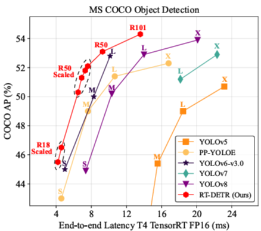
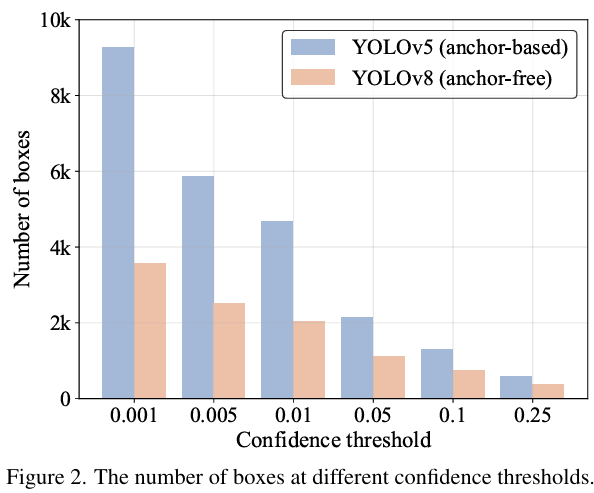

### Abstract

The YOLO series has become the most popular framework for real-time object detection due to its reasonable trade-off between speed and accuracy.  

However, we observe that the speed and accuracy of YOLOs are negatively affected by the NMS. 

>[!tip] The Trouble with YOLO:  
> It relies on a post-processing step called NMS (Non-Maximum Suppression). You can think of YOLO as "casting a net to catch fish"—it throws out many overlapping boxes at once, and NMS is used to filter out the redundant ones, keeping only the best. This filtering process slows down the overall speed and affects performance.

Recently, end-to-end Transformer-based detectors (DETRs) have provided an alternative to eliminating NMS.  Nevertheless, the high computational cost limits their practicality and hinders them from fully exploiting the advantage of excluding NMS.

>[!tip] E2E vs Non-E2E
>
> **E2E:** 
>
> This is a design concept for a model or system. It refers to taking a complex task, from the original input ("one end") directly to the final output ("the other end") in one step, and entrusting all the intermediate processes to a single, unified neural network model to learn and process, without human intervention or splitting into multiple independent modules.
>
> **Non-E2E:**
>
> It splits a complex task into multiple independent, sequential subtasks (modules). Each module is responsible for handling a part of the work and uses its output as the input of the next module. These modules are usually designed and trained independently.

In this paper, we propose the Real-Time DEtection TRansformer (RT-DETR), the first real-time end-to-end object detector to our best knowledge that addresses the above dilemma.  ... 

Specifically, we design an efficient hybrid encoder to expeditiously process multi-scale features... to improve speed.  

>[!tip] Innovation 01 (To speed up)
>
> The encoder is the part of the model that is responsible for "reading" and understanding the features of the image. The encoder of traditional DETR is very computationally intensive.
>
> RT-DETR is cleverly designed. It decouples the interaction of features at different scales and processes features in a smarter and less computationally expensive way, thereby greatly improving the speed.

Then, we propose the uncertainty-minimal query selection to provide high-quality initial queries to the decoder, thereby improving accuracy.  

>[!tip] Innovation 02 (For accuracy)
>
> Think of a query as a "probe" that the model sends out to find an object. The initial quality of the probe determines whether the object can be found quickly and accurately in the end.
>
> This method can help the model select very high-quality initial "probes", making subsequent detection more accurate.

In addition, RT-DETR supports flexible speed tuning by adjusting the number of decoder layers to adapt to various scenarios without retraining.

#### RT-DETR Core Performance Comparison Table

| Model | Comparison Target | Dataset | Accuracy (AP) | Speed (FPS) | Notes |
| :--- | :--- | :--- | :--- | :--- | :--- |
| **RT-DETR-R50** | Advanced YOLOs | COCO | 53.1% | 108 | Outperforms YOLOs in both speed and accuracy. |
| **RT-DETR-R101** | Advanced YOLOs | COCO | 54.3% | 74 | Outperforms YOLOs in both speed and accuracy. |
| **RT-DETR-R50** | DINO-R50 | COCO | **2.2%** higher | ~**21x** faster | |
| **RT-DETR-R50** | (Performance Showcase) | Objects365 (pre-training) | 55.3% | - | Accuracy after pre-training on a larger dataset. |
| **RT-DETR-R101** | (Performance Showcase) | Objects365 (pre-training) | 56.2% | - | Accuracy after pre-training on a larger dataset. |

### Introduction

NMS not only slows down the inference speed, but worse, it introduces hyperparameters that need to be set manually. These hyperparameters can cause instability in the speed and accuracy of the model.

>[!tip] hyperparameters
> Hyperparameters (such as learning rate, number of neural network layers) are teaching rules set by the teacher in advance, such as "review your notes several times a day"

### End-to-end Speed of Detectors

#### Analysis of NMS

>[!note] Experiment 1: Sensitivity of NMS to “Confidence Threshold” (Corresponding to Figure 2)
>
> >[!tip] Confidence threshold
> > Before NMS processing, the model will filter out some prediction boxes with very low scores. This "score threshold" is the confidence threshold.
>
> 
>
> The results are clear at a glance. When the confidence threshold is set very low (such as 0.001), there are tens of thousands of boxes to process, while when the threshold is increased, the number of boxes to process decreases dramatically.
> >[!tip] Conclusion
> > This proves that the computational load of NMS is extremely sensitive to this "threshold" setting.

