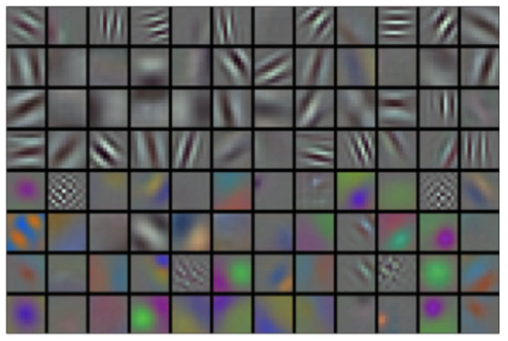
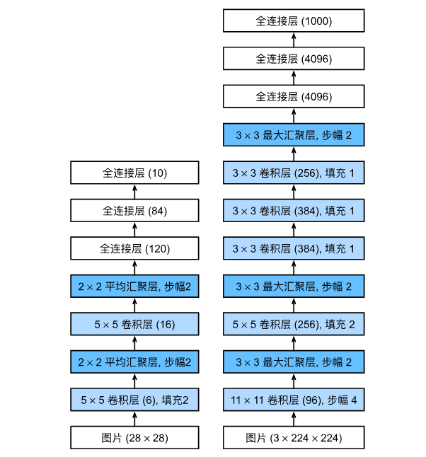

### Reference

### Progress

| 章节 | 教材 | 代码复现 |
| ---- | ---- | ---- |
| 2.1 数据操作 | ✅ |  |
| 2.2 数据预处理 | ✅ |  |
| 2.3 线性代数 | ✅ |  |
| 2.4 微积分 | ✅ |  |
| 2.5 自动微分 | ✅ |  |
| 2.6 概率 | ✅ |  |
| 2.7 查阅文档 | ✅ |  |
| 3.1 线性回归 | ✅ |  |
| 3.2 线性回归的从零开始实现 | ✅ |  |
| 3.3 线性回归的简洁实现 | ✅ |  |
| 3.4 softmax回归 |✅  |  |
| 3.5 图像分类数据集 |  |  |
| 3.6 softmax回归的从零开始实现 |  |  |
| 3.7 softmax回归的简洁实现 |  |  |
| 4.1 多层感知机 |  |  |
| 4.2 多层感知机的从零开始实现 |  |  |
| 4.3 多层感知机的简洁实现 |  |  |
| 4.4 模型选择、欠拟合和过拟合 |  |  |
| 4.5 权重衰减 |  |  |
| 4.6 暂退法(Dropout) |  |  |
| 4.7 前向传播、反向传播和计算图 |  |  |
| 4.8 数值稳定性和模型初始化 |  |  |
| 4.9 环境和分布偏移 |  |  |
| 4.10 实战Kaggle比赛:预测房价 |  |  |
| 5.1 和块 |  |  |
| 5.2 参数管理 |  |  |
| 5.3 延后初始化 |  |  |
| 5.4 自定义层 |  |  |
| 5.5 读写文件 |  |  |
| 5.6 GPU |  |  |
| 6.1 从全连接层到卷积 |  |  |
| 6.2 图像卷积 |  |  |
| 6.3 填充和步幅 |  |  |
| 6.4 多输入多输出通道 |  |  |
| 6.5 汇聚层 |  |  |
| 6.6 卷积神经网络(LeNet) |  |  |
| 7.1 深度卷积神经网络(AlexNet) |  |  |
| 7.2 使用块的网络(VGG) |  |  |
| 7.3 网络中的网络(NiN) |  |  |
| 7.4 含并行连结的网络(GoogLeNet) |  |  |
| 7.5 批量规范化 |  |  |
| 7.6 残差网络(ResNet) |  |  |
| 7.7 稠密连接网络(DenseNet) |  |  |
| 8.1 序列模型 |  |  |
| 8.2 文本预处理 |  |  |
| 8.3 语言模型和数据集 |  |  |
| 8.4 循环神经网络 |  |  |
| 8.5 循环神经网络的从零开始实现 |  |  |
| 8.6 循环神经网络的简洁实现 |  |  |
| 8.7 通过时间反向传播 |  |  |
| 9.1 门控循环单元(GRU) |  |  |
| 9.2 长短期记忆网络(LSTM) |  |  |
| 9.3 深度循环神经网络 |  |  |
| 9.4 双向循环神经网络 |  |  |
| 9.5 机器翻译与数据集 |  |  |
| 9.6 编码器-解码器架构 |  |  |
| 9.7 序列到序列学习(seq2seq) |  |  |
| 9.8 束搜索 |  |  |
| 10.1 注意力提示 |  |  |
| 10.2 注意力汇聚:Nadaraya-Watson核回归 |  |  |
| 10.3 注意力评分函数 |  |  |
| 10.4 Bahdanau注意力 |  |  |
| 10.5 多头注意力 |  |  |
| 10.6 自注意力和位置编码 |  |  |
| 10.7 Transformer |  |  |
| 11.1 优化和深度学习 |  |  |
| 11.2 梯度下降 |  |  |
| 11.3 随机梯度下降 |  |  |
| 11.4 小批量随机梯度下降 |  |  |
| 11.5 动量法 |  |  |
| 11.6 AdaGrad算法 |  |  |
| 11.7 RMSProp算法 |  |  |
| 11.8 Adadelta |  |  |
| 11.9 Adam算法 |  |  |
| 11.10 学习率调度器 |  |  |
| 12.1 编译器和解释器 |  |  |
| 12.2 异步计算 |  |  |
| 12.3 自动并行 |  |  |
| 12.4 硬件 |  |  |
| 12.5 多GPU训练 |  |  |
| 12.6 多GPU的简洁实现 |  |  |
| 12.7 参数服务器 |  |  |
| 13.1 图像增广 |  |  |
| 13.2 微调 |  |  |
| 13.3 目标检测和边界框 |  |  |
| 13.4 锚框 |  |  |
| 13.5 多尺度目标检测 |  |  |
| 13.6 目标检测数据集 |  |  |
| 13.7 单发多框检测(SSD) |  |  |
| 13.8 区域卷积神经网络(R-CNN)系列 |  |  |
| 13.9 语义分割和数据集 |  |  |
| 13.10 转置卷积 |  |  |
| 13.11 全卷积网络 |  |  |
| 13.12 风格迁移 |  |  |
| 13.13 实战Kaggle比赛:图像分类(CIFAR-10) |  |  |
| 13.14 实战Kaggle比赛:狗的品种识别(ImageNet Dogs) |  |  |
| 14.1 词嵌入(word2vec) |  |  |
| 14.2 近似训练 |  |  |
| 14.3 用于预训练词嵌入的数据集 |  |  |
| 14.4 预训练word2vec |  |  |
| 14.5 全局向量的词嵌入(Glove) |  |  |
| 14.6 子词嵌入 |  |  |
| 14.7 词的相似性和类比任务 |  |  |
| 14.8 来自Transformers的双向编码器表示(BERT) |  |  |
| 14.9 用于预训练BERT的数据集 |  |  |
| 14.10 预训练BERT |  |  |
| 15.1 情感分析及数据集 |  |  |
| 15.2 情感分析:使用循环神经网络 |  |  |
| 15.3 情感分析:使用卷积神经网络 |  |  |
| 15.4 自然语言推断与数据集 |  |  |
| 15.5 自然语言推断:使用注意力 |  |  |
| 15.6 针对序列级和词元级应用微调BERT |  |  |
| 15.7 自然语言推断:微调BERT |  |  |

### CH-04 多层感知机

> [!note] 多层感知机（最简单的深度网络）
> 
> 多层感知机的结构是“多层神经元相互连接”，即上层输出作为下层输入，下层反过来影响上层。
>
> **核心问题与方法：**
> 
> - **问题**：训练大模型时容易出现 **过拟合**（模型太复杂，拟合噪声）或 **欠拟合**（模型太简单，学不到规律），因此需要进行 **模型选择**，以平衡模型复杂度。
> - **解决方法**：通过引入 **正则化技术**（如权重衰减、暂退法）来限制模型复杂度，缓解过拟合现象。
> - **关键支撑**：训练深度网络还需关注 **数值稳定性**（防止梯度消失/爆炸）和 **参数初始化**（影响训练效率和效果）。  

#### 4-1 学习引入

1. **前置内容（softmax回归）**：  
   - 第3章学习了 **softmax回归**：从理论介绍（3.4节）→ 从零手动实现（3.6节）→ 用高级API简化实现（3.7节）。  
   - 应用场景：从低分辨率图像中分类10类服装（分类任务）。  
   - 学到的能力：数据处理、输出概率分布（softmax函数）、用损失函数（如交叉熵）优化模型参数。  

2. **过渡 -> 深层网络**：  
   softmax回归是 **线性模型**（输出是输入的线性组合+softmax），而多层感知机是 **深度网络（含隐藏层，引入非线性）**。  
   因为已掌握“数据处理、损失函数、参数优化”等基础，现在可以探索 **深度神经网络**（多层感知机是入门）。  

##### 4-1-1 隐藏层

- 前文提到 **仿射变换**：`输出 = 权重·输入 + 偏置`（线性变换+偏置），是线性模型的核心。  
- 以 **softmax回归** 为例：模型通过**单个仿射变换**将输入映射到输出，再经softmax得到概率。  

**线性模型的缺陷：“线性假设”太弱，无法拟合复杂数据**  

线性模型隐含一个强假设：**特征与输出的关系是“单调线性”的**（特征增大，输出要么单调增、要么单调减，取决于权重符号）。但现实中大量数据不满足此假设，此处我们举3类反例：  

1. **“单调但非线性”的关系（如收入→还款概率）**  

- **逻辑**：收入越高，还款能力越强（单调增），但**增长幅度非线性**：  
  - 收入从0→5万，还款概率提升可能很明显；  
  - 收入从100万→105万，还款概率提升可能微乎其微。  
- **线性模型的局限**：只能拟合“匀速增长”，无法捕捉“低区间快、高区间慢”的非线性。  

2. **“非单调”的关系（如体温→死亡率）**  

- **逻辑**：体温与死亡率的关系是**U型**：  
  - 体温>37℃：温度越高，死亡率越高（单调增）；  
  - 体温<37℃：温度越高，死亡率越低（单调减）。  
- **线性模型的局限**：权重符号固定（要么增、要么减），无法同时拟合“左半段减、右半段增”的非线性。  

3. **“特征依赖上下文”的关系（如图像分类：猫→狗的像素判断）**  

- **逻辑**：图像中单个像素的意义**依赖周围像素**（上下文）：  
  - 位置(13,17)的像素“亮”，在“猫的轮廓”里和“狗的轮廓”里，对分类的影响完全不同。  
- **线性模型的局限**：假设**每个像素的权重固定**（与上下文无关），但现实中像素的重要性是“动态的”（依赖周围像素），线性模型无法捕捉这种复杂交互。  

**突破局限：引入隐藏层（多层感知机的核心思想）**  

- **问题本质**：线性模型无法学习 **特征之间的复杂交互**（如像素的上下文依赖、收入的非线性增长）。  
- **解决思路**：在网络中加入 **隐藏层**（即“中间层”），让模型**自动学习更高级的特征表示**：  
  - 结构：堆叠多个**全连接层**，前`L-1`层作为**隐藏层**（学习特征的非线性组合），最后1层作为**线性预测层**（输出结果）。  
  - 效果：隐藏层可以将原始特征（如像素、收入）转换为“更聪明”的表示（如边缘、形状、收入的非线性编码），从而打破线性假设的束缚。  
  - 命名：这种架构就是 **多层感知机（MLP, Multilayer Perceptron）**。  

### CH - 06 卷积神经网络

传统方法将图像展平为一维向量输入全连接网络，忽略了图像的**空间结构信息**（如相邻像素关联性），处理效率不足。因此需要利用像素间关联的更优模型。

**CNN的优势与拓展**：

- **技术优势**：参数少于全连接网络，易通过GPU并行计算，兼具**高效采样（模型精确）和高效计算**能力。  
- **设计渊源**：受益于生物学、群论及实验启发。  
- **应用拓展**：除图像外，还渗透到音频、文本、时间序列（传统循环网络场景），甚至经调整后应用于**图结构数据、推荐系统**。  

> [!tip] 内容规划  
> 
> - **基础元素**：讲解卷积层、填充（padding）、步幅（stride）、汇聚层（pooling）、多通道（channel），及现代CNN架构设计。  
> 
> - **经典模型**：介绍**LeNet**（首个成功应用的CNN，早于现代深度学习兴起）。  
> 
> - **后续衔接**：下一章深入现代流行CNN架构（覆盖经典技术）。  

简言之，本章围绕CNN的**原理、优势、基础组件**及经典模型展开，为理解现代计算机视觉技术奠基。

### CH - 07 现代卷积神经网络

本章聚焦 **现代CNN架构**（许多研究以此为基础）。  

**ImageNet竞赛** 是关键参照：自2010年起，作为计算机视觉监督学习进展的“风向标”，本章模型多为该竞赛优胜者。  

**核心模型及特点**：

| 模型名称       | 核心设计特点                                                                 |  
|----------------|------------------------------------------------------------------------------|  
| **AlexNet**    | 首个在大规模视觉竞赛中击败传统模型的 **大型CNN**，开启深度学习在CV的统治时代。 |  
| **VGG**        | 采用 **重复神经网络块** 构建，结构简洁且规律。                               |  
| **NiN**        | 用 **卷积层+1×1卷积层** 替代全连接层，深化网络表达。                         |  
| **GoogLeNet**  | 引入 **并行连结**，通过不同窗口的卷积层+最大汇聚层，并行抽取多尺度信息。     |  
| **ResNet**     | 借助 **残差块** 搭建跨层数据通道，解决深层网络退化问题，是CV领域最流行架构。 |  
| **DenseNet**   | 计算成本高，但通过 **稠密连接** 实现更强特征复用，效果优异。                 |  

**底层逻辑**： 

- 深度CNN概念简单（“神经网络堆叠”），但 **架构设计、超参数选择** 会极大影响性能。  
- 这些模型是 **人类直觉（领域经验）+数学洞察+大量试错** 后的成果。  

#### 7 - 1 深度卷积神经网络（AlexNet）

在使用传统机器学习方法时，从业者永远不会将原始像素作为输入。在传统机器学习方法中，计算机视觉流水线是由经过人的手工精心设计的**特征流水线**组成的。对于这些传统方法，大部分的进展都来自于对特征有了更聪明的想法，并且学习到的算法往往归于事后的解释。

##### 学习表征

**传统图像特征提取（2012年前的主流）**：  

1. **方法本质**：通过 **手工设计规则/函数** 机械计算图像特征（而非让模型自动学习）。  
2. **代表方法**：  
   - **SIFT**（*Lowe, 2004*）：局部特征描述子，用于目标识别、匹配。  
   - **SURF**（*Bay et al., 2006*）：SIFT的加速版，更高效。  
   - **HOG**（*Dalal and Triggs, 2005*）：方向梯度直方图，常用于行人检测。  
   - **bags of visual words**（视觉词袋）：模仿文本“词袋模型”，将图像局部特征聚类为“视觉词”，统计分布。  
3. 当时研究者的核心工作是 **设计新特征函数、优化效果** 并发表论文，形成研究潮流。  

**特征学习革命**： 

以 **Yann LeCun、Geoff Hinton、Yoshua Bengio**（深度学习“三巨头”）、Andrew Ng等为代表的研究者。 

**颠覆式观点**：  

   - 特征不应“手工设计”，而应 **由模型自动学习**（打破传统规则依赖）。

   - 特征应由 **多层神经网络共同学习**，每层包含**可训练的参数**（而非固定规则），实现“层次化特征提取”（如底层学边缘、中层学纹理、高层学目标语义）。  

**视觉模式：**

- 许多格子呈现 条纹 / 边缘状（如黑白交替的线条），对应**边缘检测**；
- 部分格子有 色彩渐变，对应**颜色 / 纹理**的基础模式。

**本质**：这些是网络自动学习的 “基础特征检测器”，无需人工设计，却和传统滤波器功能趋同，验证了 “特征可学习” 的理念。

AlexNet的网络层级遵循 **“从基础到抽象”的特征学习规律**：  

- **底层**：学习边缘、颜色、纹理等**基础视觉模式**（如图的滤波器状特征）；  
- **高层**：基于底层特征，组合出更复杂的**物体部件**（如眼睛、鼻子、草叶）；  
- **最终层**：整合高层特征，形成**图像的综合表达**，实现不同类别（人、飞机、狗等）的区分。    

###### 缺少的成分：数据

深度卷积网络（如AlexNet）是**高容量模型**（多层、多参数），需大量 **有标注数据** 才能充分训练，从而超越传统“凸优化方法”（如线性模型、核方法，对数据量要求低，但表达能力有限）。   

- **硬件与预算限制**：早年计算机存储能力弱、研究经费有限，无法支撑大规模数据。  
- **数据集缺陷**：多数研究依赖 **小数据集**（如UCI公开数据集），存在两大问题：  
  - 规模小（几百~几千张图像）；  
  - 场景单一（非自然环境、低分辨率），无法模拟真实复杂视觉任务。  

###### 缺少的成分：硬件

深度学习训练需 **海量迭代+密集线性代数运算**（如卷积、矩阵乘法），计算成本极高。  

20世纪90年代~21世纪初：因计算力不足，研究者只能用 **“优化凸目标的简单算法”**（如传统线性/核方法），无法训练深层网络。  

1. **关键洞察**：Alex Krizhevsky和Ilya Sutskever发现——  
   CNN的**计算瓶颈（卷积、矩阵乘法），天生适合硬件并行化**！  
2. **技术实现**：  
   用 **2块NVIDIA GTX580 GPU（每块3GB显存）**，加速卷积运算，实现了高效训练。  
3. **行业影响**：  
   他们开发的 **cuda-convnet** 成为当时的行业标准，直接推动AlexNet在2012年ImageNet竞赛夺冠，彻底引爆深度学习热潮。  

简言之，GPU的崛起补上了“硬件”这一缺失环节：其 **“多核心+高并行+高带宽”** 的架构，完美适配深度学习的 **“数据密集型并行计算”** 需求，让AlexNet这类深层CNN终于能高效训练，从而开启了深度学习的黄金时代。  

##### AlexNet

