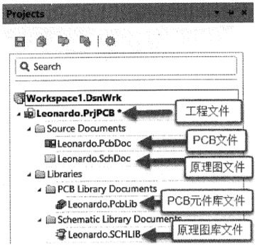

### 工程的创建与管理

 

 **工程文件（后缀：.PrjPCB）**  

- 角色：工程的“容器”，记录工程的整体配置（如文件关联、编译规则等）。  
- 对应图中：`Leonardo.PrjPCB`，是工程的顶层文件，展开后可看到下属的设计文件和库文件。  

**原理图文件（后缀：.SchDoc）**  

- 角色：**电路逻辑设计载体**，绘制电路的功能连接（如芯片引脚、信号走向），描述“电路是什么、怎么连”。  
- 对应图中：`Leonardo.SchDoc`，存放在 `Source Documents` 文件夹下（“Source Documents”通常用于存放核心设计文件）。  

**PCB文件（后缀：.PcbDoc）**  

- 角色：**电路板物理设计载体**，实现元件布局、布线、层叠等物理设计，决定“电路怎么造”。  
- 对应图中：`Leonardo.PcbDoc`，与原理图文件同属 `Source Documents`，是原理图的“物理化落地”。  

**原理图库文件（后缀：.SchLib）**  

- 角色：**原理图元件符号的“仓库”**，定义元件在原理图中的外观（如引脚、外形），方便重复调用。  
- 对应图中：`Leonardo.SCHLIB`，存放在 `Libraries` → `Schematic Library Documents` 下（专门管理原理图库）。  

**PCB元件库文件（后缀：.PcbLib）**  

- 角色：**PCB元件封装的“仓库”**，定义元件在PCB上的物理形态（如引脚间距、外形尺寸），决定元件能否正确焊接。  
- 对应图中：`Leonardo.PcbLib`，存放在 `Libraries` → `PCB Library Documents` 下（专门管理PCB库）。  
