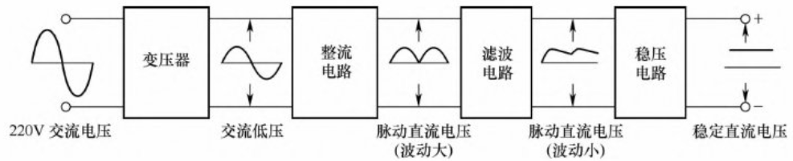

### 元器件应用

#### 电阻（Resister）

|电阻器类型|特点|阻值范围|
| ---- | ---- | ---- |
|碳膜电阻器|在目前电子电路中使用量最大，价格最便宜，品质稳定性高，噪声小，应用广泛|1Ω～10MΩ|
|合成碳膜电阻器|电阻值变化范围宽，价格低廉，但噪声大，频率特性差，电压稳定性低，抗湿性差，主要用来制造高压、高阻电阻器| - |
|金属膜电阻器|采用金属膜作为导电层，属于膜式电阻器；体积小，噪声小，稳定性高，温度系数小，耐高温，精度高，但脉冲负载稳定性差；分为普通金属膜电阻器、半精密金属膜电阻器、高精密金属膜电阻器、高压金属膜电阻器等多种|0.1Ω～620MΩ|
|金属氧化膜电阻器|除具有金属膜电阻器的特点外，比金属膜电阻器的抗氧化性和热稳定性高，功率大（可达50kW），但阻值范围小，主要用来补充金属膜电阻器的低阻部分|1Ω～200kΩ|
|合成实心电阻器|机械强度高，过负载能力较强，可靠性高，体积小，但噪声大，分布参数（L、C）大，对电压和温度的稳定性差|4.7Ω～22MΩ|
|功率耐冲击玻璃釉膜电阻器|用金属玻璃釉被于磁棒上面，有着极佳的耐冲击特性及高温稳定性，广泛应用于高功率设备| - |
|线绕低感（无感）电阻器|将电阻线绕在耐热瓷体上，表面涂以耐热、耐湿、无腐蚀的不燃性涂料加以保护；耐热性优、温度系数小、重量轻、耐短时间过负载、低噪声、阻值变化小；无感线绕电阻器（NKNP）有着线绕电阻器（KNP）的基本特性及低电感量的优点| - |
|涂敷线绕电阻器|具有阻值低、体积小、负荷大、性能稳定的特点，主要采用不燃漆包封，使用温度范围为-55～+155℃；在线路中主要应用于分压以及功率负载| - |
|精密电阻器|指电阻的阻值误差、电阻的热稳定性（温度系数）、电阻器的分布参数（分布电容和分布电感）等项指标均达到一定标准的电阻器；按材料分主要有金属膜精密电阻器、线绕精密电阻器和金属箔精密电阻器3种。金属膜精密电阻器通常为圆柱形，线绕精密电阻器则有圆柱形、扁柱形和长方框架形几种，金属箔精密电阻器则常呈方块形或片形| - |

### 常用电路分析

#### 电源电路

电源为电路提供动力，多数电子设备需通过电源电路将220V交流市电转换为低压直流电压，核心组成与流程如下：

- **组成模块**：由整流电路、滤波电路、稳压电路构成，结合变压器实现电压转换与稳定。
- **工作流程**：220V交流电经变压器降压为交流低压；整流电路将其转为波动大的脉动直流电压；滤波电路减小电压波动；稳压电路最终输出稳定直流电压，为内部电路供电。

##### 整流电路

> [!note] 功能简介
>
> 整流电路负责将**交流电压**（如变压器输出的交流低压）转换为**脉动直流电压**。它通过二极管的**单向导电性**，使电流只沿一个方向流动，将双向交替的交流波形“整流”为单向的脉动波形。这一过程为后续的滤波和稳压电路提供了基础。整流电路通常位于**变压器降压之后、滤波电路之前**，是实现交流转直流的核心环节。

###### 半波整流电路

