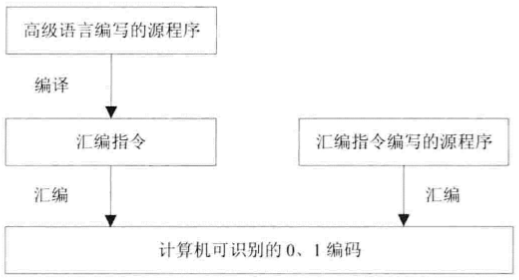

### 处理器与MIPS

#### 计算机的简单模型

##### 计算机的简单组成模型

计算机由三大部分组成：**处理器（CPU）**、**输入输出（I/O）**、**存储器（Memory）**。

- **存储器**：存储“指令”（指令是运算命令，例如“将a与b相加，结果存储到c中”）。由于计算机基于**二进制**（所有信息用0、1组合表示），所以指令以“一串0、1的编码”形式存在。
- **处理器（CPU）**：从存储器中获取指令，按照指令执行运算操作；同时内部具备**译码功能**，能解释接收到的“0、1编码”，识别运算类型后开展运算。
- **输入输出（I/O）**：“输入”负责提供运算所需的数据，“输出”负责显示运算的最终结果。

##### 计算机的简单使用模型

> [!note] 应用程序的本质
>
> 上网、办公等各类应用，通过“应用程序”实现；而应用程序本质是**大量指令的集合**（指令数目庞大，但种类很少，仅几百条，常用的仅几十条），通过指令的组织与配合，实现了丰富的功能。

为了简化编程（直接用0、1编码编程不便且易出错），编程方式逐渐发展：

- **机器码（0、1编码）**：计算机直接识别，但人工编写极不方便、易出错。
- **汇编指令**：用“助记符”代替0、1编码表示指令，再通过**汇编程序**，将汇编指令翻译为计算机可识别的0、1编码。
- **高级语言**：语法更简洁、易理解（如C#、Java等）。通过**编译程序**，先将高级语言编写的源码翻译为“汇编指令”；再经汇编程序，进一步翻译为0、1编码。

**统一的使用模型**：

无论软件类型（视频软件、浏览器等）、开发语言（C#、Java等）、运行环境（Windows、Android等）、处理器类型（ARM、Intel等），还是运行的机器（大型机、个人PC等），都遵循“从高级语言/汇编指令，最终转换为0、1编码被计算机执行”的**统一使用模型**。

#### 架构与指令集

不同处理器使用的指令不同，导致为**处理器A**编写的程序，无法直接在**处理器B**上运行，必须重新编写、编译/汇编，严重降低了软件的**移植性**（跨硬件使用的能力），十分不便。

**指令集架构（ISA）的引入**：

IBM为解决“软件重复编写”的痛点，在`System/360`计算机中引入**指令集架构（Instruction Set Architecture，ISA）**：

- ISA把“编程需要了解的硬件细节”从实际硬件中**抽象**出来，让软件人员只需“面向ISA”编程。
- **效果**：基于某ISA开发的软件，无需修改就能在**所有符合该ISA的计算机**上运行，大幅提升了软件兼容性。
- 对软件人员而言，ISA是“编程视角的抽象机器”，包含一套**指令集**（可执行的运算命令集合）和一些**寄存器**（编程需用到的硬件资源），掌握这些就能编写程序。

> [!note] ISA与微架构
>
> - **微架构（Microarchitecture）**是ISA的**具体实现**。
> - 举例：Intel多款处理器都遵循`x86` ISA，但每款处理器有自己独特的微架构。
> - 类比：ISA是“设计规范”（规定要做什么），微架构是“具体施工方案”（规定怎么做）；相同ISA下，不同微架构会带来不同的**性能表现**。

##### CISC 与 RISC

根据**指令集架构（ISA）**的不同，计算机分为两类：

- **复杂指令集计算机（CISC）**：每条指令对应的0、1编码串长度**不固定**。
- **精简指令集计算机（RISC）**：每条指令对应的0、1编码串长度**固定**。

> [!note] 复杂指令集（CISC）的发展与问题
>
> - **发展背景**：计算机早期以汇编语言编程，追求“强大灵活的指令集”；且当时存储器**昂贵且速度慢**，因此设计**变长指令**（一条长指令可完成多任务，减少内存访问次数，缓解存储访问对程序性能的拖累）。  
>   **典型代表**：Intel的x86 ISA（如早期x86架构）。
> - **存在问题**：指令使用率**极不均衡**——约20%的指令被频繁使用（占程序代码80%），剩余80%的指令很少使用（仅占程序代码20%），结构低效、不合理。

> [!note] 精简指令集（RISC）的产生与特点
>
> - **产生原因**：为解决CISC的低效问题，提出**简化指令集+优化处理器结构**：减少少用指令，保留常用简单指令，让处理器更简洁高效，提升运算速度。1979年加州大学伯克利分校David Pattern首次提出RISC概念。
> - **核心特点**：
>   - 指令长度**固定**，指令格式、寻址方式种类**少**；
>   - 大量使用**寄存器**；
>   - 多数简单指令可在**一个时钟周期内完成**，因此处理器频率能大幅提升，且易于设计流水线（进一步提升执行效率）。
> - 地位：RISC是计算机发展的里程碑，甚至被戏称“1985年之后发布的所有处理器都属于RISC范畴”。

Intel曾尝试直接研发RISC处理器，但因**软件兼容性问题**失败；1995年，David B.Papworth团队设计Pentium Pro处理器，采用“折中方案”：
  先将x86指令**解码为类似RISC的微操作（uops）**，再用**RISC内核**执行。这种“解码+RISC内核”的架构思路延续至今。

##### 几种主要的ISA

目前没有统一的ISA被所有处理器厂商接受，而是存在多种ISA（类似世界有多种主要语言）。其中**主要的ISA包括x86、ARM、SPARC、POWER、MIPS**；且只有**x86属于复杂指令集（CISC）架构**，其余均为精简指令集（RISC）架构。

> [!note] x86
>
> - **起源**：1978年，在Intel 8086处理器中首次出现。
> - **发展关键**：1981年被IBM PC选用，此后成为个人计算机的标准平台，是“历史上最成功的指令集架构”。
> - **现状**：绝大多数个人计算机使用的处理器，都兼容x86指令集架构。

> [!note] ARM
>
> - **起源**：1985年，英国Acorn公司设计出第一代32位、6MHz的处理器（ARM1）。
> - **发展模式**：1990年，苹果、VLSI等公司出资改组Acorn为**ARM公司**；ARM不再直接生产芯片，而是设计“低功耗、高性能的CPU内核”，通过**授权IP核**的方式，让其他公司基于内核设计生产具体处理器芯片。
> - **应用特点**：侧重**低功耗、低成本**，面向**嵌入式应用**（如智能手机、平板等移动设备），因此随移动设备普及迅速发展。
> - **架构演进**：从v4、v4T、v5、v5E、v6发展到v7，v7又细分为v7-A（应用领域）、v7-R（实时领域）、v7-M（微控制器领域）等；例如苹果A9处理器采用的是ARM v7-A架构。

> [!note] SPARC
>
> - **全称**：*Scalable Processor ARChitecture*（可扩展处理器架构）。
> - **起源**：源自美国加州大学伯克利分校20世纪80年代的研究，Sun公司1985年首先提出，1989年成为**商用架构**，用于高性能工作站和服务器。
> - **版本**：目前有v8、v9等版本。
> - **开放性与衍生**：架构**完全开放**，基于它出现了开源处理器（如Sun的UltraSPARC T1、LEON系列）。其中**LEON系列**是SPARC v8架构的处理器：
>   - **发展历程**：LEON1、LEON2由欧洲航天局发布；LEON3由Gaisler Research设计；2008年Aeroflex收购Gaisler Research，2010年发布LEON4（暂未公开源码）。
>   - **设计与应用**：用VHDL语言编写，最初计划用于**航天器**。

> [!note] POWER
>
> - **全称**：*Performance Optimization With Enhanced RISC*（“增强RISC的性能优化”架构）。
> - **类型**：**RISC**结构的指令集架构，由IBM公司设计开发。
> - **应用场景**：IBM生产的众多服务器、大型机、小型机及工作站，均采用POWER架构的微处理器作为主CPU。
> - **发展历程**：
>   - 1991年，Apple、IBM、Motorola成立**AIM联盟**（取三家公司首字母），对POWER架构修改后，形成*PowerPC*架构。
>   - 2004年，IBM发起*Power.org*联盟，发布统一指令集架构，将**POWER**与**PowerPC**统一到新的*Power*架构中。

> [!note] MIPS架构
>
> - **全称**：*Microprocessor without Interlocked Piped Stages*（“无内锁流水线微处理器”）。
> - **类型**：上世纪80年代诞生的**RISC CPU**重要代表，设计者为斯坦福大学教授*John Hennessy*。
> - **设计理念**：通过“相对简单的指令 + 优秀编译器 + 流水线执行硬件”的组合，以**更少的晶圆面积**实现**更快的处理器**。
> - **商业化与发展**：
>   - 1984年，基于理念的成功，成立*MIPS计算机系统公司*，对MIPS架构进行商业化。
>   - 后续十几年中，MIPS架构在工作站、服务器领域广泛应用，架构版本从*MIPS I*逐步发展到*MIPS64*。
> - **学术影响**：John Hennessy与RISC概念提出者*David Patterson*合著经典教材《计算机体系结构——量化研究方法》，该书影响力深远，至今已出至第五版。

> [!note] LoongArch（龙架构）
>
> - **定义**：龙芯公司设计的自主指令集架构（ISA），特点为完全自主研发、采用现代技术、跨指令集兼容。
> - **发展历程**：2020年推出；2021年龙芯3A5000发布，标志其投入使用；2022年申请“龙架构”商标，明确中文名称。
> - **指令集构成**：含约2000条指令，由强制基础设施和可选扩展组成，首个版本有LBT、LVZ、LSX、ASX等标准扩展。
> - **架构特点**：
>   - RISC风格，指令固定大小、格式规则，属加载-存储架构。
>   - 3种版本：LA32R（精简32位）、LA32S（标准32位）、LA64（64位），LA64与LA32应用级向后兼容。
>   - 4个特权级别（PLV0~PLV3），内核运行于PLV0，应用程序在PLV3。
> - **寄存器设置**：含GPR（32个，LA32为32位宽，LA64为64位宽）、FPR（32个64位宽，需浮点单元）、VR（128位LSX扩展、256位LASX扩展，与FPR重叠）及CSR（特权模式用）。
> - **应用场景**：适用于桌面、服务器、嵌入式系统等，支持向量指令、虚拟化和多核扩展，可独立于外国知识产权运行。

现有指令集已形成**完善的生态环境**（包含成熟的编译器、大量现成的应用程序），能直接复用这些资源。若自行设计“独有”的指令集，需重新开发编译器、应用软件，工作量极其庞大（类比：发明一种独有的语言，却因无法与他人交流，再优秀也会被淘汰）。

**为何是MIPS架构？**

- MIPS是**RISC架构的经典设计**，许多处理器都吸收了它的设计思想，具有广泛的借鉴价值；
- MIPS指令的**专利期已过**，可“自由使用”，不存在知识产权的限制。

#### MIPS指令集架构的转变

#### `MIPS32`指令集架构简介

#### 系统设计目标

##### 设计目标

1. 流水线与架构

- **五级整数流水线**：将指令执行拆分为**取指、译码、执行、访存、回写**5个阶段，通过流水线并行提升指令吞吐率。
- **哈佛结构**：指令接口与数据接口**分离**，使“取指令”和“数据访问”可并行进行，提高整体效率。

2. 寄存器与数据格式

- **32个32位整数寄存器**：提供整数运算的高速暂存空间，减少对内存的频繁访问。
- **大端模式**：规定多字节数据的存储顺序（高位字节存于低地址），明确数据字节序规则。

> [!note] 大端模式说明
>
> 大端模式是**多字节数据在计算机内存中的一种存储规则**，核心是规定“字节的高低位与内存地址的对应关系”：
>
> 1. **区分“高位字节”与“低位字节”**：  
>    多字节数据（比如十六进制数 `0x12345678`，占4个字节）中，**高位字节**是数值里权重高的部分（如 `0x12`，对应“万级”权重），**低位字节**是数值里权重低的部分（如 `0x78`，对应“个级”权重）。
>
> 2. **大端模式的存储规则**：  
>    把**高位字节**存放在**低地址**的内存单元，**低位字节**存放在**高地址**的内存单元。
>
> **举例（存储 `0x12345678`）**  
> 假设内存地址从 `0x100` 开始：
>
> - 低地址 `0x100` 存 **高位字节 `0x12`**；
> - 地址 `0x101` 存 `0x34`；
> - 地址 `0x102` 存 `0x56`；
> - 高地址 `0x103` 存 **低位字节 `0x78`**。
>
> 这样处理器按“地址从低到高”读取时，先拿到高位、再拿到低位，组合起来就是正确的多字节数值，**符合人类“从高位到低位”的阅读习惯**。
>
> > [!tip] 小端模式对比
> >
> > 小端模式则是“低位字节存低地址，高位字节存高地址”，更偏向计算机内部高效处理，但人类阅读不直观。

3. 异常与中断

- **向量化+精确异常处理**：支持高效、精准的运行时异常（如指令错误、内存越界等）处理，保障程序稳定性。
- **支持6个外部中断**：可响应6类外部设备的异步请求，满足硬件交互需求。

> [!note] 外部中断说明
>
> 外部中断是指**计算机外部设备（如键盘、鼠标、网卡、定时器等）向处理器发送的“请求信号”**，目的是让处理器暂停当前正在执行的任务，优先去处理外部设备的紧急需求（比如键盘按下快捷键、网卡收到新数据）；等设备请求处理完毕后，处理器再回到原来的任务继续执行。
>
> 支持6个外部中断，意味着这款处理器能同时响应**6类不同外部设备（或不同类型的外部事件）**的中断请求，以此满足与多种硬件交互的需求（比如同时处理键盘、鼠标、网络数据等不同设备的异步操作）。

4. 总线与运算效率

- **32bit数据/地址总线宽度**：数据总线一次可传输32位（4字节）数据，地址总线支持最大约4GB的寻址空间。
- **单周期乘法**：乘法指令能在**一个时钟周期内完成**，提升乘法运算速度。

5. 指令集与兼容性

- **支持延迟转移**：转移指令（如分支、跳转）采用“延迟执行”策略（转移后先执行若干后续指令），优化流水线性能。
- **兼容MIPS32指令集**：可执行MIPS32指令集中**所有整数指令**，复用现有MIPS编译环境（如GCC），保障软件兼容性。

> [!note] 延迟转移（延迟执行策略）说明
>
> 可以把处理器执行指令想象成**工厂流水线**：一条指令要经过“取指→译码→执行”等多个步骤，像传送带一样一步步推进。
>
> 转移指令（比如“如果条件满足，就跳去另一段代码执行”）是个“岔路口”——如果等转移指令到了“执行”阶段才判断往哪走，那“传送带”前面可能已经提前取了、译了不该执行的指令，这时候得把这些错误指令“扔掉”，重新取正确的指令，特别浪费时间（流水线会“断流”）。
>
> **延迟转移（延迟执行策略）**的思路是：不管最终要不要“跳转”，先把**转移指令后面紧跟的1条（或几条）指令**（称为“延迟槽”里的指令）执行了。
>
> 这样一来，即使后来发现需要跳转，“延迟槽”里的指令已经执行完了，流水线不用“倒退重来”，能继续流畅推进，从而提升整体效率。
>
> 举例：你不确定食堂今天开不开门（转移条件），如果是普通情况，你走到食堂门口（执行阶段）才知道开不开，要是没开，之前走路的时间（流水线步骤）就白费了。但“延迟转移”就像：出发前，先顺路取个快递（延迟槽指令）——不管食堂开不开，快递都得取。这样即使食堂没开，取快递的时间也没浪费，流水线（你的行动节奏）就不会因为“等判断”而空着。

6. 通用性能

大多数指令可在**一个时钟周期内完成**，追求高吞吐率与整体性能。

### 可编程逻辑器件与`Verilog HDL`

#### 可编程逻辑器件概述

FPGA（现场可编程门阵列）是“**可编程逻辑器件**（Programmable Logic Device，PLD）”的一种。

PLD从上世纪70年代发展而来，它的出现**简化了电路设计、降低了开发成本、提高了系统可靠性**，还对“数字系统的设计方法”产生了**革命性影响**。

> [!note] 常见PLD类型（按工艺/原理分类）
>
> 发展至今，出现了多种PLD，典型包括：
>
> | 类型      | 全称（英文/中文） | 主要用途 |
> |-----------|-------------------|----------|
> | PLA       | Programmable Logic Array 可编程逻辑阵列 | 实现中小规模的组合逻辑电路，灵活性高，适合定制化逻辑 |
> | PAL       | Programmable Array Logic 可编程阵列逻辑 | 实现简单的组合逻辑和部分时序逻辑，常用于地址解码等 |
> | GAL       | Generic Array Logic 通用阵列逻辑 | PAL的升级版，可重复编程，适合原型开发和小批量生产 |
> | PROM      | Programmable Read-Only Memory 可编程只读存储器 | 存储固定数据或查找表，也可用于简单逻辑功能 |
> | EPLD      | Erasable Programmable Logic Device 可擦除可编程逻辑器件 | 可多次擦写，适合需要反复修改的逻辑设计 |
> | CPLD      | Complex Programmable Logic Device 复杂可编程逻辑器件 | 实现中等复杂度的数字系统，适合接口、控制等应用 |
> | FPGA      | Field Programmable Gate Array 现场可编程门阵列 | 实现大规模、复杂的数字系统，广泛用于嵌入式、信号处理等领域 |

按照不同的内部结构可以将PLD器件分为如下两类：

1. **基于乘积项（Product-Term）结构**的可编程逻辑器件（PLD）

- 任何**组合逻辑电路**的函数，都可转化为“与或”表达式，用“与门 → 或门”的两级电路实现；
- 任何**时序电路**，都可由“组合电路 + 存储元件（触发器）”构成；
因此，“与或阵列 + 触发器”的结构，理论上能实现**任意数字逻辑电路**。

这类PLD由四部分组成：**输入缓冲电路**、**与阵列**、**或阵列**、**输出缓冲电路**，信号流向为：
输入 → 输入缓冲电路 → 与阵列 → 或阵列 → 输出缓冲电路 → 输出

- **输入缓冲电路**：生成输入信号的“原变量”和“反变量”（如输入`A`，会生成`A`和`¬A`），同时**增强输入信号的驱动能力**（让信号能稳定传输到后续电路）。
- **与阵列 + 或阵列**：核心部分，通过灵活配置内部连线，实现各种**逻辑函数和逻辑功能**（比如与、或、非、与非等基本逻辑，或更复杂的组合逻辑）。
- **输出缓冲电路**：对输出信号做最终处理，既能输出**纯组合逻辑信号**，也能输出**时序逻辑信号**（结合触发器实现）。

**典型器件与技术特点**：

- **涵盖类型**：PROM、PLA、PAL、GAL、EPLD，以及**绝大部分CPLD**，都采用“乘积项结构”。
- **工艺与掉电特性**：多采用**EEPROM或Flash工艺**制作，掉电后**配置数据不会丢失**（即重新上电后，之前的逻辑配置仍有效）。
- **规模限制**：器件规模一般**小于5000门**，相比后续的FPGA，逻辑规模相对有限。

2. **基于查找表（LUT）结构**的可编程逻辑器件（PLD）

基于“与或阵列”的传统PLD（可编程逻辑器件），规模难以做得很大。因此，设计人员开发了**查找表（LUT）结构**的PLD，以突破规模限制。

> [!note] LUT的原理与硬件基础
>
> LUT的工作原理类似**ROM（只读存储器）**，物理结构由两部分构成：
>
> - **静态随机存储器（SRAM）**：用于存储逻辑函数的“函数值”（相当于真值表的结果）。
> - **数据选择器（MUX）**：根据输入变量，从SRAM中“查表”并选择对应函数值输出。
>
> 具体逻辑：
>
> - SRAM的**地址线**直接作为“输入变量”；
> - 不同的输入组合，通过MUX从SRAM中找到对应的函数值并输出；
> - 若有$N$个输入变量，需用**容量为$2^N$位的SRAM**（因为$N$个输入有$2^N$种组合，对应真值表的$2^N$项）。

示例：2输入LUT实现2输入或门

- 2个输入变量（$A、B$）对应$2^2 = 4$种组合，因此LUT包含**4个存储单元**，用于存储“或门真值表”的4个结果（或门真值表：$0+0=0$、$0+1=1$、$1+0=1$、$1+1=1$，故4个存储单元存$0、1、1、1$）。
- 输入$A、B$作为**多路选择器（MUX）的地址选择端**，根据$A、B$的组合（如$00、01、10、11$），从4个存储单元中选择对应值输出，最终实现“或门”的逻辑功能。

### 4. LUT的功能与实际限制

- **功能优势**：\( N \)输入的LUT，能实现**任意\( N \)输入变量的组合逻辑函数**。理论上，只要增加输入信号线数量、扩大SRAM容量，甚至能实现“任意多输入变量”的逻辑函数。
- **实际限制**：受技术和成本制约，LUT的规模无法无限扩大。因为输入变量数\( N \)每增加1，SRAM的容量需**扩大一倍**（容量与\( N \)的关系为\( 2^N \)倍），硬件开销会快速增长。

简言之，LUT通过“查表”方式实现逻辑功能，兼具“功能强”的优势与“规模受成本/技术限制”的特点。

### 第一条指令 -- `ori`

### 逻辑、移位操作与空指令的实现

### 移动操作指令

### 算术操作指令

### 转移指令

### 加载存储指令

### 协处理器访问指令

### 异常相关指令

### OpenMIPS处理器的设计与实践

### 基于OpenMIPS的小型SOPC

### 验证OpenMIPS处理器

### 为OpenMIPS处理器移植$\mu$C/OS - II
