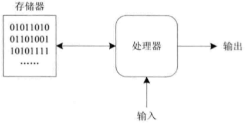
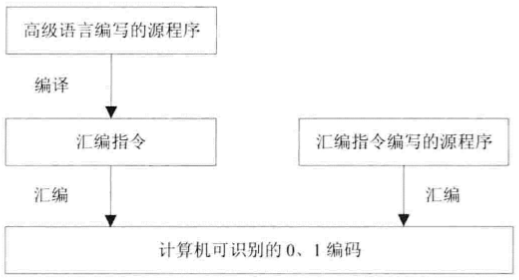

### 处理器与MIPS

#### 计算机的简单模型

##### 计算机的简单组成模型

计算机由三大部分组成：**处理器（CPU）**、**输入输出（I/O）**、**存储器（Memory）**。

- **存储器**：存储“指令”（指令是运算命令，例如“将a与b相加，结果存储到c中”）。由于计算机基于**二进制**（所有信息用0、1组合表示），所以指令以“一串0、1的编码”形式存在。
- **处理器（CPU）**：从存储器中获取指令，按照指令执行运算操作；同时内部具备**译码功能**，能解释接收到的“0、1编码”，识别运算类型后开展运算。
- **输入输出（I/O）**：“输入”负责提供运算所需的数据，“输出”负责显示运算的最终结果。

##### 计算机的简单使用模型

> [!note] 应用程序的本质
>
> 上网、办公等各类应用，通过“应用程序”实现；而应用程序本质是**大量指令的集合**（指令数目庞大，但种类很少，仅几百条，常用的仅几十条），通过指令的组织与配合，实现了丰富的功能。

为了简化编程（直接用0、1编码编程不便且易出错），编程方式逐渐发展：

- **机器码（0、1编码）**：计算机直接识别，但人工编写极不方便、易出错。
- **汇编指令**：用“助记符”代替0、1编码表示指令，再通过**汇编程序**，将汇编指令翻译为计算机可识别的0、1编码。
- **高级语言**：语法更简洁、易理解（如C#、Java等）。通过**编译程序**，先将高级语言编写的源码翻译为“汇编指令”；再经汇编程序，进一步翻译为0、1编码。

**统一的使用模型**：

无论软件类型（视频软件、浏览器等）、开发语言（C#、Java等）、运行环境（Windows、Android等）、处理器类型（ARM、Intel等），还是运行的机器（大型机、个人PC等），都遵循“从高级语言/汇编指令，最终转换为0、1编码被计算机执行”的**统一使用模型**。

#### 架构与指令集

不同处理器使用的指令不同，导致为**处理器A**编写的程序，无法直接在**处理器B**上运行，必须重新编写、编译/汇编，严重降低了软件的**移植性**（跨硬件使用的能力），十分不便。

**指令集架构（ISA）的引入**：

IBM为解决“软件重复编写”的痛点，在`System/360`计算机中引入**指令集架构（Instruction Set Architecture，ISA）**：

- ISA把“编程需要了解的硬件细节”从实际硬件中**抽象**出来，让软件人员只需“面向ISA”编程。
- **效果**：基于某ISA开发的软件，无需修改就能在**所有符合该ISA的计算机**上运行，大幅提升了软件兼容性。
- 对软件人员而言，ISA是“编程视角的抽象机器”，包含一套**指令集**（可执行的运算命令集合）和一些**寄存器**（编程需用到的硬件资源），掌握这些就能编写程序。

> [!note] ISA与微架构
>
> - **微架构（Microarchitecture）**是ISA的**具体实现**。
> - 举例：Intel多款处理器都遵循`x86` ISA，但每款处理器有自己独特的微架构。
> - 类比：ISA是“设计规范”（规定要做什么），微架构是“具体施工方案”（规定怎么做）；相同ISA下，不同微架构会带来不同的**性能表现**。

##### CISC 与 RISC

根据**指令集架构（ISA）**的不同，计算机分为两类：

- **复杂指令集计算机（CISC）**：每条指令对应的0、1编码串长度**不固定**。
- **精简指令集计算机（RISC）**：每条指令对应的0、1编码串长度**固定**。

> [!note] 复杂指令集（CISC）的发展与问题
>
> - **发展背景**：计算机早期以汇编语言编程，追求“强大灵活的指令集”；且当时存储器**昂贵且速度慢**，因此设计**变长指令**（一条长指令可完成多任务，减少内存访问次数，缓解存储访问对程序性能的拖累）。  
>   **典型代表**：Intel的x86 ISA（如早期x86架构）。
> - **存在问题**：指令使用率**极不均衡**——约20%的指令被频繁使用（占程序代码80%），剩余80%的指令很少使用（仅占程序代码20%），结构低效、不合理。

> [!note] 精简指令集（RISC）的产生与特点
>
> - **产生原因**：为解决CISC的低效问题，提出**简化指令集+优化处理器结构**：减少少用指令，保留常用简单指令，让处理器更简洁高效，提升运算速度。1979年加州大学伯克利分校David Pattern首次提出RISC概念。
> - **核心特点**：
>   - 指令长度**固定**，指令格式、寻址方式种类**少**；
>   - 大量使用**寄存器**；
>   - 多数简单指令可在**一个时钟周期内完成**，因此处理器频率能大幅提升，且易于设计流水线（进一步提升执行效率）。
> - 地位：RISC是计算机发展的里程碑，甚至被戏称“1985年之后发布的所有处理器都属于RISC范畴”。

Intel曾尝试直接研发RISC处理器，但因**软件兼容性问题**失败；1995年，David B.Papworth团队设计Pentium Pro处理器，采用“折中方案”：
  先将x86指令**解码为类似RISC的微操作（uops）**，再用**RISC内核**执行。这种“解码+RISC内核”的架构思路延续至今。

##### 几种主要的ISA

目前没有统一的ISA被所有处理器厂商接受，而是存在多种ISA（类似世界有多种主要语言）。其中**主要的ISA包括x86、ARM、SPARC、POWER、MIPS**；且只有**x86属于复杂指令集（CISC）架构**，其余均为精简指令集（RISC）架构。

> [!note] x86
>
> - **起源**：1978年，在Intel 8086处理器中首次出现。
> - **发展关键**：1981年被IBM PC选用，此后成为个人计算机的标准平台，是“历史上最成功的指令集架构”。
> - **现状**：绝大多数个人计算机使用的处理器，都兼容x86指令集架构。

> [!note] ARM
>
> - **起源**：1985年，英国Acorn公司设计出第一代32位、6MHz的处理器（ARM1）。
> - **发展模式**：1990年，苹果、VLSI等公司出资改组Acorn为**ARM公司**；ARM不再直接生产芯片，而是设计“低功耗、高性能的CPU内核”，通过**授权IP核**的方式，让其他公司基于内核设计生产具体处理器芯片。
> - **应用特点**：侧重**低功耗、低成本**，面向**嵌入式应用**（如智能手机、平板等移动设备），因此随移动设备普及迅速发展。
> - **架构演进**：从v4、v4T、v5、v5E、v6发展到v7，v7又细分为v7-A（应用领域）、v7-R（实时领域）、v7-M（微控制器领域）等；例如苹果A9处理器采用的是ARM v7-A架构。

> [!note] SPARC
>
> - **全称**：*Scalable Processor ARChitecture*（可扩展处理器架构）。
> - **起源**：源自美国加州大学伯克利分校20世纪80年代的研究，Sun公司1985年首先提出，1989年成为**商用架构**，用于高性能工作站和服务器。
> - **版本**：目前有v8、v9等版本。
> - **开放性与衍生**：架构**完全开放**，基于它出现了开源处理器（如Sun的UltraSPARC T1、LEON系列）。其中**LEON系列**是SPARC v8架构的处理器：
>   - **发展历程**：LEON1、LEON2由欧洲航天局发布；LEON3由Gaisler Research设计；2008年Aeroflex收购Gaisler Research，2010年发布LEON4（暂未公开源码）。
>   - **设计与应用**：用VHDL语言编写，最初计划用于**航天器**。

