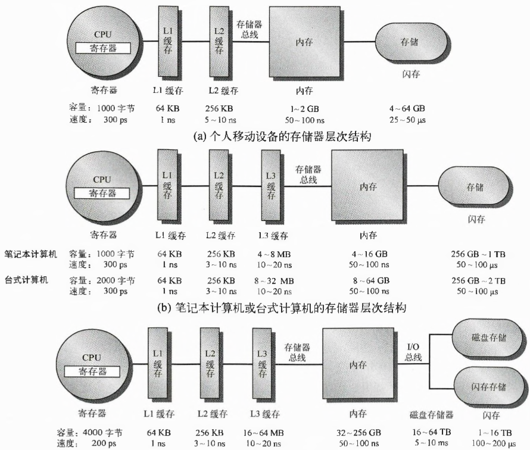

### 量化设计与分析基础

#### 计算机体系结构的定义

### 存储器层次结构设计

为在“快速存储的需求”与“成本控制”间折中，利用**局部性原理**（程序不会均衡访问所有代码/数据，包含“时间局部性”——近期访问的内容易再次访问；“空间局部性”——相邻数据易被连续访问），并遵循“给定工艺/功耗下，硬件体积越小，速度越快”的原则，形成**存储器层次结构**：由速度、容量、成本各不相同的存储器件，从“靠近CPU”到“远离CPU”分层级组织。

> [!note] 核心规律
> 
> - 越**靠近CPU**的层级：速度**越快**（访问延迟越低）、容量**越小**、单位成本**越高**（如寄存器、L1/L2/L3缓存）。
> - 越**远离CPU**的层级：速度**越慢**（访问延迟越高）、容量**越大**、单位成本**越低**（如内存、闪存、磁盘）。

**不同设备的存储器层次结构**：

如图展示了三类设备的存储层级，每层标注了**容量范围**与**访问速度**（延迟），体现“层级越远，速度越慢、容量越大”的规律：

- **（a）个人移动设备（如手机、平板）**：
  层级从近到远：寄存器（容量~1000字节，速度~300ps）→ L1缓存（64KB，1ns）→ L2缓存（256KB，5 - 10ns）→ 内存（1 - 2GB，50 - 100ns）→ 闪存（4 - 64GB，25 - 50μs）。

- **（b）笔记本/台式计算机**：
  层级更丰富（含L3缓存）：寄存器（笔记本~1000字节、台式~2000字节，速度~300ps）→ L1缓存（64KB，1ns）→ L2缓存（256KB，3 - 10ns）→ L3缓存（笔记本4 - 8MB、台式8 - 12MB，10 - 20ns）→ 内存（笔记本4 - 16GB、台式8 - 64GB，50 - 100ns）→ 闪存（256GB - 1TB，50 - 100μs）。

- **（c）服务器**：
  容量规模更大（适配高负载）：寄存器（~4000字节，速度~400ps）→ L1缓存（64KB，1ns）→ L2缓存（256KB，3 - 10ns）→ L3缓存（16 - 64MB，10 - 20ns）→ 内存（32 - 256GB，50 - 100ns）→ 磁盘存储（16 - 64TB，3 - 10ms）、闪存（1 - 16TB，100 - 300μs）。

> [!note] 技术趋势与应用
>
> 闪存等新型存储技术因“每比特成本持续降低”，逐渐取代磁盘成为**辅助存储**，在个人设备、服务器中广泛应用，能显著提升存储系统的**性能、功耗效率与存储密度**。例如：个人设备常以“闪存固态盘（SSD）”为主存储；服务器则混合使用SSD与传统硬盘（HDD），平衡性能与容量。
>
> 简言之，存储器层次结构通过“分层+局部性原理”，在“快速度”与“大容量”间实现了高效折中。

