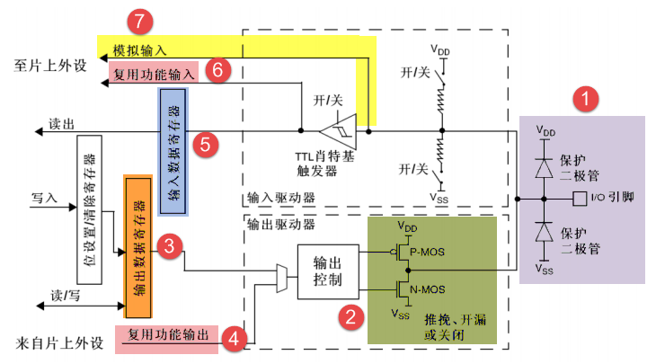
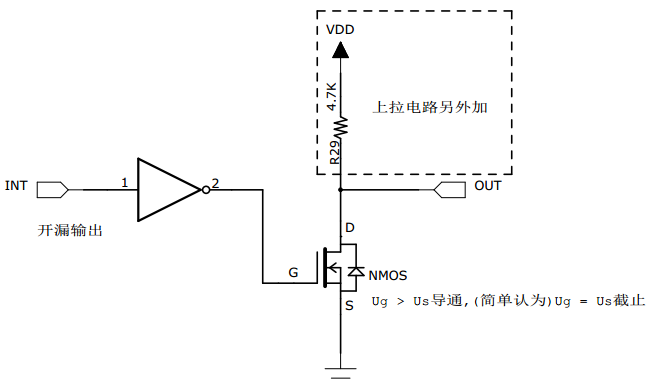
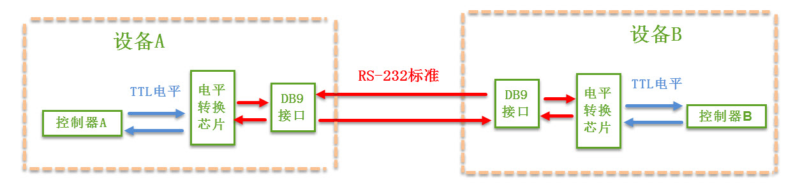
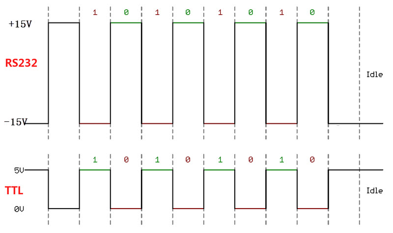
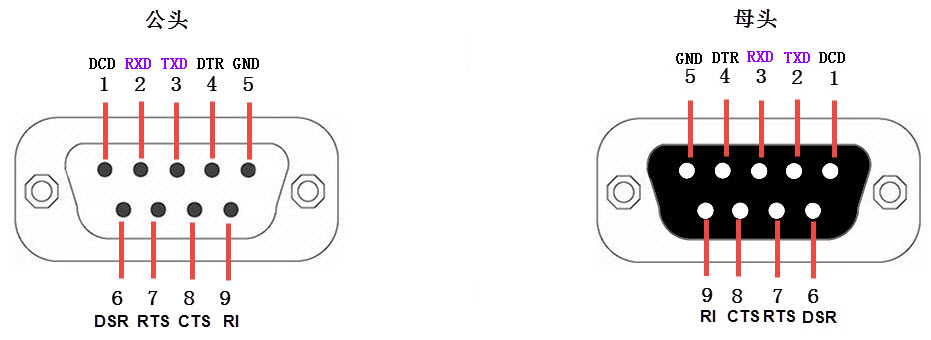
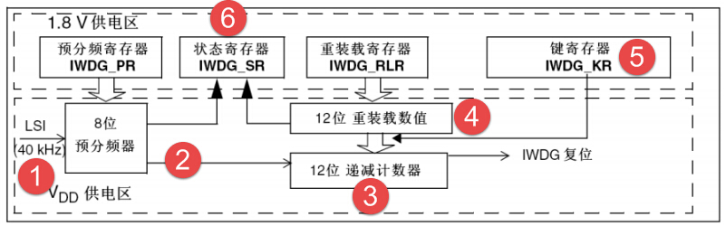
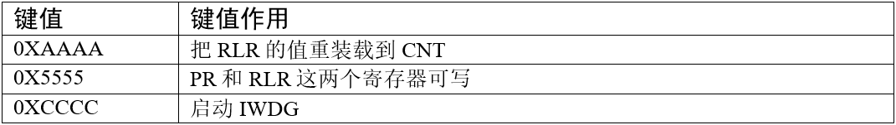

### 使用寄存器点亮LED灯

#### GPIO (General Purpose Input Output)

- **定义**：通用输入输出端口的简称，即STM32可控制的引脚。
- **功能**：通过与外部设备连接，实现通讯、控制及数据采集。
- **分组与数量**：STM32的GPIO分为多组，每组含16个引脚；以STM32F103VET6为例，有GPIOA至GPIOE共5组，芯片总共100个引脚中GPIO占大部分。
- **基础功能**：所有GPIO引脚均具备基本的输入输出功能。

STM32最基本输出功能为通过控制GPIO引脚输出高、低电平实现开关控制；最基本的输入功能是检测外部输入电平，如把GPIO引脚连接到按键，通过电平高低区分按键是否被按下。

#### GPIO框图剖析

##### 基本结构分析

###### 保护二极管&上、下拉电阻

- STM32引脚的两个保护二极管可防外部过高/过低电压：电压高于$V_{DD}$时上方二极管导通，低于$V_{SS}$时下方二极管导通，避免芯片因异常电压烧毁。
- 但该保护不意味着引脚可直接外接大功率驱动器件（如电机），强制驱动会导致电机不转或芯片烧坏，需通过加大功率及隔离电路驱动。

###### P-MOS管和N-MOS管

GPIO引脚线路经过两个保护二极管后，向上流向“输入模式”结构，向下流向“输出模式”结构。

我们首先研究输出模式部分，线路经过一个由P-MOS和N-MOS管组成的单元电路。 这个结构使GPIO具有了“**推挽输出**”和“**开漏输出**”两种模式。

**推挽模式**：

- **定义**：因两个MOS管的工作方式得名。
- **工作原理**：
  - 输入高电平时，经反向后，上方P-MOS导通、下方N-MOS关闭，输出高电平；
  - 输入低电平时，经反向后，N-MOS导通、P-MOS关闭，输出低电平；
  - 引脚电平切换时，两管轮流导通，P管灌电流，N管拉电流。
- **优势**：负载能力和开关速度较普通方式大幅提升。
- **电平范围**：低电平**0**伏，高电平**3.3**伏。

**开漏模式**：

- **模式特点**：P-MOS管完全不工作。
  - 控制输出为0（低电平）：P-MOS管关闭，N-MOS管导通，输出接地。
  - 控制输出为1：P-MOS管和N-MOS管均关闭，引脚为高阻态（无法直接输出高电平）。
- **使用要求**：需外接上拉电阻（参考开漏电路等效图）。
- **“线与”特性**：多个开漏引脚相连时，只有所有引脚为高阻态，才由上拉电阻提供其接的电源电压的高电平；若任一引脚为低电平，整条线路均为0伏。

> [!note]
> - **推挽输出模式**：适用于输出电平为0和3.3伏、需高速切换开关状态的场合；在STM32应用中，除必须用开漏模式的情况外，通常优先使用。
> - **开漏输出模式**：常用于I2C、SMBUS等需“线与”功能的总线电路；也可用于电平不匹配场景（如输出5伏高电平），需外部接5伏上拉电阻，输出高阻态时由上拉电阻和电源提供5伏电平。

###### 输出数据寄存器

前面的双MOS管结构电路的输入信号，是由GPIO“输出数据寄存器`GPIOx_ODR`”提供的，因此我们通过修改输出数据寄存器的值就可以修改GPIO引脚的输出电平。 而“置位/复位寄存器GPIOx_BSRR”可以通过修改输出数据寄存器的值从而影响电路的输出。

###### 复用功能输出

在STM32中，**复用功能**就是给GPIO引脚赋予“双重身份”——既能当普通的开关（GPIO模式），也能成为外设的专属接口（如串口、SPI等）。这种设计让有限的引脚能被多个外设共享，极大提升了硬件灵活性。

从其它外设引出来的“复用功能输出信号”与GPIO本身的数据据寄存器都连接到双MOS管结构的输入中，通过图中的梯形结构作为开关切换选择。

例如我们使用USART串口通讯时，需要用到某个GPIO引脚作为通讯发送引脚，这个时候就可以把该GPIO引脚配置成USART串口复用功能，由串口外设控制该引脚，发送数据。

**引脚的双重控制机制**  
   每个GPIO引脚内部都有一个**复用器（Multiplexer）**，类似一个“多档位开关”，可以将引脚连接到不同的信号源：  

   - **默认状态**：引脚由`GPIO`寄存器（如`ODR`、`BSRR`）直接控制，输出高低电平（推挽或开漏模式）。  
   - **复用状态**：引脚控制权移交到特定外设（如`USART`），由外设的发送/接收逻辑驱动引脚，此时GPIO寄存器的输出被屏蔽。

**双MOS管结构的切换逻辑**  
   以推挽输出为例，引脚的驱动电路由两个MOS管（P-MOS和N-MOS）组成：  

   - **GPIO模式**：MOS管的导通状态由`GPIO`寄存器的值决定。例如，输出高电平时P-MOS导通，低电平时N-MOS导通。  
   - **复用模式**：外设的输出信号（如`USART`的`TX`数据）会直接控制这两个MOS管，取代`GPIO`寄存器的输出。此时，梯形结构的开关（即复用器）会切断`GPIO`寄存器的信号路径，接通外设的信号路径。

> [!note] 复用功能的配置流程：以USART串口为例的完整配置步骤
>
> 1. **开启三级时钟**
>    - **GPIO时钟**：例如，若使用PA9作为USART1_TX，需使能GPIOA的时钟：  
>      `RCC_AHB1PeriphClockCmd(RCC_AHB1Periph_GPIOA, ENABLE);`
>    - **外设时钟**：使能USART1的时钟：  
>      `RCC_APB2PeriphClockCmd(RCC_APB2Periph_USART1, ENABLE);`
>    - **AFIO时钟**（重映射时必须）：若需将USART1重映射到PB6/PB7，需额外使能AFIO时钟：  
>      `RCC_APB2PeriphClockCmd(RCC_APB2Periph_AFIO, ENABLE);`
>
> 2. **配置GPIO为复用模式**  
>    - **设置模式寄存器（MODER）**：将PA9配置为复用功能（0b10）：  
>      `GPIOA->MODER &= ~(0x03 << 18); // 清除原模式`  
>      `GPIOA->MODER |= (0x02 << 18); // 设置为复用功能`
>    - **选择输出类型（OTYPER）**：推挽输出（USART_TX常用）：  
>      `GPIOA->OTYPER &= ~(1 << 9); // 0=推挽，1=开漏`
>    - **设置驱动速度（OSPEEDR）**：根据需求选择（如50MHz）：  
>      `GPIOA->OSPEEDR |= (0x03 << 18); // 0b11=高速`
>    - **配置上拉/下拉（PUPDR）**：USART_TX通常无需上拉，浮空即可：  
>      `GPIOA->PUPDR &= ~(0x03 << 18); // 0b00=浮空`
>
> 3. **指定复用功能编号（AF寄存器）**  
>    - **AF寄存器的4位编码**：每个引脚对应AFRL（引脚0-7）或AFRH（引脚8-15）中的4位。例如，PA9（引脚9）属于AFRH的第1个半字（索引1），需设置为AF7（USART1_TX）：  
>      `GPIOA->AFRH &= ~(0xF << 4); // 清除原设置`  
>      `GPIOA->AFRH |= (0x7 << 4); // AF7=0b0111`
>    - **简化写法**：使用库函数直接配置：  
>      `GPIO_PinAFConfig(GPIOA, GPIO_PinSource9, GPIO_AF_USART1);`
>
> 4. **初始化USART外设**  
>    - **波特率、数据格式等配置**：  
>      `USART_InitStructure.USART_BaudRate = 9600;`  
>      `USART_Init(USART1, &USART_InitStructure);`
>    - **使能USART**：  
>      `USART_Cmd(USART1, ENABLE);`

> [!note] 为什么复用功能能“无缝切换”？
>
> 1. **寄存器的互锁设计**  
>    - **`AF`寄存器独占性**：每个引脚的`AF`编码（0-15）同一时间只能对应一个外设，避免多个外设同时控制同一引脚。  
>    - **时钟门控**：未使能时钟的外设，即使`AF`寄存器配置正确，也无法驱动引脚。例如，`USART1`时钟未开启时，`PA9`仍为普通GPIO。
>
> 2. **重映射**：
>    - **背景**：默认情况下，`USART1_TX`固定在`PA9`，但通过重映射可将其移至`PB6`（需查看数据手册支持的映射关系）。  
>    - **配置步骤**：  
>      1. 使能`AFIO`时钟：`RCC_APB2PeriphClockCmd(RCC_APB2Periph_AFIO, ENABLE);`  
>      2. 调用重映射函数：`GPIO_PinRemapConfig(GPIO_Remap_USART1, ENABLE);`  
>      3. 配置新引脚（如`PB6`）的复用功能。
>
> 3. **输入复用功能的特殊性**：
>    - **外设读取引脚状态**：例如`USART`的`RX`引脚需配置为浮空输入，由`USART`外设直接读取电平，而非通过`GPIO`的`IDR`寄存器。  
>    - **配置示例**：  
>      `GPIO_InitStructure.GPIO_Mode = GPIO_Mode_IN_FLOATING;`  
>      `GPIO_Init(GPIOA, &GPIO_InitStructure);`

###### 输入数据寄存器

### 通讯的基本概念

#### 串行通讯与并行通讯

**并行通讯**：

用**多根数据线**（如8、16、32甚至64根等），同时传输**多个数据位**（图中多组蓝色方块“并行”沿箭头方向移动）。类比“多车道公路”，可同时传输多个数据位，短距离下传输效率较高，但需要更多数据线。

**串行通讯**：

用**少量数据线**（一般8根以下），将多个数据位**按顺序一位一位地传输**（图中多组蓝色方块“依次排成一列”，沿箭头方向“逐个”传输）。类比“单车道公路”，同一时刻只能传输一个数据位，虽传输速度看似慢，但节省数据线资源，更适合长距离传输。

| 特性         | 串行通讯 | 并行通讯 |
|--------------|----------|----------|
| 通讯距离     | 较远     | 较近     |
| 抗干扰能力   | 较强     | 较弱     |
| 传输速率     | 较慢     | 较高     |
| 成本         | 较低     | 较高     |

- 串行通讯：靠“少量数据线，逐位传输”，因此**成本低、抗干扰强、能长距离传输**，但“逐位传”导致速率慢。
- 并行通讯：靠“多根数据线，同时传多个数据位”，因此**速率高**，但“多线同步要求高、易受干扰”，且**数据线多导致成本高、仅适合短距离**。

> [!note] 技术趋势
>
> 并行通讯的短板：对“多数据线同步性”要求极高，且**速率越高，信号间干扰越严重**，会大幅影响通讯质量。
>
> 因此，随着技术发展，“高速串行差分传输”逐渐成为主流——既保留了串行“长距离、抗干扰、低成本”的优势，又通过技术优化弥补了“速率慢”的不足，所以更多场景（如高速数据传输）开始采用串行通讯。

#### 全双工、半双工和单工通讯

1. 全双工通讯

- 说明：**同一时刻，两个设备能“同时发送+同时接收”数据**。
- 类比案例：打电话——你说话（发）的同时，能听到对方说话（收），双向同步进行。

2. 半双工通讯

- 说明：**两个设备能收发数据，但“不能同时进行”，需“分时切换方向”**。
- 类比案例：对讲机——一方按对讲键“发”时，另一方只能“收”；松开后，另一方才能按对讲键“发”，双向分时进行。

3. 单工通讯

- 说明：**任何时刻只能“单方向”通讯，发送设备和接收设备“固定不变”**（发的一直发，收的一直收，无法反向）。
- 类比案例：广播——电台（固定发）持续发送信号，收音机（固定收）只能接收，无法向电台传输数据。

三种方式的核心区别，在于 **“数据传输方向的同时性、双向灵活性”** ：全双工最灵活（同时双向），半双工次之（分时双向），单工最受限（固定单向）。

#### 同步通讯与异步通讯

1. 同步通讯

- **特点**：收发设备（设备A、设备B）会使用**单独的时钟信号线**，在时钟信号的“驱动”下协调同步，完成数据传输。
- **过程**：
  - 上方示意图：橙色线为“时钟信号”，蓝色线为“数据信号”，双方通过时钟线同步节奏。
  - 下方时序图：时钟信号是规律的脉冲（如“上升沿/下降沿”），数据信号在时钟的“节拍”下传输，双方约定在时钟的上升沿/下降沿对数据线“采样”（读取数据）。

2. 异步通讯

- **特点**：不使用**单独的时钟信号线**，而是直接在“数据信号”中“穿插同步信息”（如把数据打包成“数据帧”，或嵌入同步用的信号位）；部分场景需双方约定“数据传输速率”（如波特率）辅助同步。
- **过程**：
  - 上方示意图：只有蓝色的“数据信号”线连接设备A、B，无额外时钟线。
  - 下方数据帧图示：数据被打包成“帧”，包含「通讯起始位」（标记传输开始）、「主体数据」（实际要传的内容）、「数据校验位」（校验数据正确性）、「通讯停止位」（标记传输结束）——通过帧内部的这些结构实现“同步”，无需外部时钟。

简言之，同步通讯靠**外部时钟信号**同步，异步通讯靠**数据帧内部结构/约定速率**同步，这是两者最关键的区别。

#### 通讯速率

1. **比特率（Bitrate）**

是衡量通讯性能的重要参数，定义为“每秒钟传输的二进制位数”，单位是**比特每秒（bit/s）**。

2. 波特率（Baudrate）

表示“每秒钟传输的码元数”。其中，**码元**是通讯信号调制的概念，指“时间间隔相同的符号”，用于表示二进制数字。

二者的关系：

- **情况1**：若用「0V表示数字0，5V表示数字1」，则**1个码元能表示2种状态（0或1）**，即1个码元等价于1个二进制比特位。此时，**波特率的大小与比特率一致**。

- **情况2**：若用「0V、2V、4V、6V分别表示二进制数00、01、10、11」，则**1个码元能表示4种状态**，即等价于2个二进制比特位。此时，**码元数是二进制比特位数的一半**，波特率为比特率的一半。

很多通讯场景中，1个码元仅表示2种状态（如情况1），因此人们常直接用“波特率”代指“比特率”。但严格来说，两者概念不同，需明确：比特率描述“二进制位数的传输速率”，波特率描述“码元的传输速率”，只有当1个码元对应1个二进制比特位时，两者数值才相等。

### USART -- 串口通讯

#### 串口通讯协议简介

串口通讯（Serial Communication）是设备间**十分常用的串行通讯方式**，因其简单便捷的特点，被大部分电子设备支持；电子工程师调试设备时，也常通过它输出调试信息。

> [!note] 分层简化思想
>
> 计算机科学中，复杂问题常通过「分层」来简化（比如“芯片分为内核层与片上外设”“STM32标准库是寄存器与用户代码之间的软件层”）。对于**通讯协议**，最基础的分层是 **物理层** 和 **协议层**，二者分工不同：
>
> - **物理层**：规定通讯系统中“机械、电子功能部分”的特性，确保**原始数据能在物理媒体（如导线等）中传输**。（类比：规定“用嘴巴还是肢体”来传递信息）
> - **协议层**：规定**通讯逻辑**，统一收发双方“数据打包、解包”的标准。（类比：规定“用中文还是英文”来传递信息）

##### 物理层

串口通讯物理层有多种标准/变种，我们侧重 **RS-232标准** —— 它规定了串口通讯的**信号用途**、**通讯接口（如DB9接口）** 和**电平标准**。

图中展示了两个设备（A、B）通过`RS-232`标准通讯的流程：

- 设备内部的“控制器”（如单片机等），自身使用的是 **TTL电平** 的信号。
- 由于 **RS-232的电平标准与TTL不兼容**（控制器无法直接识别RS-232电平），因此需要 **“电平转换芯片”** 做中间转换：
  - 发送时：把控制器的TTL电平，转换成RS-232标准的电平；
  - 接收时：把RS-232电平，转回控制器能识别的TTL电平。
- 设备间通过 **DB9接口**，借助遵循RS-232标准的 **串口信号线** 建立物理连接，传输数据信号。

###### 电平标准

这部分内容围绕**串口通讯的电平标准**，对比了 **TTL标准** 和 **RS-232标准**，核心要点如下：

| 通讯标准 | 电平标准（发送端）|
| --- | --- |
| 5V TTL | 逻辑 1：2.4V - 5V 逻辑 0：0 - 0.5V |
| RS - 232 | 逻辑 1：-15V ~ -3V 逻辑 0：+3V ~ +15V |

**设计意图**：

- TTL电平是电子电路中**常用的本地信号标准**，但传输距离近、抗干扰能力弱。
- RS-232采用**正负电压表示逻辑**（逻辑1为负电压，逻辑0为正电压），目的是**增强串口通讯的远距离传输能力和抗干扰能力**。

波形图的直观对比：

- **RS-232波形**：逻辑1对应低电压（接近-15V），逻辑0对应高电压（接近+15V）；
- **TTL波形**：逻辑1对应高电压（接近5V），逻辑0对应低电压（接近0V）。

通过波形可直观看到：两种标准对“逻辑1/0”的电压定义完全相反，且RS-232的电压摆幅（正负15V）远大于TTL（0~5V），这也是它抗干扰、远距离传输的基础。

###### RS-232信号线

RS-232串口标准最初用于**计算机、路由与调制解调器（MODEM，俗称“猫”）**之间的通讯。

通讯系统中，设备被分为两类：

- **数据终端设备（DTE）**：如计算机、路由（负责发起/接收数据）；
- **数据通讯设备（DCE）**：如调制解调器（负责数据的“调制/解调”，辅助通讯）。

旧式台式计算机通常配备 **RS-232标准的COM口（又称DB9接口）**，并通过**串口线**实现设备间的物理连接。

**接口类型：公头与母头**：

- **公头**：接线口以**针式**引出信号线；
- **母头**：接线口以**孔式**引出信号线。

实际应用中，**计算机一般引出公头接口**，**调制解调器多引出母头**，通过串口线可完成二者的连接。

| 序号 | 名称               | 符号 | 数据方向 | 说明                                                                 |
| ---- | ------------------ | ---- | -------- | -------------------------------------------------------------------- |
| 1    | 载波检测           | DCD  | DTE→DCE  | Data Carrier Detect，数据载波检测，用于 DTE 告知对方本机是否收到对方的载波信号 |
| 2    | 接收数据           | RXD  | DTE←DCE  | Receive Data，数据接收信号，即输入。|
| 3    | 发送数据           | TXD  | DTE→DCE  | Transmit Data，数据发送信号，即输出。两个设备之间的 TXD 与 RXD 应交叉相连 |
| 4    | 数据终端(DTE)就绪  | DTR  | DTE→DCE  | Data Terminal Ready，数据终端就绪，用于 DTE 向对方告知本机是否已准备好 |
| 5    | 信号地             | GND  | -        | 地线，两个通讯设备之间的地电位可能不一样，会影响收发双方的电平信号，所以两个串口设备之间必须要使用地线连接，即共地。 |
| 6    | 数据设备(DCE)就绪  | DSR  | DTE←DCE  | Data Set Ready，数据发送就绪，用于 DCE 告知对方本机是否处于待命状态 |
| 7    | 请求发送           | RTS  | DTE→DCE  | Request To Send，请求发送，DTE 请求 DCE 本设备向 DCE 端发送数据 |
| 8    | 允许发送           | CTS  | DTE←DCE  | Clear To Send，允许发送，DCE 回应对方的 RTS 发送请求，告知对方是否可以发送数据 |
| 9    | 响铃指示           | RI   | DTE←DCE  | Ring Indicator，响铃指示，表示 DCE 端与线路已接通 |

### ADC—电压采集

#### ADC简介

STM32f103 系列有3个ADC，精度为12位，每个ADC最多有16个外部通道。其中ADC1和ADC2都有16个外部通道， ADC3根据CPU引脚的不同通道数也不同，一般都有8个外部通道。ADC的模式非常多，功能非常强大，具体的我们在功能框图中分析每个部分的功能。

### IWDG -- 独立看门狗

#### IWDG简介

STM32有两类看门狗：**独立看门狗（IWDG）**和**窗口看门狗**，前者被形象称为“宠物狗”。

- **本质**：IWDG是一个**12位递减计数器**——当计数器从初始值减到0时，系统会产生`IWDG_RESET`复位信号；若在“减到0前”刷新计数器值（即“喂狗”操作），则不会复位。
- **供电与工作模式**：由`VDD`电压域供电，即使系统进入**停止模式**或**待机模式**，IWDG仍能正常工作。

#### IWDG功能框图剖析

- **LSI时钟源**：IWDG的时钟由**内部RC振荡器LSI**提供（频率通常取`40KHz`，实际范围`30~60KHz`，受温度/工况影响有漂移）。LSI独立于主时钟，因此即使主时钟故障，IWDG仍能可靠工作。
- **8位预分频器**：对LSI时钟做分频，分频因子由**预分频寄存器`IWDG_PR`**配置（可选分频因子：`4,8,16,32,64,128,256`等），最终产生“计数器时钟”。
- **12位递减计数器**：由预分频后的时钟驱动，不断**递减计数**；若计数到0，立即触发`IWDG复位`， 让程序重新启动运行.
- **重装载数值与寄存器**：**重装载寄存器`IWDG_RLR`**存储“要重新装入计数器的初始值”；喂狗时，该值会被装入递减计数器，让计数“从头开始”，避免减到0。
- **键寄存器`IWDG_KR`**：用于“喂狗”或“启动IWDG”等操作（需写入特定键值，如`0xAAAA`表示喂狗，`0xCCCC`表示启动看门狗）。

- **状态寄存器`IWDG_SR`**：用于指示IWDG的工作状态（如“重装载操作是否完成”等）。

#### IWDG超时实验

##### 硬件设计

所需硬件资源：

1. **IWDG**：STM32单片机**内部资源**，无需额外外部电路。
2. **按键一个**：用于执行“喂狗”操作（刷新看门狗计数器，避免系统复位）。
3. **LED两个**：作为状态指示——喂狗成功时，LED2点亮；喂狗失败时，程序会重启，此时LED1会“灭一次”（体现系统复位的过程）。

##### 软件设计

为封装IWDG的功能，需要编写两个驱动文件：

- `bsp_iwdg.h`（头文件）和`bsp_iwdg.c`（源文件），用于存放**IWDG的初始化、配置等函数**，让IWDG的操作更模块化、易调用。

简单来说，这个实验通过“按键喂狗”的交互，结合LED状态，直观展示“看门狗正常工作（喂狗成功）”和“看门狗超时（喂狗失败导致复位）”的不同现象，并通过专用驱动文件管理IWDG的软件配置。
