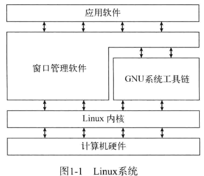

### 参考书目

[Linux命令行与shell脚本编程大全 第3版](https://z-lib.by/book/16645485/ad064d/linux%E5%91%BD%E4%BB%A4%E8%A1%8C%E4%B8%8Eshell%E8%84%9A%E6%9C%AC%E7%BC%96%E7%A8%8B%E5%A4%A7%E5%85%A8-%E7%AC%AC3%E7%89%88.html?dsource=recommend)

### 认识 Linux shell

#### 什么是Linux

Linux系统由四部分协同构成，分别是Linux内核（承担系统底层核心功能）、GNU工具（提供基础命令与工具链支持）、图形化桌面环境（实现图形化交互界面）以及应用软件（满足各类业务与用户需求）。各部分单独作用有限，需通过协作形成完整的Linux系统。

> [!note] GNU工具链简介
> 
> GNU工具链是由GNU项目（由自由软件基金会主导、遵循自由软件理念的开源项目，核心目标是开发一套完全自由（可自由使用、修改、分发）的类 Unix 操作系统及配套工具，为开源软件生态提供基础支撑。）开发的一套**集成化软件开发工具集合**，为Linux等类Unix系统及开源软件开发提供从源代码到可执行程序的全流程支持。其主要组件包括：
> 
> - GCC（GNU Compiler Collection）：多语言编译器，支持C、C++、Java、Fortran等，具备代码优化与跨平台编译能力。
> - **Binutils工具集**：包含链接器（`ld`）、汇编器（`as`）、目标文件查看工具（`objdump`）、符号表管理工具（`nm`）等，负责编译后处理。
> - **GDB（GNU Debugger）**：功能强大的调试器，支持断点、变量查看、调用栈跟踪等，便于定位程序错误。
> - **GNU Make**：自动化构建工具，通过`Makefile`管理编译流程，适合多文件、多模块项目。
> 
> GNU工具链以**跨平台兼容性**和**开源可定制性**著称，是现代软件开发不可或缺的基础工具链，广泛集成于主流Linux发行版，也支持Windows、macOS等平台。

##### 深入探究Linux内核

### Linux内核的核心作用与发展

Linux系统的核心是内核，负责控制所有硬件与软件，按需分配硬件资源并执行软件。Linux内核由**Linus Torvalds**在大学期间为仿造Unix开发，发布后通过社区协作不断演进，如今由开发团队负责代码合并把关。内核主要承担系统内存管理、软件程序管理、硬件设备管理、文件系统管理四项核心功能。

### 基本`bash`命令

#### 3-1 启动shell

GNU bash shell为Linux系统提供交互式访问能力，通常在用户登录终端时启动，且启动的shell由用户账户配置决定。系统的`/etc/passwd`文件包含所有用户账户列表及基本配置信息，该文件中每个用户条目以冒号分隔为七个字段，其中最后一个字段用于指定用户所使用的shell程序。

shell命令行界面（CLI）是否自动显示，取决于登录方式：通过虚拟控制台终端登录时，CLI提示符会自动出现；通过图形化桌面环境登录时，需启动图形化终端仿真器来访问CLI提示符。此外，我们虽聚焦`GNU bash shell`，但也会在后续章节涉及`dash`、`tcsh`等其他shell。

#### 3-2 shell提示符

启动终端仿真软件或登录Linux虚拟控制台后，会显示shell CLI提示符，它是输入shell命令的入口。默认bash shell提示符为美元符号（\$），不同Linux发行版（如Ubuntu、CentOS）的提示符格式存在差异，且可提供当前用户ID、系统名等辅助信息（后续章节会介绍更多可显示内容）。需注意，输入shell命令后需按回车键执行；此外，shell提示符可按需修改（第6章讲解修改方法），它能提示shell何时可接收新命令，bash手册对shell使用也有较大帮助。

