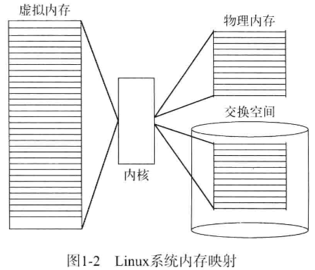
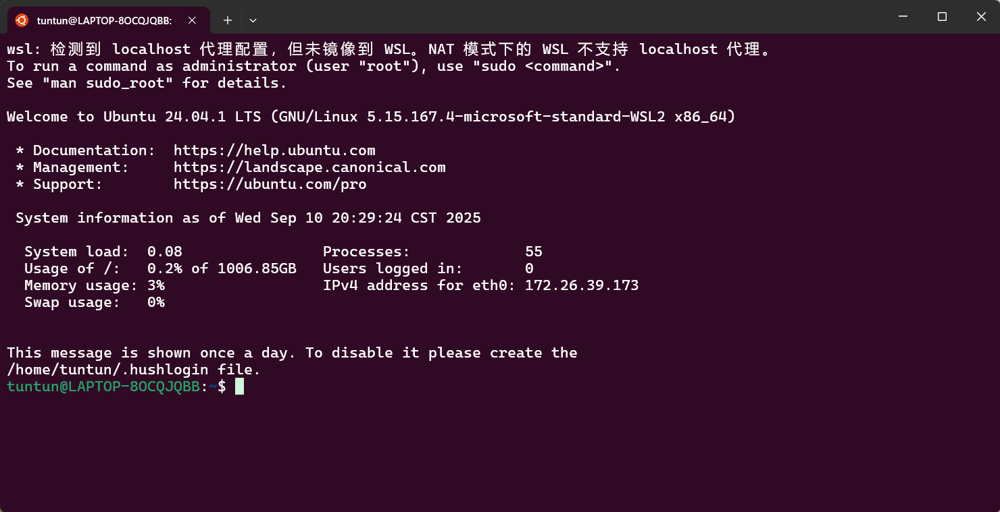

### 参考书目

[Linux命令行与shell脚本编程大全 第3版](https://z-lib.by/book/16645485/ad064d/linux%E5%91%BD%E4%BB%A4%E8%A1%8C%E4%B8%8Eshell%E8%84%9A%E6%9C%AC%E7%BC%96%E7%A8%8B%E5%A4%A7%E5%85%A8-%E7%AC%AC3%E7%89%88.html?dsource=recommend)

### WSL与Windows文件相互访问

在文件夹地址位置输入：`\\wsl$`，即可找到ubuntu的文件位置。


### 认识 Linux shell

#### 什么是Linux


Linux系统由四部分协同构成，分别是<span style="background:rgba(163, 218, 252, 0.55)">Linux内核</span>（承担系统底层核心功能）、<span style="background:rgba(163, 218, 252, 0.55)">GNU工具</span>（提供基础命令与工具链支持）、<span style="background:rgba(163, 218, 252, 0.55)">图形化桌面环境</span>（实现图形化交互界面）以及应用软件（满足各类业务与用户需求）。各部分单独作用有限，需通过协作形成完整的Linux系统。

> [!note] GNU工具链简介
> 
> GNU工具链是由GNU项目（由自由软件基金会主导、遵循自由软件理念的开源项目，核心目标是开发一套完全自由（可自由使用、修改、分发）的类 Unix 操作系统及配套工具，为开源软件生态提供基础支撑。）开发的一套**集成化软件开发工具集合**，为Linux等类Unix系统及开源软件开发提供从源代码到可执行程序的全流程支持。其主要组件包括：
> 
> - <span style="font-weight:bold; color:rgb(255, 182, 193)">GCC（GNU Compiler Collection）</span>：多语言编译器，支持C、C++、Java、Fortran等，具备代码优化与跨平台编译能力。
> - **Binutils工具集**：包含链接器（`ld`）、汇编器（`as`）、目标文件查看工具（`objdump`）、符号表管理工具（`nm`）等，负责编译后处理。
> - **GDB（GNU Debugger）**：功能强大的调试器，支持断点、变量查看、调用栈跟踪等，便于定位程序错误。
> - **GNU Make**：自动化构建工具，通过`Makefile`管理编译流程，适合多文件、多模块项目。
> 
> GNU工具链以**跨平台兼容性**和**开源可定制性**著称，是现代软件开发不可或缺的基础工具链，广泛集成于主流Linux发行版，也支持Windows、macOS等平台。

##### 深入探究Linux内核

Linux系统的核心是内核，负责控制所有硬件与软件，按需分配硬件资源并执行软件。Linux内核由**Linus Torvalds**在大学期间为仿造Unix开发，发布后通过社区协作不断演进，如今由开发团队负责代码合并把关。内核主要承担<span style="background:rgba(163, 218, 252, 0.55)">系统内存管理、软件程序管理、硬件设备管理、文件系统管理</span>四项核心功能。

1. **系统内存管理**

内核承担系统内存管理功能，既管理<span style="background:rgba(163, 218, 252, 0.55)">物理内存</span>，也通过硬盘“交换空间”创建并管理<span style="background:rgba(163, 218, 252, 0.55)">虚拟内存</span>，且在交换空间与物理内存间动态交换内容，使系统可用内存看似超出物理内存容量。内存以“页面”为单位划分，内核维护内存页面表，用于记录各页面是位于物理内存还是被换至磁盘。



> [!tip] 内存以“页面”为单位划分，内核维护内存页面表
>
> - **页面（page）**是操作系统内存管理的基本单位，通常为固定大小（如4KB），以页面为单位分配和交换内存可简化管理复杂度。
> - 程序运行依赖虚拟内存机制，内核按需将虚拟地址对应的页面加载到物理内存，不常用页面则换出到磁盘交换空间。
> - **内存页面表**是内核维护的关键数据结构，记录每个页面当前位于物理内存还是交换空间，支撑虚拟内存与物理内存、磁盘之间的高效切换，让系统在物理内存有限时也能为程序提供更大的可用内存空间。

> [!note] 交换空间（Swap Space）机制详解
>
> 交换空间是Linux等操作系统内存管理的重要机制。当物理内存（RAM）不足时，系统会将暂时不活跃的内存数据（以“页面”为单位，通常为4KB/页）临时转存到磁盘上的交换空间，从而释放物理内存供活跃进程使用，避免系统因内存耗尽而崩溃或终止进程。
>
> 交换空间有两种实现方式：
>
> - **交换分区**：在硬盘上预先划分的固定大小分区，系统启动时自动挂载。
> - **交换文件**：在现有文件系统中创建的普通文件，灵活性更高，可随时调整大小。
>
> 内核通过如LRU（最近最少使用）等算法，动态决定哪些内存页被换出到交换空间、哪些被换回物理内存，从而扩展系统的虚拟内存容量，支撑高内存负载场景。

内核会跟踪内存页面的使用状态，主动将一段时间未访问的页面换出至交换空间（即使物理内存仍有剩余）；当程序访问已换出的页面时，内核需先换出其他页面以腾出物理内存，再从交换空间换回目标页面，该过程会产生耗时并拖慢进程，且系统运行期间换出操作持续进行。

2. **软件程序管理**

Linux将运行中的程序称为<span style="font-weight:bold; color:rgb(255, 182, 193)">进程</span>，进程可在前台（输出可见）或后台运行，由内核统一管理。内核通过首个启动的init进程来启动系统所有其他进程，并为新进程在虚拟内存中分配专有区域，用于存储进程的数据与代码。不同Linux发行版对开机自启动进程的管理方式存在差异：部分通过`/etc/inittab`文件管理；部分（如Ubuntu）则借助`/etc/init.d`目录存放应用启停脚本，再由`/etc/rcX.d`目录（`X`代表运行级）中的入口来启动这些脚本。

Linux init系统通过**运行级**决定init进程启动的进程类型，系统共设5个启动运行级：

- 运行级1为单用户模式，仅启动基本系统进程与控制台终端进程，多用于系统故障时的紧急文件系统维护，且仅允许系统管理员登录操作；

- 运行级3会启动多数应用软件（如网络支持程序）；

- 运行级5则会启动图形化X Window系统，支持用户通过图形桌面登录。系统可通过调整运行级（如从3切换至5）改变整体功能形态（如从控制台系统切换为图形化系统）。

> [!note] 运行级2与4的特殊用途
>
> 在传统Linux SysVinit系统中，**运行级2**通常为“多用户模式但无网络服务”，但由于现代系统普遍依赖网络，该模式实际很少使用。**运行级4**则通常被保留为**用户自定义模式**，系统默认不定义具体服务，需由发行版或用户自行配置特定启动项。这两个运行级并未“消失”，而是因适用场景有限（2）或需手动定制（4），在默认说明中常被简化提及。如有需要，可在`/etc/rc2.d`或`/etc/rc4.d`目录中自行配置服务启动脚本。

3. **硬件设备管理**

内核通过驱动程序与硬件设备交互，驱动程序可通过“编译进内核”或“内核模块（可动态插入/移除，无需重编译内核）”的方式加载。

Linux将硬件抽象为**设备文件**，分为三类：<span style="background:rgba(163, 218, 252, 0.55)">字符型</span>（逐字符处理数据，如调制解调器、终端）、<span style="background:rgba(163, 218, 252, 0.55)">块设备</span>（批量处理数据，如硬盘）、<span style="background:rgba(163, 218, 252, 0.55)">网络设备</span>（基于数据包收发，如网卡、回环设备）。

> Linux遵循“一切皆文件”的设计理念，将硬件设备**抽象为特殊的“设备文件”**，使系统和应用程序能以操作普通文件的方式（如读、写、控制等）与硬件交互，无需关注硬件底层的复杂细节。

系统与设备的通信通过**设备节点**完成，节点由唯一的主设备号（标识设备类型）和次设备号（标识同类型下的具体设备）来标识。

> 在Linux系统中，硬件设备以**设备节点**（位于`/dev`目录的特殊文件）作为系统与设备通信的接口，所有对设备的操作（如读写）都通过操作设备节点完成。每个设备节点由**主设备号**和**次设备号**唯一标识：主设备号用于区分**设备类型**（如所有硬盘所属的块设备类共享同一主设备号），决定调用哪类设备的驱动程序；次设备号用于区分**同一类型下的具体设备**（如同一主设备号对应的不同硬盘/分区，通过次设备号区分），从而精准定位到单个设备。

4. **文件系统管理**

Linux内核支持多种文件系统类型（包含自有文件系统如ext系列、XFS，以及兼容其他操作系统的文件系统如NTFS、vfat等），服务器所使用的硬盘需格式化为这些支持的文件系统类型之一。内核通过**虚拟文件系统（VFS）**作为统一接口与各类文件系统交互，为不同文件系统提供标准通信方式，且会在文件系统挂载使用时缓存相关信息以优化性能。

| 文件系统  | 描 述                                                                 |
|-----------|----------------------------------------------------------------------|
| ext       | Linux扩展文件系统，最早的Linux文件系统|
| ext2      | 第二扩展文件系统，在ext的基础上提供了更多的功能|
| ext3      | 第三扩展文件系统，支持日志功能|
| ext4      | 第四扩展文件系统，支持高级日志功能|
| hpfs      | OS/2高性能文件系统|
| jfs       | IBM日志文件系统|
| iso9660   | ISO 9660文件系统（CD - ROM）|
| minix     | MINIX文件系统|
| msdos     | 微软的FAT16|
| ncp       | Netware文件系统|
| nfs       | 网络文件系统|
| ntfs      | 支持Microsoft NT文件系统|
| proc      | 访问系统信息|
| ReiserFS  | 高级Linux文件系统，能提供更好的性能和硬盘恢复功能|
| smb       | 支持网络访问的Samba SMB文件系统|
| sysv      | 较早期的Unix文件系统|
| ufs       | BSD文件系统|
| umsdos    | 建立在msdos上的类Unix文件系统|
| vfat      | Windows 95文件系统（FAT32）|
| XFS       | 高性能64位日志文件系统|

##### GNU工具

操作系统除内核对硬件的控制外，还需系统工具实现文件、程序控制等标准功能。

Linus开发Linux内核时，GNU组织已基于开源软件理念（允许自由使用、修改、集成且无需授权费），开发出一套完整的类Unix工具但缺乏适配的内核。<span style="background:rgba(163, 218, 252, 0.55)">Linux内核与GNU工具整合后，形成了功能完整的免费操作系统，通常被称为Linux</span>，也有“GNU/Linux”的称呼，用以致敬GNU组织的贡献。

###### 核心GNU工具

GNU项目为构建类Unix环境，移植了诸多Unix命令行工具，Linux系统使用的这组核心工具被称为**coreutils**（核心工具集）软件包。

该软件包由三部分组成：**文件处理工具、文本操作工具、进程管理工具**，每组工具都包含对Linux系统管理员与程序员至关重要的功能。

###### shell

GNU/Linux shell是交互式工具，通过命令行提示符实现用户与系统的交互，可输入、解释并执行命令，用于启动程序、管理文件及系统进程。

它包含内部命令（如文件操作、进程控制等），也能传递程序名至内核以启动外部程序；还支持将多个命令写入shell脚本，实现批量执行。Linux系统存在多种shell（各有特性侧重），多数发行版默认采用GNU开发的**bash shell**（作为Bourne shell的替代，全称“**Bourne again shell**”）。

| shell | 描 述 |
| ---- | ---- |
| ash | 一种运行在内存受限环境中简单的轻量级shell，但与bash shell完全兼容 |
| korn | 一种与Bourne shell兼容的编程shell，但支持如关联数组和浮点运算等一些高级的编程特性 |
| tcsh | 一种将C语言中的一些元素引入到shell脚本中的shell |
| zsh | 一种结合了bash、tcsh和korn的特性，同时提供高级编程特性、共享历史文件和主题化提示符的高级shell |

#### Linux 发行版

##### 核心发行版

|发行版|描述|
| ---- | ---- |
|Slackware|最早的Linux发行版中的一员，在Linux极客中比较流行|
|Red Hat|主要用于Internet服务器的商业发行版|
|Fedora|从Red Hat分离出的家用发行版|
|Gentoo|为高级Linux用户设计的发行版，仅包含Linux源代码|
|openSUSE|用于商用和家用的发行版|
|Debian|在Linux专家和商用Linux产品中流行的发行版|

##### 特殊用途发行版

|发行版|描述|
| ---- | ---- |
|CentOS|一款基于Red Hat企业版Linux源代码构建的免费发行版|
|Ubuntu|一款用于学校和家庭的免费发行版|
|PCLinuxOS|一款用于家庭和办公的免费发行版|
|Mint|一款用于家庭娱乐的免费发行版|
|dyne:bolic|一款用于音频和MIDI应用的免费发行版|
|Puppy Linux|一款适用于老旧PC的小型免费发行版|

### 走进shell

#### 进入命令行

图形化桌面出现前，Unix系统仅能通过shell的**文本命令行界面（CLI）**交互，CLI仅支持文本输入与基础文本、图形输出，仅需由显示器、键盘经串行电缆连接的哑终端即可操作。如今Linux虽普遍配备图形化桌面，但执行shell命令仍依赖CLI，且部分发行版中进入CLI的方式不易寻找。

##### 控制台终端

进入CLI可通过让Linux系统退出图形化桌面、进入文本模式，此时的界面为**Linux控制台**，它仿真早期硬接线控制台终端，是与系统直接交互的接口。系统启动后会自动创建**虚拟控制台**（运行在内存中的终端会话），多数Linux发行版会启动5 - 6个甚至更多虚拟控制台，无需外接多台哑终端，可通过单台计算机的显示器和键盘访问这些虚拟控制台。




### 基本`bash`命令

#### 启动shell

GNU bash shell为Linux系统提供交互式访问能力，通常在用户登录终端时启动，且启动的shell由用户账户配置决定。系统的`/etc/passwd`文件包含所有用户账户列表及基本配置信息，该文件中每个用户条目以冒号分隔为七个字段，其中最后一个字段用于指定用户所使用的shell程序。

shell命令行界面（CLI）是否自动显示，取决于登录方式：通过虚拟控制台终端登录时，CLI提示符会自动出现；通过图形化桌面环境登录时，需启动图形化终端仿真器来访问CLI提示符。此外，我们虽聚焦`GNU bash shell`，但也会在后续章节涉及`dash`、`tcsh`等其他shell。

#### shell提示符

启动终端仿真软件或登录Linux虚拟控制台后，会显示shell CLI提示符，它是输入shell命令的入口。默认bash shell提示符为美元符号（\$），不同Linux发行版（如Ubuntu、CentOS）的提示符格式存在差异，且可提供当前用户ID、系统名等辅助信息（后续章节会介绍更多可显示内容）。需注意，输入shell命令后需按回车键执行；此外，shell提示符可按需修改（第6章讲解修改方法），它能提示shell何时可接收新命令，bash手册对shell使用也有较大帮助。

#### 浏览文件系统

##### Linux文件系统

#### 文件和目录列表

#### 查看文件内容（无需调用其他文本编辑器）

##### 查看文件类型

`file`命令可探测文件内部以确定类型，避免直接打开二进制文件导致终端异常。它能识别多种文件：文本文件（含字符编码）、目录、符号链接（显示链接目标）、脚本文件（标注可执行属性）、二进制可执行程序（识别编译平台与依赖库等）。

```bash
$ file my_file
my_file: ASCII text
$
```

#### 
