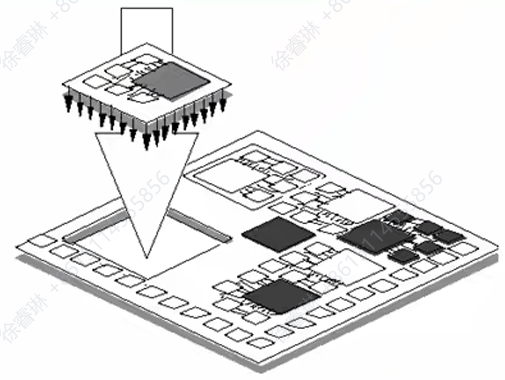

### 绪论

#### 课程要求与成绩分布

##### 成绩分布

- 作业 + 课堂测验：占比50%，包含5 - 6次平时作业和1 - 2次课堂测试，且严禁雷同抄袭。
- 期末考试：占比50%，为闭卷考试。

##### 教学安排

数学部分安排18 + 9讲，每讲2学时，总共54学时，其中2学时期中复习，2学时期末复习。

##### 课程助教及联系方式

- 李晓东（博3）：<lixj263@mail2.sysu.edu.cn>，发表领域为MICRO、ISVLSI。
- 钟佰清（博1）：<zhongbq@mail2.sysu.edu.cn>，发表领域为CCD、ISVLSI。
- 黄海秋（硕2）：<huanghq73@mail2.sysu.edu.cn>，发表领域为TCAS - II。

#### 课程参考资料

|序号|书名|作者|译者|出版社|出版时间|
| ---- | ---- | ---- | ---- | ---- | ---- |
|1|《数字集成电路——电路、系统与设计》（第二版）|Jan M. Rabaey，Anantha Chandrakasan，Borivoje Nikolic|周润德|电子工业出版社| - |
|2|《CMOS超大规模集成电路设计》（第四版）|Neil H. E.Weste & David Harris|周润德|电子工业出版社| - |
|3|《纳米CMOS集成电路——从基本原理到专用芯片实现》|Harry Veendrick|周润德|电子工业出版社| - |
|4|《现代VLSI设计：基于IP核的设计（第4版）（英文版）》|Wayne Wolf| - |电子工业出版社| - |
|5|《众核处理器——原理、设计与优化》|李兆麟，王明羽，魏少军| - |清华大学出版社|2021|
|6|《数字集成电路设计实践》|王明羽，虞志益，李兆麟| - |清华大学出版社|2025（拟出版）|

#### 什么是数字集成电路设计

从功能（Function）、逻辑（Logic）、电路（Circuit）到版图（Layout），依次递进，同时“Verification（验证）”贯穿整个流程，用于确保每个设计阶段的正确性，保障数字集成电路设计能按预期实现功能。

从需求到最终芯片主流程：

按设计与制造的先后顺序，分为10个关键阶段：

1. **Specifications（规格定义）**：明确芯片的核心需求，包括功能、功耗、性能、面积等，是设计的“目标蓝图”。
2. **Architectural Design（架构设计）**：基于规格，规划芯片的整体架构（如模块划分、数据通路等），是高层结构规划。
3. **RTL Coding & Functional Verification（RTL编码与功能验证）**：
   - 用硬件描述语言（HDL，如Verilog/VHDL）编写**寄存器传输级（RTL）代码**，描述“寄存器与数据传输逻辑”；
   - 同时通过“功能验证”，确保RTL代码实现了预期功能。
4. **Logic Synthesis（逻辑综合）**：将RTL代码转换为**门级网表**（由逻辑门、触发器等基本单元组成的电路描述），把抽象的RTL描述映射到具体逻辑单元。
5. **Logic Verification & Testing（逻辑验证与测试）**：验证门级网表的逻辑正确性，确保综合后的电路功能符合预期，还会涉及“可测性设计”（方便后续芯片测试）。
6. **Physical Design（物理设计）**：进入“物理层面”设计，包括**版图系统规划、布局、时钟树生成、布线**等，将逻辑网表转化为“物理版图”。
7. **Physical Verification & Signoff（物理验证与签核）**：对物理版图进行多维度验证（如DRC、LVS、静态时序分析、功耗分析等），验证通过后“签核”，才能进入制造环节。
   - DRC（设计规则检查）：确保版图符合“制造工艺规则”；
   - LVS（版图与网表比对）：确保版图和逻辑网表一致；
   - 静态时序分析/功耗分析：验证时序性能、功耗是否达标。
8. **Fabrication（制造）**：即“流片”，在晶圆厂通过半导体工艺，把版图“制造”成实际的芯片（晶圆上的电路）。
9. **Packaging & Testing（封装与测试）**：将晶圆上的芯片切割、封装，并测试封装后芯片的功能、性能，确保成品合格。
10. **Chip（芯片）**：最终交付的“成品芯片”。

> [!note]前端 - 后端细分流程
> 
> 流程聚焦于“设计阶段的分工”，明确**前端设计（逻辑层面）**与**后端版图设计（物理层面）**的边界与协作：
> 
> - **前端设计**：侧重逻辑层面的设计与验证，包括：
>   - 需求分析与工艺选择：明确需求并选定制造工艺；
>   - 电路与架构设计：对应“Architectural Design”阶段；
>   - 逻辑综合：对应“Logic Synthesis”阶段；
>   - 验证环节：包括**HDL仿真验证**（验证RTL代码功能）、**综合后仿真验证与形式验证**（验证门级网表）。
> 
> - **后端版图设计**：侧重物理层面的版图实现与验证，包括：
>   - 版图系统规划：整体布局与模块分布规划；
>   - 布局：将逻辑单元映射到具体物理位置；
>   - 时钟树生成：设计时钟信号传输网络，保障同步性；
>   - 布线：完成信号线的物理连接；
>   - 流片：对应“Fabrication”阶段；
>   - 验证环节：包括**版图后仿真验证、静态时序分析、功耗分析、DRC、LVS**等物理验证，以及**版图参数提取**（为后仿真提供物理参数）。

#### 集成电路设计方法学发展

**传统电路验证方法**

早期电路验证采用“实验板”方式，但存在明显不足：

- 与实际集成电路的差异大（实验板的环境、器件特性等，和真实芯片场景偏差明显）；
- 无法开展“容差分析”（如器件参数波动对电路的影响）和“极限条件验证”（如温度、电压极值下的电路表现）；
- 验证速度慢，效率低下。

**60 - 70年代的技术进展：Layout DRC + Circuit Simulation**

这一时期，集成电路设计开始借助计算机工具，核心特点是：

- **硬件基础**：依托“16位小型机”（提供计算能力支持）；
- **软件能力**：具备“交互式图形编辑”（方便设计师进行版图绘制）和“设计规则检查（DRC）”（确保版图符合芯片制造的工艺规则），同时结合“电路仿真”，初步实现了**计算机辅助的设计与验证**，提升了设计效率与规范性。

**电路模拟的基本方法**

通过列出“数学形式的电路方程”，再对这些方程进行求解，以此模拟、分析电路的行为特性。

> [!note] SPICE
>
> SPICE（全称 *Simulation Program with Integrated Circuit Emphasis*，意为“侧重于集成电路的仿真程序”）是**世界上第一个电路模拟程序**，由美国加州大学伯克利分校自1970年起开发，为集成电路设计的“仿真验证”奠定了关键基础。
>
> - 1975年：推出第一个版本 **SPICE2G**；
>
> - 1981年：更新至 **SPICE2G6**；
>
> - 在此基础上，后续衍生出多款电路模拟程序，包括 **SPICE3**、**HSPICE**、**PSPICE**，以及1990年出现的 **Fast SPICE** 等（相关参考可查阅资料页码“*Meth.p38,26*”）。

> [!note] 第二代：CAE（Computer Aided Engineering，计算机辅助工程）
>
> 80年代的CAE技术聚焦于三类关键能力的结合：
>
> - **版图布局与布线**（Layout Placement and Routing）：自动化完成芯片版图中元件的布局和线路连接；
> - **逻辑仿真**（Logic Simulation）：对电路逻辑功能进行模拟验证；
> - **版图与原理图比对**（LVS, Layout Versus Schematic）：验证版图是否与设计原理图一致。
>
> 依托32位工作站（相比第一代16位小型机，计算能力更强），能支撑更复杂的设计与仿真任务，形成了完整的“后端CAD工具链”，覆盖从逻辑图输入、逻辑模拟、电路模拟，到自动布局布线、物理设计检查的全流程，大幅提升了集成电路设计的自动化和系统化程度。
>
> **物理检查（Physical Checking）**是保障版图可制造性与设计正确性的关键，包含四类验证：
>
> - **DRC**（Design Rule Check）：设计规则检查，确保版图符合芯片制造工艺规则；
> - **ERC**（Electrical Rule Check）：电气规则检查，确保电路电气特性符合要求（如短路、悬空等问题）；
> - **LPE**（Layout Parameter Extraction）：版图参数提取，从版图中提取电气参数用于后续仿真/验证；
> - **LVS**（Layout Versus Schematic）：版图与原理图比对，验证版图和设计原理图的一致性。

> [!note] 第三代：EDA（Electronics Design Automation，电子设计自动化）
>
> 1. **Top-Down（自顶向下）设计技术**
>
>    这是一种从“系统高层需求”向“底层电路实现”逐步分解的设计流程，核心支撑为：
>    - **硬件描述语言（HDL）**：如VHDL、Verilog HDL，以代码形式描述硬件电路的行为、结构或功能（如逻辑运算、时序特性等），是高层设计的核心表达工具。
>    - **高层次综合与逻辑综合工具**：结合HDL，可自动将高层次设计描述（如算法级、行为级的HDL代码）转化为低层次逻辑电路表示（如门级网表），大幅提升设计效率。
>
> 2. **工艺无关性（Technology Independent）**
>
>    EDA设计具有与具体制造工艺解耦的优势：HDL源代码不绑定特定芯片工艺或硬件载体，可通过不同单元库、工艺库，灵活转化为多种电路形式（如ASIC、FPGA等），让设计具备可移植性与复用性，适配不同生产需求或硬件平台。

> [!note] 第四代EDA——超深亚微米（VDSM, Very Deep Sub-Micron）EDA
>
> **1. 时代背景与核心趋势**
>
> 自1997年以来，集成电路设计进入了**“片上系统（SoC）”时代**，即需将完整系统（如计算、存储、接口等功能）集成在单一芯片上。这对EDA工具提出了更高的复杂系统支持能力要求。
>
> **2. 设计方法：“自顶向下 + 自底向上”协同**
>
> - **自顶向下（Top-Down）**：用于系统级设计和宏模块（IP，Intellectual Property，知识产权模块）设计。从系统整体需求出发，分解并设计各功能模块（包括可复用的IP模块，如CPU核、DSP核等），保障系统架构的整体性与前瞻性。
> - **自底向上（Bottom-Up）**：通过IP复用技术实现SoC。由于SoC集成度极高，从头设计所有模块效率低下，因此复用“已验证的IP模块”（经过流片或大规模验证的成熟模块），从底层成熟IP向上集成，快速构建完整系统芯片，同时提升设计可靠性。

**IP复用（知识产权核复用）**

- **设计方法学**：采用**基于平台的设计方法**——不再从头设计所有模块，而是复用**已验证的功能模块**（这些预先设计好的模块被称为“IP核（Intellectual Property核）”）。
- **核心逻辑**：IP核类似“功能积木”，可重复集成到SoC中，大幅减少重复开发时间、提升设计效率，助力芯片快速推向市场。

> [!note] IP核
>
> **IP核（Virtual Component，虚拟组件）主要分为四类：**
>
> 1. **软核（Soft Core）**  
>    - 形式：可综合的HDL（如Verilog/VHDL）代码  
>    - 特点：灵活性高，可针对不同工艺库进行逻辑综合，适配多种芯片制造工艺。
>
> 2. **固核（Firm Core）**  
>    - 形式：网表（Netlist）  
>    - 特点：为逻辑综合后的产物，描述逻辑门及其连接关系，比软核更接近物理实现，但仍具一定适配性。
>
> 3. **硬核（Hard Core）**  
>    - 形式：GDSII（版图数据格式）  
>    - 特点：已完成物理设计，包含确定的物理尺寸和时序信息，复用性强但灵活性低（物理结构固定）。
>
> 4. **验证核（Verification Core）**  
>    - 形式：行为级HDL模型（Behavioral HDL model），一般为不可综合代码  
>    - 特点：仅用于功能验证，不用于生成实际电路，常用于设计阶段的仿真和验证。

随着对性能、功耗、体积和开发效率的要求提升，系统集成方式从“分立PCB”走向“高度集成SoC”，再走向兼顾集成度与灵活性的“Chiplet+先进封装”方案。核心权衡：集成度 vs 设计/工艺灵活性。

1. **PCB（印刷电路板）**

- **定义**：在PCB上用导线连接多个独立芯片/模块（CPU、ROM、外设等）。
- **优点**：设计和替换灵活、开发门槛低。
- **缺点**：芯片间连线长，导致功耗高、延迟大、体积大，不利于高性能/低功耗需求。

2. **SoC（片上系统）**

- **定义**：把多类功能模块（CPU、存储、接口、模拟等）集成到单一芯片上。
- **优点**：消除长连线，显著降低功耗和延迟，体积更小，适合高集成度产品（移动、嵌入式、消费电子）。
- **缺点**：所有模块受限于单一工艺，设计复杂度和流片成本高，IP复用/迭代成本大。

3. **Chiplet（小芯片）+封装层集成**

- **定义**：把系统拆成多个专用Chiplet，在封装层通过高速标准化接口（如 UCIe）组合成系统平台。
- **优势**：
  - 模块化复用：Chiplet像“功能积木”，按需组合，提升灵活性与复用率；
  - 工艺适配：每个Chiplet可采用最适合的工艺（计算用先进逻辑，存储用存储工艺等）；
  - 兼顾集成度与灵活性：通过2D/2.5D/3D封装和高速互联实现高带宽、低延迟的片上级联。
- **关键技术**：标准化的芯片间接口（UCIe等）、先进封装（硅互连、硅中介层、互联带宽与功耗）、热管理与测试/良率控制。

##### 测试平台

测试平台是为“模拟验证”编写的代码，核心作用是：对待测设计（或模型）产生**预先确定的输入序列**，再**选择性地观察、验证其响应结果**，以此判断待测设计是否符合预期。

既可以用**硬件描述语言**（如Verilog、VHDL等）编写，也能采用专用的**验证语言**（如e语言、OpenVera等）编写。

测试平台的结构：

- **激励生成**：负责产生待测模型需要的输入信号（测试激励）。
- **待测模型**：被验证的对象（比如某段硬件逻辑、一个模块等）。
- **响应检测**：接收待测模型的输出，验证其是否与预期结果一致。

这三个部分共同构成“测试平台”，完成“输入激励→待测模型处理→输出响应验证”的全流程验证。

**可复用的测试基准——总线功能模型（BFM，Bus-Function Model）**

BFM是一种程序模块，作用是：将“测试数据组提供的测试数据”，通过**统一的任务接口**，按照“待测模型（或设计）端口的时序和协议”进行封装、组合，使其能被待测对象正确识别与处理。

BFM由**子程序、Task（任务）**等组成，是“代替总线的简单模型”，核心优势是**可复用**——无需为不同验证场景重复开发总线交互逻辑，能大幅提升验证效率。

#### 集成电路（IC）产业的完整产业链流程

1. 上游：晶圆材料与设计环节

- **晶圆材料厂**：负责生产芯片的基础材料——晶圆。流程为：
  硅原料 → 拉晶（制成单晶硅棒）→ 切割（切成硅片）→ 研磨 → 清洗，最终得到可用的晶圆。

- **电路设计公司**：完成芯片的电路设计，利用**CAD（计算机辅助设计）**工具优化设计，再通过**Tape out（流片）**将设计数据交付制造环节。

- **光罩制作厂**：根据设计数据制作**Reticle（光罩）**——光刻工艺中用于“复印”电路图案的模板。

2. 中游：芯片制造（集成电路制造厂）

集成电路制造厂（晶圆厂，Fab）是核心环节，接收**晶圆**和**光罩**后，开展一系列精密工艺：

- 初始流程：硅片投入 → 刻号 → 清洗；
- 薄膜制备：氧化、化学气相沉积、金属溅镀、护层沉积（构建芯片的各层薄膜结构）；
- 图形化与掺杂：微影（光阻涂覆、曝光、显影）→ 蚀刻 → 离子植入/扩散 → 光阻去除（在薄膜上“雕刻”电路图案并实现掺杂改性）；
- 晶圆级测试：**WAT测试（晶圆级电性测试）**，初步检测晶圆上每个芯片的电性是否合格。

3. 下游：封装、测试与交付

- **IC封装厂**：对制造好的晶圆进行后处理，流程为：切割（将晶圆上的单个芯片分离）→ 打线（芯片与封装引脚的金线键合）→ 封装（给芯片加外壳，保护芯片并提供外部引脚）。

- **IC测试厂**：进行多轮测试确保芯片功能可靠：
  硅片针测（封装前，对晶圆上的芯片初步测试）→ IC测试（封装后，全面测试芯片功能、性能）→ Burn in（老化测试，筛选早期失效芯片），最终将合格芯片交付**客户**。

### CMOS器件基础

#### 纳米工艺下VLSI的挑战与设计目标变化

一、**纳米工艺VLSI的核心挑战**

- **功耗**：功耗密度上升，漏电功耗占比增加。
- **互连**：互连寄生效应的影响愈发显著。
- **不确定性**：各类扰动增多，参数偏差逐渐起支配作用。
- **可靠性与可制造性**：加工难度加大。
- **超高速电路**：超高速场景下的器件/电路模型、电路技术需突破。

二、**设计目标的发展趋势**

设计需在**面积、性能、可靠性/成品率、功耗/能耗、上市时间**多维度间权衡，呈现两大特征：

- **多元化**：部分应用需对多项指标做多维度优化，折中问题更复杂。
- **极端化**：部分应用对单项指标的要求持续挑战技术极限。

#### MOS场效应晶体管

##### 阈值电压

$V_T$ 是MOS管反型层载流子浓度等于衬底掺杂浓度（**强反型状态**）时的栅源电压 $V_{GS}$。

强反型需通过栅源电压克服/补偿四类物理效应，各效应的特性与关联参数如下：

1. **金属 - 半导体功函数差**：由材料固有参数决定，对应参数 $ \phi_{ms} $（功函数差项）。
2. **耗尽沟道区固定电荷补偿**：与工艺、衬底偏置相关，对应电荷 $ Q_B $（NMOS中 $ Q_B $ 为负）；可通过额外注入离子电荷 $ Q_I $（NMOS常为负，采用p型注入）调节 $ V_T $。
3. **反型载流子产生**：属工艺参数，对应费米电势项 $ 2\phi_F $（p衬底时 $ 2\phi_F $ 为负），需产生与衬底空穴浓度匹配的电子载流子。
4. **氧化层表面电荷补偿**：属工艺参数，对应氧化层表面正电荷 $ Q_{SS} $。

综合上述效应，阈值电压的表达式为：

$$ V_T = \phi_{ms} - 2\phi_F - \frac{Q_B}{C_{ox}} - \frac{Q_{SS}}{C_{ox}} - \frac{Q_I}{C_{ox}} $$

其中，$ C_{ox} $ 为氧化层电容，通过电容将“电荷影响”转化为“电压贡献”；公式中各项分别对应**功函数差**、**费米电势**、**耗尽区电荷**、**表面电荷**、**注入电荷**的电压效应。

##### 体效应

- **现象**：当源 - 体电压 $V_{SB}$ 增大（$V_{SB} \uparrow$）时，源端势垒上升，导致阈值电压 $V_T$ 升高（$V_T \uparrow$）。

- **阈值电压公式**
  考虑衬偏效应的阈值电压表达式：
  $$
  V_T = V_{T0} + \gamma \left( \sqrt{V_{SB} + |2\phi_F|} - \sqrt{|2\phi_F|} \right)
  $$
  各参数含义：
  - 衬偏效应系数 $\gamma$：$\gamma = \frac{1}{C_{OX}} \sqrt{2Q\varepsilon_{Si}N_A}$（$C_{OX}$ 为氧化层电容，$\varepsilon_{Si}$ 为硅的介电常数，$N_A$ 为衬底受主浓度）；
  - 零衬偏阈值电压 $V_{T0}$：
    $$
    V_{T0} = \phi_{ms} - 2\phi_F - \frac{Q_{B0}}{C_{OX}} - \frac{Q_{SS}}{C_{OX}} - \frac{Q_I}{C_{OX}}
    $$
    （$\phi_{ms}$ 为金属 - 半导体功函数差，$\phi_F$ 为费米电势，$Q_{B0}$ 为零衬偏时耗尽区电荷，$Q_{SS}$ 为氧化层表面电荷，$Q_I$ 为注入电荷）。

