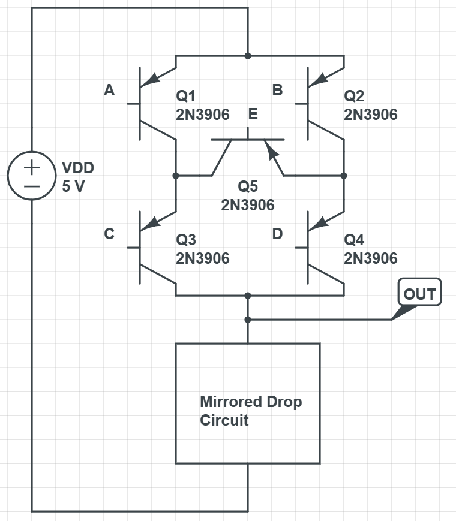
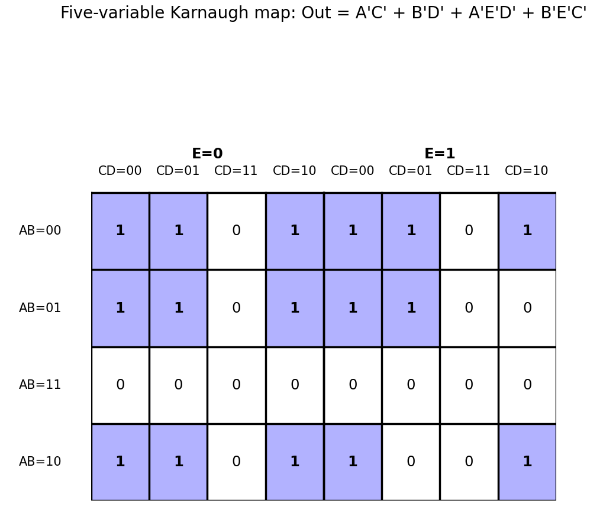
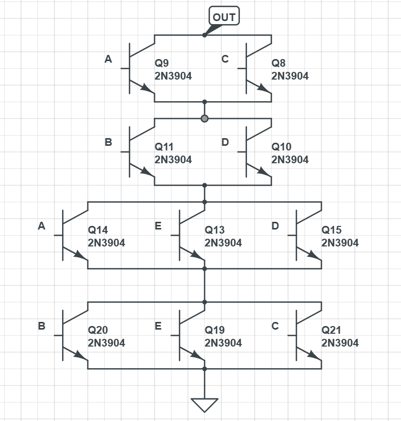
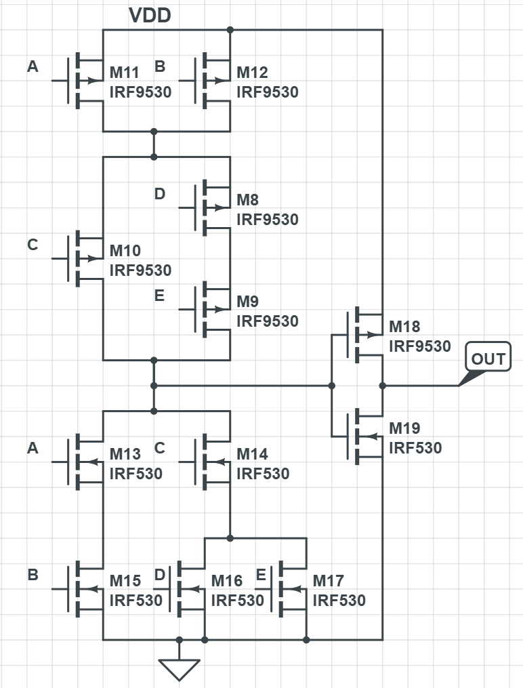

### Part I - Homework

#### Homework 01 

> [!note] T1
>
>
>
> 1. 考虑下图的静态互补CMOS逻辑门,写出布尔表达式(注意化简),并画出下拉网络结构;
> 2. 画出实现Y=AB+C(D+E)的静态互补CMOS逻辑门电路的晶体管级电路图。

> [!note] my solution
>
> 1. 直接列出来所有的导通组合，然后化简逻辑式。  
>    具体来说：`OUT= A'C'+B'D'+A'E'D'+B'E'C'`（感觉这个已经是与非最简了）
>
>    卡诺图：
>
>    
>
>    因此，化为最简就是：`OUT = A'C' + B'D' + A'D'E' + B'C'E'`，然后为了绘制下拉电路，我们需要求解`OUT'`的表达式，利用德摩根律，`OUT' = (A+C)(B+D)(A+D+E)(B+C+E)`
>
>    所以最后的镜像下拉电路为：
>
>    
>
> 2. 由逻辑表达式：`Y=AB+C(D+E)`，因为上拉（即`Y`的表达式）是由PMOS组成的，但是这个似乎不好换成全是非的格式，所以我决定`Y`由NMOS来构成，`Y'`由PMOS来构成，然后在输出添加一个反相器电路：
>
>    
