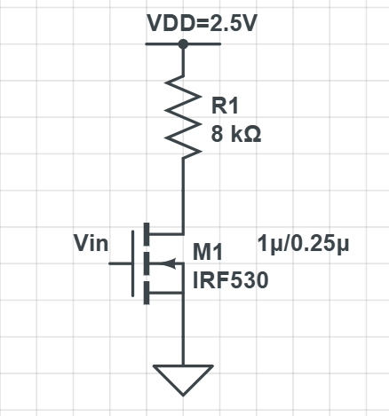

### Part I - Homework

#### Homework 01 

> [!note] T1
>
>
>
> 1. 考虑下图的静态互补CMOS逻辑门,写出布尔表达式(注意化简),并画出下拉网络结构;
> 2. 画出实现Y=AB+C(D+E)的静态互补CMOS逻辑门电路的晶体管级电路图。

> [!note] my solution
>
> 1. 直接列出来所有的导通组合，然后化简逻辑式。  
>    具体来说：`OUT= A'C'+B'D'+A'E'D'+B'E'C'`（感觉这个已经是与非最简了）
>
>    卡诺图：
>
>    
>
>    因此，化为最简就是：`OUT = A'C' + B'D' + A'D'E' + B'C'E'`，然后为了绘制下拉电路，我们需要求解`OUT'`的表达式，利用德摩根律，`OUT' = (A+C)(B+D)(A+D+E)(B+C+E)`
>
>    所以最后的镜像下拉电路为：
>
>    
>
> 2. 由逻辑表达式：`Y=AB+C(D+E)`，因为上拉（即`Y`的表达式）是由PMOS组成的，但是这个似乎不好换成全是非的格式，所以我决定`Y`由NMOS来构成，`Y'`由PMOS来构成，然后在输出添加一个反相器电路：
>
>    

> [!note] T2
> 请分别解释说明体效应、短沟效应、DIBL对阈值电压的影响及原理(注:  漏端感应势垒降低DIBL效应请自学复习)。

> [!note] 体效应 (Body Effect)
>
> 体效应会使阈值电压 $V_{t}$ 升高。
>
> 体效应是指衬底(Body)像第二个栅极一样，反向控制着晶体管的开启难度。
>
> 标准的阈值电压$V$ ,是在源极(Source)和衬底(Body)电位相等($V_{gg}=0$)的情况下定义的。此时,栅极只需要施加足够的电压来耗尽沟道区的原有载流子,并使其反型形成导电沟道即可。然而,在很多实际电路中(比如串联的晶体管),源极的电位会高于衬底的电位,即存在源-体反向偏压$V_{SB}>0$。
>
> 1. 这个反向偏压会使得源极和衬底之间的PPN结耗尽区变得更宽。
> 2. 耗尽区变宽意味着,在这个区域里有更多的、被固定在晶格中的离子电荷(对于NMOS,是负的受主离子)。
> 3. 现在,栅极(Gate)要想在表面形成导电沟道,就必须施加一个更高的电压,因为它不仅要像以前一样耗尽和反型沟道,还必须额外地耗尽掉这个因为$V_{SB}$反偏而"多出来"的更宽的耗尽层中的电荷。
>
> 这个需要额外施加的栅极电压,就表现为阈值电压的升高。$V_{SB}$越大,耗尽区越宽,阈值电压也就越高。
>
> ---
>
> [!note] 短沟效应 (Short-Channel Effect, SCE)
>
> 短沟效应会使阈值电压 $V_{t}$ 降低。
>
> 当沟道变得很短时，源极和漏极会“伸手”过来帮忙分担一部分栅极的工作，使得晶体管更容易开启。
>
> 在理想的长沟道晶体管中，我们假设栅极下方的耗尽区电荷完全由栅极电压来控制，这个耗尽区可以看作一个长方形。
>
> 但是，当沟道长度L变得非常短，与源、漏结的耗尽区宽度可以相比拟时：
>
> 1. 源极和漏极自身的耗尽区会侵入到栅极下方的区域。这意味着，原本应该完全由栅极来控制的耗尽区总电荷，现在有一部分被源极和漏极的电场“瓜分”掉了。
> 2. 对于栅极来说，它需要控制的总电荷量变少了。在栅极下方，由它负责的耗尽区形状不再是长方形，而变成了一个梯形。
> 3. 由于需要控制的电荷总量减少，栅极只需要一个更低的电压就能完成耗尽和反型，从而开启晶体管。
>
> 因此，随着沟道长度L的缩短，这种“电荷共享”效应越发明显，导致阈值电压$V_{t}$不断降低。
>
> ---
>
> [!note] DIBL效应 (Drain-Induced Barrier Lowering)
>
> DIBL可以看作是短沟效应的一种极端情况，特指漏极的高电压“遥控”降低了开启门槛。
>
> DIBL效应会使阈值电压 $V_{t}$ 降低。
>
> 在晶体管关断时，源极和沟道之间存在一个势垒(Potential Barrier)，像一堵墙一样阻止电子从源极流出。栅极电压的作用就是降低这堵墙的高度。
>
> 在短沟道器件中：
>
> 1. 当施加一个较高的漏极电压($V_{DS}$)时，漏极强大的电场会“穿透”短沟道，一直影响到源极附近的区域。
> 2. 这个来自漏极的电场，会直接帮助降低源-沟之间的势垒高度。也就是说，漏极分担了一部分原本应该由栅极来完成的“降势垒”工作。
> 3. 既然漏极已经帮忙把墙的高度降下来了一部分，那么栅极只需要施加一个更低的电压就能将墙完全推倒，让电流通过。
>
> 因此，漏极电压$V_{DS}$越高，DIBL效应越强，阈值电压$V_{t}$就越低。这也是导致现代芯片亚阈值漏电流增大的一个主要原因。

>[!note] T3
> 请分别解释说明速度饱和对短沟器件和长沟器件的影响及原理

> [!warning] 问题分析
>
> 跟据已知的长、短沟道饱和原因，我们可以归纳为下表： 
>
> | 特性               | 长沟道器件 | 短沟道器件 |
> |--------------------|------------|------------|
> | 内部电场           | 较弱       | 非常强     |
> | 饱和机理           | 沟道夹断 (Pinch - off) | 速度饱和 (Velocity Saturation) |
> | 饱和电流 $I_{Dsat}$ | 与 $(V_{GS} - V_t)^2$ 成平方关系 | 与 $(V_{GS} - V_t)$ 成线性关系 |
> | 对 $V_{DS}$ 的依赖 | 饱和区电流基本不随 $V_{DS}$ 变化 | 饱和区电流对 $V_{DS}$ 更敏感（输出电阻更小） |

>[!note] my solution
>
> 1. **对长沟道器件的影响：影响很小，几乎不发生**
>
>    - **电场强度弱**：器件内的横向电场强度约等于 $E \approx V_{DS}/L$。因为沟道长度 $L$ 很大，所以在正常的漏源电压 $V_{DS}$ 下，器件内的平均电场强度 $E$ 比较弱。
>    - **达不到极限速度**：这个较弱的电场，不足以将载流子加速到它们的物理极限速度 $v_{sat}$。
>    - **饱和机理**：长沟道器件的饱和，是由“沟道夹断 (Pinch - off)”效应引起的。即当 $V_{DS}$ 增大到一定程度，漏极附近的沟道被完全耗尽（被“夹断”了），电流通路受阻，从而导致电流不再显著增加。
>
> 2. **对短沟道器件的影响：影响巨大，是主导因素**
>
>    - **电场强度极强**：同样根据 $E \approx V_{DS}/L$，因为沟道长度 $L$ 非常小，即使在很低的漏源电压 $V_{DS}$ 下，器件内部的平均电场强度 $E$ 也会变得异常强大。
>    - **迅速达到极限速度**：这个极强的电场会使载流子在极短的距离内就被迅速加速到其物理极限速度 $v_{sat}$。
>    - **饱和机理**：在这种情况下，载流子远在沟道发生“夹断”之前，就已经达到了速度饱和。此时，限制电流大小的瓶颈不再是沟道是否被夹断，而是载流子自身的“最高限速”。电流的大小变成了由 $I_{Dsat} = W \cdot Q_{inv} \cdot v_{sat}$（沟道宽度 × 沟道电荷密度 × 饱和速度）决定。因为速度 $v$ 无法再增加，所以电流也就饱和了。

>[!note] T4
> 如下图所示电路，已知 M1 的 $V_{T0}=0.43\text{V}$，$V_{DSAT}=0.63\text{V}$，$k'=115\times10^{-6}\text{A}/\text{V}^2$，沟道尺寸如图所示，单位沟道宽度的覆盖电容 $C_{\text{gso}}=C_{\text{gdo}}=0.31\text{fF}/\mu\text{m}$，单位面积的氧化层电容 $C_{\text{ox}}=6\text{fF}/\mu\text{m}^2$。请计算（忽略体效应和沟道长度调制效应）：
>
> 
>
> （1）当 $V_{\text{in}} = 2.5\text{V}$ 时 $V_{\text{out}}$ 的稳态电压（记为 $V_{\text{OL}}$）是多少？此时 M1 管处在什么工作区？（提示：应判断晶体管是否发生速度饱和）
>
> （2）如果 $V_{\text{in}}$ 从 $0\text{V}$ 上升到 $2.5\text{V}$，而 $V_{\text{out}}$ 的初始电压等于 $2.5\text{V}$，那么从 $\text{In}$ 端变化开始到 $V_{\text{out}}$ 达到稳态这个过程中由 $\text{In}$ 端净注入的电荷量等于多少？

>[!warning] 问题分析
> 这是一个电阻负载型NMOS反相器，其上拉部分是一个固定的线性电阻，而不是一个PMOS管。
>
> (1)是一个直流静态问题。核心是基尔霍夫电流定律 (KCL)，即在稳态下，流过上拉电阻的电流$I_R$必须等于流过下拉NMOS管的电流$I_{DS}$。我们需要根据这个平衡条件求解输出电压。
>
> (2)是一个动态电荷问题。核心是电荷的基本公式 $Q = C · V$。我们需要计算出M1管的总输入电容(栅电容)，然后乘以输入电压的变化量，得到注入的总电荷。
>
> **参数解读**：
>
> | 参数表达式               | 参数名称及定义                                                                 | 相关公式                                                                 | 题目中的用途和分析                                                                 |
> |--------------------------|------------------------------------------------------------------------------|--------------------------------------------------------------------------|-----------------------------------------------------------------------------------|
> | $V_{T0} = 0.43V$         | **零偏置阈值电压**：$V_T$为开启MOS管的最小栅源电压，下标$0$表示$V_{SB}=0$（零偏置），无体效应，本题忽略体效应，可固定使用。 | 1. 饱和区电流（长沟道）：$I_{Dsat} \propto (V_{GS} - V_{T0})^2$ 2. 饱和区电流（短沟道）：$I_{Dsat} \propto (V_{GS} - V_{T0})$ 3. 线性区电流：$I_{DS} \propto (V_{GS} - V_{T0})V_{DS}$ | 1. 判断晶体管“开启/关闭”的核心门槛 2. 问题(1)中计算过驱动电压：$V_{GS} - V_{T0} = 2.5V - 0.43V = 2.07V$，该值决定M1管的导通程度与电流大小 |
> | $V_{DSAT} = 0.63V$       | **饱和漏极电压**：短沟道器件特有参数，定义晶体管从线性区过渡到饱和区的边界点（长沟道边界为$V_{GS}-V_T$，短沟道因速度饱和更复杂，本题直接给出简化分析）。 | 1. 工作区判断：    - $V_{DS} < V_{DSAT}$ → 线性区    - $V_{DS} \ge V_{DSAT}$ → 饱和区 2. 短沟道饱和电流：$I_{DSAT} = k_n((V_{GS} - V_{T0})V_{DSAT} - V_{DSAT}^2/2)$ | 1. 取代传统$V_{GS}-V_T$判断工作区 2. 问题(1)中，通过比较$V_{out}=0.312V$与$V_{DSAT}=0.63V$（$0.312V < 0.63V$），确定M1管工作在线性区 |
> | $k' = 115 \times 10^{-6} A/V^2$ | **工艺跨导系数**：由芯片制造工艺决定的常数，代表单位尺寸晶体管的“强度”，物理本质为$k' = \mu_n C_{ox}$（载流子迁移率×单位面积栅氧电容）。 | 计算特定尺寸晶体管的跨导系数：$k_n = k' \times \frac{W}{L}$              | 1. 作为“工艺”与“具体器件”的中间连接参数，不直接参与电流计算 2. 问题(1)中计算M1管的$k_n$：$k_n = 115 \times 10^{-6} \times \frac{4}{1} = 460 \times 10^{-6} A/V^2$，后续电流计算均基于此$k_n$ |
> | $C_{gso} = C_{gdo} = 0.31 fF / \mu m$ | **单位沟道宽度的覆盖电容**：因工艺导致栅极与源极/漏极物理重叠形成的寄生电容，参数值表示每1微米晶体管宽度对应的覆盖电容大小。 | 1. 总覆盖电容计算：$C_{overlap} = (C_{gso} + C_{gdo}) \times W$ 2. 总栅电容$C_g$的组成部分之一 | 问题(2)中计算总栅电容：M1管宽度$W=1\mu m$，总覆盖电容为$(0.31 + 0.31) \times 1 = 0.62 fF$，是计算总注入电荷的关键项 |
> | $C_{ox} = 6 fF / \mu m^2$ | **单位面积的氧化层电容**：描述栅极下方绝缘氧化层的电容特性，与氧化层材料、厚度相关（厚度越薄，$C_{ox}$越大），是工艺先进性指标之一。 | 1. 栅-沟道电容计算：$C_{gc} = C_{ox} \times W \times L$ 2. 工艺跨导系数组成：$k' = \mu_n C_{ox}$ | 问题(2)中计算总栅电容：M1管$W=1\mu m$、$L=0.25\mu m$，栅-沟道电容$C_{gc} = 6 \times 1 \times 0.25 = 1.5 fF$，是总栅电容的最大组成部分 |

>[!note] my solution
>
> 
