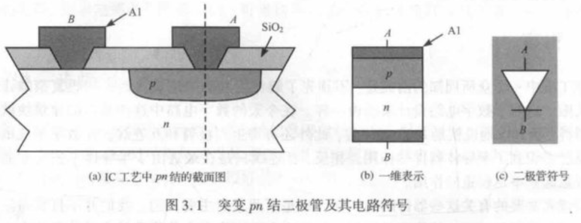
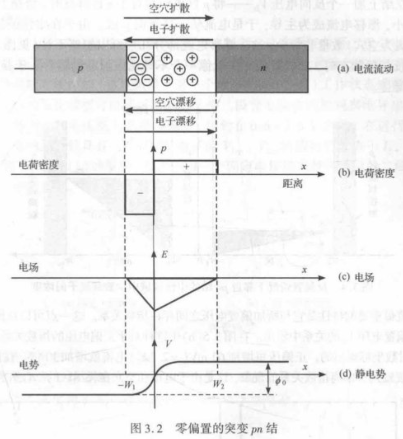
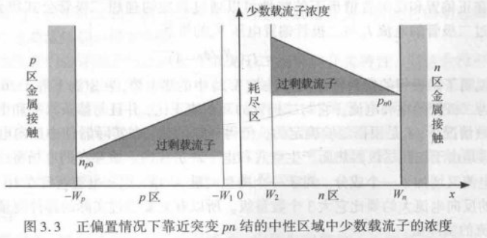

### 器件

- **基础器件的核心作用**：数字电路以半导体硅器件（如MOS晶体管）、寄生二极管及互连线为核心基础单元；其中互连线因半导体工艺尺寸持续缩小，近年对电路的影响显著提升。

> [!note] 寄生二极管
>
> **核心定义**：寄生二极管（Parasitic Diode）是半导体器件（如MOSFET、IGBT等）在制造过程中，由器件结构（如PN结）自然形成的、非刻意设计的二极管结构，与器件核心功能无直接关联，但难以消除。
>
> **形成原理**：以NMOSFET为例，源极和漏极为N型区，衬底为P型区，源极-衬底、漏极-衬底天然形成两个PN结。在特定偏置下，某一PN结可正向导通，表现为寄生二极管特性。
>
> **关键特性**：
>
> - 参数不可控，性能通常劣于专用二极管。
> - 在CMOS结构中，NMOS与PMOS的寄生二极管可能形成双向导通路径，需注意规避。
>
> **电路影响**：
>
> - 正面：可作为自然续流路径，保护器件免受反向尖峰电压损伤。
> - 负面：增加功耗、影响开关速度，在高频或低功耗电路中需通过设计优化抑制其影响。

- **器件模型的价值与层级**：为简化复杂数字电路设计，需通过**抽象模型**在精度与复杂性间折中：
  - 一阶模型：精度有限，适用于**手工分析**，帮助理解电路工作机制与核心参数。
  - 高阶模型（二阶及以上）：精度更高，需结合计算机辅助模拟以获取更准确的分析结果。

| 模型阶数      | 目标        | 精度       | 适用场景                | 典型工具          |
| --------- | --------- | -------- | ------------------- | ------------- |
| 一阶（手工）    | 快速估算、直观理解 | ±10–20 % | 拓扑选择、初值计算           | 纸面/计算器        |
| 二阶及以上（仿真） | 定量验证、边角分析 | ±3–5 %   | 时序 sign-off、功耗/噪声评估 | SPICE、Spectre |

- **模型参数的非绝对性**：模型给出的元件参数为典型值，实际参数会随**工作温度**、**生产批次**甚至**同一圆片内的不同器件**发生变化；本章包含对工艺偏差及其影响的简要探讨。

#### 二极管

二极管在数字MOS电路中的作用

- **隐性存在与核心影响**：二极管虽少直接出现在数字门电路图中，但广泛内嵌于MOS管内部（以反向偏置二极管形式），直接影响器件行为；其寄生元件形成的**电压相关电容**，对MOS数字逻辑门的开关特性起关键作用。
- **防护功能**：可保护集成电路（IC）的输入器件，抵御静电荷损害。
- 我们仅围绕对数字MOS电路设计有影响的二极管特性展开，重点关注反向偏置模式下的工作行为。

##### 二极管简介 -- 耗尽区

一、**pn结二极管的结构**

- 由p型（掺受主杂质，空穴为多子）和n型（掺施主杂质，电子为多子）半导体通过“掺杂过渡薄层”构成**阶跃结（突变结）**，铝接触为p、n端提供电气接口。
- 电路符号及分析时常用**一维简化模型**（如图所示）。

二、**耗尽区的形成机制**

p型与n型材料接触后：

1. 载流子因浓度梯度扩散：电子从n区向p区、空穴从p区向n区扩散。
2. 空间电荷积累：扩散导致p区留下负受主离子、n区留下正施主离子，形成**耗尽区（空间电荷区）**。
3. 电场与电流平衡：耗尽区电荷形成从n指向p的电场，使电子向n区、空穴向p区漂移；最终**漂移电流与扩散电流大小相等、方向相反**，净电流为零。

三、**零偏置pn结的内建电势**

- **内建电势（$\phi_0$）**：零偏置下pn结两侧的固有电势差，由p型与n型半导体的掺杂浓度差异决定。
- 计算公式：

   $$\phi_0 = \phi_T \ln\left[\frac{N_A N_D}{n_i^2}\right] \tag{3.1} $$

  其中，$\phi_T$为**热电势**，满足：

  $$ \phi_T = \frac{kT}{q} \approx 26\ \text{mV}\ (\text{300 K时}) \tag{3.2} $$

  $N_A$、$N_D$分别为p型受主、n型施主的掺杂浓度；$n_i$为半导体本征载流子浓度（硅在300 K时约为$1.5 \times 10^{10}\ \text{cm}^{-3}$）。

> [!note] 零偏置内建电势计算示例
>
> **条件**：突变结掺杂浓度 $N_A=10^{15}\ \text{原子/cm}^3$，$N_D=10^{16}\ \text{原子/cm}^3$。
>
> **计算过程**：将参数代入式$(3.1)$，热电势取 $\phi_T=26\ \text{mV}$，$n_i^2=(1.5 \times 10^{10})^2=2.25 \times 10^{20}$，得：
>
> $$
> \phi_0 = 26 \ln\left[\frac{10^{15} \times 10^{16}}{2.25 \times 10^{20}}\right]\ \text{mV} = 638\ \text{mV}
> $$

零偏置时，若$N_A > N_D$（p型掺杂更浓），pn结p侧耗尽区电荷密度更高；内建电势的大小由掺杂浓度与本征载流子浓度共同决定，体现pn结的“固有势垒”属性。

##### 静态特性

**理想二极管方程**：

施加正向电压 \( V_D \)（p区电势高于n区）时，内建势垒被降低，**扩散电流超过漂移电流**，载流子电流显著增强；载流子穿越耗尽区，注入至中性n区（空穴成为n区少子）与中性p区（电子成为p区少子）。

注入的少子因**浓度梯度**向区域内部扩散，直至与多子复合：

- p区：注入的少子电子从耗尽区边界向p区内部扩散、复合。
- n区：注入的少子空穴从耗尽区边界向n区内部扩散、复合。

电流从p区流向n区，pn结处于**正偏置导通状态**（正偏下中性区少子浓度呈梯度分布，存在“过剩载流子”区域，反映少子扩散的浓度驱动特性）。
