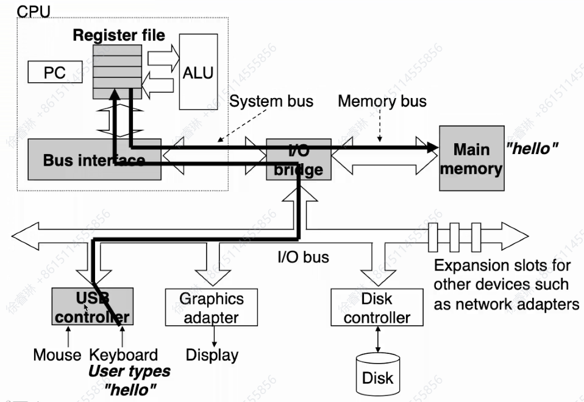

### 课程目标与成绩要求

#### 课程目标

- 微型计算机（Intel x86）的基本工作原理及系统，Intel x86是广泛使用的计算机架构，了解其基本工作原理有助于理解计算机如何执行指令、处理数据等核心运作机制。
- 处理器体系结构，处理器是计算机的核心部件，学习其体系结构能知晓处理器的内部构造、指令集等，明白它如何高效地进行计算和控制。
- 软件及汇编语言程序设计，汇编语言是一种接近机器语言的编程语言，学习它有助于深入理解计算机软件与硬件的交互，能让学习者从底层层面去设计和编写程序，为后续的软件开发等工作奠定基础。

#### 课程资料与成绩组成

|材料类别|具体内容|
| ---- | ---- |
|主要教学内容|上课ppt，上传到中山大学在线教学平台<https://lms.sysu.edu.cn/my/index.php>|
|教材|《微机原理、汇编语言与接口技术》，周杰英、张萍、郭雪梅、黄方军编著，人民邮电出版社|
|辅助材料| - 《计算机组成与设计：硬件/软件接口（原书第5版·ARM版）》，戴维·A.帕特森（David A.Patterson）、约翰·L.亨尼斯著，陈微译，机械工业出版社出版，第1版，2018年9月  - Randal E. Bryant and David R. O'Hallaron, *Computer Systems: A Programmer’s Perspective*, Third Edition (CS:APP3e), Pearson, 2016.|

|成绩类型|占比|具体说明|
| ---- | ---- | ---- |
|平时成绩|40%|包括作业和考勤|
|期末成绩|60%|考试方式为闭卷，成绩评定采用百分制|

### 绪论outline

> [!note]
> **什么是嵌入式系统，和其他系统有什么区别**
>
> 嵌入式系统是**以应用为中心、以计算机技术为基础**，软硬件可裁剪（根据需求定制），能满足设备对功能、可靠性、成本、体积、功耗严格要求的**专用计算机系统**。它并非独立设备，而是“嵌入”到其他设备（如家电、汽车、工业机械）中的核心控制单元，本质是为特定场景提供精准控制或数据处理能力。
>
> **嵌入式系统的核心构成**
>
> - **硬件层**：以微处理器（MPU）、微控制器（MCU，如STM32、51单片机）、片上系统（SoC）为核心，搭配专用外设（如传感器、执行器、通信模块）和最小化电路（电源、时钟、存储），资源高度精简（通常内存几KB~几GB、存储几MB~几百GB）。
> - **软件层**：以“专用固件”为核心，通常包含实时操作系统（RTOS，如FreeRTOS、uC/OS）或无操作系统（裸机程序），软件功能单一且固化（多存储在ROM/Flash中，而非可随意安装卸载），专注于完成特定任务（如“控制电机转速”“采集温度数据”）。
> - **典型应用场景**：汽车电子（发动机ECU、中控屏）、智能家居（冰箱温控、扫地机器人）、工业控制（PLC控制器、传感器节点）、消费电子（智能手环、路由器）、医疗设备（血糖仪、心电监测仪）等。
>
> **嵌入式系统与其他系统的核心区别**
>
> 嵌入式系统的核心特征是“**专用化**”，而通用计算机、服务器等系统的核心特征是“**通用化**”。以下通过对比表格，清晰区分嵌入式系统与两类常见系统的差异：
>
> | 对比维度                | 嵌入式系统                                  | 通用计算机系统（PC/笔记本）                | 服务器系统（数据中心服务器）                |
> |-------------------------|---------------------------------------------|-------------------------------------------|---------------------------------------------|
> | **设计目标**            | 满足特定设备的单一/少数功能（如“控制汽车刹车”“监测心率”），强调**实时性、可靠性、低功耗** | 满足多场景通用需求（办公、娱乐、编程），强调**灵活性、多任务处理** | 满足大规模数据处理/服务提供（云计算、数据库），强调**高吞吐量、高并发、稳定性** |
> | **软硬件架构**          | 软硬件高度定制化，硬件资源精简（按需裁剪），软件多为“裸机程序/轻量RTOS”，功能固化 | 硬件标准化（CPU、内存、硬盘可灵活升级），软件通用化（支持Windows、Linux，可随意安装卸载应用） | 硬件高性能（多CPU、大内存、冗余存储），软件专用化（如Linux Server、数据库系统），支持集群扩展 |
> | **性能与资源**          | 性能适中（CPU主频几MHz~几GHz），资源有限（内存几KB~几GB、存储几MB~几百GB） | 性能均衡（CPU主频2~5GHz），资源丰富（内存8~64GB、存储512GB~数TB） | 性能极致（多路CPU、内存128GB~数TB、存储PB级），支持硬件冗余（如双电源、RAID） |
> | **用户交互**            | 多为“无交互”或“极简交互”（如家电通过按键/APP间接控制，工业设备通过专用面板操作） | 强交互（依赖显示器、键盘、鼠标，支持图形化界面） | 无直接用户交互（通过网络远程管理，面向程序/服务调用） |
> | **生命周期**            | 长（5~20年，如汽车电子、工业设备需长期稳定运行，不轻易升级） | 短（3~5年，硬件易迭代，软件需频繁更新） | 中长（5~10年，硬件按需升级，软件需持续维护以保障服务） |
> | **实时性要求**          | 多数有严格实时性（如汽车ECU需毫秒级响应刹车信号，工业控制需微秒级同步） | 无强制实时性（如办公软件延迟1~2秒可接受） | 侧重“吞吐量”而非“实时性”（如云计算服务延迟100ms内可接受） |

#### 计算机系统：硬件+软件

#### 计算机和处理器的推动力及历史

> [!note]“后摩尔时代”
>
> **“后摩尔时代”**指的是传统依靠“缩小晶体管尺寸”提升芯片性能和集成度的路径逐渐逼近物理极限，芯片技术发展从“单一维度迭代”转向“多维度创新”的新阶段，并非摩尔定律完全失效。
>
> 1. 进入“后摩尔时代”的原因
> - **物理极限**：晶体管尺寸缩小到5nm以下时，出现量子隧穿效应，导致漏电和性能不稳定，导线宽度也逼近原子尺度，难以继续缩小。
> - **成本飙升**：先进工艺生产线和研发成本极高，仅少数巨头能承担，性价比降低。
> - **功耗与散热问题**：晶体管密度提升导致热密度急剧上升，散热困难，影响芯片可靠性。
>
> 2. 后摩尔时代的核心特征
> - **不再依赖尺寸缩小**：通过3D立体结构（如3D晶体管、纳米片晶体管）提升密度。
> - **不再依赖单一芯片**：采用多芯片集成（如SoC堆叠、Chiplet技术）提升性能与灵活性。
> - **不再依赖传统硅基材料**：探索氮化镓、碳化硅等新材料，以及碳纳米管、石墨烯等前沿技术，突破物理瓶颈。

- **发展阶段**：
  - 1945 - 1970年，主要是大型计算机（Mainframes）和小型计算机（minicomputers）。
  - 70年代，集成电路技术催生了微型计算机（microcomputer）。
  - 80年代，精简指令集（RISC）处理器开始出现。
  - 2005年以后，多核处理器逐渐发展起来。
- **处理器设计关键技术**：涵盖流水线、指令并行（超标量、VLIW）、数据并行（SIMD）、多核、缓存等，推动了处理器性能提升。

| 技术类型      | 定义与实现方式                                              | 代表架构/产品                | 主要优缺点                  | 适用场景                  |
|---------------|------------------------------------------------------------|-----------------------------|-----------------------------|---------------------------|
| 超标量        | 硬件动态调度，多条指令并行执行（如乱序执行）                | Intel Pentium、ARM Cortex-A | 兼容性强，性能高，硬件复杂  | 通用计算、高性能CPU        |
| VLIW          | 编译器静态打包多指令，处理器并行执行                        | TI TMS320C62XX、Itanium     | 硬件简单，需重编译，代码膨胀| DSP、多媒体、嵌入式        |
| SIMD          | 一条指令并行处理多个数据（如向量、数组）                    | Intel SSE/AVX、ARM NEON     | 吞吐高，需数据对齐          | 多媒体、科学计算、信号处理 |

| 处理器名 | 时间 | 晶体管数 | 速度（MHz） | 关键特点 |
| ---- | ---- | ---- | ---- | ---- |
| 8086 | 1978 | 29K | 5 - 10 | 首款16位英特尔处理器，是IBM PC和DOS的基础，地址空间为1MB |
| 80386 | 1985 | 275K | 16 - 33 | 首款32位英特尔处理器，被称为IA32，增加了“平面寻址”，能运行Unix |
| Pentium 4E | 2004 | 125M | 2800 - 3800 | 首款64位英特尔x86处理器，被称为x86 - 64 |
| Core 2 | 2006 | 291M | 1060 - 3500 | 首款英特尔多核处理器 |
| Core i7 | 2008 | 731M | 1700 - 3900 | 拥有四个核心 |

