### 课程目标与成绩要求

#### 课程目标

- <span style="background:rgba(163, 218, 252, 0.55)">微型计算机（Intel x86）的基本工作原理及系统</span>，Intel x86是广泛使用的计算机架构，了解其基本工作原理有助于理解计算机如何执行指令、处理数据等核心运作机制。
- <span style="background:rgba(163, 218, 252, 0.55)">处理器体系结构</span>，处理器是计算机的核心部件，学习其体系结构能知晓处理器的内部构造、指令集等，明白它如何高效地进行计算和控制。
- <span style="background:rgba(163, 218, 252, 0.55)">软件及汇编语言程序设计</span>，汇编语言是一种接近机器语言的编程语言，学习它有助于深入理解计算机软件与硬件的交互，能让学习者从底层层面去设计和编写程序，为后续的软件开发等工作奠定基础。

#### 课程资料与成绩组成

|材料类别|具体内容|
| ---- | ---- |
|主要教学内容|上课ppt，上传到中山大学在线教学平台<https://lms.sysu.edu.cn/my/index.php>|
|教材|《微机原理、汇编语言与接口技术》，周杰英、张萍、郭雪梅、黄方军编著，人民邮电出版社|
|辅助材料| - 《计算机组成与设计：硬件/软件接口（原书第5版·ARM版）》，戴维·A.帕特森（David A.Patterson）、约翰·L.亨尼斯著，陈微译，机械工业出版社出版，第1版，2018年9月<br> - Randal E. Bryant and David R. O'Hallaron, *Computer Systems: A Programmer’s Perspective*, Third Edition (CS:APP3e), Pearson, 2016.|

|成绩类型|占比|具体说明|
| ---- | ---- | ---- |
|平时成绩|40%|包括作业和考勤|
|期末成绩|60%|考试方式为闭卷，成绩评定采用百分制|

### 绪论outline

> [!note]
> **什么是嵌入式系统，和其他系统有什么区别**
>
> 嵌入式系统是**以应用为中心、以计算机技术为基础**，软硬件可裁剪（根据需求定制），能满足设备对功能、可靠性、成本、体积、功耗严格要求的**专用计算机系统**。它并非独立设备，而是“嵌入”到其他设备（如家电、汽车、工业机械）中的核心控制单元，本质是为特定场景提供精准控制或数据处理能力。
>
> **嵌入式系统的核心构成**
>
> - **硬件层**：以微处理器（MPU）、微控制器（MCU，如STM32、51单片机）、片上系统（SoC）为核心，搭配专用外设（如传感器、执行器、通信模块）和最小化电路（电源、时钟、存储），资源高度精简（通常内存几KB~几GB、存储几MB~几百GB）。
> - **软件层**：以“专用固件”为核心，通常包含实时操作系统（RTOS，如FreeRTOS、uC/OS）或无操作系统（裸机程序），软件功能单一且固化（多存储在ROM/Flash中，而非可随意安装卸载），专注于完成特定任务（如“控制电机转速”“采集温度数据”）。
> - **典型应用场景**：汽车电子（发动机ECU、中控屏）、智能家居（冰箱温控、扫地机器人）、工业控制（PLC控制器、传感器节点）、消费电子（智能手环、路由器）、医疗设备（血糖仪、心电监测仪）等。
>
> **嵌入式系统与其他系统的核心区别**
>
> 嵌入式系统的核心特征是“**专用化**”，而通用计算机、服务器等系统的核心特征是“**通用化**”。以下通过对比表格，清晰区分嵌入式系统与两类常见系统的差异：
>
> | 对比维度                | 嵌入式系统                                  | 通用计算机系统（PC/笔记本）                | 服务器系统（数据中心服务器）                |
> |-------------------------|---------------------------------------------|-------------------------------------------|---------------------------------------------|
> | **设计目标**            | 满足特定设备的单一/少数功能（如“控制汽车刹车”“监测心率”），强调**实时性、可靠性、低功耗** | 满足多场景通用需求（办公、娱乐、编程），强调**灵活性、多任务处理** | 满足大规模数据处理/服务提供（云计算、数据库），强调**高吞吐量、高并发、稳定性** |
> | **软硬件架构**          | 软硬件高度定制化，硬件资源精简（按需裁剪），软件多为“裸机程序/轻量RTOS”，功能固化 | 硬件标准化（CPU、内存、硬盘可灵活升级），软件通用化（支持Windows、Linux，可随意安装卸载应用） | 硬件高性能（多CPU、大内存、冗余存储），软件专用化（如Linux Server、数据库系统），支持集群扩展 |
> | **性能与资源**          | 性能适中（CPU主频几MHz~几GHz），资源有限（内存几KB~几GB、存储几MB~几百GB） | 性能均衡（CPU主频2~5GHz），资源丰富（内存8~64GB、存储512GB~数TB） | 性能极致（多路CPU、内存128GB~数TB、存储PB级），支持硬件冗余（如双电源、RAID） |
> | **用户交互**            | 多为“无交互”或“极简交互”（如家电通过按键/APP间接控制，工业设备通过专用面板操作） | 强交互（依赖显示器、键盘、鼠标，支持图形化界面） | 无直接用户交互（通过网络远程管理，面向程序/服务调用） |
> | **生命周期**            | 长（5~20年，如汽车电子、工业设备需长期稳定运行，不轻易升级） | 短（3~5年，硬件易迭代，软件需频繁更新） | 中长（5~10年，硬件按需升级，软件需持续维护以保障服务） |
> | **实时性要求**          | 多数有严格实时性（如汽车ECU需毫秒级响应刹车信号，工业控制需微秒级同步） | 无强制实时性（如办公软件延迟1~2秒可接受） | 侧重“吞吐量”而非“实时性”（如云计算服务延迟100ms内可接受） |

#### 计算机系统：硬件+软件


#### 计算机和处理器的推动力及历史

> [!note] “后摩尔时代”
>
> **“后摩尔时代”**指的是传统依靠“缩小晶体管尺寸”提升芯片性能和集成度的路径逐渐逼近物理极限，芯片技术发展从“单一维度迭代”转向“多维度创新”的新阶段，并非摩尔定律完全失效。
>
> 1. 进入“后摩尔时代”的原因
>
> - **物理极限**：晶体管尺寸缩小到5nm以下时，出现量子隧穿效应，导致漏电和性能不稳定，导线宽度也逼近原子尺度，难以继续缩小。
> - **成本飙升**：先进工艺生产线和研发成本极高，仅少数巨头能承担，性价比降低。
> - **功耗与散热问题**：晶体管密度提升导致热密度急剧上升，散热困难，影响芯片可靠性。
>
> 2. 后摩尔时代的核心特征
>
> - **不再依赖尺寸缩小**：通过3D立体结构（如3D晶体管、纳米片晶体管）提升密度。
> - **不再依赖单一芯片**：采用多芯片集成（如SoC堆叠、Chiplet技术）提升性能与灵活性。
> - **不再依赖传统硅基材料**：探索氮化镓、碳化硅等新材料，以及碳纳米管、石墨烯等前沿技术，突破物理瓶颈。

- **发展阶段**：
  - 1945 - 1970年，主要是大型计算机（Mainframes）和小型计算机（minicomputers）。
  - 70年代，集成电路技术催生了微型计算机（microcomputer）。
  - 80年代，精简指令集（RISC）处理器开始出现。
  - 2005年以后，多核处理器逐渐发展起来。
- **处理器设计关键技术**：涵盖流水线、指令并行（超标量、VLIW）、数据并行（SIMD）、多核、缓存等，推动了处理器性能提升。

| 技术类型      | 定义与实现方式                                              | 代表架构/产品                | 主要优缺点                  | 适用场景                  |
|---------------|------------------------------------------------------------|-----------------------------|-----------------------------|---------------------------|
| 超标量        | 硬件动态调度，多条指令并行执行（如乱序执行）                | Intel Pentium、ARM Cortex-A | 兼容性强，性能高，硬件复杂  | 通用计算、高性能CPU        |
| VLIW          | 编译器静态打包多指令，处理器并行执行                        | TI TMS320C62XX、Itanium     | 硬件简单，需重编译，代码膨胀| DSP、多媒体、嵌入式        |
| SIMD          | 一条指令并行处理多个数据（如向量、数组）                    | Intel SSE/AVX、ARM NEON     | 吞吐高，需数据对齐          | 多媒体、科学计算、信号处理 |

| 处理器名 | 时间 | 晶体管数 | 速度（MHz） | 关键特点 |
| ---- | ---- | ---- | ---- | ---- |
| 8086 | 1978 | 29K | 5 - 10 | 首款16位英特尔处理器，是IBM PC和DOS的基础，地址空间为1MB |
| 80386 | 1985 | 275K | 16 - 33 | 首款32位英特尔处理器，被称为IA32，增加了“平面寻址”，能运行Unix |
| Pentium 4E | 2004 | 125M | 2800 - 3800 | 首款64位英特尔x86处理器，被称为x86 - 64 |
| Core 2 | 2006 | 291M | 1060 - 3500 | 首款英特尔多核处理器 |
| Core i7 | 2008 | 731M | 1700 - 3900 | 拥有四个核心 |

#### 解决微处理器挑战的可能方向

- **领域专用处理器**：一方面有面向AI应用的GPU及加速器，可助力人工智能相关任务高效运行；另一方面随着技术发展，也会催生其他新应用场景下的专用处理器。
- **新型体系架构关键技术的突破**：包括存算一体的器件、电路及架构，这种架构能优化计算与存储的协同；还有类脑芯片，模仿人脑的工作机制，有望带来全新的计算模式。
- **新型存储器关键技术的突破**：聚焦于高速、高容量的非易失存储器，像RRAM（电阻式随机存取存储器）、MRAM（磁随机存取存储器）、PRAM（相变随机存取存储器）等，这类存储器在性能和存储能力上有更好表现。

### 第二章 微处理器结构

冯·诺依曼计算机结构

我们今天使用的几乎所有电脑、手机、服务器，其最核心的设计思想都源于此。

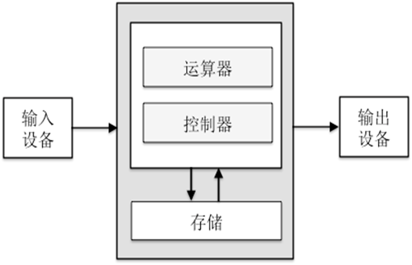

1. **输入设备 (Input Devices)**

从外部获取信息的设备。在电脑上，键盘、鼠标、麦克风就是输入设备，负责把你的指令和数据告诉计算机。

2. **存储器 (Memory/Storage)**

存放数据和指令的地方。在电脑里，内存（RAM）和硬盘（Hard Drive）就是存储器，程序和需要处理的文件都放在里面。

3. **微处理器 (Microprocessor / CPU)**：计算机的大脑，它由两个关键部分组成：

- **运算器 (Arithmetic Logic Unit, ALU)**
    执行算术和逻辑运算。所有实际的数据处理都在这里完成。

- **控制器 (Control Unit, CU)**
    指挥和协调计算机各部分工作。计算机中所有部件的行动，都是由控制器来发号施令的。

4. **输出设备 (Output Devices)**

将处理结果展示给用户。在电脑上，显示器、打印机、音响就是输出设备，它们把计算机处理完的结果（文字、图像、声音）展示给你。

**采用二进制**：计算机内部的所有信息，无论是指令还是数据，最终都会被转换成由0和1组成的二进制码。简单、稳定，适合用电子元器件来实现。

**“存储程序”思想 (Stored-Program Concept)**：在冯·诺依曼之前，计算机的程序是固化在硬件里的（通过插拔无数根电线来改变程序，就像**ENIAC**）。而冯·诺依曼提出，程序（指令）本身也应该像数据一样，被存储在存储器中。计算机可以按顺序自动地从存储器中取出指令并执行。这个思想的伟大之处在于，它实现了<span style="background:rgba(163, 218, 252, 0.55)">软件和硬件的分离</span>。我们想让计算机做不同的事，不再需要改造硬件，只需要加载不同的软件（程序）就行了。

```c
int global_data = 10;        // 存储在数据段 (DS)
int source_array[10] = {1};  // 存储在数据段 (DS)
int dest_array[10];          // 存储在数据段 (DS)

// 一个简单的函数，用于演示堆栈操作
int add_func(int a, int b) 
{
    int sum;         // 局部变量, 存在于堆栈 (SS:BP)
    sum = a + b;     // 触发 ALU 和 标志
    return sum;      // 使用 AX 返回
}

void main() 
{
    // 1. 函数调用
    int local_result;
    local_result = add_func(5, 20); // 触发 CALL/RET, PUSH/POP
    
    // 2. 数组(字符串)复制
    for(int i=0; i<10; i++) { 
     dest_array[i] = source_array[i]; 
  }
    // 汇编中常使用 REP MOVSW 指令
    
    // 3. 全局变量操作
    global_data = global_data + local_result; // 访问 DS, 使用 ALU
}
```

### 第三章 80x86 指令系统

#### 80x86 寻址方式

##### 背景——存储器的体系结构

现实中不存在完美的单一存储器。因此，设计师们设计了一个 **“金字塔”** 式的 **分层体系结构 (Hierarchy)**，用系统，用“较低成本”的硬件“欺骗”CPU，让它以为自己拥有了近乎“理想”的存储器。

###### “存储金字塔”的层级（从上到下，从快到慢）

**第1层：CPU 寄存器 (CPU Registers)**

- **特点**：在CPU芯片内部，与CPU的计算单元“零距离”。访问速度**最快**（1个时钟周期），但数量极少（几十个），<span style="background:rgba(186, 173, 239, 0.55)">成本极高</span>。`AX`, `EBX` 这些就是寄存器。

**第2层：高速缓冲存储器 (Cache)**

- **特点**：焊在CPU芯片上或紧贴CPU的超高速小内存。它存在的唯一目的就是**缓解CPU（超快）和主存（很慢）之间的速度矛盾**。

**第3层：主存储器 (Main Memory / RAM)**

- **特点**：我们常说的“内存条”（如16GB RAM）。CPU执行的所有程序和数据，都必须**先从硬盘加载到这里**才能运行。<span style="background:rgba(186, 173, 239, 0.55)">它的速度远慢于Cache，但容量远大于Cache</span>。

**第4层：辅助存储器 (Auxiliary Storage)**

- **特点**：我们常说的“移动硬盘“。容量巨大、价格便宜、断电不丢失数据。但速度最慢。

###### 体系的运作：局部性原理 (Principle of Locality)

这个金字塔体系能高效工作的核心，是利用了程序的“惰性”，即**局部性原理**：

1. **时间局部性**：刚用过的数据，很可能马上还要再用一次。（比如循环变量 `i`）。

2. **空间局部性**：刚用过的数据，它旁边的数据，很可能马上也要被用。（比如数组`a[1]`用完，很可能就用`a[2]`）。

**工作流程**：

1. CPU需要数据，先问 **Cache** 有没有

2. **Cache命中 (Hit)**：若Cache里正好有。CPU立刻拿到数据，皆大欢喜。（电脑第二次打开同一个软件会快很多）。

3. **Cache未命中 (Miss)**：Cache里没有。CPU**被迫停工（Stall）**，等待Cache去问**主存**要。主存把数据（连同一小块邻近的数据）一起交给Cache，Cache再交给CPU。

##### 指令格式

一条指令，就是程序员能对CPU下达的、最基本的一个命令。

指令的两大组成部分：

- **操作码 (Opcode) / 助记符 (Mnemonic)**

  - **作用**：指令的 **“动词 (Verb)”** ，规定了CPU **“做什么”** 。

  - **例**：`MOV` (传送)、`ADD` (加法)、`SUB` (减法)、`JMP` (跳转)。

  - **助记符**：`MOV` 是给人看的“助记符”。但CPU真正看的是机器码，比如`B8`。

- **操作数 (Operands)**

  - **作用**：指令的 **“宾语 (Object)”** ，规定了CPU **“对谁做”**、**“用什么做”** 。

  - **例**：在`MOV AX, 1234H`中，`AX` 和 `1234H` 就是两个操作数。

  - **说明**：不同指令的操作数个数不同。`INC AX` (让`AX`自增1) 只有一个操作数；`MOV AX, 1234H` 有两个；`RET` (函数返回) 可以没有操作数。

> [!note] 以`MOV`指令作为典型案例：
>
> - **格式**：`MOV 目的操作数, 源操作数`
> - **功能**：将**“源”**的数据，**复制**一份，传送到**“目的”**。
> - **注**：这是x86架构的Intel语法，**目标在左，源在右**。这就像一个赋值语句：`目的 = 源`。
>
##### 寻址方式

- **立即寻址 (Immediate)**：操作数包含在代码中。

**数据就在“指令”上写着**。比如命令是：“拿`1234`这个数字”。数据`1234`本身就是命令的一部分。

- **寄存器寻址 (Register)**：操作数存放在寄存器中。

**数据就在CPU的“口袋”里**（`AX`, `EBX`等寄存器）。这是CPU最喜欢的方式，因为拿取速度**最快**，零延迟。

- **存储器寻址 (Memory)**：操作数存放在存储器中。

**数据在“外面的大仓库”里**（内存）。CPU需要拿着“地址”（仓库货架号）跑过去取，这会花费一些时间（涉及Cache, 主存）。

- **I/O端口寻址 (I/O Port)**：操作数存放在I/O端口中。

**数据在“公司大门口的快递站”**。数据来自外部设备（如键盘、网卡）。CPU需要执行特殊指令（如 `IN`, `OUT`）去签收。

> [!danger]
> 寻址方式是**针对操作数**而言的。
>
> - 在一条指令 `MOV AX, BX` 中：
>
>   - **目的操作数** `AX`，使用的是“寄存器寻址”。
>
>   - **源操作数** `BX`，使用的也是“寄存器寻址”。
>
> - 在一条指令 `MOV AX, [1234H]` 中：
>
>   - **目的操作数** `AX`，使用的是“寄存器寻址”。
>
>   - **源操作数** `[1234H]`，使用的是“存储器寻址”。
>
###### 立即寻址

**定义**：操作数（数据）就**紧跟在操作码后面**，作为指令机器码的一部分，存放在内存的**代码段**中。

>[!note] 案例分析（`MOV AX, 1234H`）
>**“完整指令”** 被分为两部分：
>
>1. **操作码 (Opcode)**：`MOV AX, ...` 的机器语言。CPU一读到这个码，就知道接下来是一个16位的数据，我要把它装进`AX`。
>
>2. **立即数 (Immediate Data)**：就是`1234H`。

> [!warning] 小端序 (Little-Endian) 存储
> 数据部分被拆成了 `34H(低8位)` 和 `12H(高8位)`。在内存中存放时，`34H`（低位字节）被存放在**较低的地址**，`12H`（高位字节）被存放在**较高的地址**。 Intel x86 架构的“小端序”规定，多字节数据的“小头”（低位字节）要存放在“小地址”（低地址）。

> [!note] 案例分析（`MOV AL, 12H`）
>
> 这是一个8位操作。操作码会告诉CPU："接下来是一个8位的数据，把它装进`AL`"。
> 内存中就是 `[Opcode] [12H]`。

> [!note] 案例分析（`MOV AX, 12H`）
>
> 源操作数 `12H` 是8位的，但目的寄存器 `AX` 是16位的。CPU在执行时，会自动进行 **"零扩展" (Zero Extension)** 。它会将 `12H` 装入 `AL` (低8位)，同时**自动用 `00H` 填充 `AH` (高8位)**。因此执行后 `AX` 的值是 `0012H`。

> [!note] 案例分析（MOV EAX, 12345678H）：从16位 (8086) 走向32位 (80386)
>
> 1. 它会有一个**操作码 (Opcode)**，告诉CPU："这是一条`MOV` 32位立即数到`EAX`的指令"。
>
> 2. 这4个字节的数据 `12345678H` 会以**小端序 (Little-Endian)** 的方式存放在内存中。
>
> 3. 在内存中的实际字节顺序是：`[Opcode] [78H] [56H] [34H] [12H]`。

> [!tip] 拓展（C3-1）：立即寻址的重要性
>
> 1. **编译器（Compiler）** 的最爱：当在 **C++** 或 **Java** 中写 `int i = 10;` 或者 `for (int j = 0; j < 100; j++)`，这里的 `10` 、 `0` 、 `100` 几乎100%会被编译器编译成使用**立即寻址**的指令（如 `MOV EAX, 10`）。
> 2. **立即数的性能**：数据随着指令**一起被取回来了**（大概率已在CPU的指令缓存`L1-Cache`中）。CPU不需要再跑一趟去访问数据缓存（`L1-Data-Cache`）或主存，避免了潜在的流水线停顿（`Stall`）。
> 3. **RISC-V** 中的立即数：在 **ARM** 和 **RISC-V** 中，由于RISC指令长度固定（如32位），它们没有空间放下超长的立即数。因此，它们会设计特殊的指令（如 `LUI` - Load Upper Immediate），专门用来分两步拼装一个大的立即数，或者将立即数的设计与指令格式巧妙地融合在一起，这是现代CPU设计的一个核心挑战。

###### 寄存器寻址

操作数就存放在寄存器中，所有的高级语言**编译器**（如C++, Java, Python的）其核心优化任务之一就是 **“寄存器分配”** 。编译器会拼尽全力分析你的代码，把最常用、最核心的变量（比如`for`循环中的变量`i`）尽可能地长时间 **“钉死”在寄存器里** ，这也是为什么优化后的代码会快得多。

> [!note] 案例分析
>
> - **例1: `MOV AX, BX`**
>
> 经典的16位传送。将`BX`寄存器中全部16位的内容，完整地复制到`AX`寄存器中。
>
> - **例2: `MOV EAX, EBX`**
>
> 这是80386时代的32位传送。原理完全相同，但数据"水管"的直径从16位变成了32位。
>
> - **例3: `MOV CL, CH`**
>
> CPU内部操作的**高精度**。`CH`是`CX`寄存器的高8位（`C` register `High` byte），`CL`是`CX`的低8位（`C` register `Low` byte）。这条指令是把高8位的数据，复制到低8位。这在进行字节（Byte）级别的复杂数据拼装时非常有用。

###### 存储器寻址

程序的大部分数据，如变量、数组、对象等，都存放在**内存**里。

**偏移地址的计算：16位机 (如8086)**

我们知道8086的物理地址是 `段地址:偏移地址`。“存储器寻址”要干的所有事情，就是**计算出这个“偏移地址”**。这个计算出来的“偏移地址”，在术语中就叫做**有效地址 (EA)**，即：

`偏移地址（16位）=有效地址（EA） = 基址 (Base) + 变址 (Index) + 位移量 (Displacement)`

- **基址 (Base)**：`BX` 或 `BP`
  - **`BX`** (Base Register) 通常用于指向**数据段 (`DS`)** 中的数据。
  - **`BP`** (Base Pointer) 专门用于指向**堆栈段 (`SS`)** 中的数据。

- **变址 (Index)**：`SI` 或 `DI`
  - **作用**：在“基础货架号”上提供一个“动态的偏移”。
  - **`SI`** (Source Index) / **`DI`** (Destination Index) 适合用来做“索引”，比如数组的遍历。

- **位移量 (Displacement)**：一个8位或16位的常数（如 `8` 或 `1234H`）。
  - **作用**：提供一个“固定的偏移”。

**偏移地址的计算：32位机 (如80386)**

`EA = 基址 + (变址 * 比例因子) + 位移量`

- **更灵活的基址/变址**：**任何**通用寄存器 (`EAX`, `EBX`, `ECX`...) 都可以充当“基址”或“变址”。这给了编译器极大的自由度。
- **更大的位移量**：可以使用32位的常数，轻松访问大型数据结构。
- **比例因子 (Scale Factor: 1, 2, 4, 8)**：这是**最重要的升级**。允许CPU在计算EA时，自动将“变址”寄存器的值乘以1、2、4或8。

> [!tip] 拓展（C3-2）: 为什么"比例因子"是革命性的？
>
> 这个功能是**为高级语言（如C/C++）量身定做的**。假设你在C++中定义了一个整数数组： `int my_array[10];`:
>
> 在32位系统中，一个 `int` 占**4个字节**。
>
> - `my_array[0]` 在内存地址 `Addr`
> - `my_array[1] A` 在内存地址 `Addr + 4`
> - `my_array[2]` 在内存地址 `Addr + 8`
>
> 现在，你想执行这行代码：`x = my_array[i];`，CPU必须计算出 `my_array[i]` 的地址，公式是：`Addr + i * 4`。
>
> **在8086上 (没有比例因子)**：CPU必须分多步执行，非常慢：
>
> ```asm
> MOV CX, i      ; 1. 把 i 放到一个寄存器
> SAL CX, 2      ; 2. 把 CX 乘以 4 (左移2位)
> MOV BX, Addr   ; 3. 把数组基地址放到 BX
> ADD BX, CX     ; 4. 计算出 EA
> MOV AX, [BX]   ; 5. 终于取到了数据！
> ```
>
> **在80386上 (有比例因子)**：硬件一步到位！
>
> ```asm
> MOV EAX, i                    ; 1. 把 i 放到 EAX (作为变址)
> MOV EBX, [Addr + EAX * 4]     ; 2. 搞定！
> ```
>
> 这个`比例因子`（1, 2, 4, 8）就是为了直接在硬件层面支持 `char` (1字节), `short` (2字节), `int/float` (4字节), `double/long long` (8字节) 这些**C语言基本数据类型的数组访问**。这是硬件辅助软件性能起飞的绝佳范例。

**“默认段规则”**：

1. 如果`EA`计算中**使用了 `BP`, `EBP` 或 `ESP`**，CPU就**自动**认为是在**堆栈段 (SS)** 里找数据。

2. 否则（比如用了`BX`, `EAX`, `SI`等），CPU就**自动**认为是在**数据段 (DS)** 里找数据。

**为什么有这个规则？—— 为了函数和局部变量**

- **数据段 (DS)** 用来存放**全局变量 (Global Variables)**。
- **堆栈段 (SS)** 用来存放**函数的参数 (Parameters)** 和**局部变量 (Local Variables)**。

当你调用一个C函数 `my_func(int a)` 时：

1. 参数 `a` 被压入堆栈。
2. 函数开始执行，`EBP` 寄存器会指向这块堆栈区域的“基底”（称为栈帧）。
3. 你的参数 `a` 就在 `[EBP + 8]` 的位置。
4. 你的局部变量 `int x` 就在 `[EBP - 4]` 的位置。

当编译器编译 `x = a;` 这句代码时，它会生成： `MOV EAX, [EBP+8] ; CPU自动使用SS段, 取回参数a` ，`MOV [EBP-4], EAX ; CPU自动使用SS段, 存入局部变量x`

这个规则让编译器可以清晰地将**全局数据（DS）** 和**函数内数据（SS）** 隔离开来。

>[!danger] 消失的段地址
>段地址几乎从来不会直接写在指令语句中。它就是根据计算有效地址(`EA`)的寄存器来自动“默认匹配”的。
>
>CPU内部有一套“默认规则表”，规定了在计算`EA`时使用了什么寄存器，就自动匹配哪个段寄存器
>
>**段超越 (Segment Override)**：
>
>汇编语言提供了一个“例外”机制，叫做**段超越前缀 (Segment Override Prefix)**。您可以在指令前面手动指定一个段寄存器，来**临时“覆盖”**掉默认规则。
>
>- 默认情况 (用DS)：`MOV AX, [BX]` $\implies$  物理地址 = `(DS) * 16 + (BX)`
>- 使用“段超越” (强制用ES)：`MOV AX, ES:[BX]` $\implies$  物理地址 = `(ES) * 16 + (BX)`

1. **直接寻址**：程序直接通过操作数的地址来访问该操作数。

在 `EA = 基址 + 变址 + 位移量` 这个公式中，让 **基址=0, 变址=0**。因此，`EA = 位移量`。这个“位移量”（偏移地址）是一个**常数**（如`1234H`），被**直接编码在指令的机器码中**。

> [!note] 案例：默认寻址 (`MOV AX, [1234H]`)
>
> 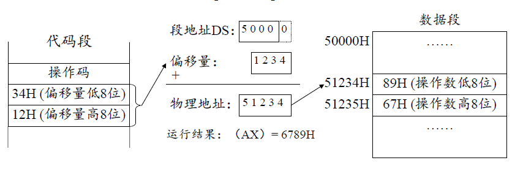
>
> - **第1步：计算16位有效地址 (EA)**
>
>   - 寻址方式是"直接寻址"。`EA = 0 + 0 + 1234H`
>
> - **第2步：计算20位物理地址**
>
>   - CPU检查指令，发现没有`BP`寄存器参与运算。按照**默认规则**，CPU自动选择**数据段寄存器 (DS，设 `(DS) = 5000H`)** 。
>   - `物理地址 = (DS) * 16 + EA = 5000H * 10H + 1234H = 51234H`

- CPU跑到`51234H`这个物理地址去取数据。
- **小端序(Little-Endian)再次登场**：

  - CPU在**低地址`51234H`** 读到了`89H`，将其放入`AX`的**低8位(AL)**。
  - CPU在**高地址`51235H`** 读到了`67H`，将其放入`AX`的**高8位(AH)**。

- **运行结果**：`AX`寄存器中最终的值是 `6789H`。

> [!tip] 拓展（C3-3）：直接寻址的工业应用
>
> "直接寻址"在现代编程中用于访问**全局变量 (Global Variables)** 和 **静态变量 (Static Variables)**。
>
> 当编译器（如C++编译器）编译程序时，它会把所有全局变量统一安放在数据段（.data段）的某个固定位置。比如，`int globalVar;` 可能会被固定分配在 `DS:[1234H]`。因此，程序中所有对 `globalVar` 的访问，都会被编译成 `MOV [1234H], ...` 这样的"直接寻址"指令。

2. **寄存器间接寻址**：操作数的偏移量（EA）存放在一个寄存器中。

在 `EA = 基址 + 变址 + 位移量` 公式中，我们只使用“基址”或“变址”。

> [!note] 案例分析 (MOV AX, [BX])
>
> 假设 `(DS) = 5000H`，并且我们**提前已经把 `1234H` 这个值存入了 `BX` 寄存器**中（比如通过 `MOV BX, 1234H`）。
>
> 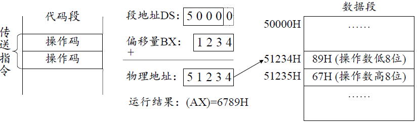
>
> CPU执行 `MOV AX, [BX]`：
>
> - **第1步：计算16位有效地址 (EA)**
>
>   - 寻址方式是"寄存器间接寻址"。CPU去读取 `BX` 寄存器的内容。
>   - `EA = (BX) = 1234H`
>
> - **第2步：计算20位物理地址**
>
>   - CPU检查指令，发现使用的是 `BX` 寄存器（而不是`BP`）。按照**默认规则**，CPU自动选择**数据段寄存器 (DS)**。
>
>   - `物理地址 = (DS) * 16 + EA = 50000H + 1234H = 51234H`
> - **结果**：CPU同样去`51234H`取到了`6789H`放入`AX`。

3. **寄存器相对寻址**：`EA（偏移量）= 基址/变址寄存器 + 位移量`。

> [!note] 案例分析：MOV AX, [BX+1000H]
>
> 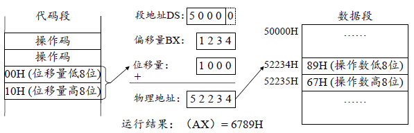
>
> - **第1步：计算16位有效地址 (EA)**
>
>   - `EA = (BX) + 1000H = 1234H + 1000H = 2234H`
>
> - **第2步：计算20位物理地址**
>
>   - CPU检查到EA的计算使用了`BX`（而不是`BP`）。按照**默认规则**，CPU自动选择**数据段 (DS)**。
>   - `物理地址 = (DS) * 16 + EA = 50000H + 2234H = 52234H`

> [!tip] 拓展（C3-4）:
>
> "寄存器相对寻址"是高级语言（如C/C++）实现 `struct` (结构体) 或 `class` (类) 访问的硬件基石。
>
> 假设你用C++定义了一个结构体：
>
> ```cpp
> struct Employee {
>     int id;       // 偏移量 0
>     char name[8]; // 偏移量 4
>     long salary;  // 偏移量 12
> };
> ```
>
> 当你创建一个指向这个结构体的指针 `Employee* p;` 时，编译器可能会把这个指针 `p` 的值（即`Employee`对象的起始地址）存放在 `EBX` 寄存器中。
>
> 执行 `long s = p->salary;` 这句代码时，编译器如何找到`salary`？
>
> `salary` 存放在结构体**起始地址偏移12个字节**的地方。编译器会生成这样的汇编指令： `MOV EAX, [EBX + 12]`

4. **基址变址寻址**：`EA = (BX 或 BP) + (SI 或 DI)`

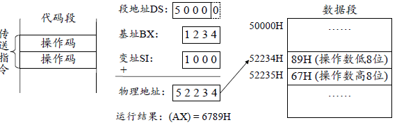
5. **相对基址变址寻址**(16位寻址的“完全体”)：`EA（偏移量）= 基址 + 变址 + 位移量`。

这是我们在8086时代能用到的**最复杂、最灵活**的内存寻址方式。

> [!tip] 拓展（C3-5）：结构体数组
>
> 假设有一个C++结构体数组：
>
> ```cpp
> struct Employee {
>     int id;       // 偏移量 0
>     long salary;  // 偏移量 2 (假设)
>     char name[8]; // 偏移量 6 (假设)
> };
> Employee emp_array[10];
> int i = 3;
> char c = emp_array[i].name[2]; // 取第3个员工的名字的第2个字母
> ```
>
> **编译器生成的汇编指令** (简化版)：
>
> - `MOV BX, offset emp_array ; BX = 数组基地址` ，
> - `MOV SI, i ; SI = 索引 i` ，
> - `IMUL SI, sizeof(Employee) ; SI = i * 结构体大小` ，
> - `MOV AL, [BX + SI + 8]`

###### **I/O 端口寻址**

用于和**外部硬件**（键盘、鼠标、显卡、网卡）通信。

- 外围设备（硬件）通过“锁存器”或“寄存器”与CPU通信，这些寄存器就叫**端口 (Port)**。

- 为了管理这些端口，每个端口都被分配了一个**端口地址**。

- 80x86系统有一个**独立**的I/O地址空间，大小为64K（0 ~ 65535），即16位地址。

CPU访问I/O端口，**只能**使用两条专属指令：**`IN`** (输入) 和 **`OUT`** (输出)。根据端口地址的写法，又分为两种：

1. **直接端口寻址 (Direct Port Addressing)**：端口地址是一个**8位的常数**，直接写在指令里。

> [!note] 案例分析
>
> - **例1: `IN AL, 10H`**
>
>   - 含义：从`10H`号端口，读取8位数据，存入`AL`寄存器。
>
> - **例2: `OUT 20H, AX`**
>
>   - 含义：将`AX`寄存器（16位）的内容，发送到`20H`号端口。
>
>   - **细节**：这是一个16位操作。硬件会自动将其拆分为两次8位操作：
>
>         1. `AL` (低8位) 的值被发送到 **`20H`** 端口。
>
>         2. `AH` (高8位) 的值被发送到 **`21H`** 端口。
>
> - **例3: `IN EAX, 20H`**
>
>   - 32位操作，同理：
>
>     - `20H`端口 $\to$ `AL`
>
>     - `21H`端口 $\to$ `AH`
>
>     - `22H`端口 $\to$ `EAX`的高16-23位
>
>     - `23H`端口 $\to$ `EAX`的高24-31位
>
> - **局限**：这种方式只能访问地址在 `0 ~ 255` 之间的端口。

2. **间接端口寻址 (Indirect Port Addressing)**：端口地址为16位（0 ~ 0FFFFH），必须先存入`DX`寄存器。

为了能访问全部64K个端口，CPU规定，端口地址必须**间接**地通过 **`DX` 寄存器** 传递。

> [!note] 案例分析
>
> - **例1: `MOV DX, 1000H`** $\to$ `OUT DX, AL`
>
>   - 含义：将`1000H`（一个16位地址）先装入`DX`。
>
>   - 然后执行`OUT DX, AL`，CPU会读取`DX`的值（`1000H`），并将`AL`的数据发送到`1000H`号端口。
>
> - **例2: `IN AX, DX`**
>
>   - 含义：从`DX`寄存器所指向的端口（假设是`1000H`）读取16位数据。
>
>   - 硬件会自动：
>
>         1. 从 **`1000H`** 端口读数据 $\to$ `AL`。
>
>         2. 从 **`1001H`** 端口读数据 $\to$ `AH`。

> [!tip] 拓展（C3-6）
>
> - **DOS 时代 vs. 现代OS**
>
>   - 在古老的DOS时代，程序员可以"为所欲为"。你可以直接写`IN AL, 60H`来**直接读取键盘**的按键码，或者`OUT`指令去控制**PC喇叭**发声。
>
> - **特权指令 (Privileged Instructions)**
>
>   - 在现代操作系统（Windows, Linux, macOS）中，`IN` 和 `OUT` 是**特权指令**。
>   - 你的应用程序（如Word、Chrome）是运行在**低特权级（Ring 3）的。如果它们试图执行`IN`或`OUT`，CPU会立刻触发一个"通用保护异常" (GPF)**，操作系统会立即**强行关闭**这个程序。
>   - **原因：** 为了保护硬件。如果任何程序都能随意访问硬盘端口，它就能绕过文件系统，窃取或销毁所有数据。
>   - 只有运行在**最高特权级（Ring 0）的操作系统内核 (Kernel)** 和 **设备驱动程序 (Drivers)** 才有权执行`IN`和`OUT`。当你的键盘驱动需要读取按键时，是它（在Ring 0）替你执行了`IN AL, 60H`。
>
> - **现代趋势：MMIO (内存映射I/O)**
>
>   - I/O端口寻址（称为"Port-Mapped I/O, PMIO"）在x86上是历史遗留。
>   - 现代架构（如ARM，用于所有手机）以及现代x86上的新设备（如PCIe显卡），更喜欢使用**内存映射I/O (MMIO)**。
>   - MMIO的思路是：**不使用"平行世界"**，而是将硬件的"端口"**映射**到"主内存"地址空间中的某一块（通常在很高的地址）。
>   - 于是，CPU不再需要`IN/OUT`指令，而是用一条**普通的`MOV`指令**（如 `MOV [F8000100H], EAX`）就能和硬件通信。这更统一，也更高效。

#### 80x86 指令系统

##### 数据传送类 (Data Transfer)

> [!note]
>
> | 类别 | 指令 | 功能描述 | 工业应用/特点 |
> |------|------|----------|---------------|
> | **通用数据传送指令** | MOV | 数据传送，相当于高级语言的赋值操作 | 最基础、最常见的指令，`MOV AX, BX` 等同于 `AX = BX;` |
> | | `MOVSX` / `MOVZX` | 带符号/零扩展的数据传送 | **处理C/C++类型转换的关键**：<br>`MOVZX`：零扩展，用于无符号数<br>`MOVSX`：符号扩展，用于有符号数 |
> | | `PUSH` / `POP` | 压栈/出栈操作 | **函数调用的核心**：<br>保存返回地址、寄存器<br>实现后进先出(LIFO)的堆栈操作 |
> | | `PUSHA(D)` / `POPA(D)` | 压入/弹出所有通用寄存器 | 操作系统上下文切换的基石，用于保存和恢复程序"工作现场" |
> | | `XCHG` | 交换两个操作数的值 | 配合LOCK前缀实现原子操作和互斥锁(Mutex)的关键指令 |
> | | `XLAT` | 查表转换指令 | 专用硬件查表指令，用于ASCII码转换等场景 |
> | **目标地址传送指令** | `LEA` | 加载有效地址 | **C/C++指针和数学运算**：<br>获取指针地址：`p = &var;`<br>快速数学运算，比MUL指令更快 |
> | | `LDS, LES, LFS`... | 加载段地址 | 老式分段内存模型使用，现代64位扁平内存模型中已淘汰 |
> | **标志位传送指令** | `LAHF / SAHF` | 标志寄存器低8位传送 | 保存和恢复标志寄存器的部分状态 |
> | | `PUSHF(D) / POPF(D)` | 标志寄存器压栈/出栈 | 函数调用中保护标志位状态，避免被函数体操作污染 |
> | **输入输出指令** | `IN / OUT` | I/O端口通信 | 现代操作系统中为Ring 0特权指令：<br>应用程序无权直接使用<br>只有设备驱动程序可执行 |

###### `MOV` (Move) 指令

构成了所有程序的基础，在高级语言（如C/C++）中等同于 **”赋值“** 操作符。

- **指令格式**: `MOV 目的操作数, 源操作数`

- **指令作用**: 将“源操作数”的**副本**，传送到“目的操作数”的地址。

>[!warning] 澄清
>`MOV` (Move) 这个词其实有误导性。它并不是“移动”，而是“**复制**”。执行 `MOV AX, BX` 后，`BX` 的内容**保持不变**。

- **指令用法**: 它可以在字节(8位)、字(16位)或双字(32位)等级上操作。

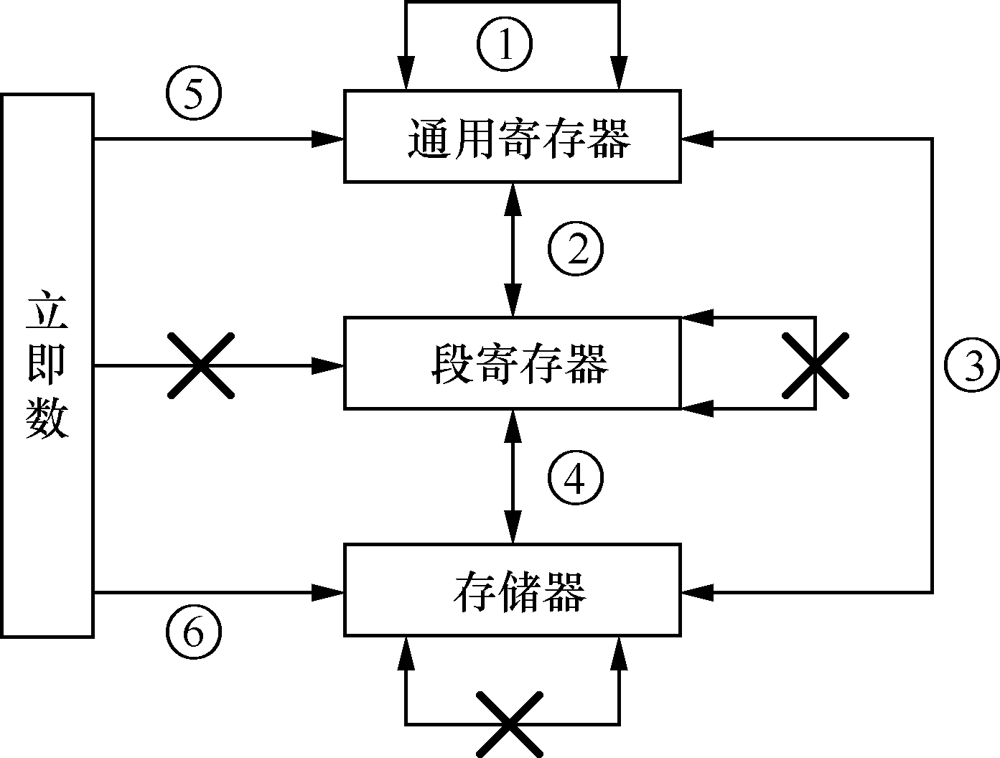
> [!note] 路径 ①：通用寄存器 $\longleftrightarrow$ 通用寄存器
>
> - **例**: `MOV AL, BL` / `MOV CX, DX`
>
> - **最快**的`MOV`操作没有之一。数据完全在CPU核心内部流动，不涉及任何外部总线或内存访问。
>
> - C/C++编译器在进行代码优化时，最核心的目标就是尽可能地将变量（尤其是循环变量）保存在寄存器中，让所有操作都变成这种寄存器之间的传送，从而实现最高性能。

> [!note] 路径 ② & ④：段寄存器 $\longleftrightarrow$ 通用寄存器 或 存储器
>
> - **例**: `MOV BX, CS` / `MOV DS, [SI]`
>
> - `CS`, `DS`, `SS`, `ES` 这些段寄存器非常特殊，它们掌管着内存寻址的"街道名称"。我们必须有办法设置它们。
>
> - **路径**: 数据**可以从**"通用寄存器/存储器"**流向**"段寄存器"，或者**从**"段寄存器"**流向**"通用寄存器/存储器"。
>
> - **规则**:
>
>     1. `CS`（代码段）**不能作为目的操作数！** `MOV CS, AX` 是**非法**的。
>     2. **原因：** `CS` 和 `IP`（指令指针）是CPU的核心动力，指向下一条要执行的指令。不能用一个简单的数据传送指令去"篡改"发动机的指向。只能通过特定的**控制转移指令**（如`JMP FAR`或`CALL FAR`）来同时、安全地修改`CS`和`IP`。
>     3. 但是`CS` **可以作为源操作数**（如 `MOV BX, CS`），这允许程序查询自己当前的代码段地址。

> [!note] 路径 ③：通用寄存器 $\longleftrightarrow$ 存储器
>
> - **例**: `MOV [BP+DI], DL` / `MOV AX, [BX]`
>
> - **最常见**的`MOV`操作。几乎所有程序都在做这两件事：
>
>     1. **加载 (Load)**：`MOV AX, [BX]`，把内存中的数据，加载到寄存器中准备进行计算。
>
>     2. **存储 (Store)**：`MOV [BP+DI], DL`，把寄存器中的计算结果，存回到内存中。

> [!note] 路径 ⑤：立即数 $\longrightarrow$ 通用寄存器
>
> - **例**: `MOV BX, 34H` / `MOV ESI, 12345678H`
>
> - 给变量赋一个常量值。`34H` 这个立即数就编码在指令的机器码里。
>
> - 实际编译器中，`int i = 123;` 几乎100%会被编译器翻译成 `MOV EAX, 123`。

> [!note] 路径 ⑥：立即数 $\longrightarrow$ 存储器
>
> - **例**: `MOV BYTE PTR [BX], 12H`
>
> - 把常量（`12H`）直接存入一个内存地址（`[BX]`）。

> [!danger] `PTR`（**`Pointer`**） 关键字说明
>
> - **`xxxx PTR` 关键字**：**类型说明符**。两个词是一个整体，共同作用来​**​明确告知CPU如何解释后面的内存地址​**​。CPU需要知道是存一个字节(BYTE)、一个字(WORD)还是一个双字(DWORD)。
>
>   - `MOV [BX], 12H` 这条指令是**有歧义的**！CPU不知道是该存`0012H`（16位）还是`12H`（8位）。
>
>   - `MOV BYTE PTR [BX], 12H` 明确告诉CPU："只传送一个字节（`12H`）"。
>
>   - `MOV WORD PTR [BX], 12H` 明确告诉CPU："要传送一个字（`0012H`）"。

> [!warning] **禁令1：两个操作数的类型要一致**
>
> - `MOV CX, AL` 是**非法**的（16位 $\leftrightarrow$ 8位）。
>
> - **原因：** 硬件的数据通路是按8/16/32位造的。CPU没有设计"混合尺寸"的`MOV`电路。
>
> - **解决方案：** 使用专门的**符号/零扩展**指令，如：
>   - `MOVSX CX, AL` （​**​S​**​ign E​**​x​**​tend，它认为源操作数是一个​**​有符号数​**​（可以是正数或负数）。扩展时，它用源操作数的​**​最高位（符号位）​**​ 来填充所有新增加的高位）
>   - `MOVZX CX, AL`（​**​Z​**​ero E​**​x​**​tend，它认为源操作数是一个​**​无符号数​**​（只能是正数或零）。扩展非常简单粗暴：​**​无论源操作数是什么，所有新增加的高位一律补 0​**）

>[!warning] 禁令2：CS 不能作为目的操作数

> [!warning] 禁令3：IP 和 EFLAGS 不能作为操作数
>
> - **原因：** `IP`（指令指针）和`EFLAGS`（标志寄存器）是CPU的核心寄存器。它们被**所有**指令**隐含地**读取和修改（比如`ADD`会修改标志位，`JMP`会修改`IP`），但不能用`MOV`去**显式地**篡改它们。
>
> - **解决方案：** 使用专门的指令：`JMP/CALL` 来修改 `IP`；`PUSHF/POPF` 来存取 `EFLAGS`。

> [!warning] 禁令4：两个操作数不能都是内存操作数
>
> - `MOV [BX], [SI]` 是**绝对非法**的！
>
> - 这是x86（CISC）架构向RISC设计哲学的一种妥协。
>
>     1. **硬件复杂性**：一条指令同时访问两个内存地址，需要两套寻址电路，并且可能导致两次缓存未命中（Cache Miss），指令执行时间会变得极长且不可预测，这违背了流水线设计。
>
>     2. **"Load/Store"架构**：CPU的设计哲学是"计算在寄存器中进行"。
>
> - **必须**使用一个寄存器作为中转站：
>
>     1. `MOV AX, [SI]` (从仓库 $\to$ 口袋)
>
>     2. `MOV [BX], AX` (从口袋 $\to$ 仓库)
>
> - 当在C++中写 `a = b;`（a和b都是全局变量，都在内存中），编译器**自动**会生成上述两条`MOV`指令。

> [!warning] 禁令5 & 6：立即数不能作为目的；不能立即数 $\to$ 段寄存器
>
> - `MOV 1234H, AX` 是**非法**的。`1234H`是一个**值**，不是一个**存储位置**。
>
> - `MOV DS, 1234H` 也是**非法**的。
>
> - 出于**安全和设计考虑**。段寄存器太重要了，Intel强制必须"分两步走"，通过一个通用寄存器来中转，以防出错。
>
> - **解决方案：**
>
>     1. `MOV AX, 1234H`
>
>     2. `MOV DS, AX`
>

###### **`PUSH`** 和 **`POP`** ：对堆栈 (Stack)的操作

> [!note] 堆栈（Stack）
>
> 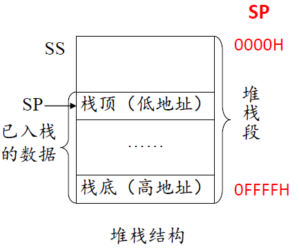
>
> 堆栈是内存中的一块特殊区域，采用“先进后出（LIFO）”原则。x86架构中，**栈底固定在高地址**，**栈顶在低地址**，数据入栈时地址递减。`SP`（栈顶指针）动态指向最新入栈数据。每次`PUSH`操作，数据压入更低地址，`SP`随之减少；`POP`则相反。此设计保证了数据后进先出，广泛用于函数调用、局部变量和中断处理等场景。

- **指令格式**:

 	- `PUSH <源操作数>` (16位或32位)
  		- `<源操作数>` 可以是：
      
      - **寄存器**：通用寄存器 (`AX`, `EBX`等) 或 段寄存器 (`DS`, `ES`等)。
          
      - **存储器**：内存中的一个值（如 `PUSH [BX+SI]`）。
          
      - **立即数 (386+ 优化)**：`PUSH 10`。在8086上这是非法的，你必须先 `MOV AX, 10` 再 `PUSH AX`。

 	- `POP <目的操作数>` (16位或32位)
  		- `<目的操作数>` 可以是：

      - **寄存器**：通用寄存器 (`AX`, `EBX`等) 或 段寄存器 (`DS`, `ES`等)。
          
      - **存储器**：内存中的一个位置（如 `POP [BX+SI]`）。

> [!note] 案例分析
>
> 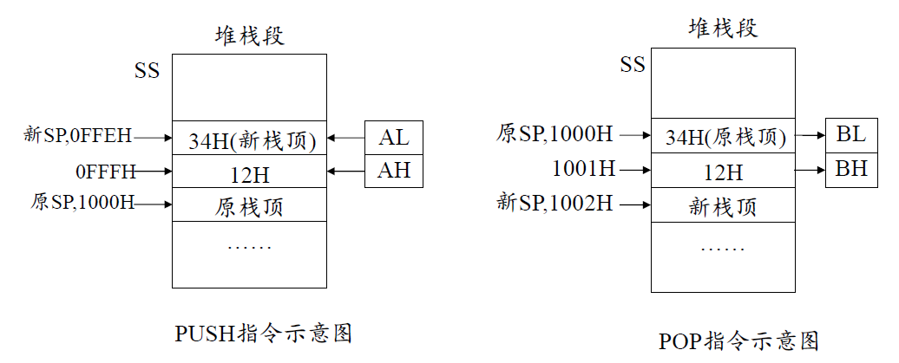
>
> **PUSH AX**（入栈）：
>
> - `SP` 先减2，为16位数据腾出空间。
> - `AX` 的低字节(`AL`)写入低地址，高字节(`AH`)写入高地址（小端序）。
> - `SP` 指向新栈顶，`AX` 内容不变。
>
> **POP BX**（出栈）：
>
> - 从 `SP` 指向的地址依次读取2字节，分别装入 `BX` 的低/高字节。
> - `SP` 加2，指向下一个栈顶位置。
> - `BX` 获得栈顶数据，原数据被丢弃。

- **禁令1：操作数必须是 16/32 位**

  - **错误指令：`PUSH AL`**。

  - **原因：** `SP` 寄存器本身是16/32位的，硬件天生就是按“字 (Word)”或“双字 (DWord)”来对齐和移动的。不能只压入一个8位字节，会导致 `SP` 错位，整个堆栈结构都会被破坏。

- **禁令2：`PUSH` 立即数 (8086/8088 不支持)**

  - 在80286及以后的CPU上，`PUSH 5` 是合法的，CPU会将其自动扩展为16位（`0005H`）再压栈。

- **禁令3：`POP` 的目的不能是立即数或 `CS`**

  - `POP 1234H`：**非法**。`POP` 需要一个“存储位置”作为目的地，而 `1234H` 是一个“值”。

  - `POP CS`：**非法**！和 `MOV CS, ...` 是一个道理。`CS`只能通过 `JMP`, `CALL`, `RET` 等**控制转移指令**来修改，绝不能用数据传送指令来随意篡改。

> [!tip] 拓展（C3-7）：`PUSH`/`POP`与函数调用
>
> 在函数调用过程中，`PUSH` 和 `POP` 指令用于管理参数、返回地址和局部变量，确保调用与返回的正确性。典型流程如下：
>
> 1. **参数入栈**：调用前将参数（通常从右到左）依次`PUSH`到堆栈。
> 2. **保存返回地址**：`CALL`指令自动将返回地址`PUSH`到堆栈。
> 3. **保存和设置栈帧**：进入函数后，`PUSH EBP`保存上一级栈底指针，`MOV EBP, ESP`建立当前函数的栈帧，`SUB ESP, ...`为局部变量分配空间。
> 4. **函数返回**：`MOV ESP, EBP`释放局部变量，`POP EBP`恢复上一级栈底指针，`RET`自动`POP`返回地址并跳转回调用点。
>
> **安全提示**：由于堆栈同时存储数据和控制信息（如返回地址），若局部变量溢出可能覆盖返回地址，导致缓冲区溢出攻击风险。
###### `PUSHA` / `POPA` （A for All）—— 16位“全家桶” (286以上)

1. `PUSHA` (Push All)

- **指令格式**: `PUSHA` (无操作数)
    
- **功能**: 将**8个16位通用寄存器**一次性、按固定顺序压入堆栈。
    
    1. **顺序**: `AX`, `CX`, `DX`, `BX`, `SP`, `BP`, `SI`, `DI`
        
    2. **`SP`的特殊性**: `PUSHA`会压入**执行`PUSHA`指令之前**的`SP`的**原始值**。
        
    3. **堆栈变化**: 压入了8个16位的字（`word`），每个字占2字节。
        
        - 总共压入：`8 * 2 = 16` 字节。
            
        - `SP`指针最后会**一次性减 16** ( `SP = SP - 16` )。

2. `POPA` (Pop All)

- **指令格式**: `POPA` (无操作数)
    
- **功能**: `PUSHA`的逆操作，从堆栈中弹出8个字，依次放回8个寄存器。
	
    1. **顺序 (LIFO)**: 必须按`PUSH`的**相反顺序**弹出，以保证“后进先出”。
        
        - 顺序：`DI`, `SI`, `BP`, `SP`, `BX`, `DX`, `CX`, `AX`
            
    2. **旧`SP`值直接丢弃**
        
        - 当`POPA`执行到`SP`时，它会从堆栈中**弹出**那个旧的`SP`值，但**直接将其丢弃**，而**不是**试图将其加载回`SP`寄存器。
            
        - **原因：** `POPA`指令在执行过程中，`SP`寄存器本身正在被**连续地`+2, +2, +2...`**。如果它在中途试图恢复一个旧的`SP`值，整个堆栈就会立刻错乱。`POPA`指令的最终目的是把`SP`的值**增加16**，它通过“弹出并丢弃”这个动作来**保持弹出序列的完整性**，同时保证`SP`的正确移动。
            
    3. **堆栈变化**: 弹出了8个16位的字。
        
        - `SP`指针最后会**一次性加 16** ( `SP = SP + 16` )。

###### `PUSHAD` / `POPAD` （AD for All Doublewords)）—— 32位“全家桶” (386以上)

1. `PUSHAD` (Push All Doublewords)

- **指令格式**: `PUSHAD`
    
- **功能**: 将**8个32位通用寄存器** (`EAX`, `ECX`...）一次性压入堆栈。
	
    1. **顺序**: `EAX`, `ECX`, `EDX`, `EBX`, `ESP`, `EBP`, `ESI`, `EDI`
        
    2. **`ESP`的特殊性**: 同样，压入的是**执行`PUSHAD`指令之前**的`ESP`的**原始值**。
        
    3. **堆栈变化**: 压入了8个32位的双字（`dword`），每个双字占4字节。
        
        - 总共压入：`8 * 4 = 32` 字节。
            
        - `ESP`指针最后会**一次性减 32**。
            

2. `POPAD` (Pop All Doublewords)

- **指令格式**: `POPAD`
    
- **功能**: `PUSHAD`的逆操作。
	
    1. **顺序 (LIFO)**: `EDI`, `ESI`, `EBP`, `ESP`, `EBX`, `EDX`, `ECX`, `EAX`
        
    2. **旧`ESP`值直接丢弃**：**逻辑完全相同**。`POPAD`从堆栈中读取旧的`ESP`值，但**直接丢弃**。它只需要保证`ESP`的最终结果是**增加了32**即可。

> [!tip] 拓展（C3-8）：PUSHA(D)/POPA(D) 在上下文切换与函数调用中的作用
>
> `PUSHA(D)` 和 `POPA(D)` 主要用于**函数调用**和**操作系统上下文切换**。当操作系统需要切换任务（如从Word切换到Chrome），会用 `PUSHAD` 一次性保存当前任务的所有通用寄存器，确保CPU状态完整保留。切换到新任务时，再用 `POPAD` 恢复目标任务的寄存器内容，实现任务的无缝切换。这是多任务操作系统和中断处理的基础机制。

###### `XCHG` (Exchange) —— “原子交换”

`XCHG` 是一个功能非常直观的指令，作用类似于C++中的 `std::swap` 函数。

- **指令格式**: `XCHG 目的操作数, 源操作数`
    
- **指令作用**: 将“目的”和“源”的内容**互换**。
    
- **示例**: `XCHG AX, BX`
    
    - 执行前: `(AX)=1000H`, `(BX)=2000H`
        
    - 执行后: `(AX)=2000H`, `(BX)=1000H`
        
> [!warning] `XCHG` 的规矩和 `MOV` 非常相似：
>
> 1. **允许**: `寄存器, 寄存器`（如 `XCHG AX, BX`）
> 2. **允许**: `寄存器, 存储器`（如 `XCHG AX, [BX]`）
> 3. **禁止**: `存储器, 存储器`（如 `XCHG [SI], [DI]`）
>    - **原因**: 和 `MOV` 一样，x86硬件**没有**设计“内存到内存”的直接数据通路。你必须使用一个寄存器作为中转站。
> 4. **禁止**: `段寄存器`（如 `XCHG AX, DS`）
>    - **原因**: 段寄存器太重要了，不能参与这种“随意”的交换。
> 5. **禁止**: `立即数`（如 `XCHG AX, 1234H`）
>    - **原因**: 逻辑上不通。你可以把`AX`的值给`1234H`吗？`1234H`是一个**值**，不是一个**位置**。

> [!tip] 拓展（C3-9）：XCHG 的两大工程用法
>
> - `NOP`（空操作）
>   - `XCHG AX, AX` 的机器码为 `0x90`，即 `NOP`，等于**什么也没干 (No-Operation)**。因此，`0x90` (`NOP`) 就成了CPU的“官方”空操作指令，用于指令对齐、填充、调试/热补丁占位。
>
> - 原子锁（多核同步）
>   - 加 LOCK 前缀对内存做原子交换：`LOCK XCHG [g_Lock], EAX`。
>   - 约定 `g_Lock`：0 空闲，1 占用；线程先令 `EAX=1` 再执行交换。
>   - 结果：`EAX=0` 表示锁之前是“空闲”的，此次获取成功；`EAX=1` 表示**其他线程**已经把 `1` 放进去了，需等待自旋重试。
>   - `LOCK` 确保两个CPU核心（线程）不会同时修改同一个内存变量

###### `XLAT` (Translate) —— “硬件查表”

`XLAT` 是一条非常有“年代感”的指令。它没有显式的操作数，但**隐含地**使用 `AL` 和 `BX` 寄存器。

- **指令格式**: `XLAT TABLE` (后面的`TABLE`只是一个助记符，表示字节表的首地址，可以省略)。
    
- **指令作用**: 硬件实现的“**查表 (Table Lookup)**”指令。
    
- **隐含操作语句**: `AL = [ (DS) * 16 + (BX) + (AL) ]`

`XLAT` 实现了类似 Excel `VLOOKUP` 的查表功能：`BX` 指向表首地址，`AL` 作为索引，CPU自动取出 `BX+AL` 处的字节并写回 `AL`。常用于高效字节级数据转换。

> [!note] 四步用法
>
> 1. **建立字节表**：在内存中定义一个**字节 (DB)** 表格（长度不能超过256字节，因为`AL`是8位的索引）。
> 2. **`BX` $\gets$ 表首地址**：把这个表的起始地址装入`BX`寄存器。
> 3. **`AL` $\gets$ 表内序号**：把你想要查询的“索引”（从0开始）装入`AL`寄存器。
> 4. **执行 `XLAT`**。

> [!note] 示例：计算 `4` 的平方
>
> 1. **建立表**：`SQUARE_TABLE DB 00H, 01H, 04H, 09H, 10H...`
>     - (索引`0`的值是`0^2=0`)
>     - (索引`1`的值是`1^2=1`)
>     - (索引`2`的值是`2^2=4`)
>     - (索引`3`的值是`3^2=9`)
>     - (索引`4`的值是`4^2=16`，即`10H`)
>
> 2. **`BX` $\gets$ 表首地址**：
>     - `MOV BX, OFFSET SQUARE_TABLE` (或者 `LEA BX, SQUARE_TABLE`)
>     - `BX` 现在指向 `SQUARE_TABLE` 的第一个字节 (`00H`)。
>
> 3. **`AL` $\gets$ 表内序号**：
>     - `MOV AL, 4`
>     - `AL` 现在的值是 `04H`。
>
> 4. **执行 `XLAT`**：
>     - CPU在内部开始计算：
>         - `EA = (BX) + (AL)`
>         - `EA = (SQUARE_TABLE 的地址) + 4`
>     - CPU去这个新的`EA`地址取**1个字节**的数据。
>     - 那个地址上的数据正是 `10H`。
>     - CPU将 `10H` 这个值**放回 `AL` 寄存器**。
>
> - **结果**：`AL` 寄存器的值被**覆盖**，从 `04H` 变成了 `10H`（十进制的16）。我们成功地用“查表”代替了“计算”。

> [!tip] 拓展（C3-10）:`XLAT` 的历史与现代应用
>
> - **历史背景**：在8086时代，`MUL`（乘法）指令非常慢，而 `XLAT` 通过查表实现乘法等操作，速度更快，因此被广泛用于高效计算。
> - **现代用途**：随着硬件发展，`MUL` 已非常高效，`XLAT` 主要用于字节级查表转换，如 ASCII 与 EBCDIC 编码互转。只需建立256字节的转换表，`XLAT` 即可一条指令完成字符编码转换，适合高效数据“翻译”场景。

###### **`LEA` (Load Effective Address)**：加载有效地址

- **指令格式**: `LEA 目的操作数, 源操作数`
    
- **操作数规则**:
    
    - **目的操作数**：**必须**是一个通用寄存器（如`AX`, `EBX`）。
        
    - **源操作数**：**必须**是一个**内存操作数**（即用`[]`括起来的地址表达式）。

`LEA` 的**唯一**工作就是 **“计算”** 源操作数的**16位或32位有效地址 (EA)**（即那个“偏移地址”），然后把这个**地址数值本身**传送到目的寄存器中。

`LEA` **永远不会**去访问内存。它只在CPU内部做一次地址计算。

> [!note] 案例分析
>
> - **场景**: `(BX) = 1000H`, `(DI) = 0100H`
> - **指令**: `LEA BX, [BX+DI+0010H]`
> - **执行过程**:
>     1. CPU的**地址计算单元**开始工作。
>     2. 它读取源操作数的“配方”：`[BX+DI+0010H]`。
>     3. 它取`BX`的值（`1000H`）、`DI`的值（`0100H`）和立即数（`0010H`）。
>     4. **计算EA**: `EA = 1000H + 0100H + 0010H = 1110H`。
>     5. **传送结果**: CPU将这个计算结果 `1110H` 送入**目的寄存器`BX`**。
> - **执行后**: `(BX) = 1110H`。`BX` 寄存器**被自己的计算结果覆盖了**。

> [!tip] 拓展（C3-11）:LEA 指令的工程价值与优化应用
>
> `LEA`（加载有效地址）不仅是 C/C++ 指针取地址（`&`）操作的硬件基础，还被现代编译器广泛用于高效数学运算优化。其地址计算单元支持“**基址 + 变址*比例 + 位移量**”三操作数加法和乘法，常被用来替代较慢的 `ADD`、`MUL` 指令。例如：
>
> - 取数组元素地址：`LEA EAX, [my_array + ESI*4]`（等价于 `&my_array[i]`）
> - 实现加法：`LEA EAX, [EBX + 5]`（等价于 `EAX = EBX + 5`）
> - 实现乘法与加法：`LEA EAX, [EBX*4 + EBX]`（等价于 `EAX = EBX * 5`），`LEA EAX, [EBX*8 + EBX + 3]`（等价于 `EAX = EBX * 9 + 3`）
>
> 总结：`LEA` 既是指针操作的硬件支撑，也是编译器优化数学运算的利器，提升了代码执行效率。

###### `LDS` 及其兄弟指令：目标地址传送指令

- **指令格式**: `LDS 目的操作数, 存储器操作数`
    
- **指令作用**: `LDS` 的全称是 **Load pointer into DS**（加载指针到DS）。

> [!note] 远指针
> 
> 在8086的1MB（20位）地址空间中，逻辑地址由两部分组成：
> - 16位 段寄存器（如 DS）；
> - 16位 偏移（如 BX）。
> 
> 这类以 `段:偏移` 表示的指针称为“**远指针（Far Pointer）**”。物理地址通过段左移4位再加上偏移计算得出：physical = segment * 16 + offset，结果为20位物理地址（最大可达1MB）。

如果我们要从内存中加载一个“远指针”，我们必须同时更新**两个**寄存器：

```asm
MOV BX, [2000H]   ; 加载16位偏移量到 BX
MOV DS, [2002H]   ; 加载16位段地址到 DS
```

Intel的工程师设计了`LDS`，**用一条指令完成上述两项工作**。 `LDS` 指令会从“存储器操作数”所指向的内存地址，**连续读取32位（4字节）**：

1. 它把**前16位**（低16位）加载到“**目的操作数**”（一个16位通用寄存器）中，作为**偏移地址**。
    
2. 它把**后16位**（高16位）加载到 **`DS` 寄存器**中，作为**段地址**。

> [!note] 案例分析
>
> - 场景：执行前 `DS = 1000H`。指令 `LDS BX, [2000H]` 使用默认段寄存器 DS，物理地址 = `DS*16 + 2000H = 12000H`。
> - 内存（小端序）从物理地址 `12000H` 开始依次为：`34H`（偏移低字节）、`12H`（偏移高字节）、`00H`（段低字节）、`20H`（段高字节）。
> - **执行要点**：
>   1. 读取前两字节到 BX → `(BX) = 1234H`。  
>   2. 读取后两字节到 DS → `(DS) = 2000H`。
> - **结果**：`BX = 1234H`，`DS = 2000H`。
> - **等价说明**：功能等同于 `MOV BX, [2000H]` + `MOV DS, [2002H]`，但 `LDS` 用一条指令同时完成两者，语义明确且更高效。

**`LES` (Load pointer into ES)**

- 加载 `偏移量` $\to$ 目的寄存器

- 加载 `段地址` $\to$ **`ES` (附加段)**

- **工业应用**: `ES` 通常与`DI`配合用于字符串操作。`LES DI, [pString]` 是一条极高效的指令，它能一次性把一个“远指针”加载为 `ES:DI`，为接下来的字符串操作（如`MOVSB`）做好准备。

**`LFS` / `LGS` (Load pointer into FS / GS) (386以上)**
   
- 分别加载段地址到 `FS` 和 `GS`。

- 在现代64位操作系统（如Windows 64-bit）中，`GS` 寄存器（或`FS`，取决于OS）被““劫持”了，它不再指向内存段，而是指向一个操作系统内核设置的、**每个线程私有**的数据结构，称为**线程信息块 (Thread Information Block, TIB)**。

- 当你访问**线程局部存储 (Thread-Local Storage, TLS)**（比如C++中的 `__declspec(thread)` 变量）时，CPU就是在用`GS`寄存器寻址。`LGS` 指令就是操作系统在 **“上下文切换”**（从一个线程换到另一个线程）时，用来快速设置这个`GS`指针的关键指令。

**`LSS` (Load pointer into SS) (386以上)**
    
- 加载 `偏移量` $\to$ 目的寄存器（通常是`ESP`）

- 加载 `段地址` $\to$ **`SS` (堆栈段)**

- **工业应用**: `LSS` 是操作系统进行**任务（线程）切换**的**最关键指令之一**。

- **场景**: 每个任务（线程）都有自己**独立**的堆栈（由`SS:ESP`指向）。当操作系统要从任务A切换到任务B时，它必须：

	1. 保存任务A的 `SS` 和 `ESP`。
            
    2. 加载任务B的 `SS` 和 `ESP`。

    - `LSS ESP, [PointerToTaskBStack]` 这一条指令，就能**原子地、一步到位**地完成堆栈的切换，这对于多任务操作系统的稳定运行至关重要。

###### `LAHF`/`SAHF`/`PUSHF`/`POPF`：标志位传送指令

这组指令的**唯一目的**，就是让我们能够**显式地读取或修改** CPU的**标志寄存器 (FLAGS)**。`ADD`, `SUB`, `CMP` 等指令会**隐式地**改变标志位（如零标志ZF、进位标志CF）。而这组指令允许我们**手动**把这些标志“存储”或“写回”。

1. **`LAHF` (Load AH with Flags)**

- **指令格式**: `LAHF <无操作数>`

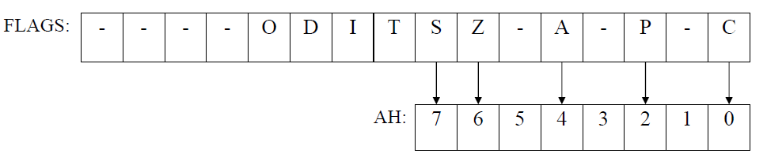

- **指令作用**：将`FLAGS`寄存器中**低8位**的值，**复制**到 `AH` 寄存器中。（并不是完整复制8位，而是按位对应的。它会把`SF` (符号), `ZF` (零), `AF` (辅助), `PF` (奇偶), `CF` (进位) 这5个最重要的状态标志，分别复制到`AH`的第 `7, 6, 4, 2, 0` 位。）

> [!note] 案例分析
> 
> ```
> C:\Users\ZHOUJI~1\ZJY>DEBUG
> -A
> 17D7:0100 LAHF
> 17D7:0101
> -R
> AX=0000 BX=0000 CX=0000 DX=0000 SP=FFEE BP=0000 SI=0000 DI=0000
> DS=17D7 ES=17D7 SS=17D7 CS=17D7 IP=0100 NU UP EI PL NZ NA PO NC
> 17D7:0100 9F LAHF
> -T
> AX=0200 BX=0000 CX=0000 DX=0000 SP=FFEE BP=0000 SI=0000 DI=0000
> DS=17D7 ES=17D7 SS=17D7 CS=17D7 IP=0101 NU UP EI PL NZ NA PO NC
> 17D7:0101 1E PUSH DS
> ```
> 
> **执行流程说明：**
> - 使用 `-A` 命令开始汇编，输入指令 `LAHF`（地址 17D7:0100）
> - 使用 `-R` 命令查看寄存器初始状态
> - 使用 `-T` 命令单步执行，执行 `LAHF` 指令后：
>   - AX 寄存器从 0000 变为 0200
>   - IP（指令指针）从 0100 前进到 0101
>   - 下一条待执行指令为 `PUSH DS`（机器码 1E）

2. `SAHF` **(Store AH with Flags)**

- **指令作用**：`LAHF`的**逆操作**。将`AH`寄存器中的值，**复制**回 `FLAGS` 寄存器的低8位，从而**一次性设置** `SF, ZF, AF, PF, CF` 这5个标志。
    
- 与`LAHF`一样，这也是一条**“历史遗留”**指令，现代编程中**几乎从不**使用。

3. `PUSHF` /`POPF`：**现代汇编中保存和恢复标志位的标准做法**

	- **`PUSHF` (Push the Flags)**
	    
	    - **指令作用**：将**整个16位**的`FLAGS`寄存器，**压入堆栈 (Stack)**。
	        
	    - **PPT 填空**：`SP的值减 2`。（因为压入了一个16位的字，占2字节）。
	        
	- **`POPF` (Pop the Flags)**
	    
	    - **指令作用**：从堆栈**顶部弹出一个16位的值**，将其**恢复**回`FLAGS`寄存器。
	        
	    - **PPT 填空**：`SP的值加 2`。（因为弹出了一个16位的字）。

###### `IN`/`OUT`：输入输出指令

这组指令用于CPU和**外部硬件**（如键盘、鼠标、网卡、串口）通信。

x86架构拥有两个“平行”的地址空间：

1. **内存地址空间**：我们所熟知的，用`MOV`指令访问。
    
2. **I/O 地址空间**：一个独立的、较小的地址空间（0 ~ 65535），专门用来“挂载”硬件设备。

`IN` 和 `OUT` 指令是访问**I/O地址空间**的**唯一**途径。

##### 算术运算类 (Arithmetic)

###### `ADD`/`ADC`/`INC`：加法指令

1. `ADD`

- **指令格式**：`ADD 目的操作数, 源操作数`
- **指令作用**：`目的操作数` $\leftarrow$ `目的操作数 + 源操作数`，运算结果会**覆盖**掉“目的操作数”中原来的值，“源操作数”的值**保持不变**。

寻址规则和 `MOV` 几乎一样，这体现了x86（CISC）架构的设计哲学：

- 当目的操作数为通用寄存器时，源操作数可以是通用寄存器、存储器操作数或者立即数；
- 当目的操作数是存储器操作数时，源操作数只能是通用寄存器或立即数。

`ADD` 指令会**全面更新**CPU的“状态指示灯板”——`FLAGS`寄存器。它会影响 **`OF, SF, ZF, AF, PF, CF`** 这6个核心的状态标志。

`ADD` 不仅仅是为了得到一个“和”，它更重要的作用是**通过设置这些标志，来为后续的 `if` 判断（条件跳转）提供依据**。

2. `ADC`**（Add with Carry）：带进位的加法**

- **指令格式**: `ADC 目的操作数, 源操作数` (语法规则与`ADD`完全相同)
    
- **指令作用**: `目的操作数` $\leftarrow$ `目的操作数 + 源操作数 + CF` 这里的 `CF`就是**进位标志 (Carry Flag, CF)**。`CF` 可能是 `0` 或 `1`。


`ADC` 是实现**大整数（多字节）运算**的唯一途径。

> [!note] 为什么需要 `ADC`（带进位加法）
>
> `ADC`（Add with Carry）用于多字节或多字加法。当处理器位数小于操作数位数（如16位CPU加32位数）时，需分多步相加。低位相加若产生进位，`CF` 标志会被置位。`ADC` 在高位相加时自动加上 `CF`，确保结果正确，是实现大整数加法的关键指令。

> [!note] 案例分析：16位CPU如何实现32位加法
>
> - **任务**: 计算 `DATA1 + DATA2`，其中 `DATA1 = 13579BDFH`，`DATA2 = 02468ACEH`。
>
> **步骤1：低16位相加**
>
> ```asm
> MOV AX, WORD PTR DATA1      ; AX = 9BDFH
> ADD AX, WORD PTR DATA2      ; AX = 9BDFH + 8ACEH = 126ADH
> MOV WORD PTR RESULT, AX     ; 结果低16位 = 26ADH，进位CF=1
> ```
>
> - 结果的低16位存入 `RESULT`，溢出的进位由 `CF` 标志保存。
>
> **步骤2：高16位带进位相加**
>
> ```asm
> MOV AX, WORD PTR DATA1+2    ; AX = 1357H
> ADC AX, WORD PTR DATA2+2    ; AX = 1357H + 0246H + CF = 159EH
> MOV WORD PTR RESULT+2, AX   ; 结果高16位 = 159EH
> ```
>
> - 利用 `ADC` 指令将高16位和进位一起相加，结果存入 `RESULT+2`。
>
> **最终结果**：`RESULT` 中为 `159E26ADH`，即两数之和。

这个 `ADD` $\to$ `ADC` $\to$ `ADC`... 的“**进位链**”是所有**高精度计算 (BigInt)** 库的底层原理。当在Python或Java中使用“大整数”计算一个1024位的加法时，CPU的底层就是在执行一个 `ADD` 和几十个 `ADC` 指令组成的循环。


3. `INC`**（Increment）：“精简的加1”**

- **指令格式**: `INC 目的操作数` (只有一个操作数)
    
- **指令作用**: `目的操作数 `$\leftarrow$` 目的操作数 + 1`

`INC` 指令会影响 `OF, SF, ZF, AF, PF`... **但它“不影响”CF (进位标志)！**

> [!note] 为什么 `INC` 不影响 `CF`
>
> `INC` 指令不会修改进位标志（CF），这是有意为之。虽然如 `(CX)=0FFFFH` 执行 `INC CX` 会溢出为 `0000H`，但 `CF` 保持原值，仅零标志（ZF）等被更新。这样设计便于将 `INC` 用作**循环计数或指针递增**，不影响多字节加法等需要进位链的场景，简化了循环和指针操作的实现。
> 
> Intel的工程师**故意**让`INC`不影响`CF`，就是为了让`INC`可以和`ADC`在同一个循环中**“和平共处”**。`INC` 专心做它的计数器，绝不“污染”`ADC` 赖以生存的`CF`标志。

###### 减法运算指令

> [!note] 补码加减法电路原理
>
> 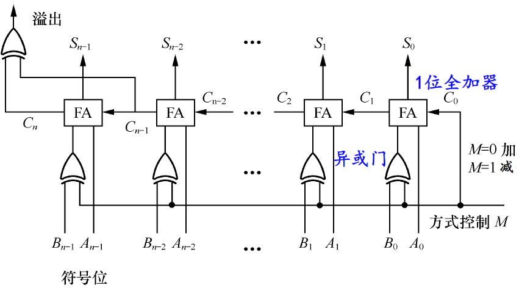
>
> 现代ALU（算术逻辑单元）通过补码技术，用同一套加法电路实现加法和减法：
>
> - **加法（M=0）**：`B` 直接输入，初始进位 `C0=0`，电路执行 `A + B`。
> - **减法（M=1）**：`B` 取反（`NOT B`），初始进位 `C0=1`，电路执行 `A + (NOT B) + 1`，即 `A + [-B]`，等价于 `A - B`。
>
> 这样，CPU只需切换 `M` 信号即可在加法和减法间切换，无需专门的减法器。

1. `SUB` **(Subtract) —— 基础减法**

- **指令格式**：`SUB 目的操作数，源操作数`
- **指令作用**：`目的操作数` $\leftarrow$ `目的操作数 - 源操作数`

CPU看到 `SUB`，立刻将加减法电路的**控制信号 `M` 置为 `1`**，然后把“目的”和“源”送入电路的 `A` 和 `B` 端，和`ADD`一样，它会全面更新`OF, SF, ZF, AF, PF, CF`这6个标志。

- **`CF` (进位标志) 的特殊含义**：
    
    - 在`SUB`中，`CF`不再叫“进位标志”，而是叫“**借位标志 (Borrow Flag)**”。
        
    - **`CF = 1`** 意味着发生了借位（比如 `5 - 10`，不够减）。用于**无符号数**的比较。如果 `A - B` 导致 `CF=1`，就说明 `A < B`。

2. `SBB` **(Subtract with Borrow) —— “借位减法”**

- **指令格式**：`SBB 目的操作数，源操作数`
- **指令作用**：`目的操作数` $\leftarrow$ `目的操作数 - 源操作数 - CF`，也就是说，`SBB` 不仅执行 `A - B`，它还会**额外地再减去 `CF` (上一步的借位)**。

> [!note] 案例分析
>
> **任务**：在16位CPU上计算 `13579BDFH - 02468ACEH`
>
> 1. `MOV AX, 9BDFH`  
> 2. `SUB AX, 8ACEH`  
>    - 结果：`0F31H`，无借位（CF=0）
> 3. `MOV AX, 1357H`  
> 4. `SBB AX, 0246H`  
>    - 结果：`1111H`（因CF=0，无再借位）
>
> **最终结果**：`11110F31H`。  
> `SUB` 与 `SBB` 的配合实现了多字节减法的正确性，`SBB`自动处理低位运算产生的借位。

3. `CMP` **(Compare) —— “比较”** 

在所有减法指令中，`CMP`是对高级语言来说最重要的一条， 是所有 `if` 语句的硬件基础。

- **指令格式**：`CMP 目的操作数，源操作数`
- **指令作用**：`CMP` **假装**做了一次`SUB`运算（`目的 - 源`），然后**只更新标志寄存器**，但**不保存**那个减法的结果。

> [!tip] **`if` 语句的诞生**：
>
> **C++ 代码**: `if (a == b)`
>
> **汇编**:
>
> ```asm
> CMP a, b      ; 核心！
> JE  label_if_equal ; "Jump if Equal"
> ```
>
> `CMP` 执行 `a-b`。如果 `a` 等于 `b`，结果是 `0`。`CMP` 就会**点亮 `ZF` (零标志)**。`JE` 指令的任务就是检查 `ZF` 灯是否亮了，如果亮了，就跳转。
>
> **C++ 代码**: `if (a < b)` (假设是无符号数)
>
> **汇编**:
> ```asm
> CMP a, b
> JB  label_if_below ; "Jump if Below"
> ```
>
> `CMP` 执行 `a-b`。如果 `a` 小于 `b`，`a-b` 必然需要**借位**。`CMP` 就会**点亮 `CF` (借位标志)**。`JB` 指令就是检查 `CF` 灯是否亮了。

4. `DEC` **(Decrement)： “减1”**

- **指令格式**: `DEC 目的操作数` (只有一个操作数)

`DEC` 和 `INC` 一样，会影响 `OF, SF, ZF...`，但故意不影响 `CF` (进位/借位标志)

5. `NEG` **(Negate) ：“求补码”**

- **指令格式**: `NEG 目的操作数` (只有一个操作数)

- **指令作用**：`NEG` 对操作数**求补**。执行 `0 - 目的操作数`。在硬件上就是把 `A` 输入设为 `0`，`B` 输入设为“目的操作数”，然后将**控制信号 `M` 置为 `1`**（减法模式）。


##### 逻辑操作类 (Logical)

###### `AND`、`TEST`、`OR`、`XOR`、`NOT`：逻辑运算指令

###### `SHL`、`SHR`、`SAL`、`SAR`**：移位运算指令**

- **指令格式**:
    
    - `指令助记符 目的操作数, n`
        
    - `指令助记符 目的操作数, CL`
        
- **目的操作数**: 可以是8/16/32位的**通用寄存器**（如`AL`, `CX`, `EBX`），也可以是**存储器操作数**（如`[BX+SI]`）。
- **移位次数**:
	
	- **`n` (立即数)**：在代码中**写死**一个常数，比如 `SHL AX, 3`（左移3位）。
	    
	- **`CL` (寄存器)**：须使用`CL`寄存器（`CX`的低8位）来**动态地**指定移位次数。

> [!note] 次数限制说明
> - **8086系统的限制 (上古时代)**
>     
>     - **`n` 只能为 1**：`SHL AL, 1` 是合法的。但 `SHL AL, 2` 是**非法**的！这是早期为了节省晶体管而做的硬件简化。
>         
>     - 如果想在8086上移2位，**必须**使用`CL`：
>         
>         ```
>         MOV CL, 2
>         SHL AL, CL  ; 合法
>         ```
>         
> - **286以上系统 (现代)**
>     
>     - `n` 的限制被**取消**了。`SHL AL, 8` 这样的指令是完全合法的。
>         
> - **`CL` 是唯一的！**
>     
>     - 硬件电路被**硬编码**为只识别`CL`作为次数寄存器。
>         
>     - `SHL BL, CH` 是**非法**的。

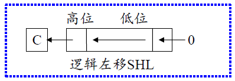

1. `SHL` **(Shift Logical Left) - 逻辑左移**

**过程**:

1. **最高位 (MSB)**：被挤出去，进入 **`CF` 标志位**。

2. **最低位 (LSB)**：空出来的坑，用 **`0`** 填充。

3. 其他位：全部向左移动一个位置。

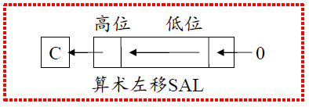

2. `SAL` **(Shift Arithmetic Left) - 算术左移**

**过程**:

1. **最高位 (MSB)**：被挤出去，“掉进” **`CF` 标志位**。

2. **最低位 (LSB)**：空出来的坑，用 **`0`** 填充。

`SAL` 和 `SHL` 的**硬件操作是完全相同的**！它们是同一条指令的两个不同“助记符”。

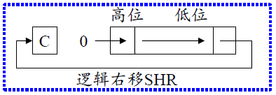

3. `SHR` **(Shift Logical Right) - 逻辑右移**

**过程**:

1. **最低位 (LSB)**：被挤出去，“掉进” **`CF` 标志位**。

2. **最高位 (MSB)**：空出来的坑，用 **`0`** 填充。

这种操作**只适用于无符号数**。因为最高位补0，所以结果永远是正数。

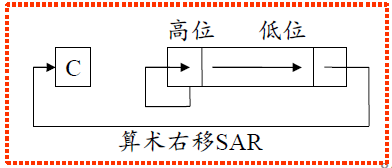

4. `SAR` **(Shift Arithmetic Right) - 算术右移**

**过程**:

1. **最低位 (LSB)**：被挤出去，“掉进” **`CF` 标志位**。

2. **最高位 (MSB)**：空出来的，用 **“原最高位”** 填充。

> [!note] SAR 算术右移的本质
> 
> - `SAR` 算术右移的关键在于**保持符号位不变**：右移时，最高位始终用原符号位填充，确保正数补0、负数补1，结果符号不变。
> - 适用于**带符号数**，常用于实现除以2的操作且保留正负号。

移位操作不仅仅是移动数据，它还会**全面更新**`FLAGS`寄存器，这对于`if`判断至关重要。

- **`CF` (进位标志)**
    
    - **规则**：`CF` **永远**等于 **“最后那个掉出去的比特位”**。
        
    - **用途**：可以用来逐位检查一个数。
        
- **`SF` (符号标志)** / **`ZF` (零标志)** / **`PF` (奇偶标志)**
    
    - **规则**：这三个标志会**根据移位后的“最终结果”** 来设置。
        
    - `SF=1`：如果结果是负数（最高位为1）。
        
    - `ZF=1`：如果结果是全0（`0000 0000`）。
        
    - `PF`：检查结果中`1`的个数（奇数个`1` $\to$ `PF=0`，偶数个`1` $\to$ `PF=1`）。
        
- **`AF` (辅助进位标志)**
    
    - **规则**：在移位操作中，`AF` 的状态是**未定义的**。
        
    - **结论**：不要在`SHL`/`SHR`之后依赖`AF`的值。
        
- **`OF` (溢出标志) **
    
    - **`OF` 的作用**：`OF=1` 意味着 **“带符号”** 运算的结果 **“符号反了”**（即正的变负，或负的变正）。
    
    - **`SAR`**：`OF` 永远为 `0`，不会导致溢出。
	
    -  **`SHR`**：对于（逻辑右移）指令，当且仅当移位次数为1时，CPU对 `OF` 标志的设置规则是：不进行任何复杂的“溢出”逻辑判断，**单纯地把移位前的那个符号位，复制到 `OF` 标志位里**。
    
    - **`SHL` / `SAL` (移位次数n=1时)**：
        
        - **规则**：`O = C ⊕ M`。`C`是进位标志(CF)，`M`是移位后的最高位。`⊕`是异或。
            
        - **解释**：`OF` 被置1，**当且仅当**“掉出去的位”和“新的符号位”**不相同**时。
            
            - 例1：`0100...` (正数) $\to$ `SHL` $\to$ `1000...` (负数)。**符号变了！`OF=1`**。
                
            - 例2：`1100...` (负数) $\to$ `SHL` $\to$ `1000...` (还是负数)。符号没变，`OF=0`。
                
            - 例3：`1000...` (负数) $\to$ `SHL` $\to$ `0000...` (正数)。**符号变了！`OF=1`**。
                
    - **`SHL` / `SAL` (移位次数n > 1时)**：
        
        - **规则**：`OF` 标志**未定义**。
            
        - 硬件只为`n=1`设计了溢出检测电路。

> [!note] 移位指令的高效乘除法应用
>
> 移位指令（`SHL`/`SAL`/`SHR`/`SAR`）本质上是**高效实现乘除法**的利器：
>
> - **左移一位**（`SHL`/`SAL`）：等价于乘以2
> - **右移一位**（`SHR`）：等价于**无符号数**除以2，`CF`保存被移出的最低位（即余数）
> - **算术右移**（`SAR`）：等价于**带符号数**除以2，自动保留符号
>
> 相比传统的`MUL`/`DIV`指令，移位操作极快（如8086上`SHL`仅需2个时钟周期，而`MUL`可能高达百余周期），在性能敏感场景下尤为重要。
>
> **示例：**
>
> - `SHL AL, 1`：无符号数 ×2
> - `SHR AL, 1`：无符号数 ÷2，`CF`为余数
> - `SAL AL, 1`：带符号数 ×2，`OF`指示溢出
> - `SAR AL, 1`：带符号数 ÷2，自动符号扩展

> [!tip] 编译器优化：移位与LEA替代乘法
>
> 现代编译器在遇到如 `int y = x * 10;` 这类常数乘法时，通常不会直接生成 `MUL` 指令，而是采用更高效的移位与加法组合。例如：
>
> ```asm
> MOV EAX, [x]
> MOV EBX, EAX
> SHL EAX, 3     ; x * 8
> SHL EBX, 1     ; x * 2
> ADD EAX, EBX   ; x * 10
> ```
>
> 更高级的优化会用 `LEA` 指令一步完成：`LEA EAX, [ESI*8 + ESI*2]`。这种“强度折减”优化大幅提升了乘法性能，是编译器生成高效代码的常见手段。

###### 循环移位指令 (Rotate)

语法规则和 `SHL`/`SHR` 完全一样

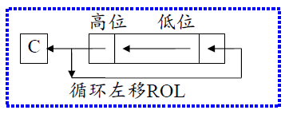

1. **`ROL` (Rotate Left) - 循环左移**

**过程**：最高位被挤出去，它**同时**去两个地方： a) 进入 **`CF` 标志位**（作为记录）。 b) “绕回来”，**填充**到**最低位 (LSB)** 的空位上。

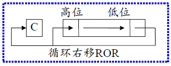

2. **`ROR` (Rotate Right) - 循环右移**

**过程**：最低位被挤出去，它**同时**去两个地方： a) “掉进” **`CF` 标志位**（作为记录）。 b) “绕回来”，**填充**到**最高位 (MSB)** 的空位上。

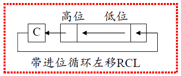

3. `RCL` **(Rotate through Carry Left) - 带进位循环左移**

这是一个 **9位 / 17位 / 33位** 的大循环。

1. **最高位 (MSB)**：被挤出去，进入 **`CF` 标志位**。
    
2. **最低位 (LSB)**：空出来的坑，由 **`CF` 标志位里“原来”的值**来**填充**。

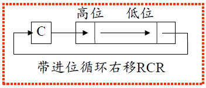

4. **`RCR` (Rotate through Carry Right) - 带进位循环右移**

- **过程**：
    
    1. **最低位 (LSB)**：被挤出去，“掉进” **`CF` 标志位**。
        
    2. **最高位 (MSB)**：空出来的坑，由**`CF` 标志位里“原来”的值**来**填充**。


标志寄存器的影响

- **`CF` (进位标志)**
    
    - **规则**：`CF` **永远**等于**“最后那个掉出去的比特位”**。
        
- **`OF` (溢出标志) (但仅限`n=1`)**
    
    - **规则 (仅左移)**：`ROL` 和 `RCL` 在`n=1`时，`OF`的规则和`SAL`一样：`O = C ⊕ M` (即“**当且仅当符号位发生改变时，OF=1**”)。
        
    - `ROR` 和 `RCR` 对`OF`的影响规则比较晦涩，但`n=1`时通常是`OF = (最高位) ⊕ (次高位)`。
        
- `SF`, `ZF`, `AF`, `PF`
    
    - **不影响**SF, ZF, AF, PF”。
        
    - 这与 `SHL/SHR` **不同**`SHL` (作为乘法) 会改变`ZF`和`SF`，而`ROL`**不会**去更新这些状态标志（在`n=1`时）。

##### 字符串操作类 (String)

`MOVS`、`LODS`、`STOS`、`CMPS`、`SCAS`、`INS`、`OUTS`等，C语言标准库中的著名函数（如 `memcpy`, `memset`, `memcmp`），其**硬件“真身”**，就是这组指令。

1. **操作数特征 (Implicit Operands)**：

	- **源字符串**: `DS:SI` (或 32位的 `DS:ESI`)
	    
	    - **`SI/ESI` (Source Index)**: 硬件规定，源操作数的**偏移地址 (EA)** 必须存放在`SI`或`ESI`寄存器中。
	        
	    - **`DS` (Data Segment)**: 硬件默认，“源”操作数的**段地址**在`DS`中。（可段超越。意味着可以强制CPU使用其他段，比如 ES:\[SI\]。）
	        
	- **目标字符串**: `ES:DI` (或 32位的 `ES:EDI`)
	    
	    - **`DI/EDI` (Destination Index)**: 硬件**规定**，“目的”操作数的**偏移地址 (EA)** 必须存放在`DI`或`EDI`寄存器中。
	        
	    - **`ES` (Extra Segment)**: 硬件**默认**，“目的”操作数的**段地址**在`ES`中。（不能段超越，不能写成 DS: \[DI\]。目标永远、必须在 ES 段。)

2. 字符串指令强大的地方在于，每执行完一次（比如传送1个字节），**`SI` 和 `DI` 寄存器会自动更新**，为下一次操作做好准备。
	
	**`DF` (Direction Flag)**：自动更新的方向，由`FLAGS`寄存器中的`DF`（方向）标志位控制。

	- **`DF = 0` (默认)**: **`SI/EDI` 自动递增**。
	    
	    - `+1` (字节), `+2` (字), `+4` (双字)。
	        
	    - 从内存**低地址向高地址**复制（“正向复制”）。
	        
	- **`DF = 1`**: **`SI/EDI` 自动递减**。
	    
	    - `-1` (字节), `-2` (字), `-4` (双字)。
	        
	    - 从内存**高地址向低地址**复制（“反向复制”）。

| 助记符                    | 处理器   | 指令格式          | 替代符                                                      | 对应C函数    | 功能                                              |
| ---------------------- | ----- | ------------- | -------------------------------------------------------- | -------- | ----------------------------------------------- |
| `MOVS`（Move String）    | 80x86 | `MOVS` 目的串，源串 | `MOVSB`（Byte）/`MOVSW`（Word）/`MOVSD`（Doubleword）(80386以上) | `memcpy` | 内存到内存的**批量复制**。                                 |
| `LODS`（Load String）    | 80x86 | `LODS` 源串     | `LODSB`/`LODSW`/`LODSD` (80386以上)                        | `*src++` | 从内存“流”中**加载**一个数据到累加器（`AL`/`AX`/`EAX`），并自动移动指针。 |
| `STOS`（Store String）   | 80x86 | `STOS` 目的串    | `STOSB`/`STOSW`/`STOSD` (80386以上)                        | `memset` | 将累加器中的值（`AL`/`AX`/`EAX`）**填充**到一整块内存区域。         |
| `CMPS`(Compare String) | 80x86 | `CMPS` 目的串，源串 | `CMPSB`/`CMPSW`/`CMPSD` (80386以上)                        | `memcmp` | 比较两块内存区域。                                       |
| `SCAS`(Scan String)    | 80x86 | `SCAS` 目的串    | `SCASB`/`SCASW`/`SCASD` (80386以上)                        | `memchr` | 在一块内存中**搜索**一个特定的字符                             |

`目的串`和`源串`只是助记符，**不能用于寻址**。只是用来**告诉汇编器 (Assembler)** 操作的是“字节串”、“字串”还是“双字串”。（例，`MOVS my_dest_buf, my_src_buf`。如果这两个`buf`都是用`DW` (Define Word) 定义的，汇编器会自动把它翻译成 `MOVSW`。）

###### `MOVS` (Move String)：内存 $\to$ 内存

- **指令格式（两种写法）**:

1. **`MOVS 目的串, 源串`**: 给“汇编器”看的。`目的串`和`源串`是在 `.DATA` 段定义的变量名。汇编器会根据定义变量的类型（`DB` - 字节, `DW` - 字, `DD` - 双字）自动把它翻译成 `MOVSB`, `MOVSW` 或 `MOVSD`。
    
2. **`MOVSB / MOVSW / MOVSD`**: 这是**更清晰、更常用**的写法，它**省略了操作数**。

- **指令功能:**
    
    - **`MOVSB` (Move String Byte)**:
        
        1. `[ES:DI] `$\gets$` [DS:SI]` (从`DS:SI`读1个字节, 写入`ES:DI`)
            
        2. `SI` $\gets$` SI ± 1` (自动更新源指针)
            
        3. `DI `$\gets$ `DI ± 1` (自动更新目的指针)
            
    - **`MOVSW` (Move String Word)**:
        
        - 同上，但传送2个字节，`SI`/`DI` 自动 `± 2`。
            
    - **`MOVSD` (Move String Doubleword)**:
        
        - 同上，但传送4个字节，`SI`/`DI` 自动 `± 4`。
            
- **`±` (加还是减)**：
    
    - 完全取决于`FLAGS`寄存器中的**`DF` (Direction Flag, 方向标志)**。
        
    - **`CLD` 指令** (Clear DF) $\to$ `DF = 0` $\to$ `SI`/`DI` **递增** (正向复制)。
        
    - **`STD` 指令** (Set DF) $\to$ `DF = 1` $\to$ `SI`/`DI` **递减** (反向复制)。

> [!note]  REP 重复前缀
>
> - `MOVS` 每次只传送一个单位（`MOVSB`/`MOVSW`/`MOVSD`/`MOVSQ`）；`REP` 不是独立指令，而是一个**前缀**，用于把后面的字符串指令循环执行若干次。
> - **计数器**：使用 `CX`（16位）或 `ECX`（32位）作为循环计数器；当计数为 0 时，`REP` 不执行任何复制。
> - **硬件微码循环（以 `REP MOVSB` 为例）**：
>   1. 检查 `CX`/`ECX` 是否为 0；若为 0，则结束。
>   2. `CX`/`ECX` ← `CX`/`ECX`- 1。
>   3. 执行一次 `MOVSB`（传送一个字节，`SI`/`DI` 或 `ESI`/`EDI` 自动更新）。
>   4. 无条件回到第 1 步，直至计数为 0。
> - **注意事项与优化提示**：
>   - REP 会修改 `CX`/`ECX`及 `SI`/`DI`（或 `ESI`/`EDI`）；执行前后这些寄存器的值会改变。
>   - 现代处理器对 `REP MOVSB`/`MOVSD`/`MOVSQ` 有专门优化（高速内存复制路径），优先使用合适的单位（双字/四字/八字）以提高吞吐量。
>   - 使用 `CLD`/`STD` 控制 `DF`（方向标志），避免复制方向错误。

###### `LODS` / `STOS`：**内存 $\leftrightarrow$ 寄存器**

1. `LODS` **(Load String) —— “从数据流中装载”**

- **指令格式**：`LODS 源串 ；替代符`：`LODSB` / `LODSW `/ `LODSD`
- **指令功能**：从 `DS:[SI/ESI]` 指向的内存地址**读取**一个字节、字或双字，并将其**存入** `AL`、`AX` 或 `EAX` 中。（**注**：`LODS` 的**目的地永远被硬编码为累加器**（AL/AX/EAX）。）
- **自动指针修改**：在读取完成后，`SI/ESI` 寄存器会**自动**增加或减少（`± 1, 2, 4`），具体方向取决于 `DF`（方向）标志位。

2. `STOS` **(Store String) —— “向数据流中存储”**

- **指令格式**：`STOS 目的串 ；替代符`： `STOSB` / `STOSW` / `STOSD`
- **指令功能**：将 `AL`、`AX` 或 `EAX` 寄存器中的值，**写入**到 `ES:[DI/EDI]` 指向的内存地址。
- **自动指针修改**：在写入完成后，`DI/EDI` 寄存器会**自动**增加或减少（`± 1, 2, 4`），具体方向取决于 `DF`（方向）标志位。

###### `CMPS` (Compare String) 

- **指令格式**: `CMPS 目的串, 源串`，或者更清晰的替代符：`CMPSB` (字节), `CMPSW` (字), `CMPSD` (双字)。
    
- **指令功能: `CMPS` 的工作方式和`CMP`完全相同**：
    
    1. 在内部计算 `[DS:SI] - [ES:DI]`。
        
    2. **丢弃**这个减法的结果。
        
    3. **只**更新`FLAGS`寄存器（`OF`, `SF`, `ZF`, `AF`, `PF`, `CF`）**反映**这次减法的结果。
        
    4. **自动**根据`DF`标志，递增或递减 `SI` 和 `DI`。

   CMPS 执行后，我们最关心的就是 ZF 标志：
    
    - **`ZF = 1`**: 意味着 `[DS:SI] - [ES:DI]` 的结果是 `0` $\implies$ **两个操作数相等**。
        
    - **`ZF = 0`**: 意味着结果不是 `0` $\implies$ **两个操作数不相等**。

> [!note] `REPE`/`REPZ` 条件重复与字符串比较流程
>
> **条件重复前缀简介：**
> - `REPE`/`REPZ`（Repeat while Equal/Zero）是带条件的字符串操作前缀，常与 `CMPS` 配合，实现“遇到不等即停”的批量比较。
> - 工作流程：每次执行 `CMPS` 后，若 `ZF=1`（相等）且 `CX` 未减到 0，则继续；否则立即退出。
>
> **应用流程：**
> 1. **初始化**：
>    - `CLD`：清除方向标志，保证 `SI`/`DI` 递增。
>    - `LEA SI, SOURCE` / `LEA DI, DEST`：设置源/目标指针。
>    - `MOV CX, 10`：设置比较次数（如 10 个字）。
> 2. **核心比较**：
>    - `REPE CMPSW`：循环比较，遇到不等或计数用尽即停。
>    - `JNZ DIFF`：若 `ZF=0`（发现不等），跳转到 `DIFF` 标签，否则继续。
>    - `MOV DL, 59H`：全部相等时，DL 赋值为 `'Y'`。
>    - `JMP DONE`：跳转到输出。
>    - `DIFF: MOV DL, 4EH`：有不等时，DL 赋值为 `'N'`。
> 3. **输出结果**：
>    - `DONE: MOV AH, 02H` / `INT 21H`：调用 DOS API 输出 DL 中的字符。
>    - `INT 3`：调试中断，程序结束。
>

###### `SCAS` (Scan String) 

- **指令格式**: `SCAS 目的串`，或更清晰的替代符 `SCASB` (字节), `SCASW` (字), `SCASD` (双字)。
    
- **指令功能**: `SCAS` 的工作方式类似于 `CMPS`，但它比较的**不是**两个内存操作数，而是**累加器**和**内存操作数**。
    
    1. **“幽灵”减法**: 它在内部计算 `AL/AX/EAX - [ES:DI/EDI]`。
        
    2. **不保存结果**: 它**丢弃**这个减法的结果。
        
    3. **只设置标志**: 它**只**更新`FLAGS`寄存器（`OF`, `SF`, `ZF`, `AF`, `PF`, `CF`）来**反映**这次减法的结果。
        
    4. **自动移指针**: 它**自动**根据`DF`标志，递增或递减**目的指针 `DI/EDI`**。
        
- 和`CMPS`一样，`SCAS` 执行后，我们最关心的就是 `ZF` 标志：
    
    - **`ZF = 1`**: 意味着 `累加器 - [ES:DI]` 的结果是 `0` $\implies$ **累加器中的值** 与 **内存中的值相等** (“找到了！”)。
        
    - **`ZF = 0`**: 意味着结果不是 `0` $\implies$ **两者不相等** (“没找到，继续...”）。

> [!note] 重复前缀总结
> 
> **x86字符串指令的三类重复前缀：**
> 
> - **REP**：无条件重复，执行`CX`次，常用于`MOVS`（复制）、`STOS`（填充）。仅`CX=0`时退出。
> - **REPE/REPZ**：当`ZF=1`（相等）时继续，最多`CX`次，常配合`CMPS`（比较）、`SCAS`（扫描）。`CX=0`或`ZF=0`时退出。
> - **REPNE/REPNZ**：当`ZF=0`（不等）时继续，最多`CX`次，也用于`CMPS`、`SCAS`。`CX=0`或`ZF=1`时退出。
> 
> 这些前缀让字符串操作指令能高效实现批量复制、比较和查找等循环操作，是汇编中自动化处理数据块的关键机制。

**`SCAS` 与 `REPNE/REPNZ` 配合使用：** 用 `SCAS` + `REPNE` 实现“在字符串中查找特定字符”。

- `REPNE SCASB` 会循环执行，直到：
  1. 找到目标（`ZF=1`，即 `AL` 等于 `[ES:DI]`），或
  2. 扫描次数用尽（`CX=0`，未找到）。

- 循环结束后，**必须检查 `ZF`**：
  - `ZF=1`：找到了目标字节
  - `ZF=0`：未找到

**示例：查找 `0FFH`**：

```asm
LEA DI, DEST      ; 目标区域首地址
MOV CX, 100       ; 扫描100字节
MOV AL, 0FFH      ; 查找的字节
REPNE SCASB       ; 循环查找
JNE ERR           ; 未找到则跳转到 ERR
; 找到时，DI 指向目标字节的下一个位置，需 DEC DI 得到实际地址
; 找到的索引为 100 - CX
```

##### 控制转移类 (Control Transfer)

###### `JMP` (Jump)

`JMP` 指令是实现**所有**程序逻辑（`if/else`, `for/while`, `switch`, `goto`）以及**函数调用**（与`CALL`/`RET`配合）的**最底层硬件基础**。

- **指令格式**：
	- **直接转移**：`JMP 目标标号` ; 标号为指令性语句的起始地址
	- **间接转移**：`JMP 操作数`
	- **段内转移**：目标单元在当前的代码段中，`JMP`指令只修改`IP`/`EIP`
	的值，而 `CS` 保持不变。
	- **段间转移**：目标单元不在当前的代码段中，`JMP`指令需修改 `IP`/`EIP` 和 `CS` 的值。

- **指令功能**: `JMP` 执行**无条件转移**。CPU只要遇到`JMP`，就会立刻改变方向，跑到“目标单元”去执行。
    
- **核心动作**: `JMP` 指令的**唯一**目的，就是修改CPU的`IP`/`EIP`（指令指针）寄存器，以及（在某些情况下）`CS`（代码段）寄存器。

1. **段内直接转移 (Near, Direct)**

	目标地址就在当前代码段内。`JMP`指令的机器码中**不包含**目标地址本身，而是包含一个**相对偏移量 (Relative Offset)** ：`目标IP = 当前IP + 指令长度 + 相对偏移量`
	
	**两种形式**:
	
	1. **短转移 (SHORT)**:
	    
	    - **偏移量**: **8位**有符号数 (`-128` 到 `+127` 字节)。
	        
	    - **机器码**: 通常只需要**2个字节** (`EB cb`, `cb`是8位偏移)。
	        
	    - **优点**: 指令最短，执行最快。
	        
	    - **编译器/汇编器**: 会**优先**选用`SHORT`跳转（如果目标距离足够近）。
	        
	    - **例**: `JMP SHORT NEXT`。假设`NEXT`标签比当前指令地址高`1EH` (`0130H - 0102H = 1EH`)，机器码就是 `EB 1E`。
	        
	2. **近转移 (NEAR)**:
	    
	    - **偏移量**: **16位**（`±32KB`）或**32位**（`±2GB`）有符号数。
	        
	    - **机器码**: 需要**3字节**（16位偏移）或**5字节**（32位偏移）。
	        
	    - **用途**: 当`SHORT`跳转距离不够时，编译器自动选用`NEAR`。
	        
	    - **PPT示例**: `JMP NEXT` (省略了`NEAR`)。假设`NEXT`比当前指令地址高`102DH` (`1130H - 0103H = 102DH`)，机器码就是 `E9 2D 10` (小端序)。

2. **段间直接转移 (Far, Direct)**
	
	这种形式用于**跨代码段**的跳转。在现代“扁平内存模型”的操作系统（如Windows, Linux）中**极其罕见**，但在DOS或早期分段模型中是必须的。
	
	- **核心思想**: 指令的机器码中**直接包含**目标的**完整 `CS:IP` (或 `CS:EIP`)** 地址。
    
	- **指令格式**: `JMP FAR PTR 目标标号`
	    
	- **动作**: CPU从指令中读取新的`CS`和`IP`值，并**同时更新**这两个寄存器。
	    
	- **PPT示例**: `JMP FAR PTR NEXT`。假设`NEXT`的地址是 `2000H:0130H`。
	    
	    - **机器码**: 会包含 `EA 30 01 00 20` (`EA`是操作码, `30 01`是偏移`0130H`, `00 20`是段`2000H`)。
	        
	    - **执行后**: `(CS) = 2000H`, `(IP) = 0130H`。

3. **段内间接转移 (Near, Indirect)**

	这是**实现动态跳转**（如函数指针、`switch`语句）的**关键**.目标地址不再写死在代码里。
	
	- **核心思想**: 跳转的目标**偏移地址 (IP/EIP)** 存放在一个**寄存器**或**内存单元**中。`JMP`指令需要先去**读取**这个地址。`CS`保持不变。
	    
	- **指令格式**: `JMP 操作数`
	    
	- **操作数**: 可以是：
	    
	    - **16/32位通用寄存器**: `JMP BX`, `JMP ESI`
	        
	        - **动作**: `IP \gets (BX)` 或 `EIP \gets (ESI)`。
	            
	    - **16/32位内存地址**: `JMP [BX]`, `JMP [MyJumpTargetVar]`
	        
	        - **动作**: `IP \gets DS:[BX]` 或 `EIP \gets DS:[MyJumpTargetVar]`。CPU会先去内存读取一个16/32位的地址，然后将其加载到`IP`/`EIP`。
4. **段间间接转移 (Far, Indirect)**

这是**最复杂**的跳转方式，用于**跨段**的**动态**跳转。同样，在现代扁平模型中极为罕见。

- **核心思想**: 跳转的目标**`CS`和`IP`/`EIP`** 都存放在**内存单元**中。
    
- **指令格式**: `JMP 存储器操作数` (必须用 `DWORD PTR` 或 `FWORD PTR` 显式指明类型)。
    
- **内存布局 (小端序)**:
    
    - **8086 (DWORD)**: 内存中连续4字节，低16位是`IP`，高16位是`CS`。
        
        - `JMP DWORD PTR [BX]`
            
            - `IP \gets WORD PTR [BX]`
                
            - `CS \gets WORD PTR [BX+2]`
                
    - **80386 (FWORD)**: 内存中连续6字节，低32位是`EIP`，高16位是`CS`。
        
        - `JMP FWORD PTR [MyFarPointer]`
            
            - `EIP \gets DWORD PTR [MyFarPointer]`
                
            - `CS \gets WORD PTR [MyFarPointer+4]`


##### 处理器控制类 (Processor Control)


### 第四章 汇编语言程序设计

#### 汇编语言概述

##### 机器语言 (Machine Language)

```
076B:0000 B86A07    MOV AX,076A
076B:0003 8ED8      MOV DS,AX
076B:0005 B409      MOV AH,09
076B:0007 8D160000  LEA DX,[0000]
076B:000B CD21      INT 21
076B:000D B44C      MOV AH,4C
076B:000F CD21      INT 21
```

**概念**: 机器语言是由“0”和“1”组成的**二进制指令码**。CPU（中央处理器）的设计者会规定，哪一种01组合对应哪一种“基本操作”。

计算机（CPU）拿到这些`01`串，不需要翻译，就能立刻执行，因为它的内部电路就是为此设计的。

**目标程序 (Target Program)**: 无论使用何种高级语言（C++, Python, Java）写程序，它们最终都必须被**翻译**成机器语言（即“目标程序”），CPU才能运行。

- **优点**: **效率极高**。没有中间商赚差价，所写的指令直接就是CPU执行的指令，能最大限度地压榨CPU的性能。

- **缺点**: **记忆，使用极其困难**。人类的大脑不适合记忆和编写长串的01代码（或十六进制代码）。看图中的`B86A07`，你根本看不出它在干什么。如果程序出了错（Bug），调试过程简直是噩梦。

> [!tip] 工业中的机器语言应用与前沿实践
>
> - **历史应用**：早期计算机（1950-60年代）需用打孔卡片或开关直接输入机器码，是最原始的编程方式。
> - **现代主要应用者**：
>   1. **CPU架构师**：如Intel、AMD、ARM等，负责定义和实现指令集架构（ISA）。
>   2. **编译器开发者**：需精通机器码，将高级语言高效准确地翻译为底层指令。
>   3. **网络安全与逆向工程师**：通过反汇编分析恶意软件或无源代码程序，理解其底层行为。
>   4. **极端嵌入式开发**：在资源极度受限的芯片上，工程师有时直接手写或优化机器码以节省空间和提升效率。

##### 汇编语言 (Assembly Language)

```asm
076B:0000 B86A07    MOV AX,076A
076B:0003 8ED8      MOV DS,AX
076B:0005 B409      MOV AH,09
076B:0007 8D160000  LEA DX,[0000]
076B:000B CD21      INT 21
076B:000D B44C      MOV AH,4C
076B:000F CD21      INT 21
```

**概念**: 人们发现记`B86A07`太难了，但它对应的操作是 **MOV**e the value `076A` into the `AX` register”（把076A**移动**到AX寄存器）。于是，他们发明了**汇编语言**，用一个有意义的“助记符”（Mnemonic）比如`MOV`，来代替`10111000` (`B8`)。
    
- **一对一关系**: 汇编语言的核心特征。如图所示，`B86A07` _精确地_对应 `MOV AX, 076A`。`8ED8` _精确地_对应 `MOV DS, AX`。它不像高级语言，它只是机器码的“贴心翻译”。
    
- **汇编器 (Assembler) 与链接器 (Linker)**:
    
    - `MOV AX, 076A`（汇编源程序）计算机不认识。
        
    - 因此，需要一个叫“**汇编器**”的程序，把`MOV`查表换回`B8`，把`AX`换成`076A`，拼成`B86A07`。
        
    - “**链接器**”则负责把所有人写的代码（比如库文件）“链接”在一起，组成一个完整的**可执行文件**。
    
- **优点**: 比机器语言容易理解和编写多了（`MOV` 显然比 `B8` 好记）。同时，因为它和机器码一一对应，所以它保留了机器码的高效率。
   
- **缺点**: 仍然很繁琐，并且**不通用**。

> [!tip] 汇编语言的应用与局限
>
> - **平台相关性强**：汇编语言与具体CPU架构紧密绑定，x86汇编无法在ARM等平台运行，移植性极差。
> - **典型应用场景**：
>   1. **操作系统内核与启动引导**：如Bootloader和硬件初始化，C环境未建立前必须用汇编。
>   2. **设备驱动**：直接高效地与硬件通信，需用汇编实现关键部分。
>   3. **高性能优化**：在HPC、游戏等对性能极致要求的场合，关键代码用汇编手动优化（如SIMD）。
>   4. **嵌入式与IoT**：资源极度受限时，用汇编获得最小体积和最高效率。

##### 高级语言 (High-Level Language)

```c
#include <stdio.h>
#include <stdlib.h>

int main()
{
    printf("Hello world!\n");
    return 0;
}
```

**概念**: 汇编虽然好一点，但`MOV AX, 076A`还是很啰嗦，离人类的“逻辑思维”很远。高级语言（如C, C++, Python, Java）应运而生。
    
- **编译器 (Compiler) / 解释器 (Interpreter)**:
    
    - 撰写的C代码，需要一个非常复杂的“翻译器”——**编译器**（Compiler），它会先把你的一行`printf`代码，翻译成几十行汇编代码，然后再用汇编器把这些汇编代码转成上百行机器码。

- **优点**: 简单易学，开发效率极高。并且**可移植性强**，理论上只需要用Intel的C编译器编译，就能在Intel上跑；用ARM的C编译器编译，就能在ARM上跑。

- **缺点**: 效率**相对**较低。因为编译器是“自动翻译”的，翻译出来的汇编代码可能不如一个汇编大师“手搓”的那么高效（比如它用了10条指令，而大师可能只需要7条）。

> [!tip] 高级语言与现代软件工业的高效抽象
>
> - **主流地位**：绝大多数现代软件（操作系统、浏览器、网站后端、移动App、AI训练等）均采用高级语言（如C/C++、Java、Python、Swift等）开发。
> - **效率提升**：现代编译器（GCC、Clang、LLVM等）具备强大优化能力，自动进行循环展开、指令重排等优化，实际效率已非常接近手写汇编。
> - **JIT技术**：如Python、Java等语言通过即时编译（JIT），在运行时将热点代码动态转为本地机器码，进一步提升执行效率。
> - **多层抽象**：以AI为例，顶层为Python+深度学习框架（TensorFlow/PyTorch），中间为C++/CUDA实现，底层为GPU汇编（PTX）及机器码（SASS），体现了“高级语言→汇编→机器码”的分层架构，是现代计算机工业的基础。

#### 汇编程序的分段结构 (Segmented Architecture)

在8086时代，内存不是一个连续的大空间，而是被分成了几个“区块”（段），最重要的是：

1. **数据段 (Data Segment)**: 专门存放数据的地方（比如需要打印的 "HELLO WORLD!" 字符串）。
    
2. **代码段 (Code Segment)**: 专门存放CPU指令的地方（比如 `MOV`, `ADD` 等）。

以此段`hello world`程序为例：

```asm
DATA SEGMENT
STRING DB 'HELLO WORLD!', 0DH, 0AH, '$' ; 0DH即回车, 0AH即换行
DATA ENDS

CODE SEGMENT
ASSUME CS:CODE, DS:DATA
BEGIN:
    MOV AX, DATA ; DATA为数据段的段地址
    MOV DS, AX   ; 初始化数据段的段地址
    MOV AH, 09H
    LEA DX, STRING ; 输出字符串
    INT 21H        ; AH为9时, INT 21H显示DS:DX字符串(P138)
    MOV AH, 4CH
    INT 21H        ; AH为4CH时, 系统返回DOS (P143)
CODE ENDS
END BEGIN
```

##### 指示性语句

在汇编语言中，指示性语句（或称伪指令）属于​**​声明性语句​**​。其功能类似于舞台剧的导演说明，旨在构建程序的​**​编译上下文​**​，例如定义段结构、预留数据空间或设定汇编参数，<span style="background:rgba(240, 173, 218, 0.55)">其本身并不直接翻译为机器指令</span>。

在此例中，指示性语句包括：

1. `DATA SEGMENT` / `DATA ENDS`
    
    - `ENDS` 为 `END Segment` 的缩写。
    
    - 伪指令 `DATA SEGMENT`作为段的引导词，指示汇编器开始定义名为 `DATA`的段；与之配对的 `DATA ENDS`则显式地界定该段的结束。它们共同为汇编器描述程序的内存布局结构，而非转换为CPU执行的目标代码。

2.  `CODE SEGMENT` 和 `CODE ENDS` 同上 ，定义代码段代码

3. `STRING DB 'HELLO WORLD!', 0DH, 0AH, '$'`
    
    - 数据段里最关键的一行。`DB` 即 `Define Byte` (定义字节) 的缩写。
        
    - 此指令指示汇编器在内存里预留空间，命名为 `STRING`，依序在里面填入以下字节：
        
        - `'HELLO WORLD!'`: 字符串的ASCII码。
        
        - `0DH`: 代表“回车”(Carriage Return)（让光标回到一行的最左边）。
        
        - `0AH`: 代表“换行”(Line Feed)。（让光标移动到下一行）。
        
        - `'$'`是 DOS 编程接口规范中为 `INT 21H / AH=09H`功能​**​约定的字符串结束定界符​**​。该中断服务例程在输出字符串时，将持续读取字符直至遇到 `'$'`符号，以此判定字符串的结尾，从而确保输出的正确性。
        
4. `ASSUME CS:CODE, DS:DATA`
    
    - 该伪指令为汇编器提供​**​段寄存器关联声明​**​，指定在程序运行时，`CS`（代码段寄存器）应映射至逻辑段 `CODE`，`DS`（数据段寄存器）应映射至逻辑段 `DATA`。
    
    - 汇编器有了这个假设，才能正确地计算出 `STRING` 的地址。
    
5. `END BEGIN`
    
    - 该伪指令指示汇编器：“整个源文件到此结束了。”
    
    - 后面的 `BEGIN` 告诉汇编器：当这个程序被加载到内存中准备执行时，指示CPU**从`BEGIN`这个标签所在的位置开始执行第一条指令**。

##### 指令性语句

指令性语句（Instructions）是CPU要执行的真正命令，它们会被汇编器翻译成机器指令（机器码）。

> [!tip] 经典分段思想的现代演进
>
> 8086的分段原则虽源自半世纪前，但其核心理念至今深刻影响着现代计算机体系结构与安全机制：
>
> 1. **代码与数据分离（CS/DS）与内存保护**  
>    - 现代CPU和操作系统将代码段与数据段的分离提升为硬件级内存保护（如NX/DEP），防止数据区被执行，有效抵御缓冲区溢出等攻击。
>
> 2. **系统调用的演进**  
>    - 早期的 `INT 21H` 是程序与操作系统交互的原始API。如今，`SYSCALL`、`INT 80H` 等机制实现了用户态与内核态的安全切换，保障了现代操作系统的稳定与安全。
>
> 3. **指示性语句与内存布局精控**  
>    - 汇编中的 `SEGMENT`、`DB`、`ASSUME` 等伪指令，发展为现代嵌入式开发中的“链接器脚本”，实现对代码和数据在物理内存中精确布局，满足高性能和资源受限场景的需求。

#### 汇编语言语句的组成

##### 字符集

###### 允许使用的字符集​

汇编语言源程序由以下基本字符构成：

- ​**​字母字符​**​：大写英文字母 (A-Z) 与小写英文字母 (a-z)。
    
- ​**​数字字符​**​：阿拉伯数字 (0-9)。
    
- ​**​特殊符号​**​：包括算术运算符 (`+`, `-`, `*`, `/`)、比较符 (`<`, `>`等)、分隔符 (`(`, `)`, `[`, `]`, `,`, `;`, `:`, `.`)、引号 (`'`, `"`)、以及 `?`, `@`, `$`, `&`等具有特定语法含义的符号。
    
- ​**​空白字符​**​：空格 (`Space`) 与制表符 (`Tab`) 用于词法单元的分隔。

###### ​语法规则​​

1. ​**​大小写不敏感​**​：在指令、寄存器名等语法关键词上，汇编器不区分大小写（`MOV AX, 0`与 `mov ax, 0`语义完全相同）。<span style="background:rgba(74, 82, 199, 0.2)">此规则​不适用于​由单引号或双引号括起的字符串常量，在字符串内部，字符大小写将被保留。</span>
    
2. ​**​空白符处理规则​**​：连续的空白字符（空格、制表符）在词法分析阶段被视为单一分隔符。因此，`MOV AX, 0`与 `MOV AX, 0`在语法上是等价的。
    
3. ​**​行终止与注释​**​：回车换行符标志一条语句的结束。连续的空白行在预处理时被压缩。**分号 (`;`) 为行注释的起始符**，其后的所有字符直至行尾均被视为注释，不被汇编器处理，用于为代码添加说明。
    
4. ​**​续行符​**​：符号 `&`作为续行符。若一行语句过长，可在行尾添加 `&`，表明下一行在逻辑上与本行连续。

> [!tip] 字符集发展
>
> - **字符集演进：ASCII → Unicode (UTF-8)**
>   - 早期8086汇编仅支持ASCII（128字符），现代编程语言普遍采用Unicode（如UTF-8），支持全球多语言和符号，实现了软件的国际化与本地化。
>   - 汇编中无法直接处理如中文等多字节字符，而Python等现代语言可直接操作和显示多语言文本。
>
> - **注释的工业意义**
>   - 注释不仅用于解释代码做了什么，更关键的是说明“为什么”这样做，尤其在大型项目（如操作系统内核、驱动开发）中，良好的注释是团队协作和代码维护的基础。

##### 保留字与标识符​​

###### 保留字

保留字是汇编语言中具有预定义语义的词汇，由语言规范本身或目标处理器架构指定，程序员不得将其重新定义为标识符（如变量名或标签）。

1. ​**​指令助记符及前缀​**​
    
    - ​**​核心指令​**​：如 `MOV`, `ADD`，直接对应CPU的可执行操作。
    
    - ​**​指令前缀​**​：如 `REP`，用于修饰其后的指令，改变其执行行为（例如重复执行）。
    
2. ​**​寄存器名称​**​
    
    - 如 `AX`, `EBX`, `CL`等。这些名称与CPU内部的硬件寄存器直接对应，由处理器架构定义，不可更改。
    
3. ​**​伪指令助记符​**​
    
    - 如 `DB`(Define Byte), `SEGMENT`等，它们向汇编器发出指令，用于控制汇编过程（如数据定义、段划分），但​**​不直接生成机器指令​**​。
    
4. ​**​运算符及其他保留字​**​
    
    - ​**​关系运算符​**​：如 `EQ`(Equal), `LT`(Less Than)，常用于条件汇编。
    
    - ​**​地址运算符​**​：如 `OFFSET`（取偏移地址）, `SEG`（取段地址），用于在汇编时计算地址。

###### 标识符

标识符是程序员在源代码中<span style="background:rgba(74, 82, 199, 0.2)">自定义的符号名称</span>，用于唯一标识程序中的各种实体。

标识符主要用于命名以下程序元素：

- ​**​变量​**​：如示例中的 `STRING`，代表一个数据存储单元。
    
- ​**​标号​**​：如示例中的 `BEGIN`，用于标记代码中的特定位置（如程序入口点）。
    
- ​**​段名​**​：如 `DATA`, `CODE`，用于标识不同的逻辑段。
    
- ​**​过程名​**​：用于命名子程序或函数，例如 `MY_PRINT_FUNCTION`。
    
标识符的构成需遵循以下词法规则：

1. ​**​合法字符集​**​：可由字母（A-Z, a-z）、数字（0-9）及特定特殊字符（如下划线 `_`, `@`, `$`, `?`, `:`）组成。
    
2. ​**​首字符限制​**​：<span style="background:rgba(74, 82, 199, 0.2)">首字符不能为数字。旨在消除与十六进制等字面常量的歧义</span>。例如，`B800`可作为标识符，而 `B800H`则被解析为数值常量；若允许 `8086`作为标识符，则语句 `MOV AX, 8086`的语义将无法确定。
    
3. ​**​禁止使用保留字​**​：不得与指令助记符（如 `MOV`）、寄存器名（如 `AX`）等保留字冲突。
    
4. ​**​可读性建议​**​：应使用具有明确语义的名称（如 `USER_COUNT`），避免使用无意义的缩写（如 `X1`），以增强代码的可维护性。
    
> [!tip] 命名规范
>
> - **强制规范**：大型软件公司（如 Google、Microsoft、华为）通过编程风格指南和代码审查，强制执行命名规范，模糊或不规范命名（如 `X1`）无法通过审核。
> - **主流命名风格**：
>   - **蛇形命名法**（`user_count`，常见于 Linux/Python）
>   - **驼峰命名法**（`userCount`，常见于 Java/C++）
>   - **帕斯卡命名法**（`UserCount`，常用于 C# 类型名）
>   - **匈牙利命名法**（如 `szName`, `iCount`，早期 Windows 编程常用，现代已不推荐但遗留系统仍见）

##### 常量、变量与标号

###### 常量

1. **数字常量 (Numeric Constants)**

- **二进制 (Binary)**: 以 `B` 结尾。例如 `10101010B`。
    
- **八进制 (Octal)**: 以 `Q` 结尾。例如 `123Q`。
    
- **十进制 (Decimal)**: 以 `D` 结尾，或者什么都不加。例如 `1234D` 和 `5678` 是一回事。
    
- **十六进制 (Hexadecimal)**: 以 `H` 结尾。例如 `1234H`。
    
    - **规则**: 如果一个十六进制数以字母（A-F）开头，比如 `FFFH`，汇编器会会以为 `FFFH` 是一个标识符，而非数字。
        
    - **解决方案**: 为了告诉汇编器这是数字，<span style="background:rgba(74, 82, 199, 0.2)">需要在它前面加一个 0。</span>所以 `FFFFH` 必须写成 `0FFFFH`。而 `1234H` 就不用，因为它以数字开头。
        
    - **`debug`** : `debug` 作为DOS的调试器，在这里，它默认输入的就是十六进制，所以省了 `0` 和 `H`。
        

2. **字符串常量 (Character String Constants)**

- 用**单引号 `' '`** 或**双引号 `" "`** 括起来。
    
- 计算机不存“字符”，只存“数字”。它存储的是字符对应的 **ASCII码**。

> [!note] 案例分析
> - **例子 1**: `'A'`。汇编器会把它转换成 `'A'` 的ASCII码，即 `41H`。在内存中只占一个字节。
>     
> - **例子 2**: `'12'`。这并非数字12，而是两个字符：`'1'` 和 `'2'`。汇编器会把它换成两个ASCII码：`'1'` 的 `31H` 和 `'2'` 的 `32H`。它在内存中占两个字节。   

###### 变量

变量是一个​**​标识符​**​，用于​**​符号化地引用​**​一段被分配的内存区域，该内存区域旨在存储其值。需要通过变量名来读/写这块内存。

> [!note] 案例分析
> - `SOURCE DB 1,2,3,4,5,6`
>     
>     - **`SOURCE`**: 变量名（标识符）。
>         
>     - **`DB`**: `Define Byte` (定义字节) 的缩写。定义了 `SOURCE` 的**类型属性**是 `BYTE` (1字节)。
>         
>     - `1,2,3,4,5,6`: 初始值（常量）。
>         
>     - **汇编器的工作**: 汇编器会在内存中连续分配6个字节，依次填入1, 2, 3, 4, 5, 6。
>         
>     - **含义**: `SOURCE` 代表的是第一个字节（存放 `1` 的那个字节）的地址。它的**偏移量属性**就是这个字节的偏移地址。
>         
>     - **访问**: 访问 `SOURCE+1` 就是访问 `2`，访问 `SOURCE+5` 就是访问 `6`。     

###### 标号

- **变量**是**数据**的名字 (Data Name)。
    
- **标号**是**代码**的名字 (Code Name)。

标号是一条指令的起始地址。作为标识符，后面必须跟一个冒号 `:`。
    
- **用途**: 是 `JMP` (跳转) 或 `CALL` (调用) 指令的“目的地”。

**类型属性**: 这定义了标号的“可达范围”。

- **`NEAR` (近)**: <span style="background:rgba(74, 82, 199, 0.2)">标号在同一个代码段内</span>。`JMP` 到一个 `NEAR` 标号只需要改变“偏移量”（`IP`寄存器）。

- **`FAR` (远)**: <span style="background:rgba(74, 82, 199, 0.2)">标号在不同的代码段</span>。`JMP` 到一个 `FAR` 标号需要同时改变“段地址”（`CS`寄存器）和“偏移量”（`IP`寄存器）。

> [!note] 案例分析
> - `AGAIN: LOOP AGAIN`
>     
>     - `AGAIN:` 是一个**标号**，为 `LOOP` 这条指令的地址起了个名字叫 `AGAIN`。
>         
>     - `LOOP AGAIN` 是指令，意义是：
>         
>         1. 将 `CX` 寄存器（循环计数器）的值减 1。
>             
>         2. 如果 `CX` 不等于 0，就**跳转**到 `AGAIN` 这个标号所在的位置（也就是 `LOOP` 指令自己这里）。
>             
>     - **结果**: 这就形成了一个“循环”。程序会在这里重复执行 `LOOP` 指令，直到 `CX` 寄存器变成 0 为止。

##### 表达式及运算符

**表达式 (Expression)**：由“常量、变量、标号和运算符”构成的“式子”，<span style="background:rgba(74, 82, 199, 0.2)">在汇编的过程中就已经被汇编程序计算出来</span>。（`2 + 3` 是一个表达式。`MY_VAR + 1` 也是一个表达式）。

汇编语言中有两种计算：

1. **汇编时 (Assemble-time) 计算**：由汇编器在代码被翻译成机器码时提前算好。

2. **运行时 (Run-time) 计算**：由 CPU 在程序真正执行时计算。

表达式就是第一种运算方式。

> [!note] 案例分析
> - `MOV AX, 2 + 3`
>     - 汇编器在“翻译”这行代码时，会看到 `2 + 3`。它会（在汇编器程序内部）算出结果是 `5`。
>     - 然后，它把这行代码翻译成 `MOV AX, 5` 对应的机器码。
>     - 最终，由 CPU 执行的机器码根本不知道有过 `2 + 3` 这回事，它只知道 `MOV AX, 5`。
> - **对比**: 这和 `MOV AX, 2`，`ADD AX, 3` 是完全不同的。后者是两条指令，会被翻译成两条机器码，由CPU在_运行时_执行“加法”这个动作。

###### 算术运算符

- **五种运算**: 加、减、乘、除、模（取余数）。
    
- **规则：地址不是普通的数字**。
    
    - 汇编器知道哪些是“常量”（如`5`），哪些是“地址”（如变量名`ADDR1`）。对地址做运算有严格限制。
        
- **合法表达**：
    
    - `ADDR1 + 1` 或 `ADDR2 - 2` (`地址 ± 常数`):
        
        - 这是访问数据（如数组成员）的基础。`ADDR1[0]` 就是 `ADDR1`，`ADDR1[1]` 就是 `ADDR1+1`。
        
    - `ADDR1 - ADDR2` (`地址 - 地址`, <span style="background:rgba(74, 82, 199, 0.2)">前提是在同一个段内</span>):
		
        - 可以用来计算一个数据块的大小：`DataSize = DataEnd - DataStart`。
    
- **非法表达**：
    
    - `ADDR1 + ADDR2` (`地址 + 地址`)
    - `ADDR1 * ADDR2` 或 `ADDR1 / 2`: 地址乘除，毫无意义。
    - `100 - ADDR1`（`常数 - 地址`）: 。毫无意义。
    - `SEG1_A - SEG2_B` (不同段): 汇编器不知道这两个段在运行时会被系统放在内存的什么位置，所以在汇编时无法计算它们之间的距离。

> [!note] 指针起源与链接器脚本
>
> - **C 指针的源头**：
>   - 汇编层面的地址表达式（如 `ADDR1 + 1`）就是指针运算的原始形式。  
>   - 在 C 中，`p++` 实际上是“`地址 += sizeof(*p)`”；编译器把高层的指针运算翻译为<span style="background:rgba(74, 82, 199, 0.2)">相应的汇编地址偏移</span>（例如 `int` 指针 `p++ → p + 4`）。
>   - 语言层的“`+1`”在汇编层对应不同的字节增量，取决于目标类型的大小。
>
> - **链接器脚本与段大小计算**：
>   - 嵌入式与操作系统开发中常用链接器脚本计算段长，例如：`CodeSize = CodeEnd - CodeStart`，用于分配、定位和校验内存布局。  
>   - 这种“`地址 - 地址`”的表达式在汇编/链接阶段就可求值，便于<span style="background:rgba(74, 82, 199, 0.2)">生成固定偏移、检查边界和构造运行时表格</span>（如向量表、固件镜像头）。  
>   - 把地址算作符号（symbol），在链接期求差可以得到段长度、校验和或偏移常量，便于精确控制内存映射。

###### 逻辑运算符

`AND`, `OR`, `XOR`, `NOT`, `SHL`, `SHR`都是**位运算符 (Bitwise)**，它们在汇编时对常量的二进制位进行操作。
它们包含于操作数中，不是指令（是给汇编器算的，不是CPU算的）。

> [!note] 案例分析
> - **例子**: `MOV AL, 10101010B AND 11001100B`
>     
>     - 汇编器会对这两个二进制数进行 `AND` (按位与) 运算：
>         
>         ```
>             10101010
>         AND 11001100
>         ------------
>         =   10001000
>         ```
>         
>     - 汇编器算出结果是 `10001000B`。
>         
>     - 于是，它翻译出的机器码等同于 `MOV AL, 10001000B`。
>         
>     - CPU 运行时，只执行一条 `MOV` 指令。
>         
> - **SHL / SHR**: 逻辑左移 / 逻辑右移。
>     
>     - `0001B SHL 2` = `0100B` (汇编时算好)
>         
>     - 这常用于定义**掩码(Mask)**，比如 `BIT_3_MASK = 1 SHL 3` (结果是`1000B`)。

###### 关系运算符

**六种运算符**: 等于(`EQ`), 不等于(`NE`), 小于(`LT`), 小于等于(`LE`), 大于(`GT`), 大于等于(`GE`)。
    
- **计算结果**:
    
    - **真 (True)**: 结果是 `0FFFFH` (二进制 `1111 1111 1111 1111`)。
        
    - **假 (False)**: 结果是 `0`(二进制 `0000 0000 0000 0000`)。
        
- **用途**: 并非给CPU的`if`语句（那是`CMP`和`JMP`指令）。而是给汇编器看的，用于**条件汇编 (Conditional Assembly)**。
    
> [!note] 条件汇编的应用
>
> **条件汇编（Conditional Compilation）** 是现代大型项目（如 Linux 内核、Windows、芯片驱动）不可或缺的技术。它允许通过定义编译开关（如 `IS_PRO_VERSION = 1`），在同一份源码中根据不同产品或配置选择性地包含或排除特定代码。例如：
>
> ```asm
> IF IS_PRO_VERSION EQ 1
>     ; 仅 Pro 版需要的代码
>     CALL INIT_PRO_SENSOR
> ENDIF
> ; 所有版本通用的代码
> CALL INIT_BASIC_SYSTEM
> ```
>
> 这样可以用一套代码维护多个版本，极大提升了开发效率和可维护性。汇编器在编译时根据条件表达式的真假决定是否包含对应代码块，实现灵活的功能裁剪。

###### 属性运算符

**类型重指定运算符（`PTR` ）**

- **功能**: 用于**临时**改变一个变量的类型属性（比如 `DW` (Define Word）等）。
  
> [!note] `PTR` 的作用与用法
>
> 汇编器对操作数类型有严格检查。例如，`VAR_W DW 1234H` 定义了一个2字节变量，`MOV AX, VAR_W`（2字节对2字节）合法，但 `MOV AL, VAR_W`（1字节对2字节）会报类型不匹配错误。
>
> 解决方法是用 `PTR` 运算符临时指定类型，如 `MOV AL, BYTE PTR VAR_W`，表示“将 `VAR_W` 地址处的数据按1字节读取”。在小端序下，`VAR_W` 的低字节（如 `34H`）会被装入 `AL`。

**`EQU` (等于) 与 `PTR` 联用**

- **`EQU` (Equate)**: 这是一个伪指令，它不分配内存，只是给一个“值”或“表达式”起一个别名。

> [!note] 案例分析
>
> - `DATA_B DB 1, 2, 3, 4` ; **分配内存**，存了4个字节。
> - `DATA_W EQU WORD PTR DATA_B` ; **不分配内存**。
>   - 定义了一个“别名”叫 `DATA_W`。
>   - 这个别名 _等于_ `WORD PTR DATA_B` 这一串_表达式_。
> 
> **使用**:
> 
> - `MOV AX, WORD PTR DATA_B`
>   - **含义**: 把 `DATA_B` 的地址当成 `WORD` (2字节) 指针，取出2个字节的数据（即`1`和`2`）放入 `AX`。
>   - **结果**: `AX` = `0201H` (小端序)。
> 
> - `MOV AX, DATA_W`
>   - **含义**: 汇编器看到 `DATA_W`，会把它_替换_成它的“别名”定义 `WORD PTR DATA_B`。
>   - **结果**: `MOV AX, DATA_W` _等同于_ `MOV AX, WORD PTR DATA_B`。`AX` 也会等于 `0201H`。

> [!tip] 汇编中的结构体与别名：`PTR` 与 `EQU` 的工程实践
>
> - **`PTR` 与 `EQU` 的结合**，为汇编语言带来了类似 C 语言 `struct`/`union` 的结构化访问能力。通过为数据缓冲区（如 `BUFFER DB 256 DUP(?)`）的不同偏移定义别名，可以高效、直观地访问复杂数据结构。
> - **示例**：定义网络数据包格式
>   ```asm
>   PACKET_TYPE  EQU BYTE PTR BUFFER      ; 包类型 (1字节)
>   PACKET_LEN   EQU WORD PTR BUFFER+1    ; 包长度 (2字节)
>   PACKET_IP    EQU DWORD PTR BUFFER+3   ; 源IP地址 (4字节)
>   ```
> - **优势**：用别名代替硬编码偏移，提升代码可读性与可维护性。例如：
>   - `MOV AL, PACKET_TYPE` 代替 `MOV AL, BYTE PTR BUFFER`
>   - `CMP PACKET_LEN, 100` 代替 `CMP WORD PTR BUFFER+1, 100`
> - 这种做法是汇编语言实现抽象和结构化的基础，也是高级语言结构体/类的底层原理。

**属性运算符 `THIS`：**

- **功能**: `THIS`是一元操作符，其功能是返回汇编器​**​当前位置计数器​**​的当前值。它本身不分配存储空间，仅作为一个获取当前地址的标记。

`THIS` 允许你在定义一个东西之前，就为它即将被放置的那个地址”创建另一个不同类型的别名”。

> [!note] 案例分析
>我们逐行慢放汇编器的工作过程。
>
> - `DATA_W EQU THIS WORD`
>     - `EQU`: 汇编器创建一个“别名”，这个别名不占内存。
>     - `THIS`: 汇编器自问现在准备把下一个东西放在内存的哪个位置。假设当前是在数据段的 `0100H` 偏移处。`THIS` 就代表了这个 `0100H` 的地址。
>     - `WORD`: 汇编器给这个地址定义类型：`WORD`。
>     - **整行含义**: 创建一个 `DATA_W` 的别名。这个别名指向 `0100H` （当前数据段）地址，并且汇编器打算用这个别名来读取一个`WORD`。
>
> - `DATA_B DB 1, 2, 3, 4`
>     - 汇编器现在真正开始放数据了。把 `1, 2, 3, 4` 这四个字节依次放到内存里。
>     - 同时，`DATA_B` 这个名字被创建，它指向 `0100H` 地址，并且它的类型是 `DB` (`BYTE`)。
>
> **此时：**
>
> - `DATA_B` 指向 `0100H`，类型是 `BYTE`。
> - `DATA_W` 也指向 `0100H`，但类型是 `WORD`。
> - 它们两个**指向同一内存地址、但类型不同的“指针”**。
>
> **分析代码执行**:
>
> - `MOV AL, DATA_B`
>     - `DATA_B` 是 `BYTE` 类型，`AL` 是1字节寄存器。类型匹配。
>     - 从 `0100H` 地址取出1个字节 (`1`) 放入 `AL`。
>     - **结果**: `AL = 01H`。
>
> - `MOV AX, WORD PTR DATA_B`
>     - `DATA_B` 是 `BYTE` 类型，`AX` 是 `WORD` 类型。类型_不_匹配。
>     - 我们用 `WORD PTR` 强制“覆盖” `DATA_B` 的类型。
>     - “请从 `DATA_B` (`0100H`) 地址开始，取出1个 `WORD` (2字节)”。
>     - 它会取出 `0100H` 上的 `1` 和 `0101H` 上的 `2`。
>     - 由**小端序(Little-Endian)规则**，`AX` 寄存器的高位 `AH` 得到 `2`，低位 `AL` 得到 `1`。
>     - **结果**: `AX = 0201H`。
>
> - `MOV AX, DATA_W`
>     - `DATA_W` 是 `WORD` 类型（我们用 `THIS WORD` 定义的），`AX` 是 `WORD` 类型。类型_完美匹配_。
>     - 汇编器不需要 `PTR` 指示，它_天生_就知道 `DATA_W` 是 `WORD`。
>     - “请从 `DATA_W` (`0100H`) 地址开始，取出1个 `WORD` (2字节)”。
>     - 它同样取出 `1` 和 `2`。
>     - **结果**: `AX = 0201H`。

**属性运算符 `SHORT`：**

- **核心功能**: `SHORT` 运算符是给汇编器的“提示”或“强制命令”。它只用在 `JMP` (跳转) 指令上。
    
- **`JMP SHORT LAB`**: 向汇编器保证，`LAB` 这个标号距离当前`JMP` 指令的距离非常近（在 -128 到 +127 字节的范围内）。
    
> [!note] 背景知识：JMP 指令的机器码
>
> - `JMP` (跳转) 指令在被翻译成机器码时，有_多种_编码方式，取决于程序要跳多“远”：
>
>   1. **SHORT Jump (短跳转)**:
>       - 机器码：`EB xx` (共 2 个字节)
>       - `xx` 是一个1字节的_相对偏移量_。
>       - **优点**：指令短，省空间，执行快。
>       - **缺点**：只能在 -128 到 +127 字节的范围内跳转。
>
>   2. **NEAR Jump (近跳转)**:
>       - 机器码：`E9 xxxx` (共 3 个字节)
>       - `xxxx` 是一个2字节的_相对偏移量_。
>       - **优点**：可以跳转到当前代码段（64KB）内的任何位置。
>       - **缺点**：比 `SHORT` 多占1个字节。

当汇编器在第100行看到 `JMP LAB`，但 `LAB:` 标号在第500行时，汇编器在“翻译”第100行时还不知道`LAB` 有多远。大多数汇编器默认都会选**保守的 `NEAR` 跳转**。
        
- **`SHORT` 运算符的作用：**
    
    - `JMP SHORT LAB` 就是程序员在强行告诉汇编器：“就用 `SHORT`（2字节）！我保证 `LAB` 就在附近。”
        
    - 于是汇编器生成 `EB xx` 的2字节机器码。
        
    - 如果 `LAB` 实际上在150字节外，汇编器在最后计算偏移量时会发现 `150` 塞不进1个字节（`xx`），它会报错：“`Jump out of range`”（跳转超程）。

> [!tip] 工业优化与现代编译器自动化
>
> - **手动优化的历史意义**：在8086和DOS时代，内存和ROM资源极为有限，程序员常用 `JMP SHORT` 等手动优化方式，将3字节跳转指令缩减为2字节，节省空间、提升性能，尤其在循环等高频场景下意义重大。
>
> - **现代自动化优化**：如今，编译器和链接器（如GCC、Clang、LLVM）已能自动完成跳转指令的最优选择。编译阶段先生成通用跳转，链接阶段拥有全局视野后，通过**“跳转松弛”（Jump Relaxation）** 自动将可缩短的跳转指令替换为更短、更快的形式，无需程序员手动干预，优化效果更好、更可靠。

##### 数值返回操作符

###### `SEG` 、 `OFFSET`
<h2 id="seg_offset"></h2>

> [!note] 背景
> 在8086的**分段内存模型**中，一个完整的内存地址由两部分组成：
>
> 1. **段基址 (Segment)**
> 2. **偏移量 (Offset)**
>
> CPU计算真实物理地址的公式是：`物理地址 = 段基址 * 16 + 偏移量`。 （`2000H * 10H + 1234H = 20000H + 1234H = 21234H`）

这两个操作符就是用来汇编时查询一个标号或变量的两个地址成分的：

- **`SEG` 操作符**:
    
    - **功能**: `SEG ADDR` 返回 `ADDR` 所在的**段基址**。
        
    - **例**: `MOV AX, SEG ADDR`
        
        - 汇编器查看 `ADDR`（在`2000H:1234H`），发现它的段基址是 `2000H`。汇编器将这行代码翻译_为 `MOV AX, 2000H`。
        
        - CPU在运行时，执行的是 `MOV AX, 2000H`。
        
- **`OFFSET` 操作符**:
    
    - **功能**: `OFFSET ADDR` 返回 `ADDR` 所在的**偏移量**。
        
    - **例**: `MOV AX, OFFSET ADDR`
        
        - 汇编器查看 `ADDR`，发现它的偏移量是 `1234H`。汇编器将这行代码翻译为 `MOV AX, 1234H`。
        
        - CPU在运行时，执行的是 `MOV AX, 1234H`。
        
- **与 `LEA` 的联系与区别**:
    
    - `MOV AX, OFFSET ADDR`: 这是一个`MOV`指令，后面跟一个**立即数（常量）**。这个`1234H`是在汇编时就“写死”在机器码里的。
    
    - `LEA AX, ADDR`: `LEA` (Load Effective Address) 本身就是一条CPU指令。它是让CPU在运行时去计算一个地址的偏移量。
    
    - 在这个简单例子中，两者结果相同（`AX` 都得到 `1234H`），**但 `LEA` 远比 `OFFSET` 强大，`LEA` 可以在运行时计算复杂的地址**，如 `LEA AX, [BX+SI+4]`，而 **`OFFSET` 只能获取一个固定的偏移量**。
        

> [!tip] 工业应用与现代内存模型
>
> - **平坦内存模型**：现代操作系统（如64位Windows/Linux）已基本废弃分段模型，采用“平坦内存模型”，程序员只需关心虚拟地址（即`OFFSET`），而段（`SEG`）的概念由内核管理。
> - **ASLR与动态链接**：`OFFSET` 在安全和模块化中至关重要。操作系统通过 ASLR（地址空间布局随机化）将 DLL 加载到随机基址（类似`SEG`），而 DLL 内部函数的偏移量（`OFFSET`）保持不变。程序调用时只需指定偏移，加载器自动计算完整地址，实现安全与灵活的模块调用。

###### **`TYPE`, `LENGTH`, `SIZE`**

- **`TYPE` 操作符 (返回单个元素的字节数)**:
    
    - `DB` (`Byte`, 1字节) -> `TYPE` 返回 1。
    
    - `DW` (`Word`, 2字节) -> `TYPE` 返回 2。
    
    - `DD` (`DWord`, 4字节) -> `TYPE` 返回 4。
    
    - ...以此类推。
    
- **`LENGTH` 操作符 (返回元素个数)**:
    
    - 它只对用 `DUP` (Duplicate) 定义的数组有意义。
    
    - 对于没有用 `DUP` 的定义（如 `DW 1234H` 或 `DB 'HELLO'`）的变量，`LENGTH` 始终返回 1。
    
- **`SIZE` 操作符 (返回总字节数)**:
    
    - **关系**: `SIZE = LENGTH × TYPE`。
    
> [!note] 案例分析
>
> - **`DATA1 DW 1234H`**:
>     - `TYPE DATA1`: 定义是 `DW` (Word)。`TYPE` 返回 **2**。 (`AL = 2`)
>     - `LENGTH DATA1`: 由于没有使用 `DUP`。`LENGTH` 返回 **1**。 (`BL = 1`)
>     - `SIZE DATA1`: `LENGTH * TYPE` = 1 * 2 = **2**。 (`CL = 2`)
>     - (这总共分配了2个字节)。
>
> - **`DATA2 DB 'HELLO'`**:
>     - `TYPE DATA2`: 定义是 `DB` (Byte)。`TYPE` 返回 **1**。 (`AL = 1`)
>     - `LENGTH DATA2`: 由于没有使用 `DUP`。`'HELLO'` 被视为一个单独的定义项。`LENGTH` 返回 **1**。 (`BL = 1`)
>     - `SIZE DATA2`: `LENGTH * TYPE` = 1 * 1 = **1**。 (`CL = 1`)
>     - **注意**: `DATA2` 实际在内存中分配了5个字节 (H,E,L,L,O)。但 `SIZE` 操作符（在这个汇编器中）被严格定义为 `LENGTH * TYPE`，它并不返回字符串的实际长度。
>
> - **`DATA3 DD 100 DUP (0)`**:
>     - `TYPE DATA3`: 定义是 `DD` (DWord)。`TYPE` 返回 **4**。 (`AL = 4`)
>     - `LENGTH DATA3`: 使用了 `DUP`，重复次数是 100。`LENGTH` 返回 **100**。 (`BL = 100`)
>     - `SIZE DATA3`: `LENGTH * TYPE` = 100 * 4 = **400**。 (`CL = 400`)
>     - (这总共分配了400个字节，符合预期)。

###### **`HIGH`、`LOW`**

- **功能**:
    
    - `HIGH` 和 `LOW` 只能用于**常量**或**地址表达式**（结果在汇编时是常量）。
    
    - **`HIGH value`**: 提取一个16位常量中的**高8位**（高字节）。
    
    - **`LOW value`**: 提取一个16位常量中的**低8位**（低字节）。
    
- **限制**:
    
    - 不能用于变量或寄存器。`HIGH AX` 是**非法**的。
        
    - `AX` 的值在运行时才能确定，而 `HIGH` 是在汇编时计算的。汇编器无法预测 `AX` 将来会等于多少。


> [!note] 案例分析
> 
> - `MOV AL, HIGH 1234H`
>   - 常量是 `1234H`。高字节是 `12H`。
>   - 汇编器把这行翻译成 `MOV AL, 12H`。
> 
> - `MOV AL, LOW ADDR1`
>   - `ADDR1` 是一个标号，它的偏移量（比如 `1234H`）对汇编器来说是一个常量。
>   - 低字节是 `34H`。
>   - 汇编器把这行翻译成 `MOV AL, 34H`。

###### 运算符的优先级

类似数学的“先乘除，后加减”。汇编器也有自己的“运算法则”。

- **计算顺序**:
    
    1. 先处理**优先级高**的。
        
    2. 如果优先级**相同**，则**从左到右**处理。
        
- **优先级列表 (从高到低)**:
    
    1. `()` , `[]` : **括号**永远是老大，它能强行改变运算顺序。
        
    2. `LENGTH`, `SIZE` : 查数据的“长度”和“大小”。
        
    3. `PTR`, `THIS`, `SEG`, `OFFSET`, `TYPE` : 各种属性“查询”操作。
        
    4. `HIGH`, `LOW` : 字节“提取”操作。
        
    5. `*`, `/`, `MOD`, `SHL`, `SHR` : 乘、除、模、位移。
        
    6. `+`, `-` : 加、减。
        
    7. `EQ`, `NE`, `LT`, `LE`, `GT`, `GE` : 关系比较。
        
    8. `NOT` : 逻辑非。
        
    9. `AND` : 逻辑与。
        
    10. `OR`, `XOR` : 逻辑或、异或。
        
    11. `SHORT` : (用于`JMP`，优先级最低)。

#### 汇编语言的语句

##### 指示性语句

指示性语句包含伪指令，不会被编译成机器指令，但能**指导汇编程序完成编译工作**。

**语法格式**: `[名字] 伪指令符 操作数, ... [;注释]`

- `[名字]` (可选): 你给这个“舞台提示”起的名字。
    
    - <span style="background:rgba(74, 82, 199, 0.2)">后面不能加冒号</span>，这是它和标号（如 `BEGIN:`）的最大区别。
        
    - `DATA SEGMENT` 里的 `DATA` 就是名字。
        
    - `BEGIN: MOV...` 里的 `BEGIN` 是标号，它有冒号。
    
- `伪指令符`: 伪指令的动词，如 `SEGMENT`, `DB`, `END`。
    
- `操作数`: 伪指令的参数，比如 `ASSUME` 的参数是 `CS:CODE, DS:DATA`。
    
- `[;注释]`: 你懂的。

###### 处理器选择伪指令(缺省则默认使用8086指令系统)

用于告诉汇编器要使用哪一代Intel CPU的**指令集**（Instruction Set）。

- `.8086` / `.286`: 16位时代。
    
- `.386`: 第一次引入32位寄存器（`EAX`）和32位保护模式。这是Windows 95, XP, 32位Linux的基石。
    
- `.486`: 引入了浮点单元(FPU)到CPU内部，并增加了一些新指令。
    
- `.586`: **Pentium (奔腾)** 时代。引入了 `MMX` 指令（多媒体扩展），开始能高效处理图像和音频。
       
- `...P` (如 `.386P`) : `P` 代表 **Protected Mode (保护模式)**。这告诉汇编器：“不仅要用386的指令，我还要用那些只有在保护模式下才能用的特权指令（比如操作系统内核用的指令）。”
    
- `.8087` / `.287` / `.387`: 这些不是CPU，而是**数学协处理器 (FPU)**。
        
    - 在8086/286/386时代，CPU本身_不会_算小数（浮点数），必须在主板上额外插一个协处理器芯片（如8087）来专门算小数。
     - `.8087` 告诉汇编器：请生成给8087芯片执行的浮点指令（如 `FADD`, `FMUL`）。”如果电脑没插这个芯片，程序就会崩溃。

###### 数据定义伪指令

- **格式**: `[变量名] 伪指令符 操作数, ...`
	
- **功能**: `为变量分配存储空间`。（你的“数据段”（DATA SEGMENT）是一个大仓库，那么这些伪指令就是你用来申请“不同尺寸储物箱”的命令）
    
- **六种伪指令**:
    
    - `DB` (Define **Byte**)
		
    - `DW` (Define **Word**)
        
    - `DD` (Define **DWord**): **4字节**箱 (Double Word，双字)。
        
    - `DF` (Define **FWord**): **6字节**箱 (Far Word，远指针，不常用)。
        
    - `DQ` (Define **QWord**): **8字节**箱 (Quad Word，四字)。
        
    - `DT` (Define **TByte**): **10字节**箱 (Ten Bytes，用于存储80位扩展精度浮点数)。


> [!tip] C/C++ 数据类型与汇编伪指令的映射
>
> - C/C++ 各基本类型在底层均由汇编的数据定义伪指令实现：
>     - `char` → `DB`（1字节）
>     - `short` → `DW`（2字节）
>     - `int`/`float` → `DD`（4字节）
>     - `long long`/`double` → `DQ`（8字节）
>     - `long double` → `DT`（10字节/80位）
> - 在 64 位系统中，`DQ`（8字节）尤为关键，所有指针类型本质上都是 8 字节宽度。

**功能特性**：

- **同时定义多个数据​**​：

如 `DW`（Define Word）或 `DB`（Define Byte）允许一次性定义多个数据项，简化代码编写。

```asm
NUM DW 12H，-1
```

例如，这里定义了两个16位字：第一个为`12H`，第二个为`-1`（补码为`0FFFFH`）。

地址`NUM`存储`12H`的低字节，`NUM+2`存储-1的低字节。这种批量定义在<span style="background:rgba(74, 82, 199, 0.2)">工业控制</span>中常见，例如在PLC编程中初始化多个传感器阈值，能减少代码冗余，提高可维护性。
    
- ​**​省略变量名​**​：

```asm
BUF DB 1, 10, 100
DB 1
```

定义了三个连续的字节，分别初始化为`1`、`10`、`100`，并赋予它们一个公共的变量名`BUF`。后续数据可省略变量名，直接使用 `DB 1`。

`BUF+3`指的是从`BUF`的起始地址开始，向后偏移3个字节的位置。由于`BUF`本身占用了3个字节（地址`BUF`, `BUF+1`, `BUF+2`），因此`BUF+3`指向的是<span style="background:rgba(74, 82, 199, 0.2)">紧随其后的下一个字节</span>。这个位置恰好是上面那条无名`DB 1`指令所分配的存储单元。
    
- **无初始化数据定义**：

```asm
BUFFER DB 2, ?, ?, ?
```

第一个字节被初始化为`2`。后续三个字节使用问号`?`作为操作数，表示这些存储单元被分配了空间，但在程序加载时不会被赋予任何初始值，其内容是不确定的（通常是上一次使用该内存区域留下的“脏”数据）。

> [!tip] 输入/输出缓冲区的定义方法
> 
> 在工业控制等场景中，常用未初始化的数据定义（如 `RX_BUFFER DB ?, ?, ?, ?`）来分配输入/输出缓冲区。这样可在运行时直接写入外部数据，避免程序启动时的无谓初始化，提高效率。

**`DUP`操作符**

`DUP`操作符是用于简化重复数据定义的工具。

- **指令格式**：`重复的次数 DUP (重复的内容)`。
- **指令功能**：在汇编阶段自动展开，生成指定次数的重复内容序列。

> [!note] 基本用法示例
>     
> - `ARRAY DB 3 DUP (1, 2)`：此语句定义了一个名为`ARRAY`的字节数组。它等价于手动书写`ARRAY DB 1, 2, 1, 2, 1, 2`。汇编器会将括号内的`(1, 2)`作为一个单元，重复3次。
> 
> 在图像处理或音频处理的嵌入式算法中，常需要定义一个<span style="background:rgba(74, 82, 199, 0.2)">预设的查找表（Lookup Table）</span>。例如，`SIN_TABLE DB 100 DUP (0)` 可以快速创建一个100个元素的数组，用于后续计算时存放正弦波形的采样值。
> 
> - `BUF_W DW 100 DUP (?)`：此语句定义了一个名为`BUF_W`的字数组，共包含100个字（即200个字节）。所有100个字均未被初始化。
> 
> 在实时操作系统（RTOS）的任务堆栈分配中，`DUP(?)`是标准做法。例如，`TASK_STACK DW 256 DUP (?)` 为一个任务分配256个字的堆栈空间，操作系统在任务切换时负责管理这部分内存，无需在编译时初始化。
> 
> - `ARRAY2 DB 2 DUP (1, 3 DUP (0))`：是一个嵌套使用的例子（内层3 DUP (0) 表示生成三个连续的0；外层`2 DUP (1, [内层结果])` 表示将`1`和`0,0,0`这个组合重复两次。最终展开为：`ARRAY2 DB 1, 0, 0, 0, 1, 0, 0, 0`。）
>
>在定义复杂的硬件寄存器结构或通信协议帧时，嵌套DUP非常有用。例如，定义一个包含多个相同子结构的数据包，`PACKET DB 4 DUP (HEADER_BYTE, 8 DUP (DATA_BYTE))`，可以简洁地定义一个包含4个子包、每个子包有一个头部字节和8个数据字节的完整数据包。

**地址表达式作为操作数**：使用`DW`和`DD`伪指令来存储地址信息

**适用范围**：此功能仅限于`DW`和`DD`伪指令。`DB`只能存储字节数据，不能存储地址。

1. **DW**：
    
    - 当操作数是一个地址表达式时，`DW`伪指令存储的是该地址表达式的**偏移地址**（Offset）。
    - **例**：`DATA1 DW ADDR1+1`。`ADDR1`是一个标号，其偏移量为`1000H`，那么`ADDR1+1`的偏移量就是`1001H`。此语句会在`DATA1`对应的存储单元中存放`1001H`这个16位值。
2. **DD**：
    
    - `DD`伪指令用于存储一个完整的**段地址**（Segment Address）和**偏移量**（Offset）组成的<span style="background:rgba(74, 82, 199, 0.2)">32位地址</span>。
    - **例**：`DATA2 DD DATA1`。此语句会将`DATA1`这个变量的段地址和偏移量一起存入`DATA2`对应的存储单元中。
        - 根据x86架构的小端序约定，偏移量存放在低地址（低16位），段地址存放在高地址（高16位）。

**地址计数器 `$`**

`$`代表当前地址计数器的值，即到目前为止该段已经使用的字节总数。是一个预定义的符号，其值等于当前代码段或数据段中，从段起始地址到当前伪指令所在位置为止，<span style="background:rgba(74, 82, 199, 0.2)">已经分配的总字节数</span>。本质上是一个动态的、随着汇编过程推进而增长的数值。

> [!note] 案例分析
> **例1：记录当前位置**
>
> - 设定前提：`VAR1`的地址偏移量为`1000H`。
> - `VAR1 DB 100H DUP (?)`：此语句从地址`1000H`开始，分配了`100H`（即256）个单字节的未初始化空间。
> - 在这条语句执行完毕后，地址计数器的值`$`就变成了`1000H + 100H = 1100H`。
> - `ADDR1 DW $`：此语句将当前的地址计数器值`1100H`作为一个字存储到`ADDR1`对应的存储单元中。因此，`ADDR1`现在存储的值是`1100H`。
> 
>  在编写自修改代码或加载器时，`$`用于<span style="background:rgba(74, 82, 199, 0.2)">精确计算代码或数据的大小</span>。例如，`CODE_SIZE DW $ - START_LABEL` 可以用来计算从`START_LABEL`到当前位置的代码长度，这对于将代码复制到RAM中执行或进行CRC校验非常关键。
>
> **例2：计算数据长度**
>
> - `STRING DB 'ABC'`：定义了一个字符串，占用3个字节（`'A'`, `'B'`, `'C'`）。
> - `LEN DW $ - STRING`：此语句计算从`STRING`标签处到当前地址计数器`$`之间的字节数。因为`STRING`占用了3个字节，所以`$ - STRING`的结果就是`3`。
> - 此语句将值`3`存储到`LEN`对应的存储单元中，从而得到了字符串的长度。
> 
> 在现代嵌入式系统中，特别是在<span style="background:rgba(74, 82, 199, 0.2)">资源受限的微控制器</span>上，这种技术被广泛用于计算静态数据结构的大小，以便进行内存规划或作为API调用的参数。例如，`CONFIG_DATA DB ... ; 配置数据`，然后`CONFIG_SIZE DW $ - CONFIG_DATA`，这样在调用配置解析函数时，就可以将`CONFIG_SIZE`作为参数传入，告知函数数据的总长度。

###### 符号定义伪指令

1. `EQU`：**创建符号常量**

- **指令格式**：`符号名 EQU 表达式`

- **指令功能**：为一个**常量**、**表达式**或**其他各种符号**定义一个**别名**（Alias）。这个别名在汇编过程中会被其对应的表达式值所替代。

- **特性**：`EQU`定义的符号是**不可重定义**的。一旦一个符号被`EQU`定义，就不能在后续代码中再次用`EQU`对其进行重新赋值。这是它与“=”伪指令最根本的区别。

> [!note] 案例分析
>
> - `NUM EQU 12`：为数值常量`12`定义了一个符号名`NUM`。此后在代码中任何出现`NUM`的地方，汇编器都会将其替换为`12`。
> 
> 这在工业控制中非常常见，例如定义设备寄存器的地址：`PORT_A EQU 03F8H`，使得代码更具可读性和可维护性。
> 
> - `NUM2 EQU NUM+10`：此语句展示了`EQU`的**表达式求值能力**。它不是简单地复制`NUM`，而是先计算`NUM`的值（即`12`），然后执行`12+10`得到`22`，再将`22`赋予符号`NUM2`。
> 
> 这种能力允许程序员构建复杂的、基于已有常量的派生常量，是实现模块化编程的基础。
> 
> - `ADDR EQU DS:[BX+SI]`：此语句为一个**寻址表达式**定义了符号名`ADDR`。这意味着在代码中使用`MOV AL, ADDR`时，等价于`MOV AL, DS:[BX+SI]`。
> 
> 这在编写复杂的数据结构访问代码时非常有用，可以隐藏底层的地址计算细节，提高代码抽象层次。
> 
> - `COUNT EQU CX`：为**寄存器**`CX`定义了别名`COUNT`。这在编写循环或计数器相关的代码时，可以使代码意图更清晰，例如`MOV COUNT, 10`比`MOV CX, 10`更能体现`CX`在此处的作用是计数。
> 
> - `CLEAR EQU XOR AX, AX`：为一条**指令**定义了符号名`CLEAR`。
> 
> 这是一种高级用法，允许将常用的指令序列封装成一个宏式的符号（类似C语言的宏定义`#define`）。调用`CLEAR`就等同于执行`XOR AX, AX`，从而清零`AX`寄存器。这在编写驱动程序或系统级代码时，可以显著减少重复代码，提高开发效率。

2. `PURGE`：解除`EQU`定义

- **指令格式**：`PURGE 符号名, 符号名, ...`。
- **指令功能**：**解除**（一个或多个已通过`EQU`伪指令定义的符号。解除后，该符号名不再具有任何意义，可被重新定义。

由于`EQU`定义的符号是**不可重定义**的，因此在某些特殊情况下，如果程序员确实需要改变一个符号的含义，唯一的办法就是先用`PURGE`解除旧的定义，然后再用`EQU`或“=”重新定义。

> [!note] 案例分析
> `COUNT EQU CX` -> `PURGE COUNT` -> `COUNT EQU CL`。
> - 第一步，`COUNT`被定义为寄存器`CX`。
> - 第二步，`PURGE COUNT`解除了这个定义，`COUNT`现在是一个未定义的符号。
> - 第三步，`COUNT`被重新定义为寄存器`CL`（`CX`的低8位）。

在编写大型、复杂的固件项目时，尤其是在不同模块或不同版本的代码中，可能会遇到<span style="background:rgba(74, 82, 199, 0.2)">符号命名冲突或需求变更</span>的情况。

`PURGE`提供了一种安全的机制来管理这些符号的生命周期，避免因符号重定义导致的编译错误。

例如，在调试阶段，可能需要临时将一个代表硬件寄存器的符号`LED_PORT`从`03F8H`改为`03F9H`以测试不同的硬件配置，此时就需要`PURGE LED_PORT`后再重新定义。

`PURGE`是`EQU`的配套指令，两者共同构成了一个完整的、受控的符号定义与管理机制。没有`PURGE`，`EQU`的“不可重定义”特性就会成为一种限制。这与“=”伪指令形成了鲜明对比。“=”伪指令本身内置了重定义的能力，因此不需要`PURGE`。`EQU` + `PURGE`的组合提供的是<span style="background:rgba(74, 82, 199, 0.2)">“强类型”和“显式控制”</span>，而“=”提供的是<span style="background:rgba(74, 82, 199, 0.2)">“弱类型”和“隐式覆盖”</span>。

3. **等号 “=”**

- **指令格式**：`符号名 = 表达式`。
- **指令功能**：为常量、表达式或其他符号定义一个等价的符号名。
- 与`EQU`不同，“=”伪指令**允许对同一个符号名进行多次重复定义**。在汇编过程中，对于同一个符号名，**以最后一次定义的值为准**。

> [!note] 案例分析
>
> - `CONST = 1`：第一次定义符号`CONST`，其值为`1`。
> - `ADDR = [BP+DI]`：为寻址表达式`[BP+DI]`定义符号名`ADDR`。这与`EQU`的用法相同。
> - `CONST = 0`：第二次定义符号`CONST`，将其值从`1`修改为`0`。这是“=”伪指令独有的特性。
>     - 在后续的代码中，任何对`CONST`的引用都将被替换为`0`，而不是最初的`1`。
> 
> 在编写参数化或可配置的代码时，“=”伪指令非常有用。例如，在一个算法库中，可以定义`ALGORITHM_VERSION = 1`，然后在特定的编译条件下，通过`ALGORITHM_VERSION = 2`来切换到新版本的算法实现，而无需修改大量的源代码。这种动态重定义的能力在构建多版本固件或支持不同客户定制需求时是不可或缺的。

`EQU`、"=" 和`PURGE`都服务于同一个目标——为程序中的常量、表达式、寄存器或指令创建有意义的符号名，以提高代码的可读性、可维护性和抽象性。

对于绝大多数情况，应优先使用`EQU`，因为它强制了符号的稳定性，有助于早期发现逻辑错误。当明确需要动态改变符号含义时，使用=。

###### 段定义伪指令

`SEGMENT`和`ENDS`伪指令是汇编语言中用于<span style="background:rgba(74, 82, 199, 0.2)">划分程序内存空间</span>的基本单元。

- **指令格式**：

```asm
段名 SEGMENT [定位方式][组合方式][使用类型]['类名']
...... ; 段中的内容
段名 ENDS
```

- `SEGMENT`伪指令标志着一个逻辑段的开始，`ENDS`伪指令标志着该逻辑段的结束。<span style="background:rgba(74, 82, 199, 0.2)">两者必须成对出现</span>，且段名必须完全一致。

- 功能是**定义一个段**。这个“段”是一个逻辑上的内存区域，可以包含数据、代码或堆栈等不同类型的程序元素。

> [!note] 获取段地址的两种方法
>
> - `MOV AX, DATA`：此处的`DATA`代表的是该段的**段地址值**（Segment Address）。这是最直接的方法，将段名作为操作数，汇编器会将其替换为该段在内存中的起始物理地址的高16位（即段基址）。
> - `MOV AX, SEG VAR`：此处的`VAR`是段内定义的一个变量。`SEG`运算符的作用是提取该变量所属段的段地址，具体用法见<a href="seg_offset">SEG指令</a>。这种方法更灵活，因为它不依赖于具体的段名，而是通过段内的一个符号来间接获取段地址。
>
> 在编写多任务操作系统或嵌入式系统引导程序时，经常需要动态地加载不同的代码段或数据段到内存的不同位置。通过`MOV AX, SEG VAR`可以获取当前正在运行的模块的段地址，从而实现模块间的通信或跳转。

- **定位方式**：**设置该段在存储器中的起始边界**，即<span style="background:rgba(74, 82, 199, 0.2)">起始物理地址</span>。这直接影响到段在内存中的布局和访问效率。

1. **分类与具体含义**
    
    - `BYTE`：允许段从任意的绝对地址开始。例如，`12345H`。这是最宽松的定位方式，适用于对内存布局没有特殊要求的情况。
    - `WORD`：要求段必须从偶地址开始。例如，`12346H`。这是因为x86架构的处理器在访问字（Word）数据时，如果数据位于偶地址，访问速度最快。这对于性能敏感的代码段或数据段非常重要。
    - `DWORD`：要求段必须从双字（Double Word）的边界开始。例如，`12348H`。这进一步提高了对齐级别，适用于需要处理32位数据或在现代处理器上追求极致性能的场景。
    - `PARA`（缺省方式）：这是默认的定位方式，要求段必须从16字节的边界开始。例如，`12340H`（最后一位为0）。这是为了兼容早期的8086处理器，其内存管理单元（MMU）以16字节为单位进行分页。在现代系统中，虽然硬件不再强制要求，但为了保持兼容性和简化内存管理，`PARA`仍然是最常用的方式。
    - `PAGE`：要求段的起始地址必须能被256整除。例如，`12300H`。这通常用于大型数据段或代码段，以便于操作系统进行页面级别的内存管理和保护。
2. **知识点衔接与关联**
    
    - 定位方式的选择直接影响到段的**内存利用率**和**访问性能**。例如，一个频繁访问的中断服务程序段，应使用`WORD`或`DWORD`定位以保证访问效率；而一个只在初始化时读取一次的配置数据段，则可以使用`PARA`以节省内存。
    - 它与第51页的“组合方式”密切相关。例如，`PUBLIC`组合方式要求同类名段按前后次序连接，那么第一个段的定位方式就决定了后续所有段的起始地址偏移量。
    - 它也与第50页的“使用类型”有关。对于`USE32`段，虽然寻址方式是32位的，但其段的物理起始地址仍然需要按照定位方式的要求进行对齐。

**前沿技术扩展**：

- 在现代操作系统（如Linux或Windows）中，虽然应用程序通常运行在平坦内存模型下，但在编写底层驱动程序或虚拟机监控器（VMM）时，仍然需要精确控制内存段的对齐。例如，在启用Intel VT-x或AMD-V虚拟化技术时，虚拟机控制结构（VMCS）必须放置在特定对齐的内存页上，此时就需要使用`PAGE`定位方式来确保内存布局符合硬件规范。

啊啊啊啊啊啊啊啊啊啊啊