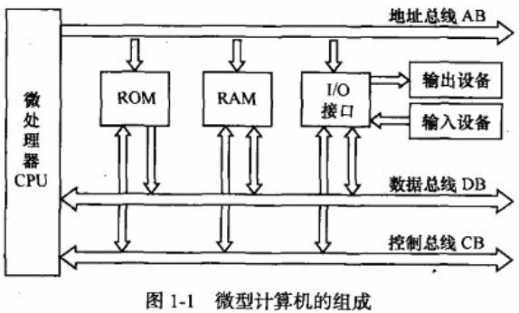
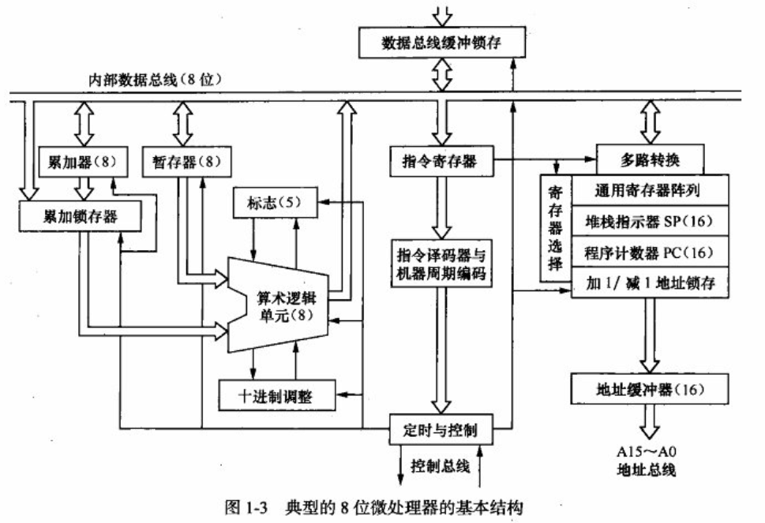
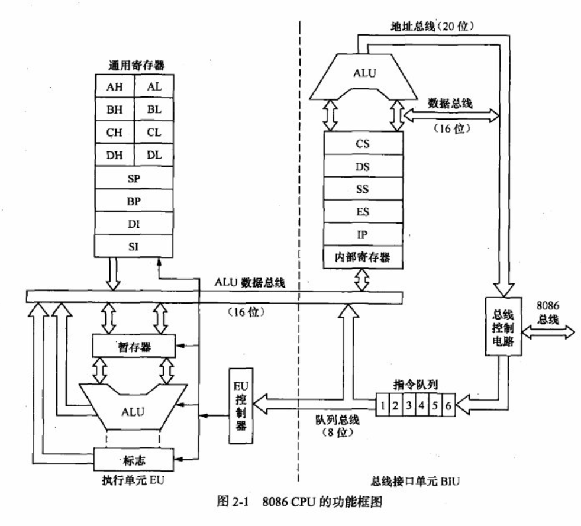
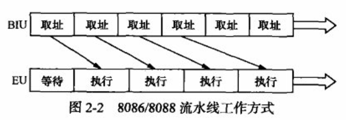
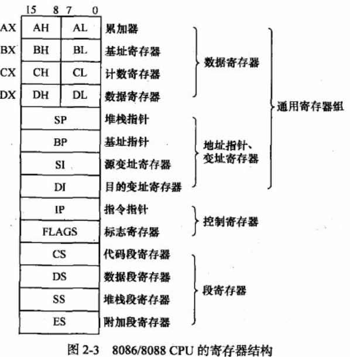
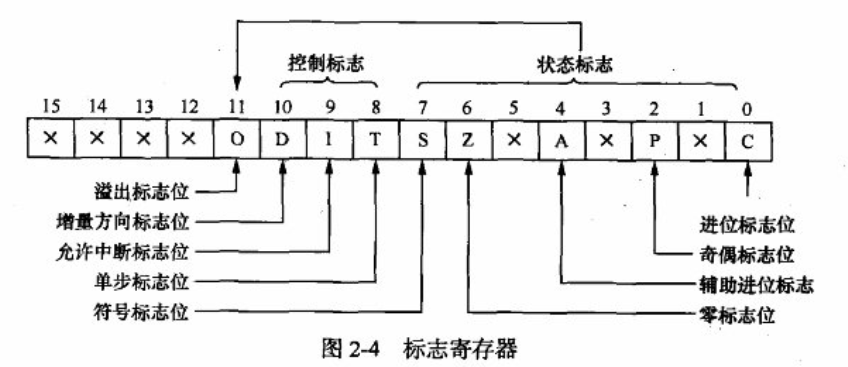

### 绪论

#### 1-1 微型计算机的组成原理

微型计算机系统包含**硬件**和**软件**两大部分。

- **软件**是为运行、管理和维护微机而编制的各类程序的总和，分为**系统软件**和**应用软件**：
  - 系统软件通常包括操作系统、语言处理程序、诊断调试程序、设备驱动程序，以及为提高微机效率设计的各类程序。
  - 应用软件是用于特定应用领域的专用软件，又分两类：
    - 为解决某一具体应用、按用户特定需要编制的应用程序；
    - 适合多种不同领域的通用性应用软件（如文字处理软件、绘图软件、财务管理软件等）。

##### 1-1-1 微型计算机的硬件组成



1. **存储器**

内存储器又称**主存储器**，是微型计算机的存储和记忆装置，用于存放**数据和程序**。

CPU对内存的操作有两种：

- **读操作**：CPU将内存单元的内容读入CPU内部；
- **写操作**：CPU将其内部信息传送到内存单元保存。

> [!NOTE] 内存分类
> 内存分为两类：
> 
> - **RAM（Random Access Memory，随机访问存储器）**：也叫"读写存储器"，用于**临时存放程序和数据**；特点是**电源掉电时信息会丢失**，属于**易失性存储器**。
> - **ROM（Read Only Memory，只读存储器）**：工作时**只能读、不能写**；特点是**电源掉电时信息不会丢失**，属于**非易失性存储器**。

存储器与系统的交互及程序运行逻辑

- 输入/输出设备通过“输入/输出接口”与系统总线相连，**外存（辅助存储器）也属于输入/输出设备**。
- 程序和数据都以**二进制形式**存放在存储器中。程序一般按“指令在存储器中的存放顺序”执行，遇到**转移指令**则转向“目标地址”执行。
- 开机流程：首先运行**ROM中的引导程序**，由引导程序将“外存中的操作系统”装入**RAM**中运行，之后由操作系统管理微型计算机的运行。

> [!NOTE] 存储器的"分级存储"设计
> 为同时满足**存储容量大**和**存取速度快**的需求，存储器采用**分级存储方式**：
> 
> - 用**速度较高的半导体存储器**作为**内存（主存储器）**；
> - 用**容量较大、存取速度相对较低**的磁表面存储器（如硬盘）或光盘存储器作为**外存（辅助存储器）**。

<span style="font-weight:bold; color:rgb(255, 182, 193)">主存储器</span>

主存储器（简称“主存”）用于存放计算机**当前执行的程序和需要使用的数据**，存取速度快，CPU可直接对其访问。
它主要由半导体器件组成，分为 **RAM（随机存取存储器）** 和 **ROM（只读存储器）** 两类。

主存储器的核心部件包括：<span style="background:rgba(163, 218, 252, 0.55)">存储体（存放信息的实体）、地址寄存器、选址部件、数据缓冲寄存器、读写控制电路等</span>。

> [!NOTE] 存储地址
> 存储体被划分为若干**存储单元**，每个单元存放一串二进制数（如一个字节、一个字）。
> 为区分不同存储单元，会按一定顺序（如"按字节"或"按字"）对单元编号，这些编号称为**存储地址**（简称"地址"）。
> 
> 存储器共有$N$个存储单元，地址编号为$0 \sim (N-1)$；每个地址单元中存放的数据称为"该地址单元的内容"，CPU可对每个地址对应的单元内容进行**读写操作**。

> [!NOTE] 存储容量的决定因素
> 存储器包含的**存储单元总数**称为**存储容量**，它由CPU的**地址总线根数**决定（地址总线的位数直接决定"可寻址的范围大小"）。
> 
> - 举例1：8086CPU有20条地址总线，能访问的内存容量为 \( 2^{20} = 1\text{MB} \)；
> - 举例2：PentiumⅡCPU有36条地址总线，能访问的内存容量为 \( 2^{36} = 64\text{GB} \)。
> 
> 简言之：地址总线的位数越多，CPU可访问的存储容量就越大。

<span style="font-weight:bold; color:rgb(255, 182, 193)">辅助存储器（外存）</span>

- **作用**：作为主存储器的“后备/补充”，特点是**存储容量大、成本低、可脱机保存信息**；用于存放“非当前运行的程序和数据”。
- **数据交换方式**：因存取周期比主存长，**不直接与CPU交换数据**，需先与主存“成批交换数据”，再由主存与CPU通信，因此属于**主机外部设备（简称“外存”）**。
- **常见类型**：微型计算机中常见的有软盘存储器、硬盘存储器、光盘存储器、闪存等。

<span style="font-weight:bold; color:rgb(255, 182, 193)">Cache（高速缓冲存储器）技术</span>

- **背景**：主存储器的读写速度会影响系统性能；随着CPU时钟频率提升，主存速度逐渐成为“系统性能提升的瓶颈”。
- **早期方案局限**：高速双极性RAM（存取时间十几/几十个纳秒）能与CPU速度匹配，但**体积大、价格昂贵**，难以普及。
- **Cache的作用与原理**：
  Cache是位于**CPU和主存储器之间**、**规模小但速度很高**的存储器，保存主存中“一部分内容的拷贝”。
  CPU读写数据时，**优先访问Cache**；只有Cache中没有所需数据时，才去访问主存，从而解决“CPU与主存的速度匹配问题”。
- 目前多数CPU产品已将Cache**集成在CPU内部**。

<span style="font-weight:bold; color:rgb(255, 182, 193)">虚拟存储器（虚存）技术</span>

- **需求背景**：程序占用存储容量增加，多用户/多任务操作系统出现后，主存容量往往无法满足程序的存储需求。
- **组成与效果**：由“价格较高、速度较快、容量较小的主存储器”和“价格低廉、速度较慢、容量巨大的辅助存储器”组成**多层次存储结构**；在系统软件和辅助硬件的管理下，这套结构“像一个单一的、可直接访问的大容量存储器”，以“透明方式”为用户程序提供**远大于主存容量的存储空间**。

> [!tip] 虚拟存储器的工作原理
> 虚拟存储器的工作原理基于**硬件（内存管理单元MMU）与操作系统的协作**，核心是通过"虚拟地址到物理地址的映射"和"页面调度"，让程序以为自己拥有远大于实际物理内存的地址空间。具体过程如下：  
> 
> **1. 虚拟地址与物理地址的分离**
> 
> 程序编译/运行时使用的是**虚拟地址**（逻辑地址），而非直接访问物理内存的物理地址。虚拟地址空间由操作系统为每个进程"虚拟"分配，可远大于实际物理内存容量（例如32位系统虚拟地址空间可达4GB）。  
> 
> **2. 地址转换：虚拟地址→物理地址**
> 
> CPU通过**内存管理单元（MMU）**将虚拟地址转换为物理地址，依赖操作系统维护的**页表（Page Table）**实现映射：  
> 
> - 页表记录"虚拟页（Virtual Page, VP）"与"物理页框（Physical Frame）"的对应关系。  
> - 虚拟地址被拆分为"虚拟页号（VPN）"和"页内偏移量（Offset）"：  
>   - **虚拟页号**用于检索页表，找到对应的物理页号（Physical Page Number, PPN）；  
>   - **页内偏移量**直接对应物理页内的位置（因虚拟页与物理页大小相同，偏移量无需转换）。  
> 
> **3. 缺页中断与页面加载**
> 
> 若程序访问的虚拟页**未加载到物理内存中**（即页表中该虚拟页的映射为"未缓存"），MMU会触发**缺页中断（Page Fault）**，操作系统介入处理：  
> 
> - 操作系统从硬盘（辅助存储器）中找到该虚拟页对应的"磁盘页"，将其加载到物理内存的空闲页框中；  
> - 更新页表，建立该虚拟页与物理页框的新映射；  
> - 重新执行被中断的指令，此时虚拟地址可成功转换为物理地址。  
> 
> **4. 页面调度（置换）：内存不足时的动态调整**
> 
> 若物理内存已满，操作系统会通过**页面置换算法**（如LRU、FIFO）选择"不常用的物理页"，将其**写回硬盘**（页面交换，Swapping），腾出空间加载新的虚拟页。  
> 
> **5. 透明性与多进程隔离**
> 
> 虚拟存储器对用户程序"透明"——程序无需感知物理内存的实际容量，只需按虚拟地址编程；同时，**不同进程的虚拟地址可映射到同一块物理地址**（如共享库），既节省内存又实现进程隔离（通过页表权限控制，如只读、可写）。 


2. **I/O接口和外部设备**

外部设备是微型计算机的输入/输出（I/O）设备，为微机提供具体的输入/输出手段：

   - 输入设备：如键盘、鼠标、扫描仪等；
   - 输出设备：如显示器、打印机、绘图仪等；
   - 双向设备（既输入又输出）：磁盘、光盘。

> [!NOTE] I/O 接口  
> 外部设备的工作速度、驱动方式与 CPU 相差甚远，无法直接连接到系统总线。因此需要 I/O 接口电路作为“桥梁”，负责完成：
> 
> - 信号变换（匹配 CPU 与外设的信号格式）
> - 数据缓冲（暂存数据，协调速度差异）
> - 与 CPU 联络（同步读写时机）

外设接口中，用于存放数据、状态、控制信息的8位寄存器称为**端口**。为了能定位到具体端口，需要对端口进行**编址**，编址方式有两种：

   - 与内存单元**统一编址**（端口视为特殊的内存单元）；
   - 与内存**独立编址**（端口有专门的地址空间）。（`Intel 80x86/Pentium`系列采用**独立编址**方式。）
   
3. 系统总线

微型计算机硬件（微处理器、内存、I/O接口、外部设备）通过**总线**连接，总线是各部件间传送信息的“公共导线”。

> [!NOTE] 总线的两种分类方式
> 
> - **按传送信号的性质**：分为 **数据总线（DB）**、**地址总线（AB）**、**控制总线（CB）**，分别传送数据、地址、控制信号。
> - **按连接对象**：分为 **系统总线**（连接微机内部部件，如微处理器、存储器、外设接口）、**局部总线**（连接 CPU 与外围支持芯片）、**外部总线**（连接微机与外部设备/其他计算机）。

单处理器微机的**系统总线**由地址总线、数据总线、控制总线组成，各自作用如下：

1. **地址总线（AB, Address Bus）**
   - 功能：传送CPU发出的**地址信息**，确定被访问的“存储单元”或“I/O端口”。
   - 特点：**单向传输**（地址仅从CPU送出）；**位数决定寻址范围**（如16位8086微机的地址总线为20位，最大内存容量为 \( 2^{20} \) 个存储单元）。

2. **数据总线（DB, Data Bus）**
   - 功能：在CPU与存储器、I/O接口之间**传送数据**。
   - 特点：**双向传输**（CPU可通过DB从内存/输入设备“读入”数据，也可向内存/输出设备“送出”数据）；**位数（宽度）是微机重要指标**，与微处理器位数对应（如16位微机的DB宽度为16位）。

3. **控制总线（CB, Control Bus）**
   - 功能：传输**控制信号**，包含两类：
     - CPU发往存储器、I/O接口的控制信号（如“读信号”“写信号”“中断响应信号”等）；
     - 其他部件发给CPU的信号（如“时钟信号”“中断请求信号”“准备就绪信号”等）。
   - 特点：每根控制线的**传送方向固定**（由信号的“发起者”和“接收者”决定）。

##### 1-1-2 （8位）微处理器的组成



1. **运算器**

运算器的核心作用是**对数据进行加工处理**，主要完成**算术运算**（如加、减、乘、除）和**逻辑运算**。
尽管不同计算机的运算器结构有差异，但最基础的结构都包含这些逻辑部件：

- **算术逻辑单元（ALU）**：是运算器的**核心部件**，不仅承担加、减、乘、除等**基本算术运算**，还具备**移位功能**，能执行“与”“或”“非”等**逻辑运算**，以及**求补操作**。
- 此外，还包括累加器、寄存器组、多路转换器、数据总线等。

由于运算过程会涉及各类数据，因此在微处理器中，**设置通用寄存器**或者**通过堆栈指针访问内存中的堆栈区**十分必要。它们的作用是：

- 传递、存放**参与运算的数据**、**运算结果**；
- 存放**进位标志、符号标志**等表示“运算特征”的标志。

寄存器的存在有两大优势：

- 减少访问存储器的次数，**提高运算速度**；
- 方便程序员存放各类数据，**为程序设计带来便利**。

2. **控制器**

控制器是计算机**关键部件**，依据**预先存放在存储器中的程序**对计算机进行整体控制。它一般由**指令寄存器**（暂存取出的指令）、**指令译码器**（分析指令含义）和**控制电路**组成；通过解析每条指令，向计算机各部件发控制信息，使部件协调工作，实现程序功能。

> [!NOTE] 指令、指令系统与程序的概念
> 
> 计算机的工作，本质是**执行程序中一条条指令的过程**：
> 
> - **指令**：由二进制代码构成，分**操作码**（规定“执行什么操作”，如加、减）和**操作数**（指明“参与运算的数或其地址”）两部分。
> - **指令系统**：一台计算机能执行的**全部指令的集合**，反映计算机基本功能；因计算机内部结构不同，指令系统也存在差异。
> - **程序**：完成某一任务的**一组指令的集合**。微型计算机基于**冯·诺依曼“程序存储”“程序控制”原理**设计——程序预先存入存储器，计算机通过执行程序完成任务。

控制器的工作过程（冯·诺依曼原理）：

微型计算机的工作过程是**周而复始地“取指令→分析指令→执行指令”**，控制器是这一过程的核心：

- 控制器从内存**取出指令**，并指明“下一条指令在内存的位置”；
- 取出的指令送入**指令寄存器**，再经**指令译码器**分析；
- 译码后，控制器发**控制/定时信息**，协调各部件有条不紊工作，完成指令规定的操作；
- 重复“取→分析→执行”的循环，使计算机持续运行。

尽管控制器的组成会因指令格式、控制方式、总线结构及机型不同存在差异，但一般包含以下关键部件：

> [!NOTE] 程序计数器（Program Counter，PC）
>
> 又称“指令地址寄存器”，核心作用是**指示程序执行的顺序**：
>
> - 取指令阶段：指示**当前要执行的指令在存储器中的地址**；
> - 指令执行完毕后：存放**下一条要执行的指令的地址**，保证程序“按序执行”。

> [!NOTE] 指令寄存器（Instruction Register，IR）
>
> 用于**保存计算机正在执行的指令代码**（这些代码从存储器读出后送入IR）。
>
> - 指令执行期间：IR的内容保持不变；
> - 指令执行完毕后：新的指令会从存储器读入IR，为下一条指令的执行做准备。

> [!NOTE] 指令译码器（Instruction Decoder，ID）
>
> 也叫“指令分析器”，功能是**分析指令并生成操作信号**：  
> 根据指令的内容（如操作码、操作数）和各类标志（如运算状态标志），分析出本条指令需要的**各类操作信号**，并将这些信号发送到各个执行部件（如运算器、存储器等），指挥部件执行对应操作。

> [!NOTE] 时序产生器及启停线路
>
> 微型计算机是**同步时序装置**（操作步骤严格按时序进行，不同指令执行时间不同），这部分负责“控制操作的时间节奏”：
>
> - **时序产生器**：产生执行各种基本操作（取指令、运算、存结果等）所需的**一系列控制信号**，保证计算机能正确完成规定任务。
> - **启停线路**：控制时序信号是否发出。它会综合“硬件状态、程序要求、人工操作需求”，在合适时机发出“启动/停止”时序信号的指令，协调计算机工作节奏。

> [!NOTE] 状态/条件寄存器
>
> 用于**保存指令执行后的“状态信息”**：
>
> - 保存“条件码”：如运算是否溢出、结果正负、有无进位等；
> - 保存其他状态：如中断状态（是否有中断请求）、系统工作状态（运行/待机等），为后续指令执行或系统控制提供依据。

> [!NOTE] 微操作信号发生器
>
> 作用是**综合多类信号，生成“指令执行的操作序列”**：  
> 将“指令自身的操作信号（做什么操作）”“时序产生器的时序信号（何时操作）”“控制功能部件反馈的状态信号（部件当前状态）”综合起来，生成特定的**操作序列**，从而完成“取指令→分析指令→执行指令”全过程的控制，确保指令被正确、有序执行。

**控制器的功能扩展**：

控制器除了前文提到的核心部件（程序计数器、指令寄存器、指令译码器等），通常还包含**中断控制、地址形成**等功能部件，用于完成**中断处理**（响应外部设备的请求）、**指令地址生成**等操作，进一步支撑计算机的复杂运行需求。

<span style="font-weight:bold; color:rgb(255, 182, 193)">微处理器执行一条指令的步骤</span>

微处理器执行一条指令需经历以下5个阶段，体现了“取指令→分析指令→执行指令→处理外部请求”的完整流程：

1. **地址准备与PC自增**
   程序计数器（PC）将当前要执行的**指令地址**送入地址总线；同时，PC自身内容加1，为“取下一指令的字节”或“下一条指令”提前做好地址准备，保证指令按序执行。

2. **读取指令码到指令寄存器**
   通过数据总线，从存储器中取出**指令码（操作码）**，并将其送入**指令寄存器（IR）**暂存，为后续译码做准备。

3. **指令译码与控制信号生成**
   指令译码器（ID）对指令的**操作码**进行“译码”（分析指令要执行的操作）；定时与控制部件根据译码结果，生成完成该指令所需的**各种控制信号**。若需要，还会继续从存储器取出“指令的后续字节”“操作数”，或检测“处理器状态标志”“其他部件的状态信号”（比如运算是否溢出、外部设备是否就绪等）。

4. **执行指令规定的操作**
   生成必要的**内部/外部控制信号**，指挥计算机各部件（如运算器、存储器、外部设备等）协作，完成指令规定的具体操作（如算术运算、数据传输等）。

5. **检查并处理外部设备请求**
   指令操作完成后，检查是否有**外部设备的请求信号**（如“中断信号”，即外部设备需要处理器立即处理的任务）；若有，则进行相应的处理（如进入中断服务程序）。

##### 1-1-3 微型计算机的工作流程

计算机只能直接识别**二进制机器语言**，但机器语言（纯0、1代码）“难书写、难记忆”。因此，人们通常先写**汇编语言源程序**（用“助记符”“十进制/十六进制数”等更易读的形式），再将其**翻译为机器语言源程序**，供计算机执行。

以Intel 80x86系列微处理器为例，实现“3+7”需执行以下4条指令，每条指令对应“汇编代码→机器指令→具体操作”：

| 汇编语言程序   | 对应的机器指令（二进制） | 对应的操作                                                                 |
|----------------|--------------------------|--------------------------------------------------------------------------|
| `MOV AL, 3`    | `10110000` <br> `00000011` | 把立即数`3`传送到**累加寄存器AL**中（给AL赋初始值）。|
| `ADD AL, 7`    | `00000100` <br> `00000111` | 计算AL中的数（`3`）与`7`的和，结果存回**AL**中（此时AL的值为`3+7=10`）。|
| `MOV [3008], AL` | `10100010` <br> `00001000` | 把AL中的结果（`10`）传送到**地址为0008H的内存单元**中（存储计算结果）。|
| `HLT`          | `11110100`               | 停机（结束程序执行）。|

整个程序由4条指令、8个字节组成，假设存放在8位模型机存储器的`0000H~0007H`单元。执行前，先将**第1条指令的存储地址`3000H`送入程序计数器（PC）**，PC作为“指令地址指针”，指引计算机从该地址开始执行程序。

- **取指周期**：
  - PC将`3000H`送到**地址总线（AB）**（指定要读取的存储器地址）；
  - PC自身值加1，变为`3001H`（为“取下一存储器单元内容”提前准备地址）；
  - 根据AB上的地址，从`3000H`单元读出**第1条指令的操作码**，经**数据总线（DB）**传送到**指令寄存器（IR）**（IR暂存当前要执行的指令）；
  - **指令译码器（ID）**对IR中的操作码“译码”（分析指令功能），得知这条指令要“将下一单元的内容送入累加器AL”，随后操作控制部件发出执行该指令的控制信号。

- **执行周期**：
  - PC将`3001H`送到AB；
  - PC自身值加1，变为`3002H`（为取下一条指令做准备）；
  - 根据AB上的地址，从`3001H`单元读出**第1条指令的操作数（原文中为`03H`，对应“MOV AL, 3”里的`3`）**，经DB传送到**累加器AL**中；
  - 至此，第1条指令（将`3`送入AL）执行完毕。

第1条指令执行完后，进入第2条指令的“取指周期”：

- PC将`3002H`送到AB；
- PC自身值加1，变为`3003H`（为取下一单元内容做准备）；
- 根据AB上的地址，从`3002H`单元读出**第2条指令的操作码（原文中为`04H`，对应“ADD AL, 7”的操作码）**，经DB传送到IR；
- ID对IR中的操作码译码，控制信号发生器发出执行该指令的控制信号；
- 后续会进入第2条指令的“执行周期”，读取操作数`07H`，完成“AL中的3与7相加”的操作

#### 1-2 微型计算机的发展

在微型计算机里，利用超大规模集成电路技术，把计算机中负责“运算”的运算器和负责“控制”的控制器，集成到**一个芯片**上，这个芯片就是中央处理器（CPU）。它能一边指挥计算机各部分协调工作，一边对数据做算术运算（如加、减）或逻辑运算（如“与”“或”）。因为它比过去的CPU体积小很多，所以被称为“微处理器”，习惯上也直接叫它CPU。

**微处理器（CPU）的发展阶段**

随着大规模集成电路技术进步，微处理器自1971年问世后，按**字长和功能**经历了从**4位CPU**→**8位CPU**→**16位CPU**→**32位CPU**→**64位CPU**的发展阶段。

按时间线梳理关键产品及突破：

- **1971年**：Intel推出采用**4040微处理器**的**MCS-4微型计算机**，字长4位，指令执行慢（平均20μs），功能简单（无暂停、中断，灵活性差）；后续又推出**8位微处理器8080**，并以此为核心制成**MCS-8微型计算机**，字长8位，指令系统和中央处理功能更完整。
- **1973～1977年**：
  - 初期：Intel的**MCS-80微型计算机**（基于8080），字长8位，指令执行时间缩短至2μs，支持8级中断、多种寻址方式，还可搭配高级语言。
  - 后期：以**6502微处理器**为核心的**APPLEⅡ微型计算机**，拥有超一万六千个应用程序和大量外围设备，在20世纪80年代初期风靡全球。
- **1978年**：Intel推出**8086微处理器**，采用HMOS工艺、+5V供电，芯片内有四万多只晶体管，初始时钟4.77MHz（最高10MHz）；内部/外部数据总线为16位，地址总线20位，可寻址1MB存储空间。1979年又推出**8088芯片**（成本更低，外部数据信号线减为8条，兼容已有8位硬件）。
- **1981～1982年**：Intel推出8086的改进型**80186**、**80286**。其中**80286**亮点突出：
  - 指令兼容：与8086、80186“向上兼容”，支持**实地址模式**和**保护虚地址模式**两种运行方式；
  - 硬件升级：内部含13.4万只晶体管，时钟频率从6MHz提升至20MHz；内部/外部数据总线16位，地址总线24位，可寻址16MB内存；
  - 功能突破：硬件设计支持**多用户、多任务处理**，支持虚拟存储器管理与硬件保护机制；指令系统新增大量指令，能支持更高级的操作系统，性能大幅提升。

#### 1-3 数据的表示方法

详见数电笔记

### Intel 微处理器的结构

#### 2-1 Intel 8086/8088 微处理器的结构

Intel 8086/8088 CPU是Intel系列微处理器的基础实例。后续80386、Pentium等处理器通过<span style="background:rgba(163, 218, 252, 0.55)">实模式</span>（可视为“高速8086 CPU”）、虚拟8086模式实现与它的完全兼容，且实模式是学习保护模式的前提。其汇编指令集为`Intel 80x86/Pentium`架构中最精简的，后期CPU为保持兼容，在其寄存器与指令基础上进行扩展，故8086/8088的汇编程序可在后期CPU实模式下编译通过。掌握以8086/8088为核心的微机原理、汇编语言及接口技术，是学习32位、64位处理器的基础。

> [!NOTE] 实模式（Real Mode）简介
>
> 实模式（Real Mode，又称实地址模式）是Intel x86架构CPU最初为8086/8088设计的操作模式，后被80286及更高级CPU保留以实现向下兼容。其主要特点如下：
>
> - **地址空间**：采用16位段地址（左移4位）与16位偏移地址组合，形成20位物理地址，可访问1MB内存（实际可用约640KB–924KB，部分空间被BIOS映射占用）。
> - **兼容性**：现代x86 CPU启动时默认进入实模式，能直接运行为8086编写的软件，实模式/虚拟8086模式也让后期CPU（如80386、Pentium）兼容早期程序。
> - **局限性**：无硬件级内存保护和多任务支持，地址空间仅1MB，难以满足现代系统对资源管理的需求，因此后续发展出保护模式。
>
> 实模式是学习x86架构（尤其是保护模式）的基础，也是CPU启动时的默认状态。

##### 2-1-1 8086/8088 CPU的功能结构


| 单位 | 与字节的关系 | 对应2的幂次 | 具体数值（字节） |
|------|--------------|-------------|------------------|
| KB（千字节） | 1KB = 1024B | 2¹⁰ | 1024 |
| MB（兆字节） | 1MB = 1024KB | 2²⁰ | 1024×1024 = 1048576 |



8086/8088 CPU配备**20条地址线**，寻址能力（最大可管理的存储容量）达**1MB**；数据总线分别为16条（8086）与8条（8088），但内部总线和ALU均为16位，支持8位、16位操作，因此<span style="background:rgba(163, 218, 252, 0.55)">8086属于16位微处理器，8088为准16位微处理器</span>。二者指令系统完全一致，且采用总线接口单元（BIU）与执行单元（EU）构成的双单元结构，与8位微处理器的架构形式不同。

8086与8088的执行单元（EU）完全一致，但总线接口单元（BIU）存在差异：8086数据总线为16位，指令队列长度为6字节；8088数据总线为8位，指令队列长度为4字节。

1. **BIU（总线接口单元）**

BIU由4个段寄存器（存储 “内存段” 的基地址（比如 “代码段”“数据段” 的起始位置），共 4 个：CS（代码段）、DS（数据段）、ES（附加段）、SS（堆栈段））、指令指针（IP）（存当前要读的指令位置）、指令队列寄存器（存 预读指令，是指令，不是位置，8086 是 6 字节，8088 是 4 字节）、内部通信寄存器、加法器及总线控制逻辑组成。<span style="font-weight:bold; color:rgb(255, 182, 193)">它通过“段寄存器存储的16位段地址左移4位，与IP或EU提供的16位偏移地址相加”生成20位物理地址</span>，以执行总线周期，完成CPU与存储器、I/O设备间的信息传送：取指令时从存储器指定地址取指令送入指令队列；执行指令时，根据EU命令对指定存储器单元或I/O端口进行数据存取。

| 术语                | 通俗理解（类比成公司部门工具）          | 核心作用                                                                 |
|---------------------|-----------------------------------------|--------------------------------------------------------------------------|
| BIU                 | 公司的“对外联络部”                      | 负责CPU与外部设备（内存、I/O接口）的所有数据/指令传输，是CPU的“外部通道” |
| 段寄存器（4个）     | 存“大区域地址的笔记本”（16位）          | 存储“内存段”的基地址（比如“代码段”“数据段”的起始位置），共4个：CS（代码段）、DS（数据段）、ES（附加段）、SS（堆栈段） |
| 指令指针（IP）      | 存“当前要读的指令位置的小纸条”（16位）  | 指向“代码段”中**下一条要执行的指令**的偏移位置（相对于段起始地址的距离） |
| 指令队列寄存器      | 存“预读指令的小仓库”（8086是6字节，8088是4字节） | 提前从内存读取后续指令存起来，让CPU执行指令时“不用等”，提高效率（类似“提前囤货”） |
| 内部通信寄存器      | “联络部与内部执行部（EU）的传话筒”      | 传递BIU和EU（执行单元，负责算数据、执行指令）之间的信息（比如EU要读的数据地址、BIU读回的数据） |
| 加法器              | “算最终地址的计算器”                    | 专门计算“20位物理地址”（因为段地址和偏移地址都是16位，要通过它相加得到20位地址） |
| 总线控制逻辑        | “控制对外通信规则的指挥官”              | 管理CPU的地址总线、数据总线、控制总线（比如什么时候发地址、什么时候传数据、什么时候读/写） |
| 16位/20位地址       | 给内存“编门牌号”的数字（16位=最多65536个门牌号，20位=1048576个门牌号） | 16位是CPU内部能直接处理的地址长度，20位是最终给内存的“实际门牌号”（物理地址） |
| 物理地址            | 内存“实际门牌号”（唯一）                | 内存中每个字节单元的唯一地址（比如00000H~FFFFFH），CPU必须用它才能找到具体内存单元 |
| 总线周期            | “一次完整的对外通信流程”（比如“读一个字节”或“写一个字节”） | BIU完成一次“地址发送→数据传输→确认”的完整步骤，是CPU与外部通信的“基本单位” |

> [!NOTE] 8086/8088 如何生成20位物理地址（段址+偏移的原理）
>
> 8086/8088 的内部寄存器（段寄存器、IP、偏移地址）都是 **16 位**，最多能表示 65536 个地址，但实际需要寻址 1MB 内存（20 位地址，1048576 个地址）。为此，BIU 采用“段地址 + 偏移地址”的方式拼出 20 位物理地址。可以这样类比理解：
>
> - **段地址**：相当于“小区编号”，对应内存中一个 64KB （1024/16 = 64）的大区域（16 位段地址左移 4 位后，每个段的范围是 64KB）。
> - **偏移地址**：相当于“小区内的楼号+门牌号”，表示相对于小区门口的距离，最大 64KB，刚好覆盖一个小区的所有房间。
> - **物理地址**：等于“小区的具体位置 + 小区内的门牌号”，唯一对应内存中的一个字节单元。

> [!NOTE] 20位物理地址的生成原理
>
> 8086/8088微处理器通过以下两步将16位段地址和16位偏移地址合成为20位物理地址（由硬件加法器完成）：
>
> 1. **段地址左移4位**  
>    段寄存器中的16位段地址（如 `1234H`）左移4位，相当于乘以16，得到20位的段基地址（如 `12340H`），即该段的起始物理地址。
>
> 2. **加上偏移地址**  
>    将16位偏移地址（如 `5678H`，由IP或EU提供）与段基地址相加，得到唯一的20位物理地址（如 `12340H + 5678H = 179B8H`），用于访问内存中的具体字节单元。

> [!NOTE] 8086/8088 BIU的两大核心任务：取指令与数据传输
>
> **1. 取指令（指令预取机制）**  
> BIU通过“CS段地址左移4位 + IP偏移地址”生成20位物理地址，向内存发出读命令，获取指令并存入指令队列（如8086可预取6字节）。每次取完指令后，IP自动递增，准备下一个指令地址。这样EU执行时可直接从队列取指令，无需等待，提高了执行效率。
>
> **2. 传数据（数据读写操作）**  
> EU需要访问内存或I/O设备的数据时，BIU根据指定的段寄存器和偏移地址生成物理地址，完成数据的读写：  
>
> - 读操作：BIU发出物理地址和读命令，将数据从内存/I/O设备读回，传递给EU。  
> - 写操作：EU提供数据和目标地址，BIU生成物理地址并发出写命令，将数据写入指定的内存/I/O单元。

2. **执行单元（EU）**

执行单元（EU）由算术逻辑单元（ALU）、暂存器、标志寄存器（PSW）、通用寄存器及EU控制器构成，承担<span style="background:rgba(163, 218, 252, 0.55)">指令执行、算术逻辑运算、偏移地址计算</span>的任务，向总线接口单元（BIU）提供指令执行结果的数据与偏移地址，并管理通用寄存器和标志寄存器。

| 术语（英文缩写）       | 通俗类比（车间里的对应角色） | 核心作用（用“干活”的语言说）                                                                 |
|------------------------|------------------------------|----------------------------------------------------------------------------------------------|
| 执行单元（EU）         | 整个“生产车间”               | 统筹所有“加工任务”，是CPU里“实际动手干活”的核心部门（BIU只负责“跑腿”，EU负责“做事”）         |
| 算术逻辑单元（ALU）    | 车间里的“主力机床”           | 负责最核心的“加工动作”：<br>1. 算术运算：比如算“1+2”“5-3”（加减乘除这些数字计算）；<br>2. 逻辑运算：比如判断“a是不是等于b”“x是不是比y大”（对错、大小的判断） |
| 暂存器                 | 机床旁边的“临时小货架”       | 存放“马上要加工的材料”（比如ALU要算“3+5”，就先把3和5临时放在暂存器里，算完就清空，不长期存） |
| 标志寄存器（PSW）      | 车间里的“质检报告表”         | 记录“加工后的结果状态”（不是存结果本身，而是存结果的“属性”），比如：<br>- 算“100+200”后有没有“进位”（比如个位加完超10进1）；<br>- 算“5-8”后结果是不是“负数”；<br>- 运算结果是不是“0”（比如“3-3”）；<br>这些状态会影响后续指令（比如“如果结果是负数，就执行A操作”） |
| 通用寄存器             | 车间里的“常用储物柜”         | 长期存放“经常要用的材料或半成品”（比暂存器“常用且存放时间久”），比如：<br>- 反复用到的数字（比如循环计数“从1到100”的计数器）；<br>- 要计算的偏移地址（后面会讲）；<br>x86里的通用寄存器有AX、BX、CX、DX等，就像不同的储物柜，各有常用场景（比如AX常用作“累加器”，算完的结果先放这） |
| EU控制器               | 车间里的“主任”               | 指挥EU里所有部件“按顺序干活”：比如先让暂存器拿数据，再让ALU运算，最后让标志寄存器记录状态，确保指令执行不乱序 |

> [!NOTE] EU（执行单元）的三大核心任务
>
> **1. 指令执行：按“订单”完成任务**  
> EU的首要职责是“执行指令”，即根据CPU收到的“工作订单”（如“ADD AX, BX”），依次完成各项操作：读取指令、调度寄存器数据、调用ALU进行运算、保存结果，并更新标志寄存器以反映运算状态（如进位、零、符号等）。
>
> **2. 算术与逻辑运算：ALU的具体加工**  
> 指令执行的核心环节是算术和逻辑运算。ALU（算术逻辑单元）负责完成加减乘除等算术运算，以及比较、判断等逻辑运算。运算所需的数据通常来自通用寄存器或由BIU从内存取回，结果可写回寄存器或交由BIU写入内存。
>
> **3. 偏移地址计算：定位数据的“具体位置”**  
> EU还负责计算偏移地址，协助BIU生成完整的物理地址。例如，访问数组元素时，EU根据基址和索引计算出偏移量，将其与段地址组合，最终由BIU访问内存中的目标数据。

EU通过16位ALU总线实现内部通信，通过8位队列总线与BIU进行数据交互。指令执行时，EU从BIU的指令队列中取出预读的指令代码执行；若指令队列为空，EU进入等待状态，队列存在指令则立即执行。执行过程中若需访问存储器或I/O接口，EU会发出命令使BIU进入对应总线周期；若BIU正处于取指令总线周期，需待其完成后再处理EU的命令。

8086的指令队列出现2个空闲字节（8088为1个），且执行单元（EU）无访问存储器或I/O端口的总线周期请求时，总线接口单元（BIU）会自动执行总线周期以填充指令队列；

- 指令队列是“提前囤货”的，避免车间要订单时“等米下锅”；  
- 8086队列容量6字节（空2个就补货），8088容量4字节（空1个就补货）（8086/8088 的指令长度「不固定」，范围 1~6 字节）——这是硬件设计的差异，本质都是“保持队列有足够订单”；  
- “EU无总线请求”是前提：如果车间正喊快递员送材料，<span style="background:rgba(163, 218, 252, 0.55)">快递员得先满足车间需求</span>，没空去囤指令。

若队列已满且无相关命令，BIU进入空闲状态（BIU不做“无用功”——指令囤够了、车间也没需求，就不浪费时间跑仓库，避免资源浪费）。

执行转移、子程序调用或返回指令时，指令队列内容会被清除。

- 转移/调用/返回指令的特点是“打破原有的指令顺序”（比如本来按1→2→3→4执行，转移后直接跳去执行10）；  
- 之前囤的3、4号指令没用了，留着会导致车间做错活，所以必须清空队列，BIU再按新的地址去拿指令。



BIU通过检测内部寄存器判断EU的存取需求，使<span style="background:rgba(163, 218, 252, 0.55)">EU取指、执行指令与BIU补充指令队列的操作可并行进行（流水线工作方式）</span>，进而提升CPU利用率，降低系统对存储器速度的要求。

- 没有流水线时：BIU拿1条指令→EU执行1条→BIU再拿1条→EU再执行（串行，浪费时间）；  
- 有流水线时：EU执行第1条指令的同时，BIU已经拿好第2、3条指令存在队列里（并行，时间不浪费）；  
- 比如8086的队列能存6字节，EU执行1字节指令时，BIU能同时补2字节，始终保持队列有货，CPU很少“停工”。

##### 2-1-2 8086/8088 CPU 的寄存器结构

8086/8088 CPU内部包含14个16位工作寄存器，为运算、指令执行控制及指令/操作数寻址提供支持，这些寄存器分为通用寄存器组、控制寄存器、段寄存器三类。



- **通用寄存器组**：包含数据寄存器（`AX、BX、CX、DX`，可拆分为高低8位独立操作），以及地址指针、变址寄存器（堆栈指针`SP`、基址指针`BP`、源变址寄存器`SI`、目的变址寄存器`DI`）。
- **控制寄存器**：由指令指针`IP`（指向待执行指令地址）和标志寄存器`FLAGS`（记录指令执行状态与控制标志）组成。
- **段寄存器**：含代码段寄存器`CS`、数据段寄存器`DS`、堆栈段寄存器`SS`、附加段寄存器`ES`，用于管理内存分段的段地址。

###### 通用寄存器组

1. **数据寄存器**

数据寄存器包含`AX、BX、CX、DX`，主要用于暂存算术或逻辑运算的操作数、中间结果。它们既可以作为16位寄存器整体使用，也<span style="background:rgba(163, 218, 252, 0.55)">可拆分为高、低8位独立操作</span>（低字节寄存器为`AL、BL、CL、DL`，高字节寄存器为`AH、BH、CH、DH`），既便于处理字节和字数据，又保障了与8080/8085的兼容性。

数据寄存器可存放源操作数、目标操作数及运算结果，通用性良好，但在部分指令中存在专门用法：如CX在字符串操作、循环指令中用作<span style="background:rgba(163, 218, 252, 0.55)">计数器</span>；BX常作为存储器操作数的基地址寄存器。基于这些专门用法，AX、BX、CX、DX也常被分别称为**累加器**、**基址寄存器**、**计数寄存器**、**数据寄存器**。

2. **地址指针和变址寄存器**

地址指针和变址寄存器（`SP、BP、SI、DI`）主要用于存储器操作数寻址时，提供20位物理地址的段内偏移地址部分（需结合段寄存器中的段地址），也可存放数据。

- **SP（堆栈指针）**：存储堆栈操作（压入、弹出）的段内偏移地址，段地址由SS提供。
- **BP（基址指针）**：在部分间接寻址方式中存储段内偏移地址的部分，默认段地址由SS提供（用于堆栈区寻址）。
- **SI（源变址寄存器）、DI（目的变址寄存器）**：在部分间接寻址方式中存储段内偏移地址的全部或部分；字符串操作指令中，SI作源变址、DI作目的变址。

| 寄存器名称 | 特定用法                                                                 |
|------------|--------------------------------------------------------------------------|
| AX、AL     | 乘法及除法指令中作为累加器；I/O指令中作为数据寄存器                       |
| AH         | LAHF指令(将标志寄存器（FLAGS）中的低 8 位（包括符号标志 SF、零标志 ZF、辅助进位标志 AF、奇偶标志 PF 和进位标志 CF）传送到 AH 寄存器中 )中作为目的寄存器                                                 |
| AL         | BCD码与ASCII码运算指令中作为累加器；XLAT指令中作为累加器                 |
| BX         | 间接寻址中作为基址或地址寄存器；XLAT指令中作为基址寄存器                 |
| CX         | 循环指令和字符串指令中作为循环次数计数寄存器，每做一次循环，CX内容自动减1 |
| CL         | 移位及循环移位指令中作为移位位数及循环移位次数的寄存器                   |
| DX         | I/O指令间接寻址时作为地址寄存器；乘、除法指令中作为辅助累加器（但乘积或被除数为32位时存放高16位） |
| BP         | 间接寻址中作为基址寄存器                                                 |
| SP         | 堆栈操作中作为堆栈指针                                                   |
| SI         | 字符串指令中作为源变址寄存器；间接寻址中作为地址寄存器                   |
| DI         | 字符串指令中作为目的变址寄存器；间接寻址中作为地址寄存器                 |

###### 控制寄存器组

1. **指令指针**

指令指针（IP）功能类似8位机的<span style="background:rgba(163, 218, 252, 0.55)">程序计数器（PC）</span>，用于保存下一条待取出指令的偏移地址。用户程序无法直接操作该寄存器，不过调试程序（如DEBUG）可通过命令修改其值，以此改变程序执行地址来辅助调试；转移指令、过程调用与返回指令会改变IP的内容。

2. **标志寄存器**



8086/8088 CPU的标志寄存器为2字节，包含9个标志，分为**状态标志位**（反映ALU操作结果）和**控制标志位**（控制CPU操作特征）。

> [!tip] 8086/8088 标志寄存器位宽设计说明
>
> 8086/8088 属于 16 位架构，其内部所有寄存器（包括通用寄存器、段寄存器、标志寄存器等）均为 16 位（2 字节），以保证 CPU 架构的一致性和兼容性（如寄存器操作、总线宽度统一）。标志寄存器实际只用到 9 个标志位，<span style="background:rgba(163, 218, 252, 0.55)">其余为保留位或扩展位</span>（如第 15、13、12 位等未用）。虽然仅存储 9 个标志位 1 字节已足够，但采用 16 位宽度是整体架构设计的需要，而非单纯由标志数量决定。

#### 关键状态标志位

- **符号标志S**：根据运算结果最高位（字节(byte)操作看 $D_7$，字(word)操作看 $D_{15}$）判定。$S=1$ 表示结果为负（补码最高位为1），$S=0$ 表示结果为正。

> [!tip] 解释
>
> 在计算机中，带符号数采用“补码”形式表示，数值的最高位作为符号位（1 表示负数，0 表示正数）。符号标志 S（Sign Flag）专门用于反映运算结果的最高位状态，即判断结果是正数还是负数。S=1 说明结果为负，S=0 说明结果为正。

- **进位标志（Carry Flag, C）**：用于反映<span style="background:rgba(163, 218, 252, 0.55)">无符号整数运算</span>中是否发生了“<span style="background:rgba(163, 218, 252, 0.55)">超出当前数据宽度</span>”的情况：字节操作看 $D_7$ 位、字操作看 $D_{15}$ 位，产生进位（加法）或借位（减法）时 $C=1$，否则 $C=0$；对无符号数，$C=1$ 表示结果超出字节（$0\sim255$）或字（$0\sim65535$）的表示范围。

> [!note] 进位标志（Carry Flag, C）的判定与硬件实现
>
> **加法进位**  
> - 当两个无符号数相加时，如果结果超出操作数位宽（如8位加法结果为9位），则C=1，否则C=0。  
> - 例如：  
>
>   ```
>     11111111   (255)
>   + 00000001   (1)
>   -------------
>    100000000   (256) → 9位结果，C=1
>   ```
> - 硬件上，进位标志直接取自加法器最高位的进位输出。
>
> **减法借位**  
> - 减法通常通过“加补码”实现。若A≥B，则C=0；若A<B（发生借位），则C=1。
>
> **移位操作中的进位**  
> - 例如：  
>   ```asm
>   初始：10110100
>   执行 SHL AL, 1
>   结果：01101000，C=1（原最高位1被移出）
>   ```
> - 移位操作时，C等于最后被移出的位。
>
> **硬件实现**  
> - 进位标志由ALU直接生成：加法时为最高位进位输出，减法时为加补码模式下的进位输出，移位时为被移出的位。

- **溢出标志（Overflow Flag, O）**：溢出标志O用于指示<span style="background:rgba(163, 218, 252, 0.55)">带符号数运算结果</span>是否超出数据类型可表示的范围。在字节运算中，若结果超出(-128 ~ +127)范围；在字运算中，若超出(-32768 ~ +32767)范围，则O置1，否则为0。

| 类型       | 数据类型 | 标志位 | 描述                     |
| ---------- | -------- | ------ | ------------------------ |
| 无符号溢出 | unsigned | C      | 超出 0 ~ MAX 范围        |
| 有符号溢出 | signed   | O/V    | 超出负值~正值表示范围 |

> [!note] 进位（Carry）与溢出（Overflow）的区别与联系
>
> 在计算机进行带符号数运算时，**进位（Carry）** 和 **溢出（Overflow）** 是两个不同的标志，分别反映不同的计算状态，不能混淆或替代。
>
> **基本定义：**
>
> - **进位（Carry）**：看计算时 “最高位有没有往外面丢数字”（不管正负，只看二进制是否超了 8 位的 “物理上限”）；
> - **溢出（Overflow, O）**：用于带符号数运算，表示结果超出该类型可表示的有符号数范围（如8位为 -128 ~ +127），由最高位和次高位的进位情况决定。
>
> **两者无必然联系：**
>
> - 有进位但无溢出：如 `-1（11111111） + (-1)（11111111） = -2（11111110）`，进位产生但结果未超出带符号范围。
> - 无进位但有溢出：如 `+64（01000000） + +65（01000001） = 实际为+129，却显示 -127（10000001）`，未进位但结果超出带符号范围。
> - 既有进位又有溢出：如 `+127（01111111） + +1（00000001） = 实际为+128，却显示 -128（10000000）`，正数相加溢出为负。
> - 既无进位也无溢出：如`+50（00110010） + +30（00011110） = +80（01010000）` ，结果在范围内。
>
> **溢出的判断方法：**
>
> - 当符号位与次高位之间的进位不一致时发生溢出，即 `O = C7 XOR C8`（以8位为例）。
>
> **总结：**
>
> | 情况             | Carry | Overflow | 说明                                 |
> |------------------|-------|----------|--------------------------------------|
> | 有进位，无溢出   | 1     | 0        | 无符号溢出，带符号未越界             |
> | 无进位，有溢出   | 0     | 1        | 带符号越界，无外部进位               |
> | 有进位，有溢出   | 1     | 1        | 正负方向均越界                       |
> | 无进位，无溢出   | 0     | 0        | 正常运算                             |
>
> **应用建议：**
>
> - 带符号数运算关注溢出标志O，无符号数运算关注进位标志C。
> - 汇编或底层编程时需区分两者，高级语言通常自动处理溢出，但底层开发需手动检查。
>
> **核心要点：**  
> 进位反映无符号运算的范围，溢出反映带符号运算的范围，二者机制不同，不可混用。

- **辅助进位标志 A（Auxiliary Carry Flag）**：用于BCD码（二进制编码十进制）运算的辅助判断。当执行加减法时，若最低半字节（D₃位）向高半字节（D₄位）产生进位或借位，则A=1，否则A=0。该标志主要用于调整BCD运算结果，如DA（Decimal Adjust）指令中。

- **零标志 Z（Zero Flag）**：反映指令执行结果是否为0。若结果全为0，则Z=1；否则Z=0。常用于条件转移指令（如JZ/JNZ），实现程序流程控制。

- **奇偶标志 P（Parity Flag）** ；表示结果中“1”的个数奇偶性。在字节操作中，若低8位（D₇～D₀）中“1”的个数为偶数，则P=1；否则P=0。高字节部分不影响该标志。主要用于<span style="background:rgba(163, 218, 252, 0.55)">数据传输中的奇偶校验</span>，检测传输错误。

> [!note] 状态标志位协同分析与实际应用举例
>
> 在算术运算后，多个状态标志位共同反映结果的不同属性。以 `ADD BL, 38H`（初始 `BL = 63H`）为例：
>
> - 运算：`63H + 38H = 9BH`（10011011B，十进制+155，超出有符号字节范围）
> - 标志位变化：
>   - **S=1**（最高位为1，结果为负数）
>   - **C=0**（无进位，未超无符号范围）
>   - **A=0**（低半字节无进位）
>   - **O=1**（两个正数相加得负数，发生有符号溢出）
>   - **Z=0**（结果非零）
>   - **P=0**（结果中“1”个数为奇数）
>
> 结论：标志位需综合分析，尤其溢出（O）、符号（S）、进位（C）等，能准确判断有符号/无符号溢出、结果正负等，是底层程序设计和错误检测的重要依据。

> [!note] `SUB` 指令对状态标志位的影响详解
>
> 以 `SUB BX, 0C69FH`（初始 `BX = 0A35H`）为例，结果为 `0100001110010110B`（+17302），各标志位变化如下：
>
> - **符号标志 S=0**：结果最高位为 0，表示正数。
> - **进位标志 C=1**：被减数小于减数，发生借位，C=1（无符号下表示结果小于 0）。
> - **辅助进位标志 A=1**：低 4 位向高 4 位借位，A=1，便于 BCD 运算调整。
> - **溢出标志 O=0**：结果未超出有符号 16 位范围，无溢出。
> - **零标志 Z=0**：结果非零。
> - **奇偶标志 P=1**：低字节中“1”的个数为偶数，P=1。
>
> **说明**：减法中，进位标志 C 表示借位（与加法时进位语义一致），溢出标志 O 仍基于符号位与次高位进位关系。标志位的解读需结合数据的有/无符号语义。

