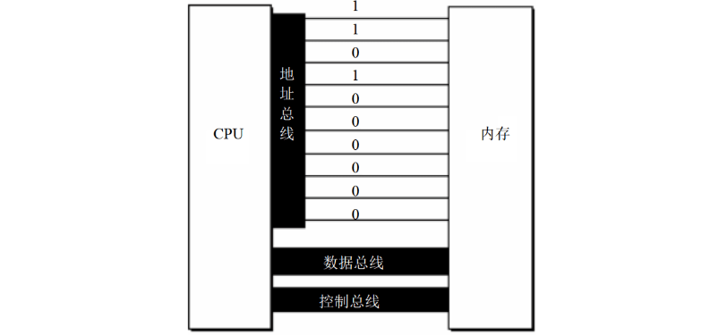

### 第一章 基础知识

汇编课程不全面深入研究硬件系统，PC 机及 CPU 物理、编程结构的全面研究在《微机原理与接口》，计算机一般结构等研究在《组成原理》，汇编课程重点是利用**硬件编程结构**和**指令集**控制系统工作。

#### 1-1 机器语言

> [!note] 机器语言
> 
> 机器指令集合，机器指令是计算机能执行的命令，以二进制数字呈现，计算机将其转为高低电平驱动电子器件运算 。

早期计算机指执行机器指令运算的机器，现在常用 PC 机里，由 CPU（中央处理单元，微处理器）等组成计算机系统，CPU 承担关键运算控制功能 。

不同微处理器因硬件和内部结构不同，需不同电平脉冲控制，所以各有**专属机器指令集**（即机器语言） 。

以 8086CPU 完成运算 `s = 768 + 12288 - 1280` 为例：

```binary
101110000000000000000011
000001010000000000110000
001011010000000000000101
```
#### 1-2 汇编语言的产生

汇编指令是机器指令的“便于记忆版”，本质是对机器指令做了**符号化封装**。比如机器指令`1000100111011000`（操作：BX寄存器内容送AX寄存器 ），对应汇编指令`mov ax,bx` ，用贴近人类语言的助记符，降低阅读和记忆成本。
> [!note] 寄存器
> 寄存器是CPU里存数据的器件，像`AX`、`BX`是不同寄存器的代号，为理解汇编指令操作对象做铺垫。

**汇编程序的执行流程**：汇编指令写的源程序，计算机无法直接执行（计算机只认机器指令 ），需要**汇编编译器**把汇编指令翻译成机器指令（机器码 ），计算机最终执行翻译后的机器码，明确了汇编语言编程的“编写 - 编译 - 执行”链路。

#### 1-3 汇编语言的组成

- **汇编指令**：最核心的部分，是机器码的“简化代号”（助记符）。比如`mov ax,bx` ，背后对应特定二进制机器码，CPU能直接执行，是汇编语言和硬件交互的直接桥梁 。  
- **伪指令**：“辅助性指令”，没有对应的机器码，作用是给编译器看的。像定义数据、分配内存的指令（比如`DB`定义字节数据 ），编译器根据伪指令做编译时的处理（如分配存储空间 ），但CPU不会执行伪指令本身 。  
- **其他符号**：像`+、-、*、/`这些运算符号，同样没有机器码，是让代码更易读的“语法糖”，编译器负责识别解析，转成对应的汇编指令或操作 。  


这两段内容围绕 **“存储器的作用”** 和 **“指令与数据的本质”** 展开，核心是解释计算机如何处理“指令”和“数据”，以及内存的关键地位，以下分两部分解析：

#### 1-4 存储器

**内存的核心地位**：  
   CPU是计算机核心，但必须依赖 **“指令”（做什么）** 和 **“数据”（操作对象）** 才能工作，而这两者存放在 **内存** 中。内存对PC的重要性仅次于CPU，没有内存，再强的CPU也无法运行（类比大脑没记忆就无法思考）。  

**内存与磁盘的关系**：  
   磁盘里的程序/数据，必须先**加载到内存**，才能被CPU使用（CPU不能直接访问磁盘，只能直接读写内存）。  

汇编语言编程需要理解 **CPU如何从内存“读”信息（取指令、读数据），以及向内存“写”信息（存结果）**，这是后续学习的基础。  

#### 1-5 指令和数据
  
在内存或磁盘中，**指令和数据都是二进制串**（物理上无区别）。它们的区别来自 **CPU的“解读方式”**：CPU把某些二进制串当作“指令”（指挥操作），另一些当作“数据”（操作对象）。  

**例如**：  
   二进制串 `1000100111011000`：  

   - **作为数据**：转成十六进制是 `89D8H`（CPU当作“数值”处理）；  
   - **作为指令**：对应汇编指令 `mov ax, bx`（CPU当作“命令”，执行“把bx寄存器的值放到ax寄存器”）。  

这部分内容围绕 **“存储单元的结构、容量及计量方式”** 展开，核心是建立 **“地址→单元→容量”** 的底层认知，以下分点解析：  

#### 1-6 存储单元

**划分与编号**：  
  存储器被切割成 **多个独立的“存储单元”**，每个单元从 **0开始顺序编号**（类似“房间号”）。例如128个单元，编号是 `0~127`。这个编号就是 **内存地址**，CPU通过“地址”定位到具体单元，实现数据读写。    

##### 存储容量：从bit到Byte 

- **最小单位：bit（比特）**：  
  计算机最基础的信息单位，1个bit只存 **1个二进制位**（0或1），类比灯泡的“亮/灭”。  

- **基本单位：Byte（字节）**：  
  1个Byte = **8个bit**（8位二进制）。微型机中，**每个存储单元固定存储1个Byte**（即8个bit）。  
  → 举例：128个存储单元 → 总容量 = 128 × 1Byte = 128字节。  

**容量的计量：二进制进位**  

当存储器容量很大时，用“字节”描述太繁琐，因此定义更大单位，遵循 **“1024倍递增”**（计算机的二进制逻辑，而非生活中的1000倍）：  

- **1KB**（千字节）= 1024B  
- **1MB**（兆字节）= 1024KB  
- **1GB**（吉字节）= 1024MB  
- **1TB**（太字节）= 1024GB  

→ 本质：每级单位都是前一级的 **2¹⁰倍**（因为1024=2¹⁰），体现二进制系统的特性。  

无论是 **内存**（如DDR4）还是 **磁盘**（如硬盘、SSD），容量都用上述单位计量（比如“512GB固态硬盘”“16GB内存”）。  

#### 1-7 CPU 对存储器的读写  

**核心逻辑**：

CPU 与存储器（内存）交互时，需通过 **“三类信息” + “三类总线”** 完成数据读写，本质是 **“定位→发令→传数据”** 的协作过程。  

##### **一、CPU 读写内存的 3 类核心信息**  

| **信息类型** | **作用**                                                                 | **类比**               |  
|--------------|--------------------------------------------------------------------------|--------------------------------------|  
| **地址信息** | 指定要访问的存储单元编号（如“3号单元”），明确“操作对象在哪里”。         | 告诉邮局：“我要 **3号邮箱** 的信”。 |  
| **控制信息** | 1. 定义操作类型（读/写）；<br>2. 选中存储器（区分硬盘、显卡等其他器件）。 | 告诉邮局：“是 **取信（读）** ，不是寄信（写）；操作对象是 **邮局（存储器）** ”。 |  
| **数据信息** | 读：从内存获取的数据；<br>写：要存入内存的数据。                         | 邮局递给你的 **信（读）** ，或你要寄的 **信（写）** 。 |  

##### **二、信息传输的通道：3 类总线**  

总线是 CPU 与芯片连接的导线集合，**从逻辑上分工传输不同信息**：  

| **总线类型** | **传输内容**       | **传输方向**          | **类比**                     |  
|--------------|--------------------|-----------------------|------------------------------------------|  
| **地址总线** | 地址信息（如“3号”） | **单向（CPU→内存）**  | 你喊“3号邮箱”（只有 CPU 告诉内存地址，内存不会反向传地址）。 |  
| **控制总线** | 控制命令（如“读”） | 单向/双向（依命令）   | 你说“取信”（CPU 发命令；内存也可反馈状态，基础阶段简化为 CPU 发令）。 |  
| **数据总线** | 数据信息（如`08`）  | **双向**（读：内存→CPU；写：CPU→内存） | 邮局把信递给你（读），或你把信放进邮箱（写）。         |  

**示例：CPU 读取“3号存储单元”的过程**  


1. **地址总线发定位**：  
   CPU 通过 **地址总线**，发送“3号单元”的地址，告诉内存“要访问这里”。  

2. **控制总线发命令**：  
   CPU 通过 **控制总线**，发送 **“内存读命令”**，同时选中“存储器”（排除硬盘、显卡等其他器件）。  

3. **数据总线传数据**：  
   内存找到3号单元（假设存储数据为`08`），通过 **数据总线** 将`08`传回 CPU。  
 
读/写操作的核心差异：**控制命令方向 + 数据流向**  

| **操作类型** | 步骤 1（地址总线）       | 步骤 2（控制总线）               | 步骤 3（数据总线）               |  
|--------------|--------------------------|----------------------------------|----------------------------------|  
| **读操作**   | 发地址（如“3号单元”）    | 发 **读命令**（选内存，读数据）  | 接收数据（内存→CPU，如“8”）      |  
| **写操作**   | 发地址（如“3号单元”）    | 发 **写命令**（选内存，写数据）  | 发送数据（CPU→内存，如“26”）     |  

**实例：8086CPU 从3号单元读数据到AX寄存器** 

- **机器码（二进制）**：`1010000100000001100000000`  
  → **缺点**：纯二进制，人类难记忆、难编写；  
  → **优点**：CPU可直接执行，无需翻译。  

- **汇编指令**：`MOV AX, [3]`  
  → **含义**：*把3号存储单元的内容，传送到AX寄存器*；  
  → **作用**：是机器码的 **“人类友好版”**，简化记忆和编程（编译器会将其转为机器码）。  

#### 1-8 地址总线  



> [!tip] 核心逻辑
> 
> **地址总线的宽度（根数）决定 CPU 能寻址的存储单元数量**，本质是 **二进制位数与可表示状态数的关系**。

**示例：寻址能力推导（以10根地址线为例）**：  

1. 单根地址线的特性  

物理上，一根地址线只有 **2种稳定状态**：高电平（代表二进制`1`）、低电平（代表二进制`0`）。  

2. N根地址线 → N位二进制数  

10根地址线同时工作时，可传输 **10位二进制数**（每根线对应1位，共10位）。  

3. 10位二进制数的寻址范围  

- **最小值**：`0000000000`（十进制 `0`）  
- **最大值**：`1111111111`（十进制 `2¹⁰−1 = 1023`）  
- **总数量**：从`0`到`1023`，共 **`2¹⁰ = 1024` 个不同地址**（即1024个存储单元）。  
> [!note] 通用公式
>
> 若 CPU 的地址总线宽度为 **N 根**（即支持传输 N 位二进制数），则：
>
> - **可寻址的存储单元数量** = $\boldsymbol{2^N}$ 个（地址范围：`0` ~ `2^N − 1`）。     

**地址总线越宽（N 越大），CPU 能访问的内存空间越大**（如 32 根地址线支持 4GB 寻址，64 根支持更大空间）。

#### 1-9 数据总线  

> [!tip] 核心逻辑
>
> **数据总线的宽度决定 CPU 单次能传输的数据量**，直接影响数据交互的效率。 

**数据总线的功能与特性**：  

| **方面**       | **说明**                                                                 |  
|----------------|--------------------------------------------------------------------------|  
| **作用**       | 是 CPU 与 **内存、外设** 之间 **双向传输数据** 的通道（读：内存→CPU；写：CPU→内存）。 |  
| **宽度定义**   | 数据总线包含的**导线数量**（如 8 根、16 根），对应单次传输的**二进制位数**。         |  
| **速度影响**   | 宽度越大，单次传输数据越多，交互速度越快（类比：“宽车道比窄车道运货更快”）。        |  

**传输能力**： 

| 数据总线宽度 | 单次传输位数 | 对应数据大小       | 示例场景               |  
|--------------|--------------|--------------------|------------------------|  
| 8 根         | 8 位（1 字节） | 如 `D8H`（单字节）  | 8088CPU 的数据总线     |  
| 16 根        | 16 位（2 字节）| 如 `89D8H`（双字节）| 8086CPU 的数据总线     |  

**示例：8088 vs 8086 传输 `89D8H` 的差异**  

1. 数据分解  

`89D8H` 是 **16 位十六进制数**，拆分为 **两个字节**：  

- 高 8 位：`89H`（二进制 `10001001`）；  
- 低 8 位：`D8H`（二进制 `11011000`）。  

2. 8088CPU（8 位数据总线）  

- 单次最多传 **8 位（1 字节）**，因此需 **分 2 次传输**：  
  ① 第一次传 **低 8 位 `D8H`**；  
  ② 第二次传 **高 8 位 `89H`**。  

3. 8086CPU（16 位数据总线）  

- 单次可传 **16 位（2 字节）**，因此 **1 次传输** 完整的 `89D8H`。  

#### 1-10 控制总线  

核心概念： 

- **定义**：控制总线是 **多根控制线的组合**，负责传递 CPU 对外部器件（内存、外设等）的 **控制命令**（如“读内存”“写硬盘”），也可接收器件反馈的状态信号（基础阶段聚焦 CPU 发命令）。  

控制总线的“**宽度**”决定控制能力  

- **宽度**：控制总线包含的 **控制线数量**（即有多少根独立的线）。  
- **能力关系**：  
  控制线越多（宽度越大），CPU 能实现的 **控制功能越丰富**（比如同时支持读、写、中断、复位等操作）。  

**典型控制线：以“内存读写”为例**  

1. 读信号控制线  

- **功能**：CPU 向外部器件（如内存）发送 **“读命令”**。  
- **信号规则**：CPU 输出 **低电平** 时，表示触发“读操作”（硬件层面的约定，不同 CPU 可能有差异，但核心是传递命令）。  

2. 写信号控制线  

- **功能**：CPU 向外部器件发送 **“写命令”**。  
- **信号规则**：通过特定电平（如高电平）标识“写操作”，触发器件准备接收数据。  

#### **1-11 内存地址空间**  

**核心定义**：  
  CPU的 **地址总线宽度** 决定其能寻址的 **内存单元总数**，这些可访问的内存单元集合，称为 **“内存地址空间”**。    

#### **1-12 主板**  

- **角色**：PC的核心硬件载体，连接所有关键器件。  
- **组成与连接**：  
  - **核心器件**：CPU、存储器（如RAM）、外围芯片组（协调硬件工作）。  
  - **扩展插槽**：用于插入 **RAM内存条** 和 **接口卡**（如显卡、声卡）。  
  - **总线连接**：所有器件通过 **地址总线、数据总线、控制总线** 交互。  


### 第二章 寄存器

一个典型 CPU 由 **4 大核心器件** + **内部总线** 构成：  

| 器件       | 功能定位                     | 类比（工厂场景）         |  
|------------|------------------------------|--------------------------|  
| **运算器** | 执行信息处理（运算、逻辑判断） | 车间（加工数据）         |  
| **寄存器** | 临时存储信息（数据、地址、状态） | 仓库（暂存原料/成品）     |  
| **控制器** | 协调控制各器件工作           | 调度室（发号施令）       |  
| **内部总线** | 连接内部器件，传输数据/控制信号 | 传送带（车间-仓库-调度室） |

内外总线的分工：

- **内部总线**：仅用于 CPU 内部器件之间的通信（如运算器↔寄存器）。  
- **外部总线**：连接 CPU 与主板其他器件（如内存、接口卡，对应地址/数据/控制总线）。

寄存器是 **CPU 中唯一可通过指令直接读写的部件**。程序员通过 **修改寄存器内容**，间接控制 CPU 的工作（如运算、寻址、状态切换）。  

**8086CPU 的寄存器（共 14 个）**：  

8086 是经典 CPU 模型，寄存器分为多类，名称如下：  
`AX、BX、CX、DX、SI、DI、SP、BP、IP、CS、SS、DS、ES、PSW`  

#### 2-1 通用寄存器  

**核心定位**：存储一般性数据  

8086CPU 中，**AX、BX、CX、DX** 这 4 个寄存器属于 **通用寄存器**，用于存放 **一般性数据**（如运算的操作数、中间结果等）。  

##### 位宽与容量  

###### 16位结构（以AX为例）  

- 每个通用寄存器是 **16位宽**（bit 0 ~ bit 15，共16个二进制位），可存储 **2个字节**（1 Byte = 8 bit）。  
- **最大值计算**：16位二进制能表示的最大值为 $\boldsymbol{2^{16} - 1 = 65535}$（全1状态：`1111111111111111`）。  

###### 兼容8位CPU的拆分设计    

8086 需兼容“前代8位CPU”的程序，因此将 **AX、BX、CX、DX** 每个16位寄存器 **拆分为两个独立的8位寄存器**：  

| 16位寄存器 | 高8位（bit 8~15） | 低8位（bit 0~7） |  
|------------|-------------------|------------------|  
| AX         | AH                | AL               |  
| BX         | BH                | BL               |  
| CX         | CH                | CL               |  
| DX         | DH                | DL               |  

- 既能按 **16位整体使用**（处理大范围数据，如 `AX` 存 `1234H`），也能按 **8位拆分使用**（兼容旧程序，如 `AL` 存 `0FH`）。  
- 实现“16位新特性”与“8位旧程序”的无缝衔接。  

**数据存储示例（以AX为例）**  

1. 小数据（8位以内，如 `18`）  

- 十进制 `18` → 二进制 `10010`（共5位），存储在 **AX的低8位（AL）** 中，高8位（AH）自动补0：  

2. 16位数据（如 `20000`）  

- 十进制 `20000` → 二进制 `100111000100000`（共15位，不足16位时高位补0），**占满AX的16位**： 

**8位寄存器的最大值**  

8位寄存器（如AL、AH、BL等）的位宽是 **8 bit**，能表示的最大值为：  
$$ 2^8 - 1 = 255 $$（二进制 `11111111`，十进制 `255`）。  

#### 2-2 字在寄存器中的存储   

| **单位** | **位数** | **存储载体**               | **拆分关系**                     |  
|----------|----------|----------------------------|----------------------------------|  
| **字节**（byte） | 8位      | 8位寄存器（如 AL、AH、BL） | -                                |  
| **字**（word）   | 16位     | 16位寄存器（如 AX、BX）    | 1字 = 2字节（高位字节 + 低位字节） |  

**字在16位寄存器中的存储（以AX存20000为例）**  

1. 数据转换与拆分  

- 十进制 `20000` → 二进制 `01001110 01000000`（补全16位） → 拆分为：  
  - **高位字节**（高8位）：`01001110`（十进制 `78`，存 `AH`）；  
  - **低位字节**（低8位）：`01000000`（十进制 `32`，存 `AL`）。  

2. 寄存器的“复用性”  

- **作为“字”**：AX 整体存储 16 位数据 `20000`（二进制 `0100111001000000`）；  
- **作为“两个字节”**：AH 存 `78`，AL 存 `32`，二者独立读写。  

#### 2-3 汇编指令基础  

##### 核心指令解析

| 汇编指令       | 功能                     | 类比高级语言       | 操作对象          |  
|----------------|--------------------------|--------------------|-------------------|  
| `mov ax, 18`   | 将`18`写入`AX`           | `AX = 18`          | 寄存器赋值        |  
| `mov ah, 78`   | 将`78`写入`AH`           | `AH = 78`          | 8位寄存器赋值     |  
| `add ax, 8`    | `AX`的值加`8`            | `AX += 8`          | 寄存器运算        |  
| `mov ax, bx`   | 将`BX`的值复制到`AX`     | `AX = BX`          | 寄存器间数据转移  |  
| `add ax, bx`   | `AX`与`BX`相加，结果存`AX` | `AX += BX`         | 寄存器间运算      |  

**语法细节**：  

- **大小写无关**：`MOV AX,18` 和 `mov ax,18` 效果相同；`BX` 和 `bx` 是同一寄存器。  
- **直接操控硬件**：指令直接操作 **寄存器**（CPU 内部存储单元），跳过复杂抽象层。  

**指令执行追踪（初始：`AX=0000H`，`BX=0000H`）**：  

| 执行指令          | AX 结果       | BX 结果       | 关键逻辑               |  
|-------------------|---------------|---------------|------------------------|  
| `mov ax, 4E20H`   | `4E20H`       | `0000H`       | 16位数据写入AX         |  
| `add ax, 1406H`   | `6226H`       | `0000H`       | AX = 4E20H + 1406H     |  
| `mov bx, 2000H`   | `6226H`       | `2000H`       | 16位数据写入BX         |  

> [!note] 问题2.1：16位寄存器的溢出截断
>
> **场景与计算**  
> - **前置状态**：执行 `add ax,bx` 前，`AX = 8226H`，`BX = 8226H`。  
> - **加法运算**：  
>   十六进制计算：`8226H + 8226H = 1044CH`（共5位十六进制）。  
> - **16位限制**：  
>   AX 是 **16位寄存器**，最多存储 **4位十六进制数**（范围 `0000H ~ FFFFH`）。  
> - **结果处理**：  
>   截断高位 `1`，仅保留低16位 `044CH`，因此 `AX = 044CH`。

**初始状态**：`AX = 0000H`（`AH=00H`，`AL=00H`），`BX = 0000H`（`BH=00H`，`BL=00H`）。  

| 指令               | 操作分析                                                                 | 结果（AX/BX）               |  
|--------------------|--------------------------------------------------------------------------|----------------------------|  
| `mov ax, 001AH`    | 16位数据 `001AH` 存入AX → `AH=00H`，`AL=1AH`                            | `AX=001AH`，`BX=0000H`     |  
| `mov bx, 0026H`    | 16位数据 `0026H` 存入BX → `BH=00H`，`BL=26H`                            | `AX=001AH`，`BX=0026H`     |  
| `add al, bl`       | **8位运算**：`AL(1AH) + BL(26H) = 40H`（十进制：26+38=64→40H），存AL     | `AX=0040H`，`BX=0026H`     |  
| `add ah, bl`       | **8位运算**：`AH(00H) + BL(26H) = 26H`，存AH                             | `AX=2640H`，`BX=0026H`     |  
| `add bh, al`       | **8位运算**：`BH(00H) + AL(40H) = 40H`，存BH                             | `AX=2640H`，`BX=4026H`     |  
| `mov ah, 0`        | AH赋值为`00H`，AL保持`40H`                                               | `AX=0040H`，`BX=4026H`     |  
| `add al, 85H`      | **8位运算**：`AL(40H) + 85H = C5H`（40+133=173→C5H），存AL               | `AX=00C5H`，`BX=4026H`     |  
| `add al, 93H`      | **8位运算+溢出**：`AL(C5H, 197) + 93H(147) = 344`，截断为低8位 `58H`（344-256=88→58H），存AL | `AX=0058H`，`BX=4026H`     |  

> [!note] 问题2.2：8位运算的溢出与指令位数匹配
>
> 1. **执行前状态**  
>    - `AL = C5H`（8位，十进制 `197`），`AH = 00H`（故 `AX = 00C5H`）。
>
> 2. **运算过程**  
>    - 十六进制加法：`C5H + 93H = 158H`（十进制：`197 + 147 = 344`）。
>    - **8位寄存器限制**：AL 是 **8位寄存器**，最多存储 `FFH`（255，两位十六进制）。
>    - **结果截断**：`158H` 是3位十六进制，截断高位 `1`，仅保留低8位 `58H` → `AL = 58H`，`AH` 仍为 `00H` → 最终 `AX = 0058H`。 

8位 vs 16位运算的 **进位差异**：

| **指令**       | **运算维度** | **进位处理**                     | **结果示例**               |  
|----------------|--------------|----------------------------------|----------------------------|  
| `add al, 93H`  | 8位运算      | 进位（如`158H`的高位`1`）**丢失**（不存入AH） | `AX=0058H`（仅改AL）       |  
| `add ax, 93H`  | 16位运算     | 进位存入AH（`00C5H + 0093H = 0158H`）       | `AX=0158H`（AH和AL都变化） |  

> [!error] 三、指令的 **位数一致性规则**
>
> 1. **核心原则**
>
> **指令的两个操作对象，位数必须匹配**（8位 ↔ 8位，16位 ↔ 16位），否则指令非法。
>
> 2. **正确示例**
>
> - `mov ax, bx`：AX（16位）← BX（16位）；
> - `mov al, 18H`：AL（8位）← 18H（8位，≤255）；
> - `add ax, 20000`：AX（16位）← AX + 20000（16位，≤65535）。
>
> 3. **错误示例**
>
> - `mov ax, bl`：AX（16位）← BL（8位）→ 位数不匹配；
> - `mov al, 20000`：AL（8位）← 20000（超8位最大值255）→ 范围+位数都不匹配；
> - `add al, 100H`：AL（8位）← AL + 100H（16位）→ 位数不匹配。  


