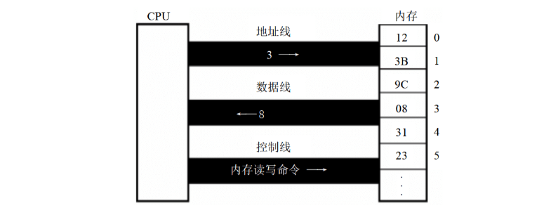

### 第一章 基础知识

汇编课程不全面深入研究硬件系统，PC 机及 CPU 物理、编程结构的全面研究在《微机原理与接口》，计算机一般结构等研究在《组成原理》，汇编课程重点是利用**硬件编程结构**和**指令集**控制系统工作。

#### 1-1 机器语言

> [!note] 机器语言
> 
> 机器指令集合，机器指令是计算机能执行的命令，以二进制数字呈现，计算机将其转为高低电平驱动电子器件运算 。

早期计算机指执行机器指令运算的机器，现在常用 PC 机里，由 CPU（中央处理单元，微处理器）等组成计算机系统，CPU 承担关键运算控制功能 。

不同微处理器因硬件和内部结构不同，需不同电平脉冲控制，所以各有**专属机器指令集**（即机器语言） 。

以 8086CPU 完成运算 `s = 768 + 12288 - 1280` 为例：

```binary
101110000000000000000011
000001010000000000110000
001011010000000000000101
```
#### 1-2 汇编语言的产生

汇编指令是机器指令的“便于记忆版”，本质是对机器指令做了**符号化封装**。比如机器指令`1000100111011000`（操作：BX寄存器内容送AX寄存器 ），对应汇编指令`mov ax,bx` ，用贴近人类语言的助记符，降低阅读和记忆成本。
> [!note] 寄存器
> 寄存器是CPU里存数据的器件，像`AX`、`BX`是不同寄存器的代号，为理解汇编指令操作对象做铺垫。

**汇编程序的执行流程**：汇编指令写的源程序，计算机无法直接执行（计算机只认机器指令 ），需要**汇编编译器**把汇编指令翻译成机器指令（机器码 ），计算机最终执行翻译后的机器码，明确了汇编语言编程的“编写 - 编译 - 执行”链路。

#### 1-3 汇编语言的组成

- **汇编指令**：最核心的部分，是机器码的“简化代号”（助记符）。比如`mov ax,bx` ，背后对应特定二进制机器码，CPU能直接执行，是汇编语言和硬件交互的直接桥梁 。  
- **伪指令**：“辅助性指令”，没有对应的机器码，作用是给编译器看的。像定义数据、分配内存的指令（比如`DB`定义字节数据 ），编译器根据伪指令做编译时的处理（如分配存储空间 ），但CPU不会执行伪指令本身 。  
- **其他符号**：像`+、-、*、/`这些运算符号，同样没有机器码，是让代码更易读的“语法糖”，编译器负责识别解析，转成对应的汇编指令或操作 。  


这两段内容围绕 **“存储器的作用”** 和 **“指令与数据的本质”** 展开，核心是解释计算机如何处理“指令”和“数据”，以及内存的关键地位，以下分两部分解析：

#### 1-4 存储器

**内存的核心地位**：  
   CPU是计算机核心，但必须依赖 **“指令”（做什么）** 和 **“数据”（操作对象）** 才能工作，而这两者存放在 **内存** 中。内存对PC的重要性仅次于CPU，没有内存，再强的CPU也无法运行（类比大脑没记忆就无法思考）。  

**内存与磁盘的关系**：  
   磁盘里的程序/数据，必须先**加载到内存**，才能被CPU使用（CPU不能直接访问磁盘，只能直接读写内存）。  

汇编语言编程需要理解 **CPU如何从内存“读”信息（取指令、读数据），以及向内存“写”信息（存结果）**，这是后续学习的基础。  

#### 1-5 指令和数据
  
在内存或磁盘中，**指令和数据都是二进制串**（物理上无区别）。它们的区别来自 **CPU的“解读方式”**：CPU把某些二进制串当作“指令”（指挥操作），另一些当作“数据”（操作对象）。  

**例如**：  
   二进制串 `1000100111011000`：  

   - **作为数据**：转成十六进制是 `89D8H`（CPU当作“数值”处理）；  
   - **作为指令**：对应汇编指令 `mov ax, bx`（CPU当作“命令”，执行“把bx寄存器的值放到ax寄存器”）。  

这部分内容围绕 **“存储单元的结构、容量及计量方式”** 展开，核心是建立 **“地址→单元→容量”** 的底层认知，以下分点解析：  

#### 1-6 存储单元

**划分与编号**：  
  存储器被切割成 **多个独立的“存储单元”**，每个单元从 **0开始顺序编号**（类似“房间号”）。例如128个单元，编号是 `0~127`。这个编号就是 **内存地址**，CPU通过“地址”定位到具体单元，实现数据读写。    

##### 存储容量：从bit到Byte 

- **最小单位：bit（比特）**：  
  计算机最基础的信息单位，1个bit只存 **1个二进制位**（0或1），类比灯泡的“亮/灭”。  

- **基本单位：Byte（字节）**：  
  1个Byte = **8个bit**（8位二进制）。微型机中，**每个存储单元固定存储1个Byte**（即8个bit）。  
  → 举例：128个存储单元 → 总容量 = 128 × 1Byte = 128字节。  

**容量的计量：二进制进位**  

当存储器容量很大时，用“字节”描述太繁琐，因此定义更大单位，遵循 **“1024倍递增”**（计算机的二进制逻辑，而非生活中的1000倍）：  

- **1KB**（千字节）= 1024B  
- **1MB**（兆字节）= 1024KB  
- **1GB**（吉字节）= 1024MB  
- **1TB**（太字节）= 1024GB  

→ 本质：每级单位都是前一级的 **2¹⁰倍**（因为1024=2¹⁰），体现二进制系统的特性。  

无论是 **内存**（如DDR4）还是 **磁盘**（如硬盘、SSD），容量都用上述单位计量（比如“512GB固态硬盘”“16GB内存”）。  

#### 1-7 CPU 对存储器的读写  

**核心逻辑**：

CPU 与存储器（内存）交互时，需通过 **“三类信息” + “三类总线”** 完成数据读写，本质是 **“定位→发令→传数据”** 的协作过程。  

##### **一、CPU 读写内存的 3 类核心信息**  

| **信息类型** | **作用**                                                                 | **类比**               |  
|--------------|--------------------------------------------------------------------------|--------------------------------------|  
| **地址信息** | 指定要访问的存储单元编号（如“3号单元”），明确“操作对象在哪里”。         | 告诉邮局：“我要 **3号邮箱** 的信”。 |  
| **控制信息** | 1. 定义操作类型（读/写）；<br>2. 选中存储器（区分硬盘、显卡等其他器件）。 | 告诉邮局：“是 **取信（读）** ，不是寄信（写）；操作对象是 **邮局（存储器）** ”。 |  
| **数据信息** | 读：从内存获取的数据；<br>写：要存入内存的数据。                         | 邮局递给你的 **信（读）** ，或你要寄的 **信（写）** 。 |  

##### **二、信息传输的通道：3 类总线**  

总线是 CPU 与芯片连接的导线集合，**从逻辑上分工传输不同信息**：  

| **总线类型** | **传输内容**       | **传输方向**          | **类比**                     |  
|--------------|--------------------|-----------------------|------------------------------------------|  
| **地址总线** | 地址信息（如“3号”） | **单向（CPU→内存）**  | 你喊“3号邮箱”（只有 CPU 告诉内存地址，内存不会反向传地址）。 |  
| **控制总线** | 控制命令（如“读”） | 单向/双向（依命令）   | 你说“取信”（CPU 发命令；内存也可反馈状态，基础阶段简化为 CPU 发令）。 |  
| **数据总线** | 数据信息（如`08`）  | **双向**（读：内存→CPU；写：CPU→内存） | 邮局把信递给你（读），或你把信放进邮箱（写）。         |  

**示例：CPU 读取“3号存储单元”的过程**  



1. **地址总线发定位**：  
   CPU 通过 **地址总线**，发送“3号单元”的地址，告诉内存“要访问这里”。  

2. **控制总线发命令**：  
   CPU 通过 **控制总线**，发送 **“内存读命令”**，同时选中“存储器”（排除硬盘、显卡等其他器件）。  

3. **数据总线传数据**：  
   内存找到3号单元（假设存储数据为`08`），通过 **数据总线** 将`08`传回 CPU。  
 
读/写操作的核心差异：**控制命令方向 + 数据流向**  

| **操作类型** | 步骤 1（地址总线）       | 步骤 2（控制总线）               | 步骤 3（数据总线）               |  
|--------------|--------------------------|----------------------------------|----------------------------------|  
| **读操作**   | 发地址（如“3号单元”）    | 发 **读命令**（选内存，读数据）  | 接收数据（内存→CPU，如“8”）      |  
| **写操作**   | 发地址（如“3号单元”）    | 发 **写命令**（选内存，写数据）  | 发送数据（CPU→内存，如“26”）     |  

**实例：8086CPU 从3号单元读数据到AX寄存器** 

- **机器码（二进制）**：`1010000100000001100000000`  
  → **缺点**：纯二进制，人类难记忆、难编写；  
  → **优点**：CPU可直接执行，无需翻译。  

- **汇编指令**：`MOV AX, [3]`  
  → **含义**：*把3号存储单元的内容，传送到AX寄存器*；  
  → **作用**：是机器码的 **“人类友好版”**，简化记忆和编程（编译器会将其转为机器码）。  

#### 1-8 地址总线  

> [!tip] 核心逻辑
> 
> **地址总线的宽度（根数）决定 CPU 能寻址的存储单元数量**，本质是 **二进制位数与可表示状态数的关系**。

**示例：寻址能力推导（以10根地址线为例）**：  

1. 单根地址线的特性  

物理上，一根地址线只有 **2种稳定状态**：高电平（代表二进制`1`）、低电平（代表二进制`0`）。  

2. N根地址线 → N位二进制数  

10根地址线同时工作时，可传输 **10位二进制数**（每根线对应1位，共10位）。  

3. 10位二进制数的寻址范围  

- **最小值**：`0000000000`（十进制 `0`）  
- **最大值**：`1111111111`（十进制 `2¹⁰−1 = 1023`）  
- **总数量**：从`0`到`1023`，共 **`2¹⁰ = 1024` 个不同地址**（即1024个存储单元）。  
> [!formula] 通用公式
>
> 若 CPU 的地址总线宽度为 **N 根**（即支持传输 N 位二进制数），则：
>
> - **可寻址的存储单元数量** = $\boldsymbol{2^N}$ 个（地址范围：`0` ~ `2^N − 1`）。     

**地址总线越宽（N 越大），CPU 能访问的内存空间越大**（如 32 根地址线支持 4GB 寻址，64 根支持更大空间）。

