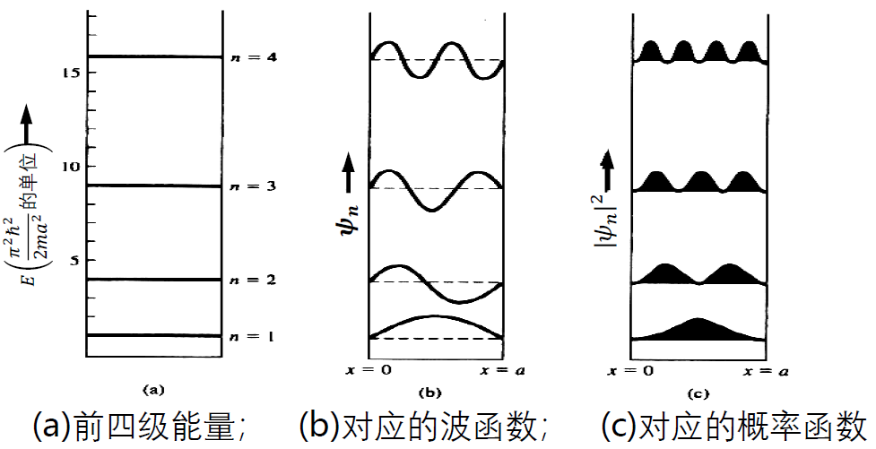

### 课程要求简介

|考核类型|占比|具体要求|
| ---- | ---- | ---- |
|平时成绩|40%|课堂出勤：10%，缺勤一次扣1分，扣完10分为止； 课堂讨论及思考题分析等发言：加分项，主动且有价值的发言及讨论每次加分0 - 0.5分，总计不超过5分； 课外习题：20%，重点内容部分4次作业，每次作业成绩占总成绩5%； 课堂测试：10%，学期中安排随堂测验一次（60分钟），成绩占总成绩10%|
|期末成绩|60%|闭卷考试（部分繁琐公式将在卷首提供）|

#### 课程内容

|半导体器件类型|具体分类|包含内容|
| ---- | ---- | ---- |
|电子器件|双极|pn结、双极晶体管（BJT）|
| |M - S|肖特基二极管|
| |场效应|场效应晶体管MOSFET、MESFET、JFET|
|光电子器件|光→电|信息（光电探测器）、能量（太阳能电池）|
| |电→光|发光二极管LED、激光二极管Laser Diode|

### 半导体物理基础

#### 允带与禁带(Allowed and Forbidden Bands)

核心思想：从单一原子的“能级”到晶体中电子的“能带”

我们首先要理解为什么固体中的电子不像在孤立原子中那样占据着完全分立的**能级 (Energy Level)**，而是处于一系列连续的能量范围，即**能带 (Energy Band)** 之中。这个概念是理解导体、半导体和绝缘体电学特性差异的基石。

##### 量子力学基础：约束导致能量量子化

我们首先回顾一个基础的量子力学模型：**一维无限深势阱 (1D Infinite Potential Well)中的粒子**。这个模型揭示了“约束”如何导致能量的“量子化”。

电子被强制限制在一个长度为 `a` 的一维空间内（阱内），它无法逃逸到这个区域之外（阱壁无限高）。这模拟了电子被束缚在原子核或晶格周围的情况。

根据薛定谔方程的解，被约束的电子不能拥有任意大小的能量。它的能量必须是某些特定的、离散的数值，这些数值被称为**能级**或**本征能量**。

电子允许存在的能量值由主量子数 `n` (n = 1, 2, 3, ...) 决定。

$$E_n = \frac{\hbar^2 \pi^2 n^2}{2ma^2}$$

* $\hbar$ 是约化普朗克常数 ($h/2\pi$)
* `m` 是电子质量
* `a` 是势阱宽度（电子的活动范围）
* `n` 是主量子数，只能取正整数，`n` 越大，波函数振荡得越快，电子的动能越高。

**波函数 (Wave Function)**：描述电子在不同位置出现的概率幅。

$$\psi_n(x) = \sqrt{\frac{2}{a}} \sin\left(\frac{n\pi x}{a}\right)$$

**概率密度 $|\psi_n|^2$**：波函数绝对值的平方代表了在空间某点 `x` **找到该电子的概率**。这是电子粒子性的体现。

> 关键在于理解“**约束**” (电子被限制在一定区域内) 必然导致其能量的“**量子化**” (能量值是离散的)。对于一个孤立的原子，电子被原子核约束，因此也具有一系列分立的、量子化的能级。

##### 能带的形成：从能级分裂到能带

当大量的独立原子（如硅原子）相互靠近，最终形成一个排列规整的晶体时，原先属于单个原子的分立能级会发生变化：

**两个原子的相互作用**：

* **孤立原子 (Isolated Atom)**：如一个孤立的氢原子，其电子有确定的 n=1 基态能级。电子的概率密度 $p(r)$ 以原子核为中心对称分布。
* **双原子系统 (Two-Atom System)**：当两个氢原子靠近时，一个原子的电子会受到另一个原子核的吸引和另一个电子的排斥。这种**相互作用 (interaction)** 或**耦合 (coupling)** 使得两个原子的波函数发生重叠。

* **泡利不相容原理 (Pauli Exclusion Principle)**：在一个体系内，不能有两个或两个以上的电子处于完全相同的量子态。

* **能级分裂 (Energy Level Splitting)**：为了满足泡利不相容原理，当两个原子的波函数重叠时，原来单一的 n=1 能级必须**分裂 (split)** 成两个能量非常接近的新能级（如图c）。一个能量略高（**反键轨道**），一个能量略低（**成键轨道**）。

**N个原子的宏观体系（晶体）**：

我们将这个思想从2个原子推广到晶体中的N个原子（约为 $10^{23}$ 量级）。

* 当N个原子相互靠近形成晶体时，原本属于孤立原子的**每一个能级**，都会因为N个原子间的相互作用而分裂成N个能量极其接近的能级。
* 由于N非常大，这N个分裂的能级在能量坐标上挨得非常紧密，以至于它们形成了一个看似连续的能量区间。

能级的**分裂程度**与**原子间距**密切相关。原子间距越小，原子间相互作用越强，能级分裂越剧烈。

##### 能带的准连续性

* 一个包含 $10^{19}$ 个原子的晶体，若其能带宽度为 `1eV`，则能带内两个相邻能级的平均间距仅为 $10^{-19} \text{eV}$。
* 这个间距极小，因此在宏观上可以认为能带内的能量是**连续的**。

##### 本征激发与载流子

* **激发机理**: 在 T > 0K 的半导体中，价电子可吸收热能。当能量超过禁带宽度 $E_g$ 时，电子将挣脱共价键束缚，从价带跃迁至导带。这一过程被称为**本征激发 (Intrinsic Excitation)**。

* **载流子产生**: 本征激发是纯净（本征）半导体中**载流子 (Charge Carriers)** 的唯一来源。它会同时产生两种载流子：
    1. **电子 (Electron)**: 跃迁到导带的、可自由移动的电子。
    2. **空穴 (Hole)**: 电子离开价带后，在价带中留下的可等效为一个带正电荷的、能够移动的空量子态。

* 电子和空穴总是**成对产生**。因此，在本征半导体中，电子浓度 $n$ 与空穴浓度 $p$ 始终相等，即 $n = p = n_i$（$n_i$ 为本征载流子浓度）。

> [!note] 三种材料的能带结构与导电性比较
>
> - **导电前提**：物质导电的微观本质，是在外电场作用下，载流子在**部分填充能带 (Partially Filled Band)** 中发生定向运动。满带（全被电子占据）和空带（完全没有电子）都无法形成净电流。
>
> - **绝缘体 (Insulator)**  
>   - **能带结构**：具有很宽的**禁带 (Wide Bandgap)**，通常 $E_g > 3\,\text{eV}$。  
>   - **导电性**：价带被电子填满，导带全空。由于禁带太宽，几乎没有电子能被激发到导带，载流子浓度极低，不导电。
>
> - **半导体 (Semiconductor)**  
>   - **能带结构**：具有较窄的**禁带 (Moderate Bandgap)**，如 Si 的 $E_g \approx 1.12\,\text{eV}$。  
>   - **导电性**：T=0K 时为绝缘体，室温下部分电子通过热激发从价带跃迁至导带，形成**电子-空穴对**，导带和价带都成为部分填充状态，具一定导电能力，对温度和杂质极为敏感。
>
> - **导体 (Conductor / Metal)**  
>   - **能带结构**：**没有禁带**，导带和价带重叠，或最高能带本身部分填充。  
>   - **导电性**：总存在部分填充的能带，大量自由电子可在外电场下定向移动，电导率极高。

##### 载流子的产生、复合与热平衡

* **动态过程**: 半导体中的载流子数量处于动态平衡中，该平衡由两种相斥的过程决定：
    1. **产生 (Generation)**: 电子吸收热能从价带跃迁至导带，形成电子-空穴对。
    2. **复合 (Recombination)**: 导带电子落入价带空穴，导致电子-空穴对的湮灭，并释放能量（通常为热能）。

* **热平衡 (Thermal Equilibrium)**: 在一恒定温度下，载流子的产生速率与复合速率相等，此时半导体达到热平衡状态。宏观上，导带中的电子浓度与价带中的空穴浓度会维持一个稳定值。

* **本征载流子浓度 ($n_i$)**:
  * 在热平衡状态下的本征半导体中，电子浓度 $n_0$ 与空穴浓度 $p_0$ 相等，此浓度值被称为**本征载流子浓度**，记为 $n_i$。
        $$n_0 = p_0 = n_i$$
  * $n_i$ 的大小主要由材料的**禁带宽度 ($E_g$)** 和**温度 (T)** 决定。温度越高，或禁带宽度越窄，则 $n_i$ 的数值越大。

#### 载流子的统计分布

#### 能态密度

为了计算能带中载流子的具体浓度，首先必须知道在任意能量 $E$ 附近，单位体积、单位能量区间内有多少个允许电子存在的量子态。这个物理量即为**能态密度 (Density of States, DOS)**，记为 $g(E)$。它描述了能带对电子的“容纳能力”是如何随能量分布的。

* **导带中的能态密度 ($g_c(E)$)**:
    在能量 $E \ge E_c$（导带底）的区域，能态密度分布为：
    $$g_c(E) = \frac{4\pi(2m_n^*)^{3/2}}{h^3}\sqrt{E - E_c}$$
    其中 $m_n^*$ 是电子在晶格中的**有效质量 (Effective Mass)**。该公式表明，导带中的有效能态密度从导带底 $E_c$ 处（值为0）开始，随能量升高而增加。

* **价带中的能态密度 ($g_v(E)$)**:
    在能量 $E \le E_v$（价带顶）的区域，能态密度分布为：
    $$g_v(E) = \frac{4\pi(2m_p^*)^{3/2}}{h^3}\sqrt{E_v - E}$$
    其中 $m_p^*$ 是空穴的**有效质量**。价带中的有效能态密度从价带顶 $E_v$ 处（值为0）开始，随能量降低（即深入价带）而增加。

* **核心总结**:
    能态在导带底和价带顶附近最为稀疏，并向能带内部逐渐密集。在禁带中 ($E_v < E < E_c$)，不存在任何量子态，因此能态密度为零，$g(E)=0$。

#### 费米-狄拉克分布

在半导体中，电子是遵循**泡利不相容原理**的粒子（费米子），即每个量子态最多只能容纳一个电子。因此，描述电子在不同能级上分布规律的统计法则是**费米-狄拉克 (Fermi-Dirac) 统计**。

* **费米函数 $f_F(E)$**:
    在热平衡条件下，能量为 $E$ 的一个量子态被电子占据的概率由**费米函数**给出：
    $$f_F(E) = \frac{1}{1 + \exp\left(\frac{E - E_F}{kT}\right)}$$
    这个函数是连接微观能态与宏观载流子浓度的核心桥梁。

* **费米能级 $E_F$ (Fermi Level)**:
    $E_F$ 是费米-狄拉克分布中的一个核心参数，代表了电子填充能级的一个基准能量。其物理意义是：**在该能量上，一个量子态被电子占据的概率恒为 1/2**。

* **空穴的分布函数 $1-f_F(E)$**:
    一个量子态不被电子占据，就意味着它被一个**空穴**占据。因此，空穴在能量 $E$ 的分布概率为：
    $$1 - f_F(E) = \frac{1}{1 + \exp\left(\frac{E_F - E}{kT}\right)}$$
    这表明电子和空穴的分布呈现一种关于费米能级 $E_F$ 的对称关系。
