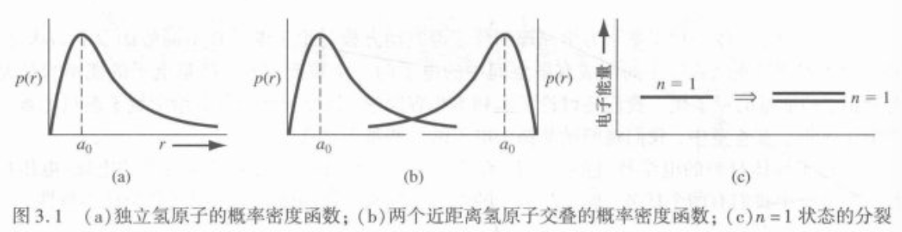
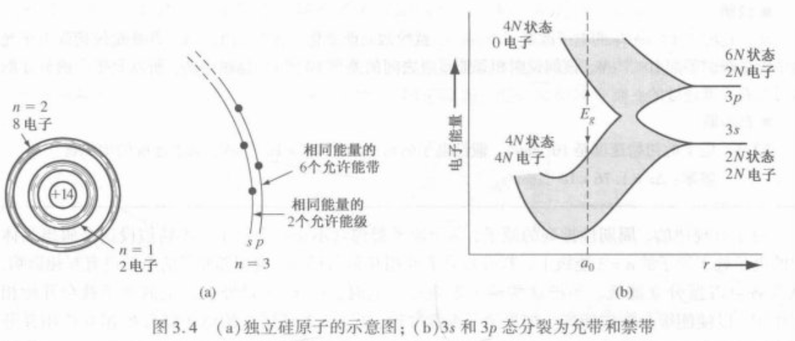
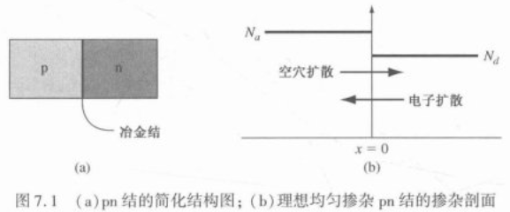

### CH-03 固体量子理论初步

#### 3-1 允带与禁带

##### 3-1-1 能带的形成机理

- **理论基础**: 旨在将孤立原子中电子能量量子化的结论推广到宏观晶体中。孤立原子的电子具有分立的、不连续的能级，其空间位置由概率密度函数描述。

###### 能级分裂 (Energy Level Splitting)

- 当大量原子（N个）从相互远离的状态靠近并最终形成晶体时，它们的电子波函数会发生重叠，产生显著的相互作用（微扰）。
- 依据**泡利不相容原理 (Pauli Exclusion Principle)**，在一个相互作用的体系中，不能有多个电子处于完全相同的量子态。
- 因此，原属于N个孤立原子的、完全相同的分立能级，必须分裂成N个能量值各不相同但又极其接近的新能级。

**允带与禁带的形成**：

1. **允带 (Allowed Band)**: 由单个分立能级分裂而成的N个密集能级所组成的、能量上准连续的区域。电子可以占据允带中的任何一个能态。

2. **禁带 (Forbidden Band / Band Gap)**: 不同允带之间的能量空隙。在这些区域内，不存在稳定的电子量子态，因此电子不能占据禁带中的能量。

能级的分裂程度是**原子间距**的强函数。当原子相距很远时，能级不分裂；随着原子间距减小，原子间相互作用增强，能级分裂愈发显著，并逐渐展宽形成能带。晶体的最终能带结构在其实际的平衡原子间距 ($r_0$) 处确定下来。

**能带的准连续性 (Quasi-Continuity)**:

1. 依据泡利不相容原理，晶体中N个原子的同一能级必须分裂为N个独立的量子态，以容纳所有对应的电子。
2. 由于晶体中的原子数量N极其巨大（例如 $10^{19}$ 级别），这N个能级被压缩在一个有限的能量宽度内（例如 $1 \text{eV}$）。
3. **结论**: 计算可得，能带内相邻两个能级的间距小到几乎可以忽略不计（例如 $10^{-19} \text{eV}$）。因此，在研究载流子等宏观问题时，可以认为能带内的能量分布是**准连续的**，这为后续使用积分进行数学处理提供了理论依据。

> [!note] 实例分析
>
> 一个在晶体中运动的电子，其速度发生了一个极其微小的变化（例如，从 $10^5 \text{m/s}$ 变到 $10^5 + 0.01 \text{m/s}$）。
> 这个微小速度变化所对应的电子动能变化量，经过计算约为 $5.7 \times 10^{-9} \text{eV}$。
>
> $\Delta E_{动能} \approx 10^{-9} \text{eV}$
> $\Delta E_{能级} \approx 10^{-19} \text{eV}$
>
> 比较这两个数值可以发现，一个几乎无法察觉的、极小的电子动能变化，已经远远大于（约$10^{10}$倍）能带中相邻两个量子态之间的能量差。
>
> 这意味着，对于在能带中运动的电子而言，其能量变化在宏观上是完全连续的。它不需要“费力”地跳跃到下一个台阶，因为这些台阶极其密集，已经构成了一个平滑的“斜坡”。这为在分析半导体问题时，将能带中的能量分布当作**连续函数**处理提供了坚实的物理依据。

> [!note] 硅原子的能带结构简述
>
> 
>
> - **价电子**：硅原子外层有4个价电子，分布在3s和3p轨道。
> - **能带形成**：晶体中，3s和3p轨道相互作用并分裂，形成两个主要能带——**价带**（低能，满电子）和**导带**（高能，空电子），中间隔有**禁带**（Eg）。
> - **半导体特性**：在绝对零度下，价带满、导带空，硅不导电。其能带结构决定了硅的半导体性质。

### CH-07 PN结

#### 7-1 PN结的基本结构

PN结的核心构成：一块**单晶半导体材料**，一部分掺入**受主杂质原子**形成**p区**（空穴为多数载流子），相邻部分掺入**施主杂质原子**形成**n区**（电子为多数载流子）；分隔p区和n区的**交界面**称为**冶金结**。

- 横轴以**冶金结位置**为$x=0$。
- 载流子扩散：由于p区空穴浓度高、n区电子浓度高，**浓度差驱动载流子扩散**——空穴从p区向n区扩散（向右箭头），电子从n区向p区扩散（向左箭头）。

这种“每个掺杂区杂质均匀分布、交界面处杂质浓度突变”的情况，属于**突变结**的特点

### 1. 载流子扩散与电荷分离

pn结中，p区多子（空穴）和n区多子（电子）因**冶金结处的浓度梯度**，发生扩散运动：

- n区电子向p区扩散，失去电子的n区留下**带正电的施主离子**；
- p区空穴向n区扩散，失去空穴的p区留下**带负电的受主离子**。

### 2. 内建电场与空间电荷区（耗尽区）

这些净正、负电荷在冶金结附近感生出**内建电场**（方向：n区→p区）。电场作用下，可动载流子被“扫出”该区域，导致区内几乎无自由可动电荷，因此该区域被称为：

- **空间电荷区**（因存在净正、负电荷得名）；
- **耗尽区**（因可动载流子被“耗尽”得名，两者可互换）。

### 3. 热平衡下的力平衡

空间电荷区**边缘**，多子仍存在浓度梯度，因此多子受到“**扩散力**”（驱使它们沿浓度梯度扩散）；同时，内建电场对载流子施加“**电场力**”（方向与扩散力相反）。

在**热平衡条件**下，电子和空穴各自受到的“扩散力”与“电场力”**大小相等、方向相反**，达到平衡——载流子的净扩散运动停止，pn结处于稳定的热平衡状态。

