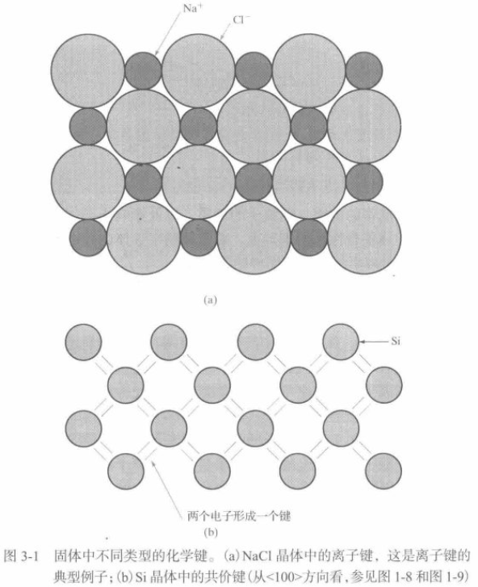
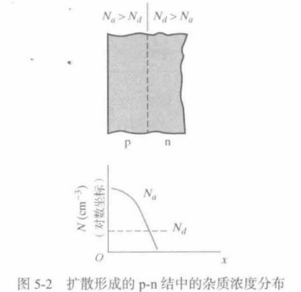

### CH-01 晶体性质与半导体生长

#### 半导体材料

半导体是导电性介于金属与绝缘体之间的材料。其电导率受温度、激发强度、杂质浓度等外界因素影响显著，可在数个数量级范围内变化，这一特性是其在电子器件中广泛应用的基础。

##### 半导体材料分类

* **元素半导体**：由单一元素构成，主要代表为IV族的硅（Si）和锗（Ge）。硅是现代集成电路和晶体管的核心材料，而锗在早期二极管和三极管制造中扮演了重要角色。

* **化合物半导体**：由两种或两种以上元素化合而成。

    * **III-V族化合物**：如砷化镓（GaAs）和磷化镓（GaP），是制造高速器件和光电子器件（如发光二极管LED）的关键材料。
    * **II-VI族化合物**：如硫化锌（ZnS），常用于荧光屏的荧光材料。其他材料如InSb, CdSe, PbTe及HgCdTe等常用于制作光探测器。

    * **多元化合物半导体**：如三元化合物半导体（如GaAsP）和四元化合物半导体（如InGaAsP），通过调控组分可精确控制材料性质，在器件设计上具备高度灵活性。

> [!note] II-VI族化合物半导体的结构与应用特性
>
> II-VI族化合物半导体由IIB族金属元素（如Zn、Cd、Hg）与VIA族非金属元素（如S、Se、Te）以离子键为主、兼具共价键结合形成，常见晶体结构为闪锌矿或纤锌矿。其禁带宽度较宽且可通过掺杂或形成固溶体灵活调控。由于离子键占比高，材料中易形成**浅能级陷阱**，但部分II-VI族材料还具备高电子迁移率。基于这些特性，II-VI族化合物广泛应用于荧光材料（如掺杂ZnS实现电子跃迁发光）、光探测器（如InSb、CdSe、HgCdTe等用于红外至可见光波段的光电探测）。

* **半导体材料的应用**
  * **电子器件**：硅（Si）是集成电路、整流器、晶体管等主流电子器件的基础。
  * **光电子器件**：
    * **发光二极管（LED）**：常用材料为GaAs和GaP。
    * **激光器**：通常采用GaAs、AlGaAs以及其他三元或四元化合物半导体。
    * **探测器**：Si和Ge广泛用于红外探测器和辐射探测器；InSb、CdSe、PbTe及HgCdTe等则用于制作各类光探测器。
  * **微波器件**：GaAs和InP是制造耿氏二极管（Gunn Diode）等微波器件的常用材料。

> [!note] 耿氏二极管（Gunn Diode）
>
> 耿氏二极管（Gunn Diode），又称**转移电子器件（TED）**，是一种基于**耿氏效应**工作的两端半导体器件。其核心特征是在特定电压下，由于电子在半导体材料（如砷化镓、磷化铟等）中的“转移电子”现象，导致电流随电压升高而下降，表现出**负阻特性**。耿氏二极管主要用于产生或放大微波频段的电磁信号，广泛应用于雷达、通信、电子对抗等领域。

* **禁带宽度（Band Gap）**
  * 禁带宽度是区分半导体与金属、绝缘体的核心物理量，它决定了半导体的许多光电特性。
  * 例如，纯净半导体对光的吸收特性以及半导体材料的发光波长均由其禁带宽度决定。GaAs的禁带宽度为 $1.43 \text{ eV}$。

##### 半导体材料特性调控

* **禁带宽度与发光波长**
  * 半导体的禁带宽度直接决定了其发光器件（如LED、激光器）的发射光波长。
  * 例如，磷化镓（GaP）的禁带宽度为 $2.3 \text{ eV}$，其发光波长与可见光区的绿光波长邻近。
  * 通过选用不同禁带宽度的半导体材料，可以制造出覆盖从红外到可见光等不同波段的发光器件。

* **常用半导体材料分类（参照元素周期表）**

| 分类                     | 代表元素/化合物                           | 典型材料示例                           |
|--------------------------|------------------------------------------|----------------------------------------|
| 元素半导体               | IV族元素                                 | 硅（Si）、锗（Ge）                     |
| IV族化合物半导体         | IV族元素间化合物                         | 碳化硅（SiC）、硅锗合金（SiGe）         |
| III-V族化合物半导体      | III族与V族元素化合物                      | 氮化镓（GaN）、磷化镓（GaP）、砷化镓（GaAs）、磷化铟（InP） |
| II-VI族化合物半导体      | II族与VI族元素化合物                      | 硫化锌（ZnS）、硒化锌（ZnSe）、硫化镉（CdS）、碲化镉（CdTe） |

> [!note] 半导体掺杂
>
> **掺杂（Doping）** 是指在半导体材料中有控制地引入特定杂质，以显著改变其电学和光学性质的过程。掺杂是调控半导体导电性能的核心技术。例如，在纯硅晶体中引入百万分之一的杂质，即可使其从不良导体转变为良导体。掺杂技术也是实现扩散和离子注入等工艺的基础。

### CH-02 原子与电子

本章内容归属于纯量子力学范畴，且并非本文核心讨论重点，故不再展开重复。

### CH-03 半导体的能带与载流子

#### 固体结合性质与能带

孤立原子与固体中电子状态的对比：

  * **孤立原子**：原子中的电子被束缚在各自的轨道上，具有一系列分立、不连续的能级。
  * **固体**：当大量原子结合成晶体时，由于原子间距极近，相邻原子的电子波函数发生交叠。这导致原属于单个原子的外层电子（价电子）不再局限于特定原子，而是在整个晶体中运动，形成“电子的共有化”。

在量子力学中，固体中相邻原子对某一原子的作用可视为一种**微扰（Perturbation）**。这种相互作用改变了薛定谔方程中的势能项和边界条件，使得原先孤立的、单一的原子能级发生移动和**分裂**，形成大量靠得极近的新能级。

对于一个含有N个原子的宏观固体，每个分立的原子能级会分裂成N个非常接近的能级。当N极大时，这些分裂的能级在能量上几乎是连续的，从而构成了**能带（Energy Band）**。

* **能带与禁带**
  * **允许能带（Allowed Band）**：电子可以占据的、由大量分裂能级构成的能量区间。
  * **禁带（Forbidden Band / Band Gap）**：位于允许能带之间的能量区间，其中不存在可供电子占据的稳定能态。这正是“禁带宽度”的物理来源。

##### 固体的结合性质

固体能够形成，其根本原因是原子间的相互作用力，即**化学键**。化学键的类型决定了固体的结构与电学特性。

以**离子键（Ionic Bond）**为例，典型的离子晶体如氯化钠（NaCl）的形成过程如下：钠（Na）原子的最外层有一个3s电子，而氯（Cl）原子外层有5个3p电子。当它们靠近时，Na原子会失去其3s电子，形成带正电的钠离子（Na⁺）；Cl原子则获得这个电子，形成带负电的氯离子（Cl⁻）。通过电子的转移，Na⁺ 和 Cl⁻ 的最外层电子壳层都达到了被填满的稳定状态，其电子结构分别与惰性气体氖（Ne）和氩（Ar）相同。

带相反电荷的Na⁺和Cl⁻离子之间通过**静电引力（库仑力）**相互吸引，从而结合在一起。在晶体中，每个离子都被置于一个由吸引力和排斥力共同决定的平衡位置上，形成了稳定的晶体结构。在NaCl晶体中，每个Na离子周围有6个最近邻的Cl离子，反之亦然。由于所有电子都被紧紧束缚在各自的离子周围，没有可自由移动的导电电子，因此氯化钠（NaCl）晶体是**绝缘体**。

### CH-05 半导体 p-n 结与金属-半导体结（m-s结）

#### p-n结的制造

器件（或IC芯片）的结构通过**图形化掩模板转移+掩模窗口选择性掺杂**实现；了解制造工艺，能辅助深入理解器件工作原理与物理机制。

##### 热氧化工艺（Si片氧化）

- **过程**：将Si衬底片置于洁净石英管，放入氧化炉，加热至 $800\sim1000^\circ\text{C}$；通入含氧量的携载气体（干 $\text{O}_2$ 或 $\text{H}_2\text{O}$ 蒸气），与Si衬底发生化学反应，在Si片表面生成氧化层。
- **分类与反应式**：
    - 干法氧化：$\text{Si} + \text{O}_2 \rightarrow \text{SiO}_2$；
    - 湿法氧化：$\text{Si} + 2\text{H}_2\text{O} \rightarrow \text{SiO}_2 + 2\text{H}_2$。
- **设备优势（立式炉）**：Si片氧化面朝下，减少微尘污染；炉内气流更均匀，利于氧化层均匀生长。

干氧、湿氧氧化时，氧化剂需通过已形成的SiO₂层扩散至Si-SiO₂界面，与衬底Si发生反应。生长1μm厚的SiO₂层，约消耗0.44μm厚的Si层，且SiO₂体积为消耗Si的2.2倍左右。Si能便捷生长出高质量SiO₂层，工艺简单，是现代电子器件与集成电路制造的核心基础工艺。

##### 扩散

扩散是IC制造的高温工艺，通过扩散窗口将B、P、As等杂质引入晶片内部形成掺杂区。工艺过程为：晶片经氧化、光刻腐蚀打开扩散窗口后，放入 $800\sim1100^\circ\text{C}$ 高温扩散炉，通入含杂质的携载气体，使杂质从窗口向半导体内部扩散。

> [!tip] 扩散窗口
> 
> 扩散窗口是在SiO₂掩蔽层上通过光刻和腐蚀工艺形成的**开口区域**，为杂质原子的定向扩散提供通道。杂质仅能通过窗口区域进入晶片，实现**定域掺杂**（如PN结、掺杂区的形成）。由于SiO₂层对杂质扩散有很强的阻挡作用，只有窗口内的Si会被掺杂，从而保证了器件结构的精准可控。

杂质扩散机理与载流子扩散一致（需高温且速率更慢），扩散系数满足阿伦尼乌斯关系 $D = D_0\exp(-E_A/kT)$（$D_0$ 为与衬底、杂质相关的常数，$E_A$ 为激活能）；一定温度下经时间 $t$，杂质扩散长度为 $\sqrt{Dt}$，$Dt$ 称为“热预算”。由于扩散系数对温度呈指数依赖，需精准控制温度波动（小于几度）以保证杂质分布精度。

> [!note] 阿伦尼乌斯方程与扩散系数的温度依赖
>
> 阿伦尼乌斯方程描述了**扩散系数 $D$ 与温度 $T$** 的指数关系：
> $$
> D = D_0 \exp\left(-\frac{E_a}{kT}\right)
> $$
> 其中：
>
> - $D_0$：指前因子（与材料和杂质相关的常数）
> - $E_a$：激活能（扩散所需能量势垒）
> - $k$：玻尔兹曼常数
> - $T$：热力学温度（K）
>
> 随着温度升高，扩散系数 $D$ 会**指数级增大**。因此，半导体热扩散工艺中需严格控制温度，以确保杂质扩散长度 $\sqrt{Dt}$ 的一致性，实现对掺杂区的精确调控。

SiO₂层可作为杂质掩蔽层（相同温度下，杂质在SiO₂中的扩散系数远小于Si中），故窗口外区域受掩蔽。但热扩散存在杂质分布控制、高温条件准备的困难，目前更多采用离子注入进行掺杂。

大直径（8英寸及以上）晶圆的扩散多在立式炉中进行，且常通过智能机器人系统实现单片单独处理，保障操作快速精准。

扩散杂质分布由扩散方程结合边界条件求解，典型类型包括：

- **高斯分布**：扩散过程中杂质总量恒定（表面预先沉积杂质，过程无额外杂质供给）。
- **余误差分布**：扩散过程中晶片表面杂质浓度恒定（扩散气氛杂质浓度不变）。

**扩散结深**是受主杂质浓度与衬底施主杂质浓度相等处的深度（即p-n结位置）：结深以内为p型区（受主杂质占优），结深以外为n型区（施主杂质占优）；结深可通过扩散时间、扩散温度调控。

- **杂质源选择**：扩散掺入受主杂质（如硼）时，常用 $ \text{B}_2\text{O}_3 $、$ \text{BBr}_3 $、$ \text{BCl}_3 $ 等；掺入施主杂质（如磷）时，常用 $ \text{PH}_3 $、$ \text{P}_2\text{O}_5 $、$ \text{POCl}_3 $ 等。

- 固态杂质源可置于Si晶片正面或石英管独立加热区；
- 气态杂质源经流量计与携载气体混合导入；
- 液态杂质源通过惰性气体冒泡后导入。

- **洁净度控制**：因掺杂浓度极低（百万分之一量级或更小），杂质源、携载气体纯度需极高；石英管、石英舟、石英钩使用前经HF酸浸泡清洗（无杂质接触时可免重复清洗）；Si晶片需严格清洗，最终用HF酸漂洗以去除多余氧化层。

##### 快速热处理（RTP）

RTP装置因热处理室热容量小，温度可快速变化（升温速率达 $50\sim100^\circ\text{C/s}$），适用于单个晶圆片的快速工艺，可替代高温炉完成快速热氧化、离子注入与CVD后退火等，操作更简便灵活。

RTP通过高辐射强度的卤素红外加热灯（数十千瓦）加热正面朝下的晶圆，升温、降温极快，能精准控制温度变化以快速启停工艺。使用时需保证大尺寸晶圆温度分布均匀性与温度控制精确性（依赖热电偶或高温计测温）。

（高温炉因温度难快速改变，多用于晶圆批量热处理，与RTP工艺场景互补。）

#### 平衡态p-n结

### 场效应晶体管

1. **分类与原理**
    - JFET：通过栅压控制耗尽层宽度调节电流。
    - MESFET：以金属 - 半导体结（肖特基势垒）替代JFET的p-n结，特性类JFET。
    - MISFET：栅极与沟道间有氧化物绝缘层（如 $ \text{SiO}_2 $ ），MOSFET为典型代表。

2. **与BJT的对比**
   - BJT（双极型）：依赖少子工作，电子、空穴均导电，属电流控制器件。
   - FET（单极型）：仅靠多子工作，属电压控制器件；二者均为三端器件，通过控制极调控电流。

3. **发展与应用**
   - 历史：1930年Lilienfeld提出FET概念；Bardeen、Brattain研究FET时意外发明BJT，Shockley拓展BJT理论；1960年Kahng和Atalla研制出MOSFET。
   - 优势与应用：FET输入阻抗高，可实现开关态切换，适合数字电路；MOSFET易大规模集成，广泛用于存储器、微处理器等芯片（集成数百万至数千万MOS结构）。

#### 场效应晶体管的工作原理

