### 单位问题说明

迁移率 $\mu_{n/p}$：$\text{cm}^2/\text{V}\cdot\text{s}$

电阻率 $\rho$ ：$\Omega\cdot\mathrm{cm}$ （电导率就是这个的倒数）

电流密度 $J$：$\text{A}/\text{cm}^{2}$（因为是从迁移率 - 电导率 - 电流密度这样算过来的，所以延续了 cm 的单位传统）
### 第三~六章 半导体基础物理

#### 3.1 允带与禁带（对应PPT 1.1）

全是那种涉及到微分方程、薛定谔方程求解的，不做也罢，主要是掌握概念即可。

#### 4.4 载流子的统计学分布（对应PPT 1.2）

如果全做的话题就有点太多了，根本做不过来，考试前看两道练练手得了😥。

#### 5.1 载流子的漂移运动（对应PPT 1.3a）

>[!note] 5-1
>硅中施主杂质原子的浓度为 $N_{d}=10^{15}cm^{-3}$。设电子迁移率为 $\mu_{n}=1300cm^{2}/V\cdot s$，空穴迁移率为 $\mu_{p}=450cm^{2}/V\cdot s$。(a)求材料的电阻率；(b)求材料的电导率。

>主要考察电导率公式：$\sigma = e\mu_n N_d + e\mu_p N_a$，但是这里主要是n掺杂（p($2.06\times10^{5}$)比n($10^{15}$)小了10个数量级），所以可以近似忽略空穴电导率的部分。

(a) $$\rho = \frac{1}{e\mu_n N_d} = \frac{1}{(1.6\times10^{-19})(1300)(10^{15})} = 4.808\,\Omega\text{-cm}$$

(b) $$\sigma = \frac{1}{\rho} = \frac{1}{4.8077} = 0.208\,(\Omega\text{-cm})^{-1}$$

>[!note] 5-2
>p型硅材料的电导率为 $\sigma=1.80(\Omega\cdot cm)^{-1}$。如果迁移率值为 $\mu_{n}=1250cm^{2}/V\cdot s$ 和 $\mu_{p}=380cm^{2}/V\cdot s$，那么材料的受主杂质浓度是多少？

由电导率公式：$$\sigma = e\mu_{p} N_{a}$$

转换为：$$N_{a} = \frac{\sigma}{e\mu_{p}} = \frac{1.80}{(1.6\times 10^{-19})(380)}= 2.96\times 10^{16} \text{cm}^{-3}$$

>[!note] 5-3
>(a)$T=300K$ 时某n型硅材料的电导率为 $\sigma=10(\Omega\cdot cm)^{-1}$，求施主杂质浓度以及该杂质浓度下的电子迁移率；(b)某p型硅材料的电阻率为 $\rho=0.20(\Omega\cdot cm)$，求受主杂质浓度以及该杂质浓度下的空穴迁移率。

>主要关注点是杂质浓度和载流子迁移率是相关的，可以通过查表跟据浓度查到迁移率，最后凑一个值符合乘积（大概率不会考）

(a)

电导率公式为：

$$
\sigma = e\mu_{n}N_{d}
$$

代入数值得：

$$
10 = (1.6\times10^{-19})\mu_{n}N_{d}
$$

经过查表，当施主杂质浓度 $N_{d} = 6\times10^{16}\ \text{cm}^{-3}$ 时，电子迁移率 $\mu_{n} \cong 1050\ \text{cm}^2/\text{V}\cdot\text{s}$（查表结果因人而异，每个人查出来的值可能略有不同）。

(b)

电阻率公式为：

$$
\rho = \frac{1}{e\mu_{p}N_{a}}
$$

代入数值得：

$$
0.20 = \frac{1}{(1.6\times10^{-19})\mu_{p}N_{a}}
$$

经过查表，当受主杂质浓度 $N_{a} = 10^{17}\ \text{cm}^{-3}$ 时，空穴迁移率 $\mu_{p} \cong 320\ \text{cm}^2/\text{V}\cdot\text{s}$。

>[!note] 5-4
>(a)$T=300K$ 时某p型砷化镓材料的电阻率为 $\rho=0.35(\Omega\cdot cm)$，求受主杂质浓度以及该杂质浓度下的空穴迁移率；(b)某n型砷化镓材料的电导率为 $\sigma=120(\Omega\cdot cm)^{-1}$，求施主杂质浓度以及该杂质浓度下的电子迁移率。

>本题与上一题类似，主要考察电阻率和电导率的计算方法。

（a）

电阻率的公式为：

$$
\rho = \frac{1}{e\mu_{p}N_{a}}
$$

代入数值得：

$$
0.35 = \frac{1}{(1.6\times10^{-19})\mu_{p}N_{a}}
$$

查表可知，当受主杂质浓度 $N_{a} = 8\times10^{16}\ \mathrm{cm}^{-3}$ 时，空穴迁移率 $\mu_{p} \approx 220\ \mathrm{cm}^2/\mathrm{V}\cdot\mathrm{s}$。计算如下：

$$
\rho = \frac{1}{(1.6\times10^{-19})(220)(8\times10^{16})} = 0.355\,\Omega\cdot\mathrm{cm}
$$

（b）

电导率的公式为：

$$
\sigma = e\mu_{n}N_{d}
$$

代入数值得：

$$
120 = (1.6\times10^{-19})\mu_{n}N_{d}
$$

查表可知，当施主杂质浓度 $N_{d} = 2\times10^{17}\ \mathrm{cm}^{-3}$ 时，电子迁移率 $\mu_{n} \approx 3800\ \mathrm{cm}^2/\mathrm{V}\cdot\mathrm{s}$。计算如下：

$$
\sigma = (1.6\times10^{-19})(3800)(2\times10^{17}) = 121.6\,(\Omega\cdot\mathrm{cm})^{-1}
$$

>[!note] 5-5
某n型硅材料样品长为 $2.5cm$，横截面积为 $0.1cm^{2}$。施主杂质浓度为 $N_{d}=2\times10^{15}cm^{-3}$。测得该样品电阻为 $70\Omega$。求电子迁移率。

已知电阻公式为：

$$
R = \frac{\rho L}{A} = \frac{L}{\sigma A} = \frac{L}{(e\mu_{n} N_{d})A}
$$

也可以变形为：

$$
\mu_{n} = \frac{L}{e N_{d} R A}
$$

将题目中给定的数值代入计算：

- $L = 2.5\,\mathrm{cm}$
- $N_{d} = 2 \times 10^{15}\,\mathrm{cm}^{-3}$
- $R = 70\,\Omega$
- $A = 0.1\,\mathrm{cm}^2$
- $e = 1.6 \times 10^{-19}\,\mathrm{C}$

代入公式得：

$$
\mu_{n} = \frac{2.5}{(1.6 \times 10^{-19}) \times (2 \times 10^{15}) \times 70 \times 0.1}
$$

计算结果为：

$$
\mu_{n} = 1116\,\mathrm{cm}^2/\mathrm{V} \cdot \mathrm{s}
$$

因此，该硅材料的电子迁移率为 $1116\,\mathrm{cm}^2/\mathrm{V} \cdot \mathrm{s}$。

>[!note] 5-6
>$T=300K$ 时，均匀掺杂的GaAs半导体的参数为 $N_{d}=10^{16}cm^{-3}$，$N_{a}=0$。(a)计算热平衡时的电子和空穴浓度；(b)外加电场为 $E=10V/cm$，计算漂移电流密度；(c)当 $N_{d}=0$，$N_{a}=10^{16}cm^{-3}$ 时，重做(a)和(b)的计算。

> [!tip] 考点解析
> 主要考察漂移电流公式：
>
> 空穴漂移电流密度：  
> $J_{p|drf} = ep\mu_pE$
>
> 电子漂移电流密度：  
> $J_{n|drf} = -env_{dn} = -en(-\mu_nE) = en\mu_nE$
>
> 总漂移电流密度：  
> $J_{drf} = ep\mu_pE + en\mu_nE$

(a)

计算本征载流子浓度：

$$
n_{o} = N_{d} = 10^{16}\ \text{cm}^{-3}
$$

空穴浓度为：

$$
p_{o} = \frac{n_{i}^{2}}{n_{o}} = \frac{(1.8 \times 10^{6})^{2}}{10^{16}} = 3.24 \times 10^{-4}\ \text{cm}^{-3}
$$

---

(b)

电流密度的计算公式为：

$$
J = e \mu_{n} n_{o} E
$$

对于掺杂浓度 $N_{d} = 10^{16}\ \text{cm}^{-3}$ 的砷化镓，电子迁移率 $\mu_{n} \approx 7500\ \text{cm}^{2}/(\text{V}\cdot\text{s})$。

代入数值计算：

$$
J = (1.6 \times 10^{-19}) \times 7500 \times 10^{16} \times 10 = 120\ \text{A}/\text{cm}^{2}
$$

---

(c)

(i) 空穴浓度为：

$$
p_{o} = N_{a} = 10^{16}\ \text{cm}^{-3}
$$

电子浓度为：

$$
n_{o} = \frac{n_{i}^{2}}{p_{o}} = 3.24 \times 10^{-4}\ \text{cm}^{-3}
$$

(ii) 对于掺杂浓度 $N_{a} = 10^{16}\ \text{cm}^{-3}$ 的砷化镓，空穴迁移率 $\mu_{p} \approx 310\ \text{cm}^{2}/(\text{V}\cdot\text{s})$。

电流密度计算：

$$
J = e \mu_{p} p_{o} E = (1.6 \times 10^{-19}) \times 310 \times 10^{16} \times 10 = 4.96\ \text{A}/\text{cm}^{2}
$$

>[!note] 5-7
>晶体硅材料的横截面积为 $0.001\ cm^{-2}$，长为 $10^{-3}\ cm$，两端加 $10\ V$ 电压。$T = 300\ K$ 时，假设要在硅中得到 $100\ mA$ 的电流。计算：(a)所需的半导体电阻 $R$；(b)所需的电导率；(c)达到此电导率所需的施主杂质浓度；(d)假设初始施主杂质浓度为 $N_d=10^{15}\ cm^{-3}$，要形成电导率为(b)的p型补偿半导体，试确定受主杂质浓度。

(a)
由 $V = IR$ 可得 $10 = (0.1)R$  ，即 $R = 100\Omega$

(b)
由 $R = \frac{L}{\sigma A}$ 可得 $\sigma = \frac{L}{RA}$  ，即 $\sigma = \frac{10^{-3}}{(100)(10^{-3})} = 0.01(\Omega - \text{cm})^{-1}$

(c)
$\sigma \cong e\mu_{n} N_{d}$  ，即 $0.01 = (1.6\times10^{-19})(1350)N_{d}$  ，解得 $N_{d} = 4.63\times10^{13} \text{cm}^{-3}$

(d)
$\sigma \cong e\mu_{p} p_{o}$  ，即 $0.01 = (1.6\times10^{-19})(480)p_{o}$  ，解得 $p_{o} = 1.30\times10^{14} \text{cm}^{-3} = N_{a} - N_{d}$  
因此 $N_{a} = 1.30\times10^{14} + 10^{15} = 1.13\times10^{15} \text{cm}^{-3}$

>[!note] 5-8
 (a)某硅半导体电阻器是一个长为 $0.075\ cm$，横截面积为 $8.5\times 10^{-4}\ cm^{-2}$ 的长方体，硼原子的掺杂浓度为 $2\times 10^{16}\ cm^{-3}$。令 $T = 300\ K$，假设在长度方向施加一个 $2\ V$ 的电压，计算电阻器的电流；(b)假设长度变为原来的3倍，重做(a)；(c)分别计算(a)和(b)中的平均漂移速度。

>[!tip] 重点公式
重点在于平均漂移速度公式：$v_{d} = \mu E$

(a)
电阻计算公式：$R=\frac{L}{\sigma A}=\frac{L}{(e\mu_{p}N_{a})A}$  
当 $N_{a}=2\times10^{16}cm^{-3}$ 时，$\mu_{p}\cong400cm^{2}/V\cdot s$  
代入计算：$R=\frac{(0.075)}{(1.6\times10^{-19})(400)(2\times10^{16})(8.5\times10^{-4})}=68.93\Omega$  
电流计算：$I=\frac{V}{R}=\frac{2}{68.93}=0.0290A$，即 $I=29.0mA$

(b)
电阻与长度成正比：$R \propto L \Rightarrow R=(68.93)(3)=206.79\Omega$  
电流计算：$I=\frac{V}{R}=\frac{2}{206.79}=0.00967A$，即 $I=9.67mA$

(c)
电流密度公式：$J=ep_{o}v_{d}$  
对于情况(a)：$J=\frac{29.0\times 10^{-3}}{8.5\times 10^{-4}}=34.12A/cm^{2}$  
漂移速度：$v_{d}=\frac{J}{ep_{o}}=\frac{34.12}{(1.6\times 10^{-19})(2\times 10^{16})}=1.066\times 10^{4}cm/s$  
对于情况(b)：$J=\frac{9.67\times 10^{-3}}{8.5\times 10^{-4}}=11.38A/cm^{2}$  
漂移速度：$v_{d}=\frac{11.38}{(1.6\times 10^{-19})(2\times 10^{16})}=3.55\times 10^{3}cm/s$

>[!note] 5-9
(a)某砷化镓半导体电阻器施主掺杂浓度为 $N_d = 2\times 10^{15}\ cm^{-3}$，横截面积为 $5\times 10^{-5}\ cm^{2}$。施加一个 $5\ V$ 的偏压产生电流 $I = 25\ mA$，确定电阻器的长度；
(b)利用(a)中的结果，计算电子的漂移速度；
(c)已知电子的饱和速度为 $5\times 10^{6}\ cm/s$，假设施加的偏压增加到 $20\ V$，确定此时产生的电流。

>[!tip] 重点在于 c 问的速度饱和现象，这个包和速度就是在暗示一定达到饱和电流了，直接使用饱和电流密度进行计算即可，不需要考虑这个电压值
>$I_{sat} = J_{sat}A = env_{sat}A$

(a)
当 $N_d = 2 \times 10^{15} \text{ cm}^{-3}$ 时，电子迁移率 $\mu_n \cong 8000 \text{ cm}^2/\text{V·s}$  
电阻计算公式：$R = \frac{V}{I} = \frac{5}{25 \times 10^{-3}} = 200\Omega$  
电阻与几何尺寸关系：$R = \frac{L}{(e\mu_n N_d)A}$  
或表示为：$L = (e\mu_n N_d)RA$  
代入数值计算：$L = (1.6 \times 10^{-19})(8000)(2 \times 10^{15})(200)(5 \times 10^{-5}) = 0.0256 \text{ cm}$

(b)
电流密度公式：$J = \frac{I}{A} = en_ov_d$  
或表示为：$v_d = \frac{I}{A(en_o)}$  
代入数值计算：$v_d = \frac{25 \times 10^{-3}}{(5 \times 10^{-5})(1.6 \times 10^{-19})(2 \times 10^{15})} = 1.56 \times 10^{6} \text{ cm/s}$

(c)
电流计算公式：$I = (en_ov_d)A$  
代入数值计算：$I = (1.6 \times 10^{-19})(2 \times 10^{15})(5 \times 10^{6})(5 \times 10^{-5}) = 0.080 \text{ A}$  
即 $I = 80 \text{ mA}$

>[!note] 5-10
>(a)在 $1\ cm$ 长的条形半导体上施加 $3\ V$ 的电压，电子平均漂移速度为 $10^{4}\ cm/s$，求电子迁移率；
>(b)假设(a)中的电子迁移率为 $800\ cm^{2}/V\cdot s$，求电子平均漂移速度。

(a)
电场强度计算：$E = \frac{V}{L} = \frac{3}{1} = 3\ \text{V/cm}$
迁移率计算：$v_d = \mu_n E \Rightarrow \mu_n = \frac{v_d}{E} = \frac{10^4}{3}$

即：$\mu_n = 3333\ \text{cm}^2/\text{V·s}$

(b)
漂移速度计算：$v_d = \mu_n E = (800)(3)$
即：$v_d = 2.4 \times 10^3\ \text{cm/s}$

>[!note] 5-11
>利用图5.7中硅、砷化镓的速度-电场关系曲线（这个曲线是针对高纯度（本征半导体）的半导体的），求出两种材料中电子在以下电场强度时通过 $1\ \mu m$ 距离所用的时间：(a)$1\ kV/cm$；(b)$50\ kV/cm$。

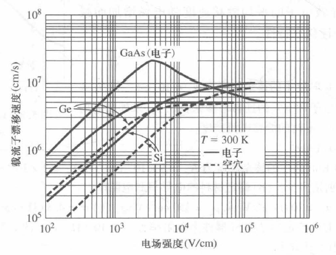

(a)
电场强度计算：$E = \frac{V}{L} = \frac{3}{1} = 3\ \text{V/cm}$

迁移率计算：$v_d = \mu_n E \Rightarrow \mu_n = \frac{v_d}{E} = \frac{10^4}{3}$

即：$\mu_n = 3333\ \text{cm}^2/\text{V·s}$

(b)
漂移速度计算：$v_d = \mu_n E = (800)(3)$

即：$v_d = 2.4 \times 10^3\ \text{cm/s}$

>[!note] 5-12
>一块杂质补偿半导体中，受主杂质和施主杂质的浓度恰好相等。设杂质全部电离，求 $T = 300\ K$ 时硅的电导率，杂质浓度分别为(a)$N_a = N_d=10^{14}\ cm^{-3}$；(b)$N_a = N_d = 10^{16}\ cm^{-3}$；(c)$N_a = N_d = 10^{18}\ cm^{-3}$。

>[!tip] 对高度补偿的半导体，电导率公式中的浓度使用本征载流子浓度，但是迁移率需要通过掺杂浓度查表
>$\rho = \frac{1}{e\mu_{n}n_{o} + e\mu_{p}p_{o}} = \frac{1}{e(\mu_{n} + \mu_{p})n_{i}}$

(a)
$N_{a} = N_{d} = 10^{14} \text{厘米}^{-3}$
$\Rightarrow \mu_{n} \cong 1350 \text{厘米}^{2}/\text{伏·秒}$
$\mu_{p} \cong 480 \text{厘米}^{2}/\text{伏·秒}$
$\rho = \frac{1}{(1.6\times 10^{-19})(1350+480)(1.5\times 10^{10})}$
$= 2.28\times 10^{5} \Omega cm$

(b) $N_{a} = N_{d} = 10^{16} \text{厘米}^{-3}$
$\Rightarrow \mu_{n} \cong 1250 \text{厘米}^{2}/\text{伏·秒}$
$\mu_{p} \cong 410 \text{厘米}^{2}/\text{伏·秒}$
$\rho = \frac{1}{(1.6\times 10^{-19})(1250+410)(1.5\times 10^{10})}$
$= 2.51\times 10^{5} \Omega cm$

(c) $N_{a} = N_{d} = 10^{18} \text{厘米}^{-3}$
$\Rightarrow \mu_{n} \cong 290 \text{厘米}^{2}/\text{伏·秒}$
$\mu_{p} \cong 130 \text{厘米}^{2}/\text{伏·秒}$
$\rho = \frac{1}{(1.6\times 10^{-19})(290+130)(1.5\times 10^{10})}$
$= 9.92\times 10^{5} \Omega cm$

>[!note] 5-13
>(a) p型砷化镓半导体在 $T=300K$ 时的电导率为 $\sigma=5(\Omega\cdot cm)^{-1}$，求热平衡时的电子和空穴浓度；
>(b) 对电阻率为 $\rho=8(\Omega\cdot cm)$ 的n型硅，重新计算(a)。

(a)
p型砷化镓的电导率公式：$\sigma \cong e\mu_{p}p_{o}$  
代入数值：$5 = (1.6\times10^{-19})\mu_{p}p_{o}$  
通过查表和试错法，我们得到：  
$p_{o} \cong 1.3\times10^{17} \text{ cm}^{-3}$  
$\mu_{p} \cong 240 \text{ cm}^{2}/\text{V}\cdot\text{s}$  
然后计算：  
$$n_{o} = \frac{n_{i}^{2}}{p_{o}} = \frac{(1.8\times10^{6})^{2}}{1.3\times10^{17}} = 2.49\times10^{-5} \text{ cm}^{-3}$$

(b)
硅的电导率公式：$\sigma = \frac{1}{\rho} \cong e\mu_{n}n_{o}$  
或者表示为：  $$n_{o} = \frac{1}{\rho e\mu_{n}} = \frac{1}{(8)(1.6\times10^{-19})(1350)}$$
计算得：  $n_{o} = 5.79\times10^{14} \text{ cm}^{-3}$  
以及：  $p_{o} = \frac{n_{i}^{2}}{n_{o}} = \frac{(1.5\times10^{10})^{2}}{5.79\times10^{14}} = 3.89\times10^{5} \text{ cm}^{-3}$  

>[!note] 5-14
>在一块某半导体材料中，$\mu_{n}=1000cm^{2}/V\cdot s$，$\mu_{p}=600cm^{2}/V\cdot s$，$N_{v}=N_{c}=10^{19}cm^{-3}$，且这些参数不随温度变化。测得 $T=300K$ 时本征电导率为 $\sigma=10^{-6}(\Omega\cdot cm)^{-1}$。求 $T=500K$ 时的电导率。

重点是本征电导率公式：$\sigma_{i}=en_{i}(\mu_{n}+\mu_{p})$和本征载流子浓度随温度变化的关系

本征电导率公式：$\sigma_{i}=en_{i}(\mu_{n}+\mu_{p})$

代入数值：$10^{-6}=(1.6\times 10^{-19})(1000+600)n_{i}$

计算得：$n_{i}(300\mathrm{~K})=3.91\times 10^{9}\mathrm{~cm}^{-3}$

利用本征载流子浓度公式：$n_{i}^{2}=N_{c}N_{v}\exp\left(\frac{-E_{g}}{kT}\right)$ 或者 $E_{g}=kT\ln\left(\frac{N_{c}N_{v}}{n_{i}^{2}}\right)$

计算500K时的本征载流子浓度：
$$n_{i}^{2}(500\mathrm{~K})=(10^{19})^{2}\exp\left[\frac{-1.122}{(0.0259)(500/300)}\right]=5.15\times 10^{26}$$

即：$n_{i}(500\mathrm{~K})=2.27\times 10^{13}\mathrm{~cm}^{-3}$

计算500K时的本征电导率：
$\sigma_{i}=(1.6\times 10^{-19})(2.27\times 10^{13})(1000+600)$

得到：$\sigma_{i}(500\mathrm{~K})=5.81\times 10^{-3}(\Omega-\mathrm{cm})^{-1}$

>[!note] 5-15
>(a) 求 $T=300K$ 时的电阻率，材料为本征(i)Si；(ii)Ge；(iii)GaAs；
>(b) 假设矩形长条半导体分别由(a)中的三种材料制成，横截面积为 $85\mu m^{2}$，长为 $200\mu m$，分别求它们的电阻。

>[!tip] 值得注意的是，此题的本征载流子迁移率等于 cheatsheet 上面的 300K、低掺杂的载流子迁移率

(a)
计算本征电导率：
(i) 硅：$\sigma_{i}=en_{i}(\mu_{n}+\mu_{p})$  
$\sigma_{i}=(1.6\times10^{-19})(1.5\times10^{10})(1350+480)$  
即 $\sigma_{i}=4.39\times10^{-6}(\Omega\cdot cm)^{-1}$

(ii) 锗：$\sigma_{i}=(1.6\times10^{-19})(2.4\times10^{13})(3900+1900)$  
即 $\sigma_{i}=2.23\times10^{-2}(\Omega\cdot cm)^{-1}$

(iii) 砷化镓：$\sigma_{i}=(1.6\times10^{-19})(1.8\times10^{6})(8500+400)$  
即 $\sigma_{i}=2.56\times10^{-9}(\Omega\cdot cm)^{-1}$

(b)
电阻计算公式：$R=\frac{L}{\sigma A}$

(i) 硅：$R=\frac{200\times 10^{-4}}{(4.39\times 10^{-6})(85\times 10^{-8})}=5.36\times 10^{9}\,\Omega$

(ii) 锗：$R=\frac{200\times 10^{-4}}{(2.23\times 10^{-2})(85\times 10^{-8})}=1.06\times 10^{6}\,\Omega$

(iii) 砷化镓：$R=\frac{200\times 10^{-4}}{(2.56\times 10^{-9})(85\times 10^{-8})}=9.19\times 10^{12}\,\Omega$

>[!note] 5-16
>n型硅样品在 $T=300K$ 时的电阻率为 $0.25(\Omega\cdot cm)^{-1}$。
>(a) 求施主杂质浓度和相应的电子迁移率；
>(b) 求在(i)$T=250K$ 和(ii)$T=400K$ 时的电阻率。

>[!tip] b 问的温度改变就可以从另一条曲线上查表了，都是查表得到，没什么区别。

(a)
电导率公式：$\sigma = e\mu_{n}N_{d}$  ，代入数值：$0.25 = (1.6\times10^{-19})\mu_{n}N_{d}$  
查表可知，当 $N_{d} = 1.2\times10^{15}cm^{-3}$ 时，$\mu_{n} \cong 1300cm^{2}/V\cdot s$  
计算得：$\sigma = (1.6\times10^{-19})(1300)(1.2\times10^{15}) = 0.2496(\Omega\cdot cm)^{-1}$

(b)
换张表接着查：

(i) 当 $T = 250K(-23^{\circ}C)$ 时，$\mu_{n} \cong 1800cm^{2}/V\cdot s$  
计算得：$\sigma = (1.6\times10^{-19})(1800)(1.2\times10^{15}) = 0.346(\Omega\cdot cm)^{-1}$

(ii) 当 $T = 400K(127^{\circ}C)$ 时，$\mu_{n} \cong 670cm^{2}/V\cdot s$  
计算得：$\sigma = (1.6\times10^{-19})(670)(1.2\times10^{15}) = 0.129(\Omega\cdot cm)^{-1}$

>[!note] 5-17
>某半导体层电导率随深度变化函数为 $\sigma(x)=\sigma_{o}\exp(-x/d)$，其中 $\sigma_{o}=20(\Omega\cdot cm)^{-1}$，$d=0.3\mu m$。假设半导体层的厚度为 $t=1.5\mu m$，求该半导体层的平均电导率。

属于是考察定积分的能力了，懒得算了，直接看答案吧😛。

平均电导率：$\sigma_{\text{avg}} = \frac{1}{t} \int_{0}^{t} \sigma(x) dx = \frac{1}{t} \int_{0}^{t} \sigma_{o} \exp \left( \frac{-x}{d} \right) dx$

积分计算：$\sigma_{\text{avg}} = \frac{\sigma_{o}}{t} (-d) \exp \left( \frac{-x}{d} \right) \Bigg|_{0}^{t}$

化简得：$\sigma_{\text{avg}} = \frac{-\sigma_{o} d}{t} \left[ \exp \left( \frac{-t}{d} \right) - 1 \right]$

代入数值：$\sigma_{o} = 20 (\Omega-\text{cm})^{-1}$，$d = 0.3$，$t = 1.5$

计算：$\sigma_{\text{avg}} = \frac{(20)(0.3)}{(1.5)} \left[ 1 - \exp \left( \frac{-1.5}{0.3} \right) \right]$

最终结果：$\sigma_{\text{avg}} = 3.97 (\Omega-\text{cm})^{-1}$

>[!note] 5-18
>某n型硅电阻器长 $L=150\mu m$，宽 $W=7.5\mu m$，厚 $T=1\mu m$。在电阻器的长度方向加一个 $2V$ 的电压，施主杂质浓度随电阻器的厚度呈线性变化，上表面为 $N_{d}=2\times10^{16}cm^{-3}$，下表面为 $N_{d}=2\times10^{15}cm^{-3}$。假设平均载流子迁移率为 $\mu_{n}=750cm^{2}/V\cdot s$。
>(a) 求电阻器中的电场强度；
>(b) 求硅的平均电导率；
>(c) 求电阻器的电流；
>(d) 分别求出接近顶部表面和接近底部表面的电流密度。

重点在于 b 问，还是积分求平均，不过鉴于这道题是线性关系，所以可以用作图法什么的简化一下。

(a)
电场强度计算：$E = \frac{V}{L} = \frac{2}{150 \times 10^{-4}} = 133.3 \text{ V/cm}$

(b) 平均电导率计算：
$\sigma(x) = e\mu_{n}N_{d}(x)$
$\sigma_{\text{avg}} = e\mu_{n} \cdot \frac{1}{T} \int_{0}^{T} (2 \times 10^{16})(1 - \frac{x}{1.111T}) dx$
$= \frac{e\mu_{n}(2 \times 10^{16})}{T} \left[ x - \frac{x^{2}}{2(1.111T)} \right]_{0}^{T}$
$= \frac{e\mu_{n}(2 \times 10^{16})}{T} \left[ T - \frac{T^{2}}{2(1.111T)} \right]$
$= e\mu_{n}(2 \times 10^{16})(0.55)$
$= (1.6 \times 10^{-19})(750)(2 \times 10^{16})(0.55)$
$\sigma_{\text{avg}} = 1.32 (\Omega\text{-cm})^{-1}$

(c) 电流计算：
$I = \frac{\sigma_{\text{avg}}A}{L} \cdot V = \frac{(1.32)(7.5 \times 10^{-4})(10^{-4})}{150 \times 10^{-4}} \cdot 2$
$= 1.32 \times 10^{-5} \text{ A}$
即 $I = 13.2 \mu\text{A}$

(d)
顶面：
$\sigma = (1.6 \times 10^{-19})(750)(2 \times 10^{16}) = 2.4 (\Omega\text{-cm})^{-1}$
$J = \sigma E = (2.4)(133.3) = 320 \text{ A/cm}^{2}$

底面：
$\sigma = (1.6 \times 10^{-19})(750)(2 \times 10^{15}) = 0.24 (\Omega\text{-cm})^{-1}$
$J = \sigma E = (0.24)(133.3) = 32 \text{ A/cm}^{2}$

>[!note] 5-19
> 硅中的掺杂浓度为 $N_{d}=2\times10^{16}cm^{-3}$，$N_{a}=0$。电子漂移速度与电场强度关系的经验公式为 $v_{d}=\frac{\mu_{n0}E}{\sqrt{1+(\frac{\mu_{n0}E}{v_{sat}})^{2}}}$，其中 $\mu_{n0}=1350cm^{2}/V\cdot s$，$v_{sat}=1.8\times10^{7}cm/s$，电场强度的单位为 $V/cm$。试用对数坐标画出 $0\leqslant E\leqslant10^{6}V/cm$ 范围内漂移电流密度-电场强度(log-log坐标)的关系曲线。

漂移速度的公式复杂化了（体现出来漂移速度不只是简单的线性关系运算，而是随电场强度的增大趋近于一个极限值 -- 饱和速度），图源自元宝：

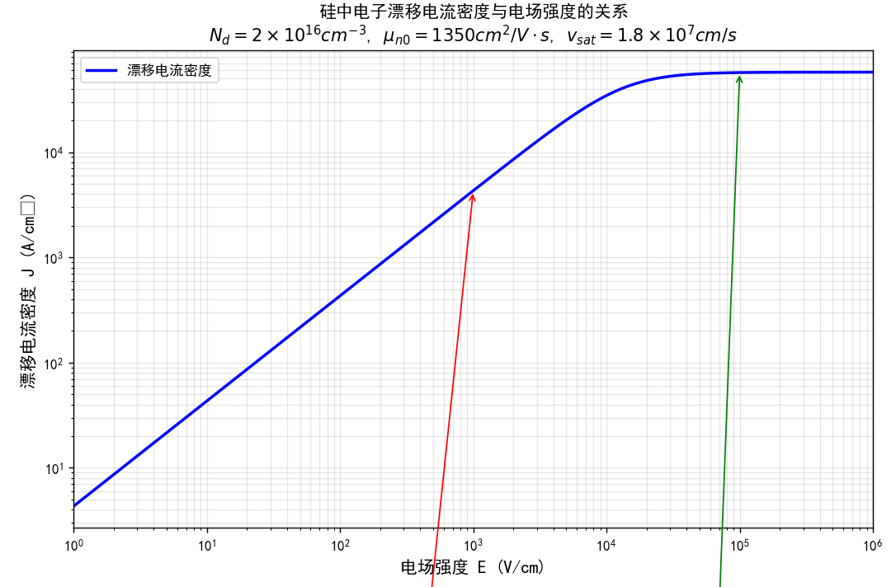

>[!note] 5-20
>$T=300K$ 时，硅中的电子迁移率为 $\mu_{n}=1350cm^{2}/V\cdot s$，导带中电子的动能为 $(1/2)m_{n}^{*}v_{d}^{2}$，其中 $m_{n}^{*}$ 为有效质量，$v_{d}$ 为漂移速度。求外加电场为(a)$10V/cm$ 和(b)$1kV/cm$ 时导带中电子的动能。

代数即可。

(a)
电场强度 $E=10\ \text{V/cm}$  
漂移速度计算：$v_d = \mu_n E = (1350)(10) = 1.35 \times 10^4\ \text{cm/s}$  
或表示为：$v_d = 1.35 \times 10^2\ \text{m/s}$  
平均动能计算：$T = \frac{1}{2} m_n^* v_d^2$  
代入数值：$T = \frac{1}{2}(1.08)(9.11 \times 10^{-31})(1.35 \times 10^2)^2$  
计算结果：$T = 8.97 \times 10^{-27}\ \text{J} \Rightarrow 5.60 \times 10^{-8}\ \text{eV}$

(b)
电场强度 $E=1\ \text{kV/cm}$  
漂移速度计算：$v_d = (1350)(1000) = 1.35 \times 10^6\ \text{cm/s}$  
或表示为：$v_d = 1.35 \times 10^4\ \text{m/s}$  
平均动能计算：$T = \frac{1}{2}(1.08)(9.11 \times 10^{-31})(1.35 \times 10^4)^2$  
计算结果：$T = 8.97 \times 10^{-23}\ \text{J} \Rightarrow 5.60 \times 10^{-4}\ \text{eV}$

>[!note] 5-21
>考虑一个均匀掺杂的半导体，其参数为 $N_{d}=10^{14}cm^{-3}$，$N_{a}=0$。外加电场 $E=100V/cm$。设 $\mu_{n}=1000cm^{2}/V\cdot s$，$\mu_{p}=0$。假设有以下参数：
$N_{c}=2\times10^{19}(T/300)^{3/2}cm^{-3}$
$N_{v}=1\times10^{19}(T/300)^{3/2}cm^{-3}$
$E_{g}=1.10eV$
(a) 求 $T=300K$ 时的电子电流密度；(b) 在温度为多少时，电流将增加 $5\%$ (设迁移率与温度无关)？

>本题主要考查漂移电流密度的计算。对于(b)小问，试错法属于数值解法，通常无需手算掌握，实际应用中可借助计算机进行数值求解。

(a)
本征载流子浓度公式：$n_{i}^{2} = N_{c} N_{v} \exp\left(\frac{-E_{g}}{kT}\right)$

代入数值计算：$n_{i}^{2} = (2 \times 10^{19})(1 \times 10^{19}) \exp\left(\frac{-1.10}{0.0259}\right) = 7.18 \times 10^{19}$

即：$n_{i} = 8.47 \times 10^{9} \text{ cm}^{-3}$

由 $N_{d} = 10^{14} \text{ cm}^{-3} \gg n_{i}$ ，有 $n_{o} = 10^{14} \text{ cm}^{-3}$

电流密度计算：$J = \sigma E = e\mu_{n} n_{o} E$

代入数值：$J = (1.6 \times 10^{-19})(1000)(10^{14})(100)$

计算结果：$J = 1.60 \text{ A/cm}^{2}$

(b) 电流增加5%是由于电子浓度增加了5%，所以
$n_{o} = 1.05 \times 10^{14} = \frac{N_{d}}{2} + \sqrt{\left(\frac{N_{d}}{2}\right)^{2} + n_{i}^{2}}$

整理得：$(1.05 \times 10^{14} - 5 \times 10^{13})^{2} = (5 \times 10^{13})^{2} + n_{i}^{2}$

解得：$n_{i}^{2} = 5.25 \times 10^{26}$

代入公式：$n_{i}^{2} = (2 \times 10^{19})(1 \times 10^{19}) \left(\frac{T}{300}\right)^{3} \exp\left(\frac{-E_{g}}{kT}\right)$

即：$2.625 \times 10^{-12} = \left(\frac{T}{300}\right)^{3} \exp\left[\frac{-1.10}{(0.0259)(T/300)}\right]$

通过试错法求解，得到：$T = 456 \text{ K}$

>[!note] 5-22（了解即可）
>半导体材料的电子和空穴迁移率分别为 $\mu_{n}$ 和 $\mu_{p}$，电导率 $\rho_{0}$ 是空穴浓度的函数。
>(a) 证明电导率的最小值为
$\sigma_{\min}=\frac{2\sigma_{i}(\mu_{n}\mu_{p})^{1/2}}{(\mu_{n}+\mu_{p})}$
其中 $\sigma_{i}$ 为本征半导体；(b) 证明其对应的空穴浓度为 $p_{0}=n_{i}(\mu_{n}/\mu_{p})^{1/2}$。

>先根据电导率的公式将 $n_o$ 用 $N_d$、$n_i$、$p_o$ 等表达出来，再利用质量作用定律和已知条件推导出 $p_o$ 的表达式，最后代入公式即可。

(a)

电导率的公式为

$$
\sigma = e\mu_{n}n_{o} + e\mu_{p}p_{o}
$$

其中 $n_{o} = \dfrac{n_{i}^{2}}{p_{o}}$，代入后可得

$$
\sigma = \frac{e\mu_{n}n_{i}^{2}}{p_{o}} + e\mu_{p}p_{o}
$$

要求电导率的最小值，对 $p_{o}$ 求导并令其为零：

$$
\frac{d\sigma}{dp_{o}} = 0 = -\frac{e\mu_{n}n_{i}^{2}}{p_{o}^{2}} + e\mu_{p}
$$

解得

$$
p_{o} = n_{i}\left(\frac{\mu_{n}}{\mu_{p}}\right)^{1/2}
$$

将 $p_{o}$ 代入电导率表达式，得到最小电导率：

$$
\sigma_{\min} = \frac{e\mu_{n}n_{i}^{2}}{n_{i}(\mu_{n}/\mu_{p})^{1/2}} + e\mu_{p}\left[n_{i}(\mu_{n}/\mu_{p})^{1/2}\right]
$$

化简后为

$$
\sigma_{\min} = 2en_{i}\sqrt{\mu_{n}\mu_{p}}
$$

本征电导率定义为

$$
\sigma_{i} = en_{i}(\mu_{n}+\mu_{p})
$$

因此有

$$
en_{i} = \frac{\sigma_{i}}{\mu_{n}+\mu_{p}}
$$

最终，最小电导率可以表示为

$$
\sigma_{\min} = \frac{2\sigma_{i}\sqrt{\mu_{n}\mu_{p}}}{\mu_{n}+\mu_{p}}
$$

>[!note] 5-23
>考虑 $T=300K$ 时的三个硅样本。n 型样本中砷原子的掺杂浓度为 $N_{d}=5\times 10^{16}cm^{-3}$。p 型样本中硼原子的掺杂浓度为 $N_{a}=2\times 10^{16}cm^{-3}$。补偿半导体样本掺杂了上述两种样本的施主和受主杂质。
>(a) 求每个样本中的平衡电子和空穴浓度；
>(b) 求每个样本中的多数载流子迁移率；
>(c) 求每个样本中的电导率；
>(d) 假设需产生 $J=120A/cm^{2}$ 的漂移电流密度，求每个样品中所需的电场。

(a)  
**平衡电子和空穴浓度计算：**

- **n型半导体**  
    电子浓度：  
    $$
    n_{o} = N_{d} = 5 \times 10^{16} \ \text{cm}^{-3}
    $$
    空穴浓度：  
    $$
    p_{o} = \frac{n_{i}^{2}}{n_{o}} = \frac{(1.5 \times 10^{10})^{2}}{5 \times 10^{16}} = 4.5 \times 10^{3} \ \text{cm}^{-3}
    $$

- **p型半导体**  
    空穴浓度：  
    $$
    p_{o} = N_{a} = 2 \times 10^{16} \ \text{cm}^{-3}
    $$
    电子浓度：  
    $$
    n_{o} = \frac{(1.5 \times 10^{10})^{2}}{2 \times 10^{16}} = 1.125 \times 10^{4} \ \text{cm}^{-3}
    $$

- **补偿半导体**  
    电子浓度：  
    $$
    n_{o} = N_{d} - N_{a} = 5 \times 10^{16} - 2 \times 10^{16} = 3 \times 10^{16} \ \text{cm}^{-3}
    $$
    空穴浓度：  
    $$
    p_{o} = \frac{(1.5 \times 10^{10})^{2}}{3 \times 10^{16}} = 7.5 \times 10^{3} \ \text{cm}^{-3}
    $$

---

(b)  
**多数载流子迁移率（查表得）：**

- n型：$\mu_{n} \approx 1100 \ \text{cm}^{2}/(\text{V}\cdot\text{s})$
- p型：$\mu_{p} \approx 400 \ \text{cm}^{2}/(\text{V}\cdot\text{s})$
- 补偿型：$\mu_{n} \approx 1000 \ \text{cm}^{2}/(\text{V}\cdot\text{s})$

---

(c)  
**电导率计算：**

- n型：
    $$
    \sigma = e \mu_{n} n_{o} = (1.6 \times 10^{-19}) \times 1100 \times 5 \times 10^{16} = 8.8 \ (\Omega\cdot\text{cm})^{-1}
    $$
- p型：
    $$
    \sigma = e \mu_{p} p_{o} = (1.6 \times 10^{-19}) \times 400 \times 2 \times 10^{16} = 1.28 \ (\Omega\cdot\text{cm})^{-1}
    $$
- 补偿型：
    $$
    \sigma = e \mu_{n} n_{o} = (1.6 \times 10^{-19}) \times 1000 \times 3 \times 10^{16} = 4.8 \ (\Omega\cdot\text{cm})^{-1}
    $$

---

(d)  
**达到 $J = 120 \ \text{A/cm}^2$ 所需的电场强度：**

- n型：
    $$
    E = \frac{J}{\sigma} = \frac{120}{8.8} = 13.6 \ \text{V/cm}
    $$
- p型：
    $$
    E = \frac{120}{1.28} = 93.75 \ \text{V/cm}
    $$
- 补偿型：
    $$
    E = \frac{120}{4.8} = 25 \ \text{V/cm}
    $$

>[!note] 5-24
>特定半导体内存在三种散射机制。只存在第一种散射机制时的迁移率为 $\mu_{1}=2000cm^{2}/V\cdot s$，只存在第二种散射机制时的迁移率为 $\mu_{2}=1500cm^{2}/V\cdot s$，只存在第三种散射机制时的迁移率为 $\mu_{3}=500cm^{2}/V\cdot s$。求总迁移率。

这里就是考察总迁移率公式和各散射机制迁移率之间的关系了（倒数相加公式）。

>[!note] 5-25
>在 $T=300K$ 时，硅中的电子迁移率为 $\mu_n=1300\ \text{cm}^2/\text{V·s}$。设迁移率由晶格散射决定，且 $\mu_n$ 随 $T^{-3/2}$ 变化。求 (a) $T=200K$ 和 (b) $T=400K$ 时的电子迁移率。

典型的声子散射机制

>[!note] 5-26
>某半导体内存在两种散射机制。只存在第一种散射机制时的迁移率为 $250\ \text{cm}^2/\text{V·s}$，只存在第二种散射机制时的迁移率为 $500\ \text{cm}^2/\text{V·s}$。求两种散射机制同时存在时的总迁移率。

依然是总迁移率计算公式。

#### 5.2 载流子扩散（对应PPT 1.3b）

>[!note] 5-29
>当 $T = 300K$ 时，硅样品的电子浓度随距离线性变化，如图所示。扩散电流密度 $J_{n} = 0.19A/cm^{2}$。设电子扩散系数 $D_{n} = 25cm^{2}/s$，求 $x = 0$ 处的电子浓度。

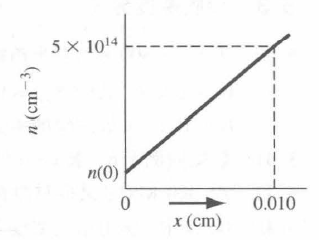
此题是线性关系，所以梯度比较好求。

电子扩散电流密度公式：$J_{n} = eD_{n} \frac{dn}{dx} = eD_{n} \left( \frac{5 \times 10^{14} - n(0)}{0.01 - 0} \right)$

代入数值：$0.19 = (1.6 \times 10^{-19})(25) \left( \frac{5 \times 10^{14} - n(0)}{0.010} \right)$

整理计算：$\frac{(0.19)(0.010)}{(1.6 \times 10^{-19})(25)} = 5 \times 10^{14} - n(0)$

解得：$n(0) = 0.25 \times 10^{14} \text{ cm}^{-3}$

>[!note] 5-30
>硅中电子的稳态分布近似为 $x$ 的线性函数。最大电子浓度为 $x = 0$ 处的 $n(0) = 2 \times 10^{16}cm^{-3}$。在 $x = 0.012cm$ 处的电子浓度为 $5 \times 10^{15}cm^{-3}$。假设电子扩散系数为 $D_{n} = 27cm^{2}/s$，求电子扩散电流密度。

电子扩散电流密度公式：$J_{n} = e D_{n} \frac{dn}{dx} = e D_{n} \frac{\Delta n}{\Delta x}$

代入数值计算：$J_{n} = (1.6 \times 10^{-19})(27) \left[ \frac{2 \times 10^{16} - 5 \times 10^{15}}{0 - 0.012} \right]$

计算结果：$J_{n} = -5.4 \text{ A/cm}^{2}$

>[!note] 5-31
>某硅材料的电子扩散电流密度为 $J_{n} = -2A/cm^{2}$ 的常数。$x = 0$ 处的电子浓度为 $n(0) = 10^{15}cm^{-3}$。(a) 假设硅材料有 $D_{n} = 30cm^{2}/s$，求 $x = 20\mu m$ 处的电子浓度；(b) 假设此材料为 GaAs 且 $D_{n} = 230cm^{2}/s$，求 $x = 20\mu m$ 处的电子浓度。

没说但是假设是线性关系。

(a)
电子扩散电流密度公式：$J_{n} = eD_{n} \frac{dn}{dx} = eD_{n} \frac{\Delta n}{\Delta x}$  
代入数值：$-2 = (1.6 \times 10^{-19})(30) \left[ \frac{10^{15} - n(x_{1})}{0 - 20 \times 10^{-4}} \right]$  
计算得：$4 \times 10^{-3} = 4.8 \times 10^{-3} - 4.8 \times 10^{-18} n(x_{1})$  
解得：$n(x_{1}) = 1.67 \times 10^{14} \text{ cm}^{-3}$

(b)
电子扩散电流密度公式：$J_{n} = eD_{n} \frac{dn}{dx} = eD_{n} \frac{\Delta n}{\Delta x}$  
代入数值：$-2 = (1.6 \times 10^{-19})(230) \left[ \frac{10^{15} - n(x_{1})}{0 - 20 \times 10^{-4}} \right]$  
计算得：$4 \times 10^{-3} = 3.68 \times 10^{-2} - 3.68 \times 10^{-17} n(x_{1})$  
解得：$n(x_{1}) = 8.91 \times 10^{14} \text{ cm}^{-3}$

>[!note] 5-32
>p 型 GaAs 材料中的空穴浓度为 $p(x) = 10^{16}(1 + x/L)^{2}cm^{-3}$，$-L \le x \le 0$，其中 $L = 12\mu m$。空穴扩散系数为 $D_{p} = 10cm^{2}/s$，求以下情况的空穴扩散电流密度：(a) $x = 0$；(b) $x = -6\mu m$；(c) $x = -12\mu m$。

空穴扩散电流密度公式：$J_{p} = -eD_{p}\left(\frac{dp}{dx}\right) = -eD_{p}\left(\frac{d}{dx}\left[10^{16}\left(1+\frac{x}{L}\right)^{2}\right]\right)$

化简得：$J_{p} = -eD_{p} \cdot \frac{10^{16}}{L} \cdot 2\left(1+\frac{x}{L}\right)$

(a) 当 $x=0$ 时，
$J_{p} = \frac{-(1.6\times 10^{-19})(10)(10^{16})(2)}{12\times 10^{-4}}$
$J_{p} = -26.7\ \text{A/cm}^{2}$

(b) 当 $x=-6\ \mu m$ 时，
$J_{p} = \frac{-(1.6\times 10^{-19})(10)(10^{16})(2)\left(1-\frac{6}{12}\right)}{12\times 10^{-4}}$
$J_{p} = -13.3\ \text{A/cm}^{2}$

(c) 当 $x=-12\ \mu m$ 时，
$J_{p} = 0$

>[!note] 5-33
>某硅材料，电子浓度为 $n(x) = 10^{15}e^{-x/L_{n}}cm^{-3}$，$x \ge 0$；空穴浓度为 $p(x) = 5\times 10^{15}e^{+x/L_{p}}cm^{-3}$，$x \le 0$。其中参数值为 $L_{n} = 2\times 10^{-3}cm$，$L_{p} = 5\times 10^{-4}cm$。电子和空穴扩散系数分别为 $D_{n} = 25cm^{2}/s$，$D_{p} = 10cm^{2}/s$。定义总电流密度为 $x = 0$ 处的电子和空穴扩散电流密度的总和。求总电流密度。

对于电子：
$$J_{n} = eD_{n}\frac{dn}{dx} = eD_{n}\frac{d}{dx}\left[10^{15}e^{-x/L_{n}}\right] = \frac{-eD_{n}(10^{15})e^{-x/L_{n}}}{L_{n}}$$

当 $x=0$ 时，
$$J_{n} = \frac{-(1.6\times 10^{-19})(25)(10^{15})}{2\times 10^{-3}} = -2 \text{ A/cm}^{2}$$

对于空穴：
$$J_{p} = -eD_{p}\frac{dp}{dx} = -eD_{p}\frac{d}{dx}\left[5\times 10^{15}e^{+x/L_{p}}\right] = \frac{-eD_{p}(5\times 10^{15})e^{+x/L_{p}}}{L_{p}}$$

当 $x=0$ 时，
$$J_{p} = \frac{-(1.6\times 10^{-19})(10)(5\times 10^{15})}{5\times 10^{-4}} = -16 \text{ A/cm}^{2}$$

总电流密度：
$$J_{\text{总}} = J_{n}(x=0) + J_{p}(x=0) = -2 + (-16) = -18 \text{ A/cm}^{2}$$

#### 6.1 载流子的产生和复合（对应PPT 1.4a）

>[!note] 6-1
>$T=300\ \text{K}$ 时某硅材料中施主杂质浓度为 $N_d = 5 \times 10^{15}\ \text{cm}^{-3}$, 过剩载流子的寿命为 $2 \times 10^{-7}\ \text{s}$。 (a)求热平衡空穴复合率；(b)若过剩载流子浓度为 $\delta n = \delta p = 10^{14}\ \text{cm}^{-3}$, 则这种情况下的空穴（总）复合率是多少?

关键就是过剩载流子寿命 = 少子寿命，所以空穴的寿命也就是 $2 \times 10^{-7}\ \text{s}$。

已知载流子浓度如下：

$$
n_{o} = N_{d} = 5 \times 10^{15}\ \text{cm}^{-3}
$$

$$
p_{o} = \frac{n_{i}^{2}}{N_{d}} = \frac{(1.5 \times 10^{10})^{2}}{5 \times 10^{15}} = 4.5 \times 10^{4}\ \text{cm}^{-3}
$$

（a）热平衡下的空穴复合率为

$$
\tau_{p0} = 2 \times 10^{-7}\ \text{s}
$$

$$
R_{po} = \frac{p_{o}}{\tau_{p0}} = \frac{4.5 \times 10^{4}}{2 \times 10^{-7}} = 2.25 \times 10^{11}\ \text{cm}^{-3} \cdot \text{s}^{-1}
$$

（b）当存在过剩载流子时，空穴的总复合率为

$$
R'_{po} = \frac{p_{o} + \delta p}{\tau_{p0}} = \frac{4.5 \times 10^{4} + 10^{14}}{2 \times 10^{-7}} = 5 \times 10^{20}\ \text{cm}^{-3} \cdot \text{s}^{-1}
$$

>[!note] 6-2
>$T = 300\ K$ 时 GaAs 材料中均匀掺受主杂质浓度为 $N_a = 2\times 10^{16}\ \mathrm{cm}^{-3}$，设过剩载流子的寿命为 $5\times 10^{-7}\ s$。(a) 假设过剩电子浓度为 $\delta n = 5\times 10^{14}\ \mathrm{cm}^{-3}$，求电子-空穴复合率；(b) 利用(a)中的结果，求空穴的寿命。

$$p_o = N_a = 2 \times 10^{16} \text{ cm}^{-3}$$  
$$n_o = \frac{n_i^2}{p_o} = \frac{(1.8 \times 10^6)^2}{2 \times 10^{16}} = 1.62 \times 10^{-4} \text{ cm}^{-3}$$  

(a)
电子-空穴复合率：$$R' = \frac{\delta n}{\tau_{n0}} = \frac{5 \times 10^{14}}{5 \times 10^{-7}} = 10^{21} \text{ cm}^{-3} \cdot \text{s}^{-1}$$  

(b)
空穴寿命计算：  
$$R_p = \frac{p_o}{\tau_{pt}} = \frac{n_o}{\tau_{nt}} = \frac{n_o}{\tau_{n0}}$$  
$$\tau_{pt} = \frac{p_o}{n_o} \cdot \tau_{n0} = \frac{(2 \times 10^{16})}{(1.62 \times 10^{-4})} \cdot (5 \times 10^{-7}) = 6.17 \times 10^{13} \text{ s}$$

>[!tip]
>
>$R'$， $R_{po}$， $R'_{po}$的区别：
>
>
>
>| 符号           | 物理状态       | 物理意义                   | 计算公式（以p型半导体为例）                          | 与其它量的关系               |
>| ------------ | ---------- | ---------------------- | --------------------------------------- | --------------------- |
>| `R_po`​  | **热平衡**​   | 热平衡时的复合率（等于产生率）        | `R_po = n_o / τ_n0`                     | `R_po = G_o`          |
>| `R’`​    | **非平衡稳态**​ | 由**过剩载流子**产生的**附加**复合率 | `R’ = δn / τ_n0`                        | 稳态时，`R’ = G_L`(外界产生率) |
>| `R'_po`​ | **非平衡稳态**​ | **非平衡时的总复合率**​         | `R'_po = (p_o + δp) / τ_pt ≈ R_po + R’` | 小注入下，`R'_po ≈ R’`  （本身的产生率和复合率就很小）   |

>[!note] 6-3
>$n$ 型半导体样品的施主浓度为 $N_d = 10^{16}\ \mathrm{cm}^{-3}$。少子空穴的寿命为 $\tau_{p0} = 20\ \mu s$。(a) 多子电子的寿命是多少？(b) 确定材料中电子和空穴的热平衡产生率；(c) 确定材料中电子和空穴的热平衡复合率。

(a)
跟据复合率相等的特性：
$$\frac{n_{o}}{\tau_{nO}} = \frac{p_{o}}{\tau_{pO}}$$

$$n_{o} = N_{d} = 10^{16} \text{ cm}^{-3}$$

$$p_{o} = \frac{n_{i}^{2}}{n_{o}} = \frac{(1.5 \times 10^{10})^{2}}{10^{16}} = 2.25 \times 10^{4} \text{ cm}^{-3}$$

于是有：
$$\frac{10^{16}}{\tau_{nO}} = \frac{2.25 \times 10^{4}}{20 \times 10^{-6}}$$

解得：
$$\tau_{nO} = 8.89 \times 10^{+6} \text{ s}$$

(b) 产生率 = 复合率：
$$G = \frac{2.25 \times 10^{4}}{20 \times 10^{-6}} = 1.125 \times 10^{9} \text{ cm}^{-3} \cdot \text{s}^{-1}$$

(c) 复合率等于产生率：
$$R = G = 1.125 \times 10^{9} \text{ cm}^{-3} \cdot \text{s}^{-1}$$

>[!note] 6-4（了解即可）
>(a) 半导体样品的横截面积为 $1\ \mathrm{cm}^2$，厚度为 $0.1\ \mathrm{cm}$。当样品均匀吸收了波长为 $6300\mathrm{A}$ 的 $1\ \mathrm{W}$ 光以后，单位体积单位时间内产生的电子-空穴对的数量是多少？假设每一个光子对应一个电子-空穴对；(b) 如果过剩少子的寿命为 $10\ \mu s$，那么稳态过剩载流子的浓度是多少？

>已知光的波长，首先可以计算单个光子的能量，然后根据总光功率求出单位时间内的光子数，进而得到单位时间内产生的电子-空穴对数（即产生率）。再结合样品体积，可以得到单位体积单位时间的产生率。对于稳态条件下的过剩载流子浓度，则用产生率乘以载流子寿命即可。

---

**(a) 单位体积单位时间内产生的电子-空穴对数**

光子能量计算：

$$
E = h\nu = \frac{hc}{\lambda} = \frac{6.625 \times 10^{-34} \times 3 \times 10^{8}}{6300 \times 10^{-10}} = 3.15 \times 10^{-19}\ \text{J}
$$

1 W 的光功率对应的光子数为：

$$
\text{每秒光子数} = \frac{1\ \text{J/s}}{3.15 \times 10^{-19}\ \text{J}} = 3.17 \times 10^{18}\ \text{个/s}
$$

样品体积为：

$$
V = 1\ \text{cm}^2 \times 0.1\ \text{cm} = 0.1\ \text{cm}^3
$$

因此，单位体积单位时间内产生的电子-空穴对数（产生率）为：

$$
g = \frac{3.17 \times 10^{18}}{0.1} = 3.17 \times 10^{19}\ \text{对}/(\text{cm}^3 \cdot \text{s})
$$

---

**(b) 稳态下的过剩载流子浓度**

假设过剩少子的寿命为 $10\ \mu\text{s} = 10 \times 10^{-6}\ \text{s}$，则稳态下的过剩载流子浓度为：

$$
\delta n = \delta p = g \tau = (3.17 \times 10^{19}) \times (10 \times 10^{-6}) = 3.17 \times 10^{14}\ \text{cm}^{-3}
$$

#### 6.2 过剩载流子的性质

>[!note] 6-5（了解即可）
>根据空穴连续性方程和空穴流密度方程推导式(6.27)。

这个是纯数学推导了，有一定的技巧性。

我们有：
$$ \frac{\partial p}{\partial t}=-\nabla \cdot F_{p}^{+}+g_{p}-\frac{p}{\tau_{p}} $$
以及电流密度（空穴部分）
$$ J_{p}=e \mu_{p} p E-e D_{p} \nabla p $$
空穴粒子电流密度为
$$ F_{p}^{+}=\frac{J_{p}}{(+e)}=\mu_{p} p E-D_{p} \nabla p $$
现在
$$ \nabla \cdot F_{p}^{+}=\mu_{p} \nabla \cdot(p E)-D_{p} \nabla \cdot \nabla p $$
我们可以写出
$$ \nabla \cdot(p E)=E \cdot \nabla p+p \nabla \cdot E $$
以及
$$ \nabla \cdot \nabla p=\nabla^{2} p $$
所以
$$ \nabla \cdot F_{p}^{+}=\mu_{p}(E \cdot \nabla p+p \nabla \cdot E)-D_{p} \nabla^{2} p $$
然后
$$
\begin{aligned}
\frac{\partial p}{\partial t} = -\mu_p &\left(E \cdot \nabla p + p \nabla \cdot E\right) \\
& + D_p \nabla^2 p + g_p - \frac{p}{\tau_p}
\end{aligned}
$$
然后我们可以写成
$$
D_p \nabla^2 p - \mu_p \left(E \cdot \nabla p + p \nabla \cdot E\right) + g_p - \frac{p}{\tau_p} = \frac{\partial p}{\partial t}
$$

>[!note] 6-6
>一维空穴流如图所示。如果微分元中空穴的产生率为 $g_{p}=10^{20} \ \mathrm{cm}^{-3} \cdot \mathrm{s}^{-1}$，复合率为 $2 \times 10^{19} \ \mathrm{cm}^{-3} \cdot \mathrm{s}^{-1}$，要想保持稳态的空穴浓度，那么粒子流密度的梯度为多少？
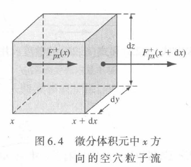

因为要维持稳定的空穴浓度，就是 $\frac{\partial p}{\partial t} = 0$ ，再代入上面的连续性方程：
$$
 \frac{\partial p}{\partial t}=-\nabla \cdot F_{p}^{+}+g_{p}-\frac{p}{\tau_{p}}
 $$
 粒子流密度就是指$F_{p}^{+}$，把产生率和复合率代入就行：

由方程(6.18)可得：
$$\frac{\partial p}{\partial t} = -\nabla \cdot F_{p}^{+} + g_{p} - \frac{p}{\tau_{p}}$$

在稳态条件下，$\frac{\partial p}{\partial t} = 0$

于是有：
$$0 = -\nabla \cdot F_{p}^{+} + g_{p} - R_{p}$$
对于一维情况（只对 $x$ 求偏导）：
$$\frac{dF_{p}^{+}}{dx} = g_{p} - R_{p} = 10^{20} - 2 \times 10^{19}$$
即：
$$\frac{dF_{p}^{+}}{dx} = 8 \times 10^{19} \text{ cm}^{-3} \text{ s}^{-1}$$

>[!note] 6-7
>假设产生率变为零，重复上题的计算。

只不过是给产生率$g$换了个数，用复合率$r$来抵消粒子流密度梯度

#### 6.3 双极输运

>[!note] 6-8
>根据式(6.29)和式(6.30)给出的连续性方程（就是6-5推导出来的式子），推导双极输运方程式(6.39)。

略，纯纯数学技巧，只需要了解双极输运方程是：

$$D' \nabla^{2}(\delta n) + \mu' \mathbf{E} \cdot \nabla(\delta n) + (g - R) = \frac{\partial(\delta n)}{\partial t}$$

#### 6.4 准费米能级（对应PPT 1.4b）

基本上全是准费米能级的那两个公式，做一道就基本上掌握了。

>[!note] 6-30
>掺杂浓度为 $N_d = 4 \times 10^{15} \text{cm}^{-3}$ 的 n 型硅样品，在稳定光照下的产生率为 $g' = 2 \times 10^{21} \text{cm}^{-3} \cdot \text{s}^{-1}$。假设 $\tau_{n0} = 10^{-6} \text{s}$，$\tau_{p0} = 5 \times 10^{-7} \text{s}$。(a) 求热平衡下 $E_F - E_{Fi}$ 的值；(b) 计算电子和空穴相对于 $E_{Fi}$ 的准费米能级；(c) $E_{Fn}$ 和 $E_F$ 之间的差别是多少 (eV)？

(a)
费米能级与本征费米能级之差：
$$E_F - E_{Fi} = kT \ln \left( \frac{n_o}{n_i} \right)= (0.0259) \ln \left( \frac{4 \times 10^{16}}{1.5 \times 10^{10}} \right)= 0.383225eV$$

(b) 过剩载流子浓度（稳定光照最终的过剩载流子浓度）：
$$\delta n = \delta p = g' \tau_{p0} = (2 \times 10^{21})(5 \times 10^{-7}) = 10^{15}$$
电子准费米能级：
$$E_{Fn} - E_{Fi} = kT \ln \left( \frac{n_o + \delta n}{n_i} \right)= (0.0259) \ln \left( \frac{4 \times 10^{16} + 10^{15}}{1.5 \times 10^{10}} \right)= 0.383865 eV$$

空穴准费米能级（原来几乎就是没有空穴浓度，所以忽略了，但是加上一起算也差不多）：
$$E_{Fi} - E_{Fp} = kT \ln \left( \frac{p_o + \delta p}{n_i} \right)$$
近似计算：$\cong (0.0259) \ln \left( \frac{10^{15}}{1.5 \times 10^{10}} \right)$
计算结果：$= 0.28768$ eV

(c) 准费米能级分裂：
$$E_{Fn} - E_F = 0.383865 - 0.383225 = 0.000640eV$$
或表示为：$0.640$ meV

>[!note] 6-31
>$T = 300K$ 时，p 型硅半导体的掺杂浓度为 $N_a = 5 \times 10^{15} \text{cm}^{-3}$。(a) 确定费米能级相对于本征能级的位置；(b) 假设过剩载流子的浓度为本征多子浓度的 10\%，确定准费米能级相对于本征费米能级的位置；(c) 绘出费米能级和准费米能级相对于本征能级的位置。

(a)
$$E_{Fi}-E_F=kT\ln\left(\frac{p_o}{n_i}\right)=(0.0259)\ln\left(\frac{5\times10^{15}}{1.5\times10^{10}}\right)=0.3294eV$$

(b) 载流子浓度计算（本征多子就是多子的意思，不知道为啥加了一个本征的前缀）：
$$\delta n=\delta p=5\times10^{14}cm^{-3}$$
以及
$$n_o=\frac{n_i^2}{p_o}=\frac{\left(1.5\times10^{10}\right)^2}{5\times10^{15}}=4.5\times10^4$$
然后计算：
$$E_{Fn}-E_{Fi}=kT\ln\left(\frac{n_o+\delta n}{n_i}\right)=(0.0259)\ln\left(\frac{4.5\times10^4+5\times10^{14}}{1.5\times10^{10}}\right)$$
即 $E_{Fn}-E_{Fi}=0.2697$ eV

以及：
$E_{Fi}-E_{Fp}=kT\ln\left(\frac{p_o+\delta p}{n_i}\right)$
$=(0.0259)\ln\left(\frac{5\times10^{15}+5\times10^{14}}{1.5\times10^{10}}\right)$
即 $E_{Fi}-E_{Fp}=0.3318$ eV

>[!note] 6-32
>某 n 型硅材料的掺杂浓度为 $N_d = 5 \times 10^{15} \text{cm}^{-3}$。假设 $E_{Fn} - E_F = 1.02 \times 10^{-3} \text{eV}$，(a) 求过剩载流子浓度；(b) 求 $E_{Fn} - E_{Fi}$；(c) 计算 $E_{Fi} - E_{Fp}$。

(a) 对于 n 型半导体：
$$
E_{Fn} - E_F = (E_{Fn} - E_{Fi}) - (E_F - E_{Fi})
$$
$$
= kT \ln \left( \frac{n_o + \delta n}{n_i} \right) - kT \ln \left( \frac{n_o}{n_i} \right)
$$
$$
= kT \ln \left( \frac{n_o + \delta n}{n_o} \right)
$$

因此有：
$$
0.00102 = (0.0259) \ln \left( \frac{5 \times 10^{15} + \delta n}{5 \times 10^{15}} \right)
$$
$$
5 \times 10^{15} + \delta n = 5 \times 10^{15} \exp \left( \frac{0.00102}{0.0259} \right)
$$

解得：
$$
\delta n \cong 2 \times 10^{14} \ \text{cm}^{-3}
$$

(b)
$$
E_{Fn} - E_{Fi} = kT \ln \left( \frac{n_o + \delta n}{n_i} \right)
$$
$$
= (0.0259) \ln \left( \frac{5 \times 10^{15} + 2 \times 10^{14}}{1.5 \times 10^{10}} \right)
$$
$$
= 0.33038 \ \text{eV}
$$

(c)
$$
E_{Fi} - E_{Fp} \cong kT \ln \left( \frac{\delta p}{n_i} \right)
$$
$$
= (0.0259) \ln \left( \frac{2 \times 10^{14}}{1.5 \times 10^{10}} \right)
$$

>[!note] 6-35
>$T = 300K$ 时，p 型 GaAs 半导体的掺杂浓度为 $N_a = 10^{16} \text{cm}^{-3}$。在 $50 \mu m$ 距离范围内，过剩载流子浓度在 $10^{14} \text{cm}^{-3}$ 和 0 之间线性变化。绘出准费米能级相对于本征费米能级的位置的距离函数。

少数载流子电子的准费米能级：
$E_{Fn}-E_{Fi}=kT\ln\left(\frac{n_{o}+\delta n}{n_{i}}\right)$

计算本征载流子浓度：
$n_{o}=\frac{n_{i}^{2}}{p_{o}}=\frac{(1.8\times 10^{6})^{2}}{10^{16}}=3.24\times 10^{-4}\ \mathrm{cm}^{-3}$

已知过剩载流子浓度分布：
$$\delta n=(10^{14})\left(\frac{x}{50}\right)$$

代入准费米能级公式：
$$E_{Fn}-E_{Fi}=kT\ln\left[\frac{3.24\times 10^{-4}+(10^{14}x/50)}{1.8\times 10^{6}}\right]$$

空穴的准费米能级：
$$E_{Fi}-E_{Fp}=kT\ln\left(\frac{p_{o}+\delta p}{n_{i}}\right)$$

已知 $p_{o}=10^{16}\ \mathrm{cm}^{-3}$ 且 $\delta n=\delta p$

### 第七章 PN结初步

#### 7.1 PN结结构

>[!note] 概念题
>采用载流子扩散和漂移的观点分析结空间电荷区的形成。

**扩散**：N 型和 P 型材料放在一起时，由于在 P 型材料中有更多的空穴，它们将向 N 型一边扩散。与此同时，在 N 型一边的电子将沿着相反的方向扩散，即由 N 型区向 P 型区扩散。

**漂移**：由电子和空穴扩散留下的失去载流子补偿的施主和受主离子建立了一个电场。这一电场是沿着抵消载流子扩散趋势的方向。

**平衡**：热平衡时，载流子的漂移运动正好和载流子的扩散运动相平衡。于是，电子和空穴的扩散与漂移在 N 型和 P 型各边分别留下未被补偿的施主离子和受主离子，建立了两个电荷区即空间电荷区。

>[!note] 概念题
>跟据载流子扩散和漂移的观点分析PN结的单向导电性

正偏压 $V$ 使空间电荷区内建电势差由 $\psi_{0}$ 下降到 $\psi_{0}-V$，打破了 PN 结的热平衡，使载流子的扩散运动占优势，即造成少子的正向注入且电流很大（多子运动）。

反偏压使空间电荷区内建电势差由 $\psi_{0}$ 上升到 $\psi_{0}+V_{R}$，同样打破了 PN 结的热平衡，使载流子的漂移运动占优势。这种漂移是 N 区少子空穴向 P 区和 P 区少子电子向 N 区的漂移，因此，电流是反向的。在反偏压情况下，由于少子数量很小，因此电流很小且呈饱和状态。

#### 7.2 零偏

>[!help] 推导内建电势差公式
>
$$\psi_{0} = \psi_{n} - \psi_{p} = V_{t} \ln \frac{N_{d} N_{a}}{n_{i}^{2}}$$

**方法一**（最简便的格式）：设 N 型中性区电势为 $\psi_{n}$，由 $n = n_{i} e^{\psi/V_{T}}$ （这个是 $\psi = \frac{E_{Fn}-E_{Fi}}{e}$ ，而$V_t = \frac{kT}{e}$）得：
$$\psi_{n} = V_{T} \ln \frac{N_{d}}{n_{i}}$$
类似地，得到 P 型中性区电势
$$\psi_{p} = -V_{T} \ln \frac{N_{a}}{n_{i}}$$

因此，在 N 型与 P 型中性区之间的电位差为
$$\psi_{0} = \psi_{n} - \psi_{p} = V_{T} \ln \frac{N_{d} N_{a}}{n_{i}^{2}}$$

**方法二** 涉及爱因斯坦关系就不过多展示了😜。

**方法三** 形成PN结之前的N区(P区)的电子(空穴)浓度为
$$n = N_d = n_i e^{(E_{Fn}-E_i)/(KT)}$$$$p = N_a = n_i e^{(E_i - E_{Fp})/(KT)}$$
由此得到N区和P区的费米能级分别为
$$E_{Fn} = E_i + KT\ln\frac{N_d}{n_i}$$$$E_{Fp} = E_i - KT\ln\frac{N_a}{n_i}$$
于是
$$q\psi_0 = E_{Fn} - E_{Fp} = KT\ln\frac{N_dN_a}{n_i^2}$$
即
$$\psi_0 = V_T\ln\frac{N_dN_a}{n_i^2}$$
>[!note] 7-1
>(a) 计算 $T = 300K$ 时硅 pn 结的内建电势差 $V_{bi}$，掺杂浓度为 $N_{a} = 2\times10^{15}cm^{-3}$，$N_{d} =$ (i)$2\times10^{15}cm^{-3}$，(ii)$2\times10^{16}cm^{-3}$，(iii)$2\times10^{17}cm^{-3}$；
>(b) 当 $N_{a} = 2\times10^{17}cm^{-3}$ 时，重新计算 (a)。

主要就是内建电势差$V_{bi}$公式：  
$$V_{bi} = V_t \ln\left(\frac{N_a N_d}{n_i^2}\right)$$

其中，$V_t$是热电压，$V_t = \frac{kT}{e}$，300K下的标准是$0.0259V$

之后就是无情的代数算：

(a)
(i) $V_{bi} = (0.0259) \ln\left[\frac{(2\times 10^{15})(2\times 10^{15})}{(1.5\times 10^{10})^2}\right] = 0.611$ V
(ii) $V_{bi} = (0.0259) \ln\left[\frac{(2\times 10^{15})(2\times 10^{16})}{(1.5\times 10^{10})^2}\right] = 0.671$ V
(iii) $V_{bi} = (0.0259) \ln\left[\frac{(2\times 10^{15})(2\times 10^{17})}{(1.5\times 10^{10})^2}\right] = 0.731$ V

(b)
(i) $V_{bi} = (0.0259) \ln\left[\frac{(2\times 10^{17})(2\times 10^{15})}{(1.5\times 10^{10})^2}\right] = 0.731$ V
(ii) $V_{bi} = (0.0259) \ln\left[\frac{(2\times 10^{17})(2\times 10^{16})}{(1.5\times 10^{10})^2}\right] = 0.790$ V
(iii) $V_{bi} = (0.0259) \ln\left[\frac{(2\times 10^{17})(2\times 10^{17})}{(1.5\times 10^{10})^2}\right] = 0.850$ V

>[!note] 7-2
>环境温度 $T = 300K$ 时，分别计算下列掺杂浓度条件下硅、锗、砷化镓 pn 结的内建电势差 $V_{bi}$。(a)$N_{d} = 10^{14}cm^{-3}$，$N_{a} = 10^{17}cm^{-3}$ (b)$N_{d} = 5\times10^{16}cm^{-3}$，$N_{a} = 5\times10^{16}cm^{-3}$ (c)$N_{d} = 10^{17}cm^{-3}$，$N_{a} = 10^{17}cm^{-3}$

- 硅（Si）：$n_i = 1.5 \times 10^{10}\ \text{cm}^{-3}$

- 锗（Ge）：$n_i = 2.4 \times 10^{13}\ \text{cm}^{-3}$

- 砷化镓（GaAs）：$n_i = 1.8 \times 10^{6}\ \text{cm}^{-3}$

>[!note] 7-3
>(a) 画出 $T = 300K$ 时，$10^{14}cm^{-3} \leq N_{a} = N_{d} \leq 10^{17}cm^{-3}$ 区间内对称 ($N_{a} = N_{d}$) 硅 pn 结的内建电势差随掺杂浓度变化的曲线图；(b) 其他条件不变，变为砷化镓 pn 结，重新计算 (a)；(c) 其他条件不变，温度变为 $T = 400K$，重新计算 (a) 和 (b)。

画个硅的意思一下：

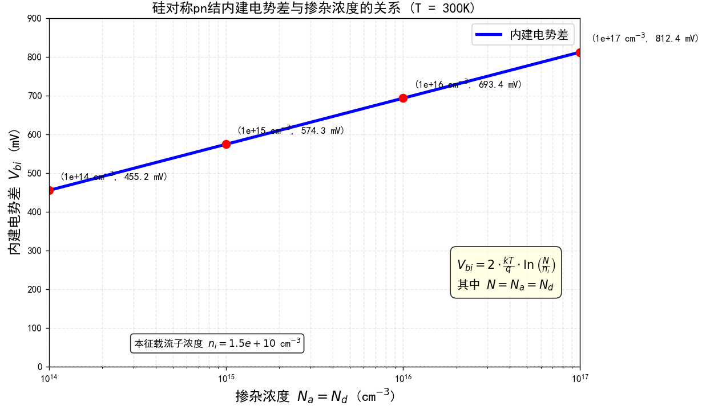

>[!danger] 7-4（画图题）
>考虑杂质掺杂浓度为 $N_{a} = 10^{17}cm^{-3}$ 和 $N_{d} = 5\times10^{15}cm^{-3}$ 的硅突变 pn 结，$T = 300K$。(a) 计算相对于本征费米能级，p 区与 n 区内费米能级位置；(b) 画出 pn 结的平衡状态能带图，从图中确定 $V_{bi}$，并标注 (a) 的计算结果；(c) 用公式 (7.10) 计算出 $V_{bi}$，将其与 (b) 的结果做比较；(d) 求 $x_{n}$，$x_{p}$ 以及该结的峰值电场。

(b) 平衡状态能带图：
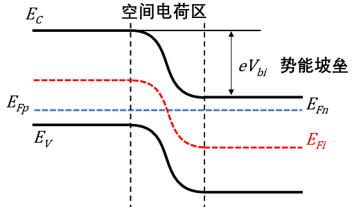

>[!note] 7-5
>当掺杂浓度变为 $N_{a} = N_{d} = 2\times10^{16}cm^{-3}$ 时，重新计算习题 7.4。

略

>[!note] 7-6
>考虑 $T = 300K$ 时的均匀掺杂砷化镓 pn 结，其 n 区的 $E_{F} - E_{Fi} = 0.365eV$，p 区的 $E_{Fi} - E_{F} = 0.330eV$。(a) 画出 pn 结的能带图；(b) 求 p 区与 n 区的掺杂浓度 $N_{a}$ 和 $N_{d}$；(c) 确定 $V_{bi}$。

能带图同上，都长一个样，计算略。

>[!note] 7-7
>均匀掺杂的砷化镓 pn 结，其掺杂浓度为 $N_{a} = 2\times10^{15}cm^{-3}$，$N_{d} = 4\times10^{16}cm^{-3}$。画出 $200K \leq T \leq 400K$ 温度区间内，内建电势差随温度变化的曲线。

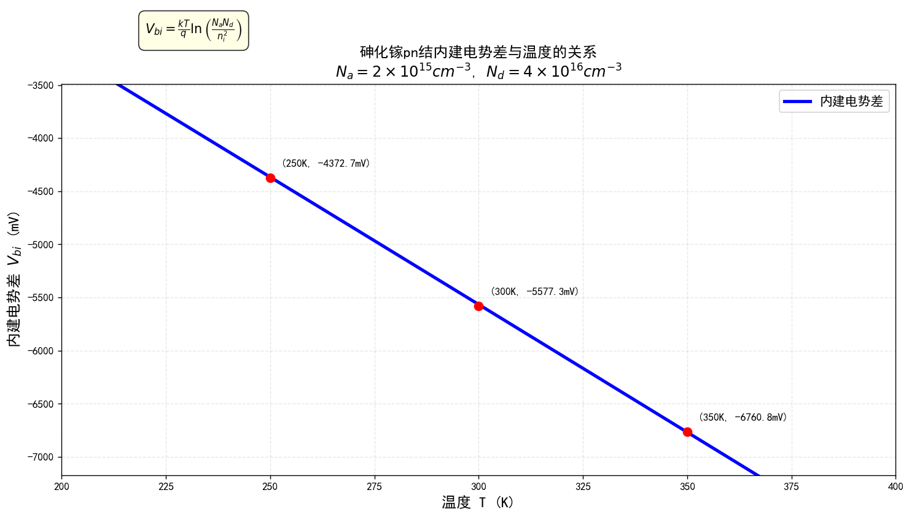

>[!note] 7-8
>(a) 考虑 $T = 300K$ 时的均匀掺杂硅 pn 结。在零偏条件下，总空间电荷区的 25\% 处在 n 型区内，内建电势差为 $V_{bi} = 0.710V$。求 (i)$N_{a}$，(ii)$N_{d}$，(iii)$x_{n}$，(iv)$x_{p}$，(v)$|E_{max}|$；(b) 内建电势差为 $V_{bi} = 1.180V$ 的砷化镓 pn 结，重新计算 (a)。

空间电荷区宽度恒等式，P/N区分别的宽度计算公式，最强电场强度计算公式

已知：$x_{n} = 0.25W = 0.25(x_{n} + x_{p})$  
即：$0.75x_{n} = 0.25x_{p} \Rightarrow \frac{x_{p}}{x_{n}} = 3$  
由电中性条件：$$x_{n}N_{d} = x_{p}N_{a} \Rightarrow \frac{N_{d}}{N_{a}} = \frac{x_{p}}{x_{n}} = 3$$  
因此：$N_{d} = 3N_{a}$

(a)
内建电势公式：  
$$V_{bi} = (0.0259)\ln\left[\frac{N_{a}N_{d}}{(1.5\times 10^{10})^{2}}\right]$$  
代入数值：$0.710 = (0.0259)\ln\left[\frac{3N_{a}^{2}}{(1.5\times 10^{10})^{2}}\right]$  
即：$$3N_{a}^{2} = (1.5\times 10^{10})^{2}\exp\left(\frac{0.710}{0.0259}\right)$$  
解得：$N_{a} = 7.766\times 10^{15}\ \text{cm}^{-3}$  
$N_{d} = 2.33\times 10^{16}\ \text{cm}^{-3}$

n区耗尽层宽度：  
$$x_{n} = \left\{\frac{2\epsilon_{s} V_{bi}}{e}\left(\frac{N_{a}}{N_{d}}\right)\left(\frac{1}{N_{a}+N_{d}}\right)\right\}^{1/2}$$  
$= \left\{\frac{2(11.7)(8.85\times 10^{-14})(0.710)}{1.6\times 10^{-19}} \times \left(\frac{1}{3}\right)\left[\frac{1}{4(7.766\times 10^{15})}\right]\right\}^{1/2}$  
$= 9.93\times 10^{-6}\ \text{cm} = 0.0993\ \mu\text{m}$

p区耗尽层宽度：  
$x_{p} = \left\{\frac{2(11.7)(8.85\times 10^{-14})(0.710)}{1.6\times 10^{-19}} \times \left(\frac{3}{1}\right)\left[\frac{1}{4(7.766\times 10^{15})}\right]\right\}^{1/2}$  
$= 2.979\times 10^{-5}\ \text{cm} = 0.2979\ \mu\text{m}$

最大电场强度：  
$$|E_{\max}| = \frac{eN_{d}x_{n}}{\epsilon_{s}}$$  
$= \frac{(1.6\times 10^{-19})(2.33\times 10^{16})(0.0993\times 10^{-4})}{(11.7)(8.85\times 10^{-14})}$  
$= 3.58\times 10^{4}\ \text{V/cm}$

(b) 对于砷化镓材料：  
$3N_{a}^{2} = (1.8\times 10^{6})^{2}\exp\left(\frac{1.180}{0.0259}\right)$  
解得：$N_{a} = 8.127\times 10^{15}\ \text{cm}^{-3}$  
$N_{d} = 2.438\times 10^{16}\ \text{cm}^{-3}$

n区耗尽层宽度：  
$x_{n} = \left\{\frac{2(13.1)(8.85\times 10^{-14})(1.180)}{1.6\times 10^{-19}} \times \left(\frac{1}{3}\right)\left[\frac{1}{4(8.127\times 10^{15})}\right]\right\}^{1/2}$  
$= 1.324\times 10^{-5}\ \text{cm} = 0.1324\ \mu\text{m}$

p区耗尽层宽度：  
$x_{p} = \left\{\frac{2(13.1)(8.85\times 10^{-14})(1.180)}{1.6\times 10^{-19}} \times \left(\frac{3}{1}\right)\left[\frac{1}{4(8.127\times 10^{15})}\right]\right\}^{1/2}$  
$= 3.973\times 10^{-5}\ \text{cm} = 0.3973\ \mu\text{m}$

最大电场强度：  
$|E_{\max}| = \frac{(1.6\times 10^{-19})(2.438\times 10^{16})(0.1324\times 10^{-4})}{(13.1)(8.85\times 10^{-14})}$  
$= 4.45\times 10^{4}\ \text{V/cm}$

>[!note] 7-9
>硅 pn 结的掺杂曲线如图所示。在零偏条件下：(a) 计算 $V_{bi}$；(b) 计算 $x_{n}$ 与 $x_{p}$；(c) 画出平衡状态能带图；(d) 画出电场随距离变化的曲线。
> 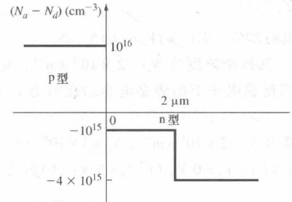

掺杂浓度就是趋近于0的极限值。

>[!note] 7-10
>均匀掺杂的硅 pn 结，其掺杂浓度为 $N_{a} = 2\times10^{17}cm^{-3}$，$N_{d} = 4\times10^{16}cm^{-3}$。(a) 计算 $T = 300K$ 时的 $V_{bi}$；(b) $V_{bi}$ 下降 2\%，计算此时的环境温度（本题采用试解法）。

主要说一下b小问，为什么需要试解？因为$n_i$和$V_t$都受温度的变化影响，需要凑齐同时符合整个式子的两项，具体试的过程就不展示了

>[!note] 7-11
>均匀掺杂的硅 pn 结的掺杂浓度为 $N_{a} = 4 \times 10^{16} \text{ cm}^{-3}$，$N_{d} = 2 \times 10^{15} \text{ cm}^{-3}$，内建电势差为 $V_{bi} = 0.550 \text{ V}$。确定环境温度。

仍然是试解法计算，大概率不会考这么无聊的题。

>[!note] 7-12
>结两侧具有相同杂质类型的均匀掺杂结称为“同型”突变结。图显示了 n-n 同型结的掺杂曲线。
>(a) 画出同型结的热平衡能带图；
>(b) 由能带图确定内建电势差；
>(c) 讨论结内的电荷分布情况。
> 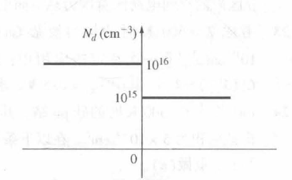

内建电势差的广义算法：$E_F - E_i$ 的差值，能带图应该不会考，就不画了：

对于 $N_d = 10^{16} \text{cm}^{-3}$
$$E_F - E_{Fi} = kT \ln \left(\frac{N_d}{n_i}\right)$$
$= (0.0259)\ln \left(\frac{10^{16}}{1.5 \times 10^{10}}\right)$
即
$E_F - E_{Fi} = 0.3473$ eV

对于 $N_d = 10^{15} \text{cm}^{-3}$，
$E_F - E_{Fi} = (0.0259)\ln \left(\frac{10^{15}}{1.5 \times 10^{10}}\right)$
即
$E_F - E_{Fi} = 0.2877$ eV

因此
$V_{bi} = 0.34732 - 0.28768$
即
$V_{bi} = 0.0596$ V

#### 7.3 反偏

>[!note] 7-16
>硅突变结在温度为 $T = 300K$ 时的掺杂浓度为 $N_{a} = 5 \times 10^{16} cm^{-3}$，$N_{d} = 10^{15} cm^{-3}$。计算：
>(a) 内建电势差 $V_{bi}$；
>(b) 反偏电压 $V_{R} = 0$ 与 $V_{R} = 5V$ 时的耗尽层宽度 $W$；
>(c) 反偏电压 $V_{R} = 0$ 与 $V_{R} = 5V$ 时的最大电场强度 $|E_{\max}|$。

能够看出来反偏电压基本上都是内建电压的增强：

 (a) 内建电势差计算：
$$V_{bi} = (0.0259)\ln\left[\frac{(5\times 10^{16})(10^{15})}{(1.5\times 10^{10})^{2}}\right] = 0.6767$$
(b) 耗尽层宽度计算公式：
$$W = \left\{\frac{2\epsilon_{s}(V_{bi}+V_{R})}{e}\left(\frac{N_{a}+N_{d}}{N_{a}N_{d}}\right)\right\}^{1/2}$$

(i) 当 $V_{R} = 0$ 时：
$W = \left\{\frac{2(11.7)(8.85\times 10^{-14})(0.6767)}{1.6\times 10^{-19}} \times \left[\frac{5\times 10^{16}+10^{15}}{(5\times 10^{16})(10^{15})}\right]\right\}^{1/2}$
$= 9.452\times 10^{-5}$ cm $= 0.9452$ $\mu$m

(ii) 当 $V_{R} = 5$ V 时：
$W = \left\{\frac{2(11.7)(8.85\times 10^{-14})(0.6767+5)}{1.6\times 10^{-19}} \times \left[\frac{5\times 10^{16}+10^{15}}{(5\times 10^{16})(10^{15})}\right]\right\}^{1/2}$
$= 2.738\times 10^{-4}$ cm $= 2.738$ $\mu$m

(c) 最大电场强度计算：
$$|E_{\max}| = \frac{2(V_{bi}+V_{R})}{W}$$

(i) 当 $V_{R} = 0$ 时：
$|E_{\max}| = \frac{2(0.6767)}{0.9452\times 10^{-4}} = 1.43\times 10^{4}$ V/cm

(ii) 当 $V_{R} = 5$ V 时：
$|E_{\max}| = \frac{2(0.6767+5)}{2.738\times 10^{-4}} = 4.15\times 10^{4}$ V/cm

>[!note] 7-17
> 在 $T = 300K$ 的情况。结的横截面积 $A = 2 \times 10^{-4} cm^{2}$，反偏电压为 $V_{R} = 2.5V$。计算：
>(a) 内建电势差 $V_{bi}$；
>(b) n 区耗尽层宽度 $x_{n}$，p 区耗尽层宽度 $x_{p}$，总耗尽层宽度 $W$；
>(c) 最大电场强度 $|E_{\max}|$；
>(d) 势垒电容 $C_{j}$。

主要是第四问，关于势垒电容的计算公式：

势垒电容：
$$C = A\left\{\frac{e\epsilon_{s}N_{a}N_{d}}{2(V_{bi}+V_{R})(N_{a}+N_{d})}\right\}^{1/2}$$

$= (2\times 10^{-4})\left\{\frac{(1.6\times 10^{-19})(11.7)(8.85\times 10^{-14})}{2(0.8081+2.5)} \times \left[\frac{(2\times 10^{17})(4\times 10^{16})}{2\times 10^{17}+4\times 10^{16}}\right]\right\}^{1/2}$ $= 5.78\times 10^{-12}$ F $= 5.78$ pF

>[!note] 7-18
>理想的 $p^{+}n$ 结为 $T = 300K$ 时均匀掺杂的冶金结。其掺杂浓度的关系为 $N_{a} = 80N_{d}$，内建电势差 $V_{bi} = 0.740V$，反偏电压 $V_{R} = 10V$。计算：
>(a) 受主掺杂浓度 $N_{a}$ 和施主掺杂浓度 $N_{d}$；
>(b) p 区耗尽层宽度 $x_{p}$ 和 n 区耗尽层宽度 $x_{n}$；
>(c) 最大电场强度 $|E_{\max}|$；
>(d) 单位面积势垒电容 $C_{j}'$。（表示单位面积电容的时候就需要加一个 $`$ 的符号）

没什么好说的，有点重复了，注意一下最后一问的单位面积，但是公式也有，代数就行。

>[!note] 7-19
>考虑反偏电压 $V_{R} = 5V$ 时的硅 $n^{+}p$ 结。
>(a) 当 p 区掺杂浓度变为原来的三倍时，求内建电势差的变化量；
>(b) 当 p 区掺杂浓度由 $N_{a}$ 变为 $3N_{a}$ 时，求势垒电容的变化比率；
>(c) 掺杂浓度增加时，为什么结电容随之增加？

由于对数的特殊运算方式，a小问是有固定数值的。

(a)
内建电势差变化量计算：
$$V_{bi}(3N_{a}) - V_{bi}(N_{a})$$
$$= V_{t} \ln\left[\frac{N_{d}(3N_{a})}{n_{i}^{2}}\right] - V_{t} \ln\left[\frac{N_{d}N_{a}}{n_{i}^{2}}\right]$$
$$= V_{t} \left\{\ln(3) + \ln\left[\frac{N_{d}N_{a}}{n_{i}^{2}}\right]\right\} - V_{t} \ln\left[\frac{N_{d}N_{a}}{n_{i}^{2}}\right]$$
$= V_{t} \ln(3) = (0.0259)\ln(3)$
$= 0.02845$ V

(b) 单位面积势垒电容比计算：
$$C' \cong \left\{\frac{e\epsilon_{s}N_{a}}{2(V_{bi}+V_{R})}\right\}^{1/2}$$
因此 $\frac{C'(3N_{a})}{C'(N_{a})} = \left\{\frac{3N_{a}}{N_{a}}\right\}^{1/2} = \sqrt{3} = 1.732$

(c) 掺杂浓度增加时，空间电荷区宽度变窄，导致电容增大。

>[!note] 7-20
>(a) 反偏硅 pn 结的最大电场为 $|E_{\max}| = 3 \times 10^{5} V/cm$。掺杂浓度为 $N_{d} = 4 \times 10^{15} cm^{-3}$，$N_{a} = 4 \times 10^{17} cm^{-3}$，求反偏电压 $V_{R}$；
>(b) 当 $N_{d} = 4 \times 10^{16} cm^{-3}$，$N_{a} = 4 \times 10^{17} cm^{-3}$ 时，重做 (a)；
>(c) 当 $N_{d} = N_{a} = 4 \times 10^{17} cm^{-3}$ 时，重做 (a)。

(a) 内建电势差计算：
$$V_{bi} = (0.0259)\ln\left[\frac{(4\times 10^{15})(4\times 10^{17})}{(1.5\times 10^{10})^{2}}\right]$$
即
$V_{bi} = 0.766$ V

最大电场强度公式（整道题就这个重要，在小抄里面是分开的，不过稍微推一下就有了）：
$$|E_{\max}| = \left[\frac{2e(V_{bi}+V_R)}{\epsilon_s}\left(\frac{N_a N_d}{N_a+N_d}\right)\right]^{1/2}$$

代入数值：
$(3 \times 10^{5})^{2} = \left[\frac{2(1.6\times 10^{-19})(V_{bi}+V_R)}{(11.7)(8.85\times 10^{-14})} \times \frac{(4\times 10^{15})(4\times 10^{17})}{4\times 10^{15}+4\times 10^{17}}\right]$

简化得：
$9 \times 10^{10} = 1.224 \times 10^{9}(V_{bi}+V_R)$

解得：
$(V_{bi}+V_R) = 73.53$ V

最终得到：
$V_R = 72.8$ V

(b) 内建电势差计算：
$V_{bi} = (0.0259)\ln\left[\frac{(4\times 10^{16})(4\times 10^{17})}{(1.5\times 10^{10})^{2}}\right]$
即
$V_{bi} = 0.826$ V

代入最大电场强度公式：
$(3 \times 10^{5})^{2} = \left[\frac{2(1.6\times 10^{-19})(V_{bi}+V_R)}{(11.7)(8.85\times 10^{-14})} \times \frac{(4\times 10^{16})(4\times 10^{17})}{4\times 10^{16}+4\times 10^{17}}\right]$

解得：
$(V_{bi}+V_R) = 8.008$ V

(c) 内建电势差计算：
$V_{bi} = (0.0259)\ln\left[\frac{(4\times 10^{17})(4\times 10^{17})}{(1.5\times 10^{10})^{2}}\right]$
即
$V_{bi} = 0.886$ V

代入最大电场强度公式：
$(3 \times 10^{5})^{2} = \left[\frac{2(1.6\times 10^{-19})(V_{bi}+V_R)}{(11.7)(8.85\times 10^{-14})} \times \frac{(4\times 10^{17})(4\times 10^{17})}{4\times 10^{17}+4\times 10^{17}}\right]$

解得：
$(V_{bi}+V_R) = 1.456$ V

最终得到：
$V_R = 0.570$ V

>[!note] 7-21
>考虑 $V_R = 5V$，$T = 300K$ 时的两个硅 $p^{+}n$ 结。pn 结 A 的掺杂浓度为 $N_a = 10^{18}cm^{-3}$，$N_d = 10^{15}cm^{-3}$，pn 结 B 的掺杂浓度为 $N_a = 10^{18}cm^{-3}$，$N_d = 10^{16}cm^{-3}$。计算下列条件下结 A 与结 B 参数的比值 (A:B)：(a) $W$；(b) $\left|E_{\max}\right|$；(c) $C_j^{\prime}$。

(a) 计算宽度比 $W(A)/W(B)$：
$$\frac{W(A)}{W(B)} = \frac{\left[\frac{2\epsilon_s(V_{biA}+V_R)}{e}\left(\frac{N_a+N_{dA}}{N_a N_{dA}}\right)\right]^{1/2}}{\left[\frac{2\epsilon_s(V_{biB}+V_R)}{e}\left(\frac{N_a+N_{dB}}{N_a N_{dB}}\right)\right]^{1/2}}$$
简化后：
$$\frac{W(A)}{W(B)} = \left[\frac{(V_{biA}+V_R)}{(V_{biB}+V_R)} \cdot \frac{N_a+N_{dA}}{N_a+N_{dB}} \cdot \frac{N_{dB}}{N_{dA}}\right]^{1/2}$$
计算内建电势：
$$V_{biA} = (0.0259)\ln\left[\frac{(10^{18})(10^{15})}{(1.5\times 10^{10})^2}\right] = 0.7543\text{ V}$$
$$V_{biB} = (0.0259)\ln\left[\frac{(10^{18})(10^{16})}{(1.5\times 10^{10})^2}\right] = 0.8139\text{ V}$$
代入数值计算：
$$\frac{W(A)}{W(B)} = \left[\left(\frac{5.7543}{5.8139}\right)\left(\frac{10^{18}+10^{15}}{10^{18}+10^{16}}\right) \times \left(\frac{10^{16}}{10^{15}}\right)\right]^{1/2}$$
最终结果：
$$\frac{W(A)}{W(B)} = 3.13$$
(b) 电场强度比 $E(A)/E(B)$：
$$\frac{E(A)}{E(B)} = \frac{\frac{2(V_{biA}+V_R)}{W(A)}}{\frac{2(V_{biB}+V_R)}{W(B)}} = \frac{W(B)}{W(A)} \cdot \frac{V_{biA}+V_R}{V_{biB}+V_R}$$
代入数值计算：
$$\frac{E(A)}{E(B)} = \left(\frac{1}{3.13}\right)\left(\frac{5.7543}{5.8139}\right)$$
最终结果：
$$\frac{E(A)}{E(B)} = 0.316$$
 (c) 单位面积电容比 $C_j'(A)/C_j'(B)$：
$$\frac{C_j'(A)}{C_j'(B)} = \frac{\left[\frac{\epsilon_s N_a N_{dA}}{2(V_{biA}+V_R)(N_a+N_{dA})}\right]^{1/2}}{\left[\frac{\epsilon_s N_a N_{dB}}{2(V_{biB}+V_R)(N_a+N_{dB})}\right]^{1/2}}$$
简化后的公式：
$$\frac{C_j'(A)}{C_j'(B)} = \left[\left(\frac{N_{dA}}{N_{dB}}\right)\left(\frac{V_{biB}+V_R}{V_{biA}+V_R}\right)\left(\frac{N_a+N_{dB}}{N_a+N_{dA}}\right)\right]^{1/2}$$
代入数值计算：
$$\frac{C_j'(A)}{C_j'(B)} = \left[\left(\frac{10^{15}}{10^{16}}\right)\left(\frac{5.8139}{5.7543}\right)\left(\frac{10^{18}+10^{16}}{10^{18}+10^{15}}\right)\right]^{1/2}$$
最终结果：
$$\frac{C_j'(A)}{C_j'(B)} = 0.319$$
>[!note] 7-22
>考虑 $T = 300K$ 时的均匀掺杂 GaAs pn 结。零偏时结电容为 $C_j(0)$，反偏电压为 10V 时的结电容为 $C_j(10)$。电容的比率为 $\frac{C_j(0)}{C_j(10)} = 3.13$，p 区内的空间电荷区宽度为总空间电荷区宽度的 20\%。求：(a) $V_{bi}$；(b) $N_a$，$N_d$。

(a) 我们有
$$\frac{C_{j}'(0)}{C_{j}'(10)} = \frac{\left[\frac{\epsilon_s N_a N_d}{2(V_{bi})(N_a + N_d)}\right]^{1/2}}{\left[\frac{\epsilon_s N_a N_d}{2(V_{bi}+V_R)(N_a + N_d)}\right]^{1/2}}$$

或者
$$\frac{C_{j}'(0)}{C_{j}'(10)} = 3.13 = \left(\frac{V_{bi}+V_R}{V_{bi}}\right)^{1/2}$$

当 $V_R = 10V$ 时，我们得到
$(3.13)^2 V_{bi} = V_{bi} + 10$

即
$V_{bi} = 1.137V$

(b) 空间电荷区宽度关系

根据题意，p区空间电荷区宽度与总耗尽层宽度的关系为：
$$x_p = 0.2W = 0.2(x_p + x_n)$$
由空间电荷区宽度比例关系可得：
$$\frac{x_p}{x_n} = 0.25 = \frac{N_d}{N_a}$$
根据内建电势公式：
$$V_{bi} = V_t \ln\left(\frac{N_a N_d}{n_i^2}\right)$$
代入已知数值：
$$1.137 = (0.0259) \ln\left[\frac{0.25 N_a^2}{(1.8 \times 10^6)^2}\right]$$
求解受主浓度 $N_a$：
$$N_a = \frac{1.8 \times 10^6}{\sqrt{0.25}} \exp\left[\frac{1.137}{2(0.0259)}\right]$$
计算结果：
$$N_a = 1.23 \times 10^{16} \text{ cm}^{-3}$$
相应的施主浓度为：
$$N_d = 3.07 \times 10^{15} \text{ cm}^{-3}$$
>[!note] 7-23
>考虑 $T = 300K$ 时的均匀掺杂 GaAs pn 结。其掺杂浓度为 $N_a = 2\times 10^{16}cm^{-3}$，$N_d = 5\times 10^{15}cm^{-3}$。在一次特定的应用中，两个不同反偏电压下的势垒电容的比值为 $C_j^{\prime}(V_{R1})/C_j^{\prime}(V_{R2}) = 1.5$，其中 $V_{R1} = 0.5V$。求 $V_{R2}$。

首先计算内建电势：
$$V_{bi} = (0.0259)\ln\left[\frac{(2 \times 10^{16})(5 \times 10^{15})}{(1.8 \times 10^{6})^{2}}\right] = 1.162\text{ V}$$
电容 $C'$ 与电压的关系为：
$$C' \propto \frac{1}{\sqrt{V_{bi} + V_{R}}}$$
因此，不同反向电压下的电容比值为：
$$\frac{C'(V_{R1})}{C'(V_{R2})} = \sqrt{\frac{V_{bi} + V_{R2}}{V_{bi} + V_{R1}}}$$
代入已知数值：
$$1.50 = \sqrt{\frac{1.162 + V_{R2}}{1.162 + 0.5}}$$
两边平方得：
$$(1.50)^{2} = \frac{1.162 + V_{R2}}{1.662}$$
解得：
$$V_{R2} = 2.58\text{ V}$$
>[!note] 7-24
>(a) 考虑 $T = 300K$ 时的硅 pn 结。其掺杂浓度为 $N_a = 2\times 10^{15}cm^{-3}$，$N_d = 4\times 10^{16}cm^{-3}$。结的横截面积为 $5\times 10^{-4}cm^{2}$。在以下条件下求电容：(i) $V_R = 0V$，(ii) $V_R = 5V$；(b) 假设为 GaAs 结时，重做 (a)。

 (a) 硅材料

内建电势计算
$$V_{bi} = (0.0259)\ln\left[\frac{(2\times 10^{15})(4\times 10^{16})}{(1.5\times 10^{10})^{2}}\right] = 0.6889\text{ V}$$
$$C = AC' = A\left\{\frac{e\epsilon_s N_a N_d}{2(V_{bi}+V_R)(N_a+N_d)}\right\}^{1/2}$$
$$C = (5\times 10^{-4})\left\{\frac{(1.6\times 10^{-19})(11.7)(8.85\times 10^{-14})}{2(0.6889+V_R)} \times \frac{(2\times 10^{15})(4\times 10^{16})}{(2\times 10^{15}+4\times 10^{16})}\right\}^{1/2}$$
简化
$$C = \frac{6.2806\times 10^{-12}}{\sqrt{0.6889+V_R}}$$
(i) 当 $V_R = 0$ 时：
$$C = 7.567\text{ pF}$$

(ii) 当 $V_R = 5\text{ V}$ 时：
$$C = 2.633\text{ pF}$$
(b) 砷化镓材料
内建电势
$$V_{bi} = (0.0259)\ln\left[\frac{(2\times 10^{15})(4\times 10^{16})}{(1.8\times 10^{6})^{2}}\right] = 1.157\text{ V}$$
$$C = AC' = A\left\{\frac{e\epsilon_s N_a N_d}{2(V_{bi}+V_R)(N_a+N_d)}\right\}^{1/2}$$
$$C = (5\times 10^{-4})\left\{\frac{(1.6\times 10^{-19})(13.1)(8.85\times 10^{-14})}{2(1.157+V_R)} \times \frac{(2\times 10^{15})(4\times 10^{16})}{(2\times 10^{15}+4\times 10^{16})}\right\}^{1/2}$$
简化
$$C = \frac{6.6457\times 10^{-12}}{\sqrt{1.157+V_R}}$$
(i) 当 $V_R = 0$ 时：
$$C = 6.178\text{ pF}$$

(ii) 当 $V_R = 5\text{ V}$ 时：
$$C = 2.678\text{ pF}$$

>[!note] 7-25
>考虑 $T = 300K$ 时的硅突变结，其掺杂浓度为 $N_a = 2\times 10^{17}cm^{-3}$，$N_d = 5\times 10^{15}cm^{-3}$。结的横截面积为 $A = 8\times 10^{-4}cm^{2}$。将该 pn 结与一个电感并联。(a) 在反偏电压 $V_R = 10V$，共振频率 $f = 1.25MHz$ 的条件下，求电感值；(b) 使用 (a) 的结果，计算在下列反偏电压下电路的共振频率：(i) $V_R = 1V$，(ii) $V_R = 5V$。

主要考察一个共振频率公式（本质上还是在求反偏电压作用下的势垒电容）：
$$f = \frac{1}{2\pi\sqrt{LC}}$$

>[!note] 7-26（7.3.4 单边突变结）
>(a) 考虑 $T = 300K$ 时的硅 $p^{+}n$ 结。$V_R = 10V$ 条件下其最大电场被限制为 $\left|E_{\max}\right| = 2.5\times 10^{5}V/cm$。求 n 区的最大掺杂浓度 (对 $V_{bi}$ 使用近似值)；(b) 最大电场被限制为 $\left|E_{\max}\right| = 10^{5}V/cm$ 时，重做 (a)。

这题的 $V_{bi}$ 不用求，直接假设为 $0.75V$ 。

最大电场强度公式：
$$|E_{\max}| = \left[\frac{2e(V_{bi}+V_R)N_d}{\epsilon_s}\right]^{1/2}$$

(a) 当 $|E_{\max}| = 2.5 \times 10^5$ V/cm 时：
$$(2.5 \times 10^5)^2 = \left[\frac{2(1.6 \times 10^{-19})(0.75+10)N_d}{(11.7)(8.85 \times 10^{-14})}\right]$$
解得 $N_d = 1.88 \times 10^{16}$ cm$^{-3}$

(b) 当 $|E_{\max}| = 10^5$ V/cm 时：
$$(10^5)^2 = \left[\frac{2(1.6 \times 10^{-19})(0.75+10)N_d}{(11.7)(8.85 \times 10^{-14})}\right]$$
解得 $N_d = 3.01 \times 10^{15}$ cm$^{-3}$

>[!note] 7-27（注意单位检查点）
>(a) 考虑 $T = 300K$ 时的 GaAs 结，结的横截面积为 $10^{-4}cm^{2}$ 时。$V_R = 2V$ 时，总空间电荷区的 20\% 在 p 区内，总势垒电容为 0.6pF。求 $N_a$，$N_d$ 和 $W$；(b) 当 $V_R = 5V$ 时，重做 (a)。

值得注意的是，$1pF = 10^{-12}F$

根据给定的空间电荷区宽度比例关系：$x_p = (0.20)W = (0.20)(x_n + x_p)$，通过代数运算得到 $(0.8)x_p = (0.2)x_n$，进一步推导出 $x_n = 4x_p$。

根据电中性条件 $N_a x_p = N_d x_n = N_d (4x_p)$，可得 $N_a = 4N_d$。

(a) 内建电势计算公式为：$V_{bi} = V_t \ln\left[\frac{N_a N_d}{n_i^2}\right]$，代入数值得到：$V_{bi} = (0.0259)\ln\left[\frac{4N_d^2}{(1.8\times 10^6)^2}\right]$。

电容计算公式为：$$C = AC' = A\left\{\frac{e\epsilon_s N_a N_d}{2(V_{bi}+V_R)(N_a+N_d)}\right\}$$
具体计算过程为：
$= (10^{-4})\left\{\frac{(1.6\times 10^{-19})(13.1)(8.85\times 10^{-14})}{2(V_{bi}+2)} \times \frac{(4 N_d^2)}{(5 N_d)}\right\}^{1/2}$

简化后得到：$0.6\times 10^{-12} = 2.724\times 10^{-20}\sqrt{\frac{N_d}{V_{bi}+2}}$

通过试解法求解得到：
$N_d = 1.504\times 10^{15} \text{ cm}^{-3}$，
$N_a = 6.016\times 10^{15} \text{ cm}^{-3}$，
$V_{bi} = 1.10 \text{ V}$

(b) 根据(a)部分的结果，建立方程：
$0.6\times 10^{-12} = 2.724\times 10^{-20}\sqrt{\frac{N_d}{V_{bi}+5}}$

通过试算法求解得到：
$N_d = 2.976\times 10^{15} \text{ cm}^{-3}$，
$N_a = 1.19\times 10^{16} \text{ cm}^{-3}$，
$V_{bi} = 1.135 \text{ V}$

>[!note] 7-28
>$T = 300K$ 时的硅 pn 结具有如图 P7.28 所示的掺杂曲线。计算：(a) $V_{bi}$；(b) 零偏压下的 $x_n$，$x_p$；(c) $x_n = 30\mu m$ 时的 $V_R$。
> 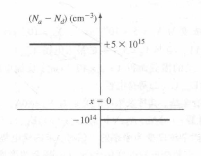

和前面的一道图像图一样，就是使用趋近于0的值当做掺杂浓度。

> [!note] 7-29
> $T = 300\ \text{K}$ 时的硅pn结的掺杂曲线如图P7.29所示。
> (a) 计算使p区完全成为空间电荷区所需的反偏电压；
> (b) 在(a)中所给的反偏电压下，求$n^{+}$区内的空间电荷区宽度；
> (c) 计算此电压下的峰值电场$\vert E_{\text{max}}\vert$。
> 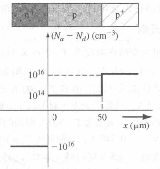

主要是第一问，什么是把 p 区完全变成空间电荷区？看右半部分断点 $50\mu m$ ，这个区域就是题目想要的 $x_p$的长度，代入公式即可。

> [!note] 7-30（单边突变结假设）
> 硅 $p^{+}n$ 结的掺杂浓度为 $N_{a} = 2 \times 10^{17} \text{ cm}^{-3}$，$N_{d} = 2 \times 10^{15} \text{ cm}^{-3}$。结的横截面积为 $10^{-5} \text{ cm}^{2}$。
>
> 计算：
> (a) 内建电势 $V_{bi}$；
> (b) 在以下反偏电压下的势垒电容：
> &nbsp;&nbsp;&nbsp;&nbsp;(i) $V_{R} = 1 \text{ V}$
> &nbsp;&nbsp;&nbsp;&nbsp;(ii) $V_{R} = 3 \text{ V}$
> &nbsp;&nbsp;&nbsp;&nbsp;(iii) $V_{R} = 5 \text{ V}$
> (c) 绘制 $1/C^{2}$-$V_{R}$ 曲线。说明该曲线的斜率可以用来求 $N_{d}$，并且曲线在电压轴上的截距的绝对值为 $V_{bi}$。

主要绘制第三问的曲线，$x$ 轴的截距就是 $V_{bi}$ ，斜率是 $\frac{2}{e \epsilon_s N_d}$ ：

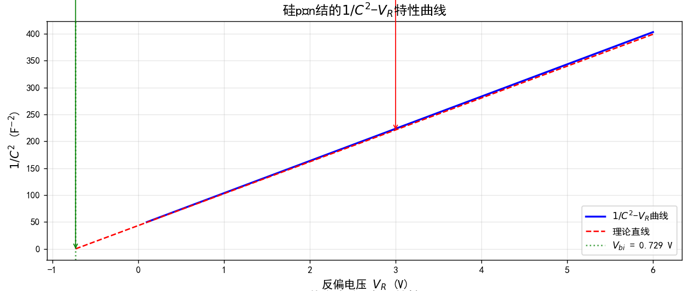

> [!note] 7-32
> 画出掺杂浓度变化时的 $C'-V_R$ 与 $(1/C')^2-V_R$ 曲线。考虑以下两种情况：
>
> - 以 $N_a$ 为参数（$N_a \geq 100N_d$）；
> - 以 $N_d$ 为参数（$N_d \geq 100N_a$）。

#### 7.4 结击穿

主要就是考察击穿电压的公式，以及临界浓度 $N_B$ 是单边突变结中掺杂较少的一边：
$$V_B = \frac{\varepsilon_s E_{\text{crit}}^2}{2eN_B}$$

> [!note] 7-35
> 硅的临界电场为 $E_{crit} = 4\times 10^{5} V/cm$。确定击穿电压为 (a) 40V 和 (b) 20V 时突变 $n^{+}p$ 结中 p 区的最大掺杂浓度。

雪崩击穿电压 $V_B$ 或击穿时的掺杂浓度 $N_B$ 的计算公式为：

(a) $$V_B = \frac{\varepsilon_s E_{\text{crit}}^2}{2eN_B}$$
或者表示为：
$$N_B = \frac{\varepsilon_s E_{\text{crit}}^2}{2eV_B} = \frac{(11.7)(8.85\times10^{-14})(4\times10^5)^2}{2(1.6\times10^{-19})(40)}$$

计算得到：
$N_B = N_a = 1.294\times10^{16} \text{ cm}^{-3}$

(b) 同样使用公式：
$N_B = \frac{(11.7)(8.85\times10^{-14})(4\times10^5)^2}{2(1.6\times10^{-19})(20)}$

计算得到：
$N_B = N_a = 2.59\times10^{16} \text{ cm}^{-3}$

> [!note] 7-36
> 设计一个突变硅 $n^{+}p$ 结，要求击穿电压为 80V。

主要是试解法，从表上查一个合适的临界电场 $E_{crit}$ 和临界掺杂浓度 $N_B$：

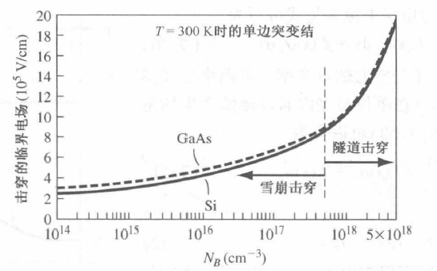

> [!note] 7-37
> (a) 考虑掺杂浓度为 $N_{d} = 10^{16} cm^{-3}$ 的突变 GaAs $p^{+}n$ 结。求击穿电压的值；(b) 当 $N_{d} = 10^{15} cm^{-3}$ 时，重做 (a)。

都不用算，直接查表就行：

> [!note] 7-38
> (a) 考虑对称掺杂的硅 pn 结，$N_{a} = N_{d} = 2\times 10^{16} cm^{-3}$。临界电场强度 $E_{crit} = 4\times 10^{5} V/cm$。确定击穿电压的值；(b) 当 $N_{a} = N_{d} = 5\times 10^{15} cm^{-3}$ 时，重做 (a)。

对于对称掺杂结，$|E_{\max}|$ 对应的偏置电压 $V_R$ 就是临界击穿电压 $V_B$。
$$|E_{\max}| = \left\{\frac{2e(V_{bi}+V_B)}{\epsilon_s}\left(\frac{N_a N_d}{N_a+N_d}\right)\right\}^{1/2}$$

将$|E_{\max}|$设为临界电场$E_{crit}$，并将$V_R$设为击穿电压$V_B$。

> [!note] 7-39
> 突变硅 $p^{+}n$ 结中 n 区的掺杂浓度为 $N_{d} = 5\times 10^{15} cm^{-3}$。当雪崩击穿发生时，不让耗尽区到达欧姆接触（穿通）的最小 n 区长度是多少？

> [!note] 7-40
> 硅 pn 结的掺杂浓度为 $N_{a} = N_{d} = 10^{18} cm^{-3}$。发生齐纳击穿时的临界电场为 $10^{6} V/cm$。求击穿电压的值。

> [!note] 7-41
> 二极管的掺杂曲线经常如图 P7.29 所示，即所谓的 $n^{+}pp^{+}$ 二极管。反偏时，耗尽区必须处于 p 区内，以防止过早的击穿。p 区的掺杂浓度为 $10^{15} cm^{-3}$。计算使耗尽区处于 p 区内并且不发生击穿的反偏电压，假设 p 区长度为 (a) 75 μm；(b) 150 μm。确定每种情况下，是耗尽区最大宽度先产生还是击穿先产生？

> [!note] 7-42
> $T = 300K$ 时的硅 pn 结，在 2 μm 的距离内，掺杂浓度由 $N_{a} = 10^{18} cm^{-3}$ 线性变化至 $N_{d} = 10^{18} cm^{-3}$。估计击穿电压的值。
#### 7.5 非均匀掺杂结

> [!help] 7-43
> 考虑一个线性缓变结。从 $\rho(x) = e^{eax}$ 开始，推导出 $E = \int \frac{e a x}{\epsilon_s} dx = \frac{e a}{2 \epsilon_s} (x^2 - x_0^2)$ 给出的电场表达式；(b)推导出式 $\phi(x) = \frac{-ea}{2\epsilon_s}\left(\frac{x^3}{3} - x_0^2 x\right) + \frac{ea}{3\epsilon_s} x_0^3$ 给出的空间电荷区电势表达式。

复习一下书上 P189-P190 的公式的推导过程
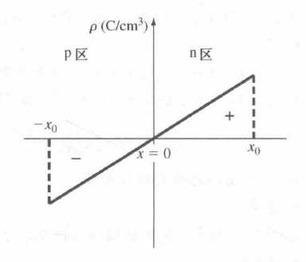
(a) 如图是线性缓变结的耗尽区空间电荷密度随位置变化的曲线。为方便起见，冶金结的位置被置于$x=0$处。空间电荷密度可写为
$$\rho(x)=e a x$$
其中$a$为净杂质浓度梯度。

由泊松方程我们可以确定空间电荷区内电场与电势的表达式。可以写出
$$\frac{dE}{dx}=\frac{\rho(x)}{\epsilon_{s}}=\frac{e a x}{\epsilon_{s}}$$
积分得：
$$E=\int \frac{e a x}{\epsilon_{s}}dx=\frac{e a}{2 \epsilon_{s}}(x^{2}-x_{0}^{2})$$
(b) 对电场的表达式进行积分，可得电势的表达式为
$$\phi(x) = -\int E dx$$
令 $x = -x_0$ 处的电势 $\phi = 0$，则 pn 结内的电势表达式为
$$\phi(x) = \frac{-ea}{2\epsilon_s} \left( \frac{x^3}{3} - x_0^2 x \right) + \frac{ea}{3\epsilon_s} x_0^3$$

> [!note] 7-44
> $T=300K$时，硅线性缓变结的内建电势差为$V_{bi}=0.70V$。$V_R=3.5V$时，测定出的势垒电容为$C'=7.2\times10^{-9}F/cm^{2}$。求净掺杂浓度的梯度$a$。

我们有
$$C' = \left[ \frac{ea\epsilon_s^2}{12(V_{bi} + V_R)} \right]^{1/3}$$
然后
$(7.2 \times 10^{-9})^3 = \left[ \frac{a(1.6 \times 10^{-19})[(11.7)(8.85 \times 10^{-14})]^2}{12(0.7 + 3.5)} \right]$

由此得到
$a = 1.1 \times 10^{20} \text{cm}^{-4}$
### 第八章 PN结深入

注意：对于下面的问题，除非特别声明，假定 $T=300$ K。

- 对于硅 pn 结：$D_n=25$ cm$^2$/s，$D_p=10$ cm$^2$/s，$\tau_{n0}=5\times 10^{-7}$ s，$\tau_{p0}=10^{-7}$ s。
- 对于 GaAs pn 结：$D_n=205$ cm$^2$/s，$D_p=9.8$ cm$^2$/s，$\tau_{n0}=5\times 10^{-8}$ s，$\tau_{p0}=10^{-8}$ s。

#### 8.1 PN结电流（PPT 2.3a）

>[!warning] Homework 1-1
>结合n区空穴扩散电流的推导过程，写出p区电子扩散电流的推导过程。

>先根据p区电子的连续性方程写出微分方程，利用边界条件求解过剩少子分布，再对其求导得到电子扩散电流表达式。

p 区过剩少子浓度为 $\delta n_{p} = n_{p} - n_{p0}$。

由双极输运方程：
$$
D_{n}\frac{\partial^{2}(\delta n_{p})}{\partial x^{2}} - \mu_{n}E\frac{\partial(\delta n_{p})}{\partial x} + g^{\prime} - \frac{\delta n_{p}}{\tau_{n0}} = \frac{\partial(\delta n_{p})}{\partial t}
$$

当 $x < -x_{p}$ 时，$E = 0$，且 $g^{\prime} = 0$，pn 结处于稳态，简化为：
$$
D_{n}\frac{\partial^{2}(\delta n_{p})}{\partial x^{2}} - \frac{\delta n_{p}}{\tau_{n0}} = 0
$$

其通解为：
$$
\delta n_{p}(x) = n_{p}(x) - n_{p0} = Ae^{x/L_{n}} + Be^{-x/L_{n}}
$$
其中 $L_{n}^{2} = D_{n}\tau_{n0}$（德拜长度）。

边界条件为：

- $n_{p}(-x_{p}) = n_{p0}\exp\left(\frac{eV_{a}}{kT}\right)$
- $n_{p}(x \rightarrow -\infty) = n_{p0}$ （半导体深处）

因此，p 区中 $x < -x_{p}$ 处过剩少子的浓度分布为：
$$
\delta n_{p}(x) = n_{p}(x) - n_{p0} = n_{p0}\left[\exp\left(\frac{eV_{a}}{kT}\right) - 1\right]\exp\left(\frac{x_{p} + x}{L_{n}}\right)
$$

扩散电流的定义为：
$$
J_{n}(x) = eD_{n}\frac{dn_{p}(x)}{dx} = eD_{n}\frac{d(\delta n_{p}(x))}{dx}
$$

在 $x = -x_{p}$ 处，少子电子扩散电流密度为：
$$
J_{n}(-x_{p}) = \frac{e D_{n} n_{p0}}{L_{n}} \left[ \exp\left( \frac{e V_{a}}{k T} \right) - 1 \right]
$$

> [!note] 8-1
> (a) 正偏工作的 pn 结二极管，其环境温度为 $T=300$ K。计算电流变为原来的 10 倍时，电压的改变。(b) 计算电流变为原来的 100 倍时，电压的改变。
 
由于正常的正向偏压电流是 $I_F = I_S [exp(\frac{eV_a}{kT})-1]$ ，不利于直接计算这种倍数问题，所以可以把 $-1$ 约掉。

在正向偏置条件下，电流表达式为：$I_{f} \cong I_{S} \exp\left(\frac{eV}{kT}\right)$ 。

由此可得：
$$ \frac{I_{f1}}{I_{f2}} = \frac{I_{S} \exp\left(\frac{eV_{1}}{kT}\right)}{I_{S} \exp\left(\frac{eV_{2}}{kT}\right)} = \exp\left[\left(\frac{e}{kT}\right)\left(V_{1}-V_{2}\right)\right] $$
或者表示为：
$$ V_{1} - V_{2} = \left(\frac{kT}{e}\right) \ln\left(\frac{I_{f1}}{I_{f2}}\right) $$
(a) 当 $\frac{I_{f1}}{I_{f2}} = 10$ 时：
$$ V_{1} - V_{2} = (0.0259) \ln(10) $$
即
$$ V_{1} - V_{2} = 59.6 \text{ mV} \cong 60 \text{ mV} $$
(b) 当 $\frac{I_{f1}}{I_{f2}} = 100$ 时：
$$ V_{1} - V_{2} = (0.0259) \ln(100) $$
即
$$ V_{1} - V_{2} = 119.3 \text{ mV} \cong 120 \text{ mV} $$
> [!note] 8-2
> 硅 pn 结二极管的掺杂浓度为 $N_d=2\times 10^{15}$ cm$^{-3}$，$N_a=8\times 10^{15}$ cm$^{-3}$。计算下列条件下空间电荷区边缘的少子浓度：(a) $V_a=0.45$ V；(b) $V_a=0.55$ V；(c) $V_a=-0.55$ V。

注意c小问，反向偏压的时候空间电荷区边缘少子浓度为 0（见 cheetsheet 上的浓度曲线图），正向偏压就正常带公式算。

热平衡少子浓度：
$$n_{po}=\frac{n_{i}^{2}}{N_{a}}=\frac{(1.5\times 10^{10})^{2}}{8\times 10^{15}}=2.8125\times 10^{4}\ \text{cm}^{-3}$$
$$p_{no}=\frac{n_{i}^{2}}{N_{d}}=\frac{(1.5\times 10^{10})^{2}}{2\times 10^{15}}=1.125\times 10^{5}\ \text{cm}^{-3}$$
空间电荷区边缘的少子浓度表达式为：
$$p_{n}(x_{n})=p_{no}\exp\left(\frac{V_{a}}{V_{t}}\right)$$
$$n_{p}(-x_{p})=n_{po}\exp\left(\frac{V_{a}}{V_{t}}\right)$$
(a) 当 $V_{a}=0.45\ \text{V}$ 时：
$$p_{n}(x_{n})=(1.125\times 10^{5})\exp\left(\frac{0.45}{0.0259}\right)=3.95\times 10^{12}\ \text{cm}^{-3}$$
$$n_{p}(-x_{p})=(2.8125\times 10^{4})\exp\left(\frac{0.45}{0.0259}\right)=9.88\times 10^{11}\ \text{cm}^{-3}$$

(b) 当 $V_{a}=0.55\ \text{V}$ 时：
$$p_{n}(x_{n})=(1.125\times 10^{5})\exp\left(\frac{0.55}{0.0259}\right)=1.88\times 10^{14}\ \text{cm}^{-3}$$
$$n_{p}(-x_{p})=(2.8125\times 10^{4})\exp\left(\frac{0.55}{0.0259}\right)=4.69\times 10^{13}\ \text{cm}^{-3}$$

(c) 当 $V_{a}=-0.55\ \text{V}$ 时（答案还是象征性地算了一下）：
$$p_{n}(x_{n})=(1.125\times 10^{5})\exp\left(\frac{-0.55}{0.0259}\right)\cong 0$$
$$n_{p}(-x_{p})=(2.8125\times 10^{4})\exp\left(\frac{-0.55}{0.0259}\right)\cong 0$$

> [!note] 8-3
> GaAs pn 结二极管的掺杂浓度为 $N_d=10^{16}$ cm$^{-3}$，$N_a=4\times 10^{16}$ cm$^{-3}$。计算下列条件下空间电荷区边缘的少子浓度：(a) $V_a=0.90$ V；(b) $V_a=1.10$ V；(c) $V_a=-0.95$ V。

原理同上道题，只是$n_i$的值变了一下，同样注意 c 小问的反向偏压。

热平衡少子浓度：
$$n_{po} = \frac{n_i^2}{N_a} = \frac{(1.8 \times 10^6)^2}{4 \times 10^{16}} = 8.1 \times 10^{-5} \text{ cm}^{-3}$$
$$p_{no} = \frac{n_i^2}{N_d} = \frac{(1.8 \times 10^6)^2}{10^{16}} = 3.24 \times 10^{-4} \text{ cm}^{-3}$$
空间电荷区边缘的少子浓度表达式为：
$$p_n(x_n) = p_{no} \exp\left(\frac{V_a}{V_t}\right)$$
$$n_p(-x_p) = n_{po} \exp\left(\frac{V_a}{V_t}\right)$$
(a) 当 $V_a = 0.90 \text{ V}$ 时：
$$p_n(x_n) = (3.24 \times 10^{-4}) \exp\left(\frac{0.90}{0.0259}\right) = 4.0 \times 10^{11} \text{ cm}^{-3}$$
$$n_p(-x_p) = (8.1 \times 10^{-5}) \exp\left(\frac{0.90}{0.0259}\right) = 1.0 \times 10^{11} \text{ cm}^{-3}$$
(b) 当 $V_a = 1.10 \text{ V}$ 时：
$$p_n(x_n) = (3.24 \times 10^{-4}) \exp\left(\frac{1.10}{0.0259}\right) = 9.03 \times 10^{14} \text{ cm}^{-3}$$
$$n_p(-x_p) = (8.1 \times 10^{-5}) \exp\left(\frac{1.10}{0.0259}\right) = 2.26 \times 10^{14} \text{ cm}^{-3}$$
(c) 当 $V_a = -0.95 \text{ V}$ 时：
$$p_n(x_n) \cong 0$$
$$n_p(-x_p) \cong 0$$

> [!note] 8-4
> (a) 硅 pn 结二极管的掺杂浓度为 $N_d=5\times 10^{15}$ cm$^{-3}$，$N_a=5\times 10^{16}$ cm$^{-3}$。空间电荷区边缘的少子浓度分别不超过对应多子浓度的 10\%。(i) 求满足条件的最大正偏结电压；(ii) n 区或 p 区的掺杂浓度是否为限制正偏电压的因素？(b) 当掺杂浓度为 $N_d=3\times 10^{16}$ cm$^{-3}$，$N_a=7\times 10^{15}$ cm$^{-3}$，重做 (a)。

简单的不等式推导。

(a) 计算热平衡少子浓度：
$$n_{po} = \frac{n_i^2}{N_a} = \frac{(1.5 \times 10^{10})^2}{5 \times 10^{16}} = 4.5 \times 10^3 \text{ cm}^{-3}$$
$$p_{no} = \frac{n_i^2}{N_d} = \frac{(1.5 \times 10^{10})^2}{5 \times 10^{15}} = 4.5 \times 10^4 \text{ cm}^{-3}$$

(i) 计算偏置电压：
$$p_n(x_n) = p_{no} \exp\left(\frac{V_a}{V_t}\right)$$
或 $V_a = V_t \ln\left[\frac{p_n(x_n)}{p_{no}}\right]$
$= (0.0259) \ln\left[\frac{(0.1)(5 \times 10^{15})}{4.5 \times 10^4}\right]$
$= 0.599 \text{ V}$

(ii) n区为低掺杂侧，所以是n区掺杂浓度影响的偏置电压大小。

(b) 计算热平衡少子浓度：
$n_{po} = \frac{n_i^2}{N_a} = \frac{(1.5 \times 10^{10})^2}{7 \times 10^{15}} = 3.214 \times 10^4 \text{ cm}^{-3}$
$p_{no} = \frac{n_i^2}{N_d} = \frac{(1.5 \times 10^{10})^2}{3 \times 10^{16}} = 7.5 \times 10^3 \text{ cm}^{-3}$

(i) 计算偏置电压：
$V_a = V_t \ln\left[\frac{(0.1)N_a}{n_{po}}\right]$
$= (0.0259) \ln\left[\frac{(0.1)(7 \times 10^{15})}{3.214 \times 10^4}\right]$
$= 0.6165 \text{ V}$

(ii) p区为低掺杂侧，所以是p区掺杂浓度影响的偏置电压大小。

> [!note] 8-5
> GaAs pn 结的掺杂浓度为 $N_a=5\times 10^{16}$ cm$^{-3}$，$N_d=10^{16}$ cm$^{-3}$，结面积为 $A=10^{-3}$ cm$^2$，外加正偏电压 $V_a=1.10$ V。计算 (a) 空间电荷区边缘的少子电子扩散电流；(b) 空间电荷区边缘的少子空穴扩散电流；(c) pn 结二极管的总电流。

注意的是电流 = 电流密度 * 横截面积。总电流 = 少子扩散电流之和。

(a) 电子电流密度表达式为：
$$J_n(-x_p) = \frac{e D_n n_{po}}{L_n} \exp\left(\frac{V_a}{V_t}\right)$$
$$= \frac{e n_i^2}{N_a} \sqrt{\frac{D_n}{\tau_{no}}} \cdot \exp\left(\frac{V_a}{V_t}\right)$$

代入数值计算：
$= \frac{(1.6\times10^{-19})(1.8\times10^6)^2}{5\times10^{16}} \sqrt{\frac{205}{5\times10^{-8}}} \times \exp\left(\frac{1.10}{0.0259}\right)$
$= 1.849 \text{ A/cm}^2$

电子扩散电流为：
$I_n = A J_n(-x_p) = (10^{-3})(1.849) \text{ A}$
即 $I_n = 1.85 \text{ mA}$

(b) 空穴电流密度表达式为：
$$J_p(x_n) = \frac{e D_p p_{no}}{L_p} \exp\left(\frac{V_a}{V_t}\right)$$
$$= \frac{e n_i^2}{N_d} \sqrt{\frac{D_p}{\tau_{p0}}} \cdot \exp\left(\frac{V_a}{V_t}\right)$$

代入数值计算：
$= \frac{(1.6\times10^{-19})(1.8\times10^6)^2}{10^{16}} \sqrt{\frac{9.80}{10^{-8}}} \times \exp\left(\frac{1.10}{0.0259}\right)$
$= 4.521 \text{ A/cm}^2$

空穴电流为：
$I_p = A J_p(x_n) = (10^{-3})(4.521) \text{ A}$
即 $I_p = 4.52 \text{ mA}$

(c) 总电流为：
$I = I_n + I_p = 1.85 + 4.52 = 6.37 \text{ mA}$

> [!note] 8-6
> 考虑 $T=300$ K 时的硅 $n^{+}p$ 二极管，其参数如下：$N_d=10^{18}$ cm$^{-3}$，$N_a=10^{16}$ cm$^{-3}$，$D_n=25$ cm$^2$/s，$D_p=10$ cm$^2$/s，$\tau_{p0}=\tau_{n0}=1$ $\mu$s，$A=10^{-4}$ cm$^2$。确定下列偏压下的二极管电流：(a) 正偏电压 0.5 V；(b) 反偏电压为 0.5 V。

反偏电压也可以代入正偏电流公式进行计算，也可以直接使用反向饱和电流。

对于一个 $n^{+}p$ 型硅二极管

反向饱和电流计算公式：
$$I_{S} = A e n_{i}^{2} \cdot \frac{1}{N_{a}} \sqrt{\frac{D_{n}}{\tau_{n0}}}$$
代入数值计算：
$$= \frac{(10^{-4})(1.6 \times 10^{-19})(1.5 \times 10^{10})^{2}}{10^{16}} \sqrt{\frac{25}{10^{-6}}}$$
得到：
$$I_{S} = 1.8 \times 10^{-15} \text{ A}$$

(a) 当外加电压 $V_{a} = 0.5 \text{ V}$ 时，
$$I_{D} \cong I_{S} \exp\left(\frac{V_{a}}{V_{t}}\right)$$
$$= (1.8 \times 10^{-15}) \exp\left(\frac{0.5}{0.0259}\right)$$
得到：
$$I_{D} = 4.36 \times 10^{-7} \text{ A}$$
(b) 当外加电压 $V_{a} = -0.5 \text{ V}$ 时，
$$I_{D} = (1.8 \times 10^{-15}) \left[\exp\left(\frac{-0.5}{0.0259}\right) - 1\right]$$
得到：
$$I_{D} \cong -I_{S} = -1.8 \times 10^{-15} \text{ A}$$

> [!note] 8-7
> 考虑 $T=300$ K 时的 Ge pn 二极管，其参数如下：$N_a=4\times 10^{15}$ cm$^{-3}$，$N_d=2\times 10^{17}$ cm$^{-3}$，$D_p=48$ cm$^2$/s，$D_n=90$ cm$^2$/s，$\tau_{p0}=\tau_{n0}=2\times 10^{-6}$ s，$A=10^{-4}$ cm$^2$。确定下列偏压下的二极管电流：(a) 正偏电压为 0.25 V；(b) 反偏电压为 0.25 V。

原理同**8-6** ，不多赘述。

> [!note] 8-8
> 考虑单边硅 $p^{+}n$ 二极管掺杂浓度为 $N_a=5\times 10^{17}$ cm$^{-3}$，$N_d=8\times 10^{15}$ cm$^{-3}$。少数载流子的寿命为 $\tau_{n0}=10^{-7}$ s，$\tau_{p0}=8\times 10^{-8}$ s。结的横截面积为 $A=2\times 10^{-4}$ cm$^2$。(a) 计算反向饱和电流；(b) 以下条件下正偏电流：(i) $V_a=0.45$ V，(ii) $V_a=0.55$ V，(iii) $V_a=0.65$ V。

只要是均匀结，单不单边无所谓，一样代到反向饱和电流公式里面计算，不多赘述。

>[!note] 8-9
> 计算使pn结理想反偏电流是反向饱和电流大小90%的反偏电压值，$T = 300K$。

仍然带入正偏公式，以及答案经常出现的 $\frac{V_a}{V_t}$ 就是从 $\frac{eV_a}{kT}$ 来的。

我们有公式：
$$I = I_S \left[ \exp\left( \frac{V}{V_t} \right) - 1 \right]$$
或者可以写成：
$$\frac{I}{I_S} + 1 = \exp\left( \frac{V}{V_t} \right)$$
因此得到：
$$V = V_t \ln\left( \frac{I}{I_S} + 1 \right)$$
在反向偏置，$I$ 为负值，所以当：
$$\frac{I}{I_S} = -0.90$$
时，我们有：
$$V = (0.0259) \ln(1 - 0.90)$$
计算得到：
$$V = -59.6 \text{ mV}$$
>[!note] 8-10
> 补全下列表格中的数据：
>
>| 情况 | $V_{a}$ (V) | $I$ (mA) | $I_{s}$ (mA) | $J$ (mA/cm$^{2}$) | $A$ (cm$^{2}$) |
>|------|-------------|----------|--------------|-------------------|----------------|
>| 1    | 0.65        | 0.50     | $2\times 10^{-4}$ | -                 | -              |
>| 2    | 0.70        | -        | $2\times 10^{-12}$ | -                 | $1\times 10^{-3}$ |
>| 3    | 0.80        | -        | $1\times 10^{-7}$ | -                 | $1\times 10^{-4}$ |
>| 4    | 0.72        | 1.20     | $2\times 10^{-8}$ | -                 | -              |

做一下情况 1 和 2。

**情况一**：使用公式 $I = I_{s} \exp\left( \frac{V_{a}}{V_{t}} \right)$

已知 $I = 0.50 \times 10^{-3}$ A，$V_{a} = 0.65$ V，$V_{t} = 0.0259$ V

计算得到：
$0.50 \times 10^{-3} = I_{s} \exp\left( \frac{0.65}{0.0259} \right)$

解得：
$I_{s} = 6.305 \times 10^{-15}$ A $= 6.305 \times 10^{-12}$ mA

若面积 $A = 2 \times 10^{-4}$ cm²（该死的答案，自己假设条件），则电流密度为：
$J_{s} = \frac{I_{s}}{A} = \frac{6.305 \times 10^{-12}}{2 \times 10^{-4}} = 3.153 \times 10^{-8}$ mA/cm²

**情况二**：同样使用公式 $I = I_{s} \exp\left( \frac{V_{a}}{V_{t}} \right)$

已知 $V_{a} = 0.70$ V，$I_{s} = 2 \times 10^{-12}$ A

计算得到：
$I = (2 \times 10^{-12}) \exp\left( \frac{0.70}{0.0259} \right) = 1.093$ mA

若面积 $A = 1 \times 10^{-3}$ cm²，则电流密度为：
$J_{s} = \frac{I_{s}}{A} = \frac{2 \times 10^{-12}}{1 \times 10^{-3}} = 2 \times 10^{-9}$ mA/cm²

>[!note] 8-11
> 考虑理想硅pn结二极管。(a) 要使得电子电流占总电流的比为90%，求$N_{d}/N_{a}$的值；(b) 空间电荷区内的电流的80%为空穴电流时，重做(a)。

电子电流与总电流的比值表达式为：
$$\frac{J_{n}}{J_{n}+J_{p}}=\frac{\frac{e D_{n} n_{po}}{L_{n}}}{\frac{e D_{n} n_{po}}{L_{n}}+\frac{e D_{p} p_{no}}{L_{p}}}$$

简化后得到：
$$=\frac{\sqrt{\frac{D_{n}}{\tau_{no}}} \cdot \frac{n_{i}^{2}}{N_{a}}}{\sqrt{\frac{D_{n}}{\tau_{no}}} \cdot \frac{n_{i}^{2}}{N_{a}}+\sqrt{\frac{D_{p}}{\tau_{po}}} \cdot \frac{n_{i}^{2}}{N_{d}}}$$
比值为0.90：
$$0.90=\frac{1}{1+\sqrt{\frac{D_{p} \tau_{no}}{D_{n} \tau_{po}}} \cdot\left(\frac{N_{a}}{N_{d}}\right)}$$

整理得到：
$$\sqrt{\frac{D_{p} \tau_{no}}{D_{n} \tau_{po}}} \cdot\left(\frac{N_{a}}{N_{d}}\right)=\frac{1}{0.90}-1$$
进一步推导出：
$$\frac{N_{a}}{N_{d}}=\sqrt{\frac{D_{n} \tau_{po}}{D_{p} \tau_{no}}}\left(\frac{1}{0.90}-1\right)$$
代入数值计算：
$=\sqrt{\frac{(25)(10^{-7})}{(10)(5\times 10^{-7})}}(0.1111)$
最终结果：
$\frac{N_{a}}{N_{d}}=0.07857$ 或 $\frac{N_{d}}{N_{a}}=12.73$

>[!note] 8-12
> 在 $T=300K$，$V_{D}=0.65V$ 时，硅 pn 结二极管的电流为 $I=10mA$。空间电荷区内电子电流与总电流的比值为 0.1，且最大电流密度不大于 $20A/cm^{2}$。设计满足上述条件的二极管。使用例 8.2 中的半导体参数。

这个 $V_D$ 就是正向偏置电压。这道题主要是设计掺杂浓度。

横截面积为
$$A = \frac{I}{J} = \frac{10 \times 10^{-3}}{20} = 5 \times 10^{-4} \text{ cm}^{2}$$
我们有
$$J \cong J_{S} \exp\left(\frac{V_{D}}{V_{t}}\right) \Rightarrow 20 = J_{S} \exp\left(\frac{0.65}{0.0259}\right)$$
由此得到
$J_{S} = 2.522 \times 10^{-10} \text{ A/cm}^{2}$

我们可以写成
$$J_{S} = e n_{i}^{2} \left[ \frac{1}{N_{a}} \sqrt{\frac{D_{n}}{\tau_{nO}}} + \frac{1}{N_{d}} \sqrt{\frac{D_{p}}{\tau_{pO}}} \right]$$
我们希望
$$\frac{ \frac{1}{N_{a}} \cdot \sqrt{\frac{D_{n}}{\tau_{nO}}} }{ \frac{1}{N_{a}} \cdot \sqrt{\frac{D_{n}}{\tau_{nO}}} + \frac{1}{N_{d}} \cdot \sqrt{\frac{D_{p}}{\tau_{pO}}} } = 0.10$$
或者
$\frac{ \frac{1}{N_{a}} \cdot \sqrt{\frac{25}{5 \times 10^{-7}}} }{ \frac{1}{N_{a}} \cdot \sqrt{\frac{25}{5 \times 10^{-7}}} + \frac{1}{N_{d}} \cdot \sqrt{\frac{10}{5 \times 10^{-7}}} }$
$= \frac{7.071 \times 10^{3}}{7.071 \times 10^{3} + \frac{N_{a}}{N_{d}} (4.472 \times 10^{3})} = 0.10$

由此得到
$\frac{N_{a}}{N_{d}} = 14.23$

现在
$J_{S} = 2.522 \times 10^{-10} = (1.6 \times 10^{-19})(1.5 \times 10^{10})^{2}$
$\times \left[ \frac{1}{(14.23) N_{d}} \cdot \sqrt{\frac{25}{5 \times 10^{-7}}} + \frac{1}{N_{d}} \cdot \sqrt{\frac{10}{5 \times 10^{-7}}} \right]$

我们得到
$N_{d} = 7.09 \times 10^{14} \text{ cm}^{-3}$

和
$N_{a} = 1.01 \times 10^{16} \text{ cm}^{-3}$

>[!note] 8-13
> 在 $T=300K$ 时，理想硅 pn 结的少子寿命分别为 $\tau_{n0}=10^{-6}s$，$\tau_{p0}=10^{-7}s$。n 区的掺杂浓度为 $N_{d}=10^{16}cm^{-3}$。绘制出当 $N_{a}$ 的范围为 $10^{15}cm^{-3}\leqslant N_{a}\leqslant10^{18}cm^{-3}$ 时，空间电荷区内空穴电流占总电流的比例随 $N_{a}$ 变化的曲线图（采用对数坐标）。

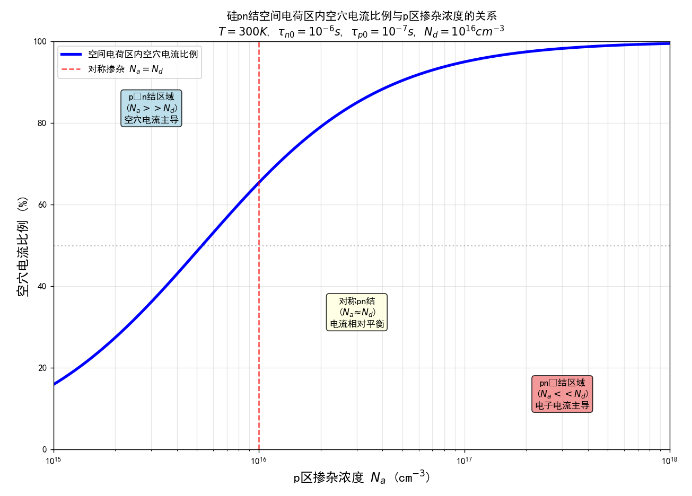

>[!note] 8-14
> 考虑 $T=300K$ 时的硅 pn 结。$\tau_{p0}=0.1\tau_{n0}$ 且 $\mu_{n}=2.4\mu_{p}$。耗尽区内电子电流与总电流的比率称为电子注入效率。确定以下列表达式为变量的注入效率表达式：(a) $N_{d}/N_{a}$；(b) n 型电导率与 p 型电导率的比。

因为我们一直在考虑的就是扩散电流，也就是扩散系数的表达式，所以涉及到迁移率（漂移电流）的值就需要**爱因斯坦关系**。

(a) 电子电流与总电流的比值表达式为：
$$\frac{J_{n}}{J_{n}+J_{p}}=\frac{\frac{eD_{n}n_{po}}{L_{n}}}{\frac{eD_{n}n_{po}}{L_{n}}+\frac{eD_{p}p_{no}}{L_{p}}}$$

进一步化简为：
$$=\frac{\sqrt{\frac{D_{n}}{\tau_{no}}}\cdot\frac{n_{i}^{2}}{N_{a}}}{\sqrt{\frac{D_{n}}{\tau_{no}}}\cdot\frac{n_{i}^{2}}{N_{a}}+\sqrt{\frac{D_{p}}{\tau_{po}}}\cdot\frac{n_{i}^{2}}{N_{d}}}$$

最终得到：
$$=\frac{1}{1+\sqrt{\frac{D_{p}\tau_{no}}{D_{n}\tau_{po}}}\cdot\left(\frac{N_{a}}{N_{d}}\right)}$$

已知条件：
$\frac{D_{p}}{D_{n}}=\frac{\mu_{p}}{\mu_{n}}=\frac{1}{2.4}$ （爱因斯坦关系）和 $\frac{\tau_{no}}{\tau_{po}}=\frac{1}{0.1}$

代入计算：
$\frac{J_{n}}{J_{n}+J_{p}}=\frac{1}{1+\sqrt{\frac{1}{2.4}\cdot\frac{1}{0.1}}\cdot\left(\frac{N_{a}}{N_{d}}\right)}$

简化后得到：
$$\frac{J_{n}}{J_{n}+J_{p}}=\frac{1}{1+(2.04)\left(\frac{N_{a}}{N_{d}}\right)}$$

(b) 利用爱因斯坦关系，我们可以写出：
$$\frac{J_{n}}{J_{n}+J_{p}}=\frac{\frac{e\mu_{n}}{L_{n}}\cdot\frac{n_{i}^{2}}{N_{a}}}{\frac{e\mu_{n}}{L_{n}}\cdot\frac{n_{i}^{2}}{N_{a}}+\frac{e\mu_{p}}{L_{p}}\cdot\frac{n_{i}^{2}}{N_{d}}}$$

化简为：
$$=\frac{e\mu_{n}N_{d}}{e\mu_{n}N_{d}+\frac{L_{n}}{L_{p}}\cdot e\mu_{p}N_{a}}$$

定义电导率：
$\sigma_{n}=e\mu_{n}N_{d}$ 和 $\sigma_{p}=e\mu_{p}N_{a}$

计算长度比：
$\frac{L_{n}}{L_{p}}=\sqrt{\frac{D_{n}\tau_{no}}{D_{p}\tau_{po}}}=\sqrt{\frac{2.4}{0.1}}=4.90$

最终得到：
$$\frac{J_{n}}{J_{n}+J_{p}}=\frac{(\sigma_{n}/\sigma_{p})}{(\sigma_{n}/\sigma_{p})+4.90}$$

>[!note] 8-15
> 在 $T=300K$ 时，硅 pn 结的横截面积为 $A=10^{-4}cm^{2}$，其他参数如下：
>
> n 区参数：
> $N_{d}=10^{17}cm^{-3}$，$\tau_{p0}=10^{-7}s$，$\mu_{n}=850cm^{2}/V\cdot s$，$\mu_{p}=320cm^{2}/V\cdot s$
>
> p 区参数：
> $N_{a}=5\times10^{15}cm^{-3}$，$\tau_{n0}=10^{-6}s$，$\mu_{n}=1250cm^{2}/V\cdot s$，$\mu_{p}=420cm^{2}/V\cdot s$
>
> (a) 画出热平衡 pn 结的能带图，要包括结两侧 p 区与 n 区内费米能级相对于本征能级的位置；
> (b) 计算反向饱和电流 $I_{s}$，并确定正偏电压为 0.5V 时二极管的正偏电流；
> (c) 确定 $x=x_{n}$ 处空穴电流与总电流的比例。

重复度太高，不多赘述，似乎这个作者很喜欢这种电流比例的题型。

>[!note] 8-16
> 理想硅 pn 结的掺杂浓度为 $N_{a}=5\times10^{16}cm^{-3}$，$N_{d}=1.5\times10^{16}cm^{-3}$，结的横截面积为 $A=5\times10^{-4}cm^{2}$。少数载流子寿命为 $\tau_{n0}=2\times10^{-7}s$，$\tau_{p0}=8\times10^{-8}s$。计算：
> (a) 空穴形成的理想反向饱和电流；
> (b) 电子形成的理想反向饱和电流；
> (c) 当 $V_{a}=0.8V_{bi}$ 时，$x_{n}$ 处的空穴浓度；
> (d) 当 $V_{a}=0.8V_{bi}$ 时，$x_{n}$ 处的电子浓度；
> (e) 当 $V_{a}=0.8V_{bi}$ 时，$x=x_{n}+\frac{1}{2}L_{p}$ 处的电子电流。

反向饱和电流也分为空穴电流和电子电流，拆开算就好，主要是e小问：**其他地方的电流大小**。

计算空穴电流：
$$I_{p}(x_{n}) = I_{sp} \exp\left(\dfrac{V_{a}}{V_{t}}\right)$$
$= (1.342 \times 10^{-14}) \exp\left(\dfrac{0.59746}{0.0259}\right)$
$= 1.3997 \times 10^{-4} \text{ A}$

计算总电流：
$I_{\text{总}} = I_{n} + I_{p}$
$= 4.1981 \times 10^{-5} + 1.3997 \times 10^{-4}$
$= 1.820 \times 10^{-4} \text{ A}$

计算在 $x_{n} + \dfrac{1}{2}L_{p}$ 处的空穴电流：
$$I_{p}\left(x_{n} + \dfrac{1}{2}L_{p}\right) = I_{p}(x_{n}) \exp\left(\dfrac{-(1/2)L_{p}}{L_{p}}\right)$$
$= (1.3997 \times 10^{-4}) \exp\left(\dfrac{-1}{2}\right)$
$= 8.4896 \times 10^{-5} \text{ A}$

计算在 $x_{n} + \dfrac{1}{2}L_{p}$ 处的电子电流：
$$I_{n}\left(x_{n} + \dfrac{1}{2}L_{p}\right) = I_{\text{总}} - I_{p}\left(x_{n} + \dfrac{1}{2}L_{p}\right)$$
$= 1.820 \times 10^{-4} - 8.4896 \times 10^{-5}$
$= 9.710 \times 10^{-5} \text{ A}$

>[!note] 8-17
> 理想长硅 pn 结在 $T=300K$ 时，n 区的施主掺杂浓度为 $10^{16}cm^{-3}$，p 区的受主掺杂浓度为 $5\times10^{16}cm^{-3}$。少子寿命分别为 $\tau_{n0}=0.05\mu s$，$\tau_{p0}=0.01\mu s$。少子扩散系数分别为 $D_{n}=23cm^{2}/s$，$D_{p}=8cm^{2}/s$，正偏电压 $V_{a}=0.610V$。计算：
> (a) $x\geqslant0$ 处的少子空穴浓度的表达式；
> (b) $x=3\times10^{-4}cm$ 处的空穴扩散电流密度；
> (c) $x=3\times10^{-4}cm$ 处的电子电流密度。

>[!note] 8-19
>硅pn结的横截面积$A=10^{-3}cm^{2}$。环境温度为$T=300K$，掺杂浓度分别为：$N_{d}=10^{16}cm^{-3}$，$N_{a}=8\times10^{15}cm^{-3}$。少子寿命分别为$\tau_{n0}=10^{-6}s$和$\tau_{p0}=10^{-7}s$。计算下列偏压下p区内的总过剩电子数与n区内的总过剩空穴数：(a)$V_{a}=0.3V$；(b)$V_{a}=0.4V$；(c)$V_{a}=0.5V$。

>[!note] 8-20
>$T=300K$时的两个理想pn结，除了禁带宽度不同，其他的电学与物理学参数相同。第一个pn结的禁带宽度为$E_{g}=0.525eV$。$V_{a}=0.255V$时，$I=10mA$。计算当第二个pn结的禁带宽度为多少时，给它外加$V_{a}=0.32V$的正偏电压会产生10μA的电流。

>[!note] 8-23
>理想硅pn结二极管的横截面积为$A=5\times 10^{-4}cm^{2}$。掺杂浓度为$N_{a}=4\times 10^{15}cm^{-3}$，$N_{d}=2\times 10^{17}cm^{-3}$。假设下列参数值与温度无关：$E_{g}=1.12eV$，扩散系数和寿命。在正偏和反偏电压均为0.50V的情况下，正向电流与反向电流的比值不小于$2\times 10^{4}$。而且，反向饱和电流不大于1.2μA。求满足上述条件的最高环境温度和哪项规格是制约因素。

第一种情况：
$$\left|\frac{I_{f}}{I_{s}}\right| = \exp\left(\frac{V_{a}}{V_{t}}\right)$$
或者
$$V_{t} = \frac{V_{a}}{\ln\left|\frac{I_{f}}{I_{s}}\right|} = \frac{0.50}{\ln(2 \times 10^{4})} = 0.05049\ \text{V}$$
现在
$$0.05049 = (0.0259)\left(\frac{T}{300}\right)$$
得到
$$T = 584.8\ \text{K}$$

第二种情况：
$$I_{s} = A e n_{i}^{2} \left[\frac{1}{N_{a}}\sqrt{\frac{D_{n}}{\tau_{no}}} + \frac{1}{N_{d}}\sqrt{\frac{D_{p}}{\tau_{po}}}\right]$$
$$1.2 \times 10^{-6} = (5 \times 10^{-4})(1.6 \times 10^{-19}) n_{i}^{2} \times \left[\frac{1}{4 \times 10^{15}}\sqrt{\frac{25}{5 \times 10^{-7}}} + \frac{1}{2 \times 10^{17}}\sqrt{\frac{10}{10^{-7}}}\right]$$
得到
$$n_{i}^{2} = 8.2519 \times 10^{27}$$

现在
$$n_{i}^{2} = N_{c} N_{v} \exp\left(\frac{-E_{g}}{kT}\right)$$
$$\left(8.2519 \times 10^{27}\right) = \left(2.8 \times 10^{19}\right)\left(1.04 \times 10^{19}\right)\left(\frac{T}{300}\right)^{3} \times \exp\left[\frac{-1.12}{(0.0259)(T/300)}\right]$$
$$2.8337 \times 10^{-11} = \left(\frac{T}{300}\right)^{3} \exp\left[\frac{-(1.12)(300)}{(0.0259)(T)}\right]$$

通过试错法得到：
$$T \cong 502\ \text{K}$$

反向偏置电流是限制因素。

>[!note] 8-26
>在恒定正偏电流的条件下，二极管可以用来测定温度。此时，正偏电压就成了温度的函数。$T=300K$时，二极管的电压为$V_{a}=0.60V$。确定(a)$T=310K$和(b)$T=320K$时，二极管的电压。

电流公式里面和温度相关的变量只有两个，$n_i$ 和 $V_t$ ，而 $I$ 正比于 $n_i^2 \exp\left(\frac{V_D}{V_t}\right)$ 。

在温度范围 $300 \leq T \leq 320$ K 内，忽略 $N_c$ 和 $N_v$ 的变化，则有：
$$I_D \propto \exp\left(\frac{-E_g}{kT}\right) \cdot \exp\left(\frac{eV_D}{kT}\right)$$
$$\propto \exp\left[\frac{-(E_g - eV_D)}{kT}\right]$$
在保持 $I_D$ 恒定的情况下，取电流比值可得：
$$1 = \frac{\exp\left[\frac{-(E_g - eV_{D1})}{kT_1}\right]}{\exp\left[\frac{-(E_g - eV_{D2})}{kT_2}\right]}$$

由此得到：
$$\frac{E_g - eV_{D1}}{kT_1} = \frac{E_g - eV_{D2}}{kT_2}$$

已知参数：
$T = 300$ K 时，$V_{D1} = 0.60$ V，$kT_1 = 0.0259$ eV，$\frac{kT_1}{e} = 0.0259$ V
$T = 310$ K 时，$kT_2 = 0.02676$ eV，$\frac{kT_2}{e} = 0.02676$ V
$T = 320$ K 时，$kT_3 = 0.02763$ eV，$\frac{kT_3}{e} = 0.02763$ V

#### 8.2 产生-复合电流和大注入（PPT 2.3b）

>[!warning] Homework 1-3
>实验测得PN结的电流-电压曲线如下图所示，试解释导致曲线各段的原因。
> 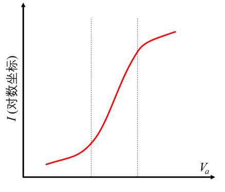

该图分为三个区域：复合区、理想区和大注入区。

左侧为复合区域。正向偏置时，空间电荷区的载流子发生复合，导致电流-电压曲线偏离理想特性。根据 SRH 复合理论，复合电流密度为

$$J_{rec} = \frac{e w n_{i}}{2 \tau_{0}} \exp\left(\frac{e V_{a}}{2 k T}\right)$$

即复合电流 $I_{rec} \propto \exp\left(\frac{e V_{a}}{2 k T}\right)$，因此 $\ln I_{rec} \propto \frac{e V_{a}}{2 k T}$。在二极管电流较小时，复合电流占主导，对应图中曲线的第一段。

中间为理想区域。此时，pn 结的电流-电压特性满足

$$I = I_{s} \left[ \exp\left( \frac{eV_{a}}{kT} \right) - 1 \right]$$

即 $I \propto \exp\left( \frac{eV_{a}}{kT} \right)$，$\ln I \propto \frac{eV_{a}}{kT}$。这对应特性曲线的中间段，表示理想条件下的电流-电压关系。

右侧为大注入区域。大注入时，过剩少子浓度不再远小于多子浓度，随着正向偏压升高，过剩载流子浓度甚至超过多子浓度，满足 $\delta n > n_{0}$ 和 $\delta p > p_{0}$，且 $\delta n = \delta p \approx n_{i} \exp\left(\frac{V_{a}}{2V_{t}}\right)$。此时电流关系为

$$I \propto \exp\left(\frac{V_{a}}{2V_{t}}\right) \Rightarrow \ln I \propto \frac{V_{a}}{2V_{t}}$$

大注入状态下的电流-电压关系对应特性曲线的第三段。

> [!note] 8-28
> 考虑反偏的硅pn结二极管，其反偏电压为$V_{R}=5V$。其他参数如下：$N_{a}=N_{d}=4\times 10^{16}cm^{-3}$，结的横截面积为$A=10^{-4}cm^{2}$。假定少子寿命$\tau_{0}=\tau_{n0}=\tau_{p0}=10^{-7}s$。计算(a)理想反向饱和电流；(b)反偏产生电流；(c)产生电流与理想反向饱和电流的比值。

(a) 计算反向饱和电流的公式为：
$$I_{s} = A e n_{i}^{2} \left[ \frac{1}{N_{a}} \sqrt{\frac{D_{n}}{\tau_{n0}}} + \frac{1}{N_{d}} \sqrt{\frac{D_{p}}{\tau_{p0}}} \right]$$

代入数值计算：
$$I_{s} = (10^{-4})(1.6 \times 10^{-19})(1.5 \times 10^{10})^{2} \times \left[ \frac{1}{4 \times 10^{16}} \sqrt{\frac{25}{10^{-7}}} + \frac{1}{4 \times 10^{16}} \sqrt{\frac{10}{10^{-7}}} \right]$$

计算结果：
$$I_{s} = 2.323 \times 10^{-15} \text{ A}$$

(b) 计算产生电流的公式为：
$$I_{gen} = \frac{A e n_{i} W}{2 \tau_{0}}$$

计算内建电势：
$$V_{bi} = (0.0259) \ln\left[\frac{(4 \times 10^{16})(4 \times 10^{16})}{(1.5 \times 10^{10})^{2}}\right] = 0.7665 \text{ V}$$

计算耗尽层宽度：
$$W = \left\{\frac{2 \epsilon_{s} (V_{bi} + V_{R})}{e} \left( \frac{N_{a} + N_{d}}{N_{a} N_{d}} \right)\right\}^{1/2}$$

代入数值计算：
$$W = \left\{\frac{2(11.7)(8.85 \times 10^{-14})(0.7665 + 5)}{1.6 \times 10^{-19}} \times \left[\frac{4 \times 10^{16} + 4 \times 10^{16}}{(4 \times 10^{16})(4 \times 10^{16})}\right]\right\}^{1/2}$$

计算结果：
$$W = 6.109 \times 10^{-5} \text{ cm}$$

计算产生电流：
$$I_{gen} = \frac{(10^{-4})(1.6 \times 10^{-19})(1.5 \times 10^{10})(6.109 \times 10^{-5})}{2(10^{-7})}$$

计算结果：
$$I_{gen} = 7.331 \times 10^{-11} \text{ A}$$

(c) 计算电流比：
$$\frac{I_{gen}}{I_{s}} = \frac{7.331 \times 10^{-11}}{2.323 \times 10^{-15}} = 3.16 \times 10^{4}$$

> [!note] 8-29
> 考虑习题8.28中的二极管。假定除了$n_i$，所有参数均不随温度改变。(a)确定$I_{s}=I_{gen}$时对应的温度的值。求此时的$I_{s}$与$I_{gen}$；(b)在$T=300K$时，计算出理想扩散电流与复合电流相等时的正偏电压。

(a) 设定 $I_{S} = I_{gen}$，得到以下方程：

$$A e n_{i}^{2} \left[ \frac{1}{N_{a}} \sqrt{\frac{D_{n}}{\tau_{n0}}} + \frac{1}{N_{d}} \sqrt{\frac{D_{p}}{\tau_{p0}}} \right] = \frac{A e n_{i} W}{2 \tau_{0}}$$

代入数值计算：

$$n_{i} \left[ \frac{1}{4 \times 10^{16}} \sqrt{\frac{25}{10^{-7}}} + \frac{1}{4 \times 10^{16}} \sqrt{\frac{10}{10^{-7}}} \right] = \frac{W}{2 \tau_{0}} = \frac{6.109 \times 10^{-5}}{2 (10^{-7})}$$

解得：

$$n_{i} = \frac{3.0545 \times 10^{2}}{3.9528 \times 10^{-13} + 2.50 \times 10^{-13}} = 4.734 \times 10^{14} \text{ cm}^{-3}$$

进一步计算：

$$n_{i}^{2} = 2.2407 \times 10^{29} = (2.8 \times 10^{19})(1.04 \times 10^{19}) \left( \frac{T}{300} \right)^{3} \exp \left[ \frac{-(1.12)(300)}{(0.0259)(T)} \right]$$

简化后得到：

$$7.6947 \times 10^{-10} = \left( \frac{T}{300} \right)^{3} \exp \left[ \frac{-(1.12)(300)}{(0.0259)(T)} \right]$$

通过试错法求解，得到：

$$T \cong 567 \text{ K}$$

(b) 计算饱和电流和产生电流：

$$I_{s} = I_{gen} = \frac{A e n_{i} W}{2 \tau_{0}} = \frac{(10^{-4})(1.6 \times 10^{-19})(4.734 \times 10^{14})(6.109 \times 10^{-5})}{2 (10^{-7})}$$

计算结果：

$$I_{s} + I_{gen} = 2.314 \times 10^{-6} \text{ A} = 2.314 \mu \text{A}$$

根据习题8.28的数据：

$$I_{s} = 2.323 \times 10^{-15} \text{ A}$$
$$I_{gen} = 7.331 \times 10^{-11} \text{ A}$$

建立电流方程：

$$I = I_{s} \exp \left( \frac{V_{a}}{V_{t}} \right) = I_{gen} \exp \left( \frac{V_{a}}{2 V_{t}} \right)$$

代入数值：

$$(2.323 \times 10^{-15}) \exp \left( \frac{V_{a}}{V_{t}} \right) = (7.331 \times 10^{-11}) \exp \left( \frac{V_{a}}{2 V_{t}} \right)$$

整理得到：

$$\frac{\exp \left( \frac{V_{a}}{V_{t}} \right)}{\exp \left( \frac{V_{a}}{2 V_{t}} \right)} = \frac{7.331 \times 10^{-11}}{2.323 \times 10^{-15}}$$

简化计算：

$$\exp \left( \frac{V_{a}}{2 V_{t}} \right) = 3.1558 \times 10^{4}$$

最终求解偏置电压：

$$V_{a} = 2 V_{t} \ln (3.1558 \times 10^{4}) = 0.5366 \text{ V}$$

> [!note] 8-30
> 考虑GaAs pn结二极管，结的横截面积为$A=2\times 10^{-4}cm^{2}$，$N_{a}=N_{d}=7\times 10^{16}cm^{-3}$。少子的迁移率为$\mu_{n}=5500cm^{2}/V·s$，$\mu_{p}=220cm^{2}/V·s$。少子的寿命为$\tau_{0}=\tau_{n0}=\tau_{p0}=2\times 10^{-8}s$。(a)计算理想二极管施加以下偏置电压的电流：(i)反偏电压$V_{R}=3V$，(ii)正偏电压$V_{a}=0.6V$，(iii)正偏电压$V_{a}=0.8V$，(iv)正偏电压$V_{a}=1.0V$；(b)假定$V_{a}=0$时的复合电流为$I_{ro}=6\times 10^{-14}A$计算施加以下偏置电压的产生电流：(i)反偏电压$V_{R}=3V$，(ii)正偏电压$V_{a}=0.6V$，(iii)正偏电压$V_{a}=0.8V$，(iv)正偏电压$V_{a}=1.0V$。

#### 8.3 PN结小信号模型

> [!note] 8-37
> (a) 假设少子寿命均为$0.5\mu s$。计算$I_{DQ}=1.2mA$（直流工作点电流）时的小信号扩散电容和扩散电阻；(b) 当$I_{DQ}=0.12mA$时，重做(a)。

>先根据题意判断需要计算的小信号参数（扩散电容和扩散电阻），再利用已知的直流工作点电流和少子寿命，直接代入小信号模型的标准公式即可。

(a) 扩散电阻的计算如下：

$$r_{d} = \frac{V_{t}}{I_{DQ}} = \frac{0.0259}{1.2 \times 10^{-3}} = 21.6\ \Omega$$

扩散电容的计算如下：

$$C_{d} = \frac{I_{DQ} \tau_{0}}{2 V_{t}} = \frac{(1.2 \times 10^{-3})(0.5 \times 10^{-6})}{2 \times 0.0259} = 1.16 \times 10^{-8}\ \text{F}$$

即 $C_{d} = 11.6\ \text{nF}$

(b) 扩散电阻的计算如下：

$$r_{d} = \frac{0.0259}{0.12 \times 10^{-3}} = 216\ \Omega$$

扩散电容的计算如下：

$$C_{d} = \frac{(0.12 \times 10^{-3})(0.5 \times 10^{-6})}{2 \times 0.0259} = 1.16 \times 10^{-9}\ \text{F}$$

即 $C_{d} = 1.16\ \text{nF}$

> [!note] 8-38
> 考虑 8-37 中描述的二极管。一个峰值为$50mV$的正弦信号被叠加在直流正偏信号上。计算交替充放电时n区电荷的幅值。

(a) 电荷变化量的公式：
$$
C_d = \frac{\Delta Q}{\Delta V}
$$

当 $I_D = 1.2\,\mathrm{mA}$ 时，电荷幅值为
$$
\Delta Q = C_d \cdot \Delta V = (1.158 \times 10^{-8}) \times (50 \times 10^{-3}) = 5.79 \times 10^{-10}\ \mathrm{C}
$$

(b) 当 $I_D = 0.12\,\mathrm{mA}$ 时，电荷幅值为
$$
\Delta Q = C_d \cdot \Delta V = (1.158 \times 10^{-9}) \times (50 \times 10^{-3}) = 5.79 \times 10^{-11}\ \mathrm{C}
$$

> [!note] 8-39
> 考虑$T=300K$时的硅$p^{+}n$结二极管。正偏电流为$1mA$，n区空穴的寿命为$10^{-7}s$。忽略耗尽层电容，计算频率为$10kHz$，$100kHz$，$1MHz$以及$10MHz$时，二极管的阻抗。

>先根据已知条件计算小信号参数（扩散电容和扩散电阻），直接代入小信号模型的标准公式即可。这里求的是阻抗，cheatsheet记录的是它的倒数导纳公式。

对于 $p^{+}n$ 二极管，有

$$
g_{d} = \frac{I_{DQ}}{V_{t}}, \qquad C_{d} = \frac{I_{DQ} \tau_{p0}}{2 V_{t}}
$$

现有

$$
g_{d} = \frac{10^{-3}}{0.0259} = 3.86 \times 10^{-2} \ \text{S}
$$

$$
C_{d} = \frac{(10^{-3})(10^{-7})}{2 \times 0.0259} = 1.93 \times 10^{-9} \ \text{F}
$$

阻抗为

$$
Z = \frac{1}{Y} = \frac{1}{g_{d} + j \omega C_{d}} = \frac{g_{d} - j \omega C_{d}}{g_{d}^{2} + \omega^{2} C_{d}^{2}}
$$

其中 $\omega = 2\pi f$。

计算结果如下：

- 当 $f = 10\,\text{kHz}$，$Z = 25.9 - j\,0.0814$
- 当 $f = 100\,\text{kHz}$，$Z = 25.9 - j\,0.814$
- 当 $f = 1\,\text{MHz}$，$Z = 23.6 - j\,7.41$
- 当 $f = 10\,\text{MHz}$，$Z = 2.38 - j\,7.49$

> [!note] 8-40
> 硅pn结的各项参数为：单边硅 $p^{+}n$ 二极管掺杂浓度为 $N_a=5\times 10^{17}$ cm$^{-3}$，$N_d=8\times 10^{15}$ cm$^{-3}$。少数载流子的寿命为 $\tau_{n0}=10^{-7}$ s，$\tau_{p0}=8\times 10^{-8}$ s。结的横截面积为 $A=2\times 10^{-4}$ cm$^2$。。(a) 计算并绘制$-10V\leq V_{a}\leq 0.75V$时，势垒电容与扩散电容的变化；(b) 计算使势垒电容与扩散电容相等的电压值。

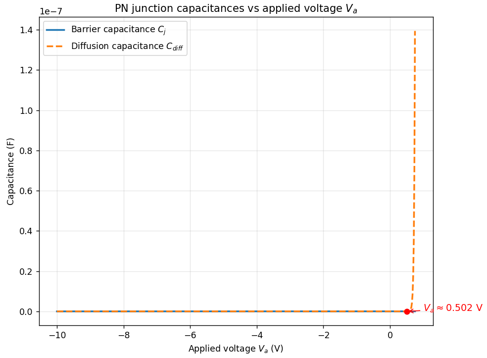

结电容的计算公式为：

$$
C_{j} = A C' = A \cdot \left\{ \frac{e \epsilon_{s} N_{a} N_{d}}{2 (V_{bi} + V_{R}) (N_{a} + N_{d})} \right\}^{1/2}
$$

内建电势差为：

$$
V_{bi} = (0.0259) \ln \left[ \frac{(5 \times 10^{17})(8 \times 10^{15})}{(1.5 \times 10^{10})^{2}} \right] = 0.790~\mathrm{V}
$$

代入数值得到：

$$
C_{j} = (2 \times 10^{-4}) \left\{ \frac{(1.6 \times 10^{-19})(11.7)(8.85 \times 10^{-14})}{2(V_{bi} + V_{R})} \times \left[ \frac{(5 \times 10^{17})(8 \times 10^{15})}{5 \times 10^{17} + 8 \times 10^{15}} \right] \right\}^{1/2}
$$

进一步化简为：

$$
C_{j} = \frac{5.1078 \times 10^{-12}}{\sqrt{V_{bi} + V_{R}}}~\mathrm{F}
$$

不同反向偏置下的结电容如下：

| $V_{R}$ (V) | $C_{j}$ (pF) |
|-------------|--------------|
| 5           | 2.123        |
| 3           | 2.624        |
| 1           | 3.818        |
| 0           | 5.747        |
| -0.20       | 6.650        |
| -0.40       | 8.179        |

正向偏置时，当 $N_{a} \gg N_{d}$，有 $I_{po} \gg I_{no}$。

扩散电容的表达式为：

$$
C_{d} = \frac{I_{po} \tau_{p0}}{2 V_{t}} = \frac{I_{po} (8 \times 10^{-8})}{2 \times 0.0259} = (1.544 \times 10^{-6}) I_{po}
$$

其中，空穴电流为：

$$
I_{po} = A e \sqrt{\frac{D_{p}}{\tau_{p0}}} \cdot \left( \frac{n_{i}^{2}}{N_{d}} \right) \cdot \exp\left( \frac{V_{a}}{V_{t}} \right)
$$

代入数值得到：

$$
I_{po} = (2 \times 10^{-4})(1.6 \times 10^{-19}) \sqrt{\frac{10}{8 \times 10^{-8}}} \cdot \frac{(1.5 \times 10^{10})^{2}}{8 \times 10^{15}} \times \exp\left( \frac{V_{a}}{V_{t}} \right)
$$

化简后：

$$
I_{po} = (1.006 \times 10^{-14}) \exp\left( \frac{V_{a}}{V_{t}} \right)~\mathrm{A}
$$

不同正向偏置下的扩散电容、结电容及总电容如下：

| $V_{a}$ (V) | $C_{d}$ (F)         | $C_{j}$ (F)           | $C_{\text{Total}}$ (F)      |
|-------------|---------------------|-----------------------|-----------------------------|
| 0.20        | $3.51 \times 10^{-17}$ | $6.650 \times 10^{-12}$ | $\approx 6.650 \times 10^{-12}$ |
| 0.40        | $7.92 \times 10^{-14}$ | $8.179 \times 10^{-12}$ | $8.258 \times 10^{-12}$         |
| 0.60        | $1.79 \times 10^{-10}$ | $\cdots$                | $\approx 1.79 \times 10^{-10}$  |

> [!note] 8-41
> 考虑$T=300K$时的硅$p^{+}n$结。其扩散电容-正偏电流曲线的斜率为$2.5\times 10^{-6}F/A$。确定空穴的寿命以及正偏电流为$1mA$时的扩散电容值。

对于 $p^{+}n$ 型二极管，$I_{pO} \gg I_{nO}$，则扩散电容表达式为：
$$C_{d} = \left( \frac{1}{2V_{t}} \right) (I_{pO} \tau_{pO})$$

已知参数关系：
$$\frac{\tau_{pO}}{2V_{t}} = 2.5 \times 10^{-6} \text{ F/A}$$

计算少子寿命：
$$\tau_{pO} = 2(0.0259)(2.5\times10^{-6})$$
即
$$\tau_{pO} = 1.3\times10^{-7} \text{ s}$$

在电流为 1 mA 条件下计算扩散电容：
$$C_d = (2.5\times10^{-6})(10^{-3})$$
即
$$C_d = 2.5\times10^{-9} \text{ F}$$

> [!note] 8-42
> 单边$p^{+}n$硅二极管掺杂浓度为$N_{a}=4\times 10^{17}cm^{-3}$，$N_{d}=8\times 10^{15}cm^{-3}$。二极管结面积为$A=5\times 10^{-4}cm^{2}$。(a) 扩散电容的最大值为$1nF$。确定：(i) 二极管的最大电流，(ii) 最大正偏电压，(iii) 扩散电容；(b) 当扩散电容的最大值为$0.25nF$时，重做(a)。

(a) 对于 $N_{a} \gg N_{d}$ 的情况，有 $I_{po} \gg I_{no}$

(i) 扩散电容：
$$C_{d} = \frac{I_{po} \tau_{p0}}{2V_{t}}$$

或者表示为：
$$I_{po} = \frac{2V_{t}(C_{d})}{\tau_{p0}} = \frac{2(0.0259)(10^{-9})}{10^{-7}}$$

计算结果为（又直接设置参数了）：
$$I_{po} = 5.18 \times 10^{-4} \text{ A} = 0.518 \text{ mA}$$

(ii) 饱和电流的计算公式为：
$$I_{po} = A e \sqrt{\frac{D_{p}}{\tau_{p0}}} \cdot \frac{n_{i}^{2}}{N_{d}} \exp\left(\frac{V_{a}}{V_{t}}\right)$$

代入数值计算：
$$0.518 \times 10^{-3} = (5 \times 10^{-4})(1.6 \times 10^{-19}) \sqrt{\frac{10}{10^{-7}}} \times \frac{(1.5 \times 10^{10})^{2}}{8 \times 10^{15}} \exp\left(\frac{V_{a}}{V_{t}}\right)$$

计算偏置电压：
$$V_{a} = (0.0259) \ln\left(\frac{0.518 \times 10^{-3}}{2.25 \times 10^{-14}}\right) = 0.618 \text{ V}$$

(iii) 动态电阻：
$$r_{d} = \frac{V_{t}}{I_{D}} = \frac{0.0259}{0.518 \times 10^{-3}} = 50 \ \Omega$$

> [!note] 8-43
> 考虑$T=300K$时的硅pn结二极管，$A=10^{-2}cm^{2}$。p区的长度为$0.2cm$，n区的长度为$0.1cm$，掺杂浓度分别为$N_{d}=10^{15}cm^{-3}$，$N_{a}=10^{16}cm^{-3}$。确定：(a) 二极管的串联电阻；(b) 串联电阻压降为$0.1V$时的二极管电流。

>串联电阻：分别根据P区和N区的电阻率、长度与横截面积计算各自的电阻，再将两者相加得到总串联电阻。电阻率可由载流子迁移率推算，$\rho = 1/\sigma = 1/(q\mu N)$，其中$\mu$为迁移率，$N$为载流子浓度。

(a) p区电阻计算：
$$R_p = \frac{\rho_p L}{A} = \frac{L}{\sigma_p A} = \frac{L}{(e\mu_p N_a)A}$$

代入数值计算：
$$R_p = \frac{0.2}{(1.6 \times 10^{-19})(480)(10^{16})(10^{-2})}$$

得到：
$$R_p = 26\Omega$$

n区电阻计算：
$$R_n = \frac{\rho_n L}{A} = \frac{L}{\sigma_n A} = \frac{L}{(e\mu_n N_d)A}$$

代入数值计算：
$$R_n = \frac{0.10}{(1.6 \times 10^{-19})(1350)(10^{15})(10^{-2})}$$

得到：
$$R_n = 46.3\Omega$$

总电阻计算：
$$R = R_p + R_n = 26 + 46.3 = 72.3\Omega$$

(b) 根据欧姆定律计算电流：
$$V = IR \Rightarrow 0.1 = I \times 72.3$$

解得：
$$I = 1.38\text{ mA}$$

> [!note] 8-44
> 本题我们要得出串联电阻对二极管的影响。(a)假设$T=300K$时二极管的反向饱和电流为$I_{s}=10^{-10}A$，n区的电阻率为$0.2\Omega\cdot cm$，p区的电阻率为$0.1\Omega\cdot cm$。假设电中性n区与p区长度均为$10^{-2}cm$，且$A=2\times 10^{-5}cm^{2}$。电流为(i)1mA和(ii)10mA时，确定外加电压的值；(b)忽略串联电阻的影响，重做(a)。

串联电阻：
$$R = \frac{\rho_n L(n)}{A(n)} + \frac{\rho_p L(p)}{A(p)}$$
代入数值计算：
$$R = \frac{(0.2)(10^{-2})}{2 \times 10^{-5}} + \frac{(0.1)(10^{-2})}{2 \times 10^{-5}}$$
计算结果：
$$R = 150\ \Omega$$

电压计算公式（串阻分压 + 偏置电压）：
$$V = I_DR + V_t \ln\left(\frac{I_D}{I_S}\right)$$

(a) 当 $I_D = 1$ mA 时：
$$V = (10^{-3})(150) + (0.0259) \ln\left(\frac{10^{-3}}{10^{-10}}\right)$$
计算结果：$V = 0.567$ V

当 $I_D = 10$ mA 时：
$$V = (10^{-2})(150) + (0.0259) \ln\left(\frac{10^{-2}}{10^{-10}}\right)$$
计算结果：$V = 1.98$ V

(b) 设 $R = 0$

当 $I_D = 1$ mA 时：
$$V = (0.0259) \ln\left(\frac{10^{-3}}{10^{-10}}\right)$$
计算结果：$V = 0.417$ V

当 $I_D = 10$ mA 时：
$$V = (0.0259) \ln\left(\frac{10^{-2}}{10^{-10}}\right)$$
计算结果：$V = 0.477$ V

> [!note] 8-45
> (a)$T=300K$时，正偏硅pn结二极管的最大小信号扩散电阻为$r_{d}=32\Omega$。反向饱和电流为$I_{s}=5\times 10^{-12}A$。计算满足上述要求的最小正偏电压；(b)最大小信号扩散电阻为$r_{d}=60\Omega$时，重做(a)。

(a) 扩散电阻：
$$r_d = \frac{V_t}{I_D} \Rightarrow I_D = \frac{V_t}{r_d} = \frac{0.0259}{32}$$

计算得到：
$$I_D = 8.09375 \times 10^{-4} \text{ A}$$

正向偏压计算公式：
$$V_a = V_t \ln\left(\frac{I_D}{I_s}\right)$$

代入数值计算：
$$V_a = (0.0259) \ln\left(\frac{8.09375 \times 10^{-4}}{5 \times 10^{-12}}\right)$$

计算结果：
$$V_a = 0.4896 \text{ V}$$

(b) 动态电阻为60Ω时的计算：
$$I_D = \frac{V_t}{r_d} = \frac{0.0259}{60} = 4.3167 \times 10^{-4} \text{ A}$$

正向偏压计算：
$$V_a = (0.0259) \ln\left(\frac{4.3167 \times 10^{-4}}{5 \times 10^{-12}}\right)$$

计算结果：
$$V_a = 0.4733 \text{ V}$$
### 第十章 MOS管初步

#### 10.1 双端MOS结构

##### MOSFET 电容/能带结构

>[!warning]  Homework 2-1
>对于一个由p型硅衬底、n+多晶硅栅极 和 二氧化硅介电层 构成的 MOS 电容器：
>
>（1）分别绘出该 MOS 电容在积累、平带、耗尽、弱反型、强反型，五种工作状态下的能带图。
>
>（2）说明反型层中载流子的类型、来源，以及它对 MOS 电容电气行为（如阈值电压和电容变化）的影响。

（1）在小抄中有说明，主要是导带底能级 $E_C$ 本征费米能级 $E_{Fi}$ 以及 价带顶能级 $E_V$ 会弯曲，针对 p 衬底的NMOS器件，栅压 $V_G$ 从负到正依次是 积累区 -> 平带区 -> 耗尽区 -> 弱反区 -> 强反区

**积累区能带图**：

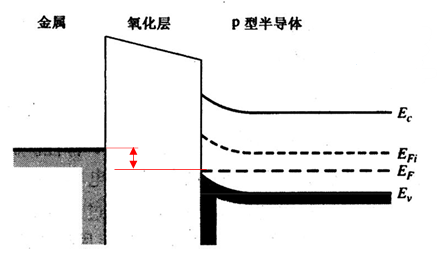

**平带区能带图**：

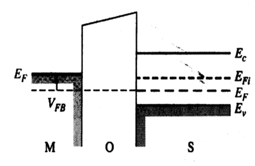
**耗尽区能带图**：

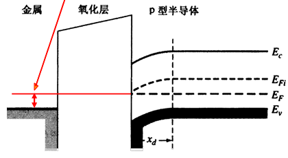
**强反型层**（弱反就是略微超过 $E_F$ 但是不到对称状态）：

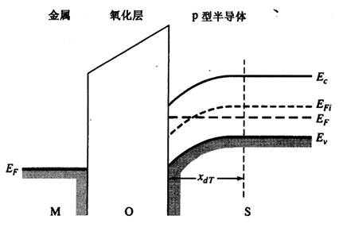
(2) 
在n沟道MOSFET的反型层（inversion layer）中，主要载流子是**电子（多数载流子）**，而在p沟道器件中则为空穴。

**来源**：反型层的电子来自两部分：一是从衬底/源区通过**热激发或扩散**进入表面（由衬底的少量电子经电场吸引到表面）；二是在强反型时由衬底与源/漏区的载流子重分布形成大量反型载流子（当表面电势改变使费米能级相对于本征位移，电子浓度迅速上升，形成反型层）

**对MOS电气特性的影响**：

1. **静态 C‑V 区别**：MOS C‑V 曲线典型有积累、耗尽与反型三段。在反型区低频表现为**接近氧化层电容** Cox（由于反型层像金属一样响应）；高频 C‑V则在反型区显示为**耗尽电容**而非 Cox。因此反型层载流子的响应速度决定低频/高频 C‑V 的差别
2. **幅度与形状**：反型层形成后，低频下测得的总电容增大接近 Cox，因为反型层可以屏蔽衬底电势，使交流信号主要跨越氧化层；高频下由于载流子不能跟随，电容保持在较低的耗尽态值。这导致 C‑V 曲线在不同频率下有显著差异
3. **界面态影响**：界面陷阱在亚阈到阈值附近会捕获/释放载流子，增加等效电容并引入频率依赖和滞后，表现为 C‑V 曲线在跨越反型区时出现弯曲或平坦区的变化

>[!danger] 10-1
>四个理想MOS电容器的dc电容分布示于图中。对每一种清况: (a) 半导体是n型的还是p型的? (b) 器件偏置在堆积模式、耗尽模式还是反型模式? (c) 画出半导体区的能带图。
> 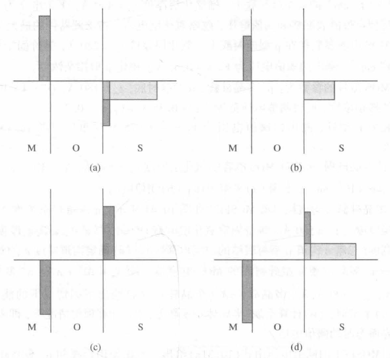

这个题有点重要，判断电容情况。

(a) **p型半导体；反型状态**  这个和书上是反过来的，不过也好理解，接入偏压，一边正电荷，一边负电荷。
(b) **p型半导体；耗尽状态**  
(c) **p型半导体；积累状态**  p型半导体接入负偏压也就是这样了，无法积累反型层电荷。
(d) **n型半导体；反型状态**  n型半导体接入负偏压的状态。

##### 参数计算：$x_{dT}$、$|Q'_{SD}(max)|$、$\phi_{fp}$($\phi_{fn}$)

>记住运算公式就够了：
>$$x_{dT} = \left[\frac{4\epsilon_s \phi_{fp}}{e N_a}\right]^{1/2}$$
>$$\left|Q'_{SD}(\max)\right| = eN_d x_{dT} = eN_d \left[\frac{4\epsilon_s \phi_{fn}}{eN_d}\right]^{1/2} = \left[eN_d (4\epsilon_s \phi_{fn})\right]^{1/2}$$
>$$\phi_{fp} = V_t \ln\left(\frac{N_a}{n_i}\right)$$

> [!note] 10-2
> (a) 分别计算当(i)$N_{a}=7\times 10^{15}cm^{-3}$和(ii)$N_{a}=3\times 10^{16}cm^{-3}$时p型硅衬底的MOS电容最大空间电荷宽度$x_{dT}$和最大空间电荷密度$|Q'_{SD}(max)|$，温度$T=300K$；(b)当$T=350K$时，重新计算(a)。

题目和答案好像不是很能对上。

(a) (i) 费米势（几乎所有的公式都有费米势）：
$$\phi_{fp} = V_t \ln\left(\frac{N_a}{n_i}\right)$$
$= (0.0259) \ln\left(\frac{7 \times 10^{15}}{1.5 \times 10^{10}}\right)$
$= 0.3381$ V

最大耗尽层宽度：
$$x_{dT} = \left[\frac{4\epsilon_s \phi_{fp}}{e N_a}\right]^{1/2}$$
$= \left[\frac{4(11.7)(8.85 \times 10^{-14})(0.3381)}{(1.6 \times 10^{-19})(7 \times 10^{15})}\right]^{1/2}$
$= 3.54 \times 10^{-5}$ cm
即 $x_{dT} = 0.354$ μm

(ii) 计算费米势：
$$\phi_{fp} = (0.0259) \ln\left(\frac{3 \times 10^{16}}{1.5 \times 10^{10}}\right)$$
$= 0.3758$ V

计算最大耗尽层宽度：
$$x_{dT} = \left[\frac{4(11.7)(8.85 \times 10^{-14})(0.3758)}{(1.6 \times 10^{-19})(3 \times 10^{16})}\right]^{1/2}$$
$= 1.80 \times 10^{-5}$ cm
即 $x_{dT} = 0.180$ μm

(b) 计算热电压：
$kT = (0.0259)\left(\frac{350}{300}\right) = 0.03022$ V

计算本征载流子浓度平方：
$n_i^2 = N_c N_v \exp\left(\frac{-E_g}{kT}\right)$
$= (2.8 \times 10^{19})(1.04 \times 10^{19})\left(\frac{350}{300}\right)^3 \exp\left(\frac{-1.12}{0.03022}\right)$
$= 3.71 \times 10^{22}$

所以本征载流子浓度为：
$n_i = 1.93 \times 10^{11}$ cm$^{-3}$

(c) (i) 计算费米势：
$\phi_{fp} = (0.03022) \ln\left(\frac{7 \times 10^{15}}{1.93 \times 10^{11}}\right)$
$= 0.3173$ V

计算最大耗尽层宽度：
$x_{dT} = \left[\frac{4(11.7)(8.85 \times 10^{-14})(0.3173)}{(1.6 \times 10^{-19})(7 \times 10^{15})}\right]^{1/2}$
$= 3.43 \times 10^{-5}$ cm
即 $x_{dT} = 0.343$ μm

(ii) 计算费米势：
$\phi_{fp} = (0.03022) \ln\left(\frac{3 \times 10^{16}}{1.93 \times 10^{11}}\right)$
$= 0.3613$ V

计算最大耗尽层宽度：
$x_{dT} = \left[\frac{4(11.7)(8.85 \times 10^{-14})(0.3613)}{(1.6 \times 10^{-19})(3 \times 10^{16})}\right]^{1/2}$
$= 1.77 \times 10^{-5}$ cm
即 $x_{dT} = 0.177$ μm

> [!note] 10-3
> (a)设$T=300K$。计算n型硅衬底MOS电容的衬底掺杂浓度，使得$|Q'_{SD}(max)|=1.25\times 10^{-8}C/cm^{2}$；(b)计算引起最大空间电荷宽度的表面势。

不明意义的题目，不给浓度硬猜算费米势算怎么回事。

(a) 最大空间电荷密度表达式为：
$$\left|Q'_{SD}(\max)\right| = eN_d x_{dT} = eN_d \left[\frac{4\epsilon_s \phi_{fn}}{eN_d}\right]^{1/2} = \left[eN_d (4\epsilon_s \phi_{fn})\right]^{1/2}$$

第一次近似：设 $\phi_{fn} = 0.30$ V
则：
$(1.25\times10^{-8})^2 = \left[(1.6\times10^{-19})N_d (4)(11.7)(8.85\times10^{-14})(0.30)\right]$
解得：$N_d = 7.86\times10^{14}$ cm$^{-3}$

第二次近似：
$\phi_{fn} = (0.0259)\ln\left(\frac{7.86\times10^{14}}{1.5\times10^{10}}\right) = 0.2814$ V
则：
$(1.25\times10^{-8})^2 = \left[(1.6\times10^{-19})N_d (4)(11.7)(8.85\times10^{-14})(0.2814)\right]$
解得：$N_d = 8.38\times10^{14}$ cm$^{-3}$

(b) $\phi_{fn} = (0.0259)\ln\left(\frac{8.38\times10^{14}}{1.5\times10^{10}}\right) = 0.2831$ V
$\phi_s = 2\phi_{fn} = 2(0.2831) = 0.566$ V

##### 功函数差 $\phi_{ms}$ 与平带电压 $V_{FB}$

>[!warning] Homework 2-6
>考虑一个n型硅衬底MOS结构，要求金属-半导体功函数差为$\phi_{ms}=-0.26$V，栅极为多晶硅。确定满足条件的栅类型（$n^{+}$或$p^{+}$），并计算相应的半导体硅掺杂浓度。

应为 n-poly 栅极，因为 p-poly 栅极的功函数差恒 > 0。

由功函数差公式：
$$\phi_{ms}=\left[\phi_{m}'-\left(\chi'+\frac{E_{g}}{2e}+\phi_{fp}\right)\right]$$

其他的参数也没给，但是跟掺杂浓度相关的是费米势 $\phi_{fp}$ 。

> [!note] 10-4
> 确定当栅极分别为(a)铝；(b)$n^{-}$多晶硅栅；(c)$p^{+}$多晶硅栅时p型硅衬底MOS结构的金属-半导体功函数差$\phi_{ms}$。令$N_{a}=6\times 10^{15}cm^{-3}$。

>主要是注意多晶硅功函数差特殊公式，主要是计算费米势，其他的参数题里应该会给。

(a) 铝栅极
金属-半导体功函数差公式：
$$\phi_{ms}=\left[\phi_{m}'-\left(\chi'+\frac{E_{g}}{2e}+\phi_{fp}\right)\right]$$

费米势：
$$\phi_{fp}=V_{t}\ln\left(\frac{N_{a}}{n_{i}}\right)$$
$=(0.0259)\ln\left(\frac{6\times 10^{15}}{1.5\times 10^{10}}\right)=0.334\text{ V}$

代入计算：
$\phi_{ms}=[3.20-(3.25+0.56+0.334)]$
得到：
$\phi_{ms}=-0.944\text{ V}$

(b) $n^{+}$多晶硅栅极
金属-半导体功函数差公式：
$$\phi_{ms}=-\left(\frac{E_{g}}{2e}+\phi_{fp}\right)=-(0.56+0.334)$$
得到：
$\phi_{ms}=-0.894\text{ V}$

(c) $p^{+}$多晶硅栅极
金属-半导体功函数差公式：
$$\phi_{ms}=\left(\frac{E_{g}}{2e}-\phi_{fp}\right)=(0.56-0.334)$$
得到：
$\phi_{ms}=+0.226\text{ V}$

>[!note] 10-5
>铝-氧化硅的MOS器件中的硅衬底中杂质掺杂浓度$N_{a}=4\times 10^{16}cm^{-3}$，利用例10.2中的参数，计算金属-半导体功函数差$\phi_{ms}$。

标准的功函数差计算

计算费米势：

$\phi_{fp} = (0.0259) \ln\left(\frac{4 \times 10^{16}}{1.5 \times 10^{10}}\right) = 0.3832$ V

计算金属-半导体功函数差：
$$\phi_{ms} = \phi'_{m} - \left(\chi' + \frac{E_g}{2e} + \phi_{fp}\right)$$
$= 3.20 - (3.25 + 0.56 + 0.3832)$

$\phi_{ms} = -0.9932$ V

$E_g$ 取值查表：

|材料|化学符号|Eg​(eV)|类型|
|---|---|---|---|
|硅|Si|1.12|间接带隙|
|锗|Ge|0.66|间接带隙|
|砷化镓|GaAs|1.42|直接带隙|
|磷化铟|InP|1.35|直接带隙|

>[!note] 10-6
>考虑一n型硅衬底MOS结构。金属-半导体功函数差$\phi_{ms}=-0.30V$。确定当栅极为：(a)n+多晶硅栅；(b)p+多晶硅栅；(c)铝栅时满足上述条件的硅掺杂浓度。如果**有的栅极材料不能满足要求**，则解释其原因。

主要制约的还是费米势，而且注意功函数差的取值范围（p-poly 栅的功函数差恒≥0）

(a) 施主掺杂浓度 $N_d \cong 2 \times 10^{17} \text{cm}^{-3}$

(b) 不可能 - p-poly 栅的功函数差 $\phi_{ms}$ 始终为正

(c) 施主掺杂浓度 $N_d \cong 2 \times 10^{15} \text{cm}^{-3}$

计算过程略。

>[!note] 10-7
>(a)$\phi_{ms} = -0.9932$ V，对于一个氧化层厚度 $t_{ox}=20nm=200A$ 和 $Q_{ss}^{\prime}=5\times 10^{-10}cm^{-2}$，计算平带电压；(b)改变氧化层厚度$t_{ox}=8nm=80A$ 时，重新计算(a)。

>本题主要考查平带电压 $V_{FB}$ 的计算方法，公式如下：

$$
V_{FB} = \phi_{ms} - \frac{Q'_{ss}}{C_{ox}}
$$

**（a）当氧化层厚度 $t_{ox} = 200 \times 10^{-8}$ cm 时：**

首先计算氧化层电容：

$$
C_{ox} = \frac{\epsilon_{ox}}{t_{ox}} = \frac{3.9 \times 8.85 \times 10^{-14}}{200 \times 10^{-8}} = 1.726 \times 10^{-7} \ \text{F/cm}^2
$$

带入公式计算平带电压：

$$
V_{FB} = -0.9932 - \frac{5 \times 10^{10} \times 1.6 \times 10^{-19}}{1.726 \times 10^{-7}} = -0.9932 - 0.0464 = -1.040 \ \text{V}
$$

**（b）当氧化层厚度 $t_{ox} = 80 \times 10^{-8}$ cm 时：**

计算氧化层电容：

$$
C_{ox} = \frac{\epsilon_{ox}}{t_{ox}} = \frac{3.9 \times 8.85 \times 10^{-14}}{80 \times 10^{-8}} = 4.314 \times 10^{-7} \ \text{F/cm}^2
$$

带入公式计算平带电压：

$$
V_{FB} = -0.9932 - \frac{5 \times 10^{10} \times 1.6 \times 10^{-19}}{4.314 \times 10^{-7}} = -0.9932 - 0.0185 = -1.012 \ \text{V}
$$

>[!note] 10-8
>考虑一 **n+多晶硅** -二氧化硅-n型硅的MOS电容器。设$N_{d}=4\times 10^{15}cm^{-3}$。计算下列情况时的平带电压：(a)$t_{ox}=200A$，而$Q_{ss}^{\prime}$分别为(i)$4\times 10^{10}cm^{-2}$，(ii)$10^{11}cm^{-2}$；(b)当$t_{ox}=120A$时重做(a)。

本题考查 MOS 电容器的平带电压 $V_{FB}$ 计算及其受氧化层电荷的影响。

---

**(a) 金属-半导体功函数差与平带电压**

金属-半导体功函数差为
$$
\phi_{ms} \approx -0.42\,\text{V}
$$
因此，平带电压为
$$
V_{FB} = \phi_{ms} = -0.42\,\text{V}
$$

---

**(b) 氧化层厚度 $t_{ox} = 200\,\text{Å}$ 时的平带电压变化**

氧化层电容为
$$
C_{ox} = \frac{3.9 \times 8.85 \times 10^{-14}}{200 \times 10^{-8}} = 1.726 \times 10^{-7}\,\text{F/cm}^2
$$

- 当 $Q_{ss}' = 4 \times 10^{10}\,\text{cm}^{-2}$ 时，平带电压变化量为
    $$
    \Delta V_{FB} = -\frac{Q_{ss}' \cdot e}{C_{ox}} = -\frac{4 \times 10^{10} \times 1.6 \times 10^{-19}}{1.726 \times 10^{-7}} = -0.0371\,\text{V}
    $$

- 当 $Q_{ss}' = 1 \times 10^{11}\,\text{cm}^{-2}$ 时，平带电压变化量为
    $$
    \Delta V_{FB} = -\frac{1 \times 10^{11} \times 1.6 \times 10^{-19}}{1.726 \times 10^{-7}} = -0.0927\,\text{V}
    $$

---

**(c) 氧化层厚度 $t_{ox} = 120\,\text{Å}$ 时的平带电压变化**

平带电压初值仍为
$$
V_{FB} = \phi_{ms} = -0.42\,\text{V}
$$

氧化层电容为
$$
C_{ox} = \frac{3.9 \times 8.85 \times 10^{-14}}{120 \times 10^{-8}} = 2.876 \times 10^{-7}\,\text{F/cm}^2
$$

- 当 $Q_{ss}' = 4 \times 10^{10}\,\text{cm}^{-2}$ 时，平带电压变化量为
    $$
    \Delta V_{FB} = -\frac{4 \times 10^{10} \times 1.6 \times 10^{-19}}{2.876 \times 10^{-7}} = -0.0223\,\text{V}
    $$

- 当 $Q_{ss}' = 1 \times 10^{11}\,\text{cm}^{-2}$ 时，平带电压变化量为
    $$
    \Delta V_{FB} = -\frac{1 \times 10^{11} \times 1.6 \times 10^{-19}}{2.876 \times 10^{-7}} = -0.0556\,\text{V}
    $$

---

**小结：**

- 平带电压 $V_{FB}$ 受功函数差和氧化层电荷影响，氧化层电荷越大，$V_{FB}$ 绝对值增大。
- 氧化层越薄，单位面积电容 $C_{ox}$ 越大，$Q_{ss}'$ 对 $V_{FB}$ 的影响越小。
- 计算时注意单位换算，$Q_{ss}'$ 需乘以元电荷 $e$ 转换为库仑。

>[!note] 10-9
>考虑一$t_{ox}=450A$的铝栅-二氧化硅-p型硅MOS结构。硅掺杂浓度为$N_{a}=2\times 10^{16}cm^{-3}$，平带电压为$V_{FB}=-1.0V$。确定固定氧化层电荷$Q_{ss}^{\prime}$。

平带电压公式的灵活运用：$Q_{ss}^{\prime}=(\phi_{ms}-V_{FB})C_{ox}$

$$\phi_{ms}=\phi_{m}^{\prime}-\left(\chi^{\prime}+\frac{E_{g}}{2e}+\phi_{fp}\right)$$

费米势：
$$\phi_{fp}=(0.0259)\ln\left(\frac{2\times 10^{16}}{1.5\times 10^{10}}\right)=0.365\text{ V}$$

代入：
$$\phi_{ms}=3.20-(3.25+0.56+0.365)$$
即：
$$\phi_{ms}=-0.975\text{ V}$$

平带电压公式：
$$V_{FB}=\phi_{ms}-\frac{Q_{ss}^{\prime}}{C_{ox}}$$

或者表示为：
$$Q_{ss}^{\prime}=(\phi_{ms}-V_{FB})C_{ox}$$

氧化层电容的计算为：
$C_{ox}=\frac{\epsilon_{ox}}{t_{ox}}=\frac{(3.9)(8.85\times 10^{-14})}{450\times 10^{-8}}$

得到：
$C_{ox}=7.67\times 10^{-8}\text{ F/cm}^{2}$

最终计算氧化层电荷密度：
$Q_{ss}^{\prime}=[-0.975-(-1)]\cdot(7.67\times 10^{-8})$
$=1.92\times 10^{-9}\text{ C/cm}^{2}$

换算为面密度：
$\frac{Q_{ss}^{\prime}}{e}=1.2\times 10^{10}\text{ cm}^{-2}$

##### 阈值电压 $V_{T}$

>[!note] 10-10
>一MOS晶体管制作在$N_{a}=2\times 10^{16}cm^{-3}$的p型硅衬底上。栅氧化层厚度$t_{ox}=150A$，等价固定氧化层电荷$Q_{ss}^{\prime}=7\times 10^{10}cm^{-2}$。计算当栅极材料为(a)铝；(b)n+多晶硅栅；(c)p+多晶硅栅时的阈值电压。

费米势计算：
$$\phi_{fp} = (0.0259)\ln\left(\frac{2\times10^{16}}{1.5\times10^{10}}\right) = 0.3653\text{ V}$$

最大耗尽层宽度计算：
$$x_{dT} = \left[\frac{4(11.7)(8.85\times10^{-14})(0.3653)}{(1.6\times10^{-19})(2\times10^{16})}\right]^{1/2} = 2.174\times10^{-5}\text{ cm}$$

最大空间电荷密度计算：
$$|Q'_{SD}(\max)| = eN_{a}x_{dT} = (1.6\times10^{-19})(2\times10^{16})(2.174\times10^{-5}) = 6.958\times10^{-8}\text{ C/cm}^{2}$$

氧化层电容计算：
$$C_{ox} = \frac{(3.9)(8.85\times10^{-14})}{150\times10^{-8}} = 2.301\times10^{-7}\text{ F/cm}^{2}$$

阈值电压计算公式：
$$V_{TN} = \frac{|Q'_{SD}(\max)| - Q'_{ss}}{C_{ox}} + \phi_{ms} + 2\phi_{fp}$$

代入数值计算：
$$V_{TN} = \frac{6.958\times10^{-8} - (7\times10^{10})(1.6\times10^{-19})}{2.301\times10^{-7}} + \phi_{ms} + 2(0.3653) = 0.9843 + \phi_{ms}$$

(a) n⁺多晶硅栅在p型衬底上：
$$\phi_{ms} \cong -1.12\text{ V}, \quad V_{TN} = 0.9843 - 1.12 = -0.136\text{ V}$$

(b) p⁺多晶硅栅在p型衬底上：
$$\phi_{ms} \cong +0.28\text{ V}, \quad V_{TN} = 0.9843 + 0.28 = +1.26\text{ V}$$

(c) 铝栅在p型衬底上：
$$\phi_{ms} \cong -0.95\text{ V}, \quad V_{TN} = 0.9843 - 0.95 = +0.0343\text{ V}$$

>[!note] 10-11
>当n型硅衬底$N_{d}=3\times 10^{15}cm^{-3}$时，重做习题10.10。

自测题

>[!note] 10-12
>$N_{a}=5\times 10^{15}cm^{-3}$的p型硅衬底上，栅氧化层厚度$t_{ox}=400A$，平带电压为-0.9V。计算在阈值反型点处的表面势和阈值电压，忽略氧化层电荷。再求此器件的最大空间电荷宽度。

计算费米势：
$$\phi_{fp} = (0.0259)\ln\left(\frac{5\times 10^{15}}{1.5\times 10^{10}}\right) = 0.3294\text{ V}$$

计算表面势：
$$\phi_s = 2\phi_{fp} = 2(0.3294) = 0.659\text{ V}$$

平带电压表达式：
$$V_{FB} = \phi_{ms} - \frac{Q'_{ss}}{C_{ox}} = -0.90\text{ V}$$

阈值电压计算公式：
$$V_T = \frac{|Q'_{SD}(\max)|}{C_{ox}} + \phi_s + V_{FB}$$

计算最大耗尽层宽度：
$$x_{dT} = \left[\frac{4\epsilon_s\phi_{fp}}{eN_a}\right]^{1/2}$$

代入数值计算：
$$x_{dT} = \left[\frac{4(11.7)(8.85\times 10^{-14})(0.3294)}{(1.6\times 10^{-19})(5\times 10^{15})}\right]^{1/2} = 0.413\times 10^{-4}\text{ cm}$$

计算最大空间电荷密度：
$$|Q'_{SD}(\max)| = (1.6\times 10^{-19})(5\times 10^{15})(0.413\times 10^{-4}) = 3.304\times 10^{-8}\text{ C/cm}^2$$

计算氧化层电容：
$$C_{ox} = \frac{\epsilon_{ox}}{t_{ox}} = \frac{(3.9)(8.85\times 10^{-14})}{400\times 10^{-8}} = 8.629\times 10^{-8}\text{ F/cm}^2$$

最终计算阈值电压：
$$V_T = \frac{3.304\times 10^{-8}}{8.629\times 10^{-8}} + 0.659 - 0.90 = +0.142\text{ V}$$

>[!note] 10-13
>铝栅MOS电容器制作在p型硅衬底上。氧化层厚度$t_{ox}=220A$，等价固定氧化层电荷$Q_{ss}^{\prime}=4\times 10^{10}cm^{-2}$，测出的阈值电压为$V_{T}=+0.45V$。确定p型掺杂浓度。

计算氧化层电容：
$$C_{ox} = \frac{\epsilon_{ox}}{t_{ox}} = \frac{(3.9)(8.85\times10^{-14})}{220\times10^{-8}} = 1.569\times10^{-7} \text{ F/cm}^{2}$$

计算表面电荷密度（该死的题目只给了一个面积分布）：
$$Q_{ss}' = (1.6\times10^{-19})(4\times10^{10}) = 6.4\times10^{-9} \text{ C/cm}^{2}$$

通过试错法，设 $N_{a} = 4\times10^{16} \text{ cm}^{-3}$

计算费米势：
$$\phi_{fp} = (0.0259)\ln\left(\frac{4\times 10^{16}}{1.5\times 10^{10}}\right) = 0.3832\text{ V}$$

计算最大耗尽层宽度：
$$x_{dT} = \left[\frac{4(11.7)(8.85\times 10^{-14})(0.3832)}{(1.6\times 10^{-19})(4\times 10^{16})}\right]^{1/2} = 1.575\times 10^{-5}\text{ cm}$$

计算最大空间电荷密度：
$$|Q_{SD}'(\max)| = (1.6\times 10^{-19})(4\times 10^{16})(1.575\times 10^{-5}) = 1.008\times 10^{-7}\text{ C/cm}^{2}$$

设金属-半导体功函数差：
$$\phi_{ms} \cong -0.94\text{ V}$$

计算阈值电压：
$$V_{TN} = \frac{|Q_{SD}'(\max)| - Q_{ss}'}{C_{ox}} + \phi_{ms} + 2\phi_{fp}$$

代入数值计算：
$$V_{TN} = \frac{1.008\times 10^{-7} - 6.4\times 10^{-9}}{1.569\times 10^{-7}} - 0.94 + 2(0.3832)$$

最终结果：
$$V_{TN} = 0.428\text{ V} \cong 0.45\text{ V}$$
#### 10.2 电容-电压特性

>[!warning] 10-23（Homework 2-2）
>一理想$n^{+}$多晶硅栅MOS电容器，二氧化硅层厚度为$t_{ox}=120A$，p型硅衬底的受主浓度为$N_{a}=10^{16}cm^{-3}$。计算：
>
>(a)$f=1Hz$和(b)$f=1MHz$时的电容$C_{ox}$、$C_{FB}^{\prime}$、$C^{\prime}(inv)$和$C_{min}^{\prime}$；
>
>(c)计算$V_{FB}$和$V_{T}$。画出(a)和(b)情形时$C^{\prime}/C_{ox}$与$V_{G}$的函数关系图。

主要就是几种电容的计算公式，位于 cheatsheet 背面左下角（热电压的写法可能略有不同），以及低频和高频反型电容的区别。

(a) 
当频率 $f=1$ Hz（低频）时：

氧化层电容：
$$C_{ox}=\frac{\epsilon_{ox}}{t_{ox}}=\frac{(3.9)(8.85\times10^{-14})}{120\times10^{-8}}=2.876\times10^{-7} F/cm^{2}$$
平带电容：
$$C_{FB}'=\frac{\epsilon_{ox}}{t_{ox}+\left(\frac{\epsilon_{ox}}{\epsilon_{s}}\right)\sqrt{\frac{V_{t}\epsilon_{s}}{eN_{a}}}}$$
$=\frac{(3.9)(8.85\times10^{-14})}{120\times10^{-8}+\left(\frac{3.9}{11.7}\right)\sqrt{\frac{(0.0259)(11.7)(8.85\times10^{-14})}{(1.6\times10^{-19})(10^{16})}}}$

$=1.346\times10^{-7}$ F/cm$^{2}$

最小电容：
$$C_{\min}'=\frac{\epsilon_{ox}}{t_{ox}+\left(\frac{\epsilon_{ox}}{\epsilon_{s}}\right)\cdot x_{dT}}$$

费米势：
$$\phi_{fp}=(0.0259)\ln\left(\frac{10^{16}}{1.5\times10^{10}}\right)=0.3473V$$
最大耗尽层宽度：
$$x_{dT}=\left[\frac{4(11.7)(8.85\times10^{-14})(0.3473)}{(1.6\times10^{-19})(10^{16})}\right]^{1/2}=3.00\times10^{-5} cm$$

最小电容：
$$C'_{\text{min}} = \frac{(3.9)(8.85 \times 10^{-14})}{120 \times 10^{-8} + \left(\frac{3.9}{11.7}\right)(3.00 \times 10^{-5})}$$
$= 3.083 \times 10^{-8} \text{ F/cm}^2$

反型电容计算：
$$C'(\text{inv}) = C_{\text{ox}} = 2.876 \times 10^{-7} \text{ F/cm}^2$$

(b) 
当频率 $f = 1\text{MHz}$（高频）时：

- 氧化层电容 $C_{\text{ox}} = 2.876 \times 10^{-7} \text{ F/cm}^2$（不变）
- 平带电容 $C_{\text{FB}}' = 1.346 \times 10^{-7} \text{ F/cm}^2$（不变）
- 最小电容 $C'_{\text{min}} = 3.083 \times 10^{-8} \text{ F/cm}^2$（不变）
- 反型电容 $C'(\text{inv}) = C'_{\text{min}} = 3.083 \times 10^{-8} \text{ F/cm}^2$

(c) 
平带电压：
$$V_{\text{FB}} = \phi_{\text{ms}} \cong -1.10 \text{ V}$$
（忽略了氧化层附着电荷的存在）

阈值电压：
$$V_{TN} = \frac{|Q'_{SD}(\text{max})|}{C_{\text{ox}}} + V_{\text{FB}} + 2\phi_{\text{fp}}$$

最大空间电荷密度：
$|Q'_{SD}(\text{max})| = e N_a x_{dT}$
$= (1.6 \times 10^{-19})(10^{16})(3.00 \times 10^{-5})$
$= 4.80 \times 10^{-8} \text{ C/cm}^2$

代入计算阈值电压：
$V_{TN} = \frac{4.80 \times 10^{-8}}{2.876 \times 10^{-7}} - 1.10 + 2(0.3473)$
$V_{TN} = -0.2385 \text{ V}$

（d）

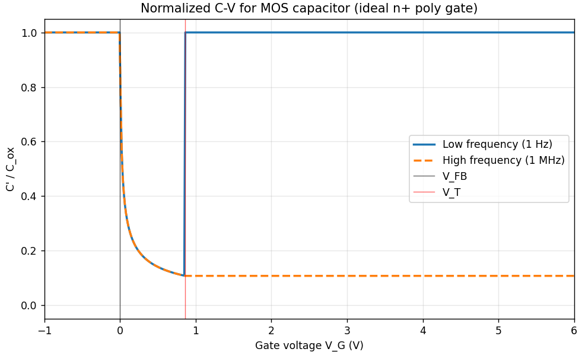

>[!note] 10-24
>对于p型硅衬底和$p^{+}$多晶硅栅理想MOS电容器，施主浓度为$N_{d}=5\times10^{14}cm^{-3}$，重做习题10.23。

自测题。

>[!note] 10-30
>一MOS电容器的高频特性曲线如图P10.30所示。器件面积为$2\times 10^{-3}cm^{2}$，金属-半导体功函数差$\phi_{ms}=-0.50V$，氧化层为$SiO_{2}$，半导体为硅，半导体掺杂浓度为$2\times 10^{16}cm^{-3}$。(a)半导体是n型的还是p型的？(b)氧化层厚度是多少？(c)等价氧化层陷阱电荷密度是多少？(d)求平带电容。

#### 10.3 MOSFET 基本工作原理

>[!warning] Homework 2-3
>结合NMOS 的 电流-电压关系 推导过程，试推导 PMOS 电流-电压 方程，并分析 $V_{GS}$ 、 $V_{DS}$ 对增强型 PMOS 及耗尽型 PMOS 导电沟道及输出电流的影响。

**PMOS 电流-电压公式推导**：

**1：沟道电流微分方程的建立**：

**电流密度**$J_{x}$：根据假设，沟道电流为漂移电流。对于空穴（电荷$+q$），电导率为$\sigma = qp(y)\mu_{p}$。
$$J_{x} = \sigma E_{x} = qp(y)\mu_{p}E_{x}$$
**总电流**$I_{x}$：对沟道横截面（y-z平面）积分。
$$I_{x} = \iint J_{x}dydz = \iint qp(y)\mu_{p}E_{x}dydz$$
定义**反型层电荷**$Q_{p}^{\prime}$：将y方向的积分（即单位面积内的可移动空穴总电荷）定义为反型层电荷密度$Q_{p}^{\prime}$。这是一个正值。
$$Q_{p}^{\prime} = \int qp(y)dy$$
同时，对z方向（宽度）积分$\int dz = W$。

电流 $I_{x}$ 表达式优化：
$$I_{x} = W \mu_{p} E_{x} \left( \int q p(y) dy \right) = W \mu_{p} Q_{p}^{\prime} E_{x}$$
引入电势：横向电场 $E_{x}$ 是沟道电势 $V_{x}$ 的负梯度，即 $E_{x} = -\frac{dV_{x}}{dx}$。

代入得到：
$$I_{x} = -W \mu_{p} Q_{p}^{\prime} \frac{dV_{x}}{dx}$$

符号检查：
- $W$、$\mu_{p}$、$Q_{p}^{\prime}$ 均为正值
- $V_{x}$ 从源极 S（0）变化到漏极 D（$V_{DS} < 0$），因此 $\frac{dV_{x}}{dx}$ 为负值
- 所以 $I_{x} = -(\text{正值}) \times (\text{负值}) = \text{正值}$

这与我们定义的 $I_{x}$（常规电流从源极流向漏极）一致。

**2 & 3：电荷平衡与电压关系**

由高斯定律：我们需要将氧化层电场$E_{ox}$与半导体内的总电荷关联起来。对于PMOS器件，半导体一侧的总电荷$Q_{T,semi}^{\prime}$由三部分构成，且均为正电荷：

- $Q_{ss}^{\prime}$：固定的氧化层/界面电荷（通常为正）
- $Q_{SD}^{\prime}(max)$：耗尽层电荷（N型衬底中固定的正施主离子$N_{D}^{+}$），$|Q_{SD}^{\prime}(max)| = eN_{D}x_{dT}$
- $Q_{p}^{\prime}$：反型层电荷（可移动的空穴）

通过高斯定律，可以得到：
$$\epsilon_{ox}E_{ox} = Q_{ss}^{\prime} + Q_{p}^{\prime} + |Q_{SD}^{\prime}(max)|$$

（此处$E_{ox}$定义为从半导体指向栅极，为正值）

**电压平衡**：适用于任意栅压$V_{GS}$和沟道电势$V_{x}$的电压平衡方程为：
$$V_{GS} - V_{x} = V_{ox} + \Phi_{ms} + \phi_{s}$$
在PMOS的强反型状态下，表面电势$\phi_{s}$被钉扎在$\phi_{s} \approx 2\phi_{fn}$（其中$\phi_{fn} = V_{t}\ln(N_{D}/n_{i})$）

因此：
$$V_{ox} = (V_{GS} - V_{x}) - \Phi_{ms} - 2\phi_{fn}$$
**求解**$Q_{p}^{\prime}$：

我们有$E_{ox} \approx -V_{ox}/t_{ox}$（$V_{ox}$是栅极G到源极S界面的电压降，且$V_{ox}$为负值）。代入$C_{ox} = \epsilon_{ox}/t_{ox}$，可得$\epsilon_{ox}E_{ox} \approx -C_{ox}V_{ox}$。

将此关系代入高斯定律结果：
$$-C_{ox}V_{ox} = Q_{ss}^{\prime} + Q_{p}^{\prime} + |Q_{SD}^{\prime}(\max)|$$
代入$V_{ox}$的表达式：
$$-C_{ox}[(V_{GS}-V_{x})-\Phi_{ms}-2\phi_{fn}] = Q_{ss}^{\prime} + Q_{p}^{\prime} + |Q_{SD}^{\prime}(\max)|$$
解出$Q_{p}^{\prime}$：
$$Q_{p}^{\prime} = -C_{ox}(V_{GS}-V_{x}) + C_{ox}(\Phi_{ms}+2\phi_{fn}) - Q_{ss}^{\prime} - |Q_{SD}^{\prime}(\max)|$$

**4：引入 $V_{TP}$ 简化电荷表达式**

定义PMOS阈值电压$V_{TP}$：$V_{TP}$是使沟道刚好反型（$Q_{p}^{\prime} \to 0$）时的$V_{GS}$（此时$V_{x}=0$）。它由所有固定电荷和势垒决定：
$$V_{TP}=\Phi_{ms}+2\phi_{fn}-\frac{Q_{ss}^{\prime}}{C_{ox}}-\frac{\left|Q_{SD}^{\prime}(\max)\right|}{C_{ox}}$$
**简化$Q_{p}^{\prime}$的表达式**：

重新整理$Q_{p}^{\prime}$的表达式：
$$Q_{p}^{\prime}=-C_{ox}(V_{GS}-V_{x})-\left[-C_{ox}(\Phi_{ms}+2\phi_{fn})+Q_{ss}^{\prime}+\left|Q_{SD}^{\prime}(\max)\right|\right]$$
$$Q_{p}^{\prime}=-C_{ox}(V_{GS}-V_{x})-C_{ox}\left[-(\Phi_{ms}+2\phi_{fn})+\frac{Q_{ss}^{\prime}}{C_{ox}}+\frac{\left|Q_{SD}^{\prime}(\max)\right|}{C_{ox}}\right]$$
注意$V_{TP}$的定义，我们可以看到中括号内的项等于$-V_{TP}$。
$$Q_{p}^{\prime}=-C_{ox}(V_{GS}-V_{x})-C_{ox}(-V_{TP})$$
最终的$Q_{p}^{\prime}$表达式：
$$Q_{p}^{\prime}=-C_{ox}(V_{GS}-V_{x}-V_{TP})$$

**5：代入并积分沟道电流**

将 $Q_p'$ 代入步骤1的 $I_x$ 表达式：
$$I_x = -W \mu_p [-C_{ox}(V_{GS} - V_x - V_{TP})] \frac{dV_x}{dx}$$
$$I_x = W \mu_p C_{ox} (V_{GS} - V_{TP} - V_x) \frac{dV_x}{dx}$$
对沟道全长（x从0到L）和电势（$V_x$ 从0到$V_{DS}$）进行积分。$I_x$ 不随x改变，等于 $I_{SD}$。

$$\int_0^L I_{SD} dx = \int_0^{V_{DS}} W \mu_p C_{ox} (V_{GS} - V_{TP} - V_x) dV_x$$

$$I_{SD} \cdot L = W \mu_p C_{ox} \left[ (V_{GS} - V_{TP}) V_x - \frac{V_x^2}{2} \right]_0^{V_{DS}}$$

$$I_{SD} = \frac{W \mu_p C_{ox}}{L} \left[ (V_{GS} - V_{TP}) V_{DS} - \frac{V_{DS}^2}{2} \right]$$

**QED.**

>[!warning] Homework 2-4
>考虑一个n沟道增强型MOSFET的偏置情况如下图所示。请分析以下几种情况下漏电流$I_{D}$随漏源电压$V_{DS}$的变化关系，给出漏电流$I_{D}$的表达式并画出$I_{D}$-$V_{DS}$特性曲线：
>
>(a) $V_{GD} = 0$
>
>(b) $V_{GD} = V_{T}/3$
>
>(c) $V_{GD} = 2V_{T}$

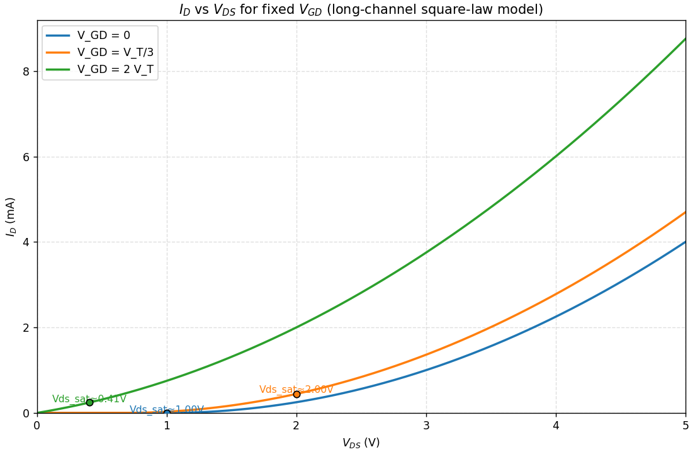

>[!warning] Homework 2-7 
>一个n沟道MOSFET的参数如下：$k_{n}'=\mu_{n}C_{ox}=0.18\text{ mA/V}^{2}$，$W/L=8$，阈值电压$V_{T}=0.4\text{ V}$。分别计算以下情况下的漏电流$I_{D}$：
>
>(1) $V_{GS}=0.8\text{ V}$，$V_{DS}=0.2\text{ V}$；
>
>(2) $V_{GS}=0.8\text{ V}$，$V_{DS}=1.2\text{ V}$；
>
>(3) $V_{GS}=0.8\text{ V}$，$V_{DS}=2.5\text{ V}$；
>
>(4) $V_{GS}=1.2\text{ V}$，$V_{DS}=2.5\text{ V}$。

需要判断一下晶体管的工作状态，(1) 是线性区，(2) 是饱和区，(3) 也是饱和区，(4) 也是饱和区。

答案见 10-33 。

> [!note] 10-32
> 反型电荷密度的表达式由式(10.59)给出。考虑阈值电压的定义，证明饱和时漏端反型电荷密度为零，假设 $V_x = V_{DS} = V_{DS}(\text{sat})$。

反型层电荷密度在 I-V 关系推导的过程中有。

我们有以下公式：

$$
Q_{n}' = -C_{ox}\left[\left(V_{GS}-V_{x}\right)-\left(\phi_{ms}+2\phi_{fp}\right)\right] - \left(Q_{ss}'+Q_{SD}'(\max)\right)
$$

现在令 $V_{x}=V_{DS}$，得到：

$$
Q_{n}' = -C_{ox}\left\{\left(V_{GS}-V_{DS}\right) + \left[\frac{\left|Q_{SD}'(\max)\right|+Q_{ss}'}{C_{ox}}-\left(\phi_{ms}+2\phi_{fp}\right)\right]\right\}
$$

对于p型衬底，$Q_{SD}'(\max)$ 是一个负值，因此我们可以写作：

$$
Q_{n}' = -C_{ox}\left\{\left(V_{GS}-V_{DS}\right) - \left[\frac{\left|Q_{SD}'(\max)\right|-Q_{ss}'}{C_{ox}}+\phi_{ms}+2\phi_{fp}\right]\right\}
$$

使用阈值电压 $V_{T}$ 的定义，我们有：

$$
Q_{n}' = -C_{ox}\left[\left(V_{GS}-V_{DS}\right)-V_{T}\right]
$$

在饱和区：

$$
V_{DS} = V_{DS}(sat) = V_{GS} - V_{T}
$$

这使得漏极端的 $Q_{n}'$ 等于零。

> [!note] 10-33
> 一n沟道MOSFET的参数如下：$k_n' = 0.18 \text{ mA/V}^2$，$W/L = 8$，$V_T = 0.4 \text{ V}$，分别计算
> (a) $V_{GS} = 0.8 \text{ V}$，$V_{DS} = 0.2 \text{ V}$；
> (b) $V_{GS} = 0.8 \text{ V}$，$V_{DS} = 1.2 \text{ V}$；
> (c) $V_{GS} = 0.8 \text{ V}$，$V_{DS} = 2.5 \text{ V}$；
> (d) $V_{GS} = 1.2 \text{ V}$，$V_{DS} = 2.5 \text{ V}$时的漏电流 $I_D$。

主要是判断MOS管的工作状态，注意k的单位，最后电流的单位是 mA：

(a) 计算漏极电流的公式为：
$$I_D = \frac{k_n'}{2} \cdot \frac{W}{L} [2(V_{GS} - V_T) V_{DS} - V_{DS}^2]$$

代入具体数值计算：
$$I_D = \left( \frac{0.18}{2} \right)(8) [2(0.8 - 0.4)(0.2) - (0.2)^2]$$

计算结果：
$$I_D = 0.0864  \text{ mA}$$

(b) 计算漏极电流的公式为：
$$I_D = \frac{k_n'}{2} \cdot \frac{W}{L} (V_{GS} - V_T)^2$$

代入具体数值计算：
$$I_D = \left( \frac{0.18}{2} \right)(8) (0.8 - 0.4)^2$$

计算结果：
$$I_D = 0.1152  \text{ mA}$$

(c) 采用与(b)相同的计算公式：
$$I_D = 0.1152  \text{ mA}$$

(d) 计算漏极电流的公式为：
$$I_D = \frac{k_n'}{2} \cdot \frac{W}{L} (V_{GS} - V_T)^2$$

代入具体数值计算：
$$I_D = \left( \frac{0.18}{2} \right)(8) (1.2 - 0.4)^2$$

计算结果：
$$I_D = 0.4608  \text{ mA}$$

> [!note] 10-34
> 一p沟道MOSFET的参数如下：$k_p' = 0.10 \text{ mA/V}^2$，$W/L = 15$，$V_T = -0.4 \text{ V}$，分别计算
> (a) $V_{SG} = 0.8 \text{ V}$，$V_{SD} = 0.25 \text{ V}$；
> (b) $V_{SG} = 0.8 \text{ V}$，$V_{SD} = 1.0 \text{ V}$；
> (c) $V_{SG} = 1.2 \text{ V}$，$V_{SD} = 1.0 \text{ V}$；
> (d) $V_{SG} = 1.2 \text{ V}$，$V_{SD} = 2.0 \text{ V}$时的漏电流 $I_D$。

原理同上，但是换成是PMOS的电流公式（cheatsheet中有）

(a) 计算漏极电流的公式为：
$$I_{D} = \frac{k_{p}'}{2} \cdot \frac{W}{L} \left[ 2(V_{SG} + V_{T}) V_{SD} - V_{SD}^{2} \right]$$

代入具体数值计算：
$$I_{D} = \left( \frac{0.10}{2} \right) (15) \left[ 2(0.8 - 0.4)(0.25) - (0.25)^{2} \right]$$

计算结果：
$$I_{D} = 0.103 \text{ mA}$$

(b) 计算漏极电流的公式为：
$$I_{D} = \frac{k_{p}'}{2} \cdot \frac{W}{L} (V_{SG} + V_{T})^{2}$$

代入具体数值计算：
$$I_{D} = \left( \frac{0.10}{2} \right) (15) (0.8 - 0.4)^{2}$$

计算结果：
$$I_{D} = 0.12 \text{ mA}$$

(c) 计算漏极电流的公式为：
$$I_{D} = \frac{k_{p}'}{2} \cdot \frac{W}{L} (V_{SG} + V_{T})^{2}$$

代入具体数值计算：
$$I_{D} = \left( \frac{0.10}{2} \right) (15) (1.2 - 0.4)^{2}$$

计算结果：
$$I_{D} = 0.48 \text{ mA}$$

(d) 与(c)相同，计算结果为：
$$I_{D} = 0.48 \text{ mA}$$

#### 10.4 频率限制特性

>[!note] 10-55  
>一个理想n沟道MOSFET的参数为：$W/L=10$，$\mu_{n}=400\text{ cm}^{2}/\text{V·s}$，$t_{ox}=475A$，$V_{T}=0.65\ \text{V}$。(a) 当$V_{GS}=5\ \text{V}$时，求使得饱和跨导$g_{ms}$下降到不大于理想值20%的源极电阻最大值；(b) 使用(a)中求得的$r_s$值，当$V_{GS}=3\ \text{V}$时，$g_{ms}$下降到理想值的百分之几？

(a) 跨导计算公式为：
$$g_m = \frac{W \mu_n C_{ox}}{L} (V_{GS} - V_T) = \frac{W \mu_n \epsilon_{ox}}{L t_{ox}} (V_{GS} - V_T)$$

代入具体数值计算：
$$g_m = \frac{(10)(400)(3.9)(8.85 \times 10^{-14})}{475 \times 10^{-8}} (5 - 0.65)$$

计算结果：
$$g_m = 1.26 \text{ mS}$$

考虑源极电阻影响的有效跨导计算公式为：
$$g_m' = \frac{g_m}{1 + g_m r_s} \Rightarrow \frac{g_m'}{g_m} = 0.8 = \frac{1}{1 + g_m r_s}$$

(b) 源极电阻计算公式为：
$$r_s = \frac{1}{g_m} \left( \frac{1}{0.8} - 1 \right) = \frac{1}{1.26} \left( \frac{1}{0.8} - 1 \right)$$

计算结果：
$$r_s = 0.198 \text{ k}\Omega$$

当 $V_{GS} = 3$ V 时，跨导计算：
$$g_m = 0.683 \text{ mS}$$

有效跨导计算：
$$g_m' = \frac{0.683}{1 + (0.683)(0.198)} = 0.602 \text{ mS}$$

跨导比计算：
$$\frac{g_m'}{g_m} = \frac{0.602}{0.683} = 0.88$$

结果表明跨导降低了 12%。

>[!note] 10-56  
>一个n沟道MOSFET的参数如下：$\mu_{n}=400\text{ cm}^{2}/\text{V·s}$，$t_{ox}=500A$，$V_{T}=0.75\ \text{V}$，$L=2\ \mu\text{m}$，$W=20\ \mu\text{m}$，假设晶体管偏置在饱和区，$V_{GS}=4\ \text{V}$。(a) 计算理想截止频率；(b) 假设源、漏处均有$0.75\ \mu\text{m}$的栅氧化层交叠，负载电阻$R_{L}=10\ \text{k}\Omega$接至输出，计算截止频率。

(a) 无交叠电容时的理想截止频率计算公式为：
$$f_T = \frac{g_m}{2\pi C_{gs}} = \frac{\mu_n (V_{GS} - V_T)}{2\pi L^2}$$

代入数值计算：
$$f_T = \frac{(400)(4 - 0.75)}{2\pi (2 \times 10^{-4})^2}$$

计算结果：
$$f_T = 5.17 \text{ GHz}$$

(b) 考虑米勒效应时的截止频率计算公式为：
$$f_T = \frac{g_m}{2\pi (C_{gsT} + C_M)}$$

其中米勒电容计算公式为：
$$C_M = C_{gdT} (1 + g_m R_L)$$

计算栅漏电容：
$$C_{gdT} = C_{ox} (0.75 \times 10^{-4}) (20 \times 10^{-4})$$
$$= \frac{(3.9)(8.85 \times 10^{-14})}{500 \times 10^{-8}} \times (0.75 \times 10^{-4}) (20 \times 10^{-4})$$

计算结果：
$$C_{gdT} = 1.035 \times 10^{-14} \text{ F}$$

计算跨导（已知晶体管偏置在饱和区）：
$$g_m = \frac{W \mu_n C_{ox}}{L} (V_{GS} - V_T)$$
$$= \frac{(20 \times 10^{-4})(400)(3.9)(8.85 \times 10^{-14})}{(2 \times 10^{-4})(500 \times 10^{-8})} \times (4 - 0.75)$$

计算结果：
$$g_m = 0.8974 \times 10^{-3} \text{ S}$$

计算米勒电容：
$$C_M = (1.035 \times 10^{-14}) \times [1 + (0.8974 \times 10^{-3})(10 \times 10^3)]$$

计算结果：
$$C_M = 1.032 \times 10^{-13} \text{ F}$$

计算栅源电容：
$$C_{gsT} = C_{ox} (L + 0.75 \times 10^{-4}) (W)$$
$$= \frac{(3.9)(8.85 \times 10^{-14})}{500 \times 10^{-8}} \times (2 \times 10^{-4} + 0.75 \times 10^{-4}) (20 \times 10^{-4})$$

计算结果：
$$C_{gsT} = 3.797 \times 10^{-14} \text{ F}$$

最终计算截止频率：
$$f_T = \frac{g_m}{2\pi (C_{gsT} + C_M)}$$
$$= \frac{0.8974 \times 10^{-3}}{2\pi (3.797 \times 10^{-14} + 1.032 \times 10^{-13})}$$

计算结果：
$$f_T = 1.01 \text{ GHz}$$

>[!note] 10-57  
>当电子的速度达到饱和且值为$v_{sat}=4\times10^{6}\ \text{cm/s}$时，重新计算习题10.56。

自测题
### 第十一章 MOS管深入

#### 11.1 非理想效应

>[!warning] Homework 2-5
>列举几种能改变阈值电压的因素， 并阐述其影响阈值电压的机制，以及其影响阈值电压的趋势

能想到的就是掺杂浓度（本来公式里面的唯一影响变量）体效应、短沟道效应、窄沟道效应、离子注入改变阈值电压 4种方式。

**衬偏效应（体效应）**：

$$\Delta V_{T} = \frac{\sqrt{2e\epsilon_{s}N_{A}}}{C_{ox}} \left( \sqrt{2\phi_{fp} + V_{SB}} - \sqrt{2\phi_{fp}} \right)$$

- 反型层电子势能比源端电子势能高→电子更容易从反型层流到源区→达到反型所需的电子浓度需更高的栅压；
- 反型层-衬底之间的电势差更大→表面耗尽层更宽、空间电荷更多 → 同样栅压下反型层电荷更少；
- 表面费米能级更低 → 要达到强反型条件需要更大的表面势；

**短沟道效应**：
$$\Delta V_{T} = -\frac{eN_{A}x_{dT}}{C_{ox}} \left[ \frac{r_{j}}{L} \left( \sqrt{1 + \frac{2x_{dT}}{r_{j}}} - 1 \right) \right] < 0$$

短沟道效应导致阈值电压（VT​）下降，其核心机制是**电荷共享**。

在长沟道器件中，栅极下方耗尽区的全部电荷都由栅压控制。但在短沟道器件中，源极和漏极的pn结自身也形成了耗尽区。

这些结的耗尽区会 **“蚕食”** ​ 栅极下方的耗尽区，意味着部分耗尽层电荷实际上是由源/漏结的內建电势控制的，而非完全由栅极控制。

因此，**栅极需要耗尽的总电荷减少**，导致在更低的栅压（即更低的阈值电压 VT​）下就能形成反型层，使 VT​下降。沟道长度越短，该效应越显著。

**窄沟道效应**：
$$\Delta V_{T} = V_{T}(\text{窄沟道}) - V_{T}(\text{宽沟道}) = \frac{eN_{A}x_{dT}}{C_{ox}} \cdot \frac{\xi x_{dT}}{W} > 0$$
若沟道宽度W窄到与表面空间电荷区宽度xdT相当时，阈值电压VT 与沟道宽度W有关，此时VT 随W的减少而增加

**离子注入调整阈值电压：** 
$$V_{T} = V_{T0} + \frac{eD_{I}}{C_{ox}}$$
离子注入用于在沟道附近引入额外掺杂（通道掺杂、halo/pocket 等），这会改变衬底的局部受主/施主浓度 $Na$。衬底掺杂增加会使费米势 $φF$ 增大（绝对值增大），导致在表面达到强反型所需的表面电位 $2φF$ 增大，从而要求更高的栅电压才能形成反型层，$V_T$ 增大；相反减小掺杂则使 $V_T$ 降低

##### 亚阈值电流效应

两道题都是自己给的公式（而且都是规则的指数形式），常数默认给了，一个是代数进去就行，一个是倍数-指数性质，但亚阈值公式实际上是有点不规则的，可能是不太好出题罢。

$$I_{D(\text{sub})} \propto \left[\exp\left(\frac{eV_{GS}}{kT}\right)\right] \cdot \left[1-\exp\left(\frac{-eV_{DS}}{kT}\right)\right]$$

>[!note] 11-1
>假设MOSFET的亚阈值电流由下式给出：
>$$I_{D}=10^{-15}\exp\left(\frac{V_{GS}}{(2.1)V_{t}}\right)$$
>其中$0\leq V_{GS}\leq 1V$，因数2.1考虑了界面态的影响。假设芯片上的$10^{6}$个相同的晶体管都偏置在同样的$V_{GS}$且$V_{DD}=5V$。(a)计算$V_{GS}=0.5V$，0.7V，0.9V时需要提供给芯片的总电流是多少？(b)计算对于同样$V_{GS}$值下的芯片总功耗。

既然已经给了公式就带进去计算就好，温度没给就默认 300K 吧。
$$I_{D} = 10^{-15} \exp\left(\frac{V_{GS}}{(2.1)V_{t}}\right)$$

当 $V_{GS} = 0.5$ V 时：
$$I_{D} = 10^{-15} \exp\left[\frac{0.5}{(2.1)(0.0259)}\right]$$
得到 $I_{D} = 9.83 \times 10^{-12}$ A

当 $V_{GS} = 0.7$ V 时：
$I_{D} = 3.88 \times 10^{-10}$ A

当 $V_{GS} = 0.9$ V 时：
$I_{D} = 1.54 \times 10^{-8}$ A

总电流计算：
$I_{T} = I_{D} (10^{6})$

当 $V_{GS} = 0.5$ V 时，$I_{T} = 9.83$ μA
当 $V_{GS} = 0.7$ V 时，$I_{T} = 0.388$ mA
当 $V_{GS} = 0.9$ V 时，$I_{T} = 15.4$ mA

(b) 功率计算：
$$P = I_{T} \cdot V_{DD}$$
当 $V_{GS} = 0.5$ V 时，$P = 49.2$ μW
当 $V_{GS} = 0.7$ V 时，$P = 1.94$ mW
当 $V_{GS} = 0.9$ V 时，$P = 77$ mW

>[!note] 11-2
>MOSFET的亚阈值电流公式已给出：$I_{D}=I_{S}\exp(V_{GS}/nV_{t})$（有点像PN结公式的意思了）。计算在以下情况下的为了使漏电流变化10倍而使$V_{GS}$改变多少？(a)$n=1$；(b)$n=1.5$；(c)$n=2.1$。

仍然是倍数 - 指数的特殊性质。

电流比公式为：
$$\frac{I_{D2}}{I_{D1}} = \frac{\exp\left(\frac{V_{GS2}}{nV_t}\right)}{\exp\left(\frac{V_{GS1}}{nV_t}\right)} = \exp\left[\frac{(V_{GS2}-V_{GS1})}{nV_t}\right]$$

栅源电压差公式为：
$$V_{GS2}-V_{GS1} = nV_t \ln\left(\frac{I_{D2}}{I_{D1}}\right)$$

(a) 当 $n=1$ 时：
$V_{GS2}-V_{GS1} = (0.0259)\ln(10) = 0.0596$ V

(b) 当 $n=1.5$ 时：
$V_{GS2}-V_{GS1} = (1.5)(0.0259)\ln(10) = 0.0895$ V

(c) 当 $n=2.1$ 时：
$V_{GS2}-V_{GS1} = (2.1)(0.0259)\ln(10) = 0.125$ V

##### 沟道长度调制效应

>[!note] 11-3
>一n沟道MOSFET的受主掺杂浓度为$N_{a}=2\times10^{16}cm^{-3}$，阈值电压为$V_{T}=0.4V$。求下列条件下的沟道长度变化$\Delta L$。(a)$V_{DS}=2.0V$，$V_{GS}=1.0V$；(b)$V_{DS}=4.0V$，$V_{GS}=1.0V$；(c)$V_{DS}=2.0V$，$V_{GS}=2.0V$；(d)$V_{DS}=4.0V$，$V_{GS}=2.0V$。

没说材料默认是硅（$Si$），主要是费米势 $\phi_{fp}$ 计算需要 $n_i$。

费米势计算：
$$\phi_{fp} = (0.0259) \ln\left(\frac{2 \times 10^{16}}{1.5 \times 10^{10}}\right) = 0.3653V$$
变化量公式常数项计算：

$\sqrt{\frac{2\epsilon_s}{eN_a}} = \sqrt{\frac{2(11.7)(8.85 \times 10^{-14})}{(1.6 \times 10^{-19})(2 \times 10^{16})}} = 2.544 \times 10^{-5}$ cm/V$^{1/2}$

沟道长度变化量公式：
$$\Delta L = \sqrt{\frac{2\epsilon_s}{eN_a}} \left[\sqrt{\phi_{fp} + V_{DS}} - \sqrt{\phi_{fp} + V_{DS}(sat)}\right]$$

(a) 饱和电压 $V_{DS}(sat) = V_{GS} - V_T = 1.0 - 0.4 = 0.6$ V
$\Delta L = (2.544 \times 10^{-5}) \left[\sqrt{0.3653 + 2} - \sqrt{0.3653 + 0.6}\right]$
$\Delta L = 1.413 \times 10^{-5}$ cm $= 0.1413$ μm

(b) 饱和电压 $V_{DS}(sat) = V_{GS} - V_T = 1.0 - 0.4 = 0.6$ V
$\Delta L = (2.544 \times 10^{-5}) \left[\sqrt{0.3653 + 4} - \sqrt{0.3653 + 0.6}\right]$
$\Delta L = 2.816 \times 10^{-5}$ cm $= 0.2816$ μm

(c) 饱和电压 $V_{DS}(sat) = V_{GS} - V_T = 2.0 - 0.4 = 1.6$ V
$\Delta L = (2.544 \times 10^{-5}) \left[\sqrt{0.3653 + 2} - \sqrt{0.3653 + 1.6}\right]$
$\Delta L = 3.461 \times 10^{-6}$ cm $= 0.0346$ μm

(d) 饱和电压 $V_{DS}(sat) = V_{GS} - V_T = 2.0 - 0.4 = 1.6$ V
$\Delta L = (2.544 \times 10^{-5}) \left[\sqrt{0.3653 + 4} - \sqrt{0.3653 + 1.6}\right]$
$\Delta L = 1.749 \times 10^{-5}$ cm $= 0.1749$ μm

>[!note] 11-4
>一n沟道MOSFET的受主掺杂浓度为$N_{a}=2\times10^{16}cm^{-3}$，阈值电压为$V_{T}=0.4V$。(a)求在$V_{DS}=3V$且$V_{GS}=2V$时，使得$\Delta L$不大于初始沟道长度L的10%的最小沟道长度；(b)当$V_{DS}=5V$时重做(a)。

费米势计算：
$$\phi_{fp} = (0.0259) \ln\left(\frac{2 \times 10^{16}}{1.5 \times 10^{10}}\right) = 0.3653V$$

常数项计算：
$$\sqrt{\frac{2 \epsilon_s}{eN_a}} = \sqrt{\frac{2(11.7)(8.85 \times 10^{-14})}{(1.6 \times 10^{-19})(2 \times 10^{16})}} = 2.544 \times 10^{-5}cm/V^{1/2}$$ 

饱和电压计算：
$V_{DS}(\text{sat}) = V_{GS} - V_T = 2.0 - 0.4 = 1.6$ V

沟道长度调制公式：
$\Delta L = \sqrt{\frac{2 \epsilon_s}{eN_a}} \left[\sqrt{\phi_{fp} + V_{DS}} - \sqrt{\phi_{fp} + V_{DS}(\text{sat})}\right]$

(a) 当 $V_{DS} = 3$ V 时：
$\Delta L = (2.544 \times 10^{-5}) \times [\sqrt{0.3653 + 3} - \sqrt{0.3653 + 1.6}]$
$\Delta L = 1.10 \times 10^{-5}$ cm $= 0.110$ μm

设 $\frac{\Delta L}{L} = 0.10 = \frac{0.110}{L}$
解得：$L = 1.10$ μm

(b) 当 $V_{DS} = 5$ V 时：
$\Delta L = (2.544 \times 10^{-5}) \times [\sqrt{0.3653 + 5} - \sqrt{0.3653 + 1.6}]$
$\Delta L = 2.326 \times 10^{-5}$ cm $= 0.2326$ μm

设 $\frac{\Delta L}{L} = 0.10 = \frac{0.2326}{L}$
解得：$L = 2.326$ μm

>[!note] 11-5
>一MOSFET，$N_{a}=4\times10^{16}cm^{-3}$，$t_{ox}=120A$，$Q_{ss}^{\prime}=4\times10^{10}cm^{-2}$，$\phi_{ms}=-0.5V$，偏置为$V_{GS}=1.25V$，$V_{SB}=0$。(a)当(i)$\Delta V_{DS}=1V$（过饱和漏源电压）；(ii)$\Delta V_{DS}=2V$；(iii)$\Delta V_{DS}=4V$；计算相应的$\Delta L$；(b)求当$V_{GS}=1.25V$，$\Delta V_{DS}=4V$使得$\Delta L/L$为0.12的最小长度L。

$$\Delta V_{DS} \equiv V_{DS} - V_{DS,sat}$$
然后代入到上面的 $V_{DS}$ 就好，解构一下，不用换公式。

氧化层电容计算（注意$\epsilon_{ox}$ 的值）：
$$C_{ox}=\frac{\epsilon_{ox}}{t_{ox}}=\frac{(3.9)(8.85\times 10^{-14})}{120\times 10^{-8}}=2.876\times 10^{-7}F/cm^{2}$$

平带电压计算公式（这里上面的 $Q_{ss}^{\prime}$ 需要代入的是电荷量，所以需要乘上单位电荷）：
$$V_{FB}=\phi_{ms}-\frac{Q_{ss}^{\prime}}{C_{ox}}=-0.5-\frac{(4\times 10^{10})(1.6\times 10^{-19})}{2.876\times 10^{-7}}=-0.5223V$$

阈值电压计算公式：
$$V_{T}=\frac{\left|Q_{SD}^{\prime}(\max)\right|}{C_{ox}}+V_{FB}+2\phi_{fp}$$

费米势：
$$\phi_{fp}=(0.0259)\ln\left(\frac{4\times 10^{16}}{1.5\times 10^{10}}\right)=0.3832V$$

最大耗尽层宽度：
$$x_{dT}=\left[\frac{4(11.7)(8.85\times 10^{-14})(0.3832)}{(1.6\times 10^{-19})(4\times 10^{16})}\right]^{1/2}=1.575\times 10^{-5}cm$$

最大空间电荷密度：
$$\left|Q_{SD}^{\prime}(\max)\right|=(1.6\times 10^{-19})(4\times 10^{16})(1.575\times 10^{-5})=1.008\times 10^{-7}C/cm^{2}$$

阈值电压：
$V_{T}=\frac{1.008\times 10^{-7}}{2.876\times 10^{-7}}-0.5223+2(0.3832)=0.595V$

饱和漏源电压：
$V_{DS}(sat)=V_{GS}-V_{T}=1.25-0.595=0.655V$

常数项：
$\sqrt{\frac{2\epsilon_{s}}{eN_{a}}}=\sqrt{\frac{2(11.7)(8.85\times 10^{-14})}{(1.6\times 10^{-19})(4\times 10^{16})}}=1.799\times 10^{-5}cm/V^{1/2}$

沟道长度调制：
$$\Delta L=\sqrt{\frac{2\epsilon_{s}}{eN_{a}}}\left[\sqrt{\phi_{fp}+V_{DS}(sat)+\Delta V_{DS}}-\sqrt{\phi_{fp}+V_{DS}(sat)}\right]$$

(i) 当 $\Delta V_{DS}=1V$ 时：
$\Delta L=(1.799\times 10^{-5})\times[\sqrt{0.3832+0.655+1}-\sqrt{0.3832+0.655}]=7.35\times 10^{-6}cm=0.0735\mu m$

(ii) 当 $\Delta V_{DS}=2V$ 时：
$\Delta L=(1.799\times 10^{-5})\times[\sqrt{0.3832+0.655+2}-\sqrt{0.3832+0.655}]=1.303\times 10^{-5}cm=0.1303\mu m$

(iii) 当 $\Delta V_{DS}=4V$ 时：
$\Delta L=(1.799\times 10^{-5})\times[\sqrt{0.3832+0.655+4}-\sqrt{0.3832+0.655}]=2.205\times 10^{-5}cm=0.2205\mu m$

最小沟道长度计算：
$\frac{\Delta L}{L}=0.12=\frac{0.2205}{L}$，解得 $L=1.84\mu m$

>[!note] 11-6
>硅MOSFET参数如下：$N_{a}=3\times10^{16}cm^{-3}$，$V_{T}=0.40V$，$k_{n}^{\prime}=50\mu A/V^{2}$，$L=0.80\mu m$，$W=15\mu m$。(a)求当$V_{GS}=1.0V$，(i)$V_{DS}=2.0V$，(ii)$V_{DS}=4.0V$时的$I_{D}^{\prime}$；(b)输出阻抗定义为$r_{o}=(\Delta I_{D}^{\prime}/\Delta V_{DS})^{-1}$，求(a)中的$r_{o}$；(c)当$V_{GS}=2.0V$时重做(a)(b)。

沟道调制效应对漏电流的影响。

费米势：
$\phi_{fp} = (0.0259) \ln\left(\frac{3 \times 10^{16}}{1.5 \times 10^{10}}\right) = 0.3758$ V

常数项：
$\sqrt{\frac{2 \epsilon_s}{e N_a}} = \sqrt{\frac{2(11.7)(8.85 \times 10^{-14})}{(1.6 \times 10^{-19})(3 \times 10^{16})}} = 2.077 \times 10^{-5}$ cm/V$^{1/2}$

(a) 理想情况下的漏极电流（$V_{DS} > V_{DS,sat}$ ，两小问全在饱和区）：

$$I_D = \frac{k_n'}{2} \cdot \frac{W}{L} (V_{GS} - V_T)^2 = \left(\frac{0.05}{2}\right)\left(\frac{15}{0.80}\right)(1.0 - 0.4)^2 = 0.16875mA$$ 

(i) 饱和漏源电压计算：
$V_{DS}(sat) = 1.0 - 0.4 = 0.6$ V

沟道长度调制计算：
$\Delta L = (2.077 \times 10^{-5}) \times [\sqrt{0.3758 + 2} - \sqrt{0.3758 + 0.6}] = 1.150 \times 10^{-5}$ cm $= 0.115$ μm

修正后的漏极电流计算：
$$I_D' = \left(\frac{L}{L - \Delta L}\right) \cdot I_D = \left(\frac{0.80}{0.80 - 0.115}\right)(0.16875) = 0.19708mA$$ 

(ii) 沟道长度调制计算：
$\Delta L = (2.077 \times 10^{-5}) \times [\sqrt{0.3758 + 4} - \sqrt{0.3758 + 0.6}] = 2.293 \times 10^{-5}$ cm $= 0.2293$ μm

修正后的漏极电流计算：
$I_D' = \left(\frac{0.80}{0.80 - 0.2293}\right)(0.16875) = 0.23655$ mA

(b) 输出阻抗计算（真算 $\Delta$）：
$$r_o = \left(\frac{\Delta I_D'}{\Delta V_{DS}}\right)^{-1} = \left[\frac{(0.23655 - 0.19708) \times 10^{-3}}{4 - 2}\right]^{-1} = 5.07 \times 10^4$$ $\Omega = 50.7$ k$\Omega$

(c) 饱和漏源电压计算：
$V_{DS}(sat) = 2.0 - 0.4 = 1.6$ V

(i) 沟道长度调制计算：
$\Delta L = (2.077 \times 10^{-5}) \times [\sqrt{0.3758 + 2} - \sqrt{0.3758 + 1.6}] = 2.819 \times 10^{-6}$ cm $= 0.02819$ μm

修正后的漏极电流计算：
$I_D' = \left(\frac{0.80}{0.80 - 0.02819}\right)(0.16875) = 0.17491$ mA

(ii) 沟道长度调制计算：
$\Delta L = (2.077 \times 10^{-5}) \times [\sqrt{0.3758 + 4} - \sqrt{0.3758 + 0.6}] = 1.425 \times 10^{-5}$ cm $= 0.1425$ μm

修正后的漏极电流计算：
$I_D' = \left(\frac{0.80}{0.80 - 0.1425}\right)(0.16875) = 0.20532$ mA

输出阻抗计算：
$r_o = \left(\frac{\Delta I_D'}{\Delta V_{DS}}\right)^{-1} = \left[\frac{(0.20532 - 0.17491) \times 10^{-3}}{4 - 2}\right]^{-1} = 6.577 \times 10^4$ $\Omega = 65.77$ k$\Omega$

>[!note] 11-7
>考虑n沟道硅MOSFET，参数如下：$k_{n}^{\prime}=75\mu A/V^{2}$，$W/L=10$，$V_{T}=0.35V$，施加的漏源电压为$V_{DS}=1.5V$。(a)当$V_{GS}=0.8V$时，求(i)理想的漏电流，(ii)当$\lambda=0.02V^{-1}$时，求漏电流，(iii)当$\lambda=0.02V^{-1}$时，求输出阻抗；(b)当$V_{GS}=1.25V$时，重做(a)。

(a) 
(i) 理想漏极电流公式：
$$I_{D} = \frac{k_{n}^{\prime}}{2} \cdot \frac{W}{L} (V_{GS} - V_{T})^{2}$$
代入数值计算：
$= \left(\frac{0.075}{2}\right)(10)(0.8 - 0.35)^{2}$
计算结果：
$= 0.07594 \text{ mA} = 75.94 \mu\text{A}$

(ii) 考虑沟道长度调制效应的漏极电流：
$$I_{D}^{\prime} = I_{D}(1 + \lambda V_{DS})$$
代入数值计算：
$= (75.9375)[1 + (0.02)(1.5)]$
计算结果：
$= 78.22 \mu\text{A}$

(iii) 输出阻抗计算：
$$r_{o} = \frac{1}{\lambda I_{D}} = \frac{1}{(0.02)(75.94)}$$
计算结果：
$= 0.658 \text{ M}\Omega = 658 \text{ k}\Omega$

(b)
(i) 漏极电流计算：
$I_{D} = \left(\frac{0.075}{2}\right)(10)(1.25 - 0.35)^{2}$
计算结果：
$= 0.30375 \text{ mA}$

(ii) 考虑沟道长度调制效应的漏极电流：
$I_{D}^{\prime} = (0.30375)[1 + (0.02)(1.5)]$
计算结果：
$= 0.3129 \text{ mA}$

(iii) 输出阻抗计算：
$r_{o} = \frac{1}{(0.02)(0.30375)} = 165 \text{ k}\Omega$

>[!note] 11-8
>一n沟道MOSFET衬底掺杂浓度为$N_{a}=10^{16}cm^{-3}$，$V_{DS}(\text{sat})=2V$。绘出$\Delta L$和$V_{DS}$的函数关系图，其中$2V\leqslant V_{DS}\leqslant 5V$。(a)$E_{sat}=10^{4}V/cm$；(b)$E_{sat}=2\times10^{5}V/cm$。

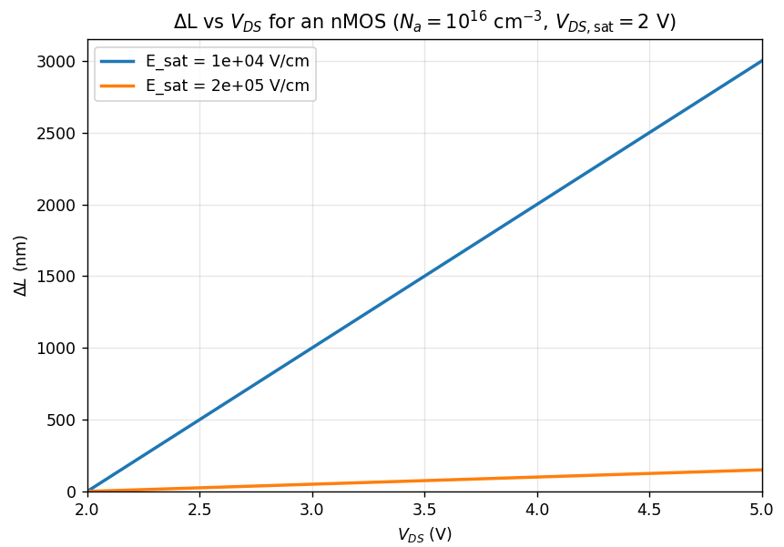

可以看到是近似线性关系的，也就趁机总结一下前面两道题不同的沟长调制效应的近似关系：

**长度调制表述（也是PPT里面的表述）**：

$$I_{D}^{'} = \left( \frac{L}{L - \Delta L} \right) I_{D} = \frac{1}{1 - \frac{\Delta L}{L}} I_{D}$$
当 $\frac{\Delta L}{L} \ll 1$ 时，

$$I_{D}^{'} \approx \left( 1 + \frac{\Delta L}{L} \right) I_{D}$$
**经验线性表述（CLM）**：

$$I_{D}^{'} = I_{D} \left( 1 + \lambda \Delta V_{DS} \right)$$

等价条件：

$\Delta L$ 与 $\Delta V_{DS}$近似线性关系（饱和后夹断区随额外电压线性延伸），则

$$\lambda \Delta V_{DS} \approx \frac{\Delta L}{L} \Rightarrow \lambda \approx \frac{1}{L} \frac{d(\Delta L)}{d(\Delta V_{DS})}$$
在此假设下，两式对小信号的一阶近似是等价的。

##### 迁移率变化

>[!note] 11-9
>假设在**反型电荷夹断点处横向电场** 为$E_{sat}=V_{DS}(\text{sat})/L$。(a)求$L=3\mu m$，$1.0\mu m$，$0.50\mu m$，$0.25\mu m$，$0.13\mu m$时的$E_{sat}$；(b)由(a)的各种情况，估算载流子迁移率。

(a) 假设饱和漏源电压 $V_{DS}(sat) = 1$ V，计算不同沟道长度 $L$ 对应的饱和电场 $E_{sat}$：

| 沟道长度 $L$ ($\mu$m) | 饱和电场 $E_{sat}$ (V/cm) |
|---------------------|--------------------------|
| 3                   | $3.33 \times 10^{3}$      |
| 1                   | $1 \times 10^{4}$         |
| 0.5                 | $2 \times 10^{4}$         |
| 0.25                | $4 \times 10^{4}$         |
| 0.13                | $7.69 \times 10^{4}$      |

(b) （答案和题目对不上）

假设电子迁移率 $\mu_{n} = 500$ cm$^{2}$/V·s，根据公式 $v = \mu_{n} E_{sat}$ 计算不同沟道长度下的载流子速度：

- 当 $L = 3$ $\mu$m 时，$v = 1.67 \times 10^{6}$ cm/s
- 当 $L = 1$ $\mu$m 时，$v = 5 \times 10^{6}$ cm/s
- 当 $L \leq 0.5$ $\mu$m 时，$v \cong 10^{7}$ cm/s

>[!note] 11-10（了解即可，涉及一定数学技巧）
>一n沟道MOSFET有如下参数：$V_{T}=0.45V$，$\mu_{n}=425cm^{2}/V\cdot s$，$t_{ox}=11nm=110A$，$W=20\mu m$，$L=1.2\mu m$，衬底掺杂为$N_{a}=3\times10^{16}cm^{-3}$。(a)使用$\Delta L = \sqrt{\frac{2\varepsilon_{s}}{e,N_{a}}}\left(\sqrt{\phi_{np}+V_{DS}^{\mathrm{(sat)}}+\Delta V_{DS}}-\sqrt{\phi_{np}+V_{DS}^{\mathrm{(sat)}}}\right)$和$I'_D = \left( \frac{L}{L - \Delta L} \right) I_D$计算输出阻抗$r_{o}=(\partial I_{D}^{\prime}/\partial V_{DS})^{-1}$，当$V_{GS}=0.8V$，$\Delta V_{DS}=2.0V$；(b)假设沟道长度减小到$L=0.80\mu m$，重做(a)。

跨导因子：
$k_{n}^{\prime}=\mu_{n} C_{ox}=\frac{\mu_{n}\epsilon_{ox}}{t_{ox}}=\frac{(425)(3.9)(8.85\times 10^{-14})}{110\times 10^{-8}}=1.334\times 10^{-4}$ A/V$^{2}=0.1334$ mA/V$^{2}$

漏极电流：
$I_{D}=\left(\frac{k_{n}^{\prime}}{2}\right)\left(\frac{W}{L}\right)(V_{GS}-V_{T})^{2}=\left(\frac{0.1334}{2}\right)\left(\frac{20}{1.2}\right)(0.8-0.45)^{2}=0.1362$ mA

计算输出电导：

$\frac{1}{r_{o}}=\frac{\partial I_{D}^{\prime}}{\partial V_{DS}}=\frac{\partial}{\partial V_{DS}}\left[\left(\frac{L}{L-\Delta L}\right)\cdot I_{D}\right]=I_{D}L\cdot\frac{\partial}{\partial V_{DS}}[L-\Delta L]^{-1}$
$=I_{D}L(-1)(L-\Delta L)^{-2}\left(-\frac{\partial\Delta L}{\partial V_{DS}}\right)=\frac{I_{D}L}{(L-\Delta L)^{2}}\cdot\frac{\partial\Delta L}{\partial V_{DS}}$

沟道长度调制表达式：

$\Delta L=\sqrt{\frac{2\epsilon_{s}}{eN_{a}}}\left[\sqrt{\phi_{fp}+V_{DS}}-\sqrt{\phi_{fp}+V_{DS}(sat)}\right]$

沟道长度调制对电压的导数：

$\frac{\partial\Delta L}{\partial V_{DS}}=\sqrt{\frac{2\epsilon_{s}}{eN_{a}}}\cdot\frac{1}{2}\left(\phi_{fp}+V_{DS}\right)^{-1/2}$

计算常数项：

$\sqrt{\frac{2\epsilon_{s}}{eN_{a}}}=\sqrt{\frac{2(11.7)(8.85\times 10^{-14})}{(1.6\times 10^{-19})(3\times 10^{16})}}=2.077\times 10^{-5}$ cm/V$^{1/2}$

计算费米势：

$\phi_{fp}=(0.0259)\ln\left(\frac{3\times 10^{16}}{1.5\times 10^{10}}\right)=0.3758$ V

计算漏源电压：

$V_{DS}=V_{DS}(sat)+\Delta V_{DS}=V_{GS}-V_{T}+\Delta V_{DS}=0.8-0.45+2=2.35$ V

计算沟道长度调制导数：

$\frac{\partial\Delta L}{\partial V_{DS}}=\frac{2.077\times 10^{-5}}{2\sqrt{0.3758+2.35}}=6.290\times 10^{-6}$ cm/V

计算沟道长度调制量：

$\Delta L=(2.077\times 10^{-5})\left[\sqrt{0.3758+2.35}-\sqrt{0.3758+0.35}\right]=1.660\times 10^{-5}$ cm $=0.166$ μm

(a) 计算输出电阻：

$\frac{1}{r_{o}}=\frac{I_{D}L}{(L-\Delta L)^{2}}\cdot\frac{\partial\Delta L}{\partial V_{DS}}=\frac{(0.1362\times 10^{-3})(1.2\times 10^{-4})}{[(1.2-0.166)\times 10^{-4}]^{2}}\cdot(6.290\times 10^{-6})=9.615\times 10^{-6}$
$r_{o}=1.04\times 10^{5}$ $\Omega=104$ k$\Omega$

(b) 沟道长度缩短后的输出电阻：

$\frac{1}{r_{o}}=\frac{(0.1362\times 10^{-3})(0.8\times 10^{-4})}{[(0.8-0.166)\times 10^{-4}]^{2}}\cdot(6.290\times 10^{-6})=1.705\times 10^{-5}$
$r_{o}=5.865\times 10^{4}$ $\Omega=58.65$ k$\Omega$

>[!note] 11-11
>(a) n沟道增强型MOSFET参数：$W/L=10$，$C_{ox}=6.9\times10^{-8}F/cm^{2}$，$V_{T}=1V$。假设$\mu_{n}=500cm^{2}/V\cdot s$且保持不变。绘制晶体管偏置在饱和区时，$\sqrt{I_{D}}$与$V_{GS}$在$0\leq V_{GS}\leq 5V$范围内的函数关系图。
>
>(b) 假设沟道中有效迁移率由下式给出：
>$$\mu_{\text{eff}}=\mu_{0}\left(\frac{E_{\text{eff}}}{E_{c}}\right)^{-1/3}$$
>其中$\mu_{0}=1000cm^{2}/V\cdot s$，$E_{c}=2.5\times10^{4}V/cm$。采用一级近似，设$E_{\text{eff}}=V_{GS}/t_{ox}$，使用$\mu_{\text{eff}}$代替$\mu_{n}$，绘制与(a)中$V_{GS}$范围相同的$\sqrt{I_{D}}$与$V_{GS}$的函数关系图。
>
>(c) 将(a)和(b)的曲线绘制在同一图中。两条曲线的斜率说明了什么？

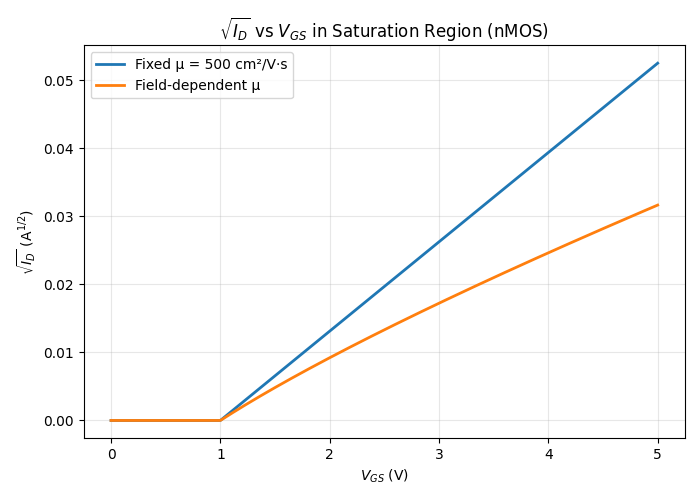

饱和漏极电流的计算公式为：
$$I_{D}(\text{sat}) = \frac{W \mu_{n} C_{ox}}{2L} (V_{GS} - V_{T})^{2}$$

代入具体数值计算：
$= \left( \frac{10}{2} \right) (500) (6.9 \times 10^{-8}) (V_{GS} - 1)^{2}$

或者表示为：
$I_{D}(\text{sat}) = 0.173 (V_{GS} - 1)^{2}$ （单位：mA）

同时计算饱和电流的平方根：
$\sqrt{I_{D}(\text{sat})} = \sqrt{0.173} (V_{GS} - 1)$ （单位：mA$^{1/2}$）

>[!note] 11-12
>描述NMOS器件中电子迁移率变化的模型为：
>$$\mu_{\text{eff}}=\frac{\mu_{0}}{1+\theta(V_{GS}-V_{TN})}$$
>其中$\theta$称为迁移率退化参数。假设参数：$C_{ox}=10^{-8}F/cm^{2}$，$W/L=25$，$\mu_{0}=800cm^{2}/V\cdot s$，$V_{TN}=0.5V$。在同一图中绘制偏置在饱和区的NMOS器件的$\sqrt{I_{D}}$与$V_{GS}$在$0\leq V_{GS}\leq 3V$范围内的函数关系图。
>(a) $\theta=0$（理想情况）
>(b) $\theta=0.5V^{-1}$

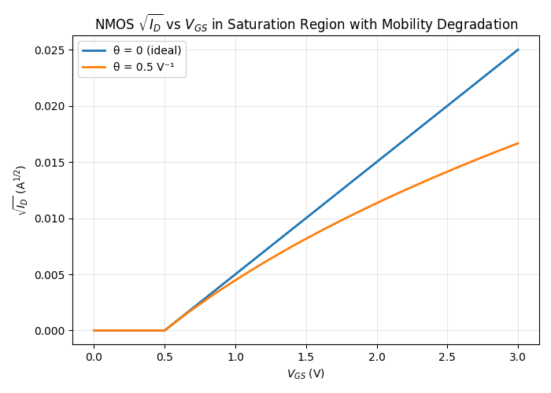
迁移率影响饱和区的斜率，这也是饱和电流公式的应用之一。

##### 速度饱和效应

>[!warning] Homework 2-8 
>一个n沟道MOSFET的参数如下：$\mu_{n}=400\text{ cm}^{2}/\text{V·s}$，$t_{ox}=50\text{ nm}$，$V_{T}=0.75\text{ V}$，$L=2\mu\text{m}$，$W=20\mu\text{m}$，假设晶体管偏置在饱和区，$V_{GS}=4\text{ V}$。
>
>(a) 计算理想截止频率；
>
>(b) 假设源、漏处均有$0.25\mu\text{m}$的栅氧化层交叠，负载电阻$R_{L}=10\text{ k}\Omega$接至输出，计算截止频率。

(a) 截止频率公式：$f_T = \frac{V_{sat}}{2 \pi L}$ ，代数即可。

(b) 答案见 10-56。

>[!note] 11-13
>n沟道增强型MOSFET参数：$V_{T}=0.40V$，$t_{ox}=20nm=200A$，$L=1.0\mu m$，$W=10\mu m$。
>(a) 假设$\mu_{n}=475cm^{2}/V\cdot s$且保持不变。计算当$V_{GS}-V_{T}=2.0V$时，在以下$V_{DS}$值下的$I_{D}$：
>(i) $V_{DS}=0.5V$
>(ii) $V_{DS}=1.0V$
>(iii) $V_{DS}=1.25V$
>(iv) $V_{DS}=2.0V$
>
>(b) 考虑载流子速度与$V_{DS}$的线性函数关系，计算与(a)中相同电压值时的$I_{D}$
>
>(c) 计算(a)和(b)曲线中的$V_{DS}$(sat)值
> 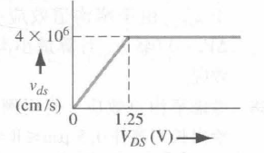

(b) （速度）漏电流计算公式：
$$I_{D} = W C_{ox} (V_{GS} - V_{T}) v_{ds}$$
$= (10^{-3})(1.726 \times 10^{-7})(2) v_{ds}$
$= (3.452 \times 10^{-10}) v_{ds}$ A
$= (3.452 \times 10^{-7}) v_{ds}$ mA

未饱和的情况也可以使用这个公式计算，依照给的线性关系。

(i) 
当 $V_{DS} = 0.5$ V 时：
$v_{ds} = \left( \frac{0.5}{1.25} \right) (4 \times 10^{6}) = 1.6 \times 10^{6}$ cm/s
$I_{D} = (3.452 \times 10^{-7})(1.6 \times 10^{6}) = 0.552$ mA

(ii) 
当 $V_{DS} = 1.0$ V 时：
$v_{ds} = \left( \frac{1.0}{1.25} \right) (4 \times 10^{6}) = 3.2 \times 10^{6}$ cm/s
$I_{D} = (3.452 \times 10^{-7})(3.2 \times 10^{6}) = 1.10$ mA

(iii)
当 $V_{DS} = 1.25$ V 时：
$v_{ds} = 4 \times 10^{6}$ cm/s
$I_{D} = (3.452 \times 10^{-7})(4 \times 10^{6}) = 1.38$ mA

(iv) 
当 $V_{DS} = 2$ V 时：
$v_{ds} = 4 \times 10^{6}$ cm/s
$I_{D} = 1.38$ mA
#### 11.2 MOSFET 按比例缩小效应

>[!note] 11-15
>在饱和区和非饱和区对理想电流-电压关系应用恒定电场等比例缩小理论。(a)在两种偏置区中漏电流如何变化？(b)在两种偏置区中每个器件的功耗如何变化？

(a) 根据恒定电场等比例缩小理论，漏极电流 $I_D'$ 会随缩小因子 $k$ 成正比缩放，即 $I_D' \rightarrow k I_D$。

(b) 器件功耗 $P'$ 则随缩小因子 $k$ 的平方缩放，即 $P' \rightarrow k^2 P$。

>[!note] 11-16
>一个n沟道MOSFET被偏置在载流子达到饱和速度的情况下，如果将恒定电场等比例缩小理论应用于这个器件，那么漏电流将如何变化？

漏极饱和电流的表达式为：

$$
I_{D}(\text{sat}) = W C_{ox} (V_{GS} - V_{T}) v_{\text{sat}}
$$

当进行尺寸缩放时，参数变化如下：

- 沟道宽度 $W \rightarrow kW$
- 氧化层电容 $C_{ox} \rightarrow C_{ox}/k$
- 栅源电压 $V_{GS} \rightarrow kV_{GS}$
- 阈值电压 $V_{T}$ 保持不变
- 饱和漂移速度 $v_{\text{sat}}$ 保持不变

代入缩放后的参数，饱和电流变为：

$$
I_{D}(\text{sat}) \rightarrow (kW) \left( \frac{C_{ox}}{k} \right) (kV_{GS} - V_{T}) v_{\text{sat}}
$$

化简后可得：

$$
I_{D}(\text{sat}) \rightarrow k I_{D}(\text{sat})
$$

因此，在速度饱和条件下，漏极饱和电流随尺寸缩放因子 $k$ 成正比缩放。
>[!note] 11-17
>一个n沟道NMOS晶体管初始参数为：$k_{n}'=0.15mA/V^{2}$，$L=1.2\mu m$，$W=6.0\mu m$，$V_{T}=0.45V$。器件工作在0~3V的范围内且恒定电场等比例缩小因子为$k=0.65$，$V_{T}$保持不变。(a)求(i)初始器件，(ii)缩小后的器件的最大漏电流；(b)求(i)初始器件，(ii)缩小后的器件的最大功耗。

(a)

(i) 原始器件的最大漏电流计算如下：

$$
I_D(\max) = \frac{k_n'}{2} \cdot \frac{W}{L} \cdot (V_{GS} - V_T)^2
$$

将参数代入：

- $k_n' = 0.15$ mA/V$^2$
- $W = 6.0\ \mu$m
- $L = 1.2\ \mu$m
- $V_{GS} = V_D = 3$ V
- $V_T = 0.45$ V

计算过程：

$$
I_D(\max) = \left( \frac{0.15}{2} \right) \left( \frac{6}{1.2} \right) (3 - 0.45)^2 = 2.438\ \text{mA}
$$

(ii) 缩小后的器件参数：

- 缩放因子 $k = 0.65$
- $V_D = V_{GS} = k \times 3 = 1.95$ V
- $k_n' = \frac{0.15}{0.65} = 0.2308$ mA/V$^2$
- $L = k \times 1.2 = 0.78\ \mu$m
- $W = k \times 6 = 3.90\ \mu$m
- $V_T$ 保持不变，仍为 $0.45$ V

计算过程：

$$
I_D(\max) = \left( \frac{0.2308}{2} \right) \left( \frac{3.9}{0.78} \right) (1.95 - 0.45)^2 = 1.298\ \text{mA}
$$

注意：由于 $V_T$ 不随缩放因子变化，最大漏电流不是直接按 $k$ 比例缩放。

(b)

(i) 原始器件的最大功耗：

$$
P(\max) = I_D(\max) \times V_D = 2.438\ \text{mA} \times 3\ \text{V} = 7.314\ \text{mW}
$$

(ii) 缩小后器件的最大功耗：

$$
P(\max) = 1.298\ \text{mA} \times 1.95\ \text{V} = 2.531\ \text{mW}
$$

#### 11.3 阈值电压的修正

>[!warning] Homework 2-9
>已知一个硅基n沟道MOSFET，参数如下：衬底掺杂浓度 $N_A = 2 \times 10^{16} \text{ cm}^{-3}$，本征载流子浓度 $n_i = 1.5 \times 10^{10} \text{ cm}^{-3}$，氧化层厚度 $t_{ox} = 10 \text{ nm}$，沟道长度 $L = 0.7 \mu\text{m}$，沟道宽度 $W = 2 \mu\text{m}$，结深 $r_j = 0.3 \mu\text{m}$，氧化层介电常数 $\varepsilon_{ox} = 3.9\varepsilon_0$，硅的介电常数 $\varepsilon_{Si} = 11.7\varepsilon_0$。
>
>求解：
>
（1）考虑到短沟道效应，设计的阈值电压 $V_T = 0.35 \text{ V}$，等效的长沟道阈值电压是多少？
（2）忽略短沟道效应，由于窄沟道效应引起的阈值电压偏移量是多少（假设参数 $\xi = \pi/2$）？

>[!warning] Homework 2-10 （综合设计）
> 设计一个理想的n⁺多晶硅栅n沟道MOSFET，要求阈值电压$V_{T} = 0.65$ V。已知参数：氧化层厚度$t_{ox} = 30$ nm，界面陷阱电荷密度$Q'_{SS} = 1.5 \times 10^{11}$ cm$^{-2}$，电子迁移率$\mu_{n} = 1000$ cm$^{2}$/V·s。设计要求：当栅源电压$V_{GS} = 2.5$ V，漏源电压$V_{DS} = 0.1$ V时，漏极电流$I_{D} = 50$ μA。需要确定衬底的掺杂浓度和沟道的宽长比$W/L$。

##### 短沟道效应

>[!note] 11-18
>一个n沟道MOSFET的参数为：$N_{a}=5\times 10^{16}cm^{-3}$，$t_{ox}=12nm=120A$，$L=0.80\mu m$，$r_{j}=0.25\mu m$。计算由于短沟道效应引起的阈值电压偏移量。

>根据题目给定的参数依次计算出各物理量（如电容、费米势、耗尽层宽度等），最后将结果代入短沟道效应的阈值电压偏移公式即可。

计算氧化层电容：
$$
C_{ox} = \frac{\epsilon_{ox}}{t_{ox}} = \frac{(3.9)(8.85\times10^{-14})}{120\times10^{-8}} = 2.876\times10^{-7} \text{ F/cm}^{2}
$$

计算费米势：
$$
\phi_{fp} = (0.0259)\ln\left(\frac{5\times10^{16}}{1.5\times10^{10}}\right) = 0.3890 \text{ V}
$$

计算最大耗尽层宽度：
$$
x_{dT} = \left[ \frac{4(11.7)(8.85\times10^{-14})(0.3890)}{(1.6\times10^{-19})(5\times10^{16})} \right]^{1/2} = 1.419\times10^{-5} \text{ cm}
$$

计算阈值电压变化量：
$$
\begin{aligned}
\Delta V_{T} &= -\frac{eN_{a}x_{dT}}{C_{ox}}\left[\frac{r_{j}}{L}\left(\sqrt{1+\frac{2x_{dT}}{r_{j}}}-1\right)\right] \\
&= -\frac{(1.6\times10^{-19})(5\times10^{16})(1.419\times10^{-5})}{2.876\times10^{-7}} \\
&\quad \times \left[\frac{0.25}{0.80}\left(\sqrt{1+\frac{2(0.1419)}{0.25}}-1\right)\right] \\
\Delta V_{T} &= -0.0569 \text{ V}
\end{aligned}
$$

>[!note] 11-19
>一个n沟道MOSFET的参数为：$N_{a}=2\times 10^{16}cm^{-3}$，$L=0.70\mu m$，$t_{ox}=8nm=80A$，扩散结半径$r_{j}=0.30\mu m$。考虑到短沟道效应，设计的阈值电压为$V_{T}=0.35V$，那么等效的长沟道阈值电压是多少？

>本题需要考虑短沟道效应造成的阈值电压偏移（$\Delta V_T < 0$），等效的长沟道阈值电压为设计值加上偏移量。

计算氧化层电容：
$$
C_{ox} = \frac{(3.9)(8.85 \times 10^{-14})}{80 \times 10^{-8}} = 4.314 \times 10^{-7} \text{ F/cm}^{2}
$$

计算费米势：
$$
\phi_{fp} = (0.0259) \ln\left(\frac{2 \times 10^{16}}{1.5 \times 10^{10}}\right) = 0.3653 \text{ V}
$$

计算最大耗尽层宽度：
$$
x_{dT} = \left[ \frac{4(11.7)(8.85 \times 10^{-14})(0.3653)}{(1.6 \times 10^{-19})(2 \times 10^{16})} \right]^{1/2} = 2.174 \times 10^{-5} \text{ cm}
$$

计算阈值电压变化量：
$$
\Delta V_{T} = -\frac{(1.6 \times 10^{-19})(2 \times 10^{16})(2.174 \times 10^{-5})}{4.314 \times 10^{-7}} \times \left[ \frac{0.30}{0.70} \left( \sqrt{1 + \frac{2(0.2174)}{0.30}} - 1 \right) \right]
$$
$$
\Delta V_{T} = -0.0391 \text{ V}
$$

计算长沟道阈值电压：
$$
V_{T} = V_{TO} + \Delta V_{T}
$$
$$
0.35 = V_{TO} - 0.0391
$$
$$
V_{TO} = 0.389 \text{ V}
$$

>[!note] 11-20
>一个n沟道MOSFET的参数为：$N_{a}=3\times 10^{16}cm^{-3}$，$t_{ox}=20nm=200A$，扩散结半径$r_{j}=0.30\mu m$。假设由于短沟道效应引起的阈值电压偏移量不大于$\Delta V_{T}=-0.15V$，求最小沟道长度$L$。

>本题根据短沟道效应的阈值电压偏移公式，代入已知参数，解方程求最小沟道长度 $L$ 即可。

计算氧化层电容：

$$C_{ox} = \dfrac{(3.9)(8.85 \times 10^{-14})}{200 \times 10^{-8}} = 1.726 \times 10^{-7}\ \text{F/cm}^{2}$$

计算费米势：

$$\phi_{fp} = (0.0259) \ln\left( \dfrac{3 \times 10^{16}}{1.5 \times 10^{10}} \right) = 0.3758\ \text{V}$$

计算最大耗尽层宽度：

$$x_{dT} = \left[ \dfrac{4(11.7)(8.85 \times 10^{-14})(0.3758)}{(1.6 \times 10^{-19})(3 \times 10^{16})} \right]^{1/2} = 1.80 \times 10^{-5}\ \text{cm}$$

计算阈值电压变化量：

$$
\begin{aligned}
\Delta V_{T} &= -0.15 \\
&= -\dfrac{(1.6 \times 10^{-19})(3 \times 10^{16})(1.80 \times 10^{-5})}{1.726 \times 10^{-7}} \\
&\quad \times \left[ \dfrac{0.30}{L} \left( \sqrt{1 + \dfrac{2(0.18)}{0.30}} - 1 \right) \right] \\
0.15 &= (0.5006) \left( \dfrac{0.30}{L} \right) (0.4832) \\
\Rightarrow L &= 0.484\ \mu\text{m}
\end{aligned}
$$

>[!note] 11-23
>考虑短沟道效应，绘制$V_{T}-V_{FB}$与沟道长度$L$的函数关系图，其中$0.5\mu m\leq L\leq 6\mu m$。使用图中的参数，并假设$V_{SB}=0$。

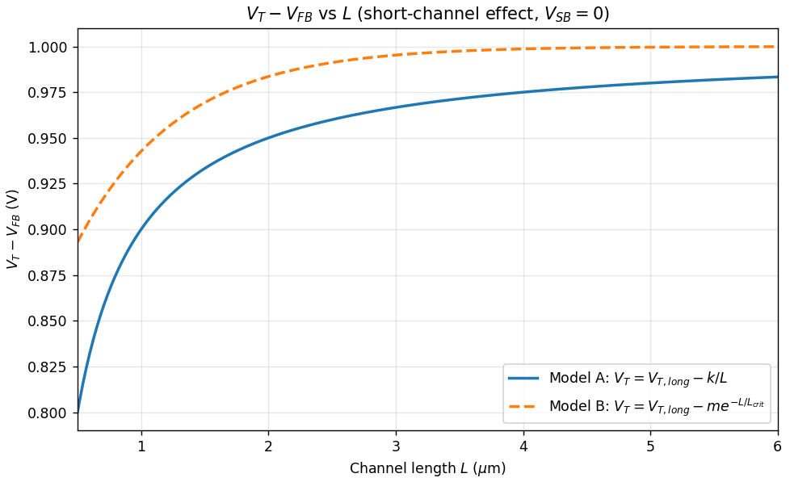

>[!note] 11-24
>当$V_{SB}=0V$，$2V$，$4V$，$6V$（考虑衬偏效应），且$N_{a}=10^{16}cm^{-3}$和$N_{a}=10^{17}cm^{-3}$时，重新绘制 11-23 的图。

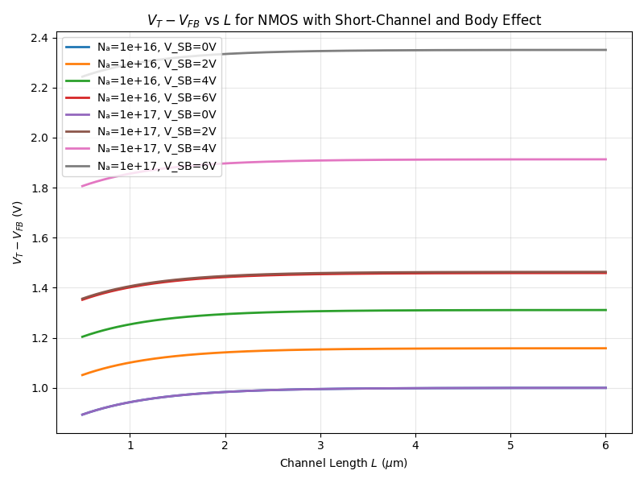

>[!note] 11-25
>短沟道效应会引起阈值电压偏移。如果应用恒定电场等比例缩小理论，那么$\Delta V_{T}$对应的比例因子应该是多少？

>本题根据短沟道效应的阈值电压偏移公式，分析各参数在等比例缩小下的变化规律，判断 $\Delta V_T$ 随缩放因子的变化趋势即可。

阈值电压变化量的公式为：
$$
\Delta V_{T} = -\frac{e N_{a} x_{dT}}{C_{ox}} \left\{ \frac{r_{j}}{L} \left[ \sqrt{1 + \frac{2 x_{dT}}{r_{j}}} - 1 \right] \right\}
$$

应用恒定电场等比例缩小理论（比例因子 $k$）后，各参数的缩放关系如下：

- $N_{a} \rightarrow N_{a}/k$
- $x_{dT} \rightarrow k x_{dT}$
- $C_{ox} \rightarrow C_{ox}/k$
- $r_{j} \rightarrow k r_{j}$
- $L \rightarrow k L$

代入缩放后的参数，公式变为：
$$
-\frac{e \left( \frac{N_{a}}{k} \right) (k x_{dT})}{\left( \frac{C_{ox}}{k} \right)} \left\{ \frac{k r_{j}}{k L} \left[ \sqrt{1 + \frac{2 k x_{dT}}{k r_{j}}} - 1 \right] \right\}
$$

化简后可得：
$$
\Delta V_{T} \rightarrow k \Delta V_{T}
$$

因此，$\Delta V_{T}$ 随缩小比例因子 $k$ 成正比缩放。

##### 窄沟道效应

>[!note] 11-26
>一个n沟道MOSFET的衬底掺杂浓度为$N_{a}=3\times10^{16}cm^{-3}$，氧化层厚度$t_{ox}=8nm=80A$，沟道宽度$W=2.2\mu m$。忽略短沟道效应，计算由于窄沟道效应引起的阈值电压偏移（假设参数$\zeta=\pi/2$）。

>本题根据窄沟道效应的阈值电压偏移公式，依次计算相关物理量并代入公式即可求解。

计算氧化层电容：

$$C_{ox} = \dfrac{(3.9)(8.85\times 10^{-14})}{80\times 10^{-8}} = 4.314\times 10^{-7}$$

计算费米势：
$$\phi_{fp} = (0.0259) \ln\left(\dfrac{3\times 10^{16}}{1.5\times 10^{10}}\right) = 0.3758$$

计算最大耗尽层宽度：

$$x_{dT} = \left[ \dfrac{4(11.7)(8.85\times 10^{-14})(0.3758)}{(1.6\times 10^{-19})(3\times 10^{16})} \right]^{1/2} = 1.80\times 10^{-5}cm$$

计算阈值电压变化量：

$$\Delta V_{T} = \dfrac{eN_{a} x_{dT}}{C_{ox}} \left( \dfrac{\xi x_{dT}}{W} \right)$$

代入数值计算：

$$= \dfrac{(1.6\times 10^{-19})(3\times 10^{16})(1.80\times 10^{-5})^{2}(\frac{\pi}{2})}{(4.314\times 10^{-7})(2.2\times 10^{-4})}$$

计算结果：

$$\Delta V_{T} = +0.0257V$$

>[!note] 11-28
>考虑窄沟道效应。自设晶体管的参数，绘制长沟器件在$0.5\mu m\leq W\leq 5\mu m$范围内$V_{T}-V_{FB}$与沟道宽度$W$的函数关系图。

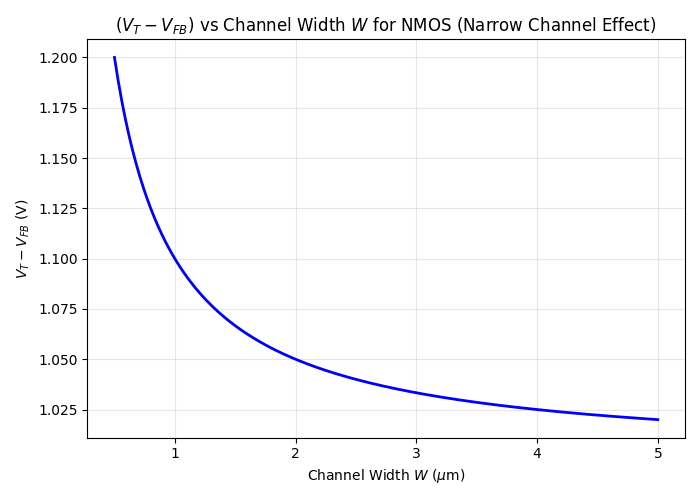

>[!note] 11-29
>窄沟道效应引起的阈值电压偏移。如果应用恒定电场等比例缩小理论，则$\Delta V_{T}$对应的比例因子应该是多少？

阈值电压变化量公式为：

$$
\Delta V_{T} = \frac{e N_{a} x_{dT}}{C_{ox}} \left( \frac{\xi x_{dT}}{W} \right) x_{dT}{C_{ox}} \left( \frac{\xi x_{dT}}{W} \right)
$$

$\xi$ 是一个常数，则应用比例因子 $k$ 后：

$$
\Delta V_{T} \Rightarrow \frac{e \left( \frac{N_{a}}{k} \right) (k x_{dT})}{\left( \frac{C_{ox}}{k} \right)} \left( \frac{\xi k x_{dT}}{k W} \right)
$$

或者简化为：

$$
\Delta V_{T} \Rightarrow k \Delta V_{T}
$$

