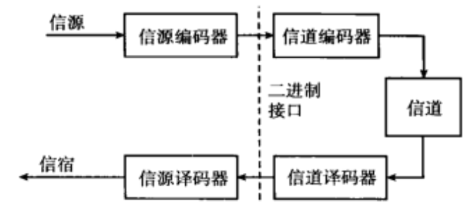

### 数字通信概述

信息从“信源”到“信宿”的传输与处理流程，核心是通过“二进制接口”衔接信源与信道，实现数字式的可靠通信，各部分作用如下：

1. **信源**：信息的来源（如语音、图像、文本等），提供待传输的原始信息。
2. **信源编码器**：将信源输出的原始信息转换为**二进制序列**（这是数字通信的基础，体现“所有通信信源可表示为二进制序列”的核心思路）。
3. **信道编码器（调制器）**：对二进制序列进行处理，使其适配**信道**（如电缆、光纤、空间电磁波等物理媒质）的传输特性。
4. **信道**：传输信号的物理媒介（承担信号的传递任务）。
5. **信道译码器（解调器）**：接收经信道传输的信号，重建输入的二进制序列，且期望重建结果“可靠”（尽可能还原发送端的二进制序列）。
6. **信源译码器**：将重建的二进制序列还原为**信源的原始输出形式**。
7. **信宿**：信息的接收方，最终获取信源传递的信息。

简言之，数字通信系统通过“信源编码→信道编码→信道传输→信道译码→信源译码”的流程，实现了“各类信源→二进制序列→适配信道传输→还原信源”的可靠通信过程。

#### 标准化接口及分层

