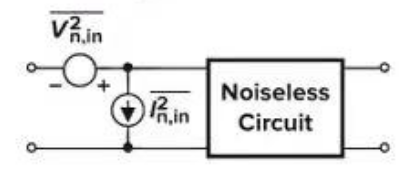
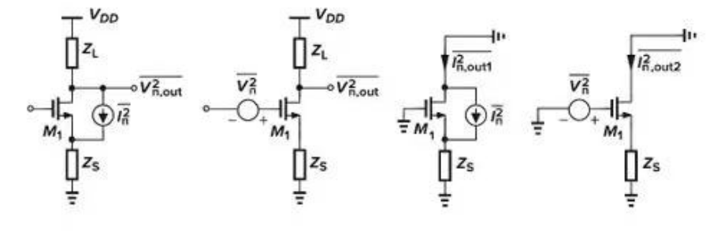
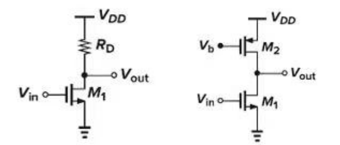

### Homework Review

#### 第五章 电流镜与偏置技术

>[!note] 5.1
> 在图 5.2 中，假设 $(W/L)_1=50/0.5, \lambda=0, I_{out}=0.5mA$，且 $M_1$ 处在饱和区。
> (a) 确定 $R_2/R_1$。
> (b) 计算 $I_{out}$ 对 $V_{DD}$ 变化的灵敏度，定义为 $\frac{\partial I_{out}}{\partial V_{DD}}$ 且用 $I_{out}$ 归一化。
> (c) 如果 $V_{th}$ 变化了 50mV，$I_{out}$ 将变化多少？
> (d) 如果 $\mu_n$ 对温度的依赖性表述为 $\mu_n \propto T^{-3/2}$，但 $V_{th}$ 与温度无关，如果 T 从 300°K 变化到 370°K，$I_{out}$ 将变化多少？
> (e) 在 $V_{DD}$ 变化 10%，$V_{th}$ 变化 50mV，T 从 300°K 变化到 370°K 这三种情况下，最坏情况下 $I_{out}$ 将变化多少？

> 解：
>
> $\frac{W}{L}=\frac{50}{0.5}$，$\lambda=0$，$I=0.5mA$，$K_p=\mu C_{ox}=137\times10^{-4}\frac{A}{V^2}$，$L_D=90nm$
>
> (a) $R_2/R_1$ $V_{GS1}=V_{DD}\frac{R_2}{R_1+R_2}=\sqrt{\frac{2I}{K_p\frac{W}{L}}+V_{th}}$，$L'=L-2L_D$
>
> 使 $R_x=R_2/R_1$，$R_x=\frac{\sqrt{\frac{2I}{K_pW/L'}+V_{th}}}{V_{DD}-\left(\sqrt{\frac{2I'}{K_pW/L'}+V_{th}}\right)}=0.4386$
>
> (b) $I_0=\frac{1}{2}\mu C_{ox}\frac{W}{L'}\left(V_{DD}\frac{R_x}{1+R_x}-V_{th}\right)^2$
>
> $\left(\frac{\partial I_0}{\partial V_{DD}}\right)_{I_0}=\frac{\mu C_{ox}\frac{W}{L}\left(V_{DD}\frac{R_x}{1+R_x}-V_{th}\right)\frac{R_x}{1+R_x}}{\frac{1}{2}\mu C_{ox}\frac{W}{L}\left(V_{DD}\frac{R_x}{1+R_x}-V_{th}\right)^2}=\frac{2}{V_{DD}-V_{th}\left(1+\frac{1}{R_x}\right)}=2.84$
>
> (c) $\frac{\partial I_0}{\partial V_{th}}=-\mu C_{ox}\frac{W}{L}\left(V_{DD}\frac{R_x}{1+R_x}-V_{th}\right)$，$\Delta I_0=-\mu C_{ox}\frac{W}{L}\left(V_{DD}\frac{R_x}{1+R_x}-V_{th}\right)\Delta V_{th}=-233\mu A$，
>
> $\Delta I_0=I_0(V_{th}=0.75)-I_0(V_{th}=0.7)=-205\mu A$
>
> (d) $\frac{\partial I_0}{\partial T}=-\frac{3}{2}\left(\frac{T}{T_0}\right)^{-3/2}\cdot\frac{1}{T}\cdot I_0'$，$T=T_0+\Delta T$，$\Delta I_0=-\frac{3}{2}\left(\frac{T}{T_0}\right)^{-3/2}\cdot\frac{1}{T}\cdot I_0\Delta T=-103\mu A$
>
> $\Delta I_0=I_1(T=370K)-I_0(T=300K)=-135\mu A$
>
> (e) $\Delta I_{worstcase}=I_{worstcase}-I_0$，
>
> $I_{worstcase}=\frac{1}{2}\mu_0\left(\frac{T_0+\Delta T}{T_0}\right)^{-3/2}\left(\left(V_{DD}-\Delta V_{DD}\right)\frac{R_x}{1+R_x}-\left(V_{th}+\Delta V_{th}\right)\right)=43\mu A$，$\Delta I_{worstcase}=-457\mu A$

>[!note] 5.2
> 考虑图 5.6 的电路。假设 $I_{REF}$ 是理想的，当 $V_{DD}$ 从 0 变化到 3V 时，画出 $I_{out}\sim V_{DD}$ 的草图。

### Knowledge summary

#### 第七章 噪声

##### 噪声的统计特性

噪声瞬态不可预测，但平均功率固定：

平均功率：$P_{av}$(V$^2$)，均方根：$\sqrt{P_{av}}(V)$

$$
P_{av} = \lim_{T \to \infty} \frac{1}{T} \int_{-T/2}^{+T/2} x^2(t)dt
$$

**(a) 频谱/功率谱密度 (PSD)**

- 表示：$S_x(f)$ 
- 单位：V$^2$/Hz
- 含义：$S_x(f)$ 表示频率 $f$ 附近 1Hz 带宽内 $x(t)$ 具有的平均功率
- 特性：线下面积为功率 $P$

**(b) 白噪声**

- 特点：在所关心的频带内呈平坦分布

**(c) 系统传输**

- 当 $S_x(f)$ 加在传输函数 $H(s=2\pi jf)$ 的线性时不变系统上：
    $$S_Y(f) = S_x(f)|H(f)|^2$$

##### 电路中的噪声表示

>[!note] 输入参考噪声模型
> 将电路内部分散的所有噪声源，等效地“移动”到电路的最输入端，变成一个独立的噪声电压源和一个独立的噪声电流源。而原来的电路则被视为一个理想的、完全没有噪声的“黑盒子”。

>[!note] 输入参考噪声：电压源$V_{n,in}^2$ + 电流源$I_{n,in}^2$
>
> **输入参考噪声电压源**：与输入信号串联的噪声电压源。它代表了所有那些不依赖于信号源内阻的内部噪声源的等效集合。无论你用什么来驱动这个电路（例如，一个理想电压源），这部分噪声都存在。
>
> **输入参考噪声电流源**：与输入信号并联（或跨接）的噪声电流源。它代表了所有那些其影响与信号源内阻相关的内部噪声源的等效集合。这个电流源产生的噪声大小，取决于它流过了多大的阻抗（通常是你接入的信号源的内阻）。

这两个噪声源共同作用，在“无噪声电路”的输出端产生的总噪声，与原来那个“真实、有噪声的电路”在输出端产生的总噪声是**完全一样**的。

输入阻抗大→忽略$I_{n,in}^2$

>[!note]
> 在我们的理想和低频模型中，MOSFET 的栅极是完全绝缘的，其输入阻抗被认为是无穷大。

##### 单级放大器

分析MOSFET噪声时的一个极其重要的**等效变换技巧**。

$$\overline{V_n^2} = \overline{I_n^2}/g_m^2$$

>[!error] 核心问题：晶体管的噪声源在哪里？
> 
> MOSFET自身最主要的噪声来源——沟道热噪声。这是由于晶体管导通时，沟道内载流子（电子或空穴）进行不规则热运动所产生的。
> 
> 在物理模型上，这个噪声最精确的表示式是一个电流源$\overline{i_n^2}$，连接在晶体管的漏极（Drain）和源极（Source）之间。这就是最左边第一个图所展示的情况。
>
> **模型的“痛点”：**
> 
> 这个噪声源$\overline{i_n^2}$位于电路的“中间”，它产生的噪声会同时影响漏极和源极的电压。当电路变得复杂时，直接计算这个电流源对输出电压$\overline{v_{n,out}^2}$的具体贡献会比较繁琐。
> 
> **解决方案：输入参考噪声等效**
> 
> 为了简化分析，我们希望把这个“深埋”在电路内部的噪声源，等效地移动到电路最容易分析的地方——输入端（栅极）。
> 
> 这就是第二个图所展示的模型。我们把内部的电流源$\overline{i_n^2}$去掉，换成一个等效的电压源$\overline{v_n^2}$，串联在栅极输入端。

>[!note] 等效定理的证明
>
>
>1. 看晶体管的输出电流：我们来比较两种模型下，晶体管产生的输出噪声电流。也就是最右边两个图所展示的。
>
>   - 在原始模型（第三个图）中，噪声源本身就是一个电流源，它就是晶体管产生的全部输出噪声电流。所以：
>
>     $$
>     \overline{i_{n,out1}^2} = \overline{i_n^2}
>     $$
>
>   - 在等效模型（第四个图）中，输入端的噪声电压$\overline{v_n^2}$会被晶体管放大。根据MOSFET最基本的跨导定义($i_{out} = g_m \cdot v_{in}$)，这个输入电压会在输出端产生一个漏极电流。所以，输出的噪声电流是：
>
>     $$
>     \overline{i_{n,out2}^2} = g_m^2 \cdot \overline{v_n^2}
>     $$
>
>2. 建立等式：为了让两个模型完全等效，它们产生的输出噪声电流必须相等：
>
>   $$
>   \overline{i_{n,out1}^2} = \overline{i_{n,out2}^2}
>   $$
>
>   因此：
>
>   $$
>   \overline{i_n^2} = g_m^2 \cdot \overline{v_n^2}
>   $$
>
>3. 得到定理：将上式进行简单的移项，就得到了PPT中的辅助定理：
>
>   $$
>   \overline{V_n^2} = \frac{\overline{I_n^2}}{g_m^2}
>   $$

我们知道，晶体管的沟道热噪声电流为$\overline{i_n^2} = 4kT\gamma g_m$。利用这个辅助定理，我们可以立刻得到它的输入参考噪声电压：

$$
\overline{v_n^2} = \frac{\overline{i_n^2}}{g_m^2} = \frac{4kT\gamma g_m}{g_m^2} = \frac{4kT\gamma}{g_m}
$$

##### 共源极放大器

(a) 电阻负载共源极放大器的输入等效噪声

$$\overline{V_{n,in}^2} = 4kT \left( \frac{1}{g_m^2 R_D} + \frac{\gamma}{g_m} \right) + \frac{K}{C_{ox}(WL)_1} \frac{1}{f}$$

>[!note] 推导过程
>
>**第一步：识别所有噪声源**
>这个电路有两个元件产生噪声：NMOS晶体管 M1 和负载电阻 $R_D$。
>
>1. 晶体管 M1 的噪声：
>   - 沟道热噪声：模型为漏源之间的电流源 $\overline{i_{n,M1}^2} = 4kT\gamma g_{m1}$。
>   - 闪烁噪声：模型为等效到栅极的电压源 $\overline{v_{n,f1}^2} = \frac{K_N}{C_{ox}(WL)_1 f}$。
>
>2. 电阻 $R_D$ 的噪声：
>   - 热噪声：模型为与 $R_D$ 串联的电压源 $\overline{v_{n,RD}^2} = 4kTR_D$。
>
>**第二步：计算各噪声源在输出端的贡献**
>
>1. $R_D$ 的贡献：它的噪声电压源就在输出端，所以它对输出噪声的贡献就是其自身：
>
>   $$
>   S_{v,out,RD}(f) = \overline{v_{n,RD}^2} = 4kTR_D
>   $$
>
>2. M1 沟道热噪声的贡献：M1 的噪声电流 $\overline{i_{n,M1}^2}$ 流过输出电阻 $R_D$ （在忽略 $R_D$ 时），产生输出噪声电压：
>
>   $$
>   S_{v,out,M1,th}(f) = \overline{i_{n,M1}^2} \cdot R_D^2 = (4kT\gamma g_{m1}) R_D^2
>   $$
>
>3. M1 闪烁噪声的贡献：M1 的输入参考闪烁噪声电压 $\overline{v_{n,f1}^2}$ 会被电路放大。我们需要先计算电路增益。
>
>   - 电压增益 $A_v = -g_{m1}R_D$。
>   - 因此，闪烁噪声在输出端的贡献为：
>
>     $$
>     S_{v,out,M1,f}(f) = \overline{v_{n,f1}^2} \cdot A_v^2 = \left( \frac{K_N}{C_{ox}(WL)_1 f} \right) \cdot (-g_{m1}R_D)^2
>     $$
>
>
>**第三步：计算总输出噪声**
>将以上三项不相关的噪声功率相加：
>
>$$
>S_{v,out,total}(f) = S_{v,out,RD}(f) + S_{v,out,M1,th}(f) + S_{v,out,M1,f}(f)
>$$
>
>$$
>S_{v,out,total}(f) = 4kTR_D + (4kT\gamma g_{m1})R_D^2 + \left( \frac{K_N}{C_{ox}(WL)_1 f} \right) g_{m1}^2 R_D^2
>$$
>
>**第四步：折算到输入端**
>我们将总输出噪声除以增益的平方 $A_v^2 = g_{m1}^2 R_D^2$：
>
>$$
>\overline{V_{n,in}^2} = S_{v,in}(f) = \frac{S_{v,out,total}(f)}{A_v^2}
>$$
>
>$$
>\overline{V_{n,in}^2} = \frac{4kTR_D + (4kT\gamma g_{m1})R_D^2 + \left( \frac{K_N}{C_{ox}(WL)_1 f} \right) g_{m1}^2 R_D^2}{g_{m1}^2 R_D^2}
>$$
>
>现在，我们将这个分数拆成三项分别化简：
>
>$$
>\overline{V_{n,in}^2} = \frac{4kTR_D}{g_{m1}^2 R_D^2} + \frac{4kT\gamma g_{m1}R_D^2}{g_{m1}^2 R_D^2} + \frac{\left( \frac{K_N}{C_{ox}(WL)_1 f} \right) g_{m1}^2 R_D^2}{g_{m1}^2 R_D^2}
>$$
>
>化简后得到：
>
>$$
>\overline{V_{n,in}^2} = \frac{4kT}{g_{m1}^2 R_D} + \frac{4kT\gamma}{g_{m1}} + \frac{K_N}{C_{ox}(WL)_1 f}
>$$

(b) PMOS有源负载共源极放大器的输入有效噪声

$$\overline{V_{n,in}^2} = 4kT \left( \frac{\gamma g_{m2}}{g_{m1}^2} + \frac{\gamma}{g_{m1}} \right) + \frac{1}{C_{ox}} \left[ \frac{K_N}{(WL)_1} + \frac{K_P g_{m2}^2}{(WL)_2 g_{m1}^2} \right] \frac{1}{f}$$

