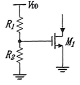

### Homework Review

#### 第五章 电流镜与偏置技术

>[!note] 5.1
> 在图 5.2 中，假设 $(W/L)_1=50/0.5, \lambda=0, I_{out}=0.5mA$，且 $M_1$ 处在饱和区。
> (a) 确定 $R_2/R_1$。
> (b) 计算 $I_{out}$ 对 $V_{DD}$ 变化的灵敏度，定义为 $\frac{\partial I_{out}}{\partial V_{DD}}$ 且用 $I_{out}$ 归一化。
> (c) 如果 $V_{th}$ 变化了 50mV，$I_{out}$ 将变化多少？
> (d) 如果 $\mu_n$ 对温度的依赖性表述为 $\mu_n \propto T^{-3/2}$，但 $V_{th}$ 与温度无关，如果 T 从 300°K 变化到 370°K，$I_{out}$ 将变化多少？
> (e) 在 $V_{DD}$ 变化 10%，$V_{th}$ 变化 50mV，T 从 300°K 变化到 370°K 这三种情况下，最坏情况下 $I_{out}$ 将变化多少？

> 解：
>
> $\frac{W}{L}=\frac{50}{0.5}$，$\lambda=0$，$I=0.5mA$，$K_p=\mu C_{ox}=137\times10^{-4}\frac{A}{V^2}$，$L_D=90nm$
>
> (a) $R_2/R_1$ $V_{GS1}=V_{DD}\frac{R_2}{R_1+R_2}=\sqrt{\frac{2I}{K_p\frac{W}{L}}+V_{th}}$，$L'=L-2L_D$
>
> 使 $R_x=R_2/R_1$，$R_x=\frac{\sqrt{\frac{2I}{K_pW/L'}+V_{th}}}{V_{DD}-\left(\sqrt{\frac{2I'}{K_pW/L'}+V_{th}}\right)}=0.4386$
>
> (b) $I_0=\frac{1}{2}\mu C_{ox}\frac{W}{L'}\left(V_{DD}\frac{R_x}{1+R_x}-V_{th}\right)^2$
>
> $\left(\frac{\partial I_0}{\partial V_{DD}}\right)_{I_0}=\frac{\mu C_{ox}\frac{W}{L}\left(V_{DD}\frac{R_x}{1+R_x}-V_{th}\right)\frac{R_x}{1+R_x}}{\frac{1}{2}\mu C_{ox}\frac{W}{L}\left(V_{DD}\frac{R_x}{1+R_x}-V_{th}\right)^2}=\frac{2}{V_{DD}-V_{th}\left(1+\frac{1}{R_x}\right)}=2.84$
>
> (c) $\frac{\partial I_0}{\partial V_{th}}=-\mu C_{ox}\frac{W}{L}\left(V_{DD}\frac{R_x}{1+R_x}-V_{th}\right)$，$\Delta I_0=-\mu C_{ox}\frac{W}{L}\left(V_{DD}\frac{R_x}{1+R_x}-V_{th}\right)\Delta V_{th}=-233\mu A$，
>
> $\Delta I_0=I_0(V_{th}=0.75)-I_0(V_{th}=0.7)=-205\mu A$
>
> (d) $\frac{\partial I_0}{\partial T}=-\frac{3}{2}\left(\frac{T}{T_0}\right)^{-3/2}\cdot\frac{1}{T}\cdot I_0'$，$T=T_0+\Delta T$，$\Delta I_0=-\frac{3}{2}\left(\frac{T}{T_0}\right)^{-3/2}\cdot\frac{1}{T}\cdot I_0\Delta T=-103\mu A$
>
> $\Delta I_0=I_1(T=370K)-I_0(T=300K)=-135\mu A$
>
> (e) $\Delta I_{worstcase}=I_{worstcase}-I_0$，
>
> $I_{worstcase}=\frac{1}{2}\mu_0\left(\frac{T_0+\Delta T}{T_0}\right)^{-3/2}\left(\left(V_{DD}-\Delta V_{DD}\right)\frac{R_x}{1+R_x}-\left(V_{th}+\Delta V_{th}\right)\right)=43\mu A$，$\Delta I_{worstcase}=-457\mu A$

>[!note] 5.2
> 考虑图 5.6 的电路。假设 $I_{REF}$ 是理想的，当 $V_{DD}$ 从 0 变化到 3V 时，画出 $I_{out}\sim V_{DD}$ 的草图。

