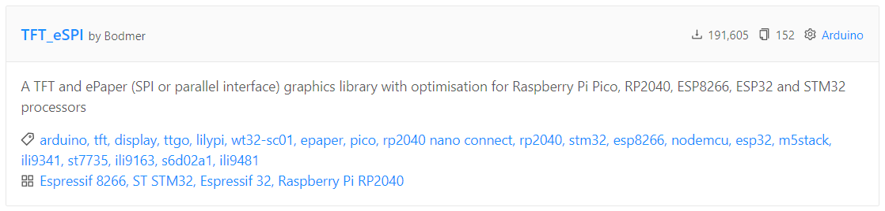
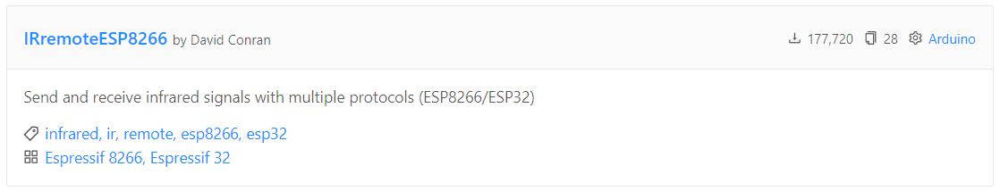
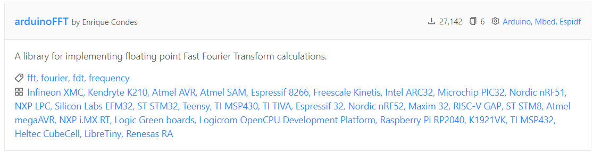
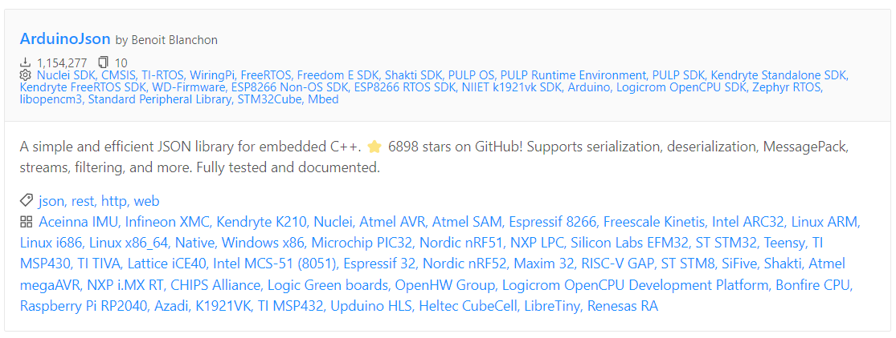

### ESP32多功能智能小车 (v2.0)

一个基于 ESP32 的多功能智能小车平台。`version 2.0`引入了重大的功能升级，集成了**物联网(IoT)数据服务、多传感器融合、红外遥控以及实时音频分析**功能，并通过一块**ST7789彩色128*160LCD液晶屏**提供生动丰富的图形用户界面(GUI)。本项目不仅是一个遥控小车，更是一个功能强大的嵌入式系统开发与学习平台。

### ✨ 核心特性 (Features)

1. **智能避障系统:**

<div align="center">
  
</div>

- 车身**前后**各集成一个`HC-SR04`超声波传感器。
 
- 实时监测前后方障碍物距离，在距离过近时**自动制动，防止碰撞**。
    
- **算法原理:** 基于超声波测距的时间差(ToF)计算：
$$\text{距离(cm)} = \frac{\text{声波往返时间(μs)} \times \text{声速(340m/s)}}{2 \times 10000}$$
$$\text{距离(cm)} = \frac{\text{声波往返时间(μs)}}{58}$$

```cpp
    // 避障决策算法
    bool checkObstacle(const String& direction, float safeDistance) {
        if (direction == "forward" && frontDistance < safeDistance) {
          stopMotors();
          displayWarning("前方障碍物!");
          return false;
        } else if (direction == "backward" && rearDistance < safeDistance) {
          stopMotors();
          displayWarning("后方障碍物!");
          return false;
        }
        return true;
    }
```

2. **IoT网络服务与信息中心:**

    - 开机自动连接Wi-Fi，通过NTP协议同步并显示**网络时间**。

    - 自动调用天气API，获取并显示**实时天气信息** (如：城市、天气、温度)。
    
    - **算法原理:** NTP时间同步采用客户端-服务器模型，计算时间偏移量：
    $$\text{Offset} = \frac{(T_2 - T_1) + (T_3 - T_4)}{2}$$
    其中：$T_1$=客户端发送时间，$T_2$=服务器接收时间，
    $T_3$=服务器发送时间，$T_4$=客户端接收时间
    
    ```cpp
    // 网络数据获取流程
    bool updateNetworkData() {
        if (!WiFi.isConnected()) {
          WiFi.begin(WIFI_SSID, WIFI_PASSWORD);
          
          // 等待连接建立，最多等待10秒
          uint8_t attempts = 0;
          while (WiFi.status() != WL_CONNECTED && attempts < 20) {
            delay(500);
            attempts++;
          }
          
          if (WiFi.status() != WL_CONNECTED) {
            return false;
          }
        }
        
        // 更新NTP时间
        struct tm timeinfo;
        configTime(GMT_OFFSET_SEC, DAYLIGHT_OFFSET_SEC, NTP_SERVER);
        if (!getLocalTime(&timeinfo)) {
          Serial.println("Failed to obtain time");
        }
        
        // 获取天气数据
        HTTPClient http;
        String url = "https://api.openweathermap.org/data/2.5/weather?id=" + 
                 String(CITY_ID) + "&appid=" + API_KEY + "&units=metric";
        
        http.begin(url);
        int httpCode = http.GET();
        
        if (httpCode == HTTP_CODE_OK) {
          String payload = http.getString();
          
          // 使用ArduinoJson解析
          DynamicJsonDocument doc(1024);
          deserializeJson(doc, payload);
          
          // 提取所需数据
          weatherTemp = doc["main"]["temp"];
          weatherDesc = doc["weather"][0]["main"].as<String>();
          cityName = doc["name"].as<String>();
          
          return true;
        }
        
        http.end();
        return false;
    }
    ```

3. **全彩GUI仪表盘:**

    - 采用 **ST7789 IPS LCD** 彩色屏幕，提供美观、信息丰富的用户界面。

    - 设计了专门的**主界面**用于集中显示时间、天气等信息。
    
    - **算法原理:** 采用双缓冲渲染技术减少屏幕闪烁：
    ```cpp
    // 屏幕渲染算法
    void renderGUI(const DisplayData& data) {
        // TFT_eSPI库已内置硬件支持的双缓冲
        // 创建精灵(sprite)作为后台缓冲区
        TFT_eSprite backBuffer = TFT_eSprite(&tft);
        backBuffer.createSprite(SCREEN_WIDTH, SCREEN_HEIGHT);
        backBuffer.fillSprite(TFT_BLACK);
        
        // 在后台缓冲区绘制所有元素
        drawTimeWidget(&backBuffer, data.hour, data.minute, data.second);
        drawWeatherWidget(&backBuffer, data.cityName, data.weatherDesc, data.temperature);
        drawDistanceIndicators(&backBuffer, data.frontDistance, data.rearDistance);
        
        // 将整个后台缓冲区推送到屏幕
        backBuffer.pushSprite(0, 0);
        
        // 释放精灵内存
        backBuffer.deleteSprite();
    }
    ```

4. **多模态交互系统:**
    - **红外遥控:** 支持标准红外遥控器进行精确的运动控制（前进、后退、左转、右转、停止）。
    
    - **功能切换:** 通过遥控器按键，可在不同的工作模式间无缝切换。
    
    - **算法原理:** NEC红外协议解码：
    ```cpp
    // 红外信号解码与命令映射
    IRCommand decodeIRCommand() {
        // 使用IRremoteESP8266库进行解码
        if (irReceiver.decode(&irResults)) {
          uint32_t value = irResults.value;
          irReceiver.resume();  // 准备接收下一个值
          
          // 验证信号是否有效并映射到命令
          if (value != 0xFFFFFFFF) {  // 重复码
            switch (value) {
                case 0xFF629D: return IR_UP;     // 上键
                case 0xFFA857: return IR_DOWN;   // 下键
                case 0xFF22DD: return IR_LEFT;   // 左键
                case 0xFFC23D: return IR_RIGHT;  // 右键
                case 0xFF02FD: return IR_OK;     // OK键
                case 0xFF6897: return IR_1;      // 1键
                case 0xFF9867: return IR_3;      // 3键
                default:       return IR_NONE;
            }
          }
        }
        return IR_NONE;
    }
    
    // 运动控制状态机
    void handleCommand(IRCommand command) {
        switch (command) {
          case IR_UP:
            if (checkObstacle("forward", SAFE_DISTANCE)) {
                moveForward(DEFAULT_SPEED);
            }
            break;
            
          case IR_DOWN:
            if (checkObstacle("backward", SAFE_DISTANCE)) {
                moveBackward(DEFAULT_SPEED);
            }
            break;
            
          case IR_LEFT:
            turn(LEFT, DEFAULT_TURN_ANGLE);
            break;
            
          case IR_RIGHT:
            turn(RIGHT, DEFAULT_TURN_ANGLE);
            break;
            
          case IR_OK:
            stopMotors();
            break;
            
          case IR_1:
            currentMode = MODE_OSCILLOSCOPE;
            break;
            
          case IR_3:
            currentMode = MODE_SPECTRUM;
            break;
        }
    }
    ```

5. **实时音频分析仪:**
    - **声音示波器模式:** 按下遥控器 `1` 键，可将麦克风采集到的声音信号以**时域波形**的方式实时显示在屏幕上。

    - **音频频谱仪模式:** 按下遥控器 `3` 键，系统将对声音信号进行**快速傅里叶变换(FFT)**，并以频域图谱的形式显示出来，直观展现声音的频率成分。
    
    - **算法原理:** 基于Cooley-Tukey算法的FFT实现：
    $$X(k) = \sum_{n=0}^{N-1} x(n) \cdot e^{-j2\pi kn/N}$$
    
    ```cpp
    // 音频分析流程
    void processAudio(DisplayMode mode) {
        const uint16_t SAMPLES = 128;  // 采样点数，必须是2的幂
        double vReal[SAMPLES];         // 实部
        double vImag[SAMPLES];         // 虚部
        
        // 从麦克风采样 (使用ESP32的ADC)
        for (int i = 0; i < SAMPLES; i++) {
          vReal[i] = analogRead(MIC_PIN);
          vImag[i] = 0;
          delayMicroseconds(125);  // 约8KHz采样率
        }
        
        if (mode == MODE_OSCILLOSCOPE) {
          // 时域波形显示
          TFT_eSprite sprite = TFT_eSprite(&tft);
          sprite.createSprite(SCREEN_WIDTH, SCREEN_HEIGHT);
          sprite.fillSprite(TFT_BLACK);
          
          // 绘制坐标轴
          sprite.drawFastHLine(0, SCREEN_HEIGHT/2, SCREEN_WIDTH, TFT_DARKGREY);
          
          // 绘制波形 (归一化到屏幕高度)
          for (int i = 0; i < SAMPLES; i++) {
            int x = map(i, 0, SAMPLES-1, 0, SCREEN_WIDTH-1);
            int y = map(vReal[i], 0, 4095, SCREEN_HEIGHT-1, 0);
            
            if (i > 0) {
                int lastX = map(i-1, 0, SAMPLES-1, 0, SCREEN_WIDTH-1);
                int lastY = map(vReal[i-1], 0, 4095, SCREEN_HEIGHT-1, 0);
                sprite.drawLine(lastX, lastY, x, y, TFT_GREEN);
            }
          }
          
          sprite.pushSprite(0, 0);
          sprite.deleteSprite();
          
        } else if (mode == MODE_SPECTRUM) {
          // 创建FFT对象
          arduinoFFT FFT = arduinoFFT(vReal, vImag, SAMPLES, SAMPLE_RATE);
          
          // 应用汉宁窗减少频谱泄漏
          FFT.Windowing(FFT_WIN_TYP_HANNING, FFT_FORWARD);
          
          // 执行FFT
          FFT.Compute(FFT_FORWARD);
          
          // 计算幅度
          FFT.ComplexToMagnitude();
          
          // 绘制频谱
          TFT_eSprite sprite = TFT_eSprite(&tft);
          sprite.createSprite(SCREEN_WIDTH, SCREEN_HEIGHT);
          sprite.fillSprite(TFT_BLACK);
          
          // 频谱只使用前半部分(奈奎斯特定理)
          for (int i = 1; i < SAMPLES/2; i++) {
            // 应用对数刻度使其更符合人耳感知
            double value = log10(vReal[i]) * 20;  // dB刻度
            
            // 约束值到合理范围
            value = constrain(value, 0, 50);
            
            // 映射到显示高度
            int barHeight = map(value, 0, 50, 0, SCREEN_HEIGHT);
            
            // 确定条形图宽度和位置
            int barWidth = SCREEN_WIDTH / (SAMPLES/4);
            int x = i * barWidth;
            
            // 根据频率绘制不同颜色
            uint16_t color;
            if (i < 10) color = TFT_RED;        // 低频
            else if (i < 20) color = TFT_YELLOW; // 中低频
            else if (i < 30) color = TFT_GREEN;  // 中频
            else color = TFT_BLUE;               // 高频
            
            // 绘制频谱条
            sprite.fillRect(x, SCREEN_HEIGHT - barHeight, 
                        barWidth-1, barHeight, color);
          }
          
          sprite.pushSprite(0, 0);
          sprite.deleteSprite();
        }
    }
    ```

### 🛠️ 硬件清单 (Hardware)

本项目的硬件选型综合考虑了性能、功耗、易用性和成本。所有组件都经过精心挑选，以确保它们能够协同工作，为上层软件功能的实现提供稳定可靠的物理基础。

| 组件（Component）         | 数量 | 角色与选型考量 |
|---------------------------|------|--------------------------------------------------------------------------------------------------------------------------------|
| ESP32开发板               | 1    | 项目大脑：选用ESP32是因为其强大的双核处理器、充足的RAM以及内置的Wi-Fi和蓝牙功能，能够轻松胜任多任务处理，包括网络通信、传感器数据融合和实时音频分析。 |
| ST7789 IPS LCD            | 1    | 信息视窗：1.8英寸的IPS彩屏提供了鲜艳的色彩和宽广的可视角度，通过高速SPI接口与ESP32通信，足以流畅地显示GUI界面、实时数据和波形。 |
| TB6612FNG电机驱动         | 1    | 动力核心：相较于传统的L298N，TB6612基于MOSFET技术，具有更高的效率、更低的功耗和发热量，且体积小巧。它能通过PWM信号精确控制两个直流电机的正反转和速度。 |
| MG310直流减速电机         | 2    | 执行机构：这是一款带有减速齿轮箱的直流电机，能够在较低转速下提供足够大的扭矩，驱动小车平稳起步和运行。 |
| MAX4466麦克风模块         | 1    | 听觉传感器：这是一款带运放的驻极体麦克风模块，专门为人声频段优化，并带有可调节增益的电位器。这对于精确采集环境声音，并为示波器和FFT分析提供高质量的模拟信号至关重要。 |
| HC-SR04超声波传感器       | 2    | 距离感知：通过发射和接收超声波脉冲来计算与障碍物的距离（ToF）。在车头和车尾各安装一个，为小车的前进和后退提供双向的安全保障。 |
| 红外接收传感器            | 1    | 指令通道：用于接收标准红外遥控器的信号，实现对小车最直接、可靠的远程控制。 |

### 📦 软件与依赖 (Software & Dependencies)

本项目基于`PlatformIO`框架进行开发，推荐使用`Visual Studio Code`作为集成开发环境（IDE）。PlatformIO 提供了强大的项目管理、库依赖管理和调试功能，能够极大地提升开发效率。

项目的核心依赖库均在`platformio.ini`文件中进行声明，最新版本`PlatformIO`会在编译时自动下载并安装指定版本的库，确保了开发环境的一致性（以前的版本需要手动更新`ini`文件的库文件依赖）。

#### 核心库详解

1. **显示驱动** - `bodmer/TFT_eSPI`



- **描述:** 一个功能极其强大且高度优化的TFT屏幕驱动库，广泛支持ST7789, ST7735, ILI9341等多种驱动芯片。

- **作用:** 负责驱动本项目的ST7789全彩LCD屏幕，包括初始化、绘制图形、显示文本和图片等所有与显示相关的功能。

2. **红外遥控** - `crankyoldgit/IRremoteESP8266`



- **描述:** 这是目前针对ESP8266和ESP32平台最主流、最稳定的红外遥控解码库。它从原始的 IRremote 库发展而来，并针对乐鑫芯片做了大量优化。

- **作用:** 用于接收并解码红外遥控器发送的信号，将不同的按键（如前进、后退、功能键等）转换为程序可以识别的指令。

3. **音频FFT** - `kosme/arduinoFFT`



- **描述:** 一个轻量级、易于使用的快速傅里叶变换（FFT）库。

- **作用:** 实现项目的核心功能之一“音频频谱仪”。它能够将麦克风采集到的时域声音信号，实时转换为频域数据，从而分析出声音包含的频率成分并将其可视化。

4. **JSON解析** - `bblanchon/ArduinoJson`



- **描述:** 这是嵌入式平台上处理JSON数据的标准库，以其高效的内存管理和简洁的API而著称。

- **作用:** 用于解析从网络天气API获取的JSON格式响应。通过它，我们可以轻松提取出城市、天气、温度等关键信息。

5. **内置框架库**

    **网络相关:** `WiFi.h`, `HTTPClient.h` 等库是 `Espressif 32` 开发平台（`framework = arduino`）自带的核心库，无需在 `lib_deps` 中额外声明。它们为ESP32提供了连接Wi-Fi、发起HTTP网络请求等基础能力。

### 🚀 系统工作流程 (System Workflow)

#### 🚦 启动与初始化

- 系统上电，初始化所有硬件，包括 LCD 屏幕、电机和传感器。
- LCD 显示启动动画。
- ESP32 连接到预设的 Wi-Fi 网络。成功后，通过 NTP 服务获取并校准当前时间。
- 向天气 API 服务器发送请求，获取本地天气数据。

#### 🖥️ 主界面循环

- 系统进入主界面，屏幕上循环显示时间、天气、前后障碍物距离等核心信息。
- 系统后台持续监听红外遥控器的信号。

#### 🔄 模式切换与控制

- **运动控制：**
    - 当接收到 `2`（前）、`4`（左）、`6`（右）、`8`（后）指令时，系统在执行动作前会先检查对应方向的超声波传感器数据。
    - 如果距离小于安全阈值（如 20cm），则忽略该指令并在屏幕上提示“前方/后方有障碍物”，否则驱动电机执行动作。
    - 接收到 `5` 则立即停止。

- **示波器模式：**
    - 接收到 `1` 指令，程序切换到示波器界面，全速采集麦克风数据并绘制时域波形。

- **频谱仪模式：**
    - 接收到 `3` 指令，程序切换到频谱仪界面，对采集的声音数据进行 FFT 运算，并将结果用柱状图的形式绘制出来。

- 在任何子模式下，按 `5` 或其他指定按键可返回主界面。

### 📄 代码模块设计 (Code Architecture)
为了应对增长的复杂性，代码应被组织为多个逻辑模块：

---

#### `display_manager.h` / `.cpp`

- 负责所有与屏幕绘制相关的功能。
- 包含 `drawHomepage()`、`drawOscilloscope()`、`drawSpectrum()` 等函数。
- 管理字体、颜色、图标等 UI 资源。

---

#### `network_manager.h` / `.cpp`

- 处理 Wi-Fi 连接、NTP 时间同步和天气 API 的 HTTP 请求。
- 提供如 `getTime()`、`getWeather()` 等接口供主程序调用。

---

#### `ir_controller.h` / `.cpp`

- 初始化红外接收器，并提供一个非阻塞的函数 `getCommand()` 来获取解码后的遥控器按键值。

---

#### `motion_controller.h` / `.cpp`

- 封装电机控制的底层逻辑 `setMotor(...)`。
- 实现结合了避障逻辑的高级运动函数，如 `moveForwardSafe()`。

---

#### `sensor_hub.h` / `.cpp`

- 统一管理所有传感器的读数。
- 提供 `getFrontDistance()`、`getRearDistance()`、`getAudioSample()` 等接口。

---

#### `audio_analyzer.h` / `.cpp`

- 包含 FFT 计算的核心逻辑。
- 负责准备 FFT 的输入数据和处理输出数据，使其适合在屏幕上显示。

### v1.0版本代码

```c
# include <Arduino.h>
# include <Wire.h>
# include <Adafruit_GFX.h>
# include <Adafruit_SSD1306.h>

// 电机A（左轮）
# define PWMA  PA0
# define AIN1  PA1
# define AIN2  PA2
// 电机B（右轮）
# define PWMB  PA3
# define BIN1  PA4
# define BIN2  PA5
// 舵机
# define SERVO_PIN PB0
// OLED
# define SCREEN_WIDTH 128
# define SCREEN_HEIGHT 64
# define OLED_RESET    -1

Adafruit_SSD1306 display(SCREEN_WIDTH, SCREEN_HEIGHT, &Wire, OLED_RESET);

void setMotor(int pwmA, int dirA, int pwmB, int dirB) {
    // 左轮
    analogWrite(PWMA, abs(pwmA));
    digitalWrite(AIN1, dirA > 0 ? HIGH : LOW);
    digitalWrite(AIN2, dirA < 0 ? HIGH : LOW);
    // 右轮
    analogWrite(PWMB, abs(pwmB));
    digitalWrite(BIN1, dirB > 0 ? HIGH : LOW);
    digitalWrite(BIN2, dirB < 0 ? HIGH : LOW);
}

void setServoAngle(int angle) {
    int pulse = map(angle, 0, 180, 500, 2500);
    for (int i = 0; i < 50; i++) {
        digitalWrite(SERVO_PIN, HIGH);
        delayMicroseconds(pulse);
        digitalWrite(SERVO_PIN, LOW);
        delay(20 - pulse / 1000);
    }
}

void showStatus(const char* status) {
    display.clearDisplay();
    display.setTextSize(2);
    display.setTextColor(SSD1306_WHITE);
    display.setCursor(0, 0);
    display.println(status);
    display.display();
}

void setup() {
    pinMode(PWMA, OUTPUT); pinMode(AIN1, OUTPUT); pinMode(AIN2, OUTPUT);
    pinMode(PWMB, OUTPUT); pinMode(BIN1, OUTPUT); pinMode(BIN2, OUTPUT);
    pinMode(SERVO_PIN, OUTPUT);

    // OLED初始化
    Wire.begin();
    display.begin(SSD1306_SWITCHCAPVCC, 0x3C);
    display.clearDisplay();
    showStatus("STOP");
}

void loop() {
    // 前进
    setMotor(200, -1, 200, 1); // 左右轮正转
    setServoAngle(90);        // 舵机居中
    showStatus("FORWARD");
    delay(2000);

    // 左转
    setMotor(150, -1, 150, 1);
    setServoAngle(45);        // 舵机左转
    showStatus("LEFT");
    delay(2000);

    // 右转
    setMotor(150, -1, 150, 1);
    setServoAngle(135);       // 舵机右转
    showStatus("RIGHT");
    delay(2000);

    // 停止
    setMotor(0, 0, 0, 0);
    setServoAngle(90);
    showStatus("STOP");
    delay(2000);
}
```
### 更新日志