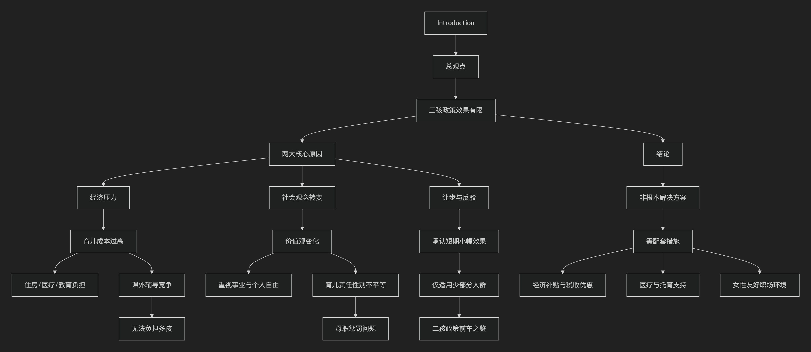

### T1: China has announced that it will allow couples to have up to three children. To what extent will this policy boost birth rates? Provide reasons to support your answer

### Deep dive into the topic

- **Core question:** To what extent will this three-child policy increase the birth rate?

- **Task requirements:** Give the “extent” you think the effect is (e.g. a significant boost, a limited impact, a negligible effect), and provide sufficient reasons to support your point of view.

- **Key point:** The question "To what extent" requires you to not simply answer "yes" or "no", but to conduct a layered and nuanced analysis. A good answer will usually admit that it may have a certain effect, but will focus more on analyzing its limitations.

### Prepared manuscripts

#### Introduction: directly express my opinion: It has an effect, but it is very limited

> [!note] Oral answer type
> Thank you for the question. The introduction of the three-child policy is indeed a significant move by the Chinese government to address/solve its demographic challenges, namely the aging population.
>
> However, in my opinion, this policy, on its own, will likely have a very limited impact on boosting the nation's birth rates.
>
> I hold this view for several critical **socio-economic** reasons.

> [!note] News broadcast type
> China recently announced a major policy change, now allowing couples to have up to three children. This policy is designed to address serious population challenges, especially the country's aging population.
>
> However, many experts agree that this policy by itself will likely have a very limited impact on raising the birth rate.
>
> There are several strong social and economic reasons for this view.

#### Reason 1: Economic Pressures

 **First and foremost, the primary obstacle is the prohibitive(high) cost of raising children in modern China.** (Raising children is very expensive)

For many urban families, the financial(economic) burden of housing, healthcare, and particularly education, is already immense.（房子，医疗，教育已经开销很大了）

The competition in education is incredibly fierce, forcing parents to invest heavily in extracurricular activities for even one child. （为课外辅导出钱）
  
Therefore, the idea of stretching these finite resources to raise two, let alone three children, is simply not a viable option for the majority of couples.

#### Reason 2: Shifting Social Norms

**Secondly, we've witnessed a profound shift in societal norms and individual aspirations.** Unlike previous generations, many young people today prioritize their careers, personal freedom, and quality of life. The traditional value of having a large family has faded. Furthermore, the burden of childcare still disproportionately falls on women. Many women are reluctant to have more children for fear of sacrificing their career progression, a phenomenon often referred to as the 'motherhood penalty'. Without adequate institutional support, like affordable childcare and longer paternity leave, this remains a major deterrent.

#### Concession (让步)

**(Concession & Rebuttal)** "**Of course, I'm not suggesting the policy will have zero effect.** It will certainly allow couples who already desired a third child to fulfill their wish. This might create a small, short-term bump in the birth rate. **However, this group represents a small fraction of the population, and this effect is unlikely to reverse the overall downward trend.** The lukewarm response to the two-child policy implemented earlier serves as a telling precedent."

#### Conclusion(总结)

"**In conclusion, while relaxing the family planning policy is a necessary step, it's far from a silver bullet.** The root causes of low fertility rates are not legal restrictions but deep-seated economic and social issues. Therefore, **to what extent this policy can succeed hinges entirely on whether it is accompanied by a comprehensive package of supporting measures.** These must include financial subsidies, tax breaks, improved maternal and child healthcare, and most importantly, creating a more female-friendly work environment. Without these substantive changes, the three-child policy will likely remain more of a headline than a solution."
