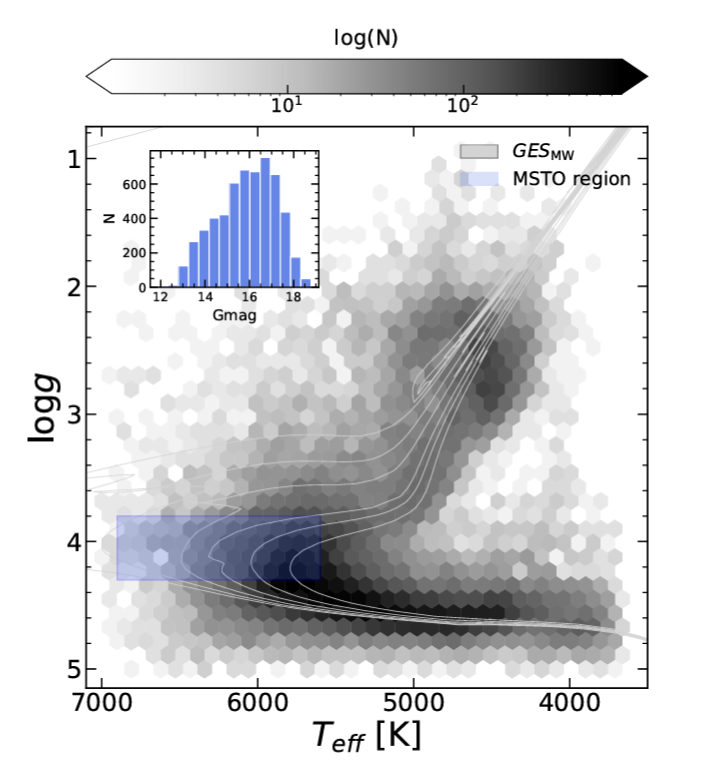
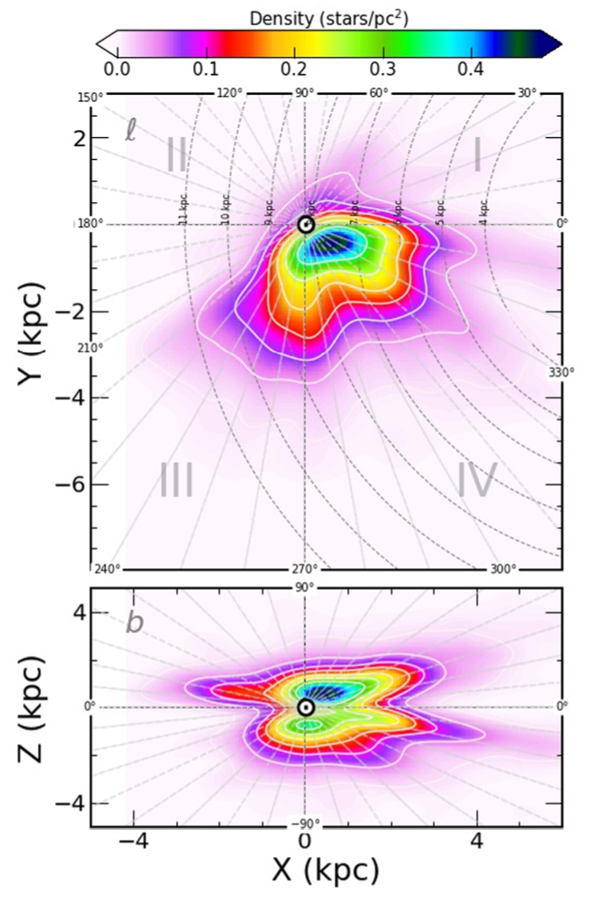

### The Galactic inner spiral arms revealed by the Gaia ESO Survey chemical abundances

### Original Text of the Paper

[The Galactic inner spiral arms revealed by the Gaia ESO Survey chemical abundances](https://vip.123pan.cn/1823290578/13622161)

### Summary
This paper utilizes the chemical abundance data from the Gaia-ESO Survey (GES). For the first time, it reveals the structural characteristics of the spiral arms within the Milky Way through chemical tracers such as [Fe/H] and [Mg/Fe], and explores their significance for the formation and evolution of galaxies.

>[!note] The Gaia-ESO Survey
>**The Gaia-ESO Survey** refers to an important astronomical observation project.
>
>It combines the Gaia space telescope of the European Space Agency and the ground-based observation equipment of the European Southern Observatory (ESO) for observations. This survey aims to conduct in-depth research on the structure, formation, and evolution of the Milky Way by **accurately measuring various data of stars, such as their positions, distances, motions, and chemical compositions**.

### Research Background

- Traditionally, the spiral structure of the Milky Way is studied through stellar density, kinematics, and gas distribution, but the chemical abundances (especially in the inner galactic region) have not been fully explored.

- Recently, data such as Gaia DR3 have shown that chemical abundances can effectively trace spiral arms. For example, the metallicity is related to the distribution of young stars.

### Methods and Data

- **Data source**: Approximately 5,000 thin-disk main-sequence turnoff stars ([Fe/H] > -0.5) from the GES survey, covering the inner disk of the Milky Way (4 - 10 kiloparsecs), with a focus on analyzing the Scutum, Sagittarius, and Norma arms.

>[!note] Thin disk main-sequence turnoff stars
>The "thin disk main sequence turn-off stars" refer to those stars within the thin disk region of the Milky Way galaxy that **transition from the main sequence phase to other evolutionary phases** on the Hertzsprung - Russell diagram. In the structure of the Milky Way galaxy, **the thin disk is one of the main components**.
>
>**Main sequence stars are stars in the hydrogen nuclear fusion stage.** When the hydrogen fuel in the core of a main sequence star is gradually consumed, the characteristics of the star such as its structure and luminosity will change, and it will start to leave the main sequence stage. The stars in this transition stage are called main sequence turnoff stars. For example, in the thin disk region, some stars with moderate mass, after long - term hydrogen nuclear fusion, begin to transform into stages such as red giants. These are the thin - disk main sequence turnoff stars.

- **Analysis methods**:

    -  Construct spatial distribution maps of [Fe/H], [Mg/H], and [Mg/Fe] to detect chemical overdensities associated with spiral arms.

    - **Compare the two - dimensional chemical evolution models of Spitoni et al. (2023) and Barbillon et al. (2024)** to simulate the impact of spiral arms on the abundance distribution.

### Main findings

1. **Association between chemical abundance and spiral arms**:

    - **Enhancement of metallicity**: [Fe/H] is significantly enriched in the Scutum and Sagittarius arm regions, reflecting more active star - formation activities within the spiral arms.

    - **Low abundance of [Mg/Fe]**: The [Mg/Fe] is lower in the spiral arm regions. Due to the difference in nucleosynthesis time - scales of iron (dominated by SNe Ia) and magnesium (dominated by SNe II), this supports the hypothesis that spiral arms promote delayed iron enrichment.

 Distribution of Stellar Parameters in the Data Sample of the Gaia-ESO Survey (GES) 

2. **Discovery of sub - structures**:

    - **Horizontal direction**: The Scutum arm bifurcates at a galactic longitude of 320°, which may reflect the inner/outer sub - arm structure, consistent with the spiral arm bifurcation in the dynamic model.

    - **Vertical direction**: Inner arms (such as the Norma) are slightly below the galactic disk plane, while outer arms (such as the Sagittarius) gradually rise, which may be related to the galactic warp.

    - **Branch - line structure**: A branch - line connecting the Scutum and Sagittarius arms (at approximately a galactic longitude of 280°) is found in the [Mg/H] map, similar to the common "feather" structure in spiral galaxies.

The spatial distribution of the stellar density in the Milky Way galaxy

3. **Distribution of open clusters**: Clusters with ages > 500 million years are mostly located in the inter - arm regions, indicating that spiral arms may affect the migration of clusters through dynamic processes.

### Model Validation

- The observed chemical abundance fluctuations (such as the periodic variation in Galactic longitude) are highly consistent with the transient spiral arm model (assuming full coverage of the corotation radius).

- The model shows that spiral arms drive the azimuthal variation of chemical abundances by enhancing the star formation efficiency, and the fluctuations of short-lived elements (such as Mg) are more significant.

### Conclusions and Significance

- Chemical abundances (especially [Fe/H] and [Mg/Fe]) are effective tools for tracing the spiral arms within the Milky Way, complementing traditional dynamical methods.

- The chemical imprints of the spiral arms support their transient nature, and the forked and branch structures provide new clues for understanding galactic dynamics.

- In the future, combining larger samples (such as Gaia DR4) can further constrain the formation mechanisms of spiral arms and the time scales of chemical evolution.

### Innovation points

- For the first time, the complete structure of the spiral arms in the inner Milky Way is revealed through chemical abundances.

- By combining vertical direction analysis, it is proposed that the complex stratification of the inner arms may be related to the galactic evolutionary history.

- Provide observational constraints for the chemical - kinetic joint model and promote multi - tracer research.
