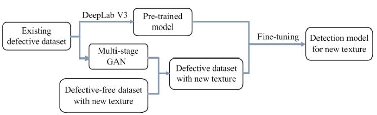
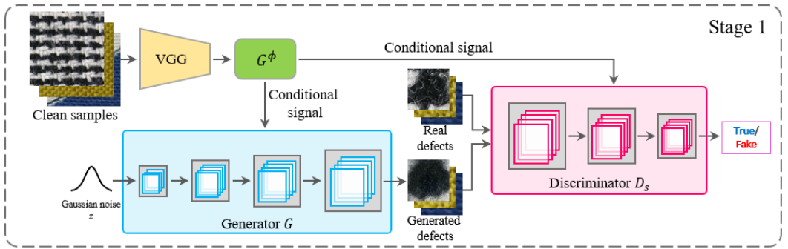
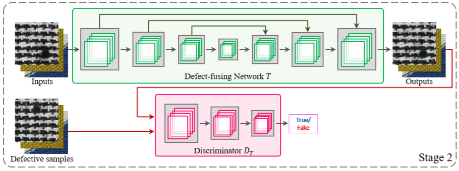
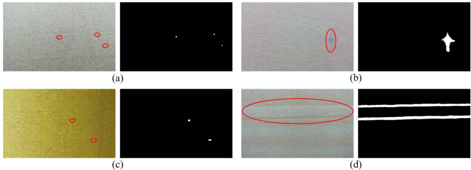
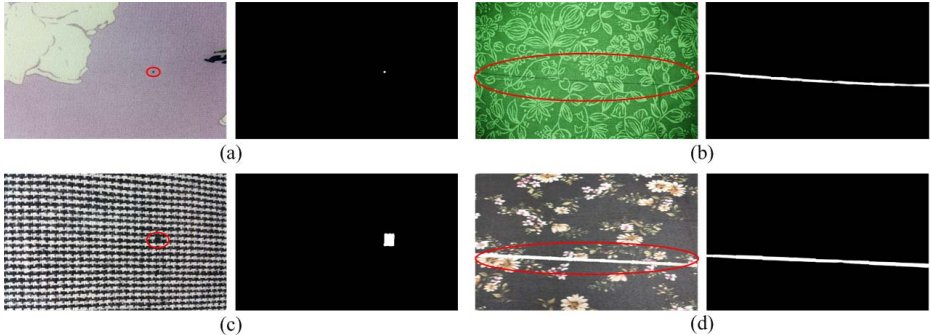

### 关于布匹瑕疵检测的GAN或者扩散模型

#### Multistage GAN for Fabric Defect Detection（用于织物缺陷检测的多阶段生成对抗网络）

| 属性 | 内容 |
|------|------|
| 领域 | 计算机视觉 (Computer Vision)<br>工业质检 (Industrial Quality Inspection)<br>深度学习 (Deep Learning)<br>织物缺陷检测 (Fabric Defect Detection) |
| 期刊/会议 | IEEE TRANSACTIONS ON IMAGE PROCESSING (TIP), VOL. 29 |
| 发表年份 | 2020 |

论文没有选择像YOLO或Faster-RCNN这类在物体周围画框的“目标检测”网络，因为布料上的瑕疵形状、大小极不规则，用框很难框好 。他们选择了一个语义分割网络，即DeepLab V3 （我们则为RT-DETR识别）。

>[!note] 语义分割网络
> 语义分割网络（Semantic Segmentation Network）是计算机视觉中的一类深度学习模型，用于**实现​​像素级分类**​​，即对图像中的​​每个像素​​分配一个类别标签（如“人”“车”“天空”等），从而将图像划分为具有语义意义的区域。与目标检测（框出物体）和实例分割（区分同类物体的不同个体）不同，语义分割不区分同一类别的不同实例，仅关注像素的语义归属。

论文最创新的部分。他们不满足于仅仅检测已知的瑕疵，而是要**让模型能适应全新的布料**，旨在合成更多具有不同纹理（即背景）的有缺陷样本。因此，这些合成的有缺陷样本可被视为检测模型的额外训练样本，以进一步提高其性能。



具体来说，就是用一个GAN来“伪造”带有瑕疵的新布料图片，然后把这些伪造的图片喂给第一部分的检测网络，对其进行**微调 (Fine-tuning)**，让它获得识别新布料上瑕疵的能力 。

论文的三阶段实现逻辑：

1. **条件生成网络**：训练cGAN学习缺陷与织物纹理的条件关系，基于新纹理生成匹配的缺陷模式
2. **缺陷融合网络**：将生成的缺陷自然融合到目标织物背景中，确保视觉真实性
3. **模型微调**：使用合成的缺陷样本对预训练分割模型进行适应性训练，提升新织物缺陷检测能力

##### GAN网络的基本训练原理

GAN（生成对抗网络）的训练过程是一个经典的**零和博弈**（Zero-sum Game），涉及两个神经网络的对抗学习：

###### 核心组件

**生成器 G (Generator)**：
- 输入：随机噪声向量 $z \sim p_z(z)$（通常为高斯分布）
- 输出：生成的假图像 $G(z)$
- 目标：生成尽可能逼真的图像来"欺骗"判别器

**判别器 D (Discriminator)**：
- 输入：真实图像 $x \sim p_{data}(x)$ 或生成图像 $G(z)$
- 输出：输入图像为真实图像的概率 $D(x) \in [0,1]$
- 目标：准确区分真实图像和生成图像

###### 损失函数详细分析

**判别器的目标函数**：
判别器D希望最大化其分类准确性，具体表现为：
- 对于真实图像 $x$：希望 $D(x) \rightarrow 1$，即 $\log D(x) \rightarrow 0$
- 对于生成图像 $G(z)$：希望 $D(G(z)) \rightarrow 0$，即 $\log(1-D(G(z))) \rightarrow 0$

因此判别器要**最大化**：
$$L_D = \mathbb{E}_{x \sim p_{data}}[\log D(x)] + \mathbb{E}_{z \sim p_z}[\log(1 - D(G(z)))]$$

**生成器的目标函数**：
生成器G希望"欺骗"判别器，使其将生成图像误判为真实图像：
- 希望 $D(G(z)) \rightarrow 1$，即 $\log(1-D(G(z))) \rightarrow -\infty$

因此生成器要**最小化**：
$$L_G = \mathbb{E}_{z \sim p_z}[\log(1 - D(G(z)))]$$

###### 完整的Min-Max博弈

将两个目标结合，形成经典的Min-Max优化问题：
$$\min_G \max_D V(D, G) = \mathbb{E}_{x \sim p_{data}}[\log D(x)] + \mathbb{E}_{z \sim p_z}[\log(1 - D(G(z)))]$$

这意味着：
- **外层最小化**：生成器G试图最小化目标函数
- **内层最大化**：判别器D试图最大化目标函数

###### PyTorch实现示例

```python
import torch
import torch.nn as nn
import torch.optim as optim

# 定义损失函数
criterion = nn.BCELoss()  # Binary Cross Entropy Loss

# 优化器
optimizer_D = optim.Adam(discriminator.parameters(), lr=0.0002, betas=(0.5, 0.999))
optimizer_G = optim.Adam(generator.parameters(), lr=0.0002, betas=(0.5, 0.999))

# 训练循环
for epoch in range(num_epochs):
    for i, (real_images, _) in enumerate(dataloader):
        batch_size = real_images.size(0)
        
        # 创建标签
        real_labels = torch.ones(batch_size, 1)   # 真实图像标签 = 1
        fake_labels = torch.zeros(batch_size, 1)  # 生成图像标签 = 0
        
        # ============= 训练判别器 =============
        optimizer_D.zero_grad()
        
        # 计算真实图像的损失: log(D(x))
        outputs_real = discriminator(real_images)
        d_loss_real = criterion(outputs_real, real_labels)
        
        # 生成假图像
        noise = torch.randn(batch_size, latent_dim)
        fake_images = generator(noise)
        
        # 计算生成图像的损失: log(1-D(G(z)))
        outputs_fake = discriminator(fake_images.detach())  # detach()防止梯度传播到G
        d_loss_fake = criterion(outputs_fake, fake_labels)
        
        # 判别器总损失
        d_loss = d_loss_real + d_loss_fake
        d_loss.backward()
        optimizer_D.step()
        
        # ============= 训练生成器 =============
        optimizer_G.zero_grad()
        
        # 生成器希望判别器将假图像判定为真
        outputs_fake = discriminator(fake_images)
        g_loss = criterion(outputs_fake, real_labels)  # 注意这里用real_labels!
        
        g_loss.backward()
        optimizer_G.step()
```

##### 多阶段GAN

###### 阶段一：基于cGAN的纹理条件化瑕疵生成



该阶段的核心目标是学习一个条件概率分布 (conditional probability distribution) $p(\text{defect}|\text{texture})$。换言之，我们不寻求生成任意的、随机的瑕疵，而是期望根据输入的一个具体布料纹理（texture），**生成一个在视觉上与该纹理相匹配的瑕疵（defect）**。为此，系统采用了一个条件生成对抗网络 (Conditional GAN, **cGAN**)。

1. **纹理风格的数学表征 (Mathematical Representation of Texture Style)**：

- **特征提取器 (Feature Extractor)**：使用一个在大型图像数据集（如ImageNet）上预训练好 (pre-trained) 的VGG网络作为固定的、非学习的特征提取器，记为 $\phi$。对于一个输入的无瑕疵布料块图像 $\varnothing$，VGG网络会输出一系列中间层的**特征图 (Feature Maps)**。

- **格拉姆矩阵 (Gram Matrix)**：格拉姆矩阵被用来捕捉特征图中的二阶统计量，从而有效地表征纹理风格。其计算过程如下：

    1. 从特征提取器$\phi$ 中选取第 $j$ 层的激活输出 $\phi_j(x)$，其维度为 $C_j \times H_j \times W_j$，其中 $C$ 是通道数，$H$ 和 $W$ 分别是特征图的高度和宽度。

    2. 将该特征图$\phi_j(x)$ 重塑 (reshape) 为一个二维矩阵 $\psi$，其维度为 $C_j \times (H_j W_j)$。

    3. 该特征图的格拉姆矩阵$G^{\phi}(x)$ 定义为其与自身转置的点积，并进行归一化：

    $$
    G^{\phi}(x) = \frac{\psi \psi^T}{C_j H_j W_j}
    $$

    最终得到的$G^{\phi}(x)$ 是一个 $C_j \times C_j$ 的矩阵。该**矩阵的每一个元素 $(m, n)$ 表示第 $m$ 个特征通道与第 $n$ 个特征通道之间的相关性 (correlation)**。这种相关性信息捕捉了纹理的内在结构，而忽略了特征在空间中的具体位置，因此是表征“风格”的理想选择。这个 $G^{\phi}(x)$ 矩阵就被用作后续cGAN的**条件信号** (conditional signal)。

2. **条件GAN (cGAN) 的对抗性训练**

- **生成器 (Generator, $G$)**：其输入不再仅仅是一个从先验噪声分布 $p_z$ 中采样的潜在向量 $z$，同时还接收上述计算得到的条件信号——格拉姆矩阵 $G^{\phi}$。其目标是学习一个映射 $G: (z, G^{\phi}) \rightarrow x'$，生成一个伪瑕疵图像 $x'$。

- **判别器 (Discriminator, $D_s$)**：其输入是一个数据对 (图像，条件)。它需要判断这个数据对是真实的（即一个从真实数据集中采样的瑕疵图像及其对应的风格矩阵），还是伪造的（即由G生成的瑕疵图像和其所依据的风格矩阵）。

- **目标函数 (Objective Function)**：整个对抗训练过程的目标函数定义为如下的条件对抗损失 (conditional adversarial loss)：

$$
\min_G \max_{D_s} \mathcal{L}(D_s, G) = \mathbb{E}_{x \sim p_{data}}[\log D_s(x, G^{\phi})] + \mathbb{E}_{z \sim p_z}[\log(1 - D_s(G(z), G^{\phi}))]
$$

通过这个对抗过程，生成器 $G$ 被迫学习如何根据输入的风格矩阵 $G^{\phi}$ 来生成一个在判别器 $D_s$ 看来与该风格高度匹配的、无法分辨真伪的瑕疵图像。最终，训练好的生成器便掌握了根据任意新型布料纹理生成合理瑕疵的能力。

###### 阶段二：基于对抗性学习的瑕疵融合网络



在阶段一生成了与特定纹理风格相匹配的、独立的瑕疵块之后，若直接将其通过简单的图像叠加（如“剪切-粘贴”）方式放置于无瑕疵的布料图像上，会产生明显的边缘伪影和不自然的过渡，无法生成用于训练的高保真样本 。阶段二的目标就是解决这个问题，通过一个专门设计的**瑕疵融合网络 (Defect-fusing Network)**，记为**T**，将生成的瑕疵无缝地、逼真地融入到目标背景中 。

1. **网络架构与训练范式**

此阶段本质上是一个**图像到图像翻译** (Image-to-Image Translation) 任务，其训练框架同样基于生成对抗网络。

- 输入与输出：
  1. 首先，从真实的瑕疵样本中裁剪掉瑕疵区域，形成带有**空白窗口 (blank windows)** 的无瑕疵背景图像。
  2. 然后，将阶段一中生成的瑕疵块进行尺寸调整，并粘贴到这些空白窗口中，构成一个带有生硬边界的**不完美输入图像 (imperfect inputs)**，记为 $x$。
  3. 融合网络 $T$ 接收这个不完美的图像 $x$ 作为输入，其目标是输出一张修复了边界、内容融合自然的**伪造样本 (fake image)** $T(x)$。

- 对抗性训练框架：

    - **生成器 (Generator)**：在此阶段，瑕疵融合网络 $T$ 扮演生成器的角色。

    - **判别器 (Discriminator)**：引入一个新的判别器 $D_T$，其任务是区分真实的瑕疵样本（记为 $y$，直接从原始数据集中获取）和由融合网络 $T$ 生成的伪造样本 $T(x)$。判别器 $D_T$ 被训练来专门检查瑕疵与背景的连接区域，而融合网络 $T$ 则被迫学习如何生成更加平滑和真实的融合效果以欺骗 $D_T$。

    - **对抗性损失 (Adversarial Loss)**：此处的最小-最大博弈目标函数定义如下：

    $$
    \min_T \max_{D_T} \mathcal{L}(D_T, T) = \mathbb{E}_{y \sim p_y}[\log D_T(y)] + \mathbb{E}_{x \sim p_x}[\log(1 - D_T(T(x)))]
    $$

    其中，$y \sim p_y$ 代表从真实瑕疵样本分布中采样，$x \sim p_x$ 代表从上述构建的不完美输入图像分布中采样。

##### 数据集构建

论文构建了两个专用数据集：

| 数据集类型 | 简单纹理 | 复杂纹理 |
| --- | --- | --- |
| 缺陷类型 | 色斑、油渍、结头、断端 | 色斑、断端、断纱、白条 |
| 训练图像 | 4,232张 | 4,170张 |
| 训练缺陷 | 8,725个 | 6,978个 |
| 测试图像 | 1,057张 | 1,073张 |
| 测试缺陷 | 2,172个 | 1,563个 |

##### 关键实验结果

在简单纹理布料上获得显著优势：



| 缺陷类型 | 本文方法(F-measure) | FCSDA[11] | NCSR[9] | FFT[7] |
| --- | --- | --- | --- | --- |
| 色斑 | 98.0% | 92.0% | 83.0% | 78.4% |
| 油渍 | 98.6% | 96.3% | 89.9% | 83.1% |
| 结头 | 93.9% | 89.2% | 79.2% | 70.3% |
| 断端 | 98.7% | 97.5% | 87.9% | 80.2% |
| 平均 | 96.2% | 91.9% | 82.6% | 75.0% |

在复杂纹理上，展现独特优势：



| 缺陷类型 | 本文方法(F-measure) | 对比方法 |
| --- | --- | --- |
| 色斑 | 93.4% | 全部失效 |
| 断端 | 96.3% | 全部失效 |
| 断纱 | 91.8% | 全部失效 |
| 白条 | 96.2% | 全部失效 |
| 平均 | 94.4% | N/A |

##### 个人思考

###### 适配性与潜在优势

GAN生成的是带有逼真瑕疵的“图像数据”，这种数据可以被任何以图像为输入的视觉模型使用。

**关键适配步骤**：合成数据的标签生成：

- **论文的方法**：DeepLab V3需要像素级的分割掩码（Mask）作为标签。在论文的框架中，这个掩码是天然存在的，因为GAN在“伪造”瑕疵时，可以精确记录哪些像素被修改了。

- **适配方法**：RT-DETR需要的是**边界框（Bounding Box）** 作为标签。因此，当多阶段GAN生成一张新的、带瑕疵的图片后，需要根据被修改的瑕疵像素区域，**自动计算其最小外接矩形**，并将这个矩形的坐标作为这张合成图片的“真实标签(Ground Truth)”，用于微调RT-DETR模型。

###### 需要研究和验证的问题

1. **标签质量问题**

    对于形态不规则的瑕疵（如油渍、断纱），其最小外接矩形内必然会包含大量完好的背景纹理。RT-DETR在训练时，是否会对这种“标签噪声”敏感？这会不会影响其对瑕疵特征的精确学习？

2. **分布差异问题**

    如果工厂中出现了一种全新的瑕疵类型，这套GAN系统无法生成这种新类型瑕疵。用“已知的瑕疵类型+新的背景”数据来微调模型，是否会反而让模型对真正“未知的瑕疵类型”检测能力下降（即产生过拟合）？

#### GAN-based Defect Synthesis for Anomaly Detection in Fabrics（基于GAN的缺陷合成用于织物异常检测）

| 属性 | 内容 |
|------|------|
| 领域 | 计算机视觉 (Computer Vision)<br>异常检测 (Anomaly Detection)<br>图像到图像翻译 (Image-to-Image Translation)<br>缺陷合成 (Defect Synthesis) |
| 期刊/会议 | 2020 25th International Conference on Pattern Recognition (ICPR) |
| 发表年份 | 2020 |

#### Open-Set Fabric Defect Detection With Defect Generation and Transfer（结合缺陷生成与迁移的开放集织物缺陷检测）

| 属性 | 内容 |
|------|------|
| 领域 | 织物缺陷检测 (Fabric Defect Detection)<br>缺陷生成与迁移 (Defect Generation and Transfer)<br>开放集识别 (Open-Set Recognition)<br>计算机视觉 (Computer Vision) |
| 期刊/会议 | IEEE TRANSACTIONS ON INSTRUMENTATION AND MEASUREMENT (TIM) |
| 发表年份 | 2025 |

##### 实现逻辑

论文提出DGT-DIS-DFC三模块架构：

**1. 缺陷生成与迁移(DGT模块)**
- **输入**：少量真实缺陷样本 + 大量正常布料
- **核心机制**：通过条件编码控制生成
    - 前景编码：$\tilde{E}_{fore}^i = w_d(G(k_d) \odot (M^i \otimes E_{fore}^i))$ 
    - 背景编码：$\tilde{E}_{back}^i = w_n(G(k_n) \odot (M^i \otimes E_{back}^i))$
    - 生成器输入：$\hat{X}^i = [\tilde{E}_{fore}^i, \tilde{E}_{back}^i, N^i]$
- **输出**：大量逼真的合成缺陷样本

**2. 缺陷检测(DIS模块)**  
- **架构**：U-Net编码-解码结构
- **检测原理**：对比原始图像与重建图像差异定位缺陷
- **输出**：像素级缺陷热力图

**3. 缺陷分类(DFC模块)**
- **创新**：基于韦伯分布建模已知缺陷类别特征
- **开放集机制**：计算测试样本与各类特征匹配度，低匹配度判定为未知缺陷
- **输出**：已知类型分类结果或未知缺陷报警

1. **输入编码 (Input Encoding)**

为了实现可控的、高质量的缺陷生成，DGT模块首先对输入信息进行精细的编码：

- **前景缺陷编码 ($E_{fore}$)**：为了表征缺陷的类型信息，系统为每种已知的缺陷类型分配一个标签向量 $y^i \in \mathbb{R}^{1 \times S}$。该向量被扩展成一个 $H \times W$ 的矩阵，从而构成前景缺陷编码 $E_{fore}^i \in \mathbb{R}^{H \times W \times S}$，它携带了缺陷的类别语义。

- **背景纹理编码 ($E_{back}$)**：为了表征背景，使用一个所有值均为1的矩阵作为背景法线编码 $E_{back}^i \in \mathbb{R}^{H \times W \times 1}$。

- **位置与形状注入**：为了控制生成缺陷的位置和形状，系统引入了一个二值缺陷掩码 (Mask) $M^i$。通过哈达玛积 (Hadamard product, $\otimes$)，将掩码信息分别注入到前景和背景编码中：
  $$
  \hat{E}_{fore}^i = M^i \otimes E_{fore}^i 
  $$
  $$
  \hat{E}_{back}^i = M^i \otimes E_{back}^i 
  $$

- **平滑过渡处理**：为了使生成的缺陷与背景之间过渡自然，系统采用随机高斯滤波 (stochastic Gaussian filtering, $\odot$) 对编码进行平滑处理：
  $$
  \tilde{E}_{fore}^i = w_d(G(k_d) \odot \hat{E}_{fore}^i)
  $$
  $$
  \tilde{E}_{back}^i = w_n(G(k_n) \odot \hat{E}_{back}^i)
  $$
  其中 $w_d$ 和 $w_n$ 是随机权重参数。

- **最终生成器输入**：将处理后的前景编码、背景编码与一张无瑕疵图像 $N^i$ 在通道维度上进行拼接 (concatenate)，构成生成器 G 的最终输入 $\hat{X}^i \in \mathbb{R}^{H \times W \times (S+1+3)}$。

2. **生成器 (Generator, G) 的设计与优化**

- **架构**：生成器 G 采用**编码器-解码器 (encoder-decoder)** 结构，并引入**跳跃连接 (skip connections)**，以在生成图像时同时保留背景纹理的细节信息和高级语义信息。

- **损失函数**：生成器的优化目标 $\mathcal{L}_G$ 是一个包含多个部分的复合损失函数。

  1. **像素重构损失**：使用 $L_1$ 范数来约束生成图像 $X_{fake}^i$ 的前景、背景和混合区域，使其与真实图像 $D^i$ 和无瑕疵图像 $N^i$ 保持一致。
  $$
  \mathcal{L}_{fore}^{con} = \| [cite_{start}] X_{fake}^i - D^i \otimes \tilde{E}_{fore}^i \|_1 
  $$
  $$
  \mathcal{L}_{back}^{con} = \| [cite_{start}] X_{fake}^i - N^i \otimes (1 - \tilde{E}_{fore}^i) \|_1 
  $$
  $$
  \mathcal{L}_{mix} = \| [cite_{start}] X_{fake}^i - ((D^i \otimes \tilde{E}_{fore}^i) + N^i \otimes (1 - \tilde{E}_{fore}^i))(1 - \tilde{E}_{back}^i) + N^i \otimes \tilde{E}_{back}^i \|_1 
  $$

  2. **下游任务损失**：这是该框架的一个关键创新。生成器的优化不仅依赖于像素保真度，还受到下游DIS和DFC模块的监督。具体来说，来自DIS模块的分割损失 ($\mathcal{L}_{fake}^{seg}, \mathcal{L}_{real\_fore}^{seg}, \mathcal{L}_{real\_back}^{seg}$) 和来自DFC模块的分类损失 ($\mathcal{L}_{fake}^{cls}, \mathcal{L}_{real}^{cls}$) 被反向传播回来，共同优化生成器 G。这确保了G生成的样本不仅“看起来真”，而且对下游的分割和分类任务是“有用的”。

  3. **总损失**：生成器的总损失是上述所有损失的加权和：
  $$
  \mathcal{L}_G = \alpha_1 \mathcal{L}_{fore}^{con} + \alpha_2 \mathcal{L}_{back}^{con} + \alpha_3 \mathcal{L}_{mix} + \alpha_4 \mathcal{L}_{fake}^{seg} + \alpha_5 \mathcal{L}_{real\_fore}^{seg} + \alpha_6 \mathcal{L}_{real\_back}^{seg} + \alpha_7 \mathcal{L}_{fake}^{cls} + \alpha_8 \mathcal{L}_{real}^{cls}
  $$
