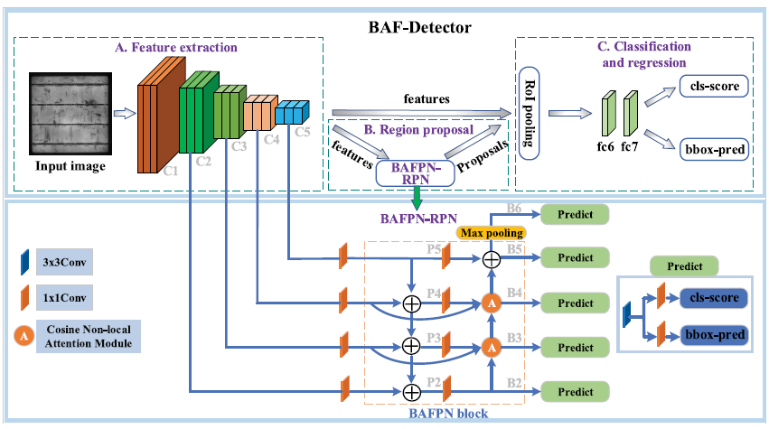

该论文提出了一种名为 **BAF-Detector** 的新型高效卷积神经网络（CNN）检测器，专用于解决光伏（PV）电池电致发光（EL）图像中的多尺度缺陷检测问题。该工作的核心挑战在于克服微小缺陷特征在网络加深过程中易于消失的难题。

其创新性主要体现在以下两个层面：

1. **多头余弦非局部注意力模块 (Multihead Cosine Nonlocal Attention Module)**
    
    作者首先设计了一种新颖的注意力模块，其关键创新在于使用余弦相似度 (Cosine Similarity) 来替代传统非局部网络中的点积相似度 (Dot-product Similarity) 。研究指出，点积相似度在后续通过 softmax 归一化时，若数值过大，易导致分母极大，使得所有位置的权重趋近于零，无法有效区分特征。余弦相似度将计算值限制在 \[-1, 1\]范围内，保留了元素间的差异性，从而能更鲁棒地实现缺陷特征的高亮和复杂背景特征的抑制。
    
1. **双向注意力特征金字塔网络 (BAFPN)**
    
    该研究进一步将上述的余弦注意力模块，集成到一个双向（自顶向下和自底向上）的特征金字塔网络 (FPN) 架构中。BAFPN 在自底向上的路径中引入注意力模块，旨在增强对不同尺度特征的精细化信息捕获，并缩短底层特征（包含精确的定位信号）与顶层特征之间的信息路径。这种结构提升了网络对尺度的鲁棒性，使金字塔的每一层都能共享相似的语义特征。
    

最终，**BAF-Detector** 通过将 BAFPN 模块嵌入到 Faster RCNN+FPN 框架的区域提案网络（RPN）中，构建了一个端到端的检测模型，显著提升了对多尺度光伏缺陷的检测精度。