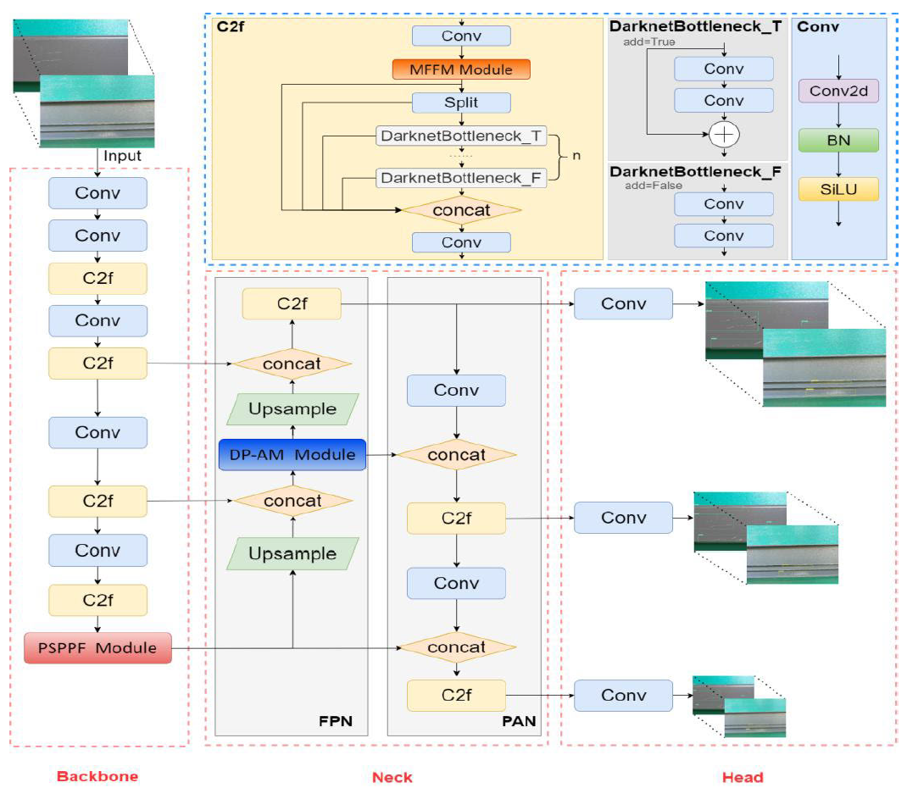

该论文提出了一种名为 **DMPDD-Net** 的新型高效缺陷检测网络，旨在解决铝型材表面缺陷（APSD）检测中的关键挑战，特别是**小尺寸缺陷像素区域**和**高缺陷-背景相似性**问题。

该工作以 **YOLOv8** 为基线网络，其核心创新在于设计并集成了三个关键模块，以增强模型的特征提取和融合能力：

1. 双路径并行注意力机制 (DP-AM)：
    
    为解决传统串行注意力模块（如CBAM）在特征传递过程中可能丢失信息的问题，该研究设计了一种并行的双路径注意力结构。此模块将**通道注意力机制（CAM）和空间注意力机制（SAM）** 并行处理，确保两种注意力流都能访问到完整的输入特征，从而更全面地捕获小尺寸缺陷的信​​号。同时，模块引入了残差跳跃连接，以提升网络的泛化能力。
    
2. 多特征融合机制 (MFFM)：
    
    该机制被创新性地应用于YOLOv8的C2f模块内部。它引入了自学习因子（self-learning factor），对C2f模块中不同分支的特征图进行加权融合，而非简单的拼接。通过采用快速归一化融合策略，该模块能根据不同特征图的贡献度自动分配权重，从而增强对缺陷特征的表达能力。
    
3. 并行空间金字塔池化快速 (PSPPF) 模块：
    
    此模块用于替代YOLOv8中原有的SPPF模块。鉴于原始SPPF仅使用最大池化（MAP）而可能忽略上下文信息，PSPPF创新性地增加了一个并行的**全局平均池化（GAP）** 路径。通过并行融合MAP（保留纹理细节）和GAP（保留上下文信息）的特征，PSPPF能够更有效地保留区分缺陷与背景的关键特征，减少信息损失。
    

综上所述，DMPDD-Net通过这三个模块的协同作用，显著提升了模型在小目标和高相似性背景下的检测精度。