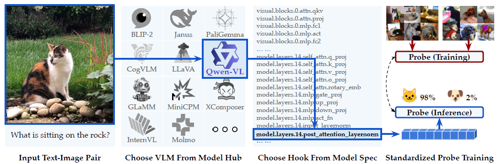

一个旨在通过支持从开源视觉-语言模型（VLM）前向传播过程中任何层提取中间输出来实现对视觉-语言模型的系统性基准测试、分析和解释的工具包。

目前支持16个基础VLM及其30多种变体，并且可以扩展以容纳新模型。

### 特征层确定（探针实验）


#### 原理

通过设计简单的分类任务，来检测和评估模型的向量表示（如句子嵌入）中是否真正捕获了（或开放了）特定的语义信息 。

##### 基本逻辑

1. 首先确定一种我们关心模型是否理解的、具体的语言学信息（例如，语义角色、否定词范围等）。
    
2. 然后，获取模型对一组句子生成的向量表示（embeddings）。
    
3. 设计一个**简单的分类任务**，这个任务被设定为**必须依赖上述的特定语义信息**才能被正确解答 。
    
4. 最后，我们**通过测试这个简单分类器（即“探针”）的准确率，来倒推评估模型的向量表示是否真的包含了我们所关心的信息** 。

> [!note] 原则一：精心控制的数据集（Controlled Datasets）
>
> 探针实验的成败**不**在于任务的难度，而在于数据集的“纯净度” 。
>
> - **目的：** 确保分类器只能通过理解被探测的特定语义信息来获胜，而不是通过走“捷径”（alternative classification heuristic）。
>     
> - 必须确保**正面样本**和**反面样本**在“表面线索”（如关键词）上尽可能相似（这里使用正常-瑕疵布匹图即可）
>     
> - **例：**
>     
>     - **任务：** 探测模型是否理解“教授 (professor)”是“推荐 (recommend)”这个动作的“施动者 (AGENT)” 。
>         
>     - **正面样本：** "the **professor** recommended the student" (教授推荐了学生) 。
>         
>     - **反面样本：** "the student recommended the **professor**" (学生推荐了教授) 。
>         
>     - 两个句子都包含了 "professor" 和 "recommend" 这两个词。一个只懂词汇不懂语法的“作弊”分类器将无法区分它们 。只有理解了句子结构和语义角色（谁推荐了谁）的向量表示，才能让分类器正确区分这两个例子。

> [!note] 原则二：简单的分类器（Simple Classification Tasks）
>
> 探针实验刻意使用**简单的分类器**，例如论文中使用的逻辑回归（logistic regression classifier） 。
>
> - **目的：** 我们不是要测试一个强大的分类器（如深度神经网络）能否学会这个任务；我们是要诊断信息是否已经存在于模型（如 Qwen-VL）的向量中，并且可以被轻松提取 。
> - 如果必须用一个非常复杂的探针才能成功，那可能意味着信息在原始向量中是高度纠缠或隐藏的，甚至可能是探针模型自己“重新学习”了该信息，而不是从向量中“解码”出来的。

##### 主探针 (Main Probe)

- 在**真实、正确的标签**上进行训练。
    
    - 例：`visual.blocks.31` 层提取的“正常图像”特征 $\rightarrow$ 标签 0
        
    - 例：`visual.blocks.31` 层提取的“异常图像”特征 $\rightarrow$ 标签 1
    
- 衡量“VLM特征”与“探针分类器（MLP）”**两者结合**能达到的最佳性能。
    
- **问题：** 如果主探针准确率很高（比如98%），我们无法确定这个功劳是VLM的（特征好）还是MLP的（MLP模型自己找到了某种捷径或模式）。

##### 控制探针 (Control Probe)

- 使用与主探针**完全相同的VLM特征**，但在**随机打乱的标签**上进行训练。
    
    - 例：`visual.blocks.31` 层提取的“正常图像”特征 $\rightarrow$ 标签 1 (随机分配)
        
    - 例：`visual.blocks.31` 层提取的“异常图像”特征 $\rightarrow$ 标签 0 (随机分配)
    
- 衡量探针分类器（MLP）**在VLM特征完全无效（因为标签是随机的）的情况下，仅凭其自身的模型容量能“死记硬背”达到的最高准确率**。
    
- **意义：** 这为我们设定了一个“作弊”的基准线。如果一个MLP仅靠记忆就能在随机任务上达到55%的准确率，那么这个55%就是“噪音”和“虚假模式”的水平。

##### 两者对比

探针实验的结论**不看绝对准确率，而是看两者之间的差距**：

> “主探针相对于控制探针的统计显著优势表明 VLM 编码了任务相关的信息，而没有优势则意味着探针依赖其自身的能力来记忆虚假模式。”

###### 情景一：实验成功

- **主探针准确率：** 98%
    
- **控制探针准确率：** 51% (接近随机猜测)
    
- **结论：** 两者差距巨大。这**证明了**是 VLM 的特征（`visual.blocks.31`）中**真正编码了“正常 vs 异常”的有效信息** 6。主探针的成功是靠VLM的特征，而不是靠MLP自己。
    

###### 情景二：实验失败

- **主探针准确率：** 98%
    
- **控制探针准确率：** 95%
    
- **结论：** 两者差距极小。这**证明了** VLM 的特征根本没用。主探针之所以能达到98%，完全是因为MLP探针模型本身（例如参数量足够多）**过度拟合，死记硬背了整个训练集** 7。控制探针在随机标签上也达到了几乎一样的高分，彻底戳穿了这一点。

#### 实验

在蒸馏之前，首先要确定从教师VLM的<span style="background:rgba(74, 82, 199, 0.2)">哪一层</span>提取特征。

- 使用 VLM-LENS 提取教师VLM**不同层**的特征。

提取的特征层：

```yaml
modules:
  # 语言模型（多模态）的中间层 (论文范例)
  - model.layers.14.post_attention_layernorm

  # 语言模型（多模态）的最后层 (论文范例)
  - model.layers.27.post_attention_layernorm

  # 视觉编码器的中间层
  - visual.blocks.15.norm2

  # 视觉编码器的最后层
  - visual.blocks.31.norm2

  # 视觉特征融合后的最终输出
  - visual.merger.mlp.2
```

在这些特征上训练一个简单的“探针”（比如一个两层的MLP ），看它能否区分正常样本和（少量）异常样本（或您用Diffusion生成的伪异常样本）。

