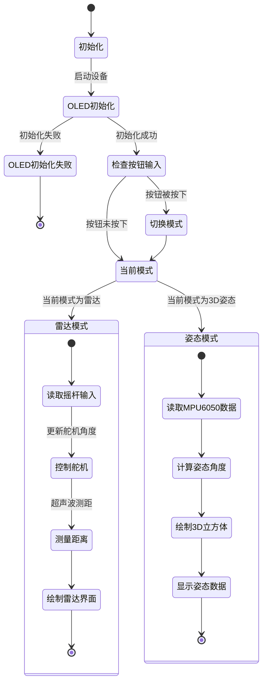

### 工作流程状态图


### 数学原理

### 雷达模式

在雷达模式中，主要涉及超声波测距。通过控制舵机角度和测量超声波的回波时间，我们可以计算出目标的距离。

#### 1. 超声波测距公式

利用时间差，计算出目标的距离：

$$
d = \frac{v \cdot t}{2}
$$

```cpp
int measureDistance() {
    // 将TRIG_PIN设置为低电平，确保触发信号线处于初始状态
    digitalWrite(TRIG_PIN, LOW);
    delayMicroseconds(2); // 等待2微秒，确保信号稳定

    // 将TRIG_PIN设置为高电平，发送10微秒的超声波触发信号
    digitalWrite(TRIG_PIN, HIGH);
    delayMicroseconds(10); // 持续10微秒的高电平信号
    digitalWrite(TRIG_PIN, LOW); //结束触发信号

    // 读取ECHO_PIN的高电平持续时间，最大等待时间为30毫秒
    long duration = pulseIn(ECHO_PIN, HIGH, 30000); 
    if (duration == 0) return 100; // 如果超时未接收到回波信号，返回最大距离100厘米

    // 根据回波时间计算距离，公式为：距离 = 时间 * 声速 / 2
    int distance = duration * 0.034 / 2; 
    // 将计算出的距离限制在0到100厘米之间
    return constrain(distance, 0, 100);
}
```

- `pulseIn`函数测量超声波的回波时间

#### 2. 舵机角度控制

舵机的角度由摇杆的输入值控制，使用映射函数将摇杆的模拟输入值（$[0, 1023]$）转换为舵机的角度范围（$[0^\circ, 180^\circ]$）。

映射公式为：
$$
\theta = \frac{\text{input} - \text{input}_\text{min}}{\text{input}_\text{max} - \text{input}_\text{min}} \cdot (\theta_\text{max} - \theta_\text{min}) + \theta_\text{min}
$$
其中：

- $\theta$ 是舵机的角度。
- $\text{input}$ 是摇杆的模拟输入值。
- $\text{input}_\text{min}$ 和 $\text{input}_\text{max}$ 是摇杆输入的最小值和最大值（通常为 $0$ 和 $1023$）。
- $\theta_\text{min}$ 和 $\theta_\text{max}$ 是舵机角度的最小值和最大值（通常为 $0^\circ$ 和 $180^\circ$）。

```cpp
int joystickX = analogRead(JOYSTICK_X_PIN);  // 读取摇杆X轴的模拟输入值(0-1023)
int servoAngle = map(joystickX, 0, 1023, 0, 180);  // 将摇杆输入值映射到舵机角度范围(0-180度)
myServo.write(servoAngle);  // 控制舵机旋转到计算出的角度位置
```

#### 3. 雷达显示

根据测得的角度和距离，绘制雷达扫描界面。目标点的坐标使用极坐标转换公式： $$ x = \text{centerX} + r \cdot \cos(\theta) $$ $$ y = \text{centerY} - r \cdot \sin(\theta) $$

```cpp
float radAngle = radians(angle);  // 将角度转换为弧度值，便于三角函数计算
int lineX = centerX + radius * cos(PI - radAngle);  // 计算雷达扫描线末端的X坐标
int lineY = centerY - radius * sin(PI - radAngle);  // 计算雷达扫描线末端的Y坐标
display.drawLine(centerX, centerY, lineX, lineY, SSD1306_WHITE);  // 绘制从中心到末端的雷达扫描线

float scaledDistance = map(distance, 0, 100, 0, radius);  // 将测量的距离(0-100cm)映射到雷达半径范围(0-radius)
int targetX = centerX + scaledDistance * cos(PI - radAngle);  // 根据映射后的距离计算目标点的X坐标
int targetY = centerY - scaledDistance * sin(PI - radAngle);  // 根据映射后的距离计算目标点的Y坐标
display.fillCircle(targetX, targetY, 3, SSD1306_WHITE);  // 在目标位置绘制一个实心圆点表示检测到的物体
```

- 使用三角函数将角度  转换为屏幕上的二维坐标 。
- `drawLine` 和 `fillCircle` 绘制扫描线和目标点。


### 3D姿态模式

在3D姿态模式中，使用MPU6050传感器的加速度计数据来计算设备的姿态角度（Pitch 和 Roll），并通过旋转矩阵将其应用到3D立方体的绘制中。

#### 1. 姿态角度计算

MPU6050 提供的加速度数据包括沿 $x$、$y$ 和 $z$ 轴的分量 $a_x$、$a_y$ 和 $a_z$。利用以下公式可以计算 Pitch 和 Roll：

##### (a) Pitch（俯仰角）计算

Pitch 是设备绕 $y$ 轴的旋转角度，计算公式为：
$$
\text{Pitch} = \arctan\left(-\frac{a_x}{\sqrt{a_y^2 + a_z^2}}\right)
$$

##### (b) Roll（横滚角）计算

Roll 是设备绕 $x$ 轴的旋转角度，计算公式为：
$$
\text{Roll} = \arctan\left(\frac{a_y}{a_z}\right)
$$

其中：

- $a_x$, $a_y$, $a_z$ 是加速度计沿 $x$、$y$、$z$ 轴的加速度分量。
- $\arctan$ 是反正切函数，结果以弧度为单位。

```cpp
int16_t ax, ay, az;  // 定义三个16位有符号整型变量，用于存储加速度计在X、Y、Z轴上的原始数据
mpu.getAcceleration(&ax, &ay, &az);  // 从MPU6050传感器读取加速度计的原始数据，并存储到ax、ay、az变量中

roll = atan2(ay, az) * 180.0 / PI;  // 使用反正切函数atan2计算绕X轴的旋转角度（Roll），将弧度转换为角度
pitch = atan2(-ax, sqrt(ay * ay + az * az)) * 180.0 / PI;  // 使用反正切函数atan2计算绕Y轴的旋转角度（Pitch），将弧度转换为角度
```

#### 2. 坐标旋转矩阵

根据计算出的 Pitch 和 Roll，对3D立方体的顶点进行坐标变换。旋转矩阵是将点绕指定轴旋转的工具。

##### (a) 绕 $x$ 轴旋转

将点绕 $x$ 轴旋转的旋转矩阵为：
$$
R_x =
\begin{bmatrix}
1 & 0 & 0 \\
0 & \cos(\text{Roll}) & -\sin(\text{Roll}) \\
0 & \sin(\text{Roll}) & \cos(\text{Roll})
\end{bmatrix}
$$

##### (b) 绕 $y$ 轴旋转

将点绕 $y$ 轴旋转的旋转矩阵为：
$$
R_y =
\begin{bmatrix}
\cos(\text{Pitch}) & 0 & \sin(\text{Pitch}) \\
0 & 1 & 0 \\
-\sin(\text{Pitch}) & 0 & \cos(\text{Pitch})
\end{bmatrix}
$$

```cpp
float tempY = y * cos(angleX) - z * sin(angleX);
float tempZ = y * sin(angleX) + z * cos(angleX);
float tempX = x * cos(angleY) + tempZ * sin(angleY);
z = -x * sin(angleY) + tempZ * cos(angleY);
y = tempY;
```

#### 3. 组合旋转

将绕 $x$ 轴和 $y$ 轴的旋转组合起来，得到最终的旋转矩阵：
$$
R = R_y \cdot R_x =
\begin{bmatrix}
\cos(\text{Pitch}) & \sin(\text{Roll}) \cdot \sin(\text{Pitch}) & \cos(\text{Roll}) \cdot \sin(\text{Pitch}) \\
0 & \cos(\text{Roll}) & -\sin(\text{Roll}) \\
-\sin(\text{Pitch}) & \sin(\text{Roll}) \cdot \cos(\text{Pitch}) & \cos(\text{Roll}) \cdot \cos(\text{Pitch})
\end{bmatrix}
$$

#### 4. 投影变换

最后，将旋转后的3D坐标投影到2D平面上，使用简单的透视投影：
$$
x_\text{2D} = \frac{x_\text{3D} \cdot \text{scale}}{z_\text{3D} + \text{d}}
$$
$$
y_\text{2D} = \frac{y_\text{3D} \cdot \text{scale}}{z_\text{3D} + \text{d}}
$$
其中：

- $x_\text{3D}$, $y_\text{3D}$, $z_\text{3D}$ 是3D点的旋转坐标。
- $\text{scale}$ 是缩放因子，用于调整投影效果。
- $\text{d}$ 是透视深度参数，用于防止除以零。

```cpp
float scale = 64 / (64 + z);
int projectedX = centerX + int(x * scale * 10);
int projectedY = centerY + int(y * scale * 10);
```