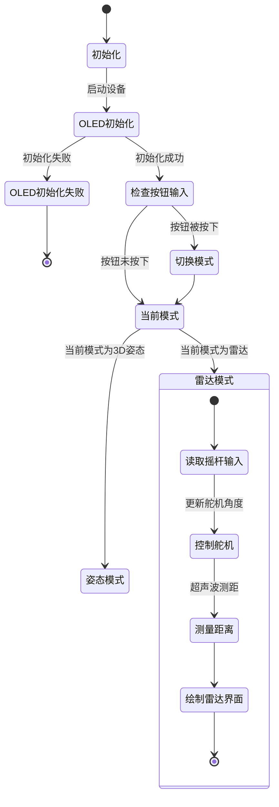

### 工作流程状态图


### 数学原理

### 雷达模式

在雷达模式中，主要涉及超声波测距。通过控制舵机角度和测量超声波的回波时间，我们可以计算出目标的距离。

#### 1. 超声波测距公式

利用时间差，计算出目标的距离：

$$
d = \frac{v \cdot t}{2}
$$

```cpp
int measureDistance() {
    // 将TRIG_PIN设置为低电平，确保触发信号线处于初始状态
    digitalWrite(TRIG_PIN, LOW);
    delayMicroseconds(2); // 等待2微秒，确保信号稳定

    // 将TRIG_PIN设置为高电平，发送10微秒的超声波触发信号
    digitalWrite(TRIG_PIN, HIGH);
    delayMicroseconds(10); // 持续10微秒的高电平信号
    digitalWrite(TRIG_PIN, LOW); //结束触发信号

    // 读取ECHO_PIN的高电平持续时间，最大等待时间为30毫秒
    long duration = pulseIn(ECHO_PIN, HIGH, 30000); 
    if (duration == 0) return 100; // 如果超时未接收到回波信号，返回最大距离100厘米

    // 根据回波时间计算距离，公式为：距离 = 时间 * 声速 / 2
    int distance = duration * 0.034 / 2; 
    // 将计算出的距离限制在0到100厘米之间
    return constrain(distance, 0, 100);
}
```

- `pulseIn`函数测量超声波的回波时间

#### 2. 舵机角度控制

舵机的角度由摇杆的输入值控制，使用映射函数将摇杆的模拟输入值（$[0, 1023]$）转换为舵机的角度范围（$[0^\circ, 180^\circ]$）。

映射公式为：
$$
\theta = \frac{\text{input} - \text{input}_\text{min}}{\text{input}_\text{max} - \text{input}_\text{min}} \cdot (\theta_\text{max} - \theta_\text{min}) + \theta_\text{min}
$$
其中：

- $\theta$ 是舵机的角度。
- $\text{input}$ 是摇杆的模拟输入值。
- $\text{input}_\text{min}$ 和 $\text{input}_\text{max}$ 是摇杆输入的最小值和最大值（通常为 $0$ 和 $1023$）。
- $\theta_\text{min}$ 和 $\theta_\text{max}$ 是舵机角度的最小值和最大值（通常为 $0^\circ$ 和 $180^\circ$）。

```cpp
int joystickX = analogRead(JOYSTICK_X_PIN);  // 读取摇杆X轴的模拟输入值(0-1023)
int servoAngle = map(joystickX, 0, 1023, 0, 180);  // 将摇杆输入值映射到舵机角度范围(0-180度)
myServo.write(servoAngle);  // 控制舵机旋转到计算出的角度位置
```

#### 3. 雷达显示

根据测得的角度和距离，绘制雷达扫描界面。目标点的坐标使用极坐标转换公式： 

$$ x = \text{centerX} + r \cdot \cos(\theta) $$ 

$$ y = \text{centerY} - r \cdot \sin(\theta) $$

```cpp
float radAngle = radians(angle);  // 将角度转换为弧度值，便于三角函数计算
int lineX = centerX + radius * cos(PI - radAngle);  // 计算雷达扫描线末端的X坐标
int lineY = centerY - radius * sin(PI - radAngle);  // 计算雷达扫描线末端的Y坐标
display.drawLine(centerX, centerY, lineX, lineY, SSD1306_WHITE);  // 绘制从中心到末端的雷达扫描线

float scaledDistance = map(distance, 0, 100, 0, radius);  // 将测量的距离(0-100cm)映射到雷达半径范围(0-radius)
int targetX = centerX + scaledDistance * cos(PI - radAngle);  // 根据映射后的距离计算目标点的X坐标
int targetY = centerY - scaledDistance * sin(PI - radAngle);  // 根据映射后的距离计算目标点的Y坐标
display.fillCircle(targetX, targetY, 3, SSD1306_WHITE);  // 在目标位置绘制一个实心圆点表示检测到的物体
```

- 使用三角函数将角度  转换为屏幕上的二维坐标 。
- `drawLine` 和 `fillCircle` 绘制扫描线和目标点。

